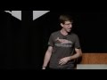

# The Container Revolution: Reflections After the First Decade (2016-09-18)

## Description

Bryan Cantrill, CTO at Joyent

The Container Revolution: Reflections After the First Decade

The meteoric rise of Docker brought containers into the limelight over the past couple of years, but container technology has been powering mobile and web apps for at least a decade. How has the container ecosystem evolved over the past 10 years and where do we go from here as we look toward the future of infrastructure?

## Transcript

[0:00:02](https://youtu.be/xXWaECk9XqM?t=2) hi I'm Brian Cantrell I am the CTO of  
[0:00:06](https://youtu.be/xXWaECk9XqM?t=6) giant giant was a start-up we were  
[0:00:10](https://youtu.be/xXWaECk9XqM?t=10) recently acquired by Samsung  
[0:00:12](https://youtu.be/xXWaECk9XqM?t=12) so I actually now work for Samsung  
[0:00:14](https://youtu.be/xXWaECk9XqM?t=14) Samsung may be a company that you care a  
[0:00:16](https://youtu.be/xXWaECk9XqM?t=16) lot more about today than you did  
[0:00:18](https://youtu.be/xXWaECk9XqM?t=18) yesterday because Samsung and the  
[0:00:21](https://youtu.be/xXWaECk9XqM?t=21) division that bought us one side of  
[0:00:23](https://youtu.be/xXWaECk9XqM?t=23) Samsung is actually the mobile division  
[0:00:24](https://youtu.be/xXWaECk9XqM?t=24) and you might be surprised to learn that  
[0:00:26](https://youtu.be/xXWaECk9XqM?t=26) they actually make mobile devices phones  
[0:00:28](https://youtu.be/xXWaECk9XqM?t=28) phones that I have beautiful cameras  
[0:00:30](https://youtu.be/xXWaECk9XqM?t=30) phones that are water-resistant and  
[0:00:32](https://youtu.be/xXWaECk9XqM?t=32) they've got a very new technology they  
[0:00:34](https://youtu.be/xXWaECk9XqM?t=34) actually have a headphone jack um so I  
[0:00:38](https://youtu.be/xXWaECk9XqM?t=38) was actually kind of overwhelmed with  
[0:00:40](https://youtu.be/xXWaECk9XqM?t=40) like the DMZ yes you'd be like all right  
[0:00:41](https://youtu.be/xXWaECk9XqM?t=41) so which Samsung do I get I'm like  
[0:00:42](https://youtu.be/xXWaECk9XqM?t=42) what's no no no I mean this is the Apple  
[0:00:45](https://youtu.be/xXWaECk9XqM?t=45) how can you screw up a launch this oh  
[0:00:46](https://youtu.be/xXWaECk9XqM?t=46) never mind okay anyway so I now work for  
[0:00:49](https://youtu.be/xXWaECk9XqM?t=49) for Samsung which actually very exciting  
[0:00:51](https://youtu.be/xXWaECk9XqM?t=51) Samsung is going to be using our  
[0:00:52](https://youtu.be/xXWaECk9XqM?t=52) technology do a lot of interesting stuff  
[0:00:53](https://youtu.be/xXWaECk9XqM?t=53) and I'm presenting on on containers  
[0:00:56](https://youtu.be/xXWaECk9XqM?t=56) reflecting after the first decade which  
[0:00:58](https://youtu.be/xXWaECk9XqM?t=58) is not totally accurate  
[0:00:59](https://youtu.be/xXWaECk9XqM?t=59) I actually doctored this title a little  
[0:01:01](https://youtu.be/xXWaECk9XqM?t=61) bit to make it a little less frightening  
[0:01:03](https://youtu.be/xXWaECk9XqM?t=63) because the actual answer is if we click  
[0:01:06](https://youtu.be/xXWaECk9XqM?t=66) her note I have the wrong quicker oh  
[0:01:09](https://youtu.be/xXWaECk9XqM?t=69) there we go the actual answer is it's  
[0:01:12](https://youtu.be/xXWaECk9XqM?t=72) after the third decade I said the first  
[0:01:14](https://youtu.be/xXWaECk9XqM?t=74) decade so I seemed like old enough to be  
[0:01:16](https://youtu.be/xXWaECk9XqM?t=76) interesting without so old to be  
[0:01:18](https://youtu.be/xXWaECk9XqM?t=78) actually terrifying but I'm actually old  
[0:01:20](https://youtu.be/xXWaECk9XqM?t=80) enough to be terrifying and you just  
[0:01:21](https://youtu.be/xXWaECk9XqM?t=81) asked my kids and we are actually three  
[0:01:24](https://youtu.be/xXWaECk9XqM?t=84) decades in two three decades plus in the  
[0:01:27](https://youtu.be/xXWaECk9XqM?t=87) container so when we're containers born  
[0:01:29](https://youtu.be/xXWaECk9XqM?t=89) what's the date of birth of containers  
[0:01:30](https://youtu.be/xXWaECk9XqM?t=90) well we actually have this we actually  
[0:01:32](https://youtu.be/xXWaECk9XqM?t=92) know the date of birth containers going  
[0:01:34](https://youtu.be/xXWaECk9XqM?t=94) through the birth canal March 18 1982 do  
[0:01:38](https://youtu.be/xXWaECk9XqM?t=98) not raise your hand if you were not  
[0:01:39](https://youtu.be/xXWaECk9XqM?t=99) alive I don't want to know um suffice it  
[0:01:42](https://youtu.be/xXWaECk9XqM?t=102) to say a bunch of us were alive okay um  
[0:01:44](https://youtu.be/xXWaECk9XqM?t=104) but on march 18 1982 and they were born  
[0:01:48](https://youtu.be/xXWaECk9XqM?t=108) with this new idea in seventh edition  
[0:01:50](https://youtu.be/xXWaECk9XqM?t=110) unix um called at root and to root the  
[0:01:54](https://youtu.be/xXWaECk9XqM?t=114) idea of to root is changing the root  
[0:01:57](https://youtu.be/xXWaECk9XqM?t=117) directory so it's the root directory you  
[0:01:58](https://youtu.be/xXWaECk9XqM?t=118) you are in a subdirectory or specify a  
[0:02:00](https://youtu.be/xXWaECk9XqM?t=120) subdirectory and now this directory  
[0:02:02](https://youtu.be/xXWaECk9XqM?t=122) becomes the new root directory you are  
[0:02:04](https://youtu.be/xXWaECk9XqM?t=124) in a virtual universe a virtual file  
[0:02:06](https://youtu.be/xXWaECk9XqM?t=126) system where you can now install  
[0:02:08](https://youtu.be/xXWaECk9XqM?t=128) software thinking that it is in the root  
[0:02:11](https://youtu.be/xXWaECk9XqM?t=131) filesystem what it is in fact in a  
[0:02:12](https://youtu.be/xXWaECk9XqM?t=132) subdirectory it's a very good idea and  
[0:02:15](https://youtu.be/xXWaECk9XqM?t=135) don't know why we have it which is kind  
[0:02:17](https://youtu.be/xXWaECk9XqM?t=137) of funny um no one actually knows why  
[0:02:20](https://youtu.be/xXWaECk9XqM?t=140) builds integrated by bill joy bill joy a  
[0:02:23](https://youtu.be/xXWaECk9XqM?t=143) bit of a Space Ranger kind of in a  
[0:02:24](https://youtu.be/xXWaECk9XqM?t=144) constantly in a near-earth orbit um bill  
[0:02:27](https://youtu.be/xXWaECk9XqM?t=147) joy integrated this March 1890 a to  
[0:02:29](https://youtu.be/xXWaECk9XqM?t=149) probably some THC in the system I'm  
[0:02:31](https://youtu.be/xXWaECk9XqM?t=151) guessing memory loss issues you know  
[0:02:34](https://youtu.be/xXWaECk9XqM?t=154) it's it's the 80s it's Berkeley you'd  
[0:02:36](https://youtu.be/xXWaECk9XqM?t=156) have a contact high from doing this work  
[0:02:37](https://youtu.be/xXWaECk9XqM?t=157) but we actually don't know why he did it  
[0:02:39](https://youtu.be/xXWaECk9XqM?t=159) we think he did it  
[0:02:40](https://youtu.be/xXWaECk9XqM?t=160) to develop four to BSD he was developing  
[0:02:44](https://youtu.be/xXWaECk9XqM?t=164) forty BSD on her previous version but  
[0:02:45](https://youtu.be/xXWaECk9XqM?t=165) this is as close as we're going to get  
[0:02:47](https://youtu.be/xXWaECk9XqM?t=167) and to why we actually have true but  
[0:02:50](https://youtu.be/xXWaECk9XqM?t=170) it's an incredibly powerful thing why  
[0:02:51](https://youtu.be/xXWaECk9XqM?t=171) ever we have it it's an incredibly  
[0:02:53](https://youtu.be/xXWaECk9XqM?t=173) powerful idea and it was the birth of a  
[0:02:55](https://youtu.be/xXWaECk9XqM?t=175) very important idea and it was an idea  
[0:02:57](https://youtu.be/xXWaECk9XqM?t=177) that that people saw and they wanted to  
[0:02:59](https://youtu.be/xXWaECk9XqM?t=179) do other things with one of the things  
[0:03:01](https://youtu.be/xXWaECk9XqM?t=181) they wanted to do was CD dot dot out of  
[0:03:03](https://youtu.be/xXWaECk9XqM?t=183) a true environment which actually Italy  
[0:03:05](https://youtu.be/xXWaECk9XqM?t=185) wouldn't able you to route the box so  
[0:03:06](https://youtu.be/xXWaECk9XqM?t=186) there were some early vulnerabilities  
[0:03:08](https://youtu.be/xXWaECk9XqM?t=188) that were kind of quickly cleaned up but  
[0:03:11](https://youtu.be/xXWaECk9XqM?t=191) chroot seemed like it was a it was a  
[0:03:12](https://youtu.be/xXWaECk9XqM?t=192) good step but you could go do a lot more  
[0:03:15](https://youtu.be/xXWaECk9XqM?t=195) you could go build a much more  
[0:03:16](https://youtu.be/xXWaECk9XqM?t=196) comprehensive virtual environment in the  
[0:03:19](https://youtu.be/xXWaECk9XqM?t=199) operating system and so it's fast  
[0:03:20](https://youtu.be/xXWaECk9XqM?t=200) forward to mm with the introduction of  
[0:03:22](https://youtu.be/xXWaECk9XqM?t=202) jails from FreeBSD and this is one of  
[0:03:24](https://youtu.be/xXWaECk9XqM?t=204) these things where all you need to know  
[0:03:26](https://youtu.be/xXWaECk9XqM?t=206) is the name it's a jail okay  
[0:03:28](https://youtu.be/xXWaECk9XqM?t=208) incarceration is the model punishment is  
[0:03:31](https://youtu.be/xXWaECk9XqM?t=211) the model we are trying to punish the  
[0:03:34](https://youtu.be/xXWaECk9XqM?t=214) wayward application in this case FTP D I  
[0:03:36](https://youtu.be/xXWaECk9XqM?t=216) think you have TBD didn't have so many  
[0:03:37](https://youtu.be/xXWaECk9XqM?t=217) vulnerabilities we probably wouldn't  
[0:03:38](https://youtu.be/xXWaECk9XqM?t=218) have jails so I guess thank you FTP D  
[0:03:40](https://youtu.be/xXWaECk9XqM?t=220) for your vulnerabilities and the the  
[0:03:43](https://youtu.be/xXWaECk9XqM?t=223) FreeBSD folks invented jails to be able  
[0:03:45](https://youtu.be/xXWaECk9XqM?t=225) to take effectively untrusted software  
[0:03:47](https://youtu.be/xXWaECk9XqM?t=227) and run it on the computer as route as  
[0:03:50](https://youtu.be/xXWaECk9XqM?t=230) route in quotes it's running as root as  
[0:03:52](https://youtu.be/xXWaECk9XqM?t=232) UID 0 but it can't actually see the  
[0:03:56](https://youtu.be/xXWaECk9XqM?t=236) whole box it can only see what's in its  
[0:03:59](https://youtu.be/xXWaECk9XqM?t=239) little jail its little cell that's all  
[0:04:02](https://youtu.be/xXWaECk9XqM?t=242) that it can see and you know this is  
[0:04:05](https://youtu.be/xXWaECk9XqM?t=245) done for a bunch of reasons I think  
[0:04:06](https://youtu.be/xXWaECk9XqM?t=246) laziness is definitely among them and I  
[0:04:08](https://youtu.be/xXWaECk9XqM?t=248) say that as a compliment I say that is  
[0:04:10](https://youtu.be/xXWaECk9XqM?t=250) one lazy software engineer to another I  
[0:04:11](https://youtu.be/xXWaECk9XqM?t=251) I respect your laziness sir  
[0:04:12](https://youtu.be/xXWaECk9XqM?t=252) the the end the the kind of the laziness  
[0:04:15](https://youtu.be/xXWaECk9XqM?t=255) here is weary don't want to solve the  
[0:04:17](https://youtu.be/xXWaECk9XqM?t=257) UNIX problem of root can do everything  
[0:04:19](https://youtu.be/xXWaECk9XqM?t=259) right so UNIX has this problem that  
[0:04:21](https://youtu.be/xXWaECk9XqM?t=261) wasn't being rude you can annihilate the  
[0:04:22](https://youtu.be/xXWaECk9XqM?t=262) Box you can RM minus RF everything so  
[0:04:24](https://youtu.be/xXWaECk9XqM?t=264) what's actually we actually want to  
[0:04:26](https://youtu.be/xXWaECk9XqM?t=266) solve that problem so instead of  
[0:04:28](https://youtu.be/xXWaECk9XqM?t=268) solving that problem let's create this  
[0:04:29](https://youtu.be/xXWaECk9XqM?t=269) little virtual environment in which UID  
[0:04:31](https://youtu.be/xXWaECk9XqM?t=271) 0 is not UID 0 on the entire box and  
[0:04:34](https://youtu.be/xXWaECk9XqM?t=274) that was a jail and that was a really  
[0:04:37](https://youtu.be/xXWaECk9XqM?t=277) good idea so if true was a good idea now  
[0:04:39](https://youtu.be/xXWaECk9XqM?t=279) jails is a much fuller manifestation of  
[0:04:41](https://youtu.be/xXWaECk9XqM?t=281) it but it is a jail I mean it's not like  
[0:04:43](https://youtu.be/xXWaECk9XqM?t=283) it's not exactly a great place for an  
[0:04:45](https://youtu.be/xXWaECk9XqM?t=285) application to go I mean you actually  
[0:04:47](https://youtu.be/xXWaECk9XqM?t=287) are in jail and there were all sorts of  
[0:04:49](https://youtu.be/xXWaECk9XqM?t=289) things that an application couldn't do  
[0:04:51](https://youtu.be/xXWaECk9XqM?t=291) in jail it's like what you are in jail  
[0:04:52](https://youtu.be/xXWaECk9XqM?t=292) so of course you can't do these things  
[0:04:53](https://youtu.be/xXWaECk9XqM?t=293) things that an application wanted to go  
[0:04:56](https://youtu.be/xXWaECk9XqM?t=296) do and we kind of saw this at Sun I was  
[0:04:59](https://youtu.be/xXWaECk9XqM?t=299) at Sun for 14 years prior coming to join  
[0:05:00](https://youtu.be/xXWaECk9XqM?t=300) and we saw this at Sun and wanted to  
[0:05:02](https://youtu.be/xXWaECk9XqM?t=302) take this to an extreme and how can we  
[0:05:06](https://youtu.be/xXWaECk9XqM?t=306) go not have a jail but how can we have a  
[0:05:09](https://youtu.be/xXWaECk9XqM?t=309) full application environment and we  
[0:05:11](https://youtu.be/xXWaECk9XqM?t=311) developed we called zones so Jones  
[0:05:13](https://youtu.be/xXWaECk9XqM?t=313) develop and Sun add Sun it won't be the  
[0:05:16](https://youtu.be/xXWaECk9XqM?t=316) 2002 era a great paper on this and by  
[0:05:18](https://youtu.be/xXWaECk9XqM?t=318) the way two very good Papers written on  
[0:05:20](https://youtu.be/xXWaECk9XqM?t=320) jails and sones I actually did a papers  
[0:05:23](https://youtu.be/xXWaECk9XqM?t=323) we love on this you can see how long  
[0:05:26](https://youtu.be/xXWaECk9XqM?t=326) I'll talk when not given a countdown  
[0:05:28](https://youtu.be/xXWaECk9XqM?t=328) timer the answer is about 100 about one  
[0:05:30](https://youtu.be/xXWaECk9XqM?t=330) minute and 40 what hour and 43 minutes  
[0:05:31](https://youtu.be/xXWaECk9XqM?t=331) um so you're going to play the control  
[0:05:34](https://youtu.be/xXWaECk9XqM?t=334) Ian drinking game while watching that  
[0:05:36](https://youtu.be/xXWaECk9XqM?t=336) talk on YouTube you might end up in the  
[0:05:38](https://youtu.be/xXWaECk9XqM?t=338) hospital you might end up EMT so that  
[0:05:41](https://youtu.be/xXWaECk9XqM?t=341) it's a long presentation but it would go  
[0:05:43](https://youtu.be/xXWaECk9XqM?t=343) into these two papers that are actually  
[0:05:44](https://youtu.be/xXWaECk9XqM?t=344) incredibly interesting these are vid  
[0:05:46](https://youtu.be/xXWaECk9XqM?t=346) these are two very interesting ideas and  
[0:05:48](https://youtu.be/xXWaECk9XqM?t=348) the idea with zones in Saurus the idea  
[0:05:50](https://youtu.be/xXWaECk9XqM?t=350) with zones is we're going to run an  
[0:05:52](https://youtu.be/xXWaECk9XqM?t=352) application give it a full application  
[0:05:54](https://youtu.be/xXWaECk9XqM?t=354) environment we give it a full user space  
[0:05:56](https://youtu.be/xXWaECk9XqM?t=356) give it a full file system space and so  
[0:05:58](https://youtu.be/xXWaECk9XqM?t=358) on give it a full process space but it  
[0:06:01](https://youtu.be/xXWaECk9XqM?t=361) can only see what's in that zone now  
[0:06:03](https://youtu.be/xXWaECk9XqM?t=363) very importantly you're in a virtual  
[0:06:05](https://youtu.be/xXWaECk9XqM?t=365) operating system but you're running on  
[0:06:08](https://youtu.be/xXWaECk9XqM?t=368) the single one operating system kernel  
[0:06:11](https://youtu.be/xXWaECk9XqM?t=371) so every application that is running in  
[0:06:13](https://youtu.be/xXWaECk9XqM?t=373) a zone is running on the hardware you're  
[0:06:15](https://youtu.be/xXWaECk9XqM?t=375) actually you were getting the full  
[0:06:17](https://youtu.be/xXWaECk9XqM?t=377) performance advantage of being on the  
[0:06:19](https://youtu.be/xXWaECk9XqM?t=379) hardware full tendency advantage and so  
[0:06:21](https://youtu.be/xXWaECk9XqM?t=381) on so we thought this was a great idea  
[0:06:22](https://youtu.be/xXWaECk9XqM?t=382) and we thought we developed this fully  
[0:06:26](https://youtu.be/xXWaECk9XqM?t=386) as it turns out you know sometimes you  
[0:06:29](https://youtu.be/xXWaECk9XqM?t=389) ideas great ideas don't get traction  
[0:06:30](https://youtu.be/xXWaECk9XqM?t=390) right away this is definitely one of  
[0:06:31](https://youtu.be/xXWaECk9XqM?t=391) them some folks saw this is a great idea  
[0:06:33](https://youtu.be/xXWaECk9XqM?t=393) inside a Sun this is kind of withering  
[0:06:35](https://youtu.be/xXWaECk9XqM?t=395) on the vine  
[0:06:36](https://youtu.be/xXWaECk9XqM?t=396) fortunately we open-source the operating  
[0:06:37](https://youtu.be/xXWaECk9XqM?t=397) system which is its own Odyssey we  
[0:06:40](https://youtu.be/xXWaECk9XqM?t=400) open source the operating system and  
[0:06:42](https://youtu.be/xXWaECk9XqM?t=402) others outside of son saw the power of  
[0:06:44](https://youtu.be/xXWaECk9XqM?t=404) zones when Sun itself did not and  
[0:06:46](https://youtu.be/xXWaECk9XqM?t=406) actually one of those companies was  
[0:06:48](https://youtu.be/xXWaECk9XqM?t=408) joining so courtesy of the wayback  
[0:06:50](https://youtu.be/xXWaECk9XqM?t=410) machine here we have the joint page  
[0:06:52](https://youtu.be/xXWaECk9XqM?t=412) circa 2006 it's kind of painful for me  
[0:06:54](https://youtu.be/xXWaECk9XqM?t=414) to read this thing like a like a garbage  
[0:06:57](https://youtu.be/xXWaECk9XqM?t=417) heap from from the Paleolithic era this  
[0:07:00](https://youtu.be/xXWaECk9XqM?t=420) thing is just loaded with information  
[0:07:02](https://youtu.be/xXWaECk9XqM?t=422) for future anthropologists it's like  
[0:07:04](https://youtu.be/xXWaECk9XqM?t=424) hundreds of web 2.0 applications it's  
[0:07:08](https://youtu.be/xXWaECk9XqM?t=428) like Teddy what was web 2.0 what was web  
[0:07:10](https://youtu.be/xXWaECk9XqM?t=430) 1 that I was like nobody knows they're  
[0:07:12](https://youtu.be/xXWaECk9XqM?t=432) all marketing terms but I thought the  
[0:07:14](https://youtu.be/xXWaECk9XqM?t=434) we're lucky making Ajax on this one um  
[0:07:17](https://youtu.be/xXWaECk9XqM?t=437) yeah I mean Ajax weird uh mad so Ajax  
[0:07:21](https://youtu.be/xXWaECk9XqM?t=441) brothers you have Millennials let me  
[0:07:22](https://youtu.be/xXWaECk9XqM?t=442) just educate you for a second Ajax all  
[0:07:24](https://youtu.be/xXWaECk9XqM?t=444) in caps stands for asynchronous  
[0:07:25](https://youtu.be/xXWaECk9XqM?t=445) JavaScript and XML that doesn't make any  
[0:07:28](https://youtu.be/xXWaECk9XqM?t=448) sense of course I doesn't make any sense  
[0:07:29](https://youtu.be/xXWaECk9XqM?t=449) it's like and isn't XML itself in akram  
[0:07:32](https://youtu.be/xXWaECk9XqM?t=452) yes it was a very bad idea but it was  
[0:07:34](https://youtu.be/xXWaECk9XqM?t=454) all about Ajax was the rage back in the  
[0:07:36](https://youtu.be/xXWaECk9XqM?t=456) day back in the web 2.0 day which also  
[0:07:38](https://youtu.be/xXWaECk9XqM?t=458) made no sense moving right along  
[0:07:40](https://youtu.be/xXWaECk9XqM?t=460) as we had accelerators did you know that  
[0:07:42](https://youtu.be/xXWaECk9XqM?t=462) a joint has the largest open Solaris  
[0:07:45](https://youtu.be/xXWaECk9XqM?t=465) installation in the world like whoa two  
[0:07:48](https://youtu.be/xXWaECk9XqM?t=468) computers running open Solaris on B did  
[0:07:52](https://youtu.be/xXWaECk9XqM?t=472) you know that joint minute is a hundred  
[0:07:54](https://youtu.be/xXWaECk9XqM?t=474) and seven terabytes of data now I'm glad  
[0:07:56](https://youtu.be/xXWaECk9XqM?t=476) I heard some terabytes at least is more  
[0:07:58](https://youtu.be/xXWaECk9XqM?t=478) than you have on your phone currently  
[0:07:59](https://youtu.be/xXWaECk9XqM?t=479) but not for long um and I love this  
[0:08:02](https://youtu.be/xXWaECk9XqM?t=482) quote from this company obvious that you  
[0:08:04](https://youtu.be/xXWaECk9XqM?t=484) haven't heard of that joint accelerators  
[0:08:06](https://youtu.be/xXWaECk9XqM?t=486) less scale nothing that you haven't  
[0:08:07](https://youtu.be/xXWaECk9XqM?t=487) heard of it because they renamed  
[0:08:08](https://youtu.be/xXWaECk9XqM?t=488) themselves to Twitter  
[0:08:09](https://youtu.be/xXWaECk9XqM?t=489) Twitter was eight was a huge joint  
[0:08:12](https://youtu.be/xXWaECk9XqM?t=492) customer um  
[0:08:13](https://youtu.be/xXWaECk9XqM?t=493) Twitter was growing exponentially and  
[0:08:15](https://youtu.be/xXWaECk9XqM?t=495) then they were fought the CEO of the  
[0:08:17](https://youtu.be/xXWaECk9XqM?t=497) time likes to brag that he fired them as  
[0:08:19](https://youtu.be/xXWaECk9XqM?t=499) a customer because he was sick of  
[0:08:21](https://youtu.be/xXWaECk9XqM?t=501) dealing with him that CEO was  
[0:08:22](https://youtu.be/xXWaECk9XqM?t=502) subsequently fired  
[0:08:23](https://youtu.be/xXWaECk9XqM?t=503) well they definitely over drinks we can  
[0:08:25](https://youtu.be/xXWaECk9XqM?t=505) compare bad CEO stories um but so  
[0:08:27](https://youtu.be/xXWaECk9XqM?t=507) obvious was a customer and in the end  
[0:08:29](https://youtu.be/xXWaECk9XqM?t=509) these things were great they allowed  
[0:08:31](https://youtu.be/xXWaECk9XqM?t=511) terrific tenancy terrific performance  
[0:08:33](https://youtu.be/xXWaECk9XqM?t=513) terrific scale but something else also  
[0:08:35](https://youtu.be/xXWaECk9XqM?t=515) happened in 2006  
[0:08:36](https://youtu.be/xXWaECk9XqM?t=516) so the an ec2 happened in 2006 at the  
[0:08:40](https://youtu.be/xXWaECk9XqM?t=520) same time I mean almost concurrently  
[0:08:42](https://youtu.be/xXWaECk9XqM?t=522) Amazon announced the limited data for  
[0:08:44](https://youtu.be/xXWaECk9XqM?t=524) ec2 the elastic the Elastic Compute  
[0:08:47](https://youtu.be/xXWaECk9XqM?t=527) cloud course very important and so joint  
[0:08:50](https://youtu.be/xXWaECk9XqM?t=530) was using containers  
[0:08:52](https://youtu.be/xXWaECk9XqM?t=532) what was ec2 using were they using  
[0:08:54](https://youtu.be/xXWaECk9XqM?t=534) tanners oh no no Oh contraire no no and  
[0:08:57](https://youtu.be/xXWaECk9XqM?t=537) this is now we need to do a sad little  
[0:08:58](https://youtu.be/xXWaECk9XqM?t=538) aside a sad tale of woe called hardware  
[0:09:00](https://youtu.be/xXWaECk9XqM?t=540) level virtualization because the  
[0:09:02](https://youtu.be/xXWaECk9XqM?t=542) containers are not the only way to  
[0:09:04](https://youtu.be/xXWaECk9XqM?t=544) virtualize a workload the way they were  
[0:09:07](https://youtu.be/xXWaECk9XqM?t=547) done at Sun and a joint entirely  
[0:09:09](https://youtu.be/xXWaECk9XqM?t=549) multi-tenant safe and so on but there is  
[0:09:11](https://youtu.be/xXWaECk9XqM?t=551) another way to virtualize a workload you  
[0:09:12](https://youtu.be/xXWaECk9XqM?t=552) can actually virtualize not the  
[0:09:14](https://youtu.be/xXWaECk9XqM?t=554) operating system but the hardware and  
[0:09:16](https://youtu.be/xXWaECk9XqM?t=556) what you present to a tenant is not a  
[0:09:18](https://youtu.be/xXWaECk9XqM?t=558) virtual OS and a virtual social system  
[0:09:20](https://youtu.be/xXWaECk9XqM?t=560) call table you present a virtual x86  
[0:09:23](https://youtu.be/xXWaECk9XqM?t=563) microprocessor virtual DRAM virtual NIC  
[0:09:26](https://youtu.be/xXWaECk9XqM?t=566) virtual and I got this I got a prop for  
[0:09:28](https://youtu.be/xXWaECk9XqM?t=568) this a virtual one of these which you  
[0:09:30](https://youtu.be/xXWaECk9XqM?t=570) may again if you're Millennials you  
[0:09:33](https://youtu.be/xXWaECk9XqM?t=573) probably recognize this but your day is  
[0:09:35](https://youtu.be/xXWaECk9XqM?t=575) coming when that when your coworkers  
[0:09:37](https://youtu.be/xXWaECk9XqM?t=577) will not recognize one of these this is  
[0:09:39](https://youtu.be/xXWaECk9XqM?t=579) a floppy disk it's like is it floppy no  
[0:09:41](https://youtu.be/xXWaECk9XqM?t=581) it's off lobby that's a long story but  
[0:09:43](https://youtu.be/xXWaECk9XqM?t=583) it this is a three and a half inch disk  
[0:09:45](https://youtu.be/xXWaECk9XqM?t=585) on and you be egg wow what a relic and  
[0:09:48](https://youtu.be/xXWaECk9XqM?t=588) it is a relic but it's also virtualized  
[0:09:50](https://youtu.be/xXWaECk9XqM?t=590) in every in every virtual machine that  
[0:09:52](https://youtu.be/xXWaECk9XqM?t=592) you run today you have a virtual floppy  
[0:09:55](https://youtu.be/xXWaECk9XqM?t=595) disk it's like but that makes no sense  
[0:09:57](https://youtu.be/xXWaECk9XqM?t=597) you're right doesn't make any sense like  
[0:09:59](https://youtu.be/xXWaECk9XqM?t=599) why would you have that well just kind  
[0:10:01](https://youtu.be/xXWaECk9XqM?t=601) of dead code until it's exploitable  
[0:10:02](https://youtu.be/xXWaECk9XqM?t=602) that's called venom so venom actually  
[0:10:04](https://youtu.be/xXWaECk9XqM?t=604) exploited the virtual floppy disk  
[0:10:05](https://youtu.be/xXWaECk9XqM?t=605) controller in a virtual machine so this  
[0:10:07](https://youtu.be/xXWaECk9XqM?t=607) is serious stuff and it's like it  
[0:10:09](https://youtu.be/xXWaECk9XqM?t=609) doesn't feel like having a virtual  
[0:10:11](https://youtu.be/xXWaECk9XqM?t=611) computer is going to make things any  
[0:10:13](https://youtu.be/xXWaECk9XqM?t=613) faster and it definitely doesn't because  
[0:10:15](https://youtu.be/xXWaECk9XqM?t=615) every tenant now has to have their own  
[0:10:17](https://youtu.be/xXWaECk9XqM?t=617) OS kernel because it's seeing Hardware  
[0:10:20](https://youtu.be/xXWaECk9XqM?t=620) right you need an OS kernel the one on  
[0:10:21](https://youtu.be/xXWaECk9XqM?t=621) hardware and trust me I write a kernel  
[0:10:23](https://youtu.be/xXWaECk9XqM?t=623) curls don't get along with one another  
[0:10:25](https://youtu.be/xXWaECk9XqM?t=625) I mean people write kernels are control  
[0:10:27](https://youtu.be/xXWaECk9XqM?t=627) freaks and operating system kernels do  
[0:10:29](https://youtu.be/xXWaECk9XqM?t=629) not get along well with one another  
[0:10:30](https://youtu.be/xXWaECk9XqM?t=630) these are very fat applications that  
[0:10:32](https://youtu.be/xXWaECk9XqM?t=632) want to control all the resources they  
[0:10:34](https://youtu.be/xXWaECk9XqM?t=634) have and as a result and this is where  
[0:10:36](https://youtu.be/xXWaECk9XqM?t=636) you get to the real the danger of the  
[0:10:39](https://youtu.be/xXWaECk9XqM?t=639) abstraction is that because it will  
[0:10:41](https://youtu.be/xXWaECk9XqM?t=641) consume every resource that you give it  
[0:10:43](https://youtu.be/xXWaECk9XqM?t=643) it's incredibly resource inefficient  
[0:10:46](https://youtu.be/xXWaECk9XqM?t=646) from the perspective of the hypervisor  
[0:10:47](https://youtu.be/xXWaECk9XqM?t=647) that needs to run this stuff it in  
[0:10:49](https://youtu.be/xXWaECk9XqM?t=649) particular in terms of DRAM when you  
[0:10:51](https://youtu.be/xXWaECk9XqM?t=651) give an operating system DRAM it takes  
[0:10:53](https://youtu.be/xXWaECk9XqM?t=653) it the end you are giving heroin to an  
[0:10:56](https://youtu.be/xXWaECk9XqM?t=656) addict  
[0:10:57](https://youtu.be/xXWaECk9XqM?t=657) that's it up the arm it's like hey you  
[0:10:59](https://youtu.be/xXWaECk9XqM?t=659) still have that heroin I gave you two  
[0:11:00](https://youtu.be/xXWaECk9XqM?t=660) years ago it's like no what do you come  
[0:11:03](https://youtu.be/xXWaECk9XqM?t=663) on dude I'm on the fentanyl  
[0:11:05](https://youtu.be/xXWaECk9XqM?t=665) I mean I'm they the so you can't when  
[0:11:07](https://youtu.be/xXWaECk9XqM?t=667) you give D RAM to it to one of these  
[0:11:09](https://youtu.be/xXWaECk9XqM?t=669) guests it's gone from a hypervisors  
[0:11:11](https://youtu.be/xXWaECk9XqM?t=671) perspective even though PS the DRAM  
[0:11:13](https://youtu.be/xXWaECk9XqM?t=673) isn't likely being used when you spin up  
[0:11:16](https://youtu.be/xXWaECk9XqM?t=676) a VM on ec2 on Amazon how much of that  
[0:11:19](https://youtu.be/xXWaECk9XqM?t=679) DRAM do you use and if you're like I use  
[0:11:22](https://youtu.be/xXWaECk9XqM?t=682) every last bit of DRAM there's an ops  
[0:11:24](https://youtu.be/xXWaECk9XqM?t=684) person somewhere that wants to do  
[0:11:26](https://youtu.be/xXWaECk9XqM?t=686) violence to your body because it's  
[0:11:28](https://youtu.be/xXWaECk9XqM?t=688) dangerous to actually exploit every last  
[0:11:30](https://youtu.be/xXWaECk9XqM?t=690) bit of the RAM right you're running very  
[0:11:31](https://youtu.be/xXWaECk9XqM?t=691) close to the wind you're not using every  
[0:11:33](https://youtu.be/xXWaECk9XqM?t=693) bit of Ihram in fact you're probably  
[0:11:35](https://youtu.be/xXWaECk9XqM?t=695) adjusting your estimates such that  
[0:11:37](https://youtu.be/xXWaECk9XqM?t=697) you're only using half right or maybe  
[0:11:39](https://youtu.be/xXWaECk9XqM?t=699) you're using three-quarters the problem  
[0:11:41](https://youtu.be/xXWaECk9XqM?t=701) is that you're handing that estimate on  
[0:11:42](https://youtu.be/xXWaECk9XqM?t=702) to someone else who disgustin doesn't  
[0:11:45](https://youtu.be/xXWaECk9XqM?t=705) trust you and they do a little bit of a  
[0:11:46](https://youtu.be/xXWaECk9XqM?t=706) jackass nice a nice person but yeah  
[0:11:48](https://youtu.be/xXWaECk9XqM?t=708) often get these estimates wrong I'm  
[0:11:50](https://youtu.be/xXWaECk9XqM?t=710) going to multiply this again to get I'm  
[0:11:52](https://youtu.be/xXWaECk9XqM?t=712) going to actually assume that they're  
[0:11:53](https://youtu.be/xXWaECk9XqM?t=713) off by another factor and these factors  
[0:11:55](https://youtu.be/xXWaECk9XqM?t=715) get multiplied together until you have a  
[0:11:57](https://youtu.be/xXWaECk9XqM?t=717) VM that's got a ton of memory doing  
[0:11:59](https://youtu.be/xXWaECk9XqM?t=719) absolutely nothing unless it's running  
[0:12:01](https://youtu.be/xXWaECk9XqM?t=721) Java in which case it's actually garbage  
[0:12:02](https://youtu.be/xXWaECk9XqM?t=722) collecting all the time that's a  
[0:12:04](https://youtu.be/xXWaECk9XqM?t=724) different story  
[0:12:05](https://youtu.be/xXWaECk9XqM?t=725) it does not play well with others it's  
[0:12:08](https://youtu.be/xXWaECk9XqM?t=728) terrible with respect to tenancy and yet  
[0:12:10](https://youtu.be/xXWaECk9XqM?t=730) thanks easy to its de facto in the cloud  
[0:12:12](https://youtu.be/xXWaECk9XqM?t=732) so that's this is just what happened  
[0:12:13](https://youtu.be/xXWaECk9XqM?t=733) Archie was going on in kind of container  
[0:12:16](https://youtu.be/xXWaECk9XqM?t=736) land one container land which was a very  
[0:12:18](https://youtu.be/xXWaECk9XqM?t=738) lonely Island population one population  
[0:12:22](https://youtu.be/xXWaECk9XqM?t=742) largest open Solaris installation in the  
[0:12:24](https://youtu.be/xXWaECk9XqM?t=744) world on in containers at circa 2011 we  
[0:12:27](https://youtu.be/xXWaECk9XqM?t=747) actually um even though we strongly  
[0:12:29](https://youtu.be/xXWaECk9XqM?t=749) believe in containers we actually  
[0:12:31](https://youtu.be/xXWaECk9XqM?t=751) realized we need to do a hardware level  
[0:12:32](https://youtu.be/xXWaECk9XqM?t=752) virtualization as well on because we I  
[0:12:35](https://youtu.be/xXWaECk9XqM?t=755) we've got we couldn't run Linux binary  
[0:12:37](https://youtu.be/xXWaECk9XqM?t=757) so okay let's do hardware level  
[0:12:38](https://youtu.be/xXWaECk9XqM?t=758) virtualization so we can run Windows  
[0:12:39](https://youtu.be/xXWaECk9XqM?t=759) Linux and so on and boy do you thought I  
[0:12:42](https://youtu.be/xXWaECk9XqM?t=762) was a vegetarian before getting a tour  
[0:12:44](https://youtu.be/xXWaECk9XqM?t=764) of the sausage factory you I mean going  
[0:12:47](https://youtu.be/xXWaECk9XqM?t=767) into the sausage factory of hardware  
[0:12:49](https://youtu.be/xXWaECk9XqM?t=769) level virtualization and seeing just how  
[0:12:51](https://youtu.be/xXWaECk9XqM?t=771) bad and archaic it is and you can't do  
[0:12:55](https://youtu.be/xXWaECk9XqM?t=775) anything about it it's the abstractions  
[0:12:56](https://youtu.be/xXWaECk9XqM?t=776) themselves that are actually confining  
[0:12:58](https://youtu.be/xXWaECk9XqM?t=778) it's the fact that you're booting on an  
[0:12:59](https://youtu.be/xXWaECk9XqM?t=779) abstraction that dates from Boca ratone  
[0:13:00](https://youtu.be/xXWaECk9XqM?t=780) in 1979 where the IBM personal computer  
[0:13:02](https://youtu.be/xXWaECk9XqM?t=782) was first develop I mean it's  
[0:13:04](https://youtu.be/xXWaECk9XqM?t=784) unconscionable um you shouldn't have to  
[0:13:05](https://youtu.be/xXWaECk9XqM?t=785) know what real mode is real mode is a  
[0:13:07](https://youtu.be/xXWaECk9XqM?t=787) war crime and yet that every VM boots in  
[0:13:11](https://youtu.be/xXWaECk9XqM?t=791) real mode so we realize that we had to  
[0:13:13](https://youtu.be/xXWaECk9XqM?t=793) go and actually I had the debug an issue  
[0:13:14](https://youtu.be/xXWaECk9XqM?t=794) in real mode in 2011 as reported kbm  
[0:13:17](https://youtu.be/xXWaECk9XqM?t=797) Smart OS like what you and you just have  
[0:13:19](https://youtu.be/xXWaECk9XqM?t=799) to go into like you're safe  
[0:13:21](https://youtu.be/xXWaECk9XqM?t=801) antiquarian Antiques Roadshow kind of  
[0:13:24](https://youtu.be/xXWaECk9XqM?t=804) space like I'm antiquing like I'm not  
[0:13:26](https://youtu.be/xXWaECk9XqM?t=806) actually living this right now I am I am  
[0:13:28](https://youtu.be/xXWaECk9XqM?t=808) enjoy like I'm this is like steampunk i  
[0:13:31](https://youtu.be/xXWaECk9XqM?t=811) am i you know i because if you know like  
[0:13:34](https://youtu.be/xXWaECk9XqM?t=814) if you're trying to treat it's actually  
[0:13:35](https://youtu.be/xXWaECk9XqM?t=815) modern infrastructure you actually go  
[0:13:36](https://youtu.be/xXWaECk9XqM?t=816) insane why are we doing it this way it's  
[0:13:37](https://youtu.be/xXWaECk9XqM?t=817) like no no no we're antiquing we're  
[0:13:39](https://youtu.be/xXWaECk9XqM?t=819) antiquing that's a guarantee okay um  
[0:13:41](https://youtu.be/xXWaECk9XqM?t=821) it's like but but but you're trying to  
[0:13:44](https://youtu.be/xXWaECk9XqM?t=824) treat the table as load-bearing it's  
[0:13:46](https://youtu.be/xXWaECk9XqM?t=826) like yeah but i'm so and we came out of  
[0:13:48](https://youtu.be/xXWaECk9XqM?t=828) that it would actually even stronger  
[0:13:50](https://youtu.be/xXWaECk9XqM?t=830) resolve it's like okay God if I'd if I  
[0:13:52](https://youtu.be/xXWaECk9XqM?t=832) didn't believe in the container I'm  
[0:13:54](https://youtu.be/xXWaECk9XqM?t=834) leaving today nerds going into this very  
[0:13:56](https://youtu.be/xXWaECk9XqM?t=836) very very fervently believe in  
[0:13:57](https://youtu.be/xXWaECk9XqM?t=837) containers fervently believe in Oh  
[0:13:59](https://youtu.be/xXWaECk9XqM?t=839) us-based virtualization this is  
[0:14:00](https://youtu.be/xXWaECk9XqM?t=840) obviously the only answer and indeed wow  
[0:14:03](https://youtu.be/xXWaECk9XqM?t=843) this actually OS virtualization actually  
[0:14:05](https://youtu.be/xXWaECk9XqM?t=845) opens up some really interesting  
[0:14:06](https://youtu.be/xXWaECk9XqM?t=846) possibilities so it's circa 2012 2013  
[0:14:09](https://youtu.be/xXWaECk9XqM?t=849) again the rest of the world had not  
[0:14:10](https://youtu.be/xXWaECk9XqM?t=850) discovered the the long-lost I would  
[0:14:13](https://youtu.be/xXWaECk9XqM?t=853) known as containers so we were kind of  
[0:14:15](https://youtu.be/xXWaECk9XqM?t=855) off on our lonesome at Giant and we had  
[0:14:18](https://youtu.be/xXWaECk9XqM?t=858) this great abstraction in terms of  
[0:14:19](https://youtu.be/xXWaECk9XqM?t=859) containers and we we realized that  
[0:14:21](https://youtu.be/xXWaECk9XqM?t=861) actually this could revolutionize the  
[0:14:23](https://youtu.be/xXWaECk9XqM?t=863) way we do storage because we wanted to  
[0:14:25](https://youtu.be/xXWaECk9XqM?t=865) go build a storage service Allah s3 but  
[0:14:28](https://youtu.be/xXWaECk9XqM?t=868) we do want to just build an s3 and we  
[0:14:30](https://youtu.be/xXWaECk9XqM?t=870) realized that with the power of  
[0:14:31](https://youtu.be/xXWaECk9XqM?t=871) containers we could build a storage  
[0:14:32](https://youtu.be/xXWaECk9XqM?t=872) service like s3 HP puts and gets and so  
[0:14:35](https://youtu.be/xXWaECk9XqM?t=875) on that when you wanted to compute upon  
[0:14:37](https://youtu.be/xXWaECk9XqM?t=877) it you could spin up a container where  
[0:14:40](https://youtu.be/xXWaECk9XqM?t=880) your object actually lives so you can  
[0:14:43](https://youtu.be/xXWaECk9XqM?t=883) actually perform arbitrary computation  
[0:14:45](https://youtu.be/xXWaECk9XqM?t=885) on your object without moving it and  
[0:14:48](https://youtu.be/xXWaECk9XqM?t=888) this is when it this is something that  
[0:14:50](https://youtu.be/xXWaECk9XqM?t=890) seems obvious to you now I can assure  
[0:14:52](https://youtu.be/xXWaECk9XqM?t=892) you it was not obvious to us at the time  
[0:14:54](https://youtu.be/xXWaECk9XqM?t=894) it seems obvious in retrospect but one  
[0:14:56](https://youtu.be/xXWaECk9XqM?t=896) of these ideas that is just like oh my  
[0:14:58](https://youtu.be/xXWaECk9XqM?t=898) god was that in front of us all along  
[0:14:59](https://youtu.be/xXWaECk9XqM?t=899) that is an incredibly powerful idea it  
[0:15:01](https://youtu.be/xXWaECk9XqM?t=901) is a powerful idea so over 2012 and only  
[0:15:04](https://youtu.be/xXWaECk9XqM?t=904) 2013 we built this thing called Manta  
[0:15:06](https://youtu.be/xXWaECk9XqM?t=906) which we later open-source all available  
[0:15:08](https://youtu.be/xXWaECk9XqM?t=908) its ZFS space container based  
[0:15:09](https://youtu.be/xXWaECk9XqM?t=909) internet-facing objects or so like s3  
[0:15:11](https://youtu.be/xXWaECk9XqM?t=911) but offers that power of insights you  
[0:15:14](https://youtu.be/xXWaECk9XqM?t=914) compute which allows you to do all sorts  
[0:15:16](https://youtu.be/xXWaECk9XqM?t=916) of things without actually moving data  
[0:15:19](https://youtu.be/xXWaECk9XqM?t=919) and remember the abstraction that you're  
[0:15:21](https://youtu.be/xXWaECk9XqM?t=921) getting with a container is the  
[0:15:22](https://youtu.be/xXWaECk9XqM?t=922) operating system and by the way this  
[0:15:24](https://youtu.be/xXWaECk9XqM?t=924) operating system UNIX goddamnit  
[0:15:26](https://youtu.be/xXWaECk9XqM?t=926) UNIX is actually let's let's forget our  
[0:15:29](https://youtu.be/xXWaECk9XqM?t=929) kind of petty differences of the UNIX  
[0:15:30](https://youtu.be/xXWaECk9XqM?t=930) wars we all  
[0:15:31](https://youtu.be/xXWaECk9XqM?t=931) we are all believers in eunuchs I mean  
[0:15:33](https://youtu.be/xXWaECk9XqM?t=933) even Redmon's believers music sounds  
[0:15:34](https://youtu.be/xXWaECk9XqM?t=934) actually amazing um UNIX is actually  
[0:15:37](https://youtu.be/xXWaECk9XqM?t=937) built around the idea of ad-hoc data  
[0:15:38](https://youtu.be/xXWaECk9XqM?t=938) processing so UNIX is actually perfect  
[0:15:41](https://youtu.be/xXWaECk9XqM?t=941) for this and this this brings in again  
[0:15:42](https://youtu.be/xXWaECk9XqM?t=942) if you're playing the controlling and  
[0:15:43](https://youtu.be/xXWaECk9XqM?t=943) drinking game you want to be sure to  
[0:15:44](https://youtu.be/xXWaECk9XqM?t=944) take a drink now because we're going to  
[0:15:46](https://youtu.be/xXWaECk9XqM?t=946) do a first reading a reading from the  
[0:15:48](https://youtu.be/xXWaECk9XqM?t=948) book of Doug McElroy McElroy 3:15 on the  
[0:15:53](https://youtu.be/xXWaECk9XqM?t=953) UNIX philosophy so when when UNIX and  
[0:15:56](https://youtu.be/xXWaECk9XqM?t=956) unix-like accelerate 60s early 70s the  
[0:16:05](https://youtu.be/xXWaECk9XqM?t=965) systems that came before UNIX seemed  
[0:16:08](https://youtu.be/xXWaECk9XqM?t=968) unbelievably antiquarian truly  
[0:16:10](https://youtu.be/xXWaECk9XqM?t=970) antiquarian and UNIX actually feels  
[0:16:12](https://youtu.be/xXWaECk9XqM?t=972) modern because it was instead of having  
[0:16:14](https://youtu.be/xXWaECk9XqM?t=974) these massive monoliths it was these  
[0:16:16](https://youtu.be/xXWaECk9XqM?t=976) collections of programs that were  
[0:16:18](https://youtu.be/xXWaECk9XqM?t=978) designed to do each program itself was  
[0:16:21](https://youtu.be/xXWaECk9XqM?t=981) designed to do one thing well and you  
[0:16:23](https://youtu.be/xXWaECk9XqM?t=983) could actually string them together with  
[0:16:25](https://youtu.be/xXWaECk9XqM?t=985) this great idea called pipes and pipes  
[0:16:26](https://youtu.be/xXWaECk9XqM?t=986) were an idea by Doug McElroy Doug  
[0:16:28](https://youtu.be/xXWaECk9XqM?t=988) McElroy is kind of a UNIX founder that  
[0:16:29](https://youtu.be/xXWaECk9XqM?t=989) you haven't heard of people have heard  
[0:16:30](https://youtu.be/xXWaECk9XqM?t=990) of ken thompson dennis ritchie but it's  
[0:16:32](https://youtu.be/xXWaECk9XqM?t=992) really Doug McElroy that gives us the  
[0:16:34](https://youtu.be/xXWaECk9XqM?t=994) pipe give us the idea of UNIX and the  
[0:16:36](https://youtu.be/xXWaECk9XqM?t=996) UNIX philosophy that is say write  
[0:16:38](https://youtu.be/xXWaECk9XqM?t=998) programs that do one thing and do it  
[0:16:39](https://youtu.be/xXWaECk9XqM?t=999) well write programs to work together  
[0:16:41](https://youtu.be/xXWaECk9XqM?t=1001) write programs to handle text streams  
[0:16:43](https://youtu.be/xXWaECk9XqM?t=1003) because that is a universal interface if  
[0:16:46](https://youtu.be/xXWaECk9XqM?t=1006) you do systems work you should have  
[0:16:48](https://youtu.be/xXWaECk9XqM?t=1008) daily affirmation with the UNIX  
[0:16:50](https://youtu.be/xXWaECk9XqM?t=1010) philosophy you should read this aloud as  
[0:16:52](https://youtu.be/xXWaECk9XqM?t=1012) you're like greeting the Sun in the  
[0:16:53](https://youtu.be/xXWaECk9XqM?t=1013) morning as assistants programmer you  
[0:16:55](https://youtu.be/xXWaECk9XqM?t=1015) should be reading the UNIX philosophy on  
[0:16:57](https://youtu.be/xXWaECk9XqM?t=1017) it because this isn't currently powerful  
[0:17:00](https://youtu.be/xXWaECk9XqM?t=1020) still four decades later I think this is  
[0:17:02](https://youtu.be/xXWaECk9XqM?t=1022) as relevant as ever and we see shadows  
[0:17:04](https://youtu.be/xXWaECk9XqM?t=1024) of it everywhere so as another kind of a  
[0:17:07](https://youtu.be/xXWaECk9XqM?t=1027) cytokine Dov concrete example of this is  
[0:17:09](https://youtu.be/xXWaECk9XqM?t=1029) one of the greatest battles in the  
[0:17:12](https://youtu.be/xXWaECk9XqM?t=1032) history of computer science Doug McElroy  
[0:17:15](https://youtu.be/xXWaECk9XqM?t=1035) in one corner the inventor of pipes Unix  
[0:17:17](https://youtu.be/xXWaECk9XqM?t=1037) Don Knuth the inventor of a bunch of  
[0:17:19](https://youtu.be/xXWaECk9XqM?t=1039) books that are sitting on your bookshelf  
[0:17:21](https://youtu.be/xXWaECk9XqM?t=1041) to look smart but you haven't actually  
[0:17:22](https://youtu.be/xXWaECk9XqM?t=1042) read these two actually battling off  
[0:17:26](https://youtu.be/xXWaECk9XqM?t=1046) with John Bentley author program  
[0:17:27](https://youtu.be/xXWaECk9XqM?t=1047) programming Perls a book charter off the  
[0:17:29](https://youtu.be/xXWaECk9XqM?t=1049) Elektra miner reddit that had this  
[0:17:31](https://youtu.be/xXWaECk9XqM?t=1051) challenge read a file of tax determine  
[0:17:32](https://youtu.be/xXWaECk9XqM?t=1052) the end most frequently used words and  
[0:17:34](https://youtu.be/xXWaECk9XqM?t=1054) print out a sort of list of those words  
[0:17:35](https://youtu.be/xXWaECk9XqM?t=1055) along with our frequencies now reading  
[0:17:37](https://youtu.be/xXWaECk9XqM?t=1057) this now you're just like that's a  
[0:17:39](https://youtu.be/xXWaECk9XqM?t=1059) challenge that seems like that's like  
[0:17:41](https://youtu.be/xXWaECk9XqM?t=1061) not even an intern project that's like  
[0:17:42](https://youtu.be/xXWaECk9XqM?t=1062) that's wait what are you talking about  
[0:17:44](https://youtu.be/xXWaECk9XqM?t=1064) on this is like this is a an easy test  
[0:17:48](https://youtu.be/xXWaECk9XqM?t=1068) for someone coming into ops or what have  
[0:17:49](https://youtu.be/xXWaECk9XqM?t=1069) you but this was a challenge in 1986 Don  
[0:17:52](https://youtu.be/xXWaECk9XqM?t=1072) Knuth solution over here Don Knuth a  
[0:17:54](https://youtu.be/xXWaECk9XqM?t=1074) purpose-built algorithm in web yes  
[0:17:57](https://youtu.be/xXWaECk9XqM?t=1077) that's all caps for a reason a system  
[0:17:59](https://youtu.be/xXWaECk9XqM?t=1079) that you as they say haven't heard of  
[0:18:01](https://youtu.be/xXWaECk9XqM?t=1081) for a reason a a Pascal like literate  
[0:18:03](https://youtu.be/xXWaECk9XqM?t=1083) programming system and so he invented a  
[0:18:05](https://youtu.be/xXWaECk9XqM?t=1085) totally bespoke algorithm and then as if  
[0:18:09](https://youtu.be/xXWaECk9XqM?t=1089) Harrison Ford in the in Indiana Jones  
[0:18:12](https://youtu.be/xXWaECk9XqM?t=1092) and the Raiders of the Lost Ark if  
[0:18:14](https://youtu.be/xXWaECk9XqM?t=1094) you're a millennial gazing over right  
[0:18:16](https://youtu.be/xXWaECk9XqM?t=1096) glazing over right now see Indiana Jones  
[0:18:18](https://youtu.be/xXWaECk9XqM?t=1098) I know you're not seeing it because  
[0:18:19](https://youtu.be/xXWaECk9XqM?t=1099) you're just trying to defy the Gen Xers  
[0:18:21](https://youtu.be/xXWaECk9XqM?t=1101) and the day you boomers that you work  
[0:18:22](https://youtu.be/xXWaECk9XqM?t=1102) with but do us a favor and see the  
[0:18:23](https://youtu.be/xXWaECk9XqM?t=1103) goddamn movie the Harrison Ford as  
[0:18:26](https://youtu.be/xXWaECk9XqM?t=1106) Indiana Jones um Doug McElroy pulls out  
[0:18:30](https://youtu.be/xXWaECk9XqM?t=1110) his revolver and shoots Don Knuth with  
[0:18:33](https://youtu.be/xXWaECk9XqM?t=1113) this unbelievably short UNIX pipeline  
[0:18:37](https://youtu.be/xXWaECk9XqM?t=1117) that does exactly this and if you're if  
[0:18:39](https://youtu.be/xXWaECk9XqM?t=1119) you're a UNIX nerves like many of us are  
[0:18:41](https://youtu.be/xXWaECk9XqM?t=1121) you may be like wow like that was he  
[0:18:43](https://youtu.be/xXWaECk9XqM?t=1123) really kind of put a finishing move on  
[0:18:45](https://youtu.be/xXWaECk9XqM?t=1125) him with that said dollar 1q and I got a  
[0:18:49](https://youtu.be/xXWaECk9XqM?t=1129) little kind of Oh flourish a little  
[0:18:51](https://youtu.be/xXWaECk9XqM?t=1131) moral combat kind of flourish on because  
[0:18:54](https://youtu.be/xXWaECk9XqM?t=1134) I get you should just use head for that  
[0:18:56](https://youtu.be/xXWaECk9XqM?t=1136) and you wouldn't use head if it had been  
[0:18:58](https://youtu.be/xXWaECk9XqM?t=1138) invented amazingly this predates head  
[0:19:00](https://youtu.be/xXWaECk9XqM?t=1140) like alright only things like our tail  
[0:19:03](https://youtu.be/xXWaECk9XqM?t=1143) was obvious but head was totally subtle  
[0:19:05](https://youtu.be/xXWaECk9XqM?t=1145) okay anyway I'm I so  
[0:19:08](https://youtu.be/xXWaECk9XqM?t=1148) so Doug McElroy slays Don Knuth and a  
[0:19:11](https://youtu.be/xXWaECk9XqM?t=1151) total triumph of the UNIX philosophy and  
[0:19:13](https://youtu.be/xXWaECk9XqM?t=1153) we can actually do this now in mantis  
[0:19:15](https://youtu.be/xXWaECk9XqM?t=1155) this is an actual Mantha job that is  
[0:19:18](https://youtu.be/xXWaECk9XqM?t=1158) finding things in my public directory v7  
[0:19:20](https://youtu.be/xXWaECk9XqM?t=1160) man but the seventh edition man page  
[0:19:22](https://youtu.be/xXWaECk9XqM?t=1162) this is going to give a shout out and  
[0:19:23](https://youtu.be/xXWaECk9XqM?t=1163) creating amantha job that's that M job  
[0:19:26](https://youtu.be/xXWaECk9XqM?t=1166) create does and it's saying I want the  
[0:19:28](https://youtu.be/xXWaECk9XqM?t=1168) map phase I want to do exactly what Doug  
[0:19:31](https://youtu.be/xXWaECk9XqM?t=1171) McElroy did so that's the Doug McElroy  
[0:19:33](https://youtu.be/xXWaECk9XqM?t=1173) pipeline right there in the reduce phase  
[0:19:35](https://youtu.be/xXWaECk9XqM?t=1175) it uses awk god bless awk talk about  
[0:19:38](https://youtu.be/xXWaECk9XqM?t=1178) another I if you have not read the awk  
[0:19:39](https://youtu.be/xXWaECk9XqM?t=1179) programming language another daily  
[0:19:41](https://youtu.be/xXWaECk9XqM?t=1181) affirmation for you god bless hawk I'm  
[0:19:44](https://youtu.be/xXWaECk9XqM?t=1184) definitely a NOC evangelist and awkward  
[0:19:46](https://youtu.be/xXWaECk9XqM?t=1186) aivalis talks beautiful British quick  
[0:19:49](https://youtu.be/xXWaECk9XqM?t=1189) simple and so on and ox is actually  
[0:19:51](https://youtu.be/xXWaECk9XqM?t=1191) serving as the reduce phase um and this  
[0:19:54](https://youtu.be/xXWaECk9XqM?t=1194) actually gives you the same output but  
[0:19:55](https://youtu.be/xXWaECk9XqM?t=1195) now it's arbitrary scale  
[0:19:56](https://youtu.be/xXWaECk9XqM?t=1196) to an arbitrary amount of data so the  
[0:19:58](https://youtu.be/xXWaECk9XqM?t=1198) this is the this is the power of Unix  
[0:20:00](https://youtu.be/xXWaECk9XqM?t=1200) this is the power of containers this is  
[0:20:03](https://youtu.be/xXWaECk9XqM?t=1203) the power of containers to revolutionize  
[0:20:05](https://youtu.be/xXWaECk9XqM?t=1205) the abstractions that we're thinking  
[0:20:06](https://youtu.be/xXWaECk9XqM?t=1206) about so say we we're like wow this is  
[0:20:09](https://youtu.be/xXWaECk9XqM?t=1209) amazing  
[0:20:10](https://youtu.be/xXWaECk9XqM?t=1210) this is amazing and Manta like boy art  
[0:20:12](https://youtu.be/xXWaECk9XqM?t=1212) so we believe in zones then we do KVM  
[0:20:15](https://youtu.be/xXWaECk9XqM?t=1215) and we come out being like really strong  
[0:20:16](https://youtu.be/xXWaECk9XqM?t=1216) results then we do Manta and we are just  
[0:20:19](https://youtu.be/xXWaECk9XqM?t=1219) on a different planet like we exist in a  
[0:20:21](https://youtu.be/xXWaECk9XqM?t=1221) different time in space we feel adjoint  
[0:20:24](https://youtu.be/xXWaECk9XqM?t=1224) like an alien race with some sort of  
[0:20:26](https://youtu.be/xXWaECk9XqM?t=1226) advanced technology than Earthlings  
[0:20:28](https://youtu.be/xXWaECk9XqM?t=1228) don't yet have but the thing is we  
[0:20:29](https://youtu.be/xXWaECk9XqM?t=1229) actually want the Earthlings to have the  
[0:20:30](https://youtu.be/xXWaECk9XqM?t=1230) technology goddamnit so why won't they  
[0:20:31](https://youtu.be/xXWaECk9XqM?t=1231) take it on because we were like wow this  
[0:20:35](https://youtu.be/xXWaECk9XqM?t=1235) is amazing but we realized people didn't  
[0:20:37](https://youtu.be/xXWaECk9XqM?t=1237) get Manta they're like I don't get it  
[0:20:38](https://youtu.be/xXWaECk9XqM?t=1238) like what do you don't get like you spin  
[0:20:41](https://youtu.be/xXWaECk9XqM?t=1241) up a container on your data and that we  
[0:20:43](https://youtu.be/xXWaECk9XqM?t=1243) actually tried to show them with us we  
[0:20:44](https://youtu.be/xXWaECk9XqM?t=1244) have another utility called em login and  
[0:20:47](https://youtu.be/xXWaECk9XqM?t=1247) log in allows you to log into your  
[0:20:48](https://youtu.be/xXWaECk9XqM?t=1248) object right yeah you can um log in your  
[0:20:52](https://youtu.be/xXWaECk9XqM?t=1252) s3 like object path boom you're in a  
[0:20:55](https://youtu.be/xXWaECk9XqM?t=1255) shell a root shell in a little container  
[0:20:58](https://youtu.be/xXWaECk9XqM?t=1258) sitting somewhere far far away you're in  
[0:21:00](https://youtu.be/xXWaECk9XqM?t=1260) a little container with your object and  
[0:21:02](https://youtu.be/xXWaECk9XqM?t=1262) only your object safely mapped into you  
[0:21:04](https://youtu.be/xXWaECk9XqM?t=1264) and you can run whatever you want it's  
[0:21:06](https://youtu.be/xXWaECk9XqM?t=1266) but it so you've got this little  
[0:21:06](https://youtu.be/xXWaECk9XqM?t=1266) interactive shell and be like ok it's ok  
[0:21:13](https://youtu.be/xXWaECk9XqM?t=1273) I'm still like my brain is blowing up  
[0:21:14](https://youtu.be/xXWaECk9XqM?t=1274) like ok it's the tug ok really  
[0:21:16](https://youtu.be/xXWaECk9XqM?t=1276) okay let's great well I mean what's blow  
[0:21:18](https://youtu.be/xXWaECk9XqM?t=1278) up your brains like ok well like you  
[0:21:19](https://youtu.be/xXWaECk9XqM?t=1279) guys are great but this is really weird  
[0:21:21](https://youtu.be/xXWaECk9XqM?t=1281) man this party got real you're always  
[0:21:23](https://youtu.be/xXWaECk9XqM?t=1283) strange it's like no these drugs are  
[0:21:25](https://youtu.be/xXWaECk9XqM?t=1285) great it's like no I need to go home I'm  
[0:21:27](https://youtu.be/xXWaECk9XqM?t=1287) serious like when's the last bus I so  
[0:21:30](https://youtu.be/xXWaECk9XqM?t=1290) like don't go home don't go home uh that  
[0:21:35](https://youtu.be/xXWaECk9XqM?t=1295) kind of happened over and over again and  
[0:21:36](https://youtu.be/xXWaECk9XqM?t=1296) we're like when is the world going to  
[0:21:38](https://youtu.be/xXWaECk9XqM?t=1298) figure this out this the world has to  
[0:21:40](https://youtu.be/xXWaECk9XqM?t=1300) figure this out  
[0:21:41](https://youtu.be/xXWaECk9XqM?t=1301) this can't go on forever the world is  
[0:21:43](https://youtu.be/xXWaECk9XqM?t=1303) going to figure out containers and they  
[0:21:47](https://youtu.be/xXWaECk9XqM?t=1307) did they did in two minutes into this  
[0:21:49](https://youtu.be/xXWaECk9XqM?t=1309) talk by a past provider that as again  
[0:21:53](https://youtu.be/xXWaECk9XqM?t=1313) you haven't heard up for a reason to  
[0:21:54](https://youtu.be/xXWaECk9XqM?t=1314) keep cloud cloud is struggling and they  
[0:21:57](https://youtu.be/xXWaECk9XqM?t=1317) have decided to pull off an amazing Hail  
[0:22:00](https://youtu.be/xXWaECk9XqM?t=1320) Mary that it would all be actually  
[0:22:02](https://youtu.be/xXWaECk9XqM?t=1322) grateful for an amazing Hail Mary they  
[0:22:03](https://youtu.be/xXWaECk9XqM?t=1323) are failing as a business they're not  
[0:22:05](https://youtu.be/xXWaECk9XqM?t=1325) going to make it we're actually going to  
[0:22:07](https://youtu.be/xXWaECk9XqM?t=1327) we're going to scale all the way back  
[0:22:08](https://youtu.be/xXWaECk9XqM?t=1328) and the Hail Mary is that we're going to  
[0:22:10](https://youtu.be/xXWaECk9XqM?t=1330) and source our software that software is  
[0:22:12](https://youtu.be/xXWaECk9XqM?t=1332) docker and that is docker Inc so if  
[0:22:15](https://youtu.be/xXWaECk9XqM?t=1335) you're looking for an argument  
[0:22:16](https://youtu.be/xXWaECk9XqM?t=1336) open-source software by the way an  
[0:22:17](https://youtu.be/xXWaECk9XqM?t=1337) otherwise dying company that's a pretty  
[0:22:19](https://youtu.be/xXWaECk9XqM?t=1339) good one um so they open-source docker  
[0:22:22](https://youtu.be/xXWaECk9XqM?t=1342) and now people get it and the match is  
[0:22:26](https://youtu.be/xXWaECk9XqM?t=1346) lit and at the fuse is lit and everyone  
[0:22:30](https://youtu.be/xXWaECk9XqM?t=1350) gets it which is grower people begin to  
[0:22:32](https://youtu.be/xXWaECk9XqM?t=1352) start getting like wow this is amazing  
[0:22:33](https://youtu.be/xXWaECk9XqM?t=1353) now you might think like wow you guys  
[0:22:35](https://youtu.be/xXWaECk9XqM?t=1355) must have been like totally mental  
[0:22:37](https://youtu.be/xXWaECk9XqM?t=1357) frustrated by that but actually no  
[0:22:38](https://youtu.be/xXWaECk9XqM?t=1358) honestly we were excited and are excited  
[0:22:41](https://youtu.be/xXWaECk9XqM?t=1361) that everyone now gets to say sees the  
[0:22:43](https://youtu.be/xXWaECk9XqM?t=1363) same thing that we see does the same  
[0:22:45](https://youtu.be/xXWaECk9XqM?t=1365) drugs that we do and now I'm not  
[0:22:48](https://youtu.be/xXWaECk9XqM?t=1368) necessarily okay we do harder drugs but  
[0:22:49](https://youtu.be/xXWaECk9XqM?t=1369) the UM but seize the power container so  
[0:22:53](https://youtu.be/xXWaECk9XqM?t=1373) why did the Revolution start with docker  
[0:22:55](https://youtu.be/xXWaECk9XqM?t=1375) and not before that and the reason I  
[0:22:59](https://youtu.be/xXWaECk9XqM?t=1379) think looking back on it is that we  
[0:23:01](https://youtu.be/xXWaECk9XqM?t=1381) always emphasize aside from Manta we  
[0:23:04](https://youtu.be/xXWaECk9XqM?t=1384) even with Manta we were emphasizing the  
[0:23:06](https://youtu.be/xXWaECk9XqM?t=1386) operational characteristics of  
[0:23:07](https://youtu.be/xXWaECk9XqM?t=1387) containers these things are rocket fast  
[0:23:10](https://youtu.be/xXWaECk9XqM?t=1390) you don't have this dumbass thing  
[0:23:12](https://youtu.be/xXWaECk9XqM?t=1392) slowing you down they are incredibly  
[0:23:14](https://youtu.be/xXWaECk9XqM?t=1394) fast yeah great tendency and so on which  
[0:23:16](https://youtu.be/xXWaECk9XqM?t=1396) people are like kind of mad I mean  
[0:23:17](https://youtu.be/xXWaECk9XqM?t=1397) people do care about but the people that  
[0:23:19](https://youtu.be/xXWaECk9XqM?t=1399) care about it are totally disempowered  
[0:23:21](https://youtu.be/xXWaECk9XqM?t=1401) in their organizations like I love you  
[0:23:23](https://youtu.be/xXWaECk9XqM?t=1403) guys but my manner doesn't care um so  
[0:23:25](https://youtu.be/xXWaECk9XqM?t=1405) there's a lot of it but what docker did  
[0:23:27](https://youtu.be/xXWaECk9XqM?t=1407) actually docker connected to people in a  
[0:23:28](https://youtu.be/xXWaECk9XqM?t=1408) much more and and the kind of container  
[0:23:30](https://youtu.be/xXWaECk9XqM?t=1410) evolution where now connects to people  
[0:23:32](https://youtu.be/xXWaECk9XqM?t=1412) in a much more important way because it  
[0:23:34](https://youtu.be/xXWaECk9XqM?t=1414) actually allows us as developers to  
[0:23:37](https://youtu.be/xXWaECk9XqM?t=1417) think operationally in the software that  
[0:23:40](https://youtu.be/xXWaECk9XqM?t=1420) we deploy we generate these giant now  
[0:23:42](https://youtu.be/xXWaECk9XqM?t=1422) effectively static binaries called a  
[0:23:45](https://youtu.be/xXWaECk9XqM?t=1425) container and we can now run in  
[0:23:47](https://youtu.be/xXWaECk9XqM?t=1427) production the same thing that I'm  
[0:23:48](https://youtu.be/xXWaECk9XqM?t=1428) running on my laptop I don't have this  
[0:23:51](https://youtu.be/xXWaECk9XqM?t=1431) kind of bespoke pet this kind of zombie  
[0:23:53](https://youtu.be/xXWaECk9XqM?t=1433) pet in production I am ideally running  
[0:23:56](https://youtu.be/xXWaECk9XqM?t=1436) the same thing in production I'm running  
[0:23:57](https://youtu.be/xXWaECk9XqM?t=1437) in my laptop this allows developers to  
[0:23:59](https://youtu.be/xXWaECk9XqM?t=1439) think operationally and most importantly  
[0:24:01](https://youtu.be/xXWaECk9XqM?t=1441) it allows developers to move faster  
[0:24:04](https://youtu.be/xXWaECk9XqM?t=1444) software is truly truly truly truly  
[0:24:07](https://youtu.be/xXWaECk9XqM?t=1447) eating the world we are all very very  
[0:24:10](https://youtu.be/xXWaECk9XqM?t=1450) lucky very lucky to be in this domain at  
[0:24:13](https://youtu.be/xXWaECk9XqM?t=1453) this time this is a golden age I promise  
[0:24:14](https://youtu.be/xXWaECk9XqM?t=1454) you because everyone is figuring out  
[0:24:17](https://youtu.be/xXWaECk9XqM?t=1457) that that 10 years ago 15 years ago  
[0:24:19](https://youtu.be/xXWaECk9XqM?t=1459) software was viewed as a cost on i.t was  
[0:24:23](https://youtu.be/xXWaECk9XqM?t=1463) something you out  
[0:24:24](https://youtu.be/xXWaECk9XqM?t=1464) worst that be that you were and you  
[0:24:26](https://youtu.be/xXWaECk9XqM?t=1466) heard Adrienne say this yesterday is  
[0:24:27](https://youtu.be/xXWaECk9XqM?t=1467) absolutely right people were trying to  
[0:24:29](https://youtu.be/xXWaECk9XqM?t=1469) that all they were trying to do is  
[0:24:30](https://youtu.be/xXWaECk9XqM?t=1470) reduce cost reduce cost reduce cost and  
[0:24:32](https://youtu.be/xXWaECk9XqM?t=1472) I think you can even argue that our  
[0:24:33](https://youtu.be/xXWaECk9XqM?t=1473) arguments in favor of zones and  
[0:24:35](https://youtu.be/xXWaECk9XqM?t=1475) containers came from the fact that we  
[0:24:37](https://youtu.be/xXWaECk9XqM?t=1477) grew up in that area era I grew up in  
[0:24:38](https://youtu.be/xXWaECk9XqM?t=1478) that era Mike book zones cost you less  
[0:24:40](https://youtu.be/xXWaECk9XqM?t=1480) yeah don't care as much anymore  
[0:24:42](https://youtu.be/xXWaECk9XqM?t=1482) because what I actually care about is  
[0:24:43](https://youtu.be/xXWaECk9XqM?t=1483) writing software quickly so I can go  
[0:24:46](https://youtu.be/xXWaECk9XqM?t=1486) compete and innovate because what we now  
[0:24:49](https://youtu.be/xXWaECk9XqM?t=1489) have happening that we did not have  
[0:24:50](https://youtu.be/xXWaECk9XqM?t=1490) happen for a long time or haven't ever  
[0:24:52](https://youtu.be/xXWaECk9XqM?t=1492) had app is software companies are  
[0:24:55](https://youtu.be/xXWaECk9XqM?t=1495) disrupting mainstream business taxi  
[0:24:59](https://youtu.be/xXWaECk9XqM?t=1499) companies companies that actually  
[0:25:01](https://youtu.be/xXWaECk9XqM?t=1501) predate the automobile livery predates  
[0:25:04](https://youtu.be/xXWaECk9XqM?t=1504) the automobile they've had a chokehold  
[0:25:06](https://youtu.be/xXWaECk9XqM?t=1506) on their markets for generations they  
[0:25:09](https://youtu.be/xXWaECk9XqM?t=1509) are finally being slain by a software  
[0:25:13](https://youtu.be/xXWaECk9XqM?t=1513) company by actually like five different  
[0:25:14](https://youtu.be/xXWaECk9XqM?t=1514) software companies all competing with  
[0:25:16](https://youtu.be/xXWaECk9XqM?t=1516) one another with all outsized  
[0:25:17](https://youtu.be/xXWaECk9XqM?t=1517) multitrillion-dollar evaluations but the  
[0:25:20](https://youtu.be/xXWaECk9XqM?t=1520) point is and you can argue like oh  
[0:25:23](https://youtu.be/xXWaECk9XqM?t=1523) they're over this you can add a up line  
[0:25:25](https://youtu.be/xXWaECk9XqM?t=1525) but like the old world is not coming  
[0:25:27](https://youtu.be/xXWaECk9XqM?t=1527) back is definitely not coming back and  
[0:25:29](https://youtu.be/xXWaECk9XqM?t=1529) the fact that software companies are  
[0:25:31](https://youtu.be/xXWaECk9XqM?t=1531) disrupting the hotel industry software  
[0:25:33](https://youtu.be/xXWaECk9XqM?t=1533) companies are now disrupting all these  
[0:25:35](https://youtu.be/xXWaECk9XqM?t=1535) old industries it's got everyone's  
[0:25:37](https://youtu.be/xXWaECk9XqM?t=1537) attention and containers are right at  
[0:25:39](https://youtu.be/xXWaECk9XqM?t=1539) the tip of that spear they accelerate  
[0:25:41](https://youtu.be/xXWaECk9XqM?t=1541) software development all in a dovetail  
[0:25:43](https://youtu.be/xXWaECk9XqM?t=1543) right into micro services we heard  
[0:25:44](https://youtu.be/xXWaECk9XqM?t=1544) Adrienne talk about a lot about that  
[0:25:45](https://youtu.be/xXWaECk9XqM?t=1545) yesterday micro services containers  
[0:25:48](https://youtu.be/xXWaECk9XqM?t=1548) these things are all related to one  
[0:25:49](https://youtu.be/xXWaECk9XqM?t=1549) another they are all about allowing us  
[0:25:51](https://youtu.be/xXWaECk9XqM?t=1551) to go faster so we saw this we were like  
[0:25:52](https://youtu.be/xXWaECk9XqM?t=1552) yes this is great the world gets it and  
[0:25:55](https://youtu.be/xXWaECk9XqM?t=1555) so we develop this thing called Triton  
[0:25:56](https://youtu.be/xXWaECk9XqM?t=1556) so late 2014 or 2015  
[0:25:58](https://youtu.be/xXWaECk9XqM?t=1558) we see the energy behind docker we're  
[0:26:00](https://youtu.be/xXWaECk9XqM?t=1560) extremely excited with what we want to  
[0:26:02](https://youtu.be/xXWaECk9XqM?t=1562) do is actually combine the strength of  
[0:26:05](https://youtu.be/xXWaECk9XqM?t=1565) zones industrial-grade strengths proven  
[0:26:07](https://youtu.be/xXWaECk9XqM?t=1567) strengths of zones tonal security of  
[0:26:08](https://youtu.be/xXWaECk9XqM?t=1568) zones with the the excitement the energy  
[0:26:11](https://youtu.be/xXWaECk9XqM?t=1571) the enthusiasm and most importantly the  
[0:26:13](https://youtu.be/xXWaECk9XqM?t=1573) accelerated software development you get  
[0:26:14](https://youtu.be/xXWaECk9XqM?t=1574) with docker and we did all this thing  
[0:26:16](https://youtu.be/xXWaECk9XqM?t=1576) called Triton so what we did is we took  
[0:26:18](https://youtu.be/xXWaECk9XqM?t=1578) smart OS and right wait isn't that  
[0:26:19](https://youtu.be/xXWaECk9XqM?t=1579) solaris like okay please don't say the s  
[0:26:20](https://youtu.be/xXWaECk9XqM?t=1580) word first of all um because we've been  
[0:26:23](https://youtu.be/xXWaECk9XqM?t=1583) I'm going to try to go through this  
[0:26:24](https://youtu.be/xXWaECk9XqM?t=1584) without making an access powers now J  
[0:26:26](https://youtu.be/xXWaECk9XqM?t=1586) with me the former owner of the that  
[0:26:28](https://youtu.be/xXWaECk9XqM?t=1588) forget it um the what we did is we  
[0:26:31](https://youtu.be/xXWaECk9XqM?t=1591) actually took the the Linux system call  
[0:26:33](https://youtu.be/xXWaECk9XqM?t=1593) table and we implemented an existing  
[0:26:35](https://youtu.be/xXWaECk9XqM?t=1595) whole table on top esparto so we were  
[0:26:37](https://youtu.be/xXWaECk9XqM?t=1597) able to  
[0:26:37](https://youtu.be/xXWaECk9XqM?t=1597) run Linux binaries natively on the metal  
[0:26:40](https://youtu.be/xXWaECk9XqM?t=1600) in his own and then very importantly we  
[0:26:42](https://youtu.be/xXWaECk9XqM?t=1602) also took the the document well-known  
[0:26:45](https://youtu.be/xXWaECk9XqM?t=1605) love docker action has a remote API as  
[0:26:46](https://youtu.be/xXWaECk9XqM?t=1606) it turns out and we as we were kind of  
[0:26:48](https://youtu.be/xXWaECk9XqM?t=1608) exploring this we realized we could  
[0:26:50](https://youtu.be/xXWaECk9XqM?t=1610) implement the docker engine in our cloud  
[0:26:52](https://youtu.be/xXWaECk9XqM?t=1612) or because thanks to the remote API we  
[0:26:55](https://youtu.be/xXWaECk9XqM?t=1615) can actually go implement a remote API  
[0:26:58](https://youtu.be/xXWaECk9XqM?t=1618) endpoint that would look and feel and  
[0:27:00](https://youtu.be/xXWaECk9XqM?t=1620) smell like docker to docker the command  
[0:27:03](https://youtu.be/xXWaECk9XqM?t=1623) but would actually be an entire data  
[0:27:05](https://youtu.be/xXWaECk9XqM?t=1625) center to little containers so that's  
[0:27:07](https://youtu.be/xXWaECk9XqM?t=1627) what we did that's right so when you  
[0:27:08](https://youtu.be/xXWaECk9XqM?t=1628) when you spin up a container with Triton  
[0:27:10](https://youtu.be/xXWaECk9XqM?t=1630) you do a docker PS you see your  
[0:27:12](https://youtu.be/xXWaECk9XqM?t=1632) containers across the entire data center  
[0:27:14](https://youtu.be/xXWaECk9XqM?t=1634) it means the things like docker compose  
[0:27:15](https://youtu.be/xXWaECk9XqM?t=1635) which are really interesting from a  
[0:27:18](https://youtu.be/xXWaECk9XqM?t=1638) developer's simplicity perspective but  
[0:27:19](https://youtu.be/xXWaECk9XqM?t=1639) of limited efficacy because they don't  
[0:27:21](https://youtu.be/xXWaECk9XqM?t=1641) work in the cloud actually work on us  
[0:27:23](https://youtu.be/xXWaECk9XqM?t=1643) because a docker machine machine is  
[0:27:26](https://youtu.be/xXWaECk9XqM?t=1646) actually a data center so we were very  
[0:27:28](https://youtu.be/xXWaECk9XqM?t=1648) excited about this um and again we made  
[0:27:30](https://youtu.be/xXWaECk9XqM?t=1650) this very important decision to actually  
[0:27:32](https://youtu.be/xXWaECk9XqM?t=1652) reimplementation  
[0:27:37](https://youtu.be/xXWaECk9XqM?t=1657) saw the talk that I gave when we  
[0:27:40](https://youtu.be/xXWaECk9XqM?t=1660) announced this in January of 2015  
[0:27:42](https://youtu.be/xXWaECk9XqM?t=1662) said hey we enjoy the talk at a  
[0:27:43](https://youtu.be/xXWaECk9XqM?t=1663) curiosity why replace the docker daemon  
[0:27:46](https://youtu.be/xXWaECk9XqM?t=1666) entirely and not implement a new  
[0:27:48](https://youtu.be/xXWaECk9XqM?t=1668) execution driver for branded zones very  
[0:27:50](https://youtu.be/xXWaECk9XqM?t=1670) good question a question that shows a  
[0:27:52](https://youtu.be/xXWaECk9XqM?t=1672) sharp level of attention because we had  
[0:27:54](https://youtu.be/xXWaECk9XqM?t=1674) the exact same question and what we  
[0:27:56](https://youtu.be/xXWaECk9XqM?t=1676) realized is that when we went into the  
[0:27:58](https://youtu.be/xXWaECk9XqM?t=1678) doctor daemon it was simply too specific  
[0:28:01](https://youtu.be/xXWaECk9XqM?t=1681) too immature moving too quickly it was  
[0:28:04](https://youtu.be/xXWaECk9XqM?t=1684) not reasonable to recast this in terms  
[0:28:06](https://youtu.be/xXWaECk9XqM?t=1686) of our stack what we could do is go  
[0:28:08](https://youtu.be/xXWaECk9XqM?t=1688) import that API so um to which I  
[0:28:10](https://youtu.be/xXWaECk9XqM?t=1690) responded hey listen I with I said  
[0:28:12](https://youtu.be/xXWaECk9XqM?t=1692) tunning I meant running running the  
[0:28:13](https://youtu.be/xXWaECk9XqM?t=1693) doctor demon in the global zone is way  
[0:28:16](https://youtu.be/xXWaECk9XqM?t=1696) too much risk it was much easier to do  
[0:28:17](https://youtu.be/xXWaECk9XqM?t=1697) this and of course it was all open  
[0:28:18](https://youtu.be/xXWaECk9XqM?t=1698) source at that point um calcitic ok  
[0:28:20](https://youtu.be/xXWaECk9XqM?t=1700) great that makes sense I love congrats  
[0:28:22](https://youtu.be/xXWaECk9XqM?t=1702) on nailing the implementation in the  
[0:28:23](https://youtu.be/xXWaECk9XqM?t=1703) demo this shows you that Kelsey actually  
[0:28:25](https://youtu.be/xXWaECk9XqM?t=1705) demos things in front of an audience um  
[0:28:27](https://youtu.be/xXWaECk9XqM?t=1707) this morning when Kelsey was kind of  
[0:28:29](https://youtu.be/xXWaECk9XqM?t=1709) pausing on console to see everything you  
[0:28:31](https://youtu.be/xXWaECk9XqM?t=1711) like I'll come on baby come on come on  
[0:28:33](https://youtu.be/xXWaECk9XqM?t=1713) because I get there right there and  
[0:28:35](https://youtu.be/xXWaECk9XqM?t=1715) you're like why is he celebrating so  
[0:28:37](https://youtu.be/xXWaECk9XqM?t=1717) much like should this always work it's  
[0:28:38](https://youtu.be/xXWaECk9XqM?t=1718) like yes of course it always works but  
[0:28:40](https://youtu.be/xXWaECk9XqM?t=1720) boom it works in the and you only  
[0:28:44](https://youtu.be/xXWaECk9XqM?t=1724) understand this if you've done this  
[0:28:46](https://youtu.be/xXWaECk9XqM?t=1726) under fire so but so Kelsey totally  
[0:28:48](https://youtu.be/xXWaECk9XqM?t=1728) understands that the Hank  
[0:28:49](https://youtu.be/xXWaECk9XqM?t=1729) the demo God's working it we're working  
[0:28:51](https://youtu.be/xXWaECk9XqM?t=1731) that day thank God on and then I say hey  
[0:28:53](https://youtu.be/xXWaECk9XqM?t=1733) thanks and I imagine others will also  
[0:28:55](https://youtu.be/xXWaECk9XqM?t=1735) take this route I also I just kind of  
[0:28:56](https://youtu.be/xXWaECk9XqM?t=1736) run back and read this tweet recently  
[0:28:58](https://youtu.be/xXWaECk9XqM?t=1738) I'm like damn that was pression you know  
[0:29:00](https://youtu.be/xXWaECk9XqM?t=1740) I'm not oh I'm kind of a Gatling gun of  
[0:29:01](https://youtu.be/xXWaECk9XqM?t=1741) random thoughts but that one was  
[0:29:02](https://youtu.be/xXWaECk9XqM?t=1742) actually pretty freshen robust api's are  
[0:29:05](https://youtu.be/xXWaECk9XqM?t=1745) essential for the container ecosystems  
[0:29:07](https://youtu.be/xXWaECk9XqM?t=1747) this is something I believe in fervently  
[0:29:09](https://youtu.be/xXWaECk9XqM?t=1749) I know Kelsey believes and a lot of us  
[0:29:11](https://youtu.be/xXWaECk9XqM?t=1751) in the room believe in this we need  
[0:29:12](https://youtu.be/xXWaECk9XqM?t=1752) robust api's and we're going to talk  
[0:29:14](https://youtu.be/xXWaECk9XqM?t=1754) about that as we kind of look forward  
[0:29:15](https://youtu.be/xXWaECk9XqM?t=1755) here in just a second but this was to a  
[0:29:18](https://youtu.be/xXWaECk9XqM?t=1758) certain degree ominous foreshadowing  
[0:29:20](https://youtu.be/xXWaECk9XqM?t=1760) because the world was simpler then in  
[0:29:22](https://youtu.be/xXWaECk9XqM?t=1762) early 2015  
[0:29:23](https://youtu.be/xXWaECk9XqM?t=1763) um and the Wow okay you're not supposed  
[0:29:28](https://youtu.be/xXWaECk9XqM?t=1768) to have like a sad knowing chuckle I  
[0:29:32](https://youtu.be/xXWaECk9XqM?t=1772) mean you chuckled as if I said in 1942  
[0:29:34](https://youtu.be/xXWaECk9XqM?t=1774) that the world was simpler in 1938 um  
[0:29:37](https://youtu.be/xXWaECk9XqM?t=1777) you're not supposed to be that kind of a  
[0:29:39](https://youtu.be/xXWaECk9XqM?t=1779) chuckle but it's true the world was  
[0:29:41](https://youtu.be/xXWaECk9XqM?t=1781) simpler we just there was less there was  
[0:29:44](https://youtu.be/xXWaECk9XqM?t=1784) less attention to it because people were  
[0:29:45](https://youtu.be/xXWaECk9XqM?t=1785) just kind of figuring this out and  
[0:29:46](https://youtu.be/xXWaECk9XqM?t=1786) there's been of course this explosion as  
[0:29:49](https://youtu.be/xXWaECk9XqM?t=1789) everyone has realized wow this is the  
[0:29:51](https://youtu.be/xXWaECk9XqM?t=1791) next thing and everyone is moving and  
[0:29:52](https://youtu.be/xXWaECk9XqM?t=1792) trying to move everyone trying to move  
[0:29:54](https://youtu.be/xXWaECk9XqM?t=1794) faster than than the next person next  
[0:29:55](https://youtu.be/xXWaECk9XqM?t=1795) company and this has created a lot of  
[0:29:58](https://youtu.be/xXWaECk9XqM?t=1798) technology and the technology is very  
[0:30:01](https://youtu.be/xXWaECk9XqM?t=1801) complicated and I don't you know Camila  
[0:30:04](https://youtu.be/xXWaECk9XqM?t=1804) Fournier Camille's great great great  
[0:30:06](https://youtu.be/xXWaECk9XqM?t=1806) technologist CTO out of New York  
[0:30:08](https://youtu.be/xXWaECk9XqM?t=1808) Camille's CMU CS worked at Goldman Sachs  
[0:30:11](https://youtu.be/xXWaECk9XqM?t=1811) CMU that our Camille is nails as far as  
[0:30:14](https://youtu.be/xXWaECk9XqM?t=1814) the technology goes Camille is so good  
[0:30:16](https://youtu.be/xXWaECk9XqM?t=1816) as as technologists that she has the  
[0:30:17](https://youtu.be/xXWaECk9XqM?t=1817) confidence to look at this stuff be like  
[0:30:20](https://youtu.be/xXWaECk9XqM?t=1820) holy crap this is complicated Wow and  
[0:30:24](https://youtu.be/xXWaECk9XqM?t=1824) Camille Camille is a zookeeper committer  
[0:30:27](https://youtu.be/xXWaECk9XqM?t=1827) okay seriously put that in perspective  
[0:30:31](https://youtu.be/xXWaECk9XqM?t=1831) like a Camille has got a high threshold  
[0:30:34](https://youtu.be/xXWaECk9XqM?t=1834) for pain I mean this is a life I did  
[0:30:38](https://youtu.be/xXWaECk9XqM?t=1838) this is someone who my father was an  
[0:30:39](https://youtu.be/xXWaECk9XqM?t=1839) emergency medical physician this is  
[0:30:41](https://youtu.be/xXWaECk9XqM?t=1841) somebody who's got a blood-alcohol level  
[0:30:42](https://youtu.be/xXWaECk9XqM?t=1842) of like 25 times the legal interview  
[0:30:45](https://youtu.be/xXWaECk9XqM?t=1845) like okay now I'm drunk it's like this  
[0:30:47](https://youtu.be/xXWaECk9XqM?t=1847) is like wow wow wow and also not just  
[0:30:50](https://youtu.be/xXWaECk9XqM?t=1850) well complicated but also crazy  
[0:30:53](https://youtu.be/xXWaECk9XqM?t=1853) complicated how many characters can I  
[0:30:55](https://youtu.be/xXWaECk9XqM?t=1855) fit in here say how complicated it is so  
[0:30:57](https://youtu.be/xXWaECk9XqM?t=1857) wow this is complicated and the question  
[0:30:59](https://youtu.be/xXWaECk9XqM?t=1859) that I was asking last year at Q Khan is  
[0:31:01](https://youtu.be/xXWaECk9XqM?t=1861) are we  
[0:31:03](https://youtu.be/xXWaECk9XqM?t=1863) your peak confusion in the container  
[0:31:05](https://youtu.be/xXWaECk9XqM?t=1865) space and and I was kind of asking  
[0:31:09](https://youtu.be/xXWaECk9XqM?t=1869) everyone this because like I was  
[0:31:10](https://youtu.be/xXWaECk9XqM?t=1870) confused it's like there's so much going  
[0:31:12](https://youtu.be/xXWaECk9XqM?t=1872) on I'm confused like just tell me the  
[0:31:14](https://youtu.be/xXWaECk9XqM?t=1874) confusion is going to get better and  
[0:31:15](https://youtu.be/xXWaECk9XqM?t=1875) people were saying no it's still  
[0:31:17](https://youtu.be/xXWaECk9XqM?t=1877) accelerating in 2015 I don't know if  
[0:31:20](https://youtu.be/xXWaECk9XqM?t=1880) it's too accelerating or not I kind of  
[0:31:22](https://youtu.be/xXWaECk9XqM?t=1882) feel like we're maybe in that  
[0:31:23](https://youtu.be/xXWaECk9XqM?t=1883) weightlessness going over the top of  
[0:31:25](https://youtu.be/xXWaECk9XqM?t=1885) confusion I don't know I I don't know if  
[0:31:27](https://youtu.be/xXWaECk9XqM?t=1887) it's still accelerating I know there is  
[0:31:29](https://youtu.be/xXWaECk9XqM?t=1889) a lot a lot a lot a lot a lot of  
[0:31:31](https://youtu.be/xXWaECk9XqM?t=1891) confusion and this is a problem as we go  
[0:31:34](https://youtu.be/xXWaECk9XqM?t=1894) forward looking forward from 2015 into  
[0:31:37](https://youtu.be/xXWaECk9XqM?t=1897) 2016 and beyond now there is a problem  
[0:31:39](https://youtu.be/xXWaECk9XqM?t=1899) and there aren't we have got challenges  
[0:31:42](https://youtu.be/xXWaECk9XqM?t=1902) in front of us and yes well we're going  
[0:31:44](https://youtu.be/xXWaECk9XqM?t=1904) to collectively figure them out but  
[0:31:46](https://youtu.be/xXWaECk9XqM?t=1906) sometimes people say that because  
[0:31:47](https://youtu.be/xXWaECk9XqM?t=1907) they're not going to one's figuring it  
[0:31:48](https://youtu.be/xXWaECk9XqM?t=1908) out we're going to be the ones figuring  
[0:31:50](https://youtu.be/xXWaECk9XqM?t=1910) it out we're doing you the hard work of  
[0:31:51](https://youtu.be/xXWaECk9XqM?t=1911) actually figuring this about and we got  
[0:31:53](https://youtu.be/xXWaECk9XqM?t=1913) a lot of stuff to figure out so in  
[0:31:54](https://youtu.be/xXWaECk9XqM?t=1914) particular there is there's a battle the  
[0:31:57](https://youtu.be/xXWaECk9XqM?t=1917) battle lines are being drawn between two  
[0:31:59](https://youtu.be/xXWaECk9XqM?t=1919) ways of thinking the what I call the  
[0:32:01](https://youtu.be/xXWaECk9XqM?t=1921) framework approach versus the library  
[0:32:04](https://youtu.be/xXWaECk9XqM?t=1924) approach the framework approach is I the  
[0:32:07](https://youtu.be/xXWaECk9XqM?t=1927) framework I'm in control and I will call  
[0:32:09](https://youtu.be/xXWaECk9XqM?t=1929) out to you in certain contexts and these  
[0:32:11](https://youtu.be/xXWaECk9XqM?t=1931) contexts are kind of strange no  
[0:32:12](https://youtu.be/xXWaECk9XqM?t=1932) specified and but that is where you will  
[0:32:15](https://youtu.be/xXWaECk9XqM?t=1935) add your functionality the library  
[0:32:16](https://youtu.be/xXWaECk9XqM?t=1936) approach says I will provide some  
[0:32:18](https://youtu.be/xXWaECk9XqM?t=1938) libraries as a toolbox that you will  
[0:32:20](https://youtu.be/xXWaECk9XqM?t=1940) pull off the shelf and use to build new  
[0:32:22](https://youtu.be/xXWaECk9XqM?t=1942) things now obviously I'm a bit I got a  
[0:32:25](https://youtu.be/xXWaECk9XqM?t=1945) bit of a library bias here and yes I was  
[0:32:27](https://youtu.be/xXWaECk9XqM?t=1947) a j2ee naysayer back in the day feel a  
[0:32:30](https://youtu.be/xXWaECk9XqM?t=1950) little bit vindicated by that one um but  
[0:32:32](https://youtu.be/xXWaECk9XqM?t=1952) this is the danger of frameworks is that  
[0:32:34](https://youtu.be/xXWaECk9XqM?t=1954) frameworks they ease your initial  
[0:32:36](https://youtu.be/xXWaECk9XqM?t=1956) adoption but then they ultimately  
[0:32:38](https://youtu.be/xXWaECk9XqM?t=1958) sacrifice flexibility because they've  
[0:32:40](https://youtu.be/xXWaECk9XqM?t=1960) made so many decisions for you and they  
[0:32:42](https://youtu.be/xXWaECk9XqM?t=1962) might not be decisions that you agree  
[0:32:44](https://youtu.be/xXWaECk9XqM?t=1964) with or they may be decisions that you  
[0:32:46](https://youtu.be/xXWaECk9XqM?t=1966) agree with but the next organization  
[0:32:48](https://youtu.be/xXWaECk9XqM?t=1968) over in your company that needs to  
[0:32:50](https://youtu.be/xXWaECk9XqM?t=1970) implement this that hell if they agree  
[0:32:52](https://youtu.be/xXWaECk9XqM?t=1972) with it right this is I think people  
[0:32:53](https://youtu.be/xXWaECk9XqM?t=1973) don't understand that when your software  
[0:32:55](https://youtu.be/xXWaECk9XqM?t=1975) crosses organizational boundaries within  
[0:32:58](https://youtu.be/xXWaECk9XqM?t=1978) a company you've set yourself up for  
[0:32:59](https://youtu.be/xXWaECk9XqM?t=1979) failure because the organization's are  
[0:33:01](https://youtu.be/xXWaECk9XqM?t=1981) obviously not going to agree with one  
[0:33:02](https://youtu.be/xXWaECk9XqM?t=1982) another  
[0:33:02](https://youtu.be/xXWaECk9XqM?t=1982) I mean clearly they're at war with one  
[0:33:03](https://youtu.be/xXWaECk9XqM?t=1983) another um so this is a challenge with  
[0:33:06](https://youtu.be/xXWaECk9XqM?t=1986) with the framework approach and all I  
[0:33:07](https://youtu.be/xXWaECk9XqM?t=1987) think that some things that start off  
[0:33:09](https://youtu.be/xXWaECk9XqM?t=1989) the library approach have become a lot  
[0:33:11](https://youtu.be/xXWaECk9XqM?t=1991) more framework II and this is a  
[0:33:12](https://youtu.be/xXWaECk9XqM?t=1992) challenge and now conversely I think  
[0:33:14](https://youtu.be/xXWaECk9XqM?t=1994) things that started off as frameworks or  
[0:33:16](https://youtu.be/xXWaECk9XqM?t=1996) trying to figure out a way to backpedal  
[0:33:17](https://youtu.be/xXWaECk9XqM?t=1997) a little bit and become a little more  
[0:33:19](https://youtu.be/xXWaECk9XqM?t=1999) like a library now I think here at  
[0:33:21](https://youtu.be/xXWaECk9XqM?t=2001) hashey Kampf what we see is that library  
[0:33:23](https://youtu.be/xXWaECk9XqM?t=2003) kind of idea I love the kind of the  
[0:33:26](https://youtu.be/xXWaECk9XqM?t=2006) hashey ethos from my perspective is that  
[0:33:29](https://youtu.be/xXWaECk9XqM?t=2009) library ethos and I love vault is just  
[0:33:32](https://youtu.be/xXWaECk9XqM?t=2012) over here here's what vault does it  
[0:33:34](https://youtu.be/xXWaECk9XqM?t=2014) integrates with other things but you  
[0:33:36](https://youtu.be/xXWaECk9XqM?t=2016) know what it does then we got Nomad it's  
[0:33:38](https://youtu.be/xXWaECk9XqM?t=2018) over here that I think is very helpful  
[0:33:41](https://youtu.be/xXWaECk9XqM?t=2021) because it allows you to adopt vault  
[0:33:43](https://youtu.be/xXWaECk9XqM?t=2023) without adopting Nomad or vice versa  
[0:33:44](https://youtu.be/xXWaECk9XqM?t=2024) that's very important so we see examples  
[0:33:47](https://youtu.be/xXWaECk9XqM?t=2027) I mean one example that is an  
[0:33:48](https://youtu.be/xXWaECk9XqM?t=2028) orchestration um when you've got this  
[0:33:51](https://youtu.be/xXWaECk9XqM?t=2031) kind of framework approach to  
[0:33:52](https://youtu.be/xXWaECk9XqM?t=2032) orchestration you may have this kind of  
[0:33:55](https://youtu.be/xXWaECk9XqM?t=2035) all-knowing framework that doesn't  
[0:33:57](https://youtu.be/xXWaECk9XqM?t=2037) actually have the right fit for some  
[0:33:59](https://youtu.be/xXWaECk9XqM?t=2039) applications so one of the things that  
[0:34:01](https://youtu.be/xXWaECk9XqM?t=2041) we saw is like we actually really need  
[0:34:03](https://youtu.be/xXWaECk9XqM?t=2043) to put the idea of orchestration service  
[0:34:05](https://youtu.be/xXWaECk9XqM?t=2045) discovery into the application where it  
[0:34:07](https://youtu.be/xXWaECk9XqM?t=2047) belongs not have the all-knowing  
[0:34:09](https://youtu.be/xXWaECk9XqM?t=2049) framework we call this application  
[0:34:10](https://youtu.be/xXWaECk9XqM?t=2050) centric orchestration um we dubbed it  
[0:34:12](https://youtu.be/xXWaECk9XqM?t=2052) the autopilot pattern and go to the  
[0:34:14](https://youtu.be/xXWaECk9XqM?t=2054) website and check that out and the kind  
[0:34:16](https://youtu.be/xXWaECk9XqM?t=2056) of the first embodiment of this is this  
[0:34:17](https://youtu.be/xXWaECk9XqM?t=2057) thing called container pilot it's all  
[0:34:18](https://youtu.be/xXWaECk9XqM?t=2058) open source and let's see what container  
[0:34:19](https://youtu.be/xXWaECk9XqM?t=2059) pilot is unlikely oh stuff we've done  
[0:34:21](https://youtu.be/xXWaECk9XqM?t=2061) frankly you can use container pilot and  
[0:34:24](https://youtu.be/xXWaECk9XqM?t=2064) not use anything else that we've built  
[0:34:25](https://youtu.be/xXWaECk9XqM?t=2065) um yes it works like hash a like a chic  
[0:34:29](https://youtu.be/xXWaECk9XqM?t=2069) or we've designed this to use totally on  
[0:34:31](https://youtu.be/xXWaECk9XqM?t=2071) its own and people are using it on its  
[0:34:33](https://youtu.be/xXWaECk9XqM?t=2073) own and which is great because we think  
[0:34:35](https://youtu.be/xXWaECk9XqM?t=2075) it's really valuable we're using it a  
[0:34:37](https://youtu.be/xXWaECk9XqM?t=2077) lot on because again you've got all this  
[0:34:39](https://youtu.be/xXWaECk9XqM?t=2079) logic just lives in the application in  
[0:34:41](https://youtu.be/xXWaECk9XqM?t=2081) the container you can totally wrap your  
[0:34:43](https://youtu.be/xXWaECk9XqM?t=2083) brain around it it's a couple thousand  
[0:34:44](https://youtu.be/xXWaECk9XqM?t=2084) lines ago that's it  
[0:34:46](https://youtu.be/xXWaECk9XqM?t=2086) it's it's so we think it's pretty  
[0:34:47](https://youtu.be/xXWaECk9XqM?t=2087) powerful and we're looking for other  
[0:34:49](https://youtu.be/xXWaECk9XqM?t=2089) abstractions like that so that's  
[0:34:52](https://youtu.be/xXWaECk9XqM?t=2092) definitely kind of one angle that we  
[0:34:53](https://youtu.be/xXWaECk9XqM?t=2093) need to kind of collectively take um in  
[0:34:56](https://youtu.be/xXWaECk9XqM?t=2096) terms of failure modes so one of the  
[0:34:58](https://youtu.be/xXWaECk9XqM?t=2098) things that does drive me a little bit  
[0:34:59](https://youtu.be/xXWaECk9XqM?t=2099) nuts is when people talk about  
[0:35:00](https://youtu.be/xXWaECk9XqM?t=2100) containers when you and I I try to  
[0:35:03](https://youtu.be/xXWaECk9XqM?t=2103) remember how long I have known Adrienne  
[0:35:05](https://youtu.be/xXWaECk9XqM?t=2105) and how much I value my relationship  
[0:35:07](https://youtu.be/xXWaECk9XqM?t=2107) with him but sometimes Adrienne is like  
[0:35:09](https://youtu.be/xXWaECk9XqM?t=2109) Oh problems are just fixed by dwarves or  
[0:35:10](https://youtu.be/xXWaECk9XqM?t=2110) they've been fixed by magical Pixies  
[0:35:13](https://youtu.be/xXWaECk9XqM?t=2113) that live in the mines and it's like no  
[0:35:14](https://youtu.be/xXWaECk9XqM?t=2114) Adrienne failures are actually important  
[0:35:17](https://youtu.be/xXWaECk9XqM?t=2117) and just because you're not the one  
[0:35:18](https://youtu.be/xXWaECk9XqM?t=2118) wearing a pager doesn't mean they're not  
[0:35:20](https://youtu.be/xXWaECk9XqM?t=2120) important failures do happen do people  
[0:35:22](https://youtu.be/xXWaECk9XqM?t=2122) know what this is by the way this is the  
[0:35:24](https://youtu.be/xXWaECk9XqM?t=2124) the Northeast blackout in the six days  
[0:35:26](https://youtu.be/xXWaECk9XqM?t=2126) so the great Northeast blackout is this  
[0:35:29](https://youtu.be/xXWaECk9XqM?t=2129) is much  
[0:35:29](https://youtu.be/xXWaECk9XqM?t=2129) more the kind of failure mode that we  
[0:35:31](https://youtu.be/xXWaECk9XqM?t=2131) need to worry about today so no it's not  
[0:35:34](https://youtu.be/xXWaECk9XqM?t=2134) the same failure mode as we had in the  
[0:35:35](https://youtu.be/xXWaECk9XqM?t=2135) past but now it's a systemic failure  
[0:35:37](https://youtu.be/xXWaECk9XqM?t=2137) mode the entire system can potentially  
[0:35:40](https://youtu.be/xXWaECk9XqM?t=2140) fail and indeed I actually think the the  
[0:35:42](https://youtu.be/xXWaECk9XqM?t=2142) most apt metaphor for container failure  
[0:35:46](https://youtu.be/xXWaECk9XqM?t=2146) for this kind of micro service failure  
[0:35:48](https://youtu.be/xXWaECk9XqM?t=2148) is actually this one recognize this this  
[0:35:51](https://youtu.be/xXWaECk9XqM?t=2151) is Three Mile Island uh and Three Mile  
[0:35:53](https://youtu.be/xXWaECk9XqM?t=2153) Island is one of the rare photos taken  
[0:35:55](https://youtu.be/xXWaECk9XqM?t=2155) inside the control room during the  
[0:35:57](https://youtu.be/xXWaECk9XqM?t=2157) crisis in Three Mile Island and Three  
[0:35:59](https://youtu.be/xXWaECk9XqM?t=2159) Mile Island man the more you know about  
[0:36:01](https://youtu.be/xXWaECk9XqM?t=2161) Three Mile Island the more you're like  
[0:36:03](https://youtu.be/xXWaECk9XqM?t=2163) this is what I deal with every day I'm  
[0:36:05](https://youtu.be/xXWaECk9XqM?t=2165) in Three Mile Island every single day  
[0:36:08](https://youtu.be/xXWaECk9XqM?t=2168) why very complicated system so here's  
[0:36:11](https://youtu.be/xXWaECk9XqM?t=2171) their micro service architecture at  
[0:36:12](https://youtu.be/xXWaECk9XqM?t=2172) Three Mile Island  
[0:36:13](https://youtu.be/xXWaECk9XqM?t=2173) um and so just to give you some quick  
[0:36:17](https://youtu.be/xXWaECk9XqM?t=2177) education in terms of the actual failure  
[0:36:19](https://youtu.be/xXWaECk9XqM?t=2179) here on so they were running auto vacuum  
[0:36:22](https://youtu.be/xXWaECk9XqM?t=2182) on Postgres I'd excuse me they were they  
[0:36:24](https://youtu.be/xXWaECk9XqM?t=2184) were cleaning out the the demineralized  
[0:36:27](https://youtu.be/xXWaECk9XqM?t=2187) over here so that they're trying they're  
[0:36:29](https://youtu.be/xXWaECk9XqM?t=2189) flushing the resins out of the demon  
[0:36:31](https://youtu.be/xXWaECk9XqM?t=2191) riser they put basically too much  
[0:36:32](https://youtu.be/xXWaECk9XqM?t=2192) pressure down there some water popped  
[0:36:34](https://youtu.be/xXWaECk9XqM?t=2194) into an airline and that condenser pump  
[0:36:36](https://youtu.be/xXWaECk9XqM?t=2196) went offline it stopped it's fine this  
[0:36:38](https://youtu.be/xXWaECk9XqM?t=2198) is supposed to happen but the auxilary  
[0:36:40](https://youtu.be/xXWaECk9XqM?t=2200) pumps are not in this diagram actually  
[0:36:42](https://youtu.be/xXWaECk9XqM?t=2202) did not fire which is not fine that's  
[0:36:43](https://youtu.be/xXWaECk9XqM?t=2203) not supposed to happen is one of the  
[0:36:45](https://youtu.be/xXWaECk9XqM?t=2205) major failures here that didn't happen  
[0:36:46](https://youtu.be/xXWaECk9XqM?t=2206) 14 is a third system that number seven  
[0:36:48](https://youtu.be/xXWaECk9XqM?t=2208) up there is called the pilot-operated  
[0:36:49](https://youtu.be/xXWaECk9XqM?t=2209) relief valve that detected what was now  
[0:36:52](https://youtu.be/xXWaECk9XqM?t=2212) over pressure in the reactor right so we  
[0:36:54](https://youtu.be/xXWaECk9XqM?t=2214) actually have we are not cooling the  
[0:36:56](https://youtu.be/xXWaECk9XqM?t=2216) reactor fast enough and that thing pops  
[0:36:58](https://youtu.be/xXWaECk9XqM?t=2218) open okay so so far so roughly good it's  
[0:37:01](https://youtu.be/xXWaECk9XqM?t=2221) this we had the failure of the auxiliary  
[0:37:03](https://youtu.be/xXWaECk9XqM?t=2223) pumps is very bad but here's where you  
[0:37:04](https://youtu.be/xXWaECk9XqM?t=2224) get to the the most apt metaphor for  
[0:37:06](https://youtu.be/xXWaECk9XqM?t=2226) ferry's we deal with because there was  
[0:37:08](https://youtu.be/xXWaECk9XqM?t=2228) an when the pressure finally dropped the  
[0:37:11](https://youtu.be/xXWaECk9XqM?t=2231) pilot-operated relief valve  
[0:37:12](https://youtu.be/xXWaECk9XqM?t=2232) automatically closes but there was an  
[0:37:14](https://youtu.be/xXWaECk9XqM?t=2234) error in the actual light on the control  
[0:37:17](https://youtu.be/xXWaECk9XqM?t=2237) in that it was simply miss designed the  
[0:37:20](https://youtu.be/xXWaECk9XqM?t=2240) light will go off when power has been  
[0:37:22](https://youtu.be/xXWaECk9XqM?t=2242) applied to the solenoid to close it not  
[0:37:26](https://youtu.be/xXWaECk9XqM?t=2246) when it's actually closed so every  
[0:37:29](https://youtu.be/xXWaECk9XqM?t=2249) operator is trained to like if you feel  
[0:37:32](https://youtu.be/xXWaECk9XqM?t=2252) that the reactor is is actually losing  
[0:37:35](https://youtu.be/xXWaECk9XqM?t=2255) coolant make sure that the pilot  
[0:37:37](https://youtu.be/xXWaECk9XqM?t=2257) operated relief valve is closed but from  
[0:37:40](https://youtu.be/xXWaECk9XqM?t=2260) the panel it is it's not lit you can  
[0:37:43](https://youtu.be/xXWaECk9XqM?t=2263) plain these guys and indeed the final  
[0:37:45](https://youtu.be/xXWaECk9XqM?t=2265) findings of this didn't for not knowing  
[0:37:48](https://youtu.be/xXWaECk9XqM?t=2268) that this thing was actually that broken  
[0:37:51](https://youtu.be/xXWaECk9XqM?t=2271) in its design and this is what we deal  
[0:37:53](https://youtu.be/xXWaECk9XqM?t=2273) with all the time right well you've got  
[0:37:54](https://youtu.be/xXWaECk9XqM?t=2274) a monitoring where you're monitoring is  
[0:37:56](https://youtu.be/xXWaECk9XqM?t=2276) actually screwed up or you're monitoring  
[0:37:58](https://youtu.be/xXWaECk9XqM?t=2278) is causing the problem or you're  
[0:37:59](https://youtu.be/xXWaECk9XqM?t=2279) monitoring is not seeing the problem  
[0:38:01](https://youtu.be/xXWaECk9XqM?t=2281) right MA during is great monitoring is  
[0:38:03](https://youtu.be/xXWaECk9XqM?t=2283) important but the problem is when we  
[0:38:04](https://youtu.be/xXWaECk9XqM?t=2284) replace our basic understandings of the  
[0:38:06](https://youtu.be/xXWaECk9XqM?t=2286) system with lights we we end up in this  
[0:38:09](https://youtu.be/xXWaECk9XqM?t=2289) situation Elan awareness that leads to a  
[0:38:11](https://youtu.be/xXWaECk9XqM?t=2291) meltdown and with it happen and  
[0:38:13](https://youtu.be/xXWaECk9XqM?t=2293) obviously this is we're talking about a  
[0:38:15](https://youtu.be/xXWaECk9XqM?t=2295) much more serious issue with a nuclear  
[0:38:16](https://youtu.be/xXWaECk9XqM?t=2296) reactor but as more and more of the  
[0:38:19](https://youtu.be/xXWaECk9XqM?t=2299) world is on software as more and more  
[0:38:22](https://youtu.be/xXWaECk9XqM?t=2302) mainstream commerce is on software this  
[0:38:24](https://youtu.be/xXWaECk9XqM?t=2304) is going to become more more important  
[0:38:26](https://youtu.be/xXWaECk9XqM?t=2306) and preventing failures of this nature  
[0:38:27](https://youtu.be/xXWaECk9XqM?t=2307) is very very important so when we talk  
[0:38:29](https://youtu.be/xXWaECk9XqM?t=2309) about containers we talk on  
[0:38:30](https://youtu.be/xXWaECk9XqM?t=2310) micro-service they're the GAE in  
[0:38:31](https://youtu.be/xXWaECk9XqM?t=2311) production and yeah we love production  
[0:38:33](https://youtu.be/xXWaECk9XqM?t=2313) it's okay stop stop this whole like  
[0:38:35](https://youtu.be/xXWaECk9XqM?t=2315) romanticization of production production  
[0:38:38](https://youtu.be/xXWaECk9XqM?t=2318) is war as the people in this room know  
[0:38:40](https://youtu.be/xXWaECk9XqM?t=2320) and war is hell so if you're talking  
[0:38:44](https://youtu.be/xXWaECk9XqM?t=2324) about like I can't wait to be in  
[0:38:45](https://youtu.be/xXWaECk9XqM?t=2325) production it's like I can't wait to go  
[0:38:47](https://youtu.be/xXWaECk9XqM?t=2327) to Afghanistan yeh it's like like  
[0:38:49](https://youtu.be/xXWaECk9XqM?t=2329) where's your coalition of coffee please  
[0:38:51](https://youtu.be/xXWaECk9XqM?t=2331) like you're not going backpacking ok  
[0:38:53](https://youtu.be/xXWaECk9XqM?t=2333) this is a war zone and production is a  
[0:38:55](https://youtu.be/xXWaECk9XqM?t=2335) war zone especially a distributed system  
[0:38:57](https://youtu.be/xXWaECk9XqM?t=2337) micro service based distributed system  
[0:38:58](https://youtu.be/xXWaECk9XqM?t=2338) because these things can fail in really  
[0:39:00](https://youtu.be/xXWaECk9XqM?t=2340) really really nasty ways yes they can  
[0:39:01](https://youtu.be/xXWaECk9XqM?t=2341) survive certain classes of failure but  
[0:39:04](https://youtu.be/xXWaECk9XqM?t=2344) don't look at their ability to survive  
[0:39:05](https://youtu.be/xXWaECk9XqM?t=2345) failure look at the kind of pathologies  
[0:39:07](https://youtu.be/xXWaECk9XqM?t=2347) that they have with cascading timeouts  
[0:39:09](https://youtu.be/xXWaECk9XqM?t=2349) harder reproduce problems and so on we  
[0:39:11](https://youtu.be/xXWaECk9XqM?t=2351) needed beam to think not in terms of the  
[0:39:13](https://youtu.be/xXWaECk9XqM?t=2353) program but the system so this is a very  
[0:39:14](https://youtu.be/xXWaECk9XqM?t=2354) real problem and it's going to be a  
[0:39:15](https://youtu.be/xXWaECk9XqM?t=2355) challenge for all of us going forward  
[0:39:17](https://youtu.be/xXWaECk9XqM?t=2357) another challenge the Jevons paradox  
[0:39:19](https://youtu.be/xXWaECk9XqM?t=2359) so Jevons was a Liva Scottish economist  
[0:39:22](https://youtu.be/xXWaECk9XqM?t=2362) made a very interesting observation in  
[0:39:25](https://youtu.be/xXWaECk9XqM?t=2365) the 19th century and that is as coal  
[0:39:27](https://youtu.be/xXWaECk9XqM?t=2367) burning became more efficient coal use  
[0:39:30](https://youtu.be/xXWaECk9XqM?t=2370) went up it's like what because people  
[0:39:34](https://youtu.be/xXWaECk9XqM?t=2374) could now do more there are more things  
[0:39:36](https://youtu.be/xXWaECk9XqM?t=2376) that you'll do we are seeing the exact  
[0:39:38](https://youtu.be/xXWaECk9XqM?t=2378) same thing with containers absolutely  
[0:39:40](https://youtu.be/xXWaECk9XqM?t=2380) because containers allow you to do more  
[0:39:43](https://youtu.be/xXWaECk9XqM?t=2383) and be more efficient people are doing  
[0:39:45](https://youtu.be/xXWaECk9XqM?t=2385) more and we've talked to blend your  
[0:39:48](https://youtu.be/xXWaECk9XqM?t=2388) customers like I women this is more  
[0:39:49](https://youtu.be/xXWaECk9XqM?t=2389) efficient right yes why is my AWS bill  
[0:39:52](https://youtu.be/xXWaECk9XqM?t=2392) higher it's like ah that because it's  
[0:39:55](https://youtu.be/xXWaECk9XqM?t=2395) very easy to kind of  
[0:39:57](https://youtu.be/xXWaECk9XqM?t=2397) spin up all this stuff and and I either  
[0:39:59](https://youtu.be/xXWaECk9XqM?t=2399) forget it or you're using it for new use  
[0:40:01](https://youtu.be/xXWaECk9XqM?t=2401) that you had before so we are absolutely  
[0:40:03](https://youtu.be/xXWaECk9XqM?t=2403) going to see this and the idea that we  
[0:40:05](https://youtu.be/xXWaECk9XqM?t=2405) currently have now of scheduling  
[0:40:07](https://youtu.be/xXWaECk9XqM?t=2407) containers in VMs scheduling your  
[0:40:10](https://youtu.be/xXWaECk9XqM?t=2410) container on this sucker  
[0:40:11](https://youtu.be/xXWaECk9XqM?t=2411) bad idea it cannot possibly survive into  
[0:40:15](https://youtu.be/xXWaECk9XqM?t=2415) the long term especially is we're going  
[0:40:17](https://youtu.be/xXWaECk9XqM?t=2417) to use computers to do more that we this  
[0:40:20](https://youtu.be/xXWaECk9XqM?t=2420) is going to be explosive in terms of  
[0:40:22](https://youtu.be/xXWaECk9XqM?t=2422) cost if we are doing as we are doing  
[0:40:24](https://youtu.be/xXWaECk9XqM?t=2424) today which is putting containers inside  
[0:40:26](https://youtu.be/xXWaECk9XqM?t=2426) of VMs how do I know this will be  
[0:40:28](https://youtu.be/xXWaECk9XqM?t=2428) exciting again Kelsey gave a great talk  
[0:40:29](https://youtu.be/xXWaECk9XqM?t=2429) this morning or is playing Tetris you're  
[0:40:31](https://youtu.be/xXWaECk9XqM?t=2431) like no problem like we'll just play  
[0:40:33](https://youtu.be/xXWaECk9XqM?t=2433) Tetris  
[0:40:34](https://youtu.be/xXWaECk9XqM?t=2434) so yeah about Tetris so some of these  
[0:40:37](https://youtu.be/xXWaECk9XqM?t=2437) things like you know when you lose  
[0:40:38](https://youtu.be/xXWaECk9XqM?t=2438) Tetris like Kelsey did out with the ORAC  
[0:40:40](https://youtu.be/xXWaECk9XqM?t=2440) I love your achill example we can lost  
[0:40:41](https://youtu.be/xXWaECk9XqM?t=2441) Tetris that we you will lose Tetris  
[0:40:44](https://youtu.be/xXWaECk9XqM?t=2444) because you end up with islands that  
[0:40:46](https://youtu.be/xXWaECk9XqM?t=2446) have been provisioned vm's that have one  
[0:40:48](https://youtu.be/xXWaECk9XqM?t=2448) and two containers on them that you  
[0:40:49](https://youtu.be/xXWaECk9XqM?t=2449) actually can't spin down is it this is  
[0:40:52](https://youtu.be/xXWaECk9XqM?t=2452) the challenge so we and from our  
[0:40:55](https://youtu.be/xXWaECk9XqM?t=2455) perspective the ends just don't belong  
[0:40:57](https://youtu.be/xXWaECk9XqM?t=2457) here we need to get rid of the floppy  
[0:41:00](https://youtu.be/xXWaECk9XqM?t=2460) disk please we need to go to container  
[0:41:02](https://youtu.be/xXWaECk9XqM?t=2462) native infrastructure where containers  
[0:41:04](https://youtu.be/xXWaECk9XqM?t=2464) are running directly on the metal that's  
[0:41:06](https://youtu.be/xXWaECk9XqM?t=2466) the only way we can achieve and unlock  
[0:41:08](https://youtu.be/xXWaECk9XqM?t=2468) the tenancy that is the promise of this  
[0:41:10](https://youtu.be/xXWaECk9XqM?t=2470) incredible revolution and we believe by  
[0:41:12](https://youtu.be/xXWaECk9XqM?t=2472) the way that you know a lot of people  
[0:41:13](https://youtu.be/xXWaECk9XqM?t=2473) think on-prem computing is dead the  
[0:41:15](https://youtu.be/xXWaECk9XqM?t=2475) death of on-prem computing has been  
[0:41:16](https://youtu.be/xXWaECk9XqM?t=2476) greatly exaggerated lots and lots of  
[0:41:18](https://youtu.be/xXWaECk9XqM?t=2478) people have on on-prem computing doesn't  
[0:41:22](https://youtu.be/xXWaECk9XqM?t=2482) necessarily mean blades and sands and  
[0:41:25](https://youtu.be/xXWaECk9XqM?t=2485) enjoy what's a blade or Sam like oh god  
[0:41:27](https://youtu.be/xXWaECk9XqM?t=2487) bless you let me preserve your innocence  
[0:41:29](https://youtu.be/xXWaECk9XqM?t=2489) please um that is so great um I I love  
[0:41:33](https://youtu.be/xXWaECk9XqM?t=2493) that and I'm not gonna I'm not going to  
[0:41:35](https://youtu.be/xXWaECk9XqM?t=2495) tell you about this filth that is these  
[0:41:37](https://youtu.be/xXWaECk9XqM?t=2497) legacy enterprises are carriers but that  
[0:41:39](https://youtu.be/xXWaECk9XqM?t=2499) is not what on-prem computing has to  
[0:41:42](https://youtu.be/xXWaECk9XqM?t=2502) mean the decision between on-prem and  
[0:41:44](https://youtu.be/xXWaECk9XqM?t=2504) public cloud should be based on  
[0:41:45](https://youtu.be/xXWaECk9XqM?t=2505) economics it should be rent versus buy  
[0:41:47](https://youtu.be/xXWaECk9XqM?t=2507) if you've got enough compute you're  
[0:41:49](https://youtu.be/xXWaECk9XqM?t=2509) going to want to buy your own computer  
[0:41:50](https://youtu.be/xXWaECk9XqM?t=2510) as it turns out it's risk management  
[0:41:52](https://youtu.be/xXWaECk9XqM?t=2512) what happens if I in terms of security  
[0:41:55](https://youtu.be/xXWaECk9XqM?t=2515) and compliance what happens if someone  
[0:41:58](https://youtu.be/xXWaECk9XqM?t=2518) gets into this data and in that  
[0:41:59](https://youtu.be/xXWaECk9XqM?t=2519) admittedly has been played that to a  
[0:42:01](https://youtu.be/xXWaECk9XqM?t=2521) certain degree that that is less of a  
[0:42:02](https://youtu.be/xXWaECk9XqM?t=2522) concern means certainly like the public  
[0:42:04](https://youtu.be/xXWaECk9XqM?t=2524) lot is safe but if your entire business  
[0:42:06](https://youtu.be/xXWaECk9XqM?t=2526) as your data you that you're probably  
[0:42:08](https://youtu.be/xXWaECk9XqM?t=2528) not going to trust it to anybody and  
[0:42:10](https://youtu.be/xXWaECk9XqM?t=2530) then latency this beautiful  
[0:42:11](https://youtu.be/xXWaECk9XqM?t=2531) is a concept that's not changing  
[0:42:12](https://youtu.be/xXWaECk9XqM?t=2532) economics dominates the reason that  
[0:42:14](https://youtu.be/xXWaECk9XqM?t=2534) private cloud efforts have all failed to  
[0:42:16](https://youtu.be/xXWaECk9XqM?t=2536) date is because they don't realize the  
[0:42:19](https://youtu.be/xXWaECk9XqM?t=2539) underlying economics they're trying to  
[0:42:21](https://youtu.be/xXWaECk9XqM?t=2541) preserve these vat margins from the  
[0:42:23](https://youtu.be/xXWaECk9XqM?t=2543) blade and say aneri going into private  
[0:42:26](https://youtu.be/xXWaECk9XqM?t=2546) cloud we think that we can't do that we  
[0:42:28](https://youtu.be/xXWaECk9XqM?t=2548) need on-prem computing should just be  
[0:42:30](https://youtu.be/xXWaECk9XqM?t=2550) another AZ that's it  
[0:42:33](https://youtu.be/xXWaECk9XqM?t=2553) if it's anything more than other AZ the  
[0:42:35](https://youtu.be/xXWaECk9XqM?t=2555) effort itself has failed so I think  
[0:42:37](https://youtu.be/xXWaECk9XqM?t=2557) we're going to see that for sure going  
[0:42:39](https://youtu.be/xXWaECk9XqM?t=2559) forward so that brings us to hashtags  
[0:42:42](https://youtu.be/xXWaECk9XqM?t=2562) serverless okay now fortunately I I'm  
[0:42:50](https://youtu.be/xXWaECk9XqM?t=2570) going to try not to have any aneurysm on  
[0:42:51](https://youtu.be/xXWaECk9XqM?t=2571) this one because I this is clearly a  
[0:42:53](https://youtu.be/xXWaECk9XqM?t=2573) meeting I start obviously it's like  
[0:42:55](https://youtu.be/xXWaECk9XqM?t=2575) hashtag server Lewis is like hashtag CPU  
[0:42:59](https://youtu.be/xXWaECk9XqM?t=2579) lists or hash tag instruction lists like  
[0:43:01](https://youtu.be/xXWaECk9XqM?t=2581) I don't execute instructions it's like  
[0:43:03](https://youtu.be/xXWaECk9XqM?t=2583) all right that's great  
[0:43:04](https://youtu.be/xXWaECk9XqM?t=2584) like you're not running software I'm  
[0:43:05](https://youtu.be/xXWaECk9XqM?t=2585) sorry I guess I you're welcome to not  
[0:43:07](https://youtu.be/xXWaECk9XqM?t=2587) execute instructions but you're not  
[0:43:09](https://youtu.be/xXWaECk9XqM?t=2589) software um so it's like okay it's  
[0:43:11](https://youtu.be/xXWaECk9XqM?t=2591) clearly meaningless but then I try to  
[0:43:12](https://youtu.be/xXWaECk9XqM?t=2592) get to control my rage I'm like okay but  
[0:43:14](https://youtu.be/xXWaECk9XqM?t=2594) on the other hand there is something  
[0:43:16](https://youtu.be/xXWaECk9XqM?t=2596) real being expressed here which is the  
[0:43:18](https://youtu.be/xXWaECk9XqM?t=2598) idea to kind of get off of this low  
[0:43:20](https://youtu.be/xXWaECk9XqM?t=2600) level of abstraction the server and get  
[0:43:22](https://youtu.be/xXWaECk9XqM?t=2602) to a higher level of abstraction to  
[0:43:24](https://youtu.be/xXWaECk9XqM?t=2604) think in terms of the function that  
[0:43:25](https://youtu.be/xXWaECk9XqM?t=2605) you're providing and we think this is  
[0:43:27](https://youtu.be/xXWaECk9XqM?t=2607) great look at Mantha we love Mantha you  
[0:43:29](https://youtu.be/xXWaECk9XqM?t=2609) love thinking about this but the virtual  
[0:43:31](https://youtu.be/xXWaECk9XqM?t=2611) machine is a vestigial abstraction we  
[0:43:34](https://youtu.be/xXWaECk9XqM?t=2614) cannot get to hashtags serverless  
[0:43:37](https://youtu.be/xXWaECk9XqM?t=2617) without getting rid of the VM it's  
[0:43:39](https://youtu.be/xXWaECk9XqM?t=2619) ridiculous to think I'm not running on a  
[0:43:40](https://youtu.be/xXWaECk9XqM?t=2620) server we know you're running on a  
[0:43:41](https://youtu.be/xXWaECk9XqM?t=2621) server you're running on two of them  
[0:43:43](https://youtu.be/xXWaECk9XqM?t=2623) that don't even know about each other  
[0:43:45](https://youtu.be/xXWaECk9XqM?t=2625) you're running on a virtual floppy disk  
[0:43:47](https://youtu.be/xXWaECk9XqM?t=2627) how about hashtag floppy list let's try  
[0:43:50](https://youtu.be/xXWaECk9XqM?t=2630) that one first um so I think don't say  
[0:43:53](https://youtu.be/xXWaECk9XqM?t=2633) hashtag server list when please you  
[0:43:55](https://youtu.be/xXWaECk9XqM?t=2635) actually mean is hashtag V endless  
[0:43:57](https://youtu.be/xXWaECk9XqM?t=2637) please please please and with that thank  
[0:43:59](https://youtu.be/xXWaECk9XqM?t=2639) you very much  
[0:44:01](https://youtu.be/xXWaECk9XqM?t=2641) you  

