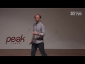

# ITT 2016 - Kevlin Henney - Seven Ineffective Coding Habits of Many Programmers (2016-11-16)

## Description

Habits help you manage the complexity of code. You apply existing skill and knowledge automatically to the detail while focusing on the bigger picture. But because you acquire habits largely by imitation, and rarely question them, how do you know your habits are effective? Many of the habits that programmers have for naming, formatting, commenting and unit testing do not stand up as rational and practical on closer inspection. Kevlin Henney examines seven coding habits that are not as effective as programmers believe, and to suggest alternatives.

www.istanbultechtalks.com

## Transcript

[0:00:06](https://youtu.be/ZsHMHukIlJY?t=6) good morning Canadian so one of my  
[0:00:10](https://youtu.be/ZsHMHukIlJY?t=10) longer talk titles this is to keep you  
[0:00:13](https://youtu.be/ZsHMHukIlJY?t=13) awake in the morning there are seven  
[0:00:15](https://youtu.be/ZsHMHukIlJY?t=15) things I'm going to cover just so you  
[0:00:17](https://youtu.be/ZsHMHukIlJY?t=17) can track them if oh just as a small  
[0:00:22](https://youtu.be/ZsHMHukIlJY?t=22) point if you have children if you have  
[0:00:26](https://youtu.be/ZsHMHukIlJY?t=26) not yet had children and plan to have  
[0:00:28](https://youtu.be/ZsHMHukIlJY?t=28) children google their names before okay  
[0:00:34](https://youtu.be/ZsHMHukIlJY?t=34) my parents gave me an Internet unique  
[0:00:36](https://youtu.be/ZsHMHukIlJY?t=36) name before the internet was invented  
[0:00:38](https://youtu.be/ZsHMHukIlJY?t=38) which I think was very clever but I will  
[0:00:41](https://youtu.be/ZsHMHukIlJY?t=41) actually confess that for both of my  
[0:00:42](https://youtu.be/ZsHMHukIlJY?t=42) son's I did google their names first and  
[0:00:45](https://youtu.be/ZsHMHukIlJY?t=45) last together just to check and there  
[0:00:49](https://youtu.be/ZsHMHukIlJY?t=49) was nobody there and last year my oldest  
[0:00:52](https://youtu.be/ZsHMHukIlJY?t=52) son he went on Twitter and he said dad  
[0:00:54](https://youtu.be/ZsHMHukIlJY?t=54) what shall I choose is my name cuz all  
[0:00:57](https://youtu.be/ZsHMHukIlJY?t=57) his friends are like understand  
[0:00:59](https://youtu.be/ZsHMHukIlJY?t=59) underscore John 73 or something stupid  
[0:01:01](https://youtu.be/ZsHMHukIlJY?t=61) like that and I said try your full name  
[0:01:04](https://youtu.be/ZsHMHukIlJY?t=64) and he said it's available and I said  
[0:01:06](https://youtu.be/ZsHMHukIlJY?t=66) yes and that was 13 years in the making  
[0:01:10](https://youtu.be/ZsHMHukIlJY?t=70) okay so just no good slow burn plans so  
[0:01:15](https://youtu.be/ZsHMHukIlJY?t=75) are these relevant these are vaguely  
[0:01:17](https://youtu.be/ZsHMHukIlJY?t=77) relevant I've got my names on a couple  
[0:01:19](https://youtu.be/ZsHMHukIlJY?t=79) of books this is probably more relevant  
[0:01:22](https://youtu.be/ZsHMHukIlJY?t=82) I edited a book 97 things every  
[0:01:24](https://youtu.be/ZsHMHukIlJY?t=84) programmer should know because there's a  
[0:01:27](https://youtu.be/ZsHMHukIlJY?t=87) diverse range of interest that we have  
[0:01:29](https://youtu.be/ZsHMHukIlJY?t=89) in code and I want to focus very much  
[0:01:32](https://youtu.be/ZsHMHukIlJY?t=92) today on details and style if you agree  
[0:01:37](https://youtu.be/ZsHMHukIlJY?t=97) with everything that I say you probably  
[0:01:40](https://youtu.be/ZsHMHukIlJY?t=100) weren't listening okay just to let you  
[0:01:42](https://youtu.be/ZsHMHukIlJY?t=102) know if you agree with everything I say  
[0:01:44](https://youtu.be/ZsHMHukIlJY?t=104) you're not listening to my talk but when  
[0:01:47](https://youtu.be/ZsHMHukIlJY?t=107) you agree with everything I say text me  
[0:01:49](https://youtu.be/ZsHMHukIlJY?t=109) email me you know Twitter oh yeah Kevin  
[0:01:52](https://youtu.be/ZsHMHukIlJY?t=112) you were right okay  
[0:01:53](https://youtu.be/ZsHMHukIlJY?t=113) so and just to let you know I just  
[0:01:56](https://youtu.be/ZsHMHukIlJY?t=116) signed the contract for 97 things every  
[0:01:59](https://youtu.be/ZsHMHukIlJY?t=119) Java programmer should know that  
[0:02:00](https://youtu.be/ZsHMHukIlJY?t=120) interests you we're going to try and do  
[0:02:01](https://youtu.be/ZsHMHukIlJY?t=121) another kind of crowdsource book so I  
[0:02:04](https://youtu.be/ZsHMHukIlJY?t=124) have a number of interests outside  
[0:02:06](https://youtu.be/ZsHMHukIlJY?t=126) programming including taking pictures of  
[0:02:08](https://youtu.be/ZsHMHukIlJY?t=128) books I've got quite good at that I also  
[0:02:11](https://youtu.be/ZsHMHukIlJY?t=131) write short fiction occasional isn't  
[0:02:13](https://youtu.be/ZsHMHukIlJY?t=133) doesn't pay any money but I'm very  
[0:02:16](https://youtu.be/ZsHMHukIlJY?t=136) interested in words and style  
[0:02:18](https://youtu.be/ZsHMHukIlJY?t=138) very interesting words I run a Facebook  
[0:02:20](https://youtu.be/ZsHMHukIlJY?t=140) page called work Friday which is about  
[0:02:21](https://youtu.be/ZsHMHukIlJY?t=141) language linguistics and words and stuff  
[0:02:23](https://youtu.be/ZsHMHukIlJY?t=143) like that but here I want to start off  
[0:02:26](https://youtu.be/ZsHMHukIlJY?t=146) with the consideration of style so I'm  
[0:02:28](https://youtu.be/ZsHMHukIlJY?t=148) going to pick on Doug Crockford book  
[0:02:30](https://youtu.be/ZsHMHukIlJY?t=150) JavaScript the good parts which is you  
[0:02:33](https://youtu.be/ZsHMHukIlJY?t=153) can tell from the shadow is a  
[0:02:34](https://youtu.be/ZsHMHukIlJY?t=154) surprisingly slim book and but one of  
[0:02:41](https://youtu.be/ZsHMHukIlJY?t=161) the greatest gems that Doug offers us is  
[0:02:43](https://youtu.be/ZsHMHukIlJY?t=163) actually not to do with JavaScript it  
[0:02:44](https://youtu.be/ZsHMHukIlJY?t=164) turns out style matters in programming  
[0:02:46](https://youtu.be/ZsHMHukIlJY?t=166) for the same reason it matters in  
[0:02:48](https://youtu.be/ZsHMHukIlJY?t=168) writing it makes for better reading so  
[0:02:52](https://youtu.be/ZsHMHukIlJY?t=172) what is one of the problems one of the  
[0:02:54](https://youtu.be/ZsHMHukIlJY?t=174) obstacles when you are reading code one  
[0:02:56](https://youtu.be/ZsHMHukIlJY?t=176) of the first obstacles is noise there's  
[0:02:58](https://youtu.be/ZsHMHukIlJY?t=178) so much going on so I want to talk about  
[0:03:00](https://youtu.be/ZsHMHukIlJY?t=180) noisy code and when we talk about noisy  
[0:03:02](https://youtu.be/ZsHMHukIlJY?t=182) code  
[0:03:02](https://youtu.be/ZsHMHukIlJY?t=182) well let's understand what we mean  
[0:03:04](https://youtu.be/ZsHMHukIlJY?t=184) there's a phrase that is often used  
[0:03:06](https://youtu.be/ZsHMHukIlJY?t=186) signal-to-noise ratio a measure used in  
[0:03:10](https://youtu.be/ZsHMHukIlJY?t=190) science and engineering that compares  
[0:03:11](https://youtu.be/ZsHMHukIlJY?t=191) the level of a desired signal to the  
[0:03:13](https://youtu.be/ZsHMHukIlJY?t=193) level of background noise and we use it  
[0:03:16](https://youtu.be/ZsHMHukIlJY?t=196) figuratively in code as well we  
[0:03:19](https://youtu.be/ZsHMHukIlJY?t=199) sometimes use it informally to refer the  
[0:03:21](https://youtu.be/ZsHMHukIlJY?t=201) ratio of useful information to false or  
[0:03:23](https://youtu.be/ZsHMHukIlJY?t=203) irrelevant data in a conversation or  
[0:03:26](https://youtu.be/ZsHMHukIlJY?t=206) exchange when you look at source code  
[0:03:29](https://youtu.be/ZsHMHukIlJY?t=209) how much of what you see is signal how  
[0:03:32](https://youtu.be/ZsHMHukIlJY?t=212) much is noise how much is ritual just  
[0:03:35](https://youtu.be/ZsHMHukIlJY?t=215) padding out the editor just filling up  
[0:03:38](https://youtu.be/ZsHMHukIlJY?t=218) the screen and it doesn't really serve a  
[0:03:40](https://youtu.be/ZsHMHukIlJY?t=220) role it doesn't actually serve to  
[0:03:43](https://youtu.be/ZsHMHukIlJY?t=223) communicate and this is quite important  
[0:03:45](https://youtu.be/ZsHMHukIlJY?t=225) because this visual sense that we have  
[0:03:48](https://youtu.be/ZsHMHukIlJY?t=228) is is the main way of getting code into  
[0:03:51](https://youtu.be/ZsHMHukIlJY?t=231) this and this it turns out is the  
[0:03:53](https://youtu.be/ZsHMHukIlJY?t=233) bottleneck in software development your  
[0:03:54](https://youtu.be/ZsHMHukIlJY?t=234) ability to comprehend and hold an idea  
[0:03:57](https://youtu.be/ZsHMHukIlJY?t=237) in your head so let me just start off  
[0:03:59](https://youtu.be/ZsHMHukIlJY?t=239) with something that was written a while  
[0:04:02](https://youtu.be/ZsHMHukIlJY?t=242) ago Hamlet's soliloquy William  
[0:04:07](https://youtu.be/ZsHMHukIlJY?t=247) Shakespeare to be or not to be that is  
[0:04:10](https://youtu.be/ZsHMHukIlJY?t=250) the question and this is kind of fairly  
[0:04:12](https://youtu.be/ZsHMHukIlJY?t=252) famous whether it is nobler in the mind  
[0:04:15](https://youtu.be/ZsHMHukIlJY?t=255) to suffer the slings and arrows of  
[0:04:17](https://youtu.be/ZsHMHukIlJY?t=257) outrageous fortune or to take arms  
[0:04:19](https://youtu.be/ZsHMHukIlJY?t=259) against a sea of troubles and by  
[0:04:21](https://youtu.be/ZsHMHukIlJY?t=261) opposing end them or if we translate  
[0:04:24](https://youtu.be/ZsHMHukIlJY?t=264) this as Tom Burton did into modern  
[0:04:27](https://youtu.be/ZsHMHukIlJY?t=267) business English  
[0:04:30](https://youtu.be/ZsHMHukIlJY?t=270) continuing existence or cessation of  
[0:04:33](https://youtu.be/ZsHMHukIlJY?t=273) existence those are the scenarios is it  
[0:04:34](https://youtu.be/ZsHMHukIlJY?t=274) more empowering mentally to work towards  
[0:04:35](https://youtu.be/ZsHMHukIlJY?t=275) an accommodation of the downsizings and  
[0:04:37](https://youtu.be/ZsHMHukIlJY?t=277) negative outcomes of adversarial  
[0:04:39](https://youtu.be/ZsHMHukIlJY?t=279) negative no circumstance or would it be  
[0:04:42](https://youtu.be/ZsHMHukIlJY?t=282) a greater enhancement to the bottom line  
[0:04:43](https://youtu.be/ZsHMHukIlJY?t=283) to move forwards to a challenge to etc  
[0:04:46](https://youtu.be/ZsHMHukIlJY?t=286) there's a lot of code out there that  
[0:04:49](https://youtu.be/ZsHMHukIlJY?t=289) looks like this there's certainly a lot  
[0:04:50](https://youtu.be/ZsHMHukIlJY?t=290) of English out there that looks like  
[0:04:51](https://youtu.be/ZsHMHukIlJY?t=291) this has it added any meaning has it had  
[0:04:54](https://youtu.be/ZsHMHukIlJY?t=294) any depth has it added any communication  
[0:04:57](https://youtu.be/ZsHMHukIlJY?t=297) this is just noise and we do a lot of  
[0:05:00](https://youtu.be/ZsHMHukIlJY?t=300) this in code a couple of the other  
[0:05:01](https://youtu.be/ZsHMHukIlJY?t=301) guidelines and observations are going to  
[0:05:04](https://youtu.be/ZsHMHukIlJY?t=304) be related to this so here is a little  
[0:05:08](https://youtu.be/ZsHMHukIlJY?t=308) piece of code it's not the biggest class  
[0:05:09](https://youtu.be/ZsHMHukIlJY?t=309) you're ever going to see it's in c-sharp  
[0:05:10](https://youtu.be/ZsHMHukIlJY?t=310) it's actually from a workshop that I run  
[0:05:13](https://youtu.be/ZsHMHukIlJY?t=313) I work for myself I run workshops  
[0:05:15](https://youtu.be/ZsHMHukIlJY?t=315) training courses and bits of consultancy  
[0:05:17](https://youtu.be/ZsHMHukIlJY?t=317) and there's a example that I use when I  
[0:05:20](https://youtu.be/ZsHMHukIlJY?t=320) talk about test-driven development very  
[0:05:23](https://youtu.be/ZsHMHukIlJY?t=323) simple example a recently used list  
[0:05:25](https://youtu.be/ZsHMHukIlJY?t=325) lots of people use stacks stacks of  
[0:05:28](https://youtu.be/ZsHMHukIlJY?t=328) boring let's use recently use lists  
[0:05:29](https://youtu.be/ZsHMHukIlJY?t=329) instead when you're recently opened  
[0:05:31](https://youtu.be/ZsHMHukIlJY?t=331) files menu contains strings so you want  
[0:05:34](https://youtu.be/ZsHMHukIlJY?t=334) a collection that hold strings and the  
[0:05:37](https://youtu.be/ZsHMHukIlJY?t=337) most recent one goes to the head but  
[0:05:39](https://youtu.be/ZsHMHukIlJY?t=339) they're also unique in other words when  
[0:05:42](https://youtu.be/ZsHMHukIlJY?t=342) you reinsert or reopen a file that's  
[0:05:44](https://youtu.be/ZsHMHukIlJY?t=344) already in there it doesn't get inserted  
[0:05:45](https://youtu.be/ZsHMHukIlJY?t=345) twice it moves so what kind of logic is  
[0:05:49](https://youtu.be/ZsHMHukIlJY?t=349) involved in a minimal implementation of  
[0:05:51](https://youtu.be/ZsHMHukIlJY?t=351) this well this is one of the ones that a  
[0:05:53](https://youtu.be/ZsHMHukIlJY?t=353) couple of my students a pair produced  
[0:05:56](https://youtu.be/ZsHMHukIlJY?t=356) and they kind of looked to me and said  
[0:05:58](https://youtu.be/ZsHMHukIlJY?t=358) we think this is a little bit long  
[0:06:01](https://youtu.be/ZsHMHukIlJY?t=361) fortunately they're had tests so we  
[0:06:03](https://youtu.be/ZsHMHukIlJY?t=363) could change it we think this is a  
[0:06:05](https://youtu.be/ZsHMHukIlJY?t=365) little bit long yeah that's how long it  
[0:06:08](https://youtu.be/ZsHMHukIlJY?t=368) needs to be and most of that is  
[0:06:10](https://youtu.be/ZsHMHukIlJY?t=370) punctuation there's only actually five  
[0:06:12](https://youtu.be/ZsHMHukIlJY?t=372) lines that does anything on the left  
[0:06:14](https://youtu.be/ZsHMHukIlJY?t=374) hand side it's not the largest piece of  
[0:06:16](https://youtu.be/ZsHMHukIlJY?t=376) code you will ever see as I said but it  
[0:06:19](https://youtu.be/ZsHMHukIlJY?t=379) is far larger and holds far more logic  
[0:06:21](https://youtu.be/ZsHMHukIlJY?t=381) than the version on the right it's not a  
[0:06:25](https://youtu.be/ZsHMHukIlJY?t=385) case of whether or not this slide fits  
[0:06:26](https://youtu.be/ZsHMHukIlJY?t=386) on a code I want you to imagine that you  
[0:06:29](https://youtu.be/ZsHMHukIlJY?t=389) write a whole codebase in this style  
[0:06:31](https://youtu.be/ZsHMHukIlJY?t=391) that's when it becomes important if this  
[0:06:34](https://youtu.be/ZsHMHukIlJY?t=394) is your standard style suddenly instead  
[0:06:36](https://youtu.be/ZsHMHukIlJY?t=396) of neat elegant one-liners you end up  
[0:06:39](https://youtu.be/ZsHMHukIlJY?t=399) with code that has additional layers of  
[0:06:42](https://youtu.be/ZsHMHukIlJY?t=402) logic that's  
[0:06:43](https://youtu.be/ZsHMHukIlJY?t=403) additional noise it doesn't actually do  
[0:06:45](https://youtu.be/ZsHMHukIlJY?t=405) anymore from the code on the right in  
[0:06:47](https://youtu.be/ZsHMHukIlJY?t=407) fact it's actually slightly slower and  
[0:06:49](https://youtu.be/ZsHMHukIlJY?t=409) yet we're very very good at doing this  
[0:06:52](https://youtu.be/ZsHMHukIlJY?t=412) our other source of noise and code  
[0:06:56](https://youtu.be/ZsHMHukIlJY?t=416) comments I'm going to pick on Oracle  
[0:06:59](https://youtu.be/ZsHMHukIlJY?t=419) here but it's actually the same  
[0:07:00](https://youtu.be/ZsHMHukIlJY?t=420) copyright message that son used to use  
[0:07:03](https://youtu.be/ZsHMHukIlJY?t=423) look at all of that this basically tells  
[0:07:05](https://youtu.be/ZsHMHukIlJY?t=425) you don't do bad things don't steal  
[0:07:08](https://youtu.be/ZsHMHukIlJY?t=428) things we're not liable for anything  
[0:07:10](https://youtu.be/ZsHMHukIlJY?t=430) that you do and please don't put this in  
[0:07:12](https://youtu.be/ZsHMHukIlJY?t=432) a nuclear power station and then when we  
[0:07:15](https://youtu.be/ZsHMHukIlJY?t=435) strip out all of the comments we are  
[0:07:17](https://youtu.be/ZsHMHukIlJY?t=437) left with hello world that's it  
[0:07:20](https://youtu.be/ZsHMHukIlJY?t=440) all of that for this and the one thing  
[0:07:23](https://youtu.be/ZsHMHukIlJY?t=443) the one thing all of that I mean here  
[0:07:26](https://youtu.be/ZsHMHukIlJY?t=446) we're told great things like display the  
[0:07:28](https://youtu.be/ZsHMHukIlJY?t=448) string Wow but there's only all of the  
[0:07:35](https://youtu.be/ZsHMHukIlJY?t=455) effort that went into that and you know  
[0:07:37](https://youtu.be/ZsHMHukIlJY?t=457) what they missed something right here  
[0:07:40](https://youtu.be/ZsHMHukIlJY?t=460) there should be a comma yeah okay if  
[0:07:46](https://youtu.be/ZsHMHukIlJY?t=466) you're not sure why not  
[0:07:48](https://youtu.be/ZsHMHukIlJY?t=468) there's a kind of a standard way of  
[0:07:50](https://youtu.be/ZsHMHukIlJY?t=470) checking this one let's eat grandma  
[0:07:54](https://youtu.be/ZsHMHukIlJY?t=474) let's eat grandma the first one has a  
[0:07:58](https://youtu.be/ZsHMHukIlJY?t=478) comma and the second one doesn't good  
[0:08:01](https://youtu.be/ZsHMHukIlJY?t=481) punctuation saves lives okay so the one  
[0:08:04](https://youtu.be/ZsHMHukIlJY?t=484) thing they could have actually done they  
[0:08:06](https://youtu.be/ZsHMHukIlJY?t=486) didn't do when I was learning see back  
[0:08:09](https://youtu.be/ZsHMHukIlJY?t=489) in 1989 Rob Pike wrote this notes on see  
[0:08:13](https://youtu.be/ZsHMHukIlJY?t=493) now III notes on programming a C and I  
[0:08:16](https://youtu.be/ZsHMHukIlJY?t=496) it's interesting because I'm half of his  
[0:08:18](https://youtu.be/ZsHMHukIlJY?t=498) guidelines is very specifically C  
[0:08:19](https://youtu.be/ZsHMHukIlJY?t=499) related and some of them have changed  
[0:08:21](https://youtu.be/ZsHMHukIlJY?t=501) with time but his guideline on comments  
[0:08:24](https://youtu.be/ZsHMHukIlJY?t=504) is spot on a delicate matter requiring  
[0:08:28](https://youtu.be/ZsHMHukIlJY?t=508) taste and judgment I tend to err on the  
[0:08:31](https://youtu.be/ZsHMHukIlJY?t=511) side of eliminating comments for several  
[0:08:33](https://youtu.be/ZsHMHukIlJY?t=513) reasons first if the code is clear and  
[0:08:35](https://youtu.be/ZsHMHukIlJY?t=515) uses good type names and variable names  
[0:08:36](https://youtu.be/ZsHMHukIlJY?t=516) it should explain itself yeah second  
[0:08:39](https://youtu.be/ZsHMHukIlJY?t=519) comments aren't checked by the compiler  
[0:08:41](https://youtu.be/ZsHMHukIlJY?t=521) this is an important consideration you  
[0:08:44](https://youtu.be/ZsHMHukIlJY?t=524) have two audiences you have the compiler  
[0:08:46](https://youtu.be/ZsHMHukIlJY?t=526) and you have other human beings my  
[0:08:48](https://youtu.be/ZsHMHukIlJY?t=528) experience suggests that other human  
[0:08:50](https://youtu.be/ZsHMHukIlJY?t=530) beings don't read comments and compilers  
[0:08:53](https://youtu.be/ZsHMHukIlJY?t=533) don't read comments so who you writing  
[0:08:54](https://youtu.be/ZsHMHukIlJY?t=534) them for okay comments are the last  
[0:08:58](https://youtu.be/ZsHMHukIlJY?t=538) thing people will look at when  
[0:08:59](https://youtu.be/ZsHMHukIlJY?t=539) everything has gone wrong it's like  
[0:09:01](https://youtu.be/ZsHMHukIlJY?t=541) getting a new gadget the last thing  
[0:09:04](https://youtu.be/ZsHMHukIlJY?t=544) you're going to do is actually look at  
[0:09:05](https://youtu.be/ZsHMHukIlJY?t=545) the instructions of you're a geek you  
[0:09:07](https://youtu.be/ZsHMHukIlJY?t=547) never look at the instructions it's like  
[0:09:09](https://youtu.be/ZsHMHukIlJY?t=549) you should look at the instructions  
[0:09:10](https://youtu.be/ZsHMHukIlJY?t=550) carefully no no no I can work this one  
[0:09:12](https://youtu.be/ZsHMHukIlJY?t=552) out and when it's all gone wrong then  
[0:09:14](https://youtu.be/ZsHMHukIlJY?t=554) you look at the instructions only to  
[0:09:16](https://youtu.be/ZsHMHukIlJY?t=556) discover that they're wrong there's no  
[0:09:19](https://youtu.be/ZsHMHukIlJY?t=559) guarantee they're right a misleading  
[0:09:20](https://youtu.be/ZsHMHukIlJY?t=560) comment can be very confusing third the  
[0:09:22](https://youtu.be/ZsHMHukIlJY?t=562) issue of typography comments clutter  
[0:09:23](https://youtu.be/ZsHMHukIlJY?t=563) code they create noise but one of my  
[0:09:25](https://youtu.be/ZsHMHukIlJY?t=565) favorite things in the Rob Pike article  
[0:09:27](https://youtu.be/ZsHMHukIlJY?t=567) was this piece there is a famously bad  
[0:09:31](https://youtu.be/ZsHMHukIlJY?t=571) comment style what I equals I plus 1 and  
[0:09:33](https://youtu.be/ZsHMHukIlJY?t=573) 1/2 I and there are worse ways to do it  
[0:09:37](https://youtu.be/ZsHMHukIlJY?t=577) what I love is that he says don't laugh  
[0:09:40](https://youtu.be/ZsHMHukIlJY?t=580) now wait until you see it in real life I  
[0:09:43](https://youtu.be/ZsHMHukIlJY?t=583) don't know I read this in 1990-1991 I  
[0:09:46](https://youtu.be/ZsHMHukIlJY?t=586) laughed 5 years later I worked as a  
[0:09:49](https://youtu.be/ZsHMHukIlJY?t=589) contractor in a bank in the city of  
[0:09:51](https://youtu.be/ZsHMHukIlJY?t=591) London and somebody got me to look over  
[0:09:53](https://youtu.be/ZsHMHukIlJY?t=593) their code and they had the second  
[0:09:56](https://youtu.be/ZsHMHukIlJY?t=596) example I was very polite but I did  
[0:09:59](https://youtu.be/ZsHMHukIlJY?t=599) laughs so I this caused me to make this  
[0:10:04](https://youtu.be/ZsHMHukIlJY?t=604) observation when it comes to comments  
[0:10:06](https://youtu.be/ZsHMHukIlJY?t=606) there's often this idea you know what  
[0:10:08](https://youtu.be/ZsHMHukIlJY?t=608) the code might not be readable the code  
[0:10:10](https://youtu.be/ZsHMHukIlJY?t=610) might not be readable why because the  
[0:10:12](https://youtu.be/ZsHMHukIlJY?t=612) programmer didn't express themselves oh  
[0:10:14](https://youtu.be/ZsHMHukIlJY?t=614) okay you should get the programmer to  
[0:10:16](https://youtu.be/ZsHMHukIlJY?t=616) write comments then the same programmer  
[0:10:19](https://youtu.be/ZsHMHukIlJY?t=619) that could not express themselves in the  
[0:10:21](https://youtu.be/ZsHMHukIlJY?t=621) programming language is now going to be  
[0:10:22](https://youtu.be/ZsHMHukIlJY?t=622) asked to express themselves again using  
[0:10:25](https://youtu.be/ZsHMHukIlJY?t=625) a natural language I don't think it's  
[0:10:28](https://youtu.be/ZsHMHukIlJY?t=628) necessarily going to work so that's the  
[0:10:32](https://youtu.be/ZsHMHukIlJY?t=632) basic source of noise but there's  
[0:10:35](https://youtu.be/ZsHMHukIlJY?t=635) something else I emphasized the visual  
[0:10:37](https://youtu.be/ZsHMHukIlJY?t=637) sense seeing it turns out we see in a  
[0:10:41](https://youtu.be/ZsHMHukIlJY?t=641) particular way so I want to talk about  
[0:10:44](https://youtu.be/ZsHMHukIlJY?t=644) the one of the great holy subjects you  
[0:10:46](https://youtu.be/ZsHMHukIlJY?t=646) are not supposed to talk about  
[0:10:48](https://youtu.be/ZsHMHukIlJY?t=648) indentation yes I'm going to do it there  
[0:10:53](https://youtu.be/ZsHMHukIlJY?t=653) is actually I've tried many different  
[0:10:54](https://youtu.be/ZsHMHukIlJY?t=654) styles over the years it turns out I  
[0:10:56](https://youtu.be/ZsHMHukIlJY?t=656) can't tell you what the one true style  
[0:10:58](https://youtu.be/ZsHMHukIlJY?t=658) is but I can tell you what properties it  
[0:11:01](https://youtu.be/ZsHMHukIlJY?t=661) should probably have based on what we  
[0:11:04](https://youtu.be/ZsHMHukIlJY?t=664) see in code and how we use it I showed  
[0:11:06](https://youtu.be/ZsHMHukIlJY?t=666) you this earlier on and I showed you  
[0:11:09](https://youtu.be/ZsHMHukIlJY?t=669) this  
[0:11:09](https://youtu.be/ZsHMHukIlJY?t=669) this is not how programmers would write  
[0:11:11](https://youtu.be/ZsHMHukIlJY?t=671) it programmers are probably write it  
[0:11:12](https://youtu.be/ZsHMHukIlJY?t=672) like this we have some very strange  
[0:11:17](https://youtu.be/ZsHMHukIlJY?t=677) ideas about how to arrange code so  
[0:11:20](https://youtu.be/ZsHMHukIlJY?t=680) here's a thought it's a nice big space  
[0:11:23](https://youtu.be/ZsHMHukIlJY?t=683) there what's that big space doing let me  
[0:11:26](https://youtu.be/ZsHMHukIlJY?t=686) put a line down it because this is how  
[0:11:28](https://youtu.be/ZsHMHukIlJY?t=688) many programmers lay out their code they  
[0:11:31](https://youtu.be/ZsHMHukIlJY?t=691) work on the logic it's just like that's  
[0:11:32](https://youtu.be/ZsHMHukIlJY?t=692) fine I've got an HD screen you know it's  
[0:11:36](https://youtu.be/ZsHMHukIlJY?t=696) big it's IMAX okay I'm good I've got two  
[0:11:39](https://youtu.be/ZsHMHukIlJY?t=699) screens you know I like my code can run  
[0:11:42](https://youtu.be/ZsHMHukIlJY?t=702) to the distance yeah see this even got a  
[0:11:46](https://youtu.be/ZsHMHukIlJY?t=706) climate system the weather over at the  
[0:11:48](https://youtu.be/ZsHMHukIlJY?t=708) end of that of that line is different to  
[0:11:50](https://youtu.be/ZsHMHukIlJY?t=710) the weather at this end it has its own  
[0:11:54](https://youtu.be/ZsHMHukIlJY?t=714) perspective there's any one problem that  
[0:11:58](https://youtu.be/ZsHMHukIlJY?t=718) line there that's column eighty you  
[0:12:02](https://youtu.be/ZsHMHukIlJY?t=722) might say I'll column eighty that's  
[0:12:03](https://youtu.be/ZsHMHukIlJY?t=723) really kind of old and you know you  
[0:12:05](https://youtu.be/ZsHMHukIlJY?t=725) should do that as terminals  
[0:12:07](https://youtu.be/ZsHMHukIlJY?t=727) you know we've moved on beyond that yeah  
[0:12:09](https://youtu.be/ZsHMHukIlJY?t=729) you want some really bad news how do  
[0:12:11](https://youtu.be/ZsHMHukIlJY?t=731) people actually read column eighty is  
[0:12:14](https://youtu.be/ZsHMHukIlJY?t=734) generous we should never be there turns  
[0:12:16](https://youtu.be/ZsHMHukIlJY?t=736) out this is how people read it turns out  
[0:12:18](https://youtu.be/ZsHMHukIlJY?t=738) if you look at webpages people don't use  
[0:12:21](https://youtu.be/ZsHMHukIlJY?t=741) they don't fill up left to right they  
[0:12:23](https://youtu.be/ZsHMHukIlJY?t=743) use columns look at newspapers look at  
[0:12:24](https://youtu.be/ZsHMHukIlJY?t=744) any of the things that people have  
[0:12:26](https://youtu.be/ZsHMHukIlJY?t=746) applied graphic design or layout  
[0:12:29](https://youtu.be/ZsHMHukIlJY?t=749) principles to for centuries or more it  
[0:12:31](https://youtu.be/ZsHMHukIlJY?t=751) turns out we're much better with that we  
[0:12:34](https://youtu.be/ZsHMHukIlJY?t=754) don't respect that in code I'm not  
[0:12:36](https://youtu.be/ZsHMHukIlJY?t=756) saying stick to eighty but if you hit  
[0:12:37](https://youtu.be/ZsHMHukIlJY?t=757) the hundred if you hit three digits be  
[0:12:39](https://youtu.be/ZsHMHukIlJY?t=759) very very very suspicious one of my  
[0:12:42](https://youtu.be/ZsHMHukIlJY?t=762) clients we were going through their code  
[0:12:44](https://youtu.be/ZsHMHukIlJY?t=764) and they actually mostly under eighty  
[0:12:46](https://youtu.be/ZsHMHukIlJY?t=766) and then every now and then something  
[0:12:48](https://youtu.be/ZsHMHukIlJY?t=768) went off the right-hand side and I said  
[0:12:50](https://youtu.be/ZsHMHukIlJY?t=770) how far did these go off the right-hand  
[0:12:52](https://youtu.be/ZsHMHukIlJY?t=772) side so we decided to suit up get our  
[0:12:58](https://youtu.be/ZsHMHukIlJY?t=778) exploration gear get some water and set  
[0:13:01](https://youtu.be/ZsHMHukIlJY?t=781) out and we set out on a mission and we  
[0:13:03](https://youtu.be/ZsHMHukIlJY?t=783) found something in column 360 so their  
[0:13:07](https://youtu.be/ZsHMHukIlJY?t=787) code is pretty much bip bip in fact this  
[0:13:12](https://youtu.be/ZsHMHukIlJY?t=792) is a really interesting guideline I came  
[0:13:14](https://youtu.be/ZsHMHukIlJY?t=794) across accidentally reviewing some code  
[0:13:17](https://youtu.be/ZsHMHukIlJY?t=797) with a client I kept pointing out well  
[0:13:19](https://youtu.be/ZsHMHukIlJY?t=799) one of the developers that kept saying  
[0:13:22](https://youtu.be/ZsHMHukIlJY?t=802) you keep your columns your your your  
[0:13:25](https://youtu.be/ZsHMHukIlJY?t=805) your lines are too long you are hitting  
[0:13:26](https://youtu.be/ZsHMHukIlJY?t=806) the high row numbers and all the  
[0:13:28](https://youtu.be/ZsHMHukIlJY?t=808) significant information is over here  
[0:13:30](https://youtu.be/ZsHMHukIlJY?t=810) whereas people read from the beginning  
[0:13:33](https://youtu.be/ZsHMHukIlJY?t=813) and we normally make judgments about  
[0:13:34](https://youtu.be/ZsHMHukIlJY?t=814) what's over here based on what we see  
[0:13:36](https://youtu.be/ZsHMHukIlJY?t=816) over here the problem is all the  
[0:13:38](https://youtu.be/ZsHMHukIlJY?t=818) interesting stuff is over here this is  
[0:13:40](https://youtu.be/ZsHMHukIlJY?t=820) very very self similar and he said oh  
[0:13:42](https://youtu.be/ZsHMHukIlJY?t=822) it's fine I've got a big screen and all  
[0:13:44](https://youtu.be/ZsHMHukIlJY?t=824) the rest of it but by the best bit was  
[0:13:46](https://youtu.be/ZsHMHukIlJY?t=826) that we then did a code review with the  
[0:13:48](https://youtu.be/ZsHMHukIlJY?t=828) rest of the team in a room using a  
[0:13:51](https://youtu.be/ZsHMHukIlJY?t=831) projector and the projector because most  
[0:13:55](https://youtu.be/ZsHMHukIlJY?t=835) projectors do had a lower resolution  
[0:13:56](https://youtu.be/ZsHMHukIlJY?t=836) than his machine and you couldn't see it  
[0:14:00](https://youtu.be/ZsHMHukIlJY?t=840) and we made this point those two lines  
[0:14:02](https://youtu.be/ZsHMHukIlJY?t=842) are the same he said no no they're  
[0:14:03](https://youtu.be/ZsHMHukIlJY?t=843) different around : hundred and fifty and  
[0:14:06](https://youtu.be/ZsHMHukIlJY?t=846) we said well yeah but we can't see that  
[0:14:08](https://youtu.be/ZsHMHukIlJY?t=848) yeah but it worked on my machine it's  
[0:14:11](https://youtu.be/ZsHMHukIlJY?t=851) like this is a really interesting point  
[0:14:13](https://youtu.be/ZsHMHukIlJY?t=853) it turns out that and I've encountered  
[0:14:16](https://youtu.be/ZsHMHukIlJY?t=856) people who do things some really  
[0:14:17](https://youtu.be/ZsHMHukIlJY?t=857) interesting ideas they will do code  
[0:14:19](https://youtu.be/ZsHMHukIlJY?t=859) reviews by reviewing the code on arm  
[0:14:22](https://youtu.be/ZsHMHukIlJY?t=862) tablets you know they might type them in  
[0:14:23](https://youtu.be/ZsHMHukIlJY?t=863) using a decent workstation but then  
[0:14:25](https://youtu.be/ZsHMHukIlJY?t=865) they'll get a coffee area and look  
[0:14:27](https://youtu.be/ZsHMHukIlJY?t=867) through the code on tablets numbers use  
[0:14:28](https://youtu.be/ZsHMHukIlJY?t=868) a different form to see what the code  
[0:14:31](https://youtu.be/ZsHMHukIlJY?t=871) looks like for other people at other  
[0:14:32](https://youtu.be/ZsHMHukIlJY?t=872) times and this very interesting thought  
[0:14:37](https://youtu.be/ZsHMHukIlJY?t=877) here about what we might call clean  
[0:14:39](https://youtu.be/ZsHMHukIlJY?t=879) design now this site daniel Higginbottom  
[0:14:41](https://youtu.be/ZsHMHukIlJY?t=881) put this together clean out your mess a  
[0:14:43](https://youtu.be/ZsHMHukIlJY?t=883) guide to visual design and he talks  
[0:14:45](https://youtu.be/ZsHMHukIlJY?t=885) about clean design and he's we may be  
[0:14:49](https://youtu.be/ZsHMHukIlJY?t=889) familiar with the idea of clean code but  
[0:14:50](https://youtu.be/ZsHMHukIlJY?t=890) he's talking about clean visual design a  
[0:14:52](https://youtu.be/ZsHMHukIlJY?t=892) clean design is one that supports visual  
[0:14:55](https://youtu.be/ZsHMHukIlJY?t=895) thinking so people can meet their  
[0:14:57](https://youtu.be/ZsHMHukIlJY?t=897) informational needs with a minimum of  
[0:14:59](https://youtu.be/ZsHMHukIlJY?t=899) conscious effort this is an interesting  
[0:15:01](https://youtu.be/ZsHMHukIlJY?t=901) thought because what we're saying here  
[0:15:03](https://youtu.be/ZsHMHukIlJY?t=903) is that your code has a client that  
[0:15:06](https://youtu.be/ZsHMHukIlJY?t=906) client is you or another developer so  
[0:15:10](https://youtu.be/ZsHMHukIlJY?t=910) other developers are have requirements  
[0:15:13](https://youtu.be/ZsHMHukIlJY?t=913) on your code they may never express them  
[0:15:15](https://youtu.be/ZsHMHukIlJY?t=915) explicitly but they have implied  
[0:15:18](https://youtu.be/ZsHMHukIlJY?t=918) requirements they are going to be  
[0:15:19](https://youtu.be/ZsHMHukIlJY?t=919) clients of that code what do they want  
[0:15:21](https://youtu.be/ZsHMHukIlJY?t=921) well they have why are they looking at  
[0:15:23](https://youtu.be/ZsHMHukIlJY?t=923) your code are they looking at your code  
[0:15:24](https://youtu.be/ZsHMHukIlJY?t=924) because it is amazing that they want to  
[0:15:26](https://youtu.be/ZsHMHukIlJY?t=926) bask in its glory you'd like to think so  
[0:15:29](https://youtu.be/ZsHMHukIlJY?t=929) but it probably turns out they want  
[0:15:32](https://youtu.be/ZsHMHukIlJY?t=932) something from it they want information  
[0:15:34](https://youtu.be/ZsHMHukIlJY?t=934) because that's that's  
[0:15:35](https://youtu.be/ZsHMHukIlJY?t=935) one of the reasons this is often called  
[0:15:36](https://youtu.be/ZsHMHukIlJY?t=936) an information science and so therefore  
[0:15:39](https://youtu.be/ZsHMHukIlJY?t=939) there is this idea of information they  
[0:15:41](https://youtu.be/ZsHMHukIlJY?t=941) need to know something they have  
[0:15:42](https://youtu.be/ZsHMHukIlJY?t=942) informational needs how do we best serve  
[0:15:44](https://youtu.be/ZsHMHukIlJY?t=944) those instead of than usual style Wars  
[0:15:48](https://youtu.be/ZsHMHukIlJY?t=948) which are based on I like doing it like  
[0:15:50](https://youtu.be/ZsHMHukIlJY?t=950) this so it's a very subjective or the  
[0:15:53](https://youtu.be/ZsHMHukIlJY?t=953) company that provided the framework or  
[0:15:55](https://youtu.be/ZsHMHukIlJY?t=955) the language does it like this it turns  
[0:15:56](https://youtu.be/ZsHMHukIlJY?t=956) out they're not very good for years I've  
[0:15:58](https://youtu.be/ZsHMHukIlJY?t=958) struggled with people saying yeah yeah  
[0:16:00](https://youtu.be/ZsHMHukIlJY?t=960) but Microsoft do it that way and yeah  
[0:16:04](https://youtu.be/ZsHMHukIlJY?t=964) but Apple do it that way and you know  
[0:16:07](https://youtu.be/ZsHMHukIlJY?t=967) I've got kids when one of my kids says  
[0:16:09](https://youtu.be/ZsHMHukIlJY?t=969) yeah yeah but one of my friends at  
[0:16:11](https://youtu.be/ZsHMHukIlJY?t=971) school does it that way I have the same  
[0:16:13](https://youtu.be/ZsHMHukIlJY?t=973) response and why should we be any  
[0:16:15](https://youtu.be/ZsHMHukIlJY?t=975) different so here's the thought you  
[0:16:17](https://youtu.be/ZsHMHukIlJY?t=977) convey information by the way your  
[0:16:19](https://youtu.be/ZsHMHukIlJY?t=979) arranger designs elements in relation to  
[0:16:21](https://youtu.be/ZsHMHukIlJY?t=981) each other this information is  
[0:16:23](https://youtu.be/ZsHMHukIlJY?t=983) understood immediately if not  
[0:16:24](https://youtu.be/ZsHMHukIlJY?t=984) consciously by people viewing your  
[0:16:26](https://youtu.be/ZsHMHukIlJY?t=986) designs when you align things or  
[0:16:27](https://youtu.be/ZsHMHukIlJY?t=987) separate things then people assume that  
[0:16:29](https://youtu.be/ZsHMHukIlJY?t=989) things are aligned or and somehow  
[0:16:30](https://youtu.be/ZsHMHukIlJY?t=990) there's somehow meaningfully related and  
[0:16:33](https://youtu.be/ZsHMHukIlJY?t=993) if they're separated that they are  
[0:16:35](https://youtu.be/ZsHMHukIlJY?t=995) somehow separated so we actually use a  
[0:16:38](https://youtu.be/ZsHMHukIlJY?t=998) lot more subtle cues when we read  
[0:16:40](https://youtu.be/ZsHMHukIlJY?t=1000) through things we don't actually read  
[0:16:42](https://youtu.be/ZsHMHukIlJY?t=1002) what we think we read a lot a lot goes  
[0:16:44](https://youtu.be/ZsHMHukIlJY?t=1004) on in the in that's kind of background  
[0:16:46](https://youtu.be/ZsHMHukIlJY?t=1006) threads of your brain this is great if  
[0:16:49](https://youtu.be/ZsHMHukIlJY?t=1009) the visual relationships are obvious and  
[0:16:51](https://youtu.be/ZsHMHukIlJY?t=1011) accurate but if they're not your  
[0:16:53](https://youtu.be/ZsHMHukIlJY?t=1013) audience is going to get confused  
[0:16:54](https://youtu.be/ZsHMHukIlJY?t=1014) they'll have to examine your work  
[0:16:55](https://youtu.be/ZsHMHukIlJY?t=1015) carefully now sometimes people say well  
[0:16:57](https://youtu.be/ZsHMHukIlJY?t=1017) yes so they should because it is a work  
[0:16:59](https://youtu.be/ZsHMHukIlJY?t=1019) of brilliance it was hard to write so it  
[0:17:02](https://youtu.be/ZsHMHukIlJY?t=1022) should be hard to read this is not how  
[0:17:04](https://youtu.be/ZsHMHukIlJY?t=1024) we're going to go forward we want a  
[0:17:06](https://youtu.be/ZsHMHukIlJY?t=1026) better way of thinking about this so let  
[0:17:07](https://youtu.be/ZsHMHukIlJY?t=1027) me pick on a piece of code here so is  
[0:17:10](https://youtu.be/ZsHMHukIlJY?t=1030) this a sort of java method header this  
[0:17:12](https://youtu.be/ZsHMHukIlJY?t=1032) is probably one of the most common  
[0:17:14](https://youtu.be/ZsHMHukIlJY?t=1034) styles is probably accidental most of  
[0:17:16](https://youtu.be/ZsHMHukIlJY?t=1036) the time but I see this so often in in  
[0:17:19](https://youtu.be/ZsHMHukIlJY?t=1039) code where's the argument list argument  
[0:17:23](https://youtu.be/ZsHMHukIlJY?t=1043) list is one idea the argument list is  
[0:17:25](https://youtu.be/ZsHMHukIlJY?t=1045) all the way over here and all the way  
[0:17:27](https://youtu.be/ZsHMHukIlJY?t=1047) over there  
[0:17:28](https://youtu.be/ZsHMHukIlJY?t=1048) and if you're hitting hi column numbers  
[0:17:32](https://youtu.be/ZsHMHukIlJY?t=1052) when somebody says where's the argument  
[0:17:35](https://youtu.be/ZsHMHukIlJY?t=1055) list you know where are my parameters  
[0:17:36](https://youtu.be/ZsHMHukIlJY?t=1056) are well some are on that side of the  
[0:17:39](https://youtu.be/ZsHMHukIlJY?t=1059) stage and the rest are over there and  
[0:17:40](https://youtu.be/ZsHMHukIlJY?t=1060) yet we have an idea a single unified  
[0:17:43](https://youtu.be/ZsHMHukIlJY?t=1063) idea we call it an argument list it's a  
[0:17:46](https://youtu.be/ZsHMHukIlJY?t=1066) list yet somehow it manifests itself  
[0:17:48](https://youtu.be/ZsHMHukIlJY?t=1068) like  
[0:17:49](https://youtu.be/ZsHMHukIlJY?t=1069) rolling his cat in two different places  
[0:17:50](https://youtu.be/ZsHMHukIlJY?t=1070) in two different ways this is different  
[0:17:53](https://youtu.be/ZsHMHukIlJY?t=1073) this is this is visually confounding and  
[0:17:55](https://youtu.be/ZsHMHukIlJY?t=1075) I have actually had the conversation  
[0:17:56](https://youtu.be/ZsHMHukIlJY?t=1076) where something says oh yeah that - you  
[0:17:58](https://youtu.be/ZsHMHukIlJY?t=1078) know that that method takes two  
[0:17:59](https://youtu.be/ZsHMHukIlJY?t=1079) arguments no it doesn't it takes one oh  
[0:18:02](https://youtu.be/ZsHMHukIlJY?t=1082) no the other ones over there so this is  
[0:18:05](https://youtu.be/ZsHMHukIlJY?t=1085) obviously designed this this kind of  
[0:18:07](https://youtu.be/ZsHMHukIlJY?t=1087) style there's a reason the star comes  
[0:18:09](https://youtu.be/ZsHMHukIlJY?t=1089) about we'll have a look at it in a  
[0:18:10](https://youtu.be/ZsHMHukIlJY?t=1090) moment so I'm not going to tell you how  
[0:18:13](https://youtu.be/ZsHMHukIlJY?t=1093) to lay out your code I'm just going to  
[0:18:14](https://youtu.be/ZsHMHukIlJY?t=1094) say that there is a property that you  
[0:18:17](https://youtu.be/ZsHMHukIlJY?t=1097) want in other words my requirements are  
[0:18:18](https://youtu.be/ZsHMHukIlJY?t=1098) that when I deal with a list of things a  
[0:18:21](https://youtu.be/ZsHMHukIlJY?t=1101) an argument list when I deal with a list  
[0:18:23](https://youtu.be/ZsHMHukIlJY?t=1103) of parameters then it should look like a  
[0:18:25](https://youtu.be/ZsHMHukIlJY?t=1105) list it shouldn't look like it's been  
[0:18:26](https://youtu.be/ZsHMHukIlJY?t=1106) scattered to the four winds and you can  
[0:18:29](https://youtu.be/ZsHMHukIlJY?t=1109) do it horizontally you can do it  
[0:18:30](https://youtu.be/ZsHMHukIlJY?t=1110) vertically I don't care how you do it  
[0:18:31](https://youtu.be/ZsHMHukIlJY?t=1111) but it should look like a thing and so  
[0:18:33](https://youtu.be/ZsHMHukIlJY?t=1113) visually I read it in one go however  
[0:18:36](https://youtu.be/ZsHMHukIlJY?t=1116) there is also another common style that  
[0:18:38](https://youtu.be/ZsHMHukIlJY?t=1118) is not one that I'm going to go  
[0:18:40](https://youtu.be/ZsHMHukIlJY?t=1120) encourage this one it's lined up so  
[0:18:44](https://youtu.be/ZsHMHukIlJY?t=1124) there's a simple one thing but there's  
[0:18:46](https://youtu.be/ZsHMHukIlJY?t=1126) actually a reason that you shouldn't  
[0:18:49](https://youtu.be/ZsHMHukIlJY?t=1129) really do this oh there are reasons you  
[0:18:50](https://youtu.be/ZsHMHukIlJY?t=1130) might want to do it  
[0:18:52](https://youtu.be/ZsHMHukIlJY?t=1132) but let's understand this from a  
[0:18:54](https://youtu.be/ZsHMHukIlJY?t=1134) different point of view let's just do a  
[0:18:57](https://youtu.be/ZsHMHukIlJY?t=1137) very simple declaration with  
[0:18:58](https://youtu.be/ZsHMHukIlJY?t=1138) initialization it's very tempting to  
[0:19:01](https://youtu.be/ZsHMHukIlJY?t=1141) initialize like this there are problems  
[0:19:03](https://youtu.be/ZsHMHukIlJY?t=1143) with this by the way this is one of the  
[0:19:04](https://youtu.be/ZsHMHukIlJY?t=1144) reasons that our code over the last few  
[0:19:07](https://youtu.be/ZsHMHukIlJY?t=1147) years has been progressively moving  
[0:19:08](https://youtu.be/ZsHMHukIlJY?t=1148) further and further right because people  
[0:19:10](https://youtu.be/ZsHMHukIlJY?t=1150) do like to line up everything over here  
[0:19:12](https://youtu.be/ZsHMHukIlJY?t=1152) there's a problem though I'm going to  
[0:19:14](https://youtu.be/ZsHMHukIlJY?t=1154) suggest again I'll give you two  
[0:19:16](https://youtu.be/ZsHMHukIlJY?t=1156) suggestions there are more because I  
[0:19:18](https://youtu.be/ZsHMHukIlJY?t=1158) don't want to say I'm favoring one  
[0:19:19](https://youtu.be/ZsHMHukIlJY?t=1159) approach I want to say I'm favoring a  
[0:19:21](https://youtu.be/ZsHMHukIlJY?t=1161) property the property that I favor is  
[0:19:25](https://youtu.be/ZsHMHukIlJY?t=1165) that it is invariant and unchanging  
[0:19:29](https://youtu.be/ZsHMHukIlJY?t=1169) under refactoring when I rename  
[0:19:32](https://youtu.be/ZsHMHukIlJY?t=1172) something the first style is immediately  
[0:19:36](https://youtu.be/ZsHMHukIlJY?t=1176) breakable and immediately breaks this is  
[0:19:39](https://youtu.be/ZsHMHukIlJY?t=1179) one of the reasons we end up so it's  
[0:19:40](https://youtu.be/ZsHMHukIlJY?t=1180) actually worse than when we started  
[0:19:42](https://youtu.be/ZsHMHukIlJY?t=1182) whereas the other styles remain stable  
[0:19:44](https://youtu.be/ZsHMHukIlJY?t=1184) and they are unfazed and unchanged in  
[0:19:49](https://youtu.be/ZsHMHukIlJY?t=1189) terms of their visual correctness are  
[0:19:52](https://youtu.be/ZsHMHukIlJY?t=1192) their visual honesty if you like they  
[0:19:54](https://youtu.be/ZsHMHukIlJY?t=1194) are unchanged in the face of refactoring  
[0:19:55](https://youtu.be/ZsHMHukIlJY?t=1195) and particularly renaming being one of  
[0:19:57](https://youtu.be/ZsHMHukIlJY?t=1197) the most common ones now sometimes you  
[0:20:00](https://youtu.be/ZsHMHukIlJY?t=1200) are working in the language  
[0:20:02](https://youtu.be/ZsHMHukIlJY?t=1202) and an environment and with a common set  
[0:20:04](https://youtu.be/ZsHMHukIlJY?t=1204) of ideas across a team where actually  
[0:20:07](https://youtu.be/ZsHMHukIlJY?t=1207) the alignment is actually held if that  
[0:20:09](https://youtu.be/ZsHMHukIlJY?t=1209) is the case feel free to use it but most  
[0:20:12](https://youtu.be/ZsHMHukIlJY?t=1212) of the time in a lot of the languages  
[0:20:13](https://youtu.be/ZsHMHukIlJY?t=1213) that people are using there's only one  
[0:20:15](https://youtu.be/ZsHMHukIlJY?t=1215) person who has the editor that does that  
[0:20:16](https://youtu.be/ZsHMHukIlJY?t=1216) and everybody else uses something  
[0:20:18](https://youtu.be/ZsHMHukIlJY?t=1218) different in that case you're going to  
[0:20:20](https://youtu.be/ZsHMHukIlJY?t=1220) end up with this kind of mess that  
[0:20:22](https://youtu.be/ZsHMHukIlJY?t=1222) accumulates over time I share one guy  
[0:20:25](https://youtu.be/ZsHMHukIlJY?t=1225) tell me he said afterwards he said Oh  
[0:20:27](https://youtu.be/ZsHMHukIlJY?t=1227) Kevin I disagree with what you said I  
[0:20:29](https://youtu.be/ZsHMHukIlJY?t=1229) said well okay feel free you're wrong  
[0:20:31](https://youtu.be/ZsHMHukIlJY?t=1231) but feel free to disagree that is your  
[0:20:34](https://youtu.be/ZsHMHukIlJY?t=1234) right and he said yeah but I always I  
[0:20:36](https://youtu.be/ZsHMHukIlJY?t=1236) always make sure that it remains aligned  
[0:20:38](https://youtu.be/ZsHMHukIlJY?t=1238) and I said how do you do that he says I  
[0:20:39](https://youtu.be/ZsHMHukIlJY?t=1239) go around the whole code base checking  
[0:20:41](https://youtu.be/ZsHMHukIlJY?t=1241) that all the refactoring sites are still  
[0:20:43](https://youtu.be/ZsHMHukIlJY?t=1243) correct visually that's very heavy work  
[0:20:46](https://youtu.be/ZsHMHukIlJY?t=1246) for something that is so trivial and  
[0:20:48](https://youtu.be/ZsHMHukIlJY?t=1248) then I asked him what about your  
[0:20:49](https://youtu.be/ZsHMHukIlJY?t=1249) colleagues and the dark cloud appeared  
[0:20:51](https://youtu.be/ZsHMHukIlJY?t=1251) over him he said they don't do this I  
[0:20:53](https://youtu.be/ZsHMHukIlJY?t=1253) said there is the problem with the style  
[0:20:55](https://youtu.be/ZsHMHukIlJY?t=1255) it is not it does not work it does not  
[0:20:58](https://youtu.be/ZsHMHukIlJY?t=1258) scale across a team so if we're not  
[0:21:01](https://youtu.be/ZsHMHukIlJY?t=1261) going to do that and I'm going to start  
[0:21:03](https://youtu.be/ZsHMHukIlJY?t=1263) talking about indentation let's talk  
[0:21:05](https://youtu.be/ZsHMHukIlJY?t=1265) about other that spaces indentation so  
[0:21:08](https://youtu.be/ZsHMHukIlJY?t=1268) here's beats Java code that I mean I've  
[0:21:09](https://youtu.be/ZsHMHukIlJY?t=1269) changed the font to give you the real  
[0:21:10](https://youtu.be/ZsHMHukIlJY?t=1270) kind of sense of what's going on it  
[0:21:13](https://youtu.be/ZsHMHukIlJY?t=1273) disappears off the right-hand side it's  
[0:21:15](https://youtu.be/ZsHMHukIlJY?t=1275) got all these kinds of lines there's  
[0:21:17](https://youtu.be/ZsHMHukIlJY?t=1277) only about ten or eleven lines of code  
[0:21:18](https://youtu.be/ZsHMHukIlJY?t=1278) there visually it's very busy your eye  
[0:21:21](https://youtu.be/ZsHMHukIlJY?t=1281) has to do a lot of work why because  
[0:21:24](https://youtu.be/ZsHMHukIlJY?t=1284) there are effectively there's an  
[0:21:26](https://youtu.be/ZsHMHukIlJY?t=1286) alignment there there's an alignment  
[0:21:27](https://youtu.be/ZsHMHukIlJY?t=1287) there  
[0:21:28](https://youtu.be/ZsHMHukIlJY?t=1288) the first alignment is actually not the  
[0:21:31](https://youtu.be/ZsHMHukIlJY?t=1291) alignment that we want it's coincidental  
[0:21:32](https://youtu.be/ZsHMHukIlJY?t=1292) the second alignment may be meaningful  
[0:21:35](https://youtu.be/ZsHMHukIlJY?t=1295) the third alignment is kind of  
[0:21:37](https://youtu.be/ZsHMHukIlJY?t=1297) meaningful and then we've got these  
[0:21:39](https://youtu.be/ZsHMHukIlJY?t=1299) dominant indentation ones which are it's  
[0:21:41](https://youtu.be/ZsHMHukIlJY?t=1301) got six lines of attention and it's only  
[0:21:45](https://youtu.be/ZsHMHukIlJY?t=1305) got about ten or eleven lines of code  
[0:21:47](https://youtu.be/ZsHMHukIlJY?t=1307) that's very busy visually it's very busy  
[0:21:50](https://youtu.be/ZsHMHukIlJY?t=1310) and what else is the problem with this  
[0:21:52](https://youtu.be/ZsHMHukIlJY?t=1312) well if we just disappear and rearrange  
[0:21:54](https://youtu.be/ZsHMHukIlJY?t=1314) it like this if we followed this idea  
[0:21:57](https://youtu.be/ZsHMHukIlJY?t=1317) that we don't not going to push  
[0:21:58](https://youtu.be/ZsHMHukIlJY?t=1318) everything over to the right we discover  
[0:22:01](https://youtu.be/ZsHMHukIlJY?t=1321) that we have fewer lines of alignment  
[0:22:04](https://youtu.be/ZsHMHukIlJY?t=1324) but we have another problem and this is  
[0:22:07](https://youtu.be/ZsHMHukIlJY?t=1327) a problem that actually when put  
[0:22:09](https://youtu.be/ZsHMHukIlJY?t=1329) together with other styles you can see  
[0:22:11](https://youtu.be/ZsHMHukIlJY?t=1331) the problem what's the problem let's  
[0:22:13](https://youtu.be/ZsHMHukIlJY?t=1333) just get rid of the things and replace  
[0:22:14](https://youtu.be/ZsHMHukIlJY?t=1334) everything every identifier  
[0:22:16](https://youtu.be/ZsHMHukIlJY?t=1336) character with letter X and suddenly you  
[0:22:19](https://youtu.be/ZsHMHukIlJY?t=1339) realize you cannot tell where the  
[0:22:22](https://youtu.be/ZsHMHukIlJY?t=1342) parameter list stops and where the local  
[0:22:25](https://youtu.be/ZsHMHukIlJY?t=1345) variable declarations start this is one  
[0:22:28](https://youtu.be/ZsHMHukIlJY?t=1348) of the reasons that people are sometimes  
[0:22:30](https://youtu.be/ZsHMHukIlJY?t=1350) pushed into using this parameters all  
[0:22:32](https://youtu.be/ZsHMHukIlJY?t=1352) the way over on the right you cannot  
[0:22:34](https://youtu.be/ZsHMHukIlJY?t=1354) tell where they start you can say well  
[0:22:36](https://youtu.be/ZsHMHukIlJY?t=1356) yeah you can go back and look and see  
[0:22:37](https://youtu.be/ZsHMHukIlJY?t=1357) that there's noise over here but that's  
[0:22:39](https://youtu.be/ZsHMHukIlJY?t=1359) off at the right hand side serve the  
[0:22:41](https://youtu.be/ZsHMHukIlJY?t=1361) information needs of your reader do they  
[0:22:44](https://youtu.be/ZsHMHukIlJY?t=1364) want to read it like this not at all if  
[0:22:45](https://youtu.be/ZsHMHukIlJY?t=1365) it looks aligned it should be meaningful  
[0:22:47](https://youtu.be/ZsHMHukIlJY?t=1367) and that is not meaningful so there are  
[0:22:50](https://youtu.be/ZsHMHukIlJY?t=1370) a number of different ways of doing this  
[0:22:51](https://youtu.be/ZsHMHukIlJY?t=1371) again I don't want to favor one you can  
[0:22:52](https://youtu.be/ZsHMHukIlJY?t=1372) indent further or yeah it turns out that  
[0:22:57](https://youtu.be/ZsHMHukIlJY?t=1377) question that people have been asking  
[0:22:59](https://youtu.be/ZsHMHukIlJY?t=1379) for decades there is one true place to  
[0:23:01](https://youtu.be/ZsHMHukIlJY?t=1381) put your curly brackets and I can show  
[0:23:05](https://youtu.be/ZsHMHukIlJY?t=1385) you with this simple visual aspect I  
[0:23:08](https://youtu.be/ZsHMHukIlJY?t=1388) mean it's not that you can't read the  
[0:23:09](https://youtu.be/ZsHMHukIlJY?t=1389) other one it's just that actually this  
[0:23:11](https://youtu.be/ZsHMHukIlJY?t=1391) one is the most sustainable okay what  
[0:23:15](https://youtu.be/ZsHMHukIlJY?t=1395) else is going to cause noise and  
[0:23:17](https://youtu.be/ZsHMHukIlJY?t=1397) difficulty in our code just as an  
[0:23:20](https://youtu.be/ZsHMHukIlJY?t=1400) interesting point this is a very this is  
[0:23:23](https://youtu.be/ZsHMHukIlJY?t=1403) a very long and difficult book to read  
[0:23:25](https://youtu.be/ZsHMHukIlJY?t=1405) its comprises five or six sections the  
[0:23:28](https://youtu.be/ZsHMHukIlJY?t=1408) first section is written in English the  
[0:23:30](https://youtu.be/ZsHMHukIlJY?t=1410) remaining sections are written in Sigma  
[0:23:32](https://youtu.be/ZsHMHukIlJY?t=1412) calculus but it does make a very good  
[0:23:37](https://youtu.be/ZsHMHukIlJY?t=1417) doorstop and a good prompt on a Lego  
[0:23:39](https://youtu.be/ZsHMHukIlJY?t=1419) table because I want to talk about Lego  
[0:23:41](https://youtu.be/ZsHMHukIlJY?t=1421) naming what's the problem what is Lego  
[0:23:44](https://youtu.be/ZsHMHukIlJY?t=1424) naming well let's talk about language  
[0:23:46](https://youtu.be/ZsHMHukIlJY?t=1426) and linguistics for a moment let's talk  
[0:23:47](https://youtu.be/ZsHMHukIlJY?t=1427) about agglutination agglutination is a  
[0:23:49](https://youtu.be/ZsHMHukIlJY?t=1429) linguistics term it's a process in  
[0:23:51](https://youtu.be/ZsHMHukIlJY?t=1431) linguistic morphology derivation feel  
[0:23:54](https://youtu.be/ZsHMHukIlJY?t=1434) free to use that phrase back in the  
[0:23:56](https://youtu.be/ZsHMHukIlJY?t=1436) office to impress your colleagues I went  
[0:23:58](https://youtu.be/ZsHMHukIlJY?t=1438) to Istanbul tech talks I want to talk  
[0:24:00](https://youtu.be/ZsHMHukIlJY?t=1440) about linguistic morphology derivation  
[0:24:01](https://youtu.be/ZsHMHukIlJY?t=1441) of our identifier names in which complex  
[0:24:05](https://youtu.be/ZsHMHukIlJY?t=1445) words are formed by stringing together  
[0:24:06](https://youtu.be/ZsHMHukIlJY?t=1446) morphemes languages that use  
[0:24:08](https://youtu.be/ZsHMHukIlJY?t=1448) agglutination why they are called a  
[0:24:10](https://youtu.be/ZsHMHukIlJY?t=1450) glutinous of languages okay what  
[0:24:12](https://youtu.be/ZsHMHukIlJY?t=1452) examples well it turns out most of the  
[0:24:14](https://youtu.be/ZsHMHukIlJY?t=1454) Germanic family of languages is  
[0:24:17](https://youtu.be/ZsHMHukIlJY?t=1457) agglutinative and English still retains  
[0:24:20](https://youtu.be/ZsHMHukIlJY?t=1460) some of that this is technically the  
[0:24:21](https://youtu.be/ZsHMHukIlJY?t=1461) longest word in the English language  
[0:24:23](https://youtu.be/ZsHMHukIlJY?t=1463) although ironically it's completely made  
[0:24:25](https://youtu.be/ZsHMHukIlJY?t=1465) up of Greek and Latin and it was made up  
[0:24:29](https://youtu.be/ZsHMHukIlJY?t=1469) to be the longest  
[0:24:30](https://youtu.be/ZsHMHukIlJY?t=1470) word in English Norwegian is also  
[0:24:33](https://youtu.be/ZsHMHukIlJY?t=1473) Germanic language this actually refers  
[0:24:35](https://youtu.be/ZsHMHukIlJY?t=1475) to a traffic regulation so this is the  
[0:24:38](https://youtu.be/ZsHMHukIlJY?t=1478) longest word in Norwegian longest word  
[0:24:40](https://youtu.be/ZsHMHukIlJY?t=1480) in German refers to an EU directive that  
[0:24:43](https://youtu.be/ZsHMHukIlJY?t=1483) was withdrawn about three years ago so  
[0:24:45](https://youtu.be/ZsHMHukIlJY?t=1485) there's an interesting question as to  
[0:24:47](https://youtu.be/ZsHMHukIlJY?t=1487) whether or not it's still the longest  
[0:24:48](https://youtu.be/ZsHMHukIlJY?t=1488) word because it doesn't refer to a thing  
[0:24:50](https://youtu.be/ZsHMHukIlJY?t=1490) that exists anymore but of course we're  
[0:24:52](https://youtu.be/ZsHMHukIlJY?t=1492) here in Turkey Turkish is one of the  
[0:24:55](https://youtu.be/ZsHMHukIlJY?t=1495) classic agglutinative languages and the  
[0:24:58](https://youtu.be/ZsHMHukIlJY?t=1498) longest word officially listed for  
[0:25:00](https://youtu.be/ZsHMHukIlJY?t=1500) Turkish is this one at 74 characters  
[0:25:02](https://youtu.be/ZsHMHukIlJY?t=1502) admittedly the I'm not even going to try  
[0:25:04](https://youtu.be/ZsHMHukIlJY?t=1504) and pronounce it admittedly the author  
[0:25:06](https://youtu.be/ZsHMHukIlJY?t=1506) of this used it in a book with the  
[0:25:09](https://youtu.be/ZsHMHukIlJY?t=1509) purpose that it should be the longest  
[0:25:11](https://youtu.be/ZsHMHukIlJY?t=1511) word but we end up with this where do we  
[0:25:14](https://youtu.be/ZsHMHukIlJY?t=1514) end up with this in code are we see it  
[0:25:15](https://youtu.be/ZsHMHukIlJY?t=1515) all over the place this is a brilliant  
[0:25:17](https://youtu.be/ZsHMHukIlJY?t=1517) cartoon from last year beginning of last  
[0:25:19](https://youtu.be/ZsHMHukIlJY?t=1519) year the world seen by an  
[0:25:21](https://youtu.be/ZsHMHukIlJY?t=1521) object-oriented program privacy manager  
[0:25:24](https://youtu.be/ZsHMHukIlJY?t=1524) delegate entertainment provider  
[0:25:25](https://youtu.be/ZsHMHukIlJY?t=1525) singleton personal favorite multi but  
[0:25:28](https://youtu.be/ZsHMHukIlJY?t=1528) supporter entertain provider  
[0:25:30](https://youtu.be/ZsHMHukIlJY?t=1530) viewcontroller visitor monitor interface  
[0:25:32](https://youtu.be/ZsHMHukIlJY?t=1532) it's all here and yet and yet we know  
[0:25:35](https://youtu.be/ZsHMHukIlJY?t=1535) that the whole point of our is just name  
[0:25:38](https://youtu.be/ZsHMHukIlJY?t=1538) it what is it well that's a venetian  
[0:25:42](https://youtu.be/ZsHMHukIlJY?t=1542) blind that's a door that's a peephole  
[0:25:44](https://youtu.be/ZsHMHukIlJY?t=1544) these all have meaningful names in fact  
[0:25:46](https://youtu.be/ZsHMHukIlJY?t=1546) the only one that even remotely looks  
[0:25:48](https://youtu.be/ZsHMHukIlJY?t=1548) like it's Lego form is television remote  
[0:25:52](https://youtu.be/ZsHMHukIlJY?t=1552) control that's the only one that even  
[0:25:54](https://youtu.be/ZsHMHukIlJY?t=1554) retains any of that and we find this in  
[0:25:57](https://youtu.be/ZsHMHukIlJY?t=1557) code we find people going manager  
[0:25:59](https://youtu.be/ZsHMHukIlJY?t=1559) controller oh you've got to manage a  
[0:26:01](https://youtu.be/ZsHMHukIlJY?t=1561) controller you need a proxy for your  
[0:26:03](https://youtu.be/ZsHMHukIlJY?t=1563) manager control and you need a factory  
[0:26:05](https://youtu.be/ZsHMHukIlJY?t=1565) for that should it be abstract Oh an  
[0:26:06](https://youtu.be/ZsHMHukIlJY?t=1566) abstract factory proxy manager  
[0:26:08](https://youtu.be/ZsHMHukIlJY?t=1568) controller absolutely yeah and now you  
[0:26:11](https://youtu.be/ZsHMHukIlJY?t=1571) wonder why your code is disappearing off  
[0:26:13](https://youtu.be/ZsHMHukIlJY?t=1573) to the end into the day I see my code  
[0:26:15](https://youtu.be/ZsHMHukIlJY?t=1575) the meaningful identifier is over there  
[0:26:18](https://youtu.be/ZsHMHukIlJY?t=1578) we end up with what we what we can call  
[0:26:21](https://youtu.be/ZsHMHukIlJY?t=1581) homeopathic naming we dilute the meaning  
[0:26:24](https://youtu.be/ZsHMHukIlJY?t=1584) so much eventually it disappears it  
[0:26:27](https://youtu.be/ZsHMHukIlJY?t=1587) looks like it wants to mean something  
[0:26:29](https://youtu.be/ZsHMHukIlJY?t=1589) but it doesn't and it's a habit that  
[0:26:30](https://youtu.be/ZsHMHukIlJY?t=1590) starts it's a very it's not a habit  
[0:26:33](https://youtu.be/ZsHMHukIlJY?t=1593) that's new some people say oh yeah we're  
[0:26:35](https://youtu.be/ZsHMHukIlJY?t=1595) going to blame Java and we going to do  
[0:26:36](https://youtu.be/ZsHMHukIlJY?t=1596) this and you know they do that in the  
[0:26:37](https://youtu.be/ZsHMHukIlJY?t=1597) dotnet framework no not new at all it's  
[0:26:40](https://youtu.be/ZsHMHukIlJY?t=1600) one of my favorite books and small talk  
[0:26:42](https://youtu.be/ZsHMHukIlJY?t=1602) best practice patterns  
[0:26:44](https://youtu.be/ZsHMHukIlJY?t=1604) a lot of people don't use small talk or  
[0:26:46](https://youtu.be/ZsHMHukIlJY?t=1606) I've never heard a small talk but Kent  
[0:26:48](https://youtu.be/ZsHMHukIlJY?t=1608) Beck's book came out in 97 and it's a  
[0:26:51](https://youtu.be/ZsHMHukIlJY?t=1611) really good advice in here but he makes  
[0:26:52](https://youtu.be/ZsHMHukIlJY?t=1612) some points about naming people will be  
[0:26:56](https://youtu.be/ZsHMHukIlJY?t=1616) using the words you choose in their  
[0:26:57](https://youtu.be/ZsHMHukIlJY?t=1617) conversation for the next 20 years you  
[0:27:00](https://youtu.be/ZsHMHukIlJY?t=1620) want to be sure you do it right  
[0:27:01](https://youtu.be/ZsHMHukIlJY?t=1621) unfortunately many people get all formal  
[0:27:04](https://youtu.be/ZsHMHukIlJY?t=1624) just calling it what it is isn't enough  
[0:27:06](https://youtu.be/ZsHMHukIlJY?t=1626) and I found this with one of my clients  
[0:27:09](https://youtu.be/ZsHMHukIlJY?t=1629) this isn't a particularly long name but  
[0:27:12](https://youtu.be/ZsHMHukIlJY?t=1632) it's a very good example of where it  
[0:27:15](https://youtu.be/ZsHMHukIlJY?t=1635) starts with a very simple concept we  
[0:27:17](https://youtu.be/ZsHMHukIlJY?t=1637) start adding extra words and I remember  
[0:27:20](https://youtu.be/ZsHMHukIlJY?t=1640) talking to them so you've got a  
[0:27:21](https://youtu.be/ZsHMHukIlJY?t=1641) condition checker and there's a whole  
[0:27:22](https://youtu.be/ZsHMHukIlJY?t=1642) hierarchy of classes that are condition  
[0:27:24](https://youtu.be/ZsHMHukIlJY?t=1644) checkers and then what we do is we check  
[0:27:27](https://youtu.be/ZsHMHukIlJY?t=1647) the condition you see this with  
[0:27:29](https://youtu.be/ZsHMHukIlJY?t=1649) validators and as well as managers and  
[0:27:31](https://youtu.be/ZsHMHukIlJY?t=1651) all the rest of it and I said so what do  
[0:27:34](https://youtu.be/ZsHMHukIlJY?t=1654) these represent well these conditions  
[0:27:36](https://youtu.be/ZsHMHukIlJY?t=1656) and they listed off the conditions so  
[0:27:37](https://youtu.be/ZsHMHukIlJY?t=1657) this is actually a condition yeah and  
[0:27:40](https://youtu.be/ZsHMHukIlJY?t=1660) what you're trying to find out is  
[0:27:42](https://youtu.be/ZsHMHukIlJY?t=1662) whether or not is true yeah you mean  
[0:27:45](https://youtu.be/ZsHMHukIlJY?t=1665) that oh yeah these are good you get a  
[0:27:50](https://youtu.be/ZsHMHukIlJY?t=1670) feeling if you've seen the matrix there  
[0:27:54](https://youtu.be/ZsHMHukIlJY?t=1674) is a moment where Morpheus says to neo  
[0:27:56](https://youtu.be/ZsHMHukIlJY?t=1676) stop trying to hit me and hit me stop  
[0:27:59](https://youtu.be/ZsHMHukIlJY?t=1679) trying to dance around the name and say  
[0:28:02](https://youtu.be/ZsHMHukIlJY?t=1682) what it is and if you haven't seen the  
[0:28:04](https://youtu.be/ZsHMHukIlJY?t=1684) matrix that's your homework so the point  
[0:28:09](https://youtu.be/ZsHMHukIlJY?t=1689) here is it's not it's not just the  
[0:28:11](https://youtu.be/ZsHMHukIlJY?t=1691) really long names how do long games get  
[0:28:12](https://youtu.be/ZsHMHukIlJY?t=1692) long they start small and then we start  
[0:28:14](https://youtu.be/ZsHMHukIlJY?t=1694) adding clarifications and then we go  
[0:28:17](https://youtu.be/ZsHMHukIlJY?t=1697) over the hill we lose the clarity we end  
[0:28:21](https://youtu.be/ZsHMHukIlJY?t=1701) up with this noise and this is the  
[0:28:23](https://youtu.be/ZsHMHukIlJY?t=1703) observation Kent was making back in the  
[0:28:25](https://youtu.be/ZsHMHukIlJY?t=1705) mid nineties and we saw it before they  
[0:28:28](https://youtu.be/ZsHMHukIlJY?t=1708) have to tack on flowery computer science  
[0:28:29](https://youtu.be/ZsHMHukIlJY?t=1709) the impressive sounding and ultimately  
[0:28:31](https://youtu.be/ZsHMHukIlJY?t=1711) meaning this really like object thing  
[0:28:34](https://youtu.be/ZsHMHukIlJY?t=1714) component part manager entity or item  
[0:28:36](https://youtu.be/ZsHMHukIlJY?t=1716) somebody on Twitter the other day  
[0:28:38](https://youtu.be/ZsHMHukIlJY?t=1718) suggested a brilliant metric how much of  
[0:28:42](https://youtu.be/ZsHMHukIlJY?t=1722) a name is left when you remove all of  
[0:28:44](https://youtu.be/ZsHMHukIlJY?t=1724) these parts if there's nothing left  
[0:28:47](https://youtu.be/ZsHMHukIlJY?t=1727) that's definitely not a good sign so I'm  
[0:28:52](https://youtu.be/ZsHMHukIlJY?t=1732) going to pick on the dotnet framework  
[0:28:53](https://youtu.be/ZsHMHukIlJY?t=1733) I'm going to pick on some one of the  
[0:28:55](https://youtu.be/ZsHMHukIlJY?t=1735) very common habits  
[0:28:57](https://youtu.be/ZsHMHukIlJY?t=1737) as with many common habits and this is  
[0:29:00](https://youtu.be/ZsHMHukIlJY?t=1740) the point about this talk we have many  
[0:29:02](https://youtu.be/ZsHMHukIlJY?t=1742) habits and we are blind to them we don't  
[0:29:04](https://youtu.be/ZsHMHukIlJY?t=1744) even see that we're doing them because  
[0:29:06](https://youtu.be/ZsHMHukIlJY?t=1746) they're habits that's the whole point of  
[0:29:07](https://youtu.be/ZsHMHukIlJY?t=1747) a habit its automated its automated in  
[0:29:09](https://youtu.be/ZsHMHukIlJY?t=1749) your spine you the brain never gets  
[0:29:11](https://youtu.be/ZsHMHukIlJY?t=1751) involved your keyboard your keyboard  
[0:29:14](https://youtu.be/ZsHMHukIlJY?t=1754) just gets the entry from your spine  
[0:29:15](https://youtu.be/ZsHMHukIlJY?t=1755) through to your fingers this doesn't do  
[0:29:17](https://youtu.be/ZsHMHukIlJY?t=1757) any thinking but take a step back there  
[0:29:20](https://youtu.be/ZsHMHukIlJY?t=1760) has become a habit across a number of  
[0:29:22](https://youtu.be/ZsHMHukIlJY?t=1762) different languages and frameworks to  
[0:29:23](https://youtu.be/ZsHMHukIlJY?t=1763) put the word exception on the end of  
[0:29:25](https://youtu.be/ZsHMHukIlJY?t=1765) exceptions because that obviously makes  
[0:29:27](https://youtu.be/ZsHMHukIlJY?t=1767) it clearer because what what else would  
[0:29:30](https://youtu.be/ZsHMHukIlJY?t=1770) appear in a throw statement or a catch  
[0:29:32](https://youtu.be/ZsHMHukIlJY?t=1772) clause oh well you know it could be a  
[0:29:35](https://youtu.be/ZsHMHukIlJY?t=1775) string no it couldn't  
[0:29:37](https://youtu.be/ZsHMHukIlJY?t=1777) it's an exception by definition by its  
[0:29:40](https://youtu.be/ZsHMHukIlJY?t=1780) context in the same way that I don't  
[0:29:42](https://youtu.be/ZsHMHukIlJY?t=1782) label all of mine on exception classes  
[0:29:44](https://youtu.be/ZsHMHukIlJY?t=1784) non exception okay oh this is a class  
[0:29:49](https://youtu.be/ZsHMHukIlJY?t=1789) just in case you weren't sure and we see  
[0:29:52](https://youtu.be/ZsHMHukIlJY?t=1792) that if we strip off the names access  
[0:29:55](https://youtu.be/ZsHMHukIlJY?t=1795) violation exception okay these are  
[0:29:56](https://youtu.be/ZsHMHukIlJY?t=1796) actually good names that we take away  
[0:29:58](https://youtu.be/ZsHMHukIlJY?t=1798) the exception the names have a force all  
[0:30:00](https://youtu.be/ZsHMHukIlJY?t=1800) of their own they carry the meaning of  
[0:30:02](https://youtu.be/ZsHMHukIlJY?t=1802) the concept there's no ambiguity access  
[0:30:05](https://youtu.be/ZsHMHukIlJY?t=1805) violation I wonder if that's an  
[0:30:07](https://youtu.be/ZsHMHukIlJY?t=1807) exception or not the meaning is clear  
[0:30:09](https://youtu.be/ZsHMHukIlJY?t=1809) access violation bad in fact down there  
[0:30:12](https://youtu.be/ZsHMHukIlJY?t=1812) bad image format there is nothing good  
[0:30:14](https://youtu.be/ZsHMHukIlJY?t=1814) it's bad it's very very clear that this  
[0:30:17](https://youtu.be/ZsHMHukIlJY?t=1817) is not a thing that you want okay array  
[0:30:20](https://youtu.be/ZsHMHukIlJY?t=1820) type mismatch argument out of range I  
[0:30:22](https://youtu.be/ZsHMHukIlJY?t=1822) wonder what that could possibly mean it  
[0:30:24](https://youtu.be/ZsHMHukIlJY?t=1824) means an argument it's out of range oh  
[0:30:25](https://youtu.be/ZsHMHukIlJY?t=1825) yes it's there in the word now of course  
[0:30:28](https://youtu.be/ZsHMHukIlJY?t=1828) this doesn't apply across all of the  
[0:30:30](https://youtu.be/ZsHMHukIlJY?t=1830) standard dotnet types okay so let's have  
[0:30:32](https://youtu.be/ZsHMHukIlJY?t=1832) a look if we take these ones you might  
[0:30:34](https://youtu.be/ZsHMHukIlJY?t=1834) say well look if we take exception off  
[0:30:37](https://youtu.be/ZsHMHukIlJY?t=1837) then this doesn't mean much argument  
[0:30:41](https://youtu.be/ZsHMHukIlJY?t=1841) arithmetic context Marshall format none  
[0:30:44](https://youtu.be/ZsHMHukIlJY?t=1844) of these make any sense but that's not  
[0:30:47](https://youtu.be/ZsHMHukIlJY?t=1847) because they need exception that's  
[0:30:49](https://youtu.be/ZsHMHukIlJY?t=1849) because the name was banned to start  
[0:30:50](https://youtu.be/ZsHMHukIlJY?t=1850) with the clarification comes  
[0:30:53](https://youtu.be/ZsHMHukIlJY?t=1853) oh you mean invalid argument now I  
[0:30:57](https://youtu.be/ZsHMHukIlJY?t=1857) understand it's not just argument  
[0:30:59](https://youtu.be/ZsHMHukIlJY?t=1859) there's nothing wrong with a null  
[0:31:01](https://youtu.be/ZsHMHukIlJY?t=1861) reference it's the fact that you  
[0:31:03](https://youtu.be/ZsHMHukIlJY?t=1863) dereference it that's the problem  
[0:31:05](https://youtu.be/ZsHMHukIlJY?t=1865) name the problem name the situation  
[0:31:08](https://youtu.be/ZsHMHukIlJY?t=1868) don't kind of name things but oh it's  
[0:31:09](https://youtu.be/ZsHMHukIlJY?t=1869) something to do with arithmetic  
[0:31:10](https://youtu.be/ZsHMHukIlJY?t=1870) what is something to do with nulls now  
[0:31:12](https://youtu.be/ZsHMHukIlJY?t=1872) it's to do with dereferencing so we can  
[0:31:15](https://youtu.be/ZsHMHukIlJY?t=1875) actually be much more concrete omit  
[0:31:19](https://youtu.be/ZsHMHukIlJY?t=1879) needless words one the classics  
[0:31:20](https://youtu.be/ZsHMHukIlJY?t=1880) guidelines and english writings are  
[0:31:22](https://youtu.be/ZsHMHukIlJY?t=1882) Strunk and white summers pull away from  
[0:31:26](https://youtu.be/ZsHMHukIlJY?t=1886) this for a moment to another area which  
[0:31:31](https://youtu.be/ZsHMHukIlJY?t=1891) is under abstraction we're going to talk  
[0:31:32](https://youtu.be/ZsHMHukIlJY?t=1892) about words one of the common problems  
[0:31:34](https://youtu.be/ZsHMHukIlJY?t=1894) we have is under abstraction and I've  
[0:31:36](https://youtu.be/ZsHMHukIlJY?t=1896) kind of hinted at it with the problem of  
[0:31:38](https://youtu.be/ZsHMHukIlJY?t=1898) condition checker and things like that  
[0:31:40](https://youtu.be/ZsHMHukIlJY?t=1900) but the issue is to do with a lack of  
[0:31:44](https://youtu.be/ZsHMHukIlJY?t=1904) abstraction there's a technique that  
[0:31:45](https://youtu.be/ZsHMHukIlJY?t=1905) Phillipe Calvin first published about  
[0:31:50](https://youtu.be/ZsHMHukIlJY?t=1910) seven years ago now I've been a big fan  
[0:31:53](https://youtu.be/ZsHMHukIlJY?t=1913) of it take your code base take your code  
[0:31:57](https://youtu.be/ZsHMHukIlJY?t=1917) base strip out the comments strip out  
[0:32:01](https://youtu.be/ZsHMHukIlJY?t=1921) the string literals get rid of case  
[0:32:04](https://youtu.be/ZsHMHukIlJY?t=1924) sensitivity put it into a tag cloud  
[0:32:06](https://youtu.be/ZsHMHukIlJY?t=1926) generator and see what you can see and  
[0:32:10](https://youtu.be/ZsHMHukIlJY?t=1930) this is one of his original examples  
[0:32:12](https://youtu.be/ZsHMHukIlJY?t=1932) what we see first of all is the  
[0:32:14](https://youtu.be/ZsHMHukIlJY?t=1934) languages Java the next thing we see is  
[0:32:17](https://youtu.be/ZsHMHukIlJY?t=1937) because of the language like in words  
[0:32:19](https://youtu.be/ZsHMHukIlJY?t=1939) like important public is very dominant  
[0:32:21](https://youtu.be/ZsHMHukIlJY?t=1941) very visually dominant but beneath the  
[0:32:25](https://youtu.be/ZsHMHukIlJY?t=1945) language plumbing what do we see we see  
[0:32:29](https://youtu.be/ZsHMHukIlJY?t=1949) this is a system with strings in fact  
[0:32:33](https://youtu.be/ZsHMHukIlJY?t=1953) that's the dominant type this is what is  
[0:32:36](https://youtu.be/ZsHMHukIlJY?t=1956) known as a string Li type system and we  
[0:32:39](https://youtu.be/ZsHMHukIlJY?t=1959) also see lists and some integers that's  
[0:32:44](https://youtu.be/ZsHMHukIlJY?t=1964) kind of it so what is this system about  
[0:32:47](https://youtu.be/ZsHMHukIlJY?t=1967) I want you to imagine yourself at a  
[0:32:49](https://youtu.be/ZsHMHukIlJY?t=1969) party and some you're talking to  
[0:32:51](https://youtu.be/ZsHMHukIlJY?t=1971) somebody somebody you are potentially  
[0:32:53](https://youtu.be/ZsHMHukIlJY?t=1973) interested in and they ask you what you  
[0:32:55](https://youtu.be/ZsHMHukIlJY?t=1975) do I'm a software developer at this  
[0:32:58](https://youtu.be/ZsHMHukIlJY?t=1978) point they're looking for the door  
[0:32:59](https://youtu.be/ZsHMHukIlJY?t=1979) they're looking for their escape and but  
[0:33:03](https://youtu.be/ZsHMHukIlJY?t=1983) they hope maybe you're interesting they  
[0:33:05](https://youtu.be/ZsHMHukIlJY?t=1985) hope maybe you do some really cool game  
[0:33:06](https://youtu.be/ZsHMHukIlJY?t=1986) stuff or something really funky and they  
[0:33:10](https://youtu.be/ZsHMHukIlJY?t=1990) say so tell me about the systems that  
[0:33:11](https://youtu.be/ZsHMHukIlJY?t=1991) you work on and you say I work on  
[0:33:13](https://youtu.be/ZsHMHukIlJY?t=1993) systems of lists of strings and integers  
[0:33:15](https://youtu.be/ZsHMHukIlJY?t=1995) BAM they are out of that door is that  
[0:33:19](https://youtu.be/ZsHMHukIlJY?t=1999) the best we can say this system is  
[0:33:22](https://youtu.be/ZsHMHukIlJY?t=2002) obviously programmed in kind of  
[0:33:23](https://youtu.be/ZsHMHukIlJY?t=2003) object-oriented assembler we  
[0:33:24](https://youtu.be/ZsHMHukIlJY?t=2004) dumbed it all down you know the idea is  
[0:33:26](https://youtu.be/ZsHMHukIlJY?t=2006) in somebody's heads you know these  
[0:33:29](https://youtu.be/ZsHMHukIlJY?t=2009) everybody has a clear idea what the  
[0:33:30](https://youtu.be/ZsHMHukIlJY?t=2010) system does but somehow we've turned it  
[0:33:32](https://youtu.be/ZsHMHukIlJY?t=2012) all into strings and lists and integers  
[0:33:34](https://youtu.be/ZsHMHukIlJY?t=2014) and other fundamental types and  
[0:33:35](https://youtu.be/ZsHMHukIlJY?t=2015) collections by contrast this system is  
[0:33:39](https://youtu.be/ZsHMHukIlJY?t=2019) much richer I can't tell you exactly  
[0:33:41](https://youtu.be/ZsHMHukIlJY?t=2021) what it does but its domain is very very  
[0:33:43](https://youtu.be/ZsHMHukIlJY?t=2023) clear printing device paper product very  
[0:33:48](https://youtu.be/ZsHMHukIlJY?t=2028) very clear  
[0:33:49](https://youtu.be/ZsHMHukIlJY?t=2029) by comparison its domain is written all  
[0:33:51](https://youtu.be/ZsHMHukIlJY?t=2031) over it and that follows a guideline  
[0:33:53](https://youtu.be/ZsHMHukIlJY?t=2033) from 97 things every program should know  
[0:33:56](https://youtu.be/ZsHMHukIlJY?t=2036) that down north kind of highlights code  
[0:33:58](https://youtu.be/ZsHMHukIlJY?t=2038) in the language of the domain now  
[0:33:59](https://youtu.be/ZsHMHukIlJY?t=2039) sometimes people will will do this and  
[0:34:01](https://youtu.be/ZsHMHukIlJY?t=2041) say look I'm looking here I've got very  
[0:34:04](https://youtu.be/ZsHMHukIlJY?t=2044) clear identifiers portfolio IDs by a  
[0:34:06](https://youtu.be/ZsHMHukIlJY?t=2046) trader ID trader key portfolio yeah  
[0:34:11](https://youtu.be/ZsHMHukIlJY?t=2051) the only abbreviation in there is a real  
[0:34:14](https://youtu.be/ZsHMHukIlJY?t=2054) world abbreviation ID that's not even a  
[0:34:16](https://youtu.be/ZsHMHukIlJY?t=2056) programmer abbreviation and yet it's not  
[0:34:19](https://youtu.be/ZsHMHukIlJY?t=2059) entirely clear what the purpose of this  
[0:34:21](https://youtu.be/ZsHMHukIlJY?t=2061) condition is maybe we should put a  
[0:34:23](https://youtu.be/ZsHMHukIlJY?t=2063) comment in or maybe there's a different  
[0:34:26](https://youtu.be/ZsHMHukIlJY?t=2066) way of describing it we've got a missing  
[0:34:27](https://youtu.be/ZsHMHukIlJY?t=2067) abstraction and one of those very common  
[0:34:29](https://youtu.be/ZsHMHukIlJY?t=2069) things missing abstraction it's not the  
[0:34:31](https://youtu.be/ZsHMHukIlJY?t=2071) code it's not that the code does  
[0:34:32](https://youtu.be/ZsHMHukIlJY?t=2072) anything wrong  
[0:34:33](https://youtu.be/ZsHMHukIlJY?t=2073) it just doesn't communicate it doesn't  
[0:34:35](https://youtu.be/ZsHMHukIlJY?t=2075) fulfill the communication needs of its  
[0:34:37](https://youtu.be/ZsHMHukIlJY?t=2077) users on the other hand if trader can  
[0:34:40](https://youtu.be/ZsHMHukIlJY?t=2080) view portfolio does it's much clearer  
[0:34:42](https://youtu.be/ZsHMHukIlJY?t=2082) that's a permission check it's not just  
[0:34:45](https://youtu.be/ZsHMHukIlJY?t=2085) a lookup in a map of maps that's a  
[0:34:46](https://youtu.be/ZsHMHukIlJY?t=2086) technical expression of what is going on  
[0:34:49](https://youtu.be/ZsHMHukIlJY?t=2089) but that's not what it means what it  
[0:34:51](https://youtu.be/ZsHMHukIlJY?t=2091) means is whether we're trying to find  
[0:34:53](https://youtu.be/ZsHMHukIlJY?t=2093) out can this trader view this portfolio  
[0:34:56](https://youtu.be/ZsHMHukIlJY?t=2096) so one of the other areas that we have  
[0:35:02](https://youtu.be/ZsHMHukIlJY?t=2102) in terms of interest related to under  
[0:35:06](https://youtu.be/ZsHMHukIlJY?t=2106) abstraction oh yeah I don't like I don't  
[0:35:10](https://youtu.be/ZsHMHukIlJY?t=2110) like singleton but I don't I'm Anna jet  
[0:35:13](https://youtu.be/ZsHMHukIlJY?t=2113) this lined up there is a whisky called  
[0:35:16](https://youtu.be/ZsHMHukIlJY?t=2116) singleton it's much better for your code  
[0:35:20](https://youtu.be/ZsHMHukIlJY?t=2120) than the singleton pattern much better  
[0:35:22](https://youtu.be/ZsHMHukIlJY?t=2122) if you drink whisky when you have a sip  
[0:35:24](https://youtu.be/ZsHMHukIlJY?t=2124) of this you will pause for a moment and  
[0:35:27](https://youtu.be/ZsHMHukIlJY?t=2127) you'll feel the kind of the gentle fire  
[0:35:29](https://youtu.be/ZsHMHukIlJY?t=2129) of a good whisky and you'll pause again  
[0:35:33](https://youtu.be/ZsHMHukIlJY?t=2133) and you will think you know what maybe I  
[0:35:34](https://youtu.be/ZsHMHukIlJY?t=2134) won't put that big global variable in my  
[0:35:36](https://youtu.be/ZsHMHukIlJY?t=2136) code  
[0:35:38](https://youtu.be/ZsHMHukIlJY?t=2138) yeah that's enough but I managed to get  
[0:35:40](https://youtu.be/ZsHMHukIlJY?t=2140) the coke thing and son EXO cats Kevin  
[0:35:42](https://youtu.be/ZsHMHukIlJY?t=2142) Hanny singledom that's the only  
[0:35:43](https://youtu.be/ZsHMHukIlJY?t=2143) singleton I approve of what I'm really  
[0:35:45](https://youtu.be/ZsHMHukIlJY?t=2145) here to talk about is uninsulated state  
[0:35:47](https://youtu.be/ZsHMHukIlJY?t=2147) which is under abstraction as well by  
[0:35:49](https://youtu.be/ZsHMHukIlJY?t=2149) any other name let's go back to our  
[0:35:50](https://youtu.be/ZsHMHukIlJY?t=2150) friend the recent use list I get a lot  
[0:35:53](https://youtu.be/ZsHMHukIlJY?t=2153) of people implementing it in a number of  
[0:35:54](https://youtu.be/ZsHMHukIlJY?t=2154) ways they say oh we're going to have up  
[0:35:56](https://youtu.be/ZsHMHukIlJY?t=2156) just a property we'll publish the list  
[0:35:58](https://youtu.be/ZsHMHukIlJY?t=2158) the underlying implementation and then  
[0:36:00](https://youtu.be/ZsHMHukIlJY?t=2160) people can get their hands on it they  
[0:36:02](https://youtu.be/ZsHMHukIlJY?t=2162) can do what they want yeah the problem  
[0:36:06](https://youtu.be/ZsHMHukIlJY?t=2166) is that when you look at how it's used  
[0:36:08](https://youtu.be/ZsHMHukIlJY?t=2168) that's convenient at one level it saves  
[0:36:10](https://youtu.be/ZsHMHukIlJY?t=2170) somebody typing but it doesn't convey  
[0:36:12](https://youtu.be/ZsHMHukIlJY?t=2172) meaning and we end up with some problems  
[0:36:14](https://youtu.be/ZsHMHukIlJY?t=2174) in the resulting code the resulting code  
[0:36:16](https://youtu.be/ZsHMHukIlJY?t=2176) ends up looking a little bit okay we get  
[0:36:19](https://youtu.be/ZsHMHukIlJY?t=2179) our recent use list we add hello world  
[0:36:22](https://youtu.be/ZsHMHukIlJY?t=2182) we right now we start writing things out  
[0:36:25](https://youtu.be/ZsHMHukIlJY?t=2185) we end up with a train wreck we start  
[0:36:27](https://youtu.be/ZsHMHukIlJY?t=2187) going list dot items dot something when  
[0:36:30](https://youtu.be/ZsHMHukIlJY?t=2190) you start digging into the path name of  
[0:36:33](https://youtu.be/ZsHMHukIlJY?t=2193) an object you're missing something  
[0:36:36](https://youtu.be/ZsHMHukIlJY?t=2196) there's obviously something shorter  
[0:36:37](https://youtu.be/ZsHMHukIlJY?t=2197) people don't like long path names but  
[0:36:39](https://youtu.be/ZsHMHukIlJY?t=2199) they are also unstable when it comes to  
[0:36:40](https://youtu.be/ZsHMHukIlJY?t=2200) refactoring we also have the problem  
[0:36:43](https://youtu.be/ZsHMHukIlJY?t=2203) that we can bypass the encapsulation  
[0:36:44](https://youtu.be/ZsHMHukIlJY?t=2204) layer although we've used the private  
[0:36:48](https://youtu.be/ZsHMHukIlJY?t=2208) key word we've actually bypassed the  
[0:36:50](https://youtu.be/ZsHMHukIlJY?t=2210) encapsulation there because technically  
[0:36:52](https://youtu.be/ZsHMHukIlJY?t=2212) we haven't enforced the boundary the  
[0:36:54](https://youtu.be/ZsHMHukIlJY?t=2214) whole point of encapsulation is we put  
[0:36:57](https://youtu.be/ZsHMHukIlJY?t=2217) something in a capsule our capsule has a  
[0:36:59](https://youtu.be/ZsHMHukIlJY?t=2219) boundary has an inside and an outside  
[0:37:00](https://youtu.be/ZsHMHukIlJY?t=2220) and you protect the inside from the  
[0:37:02](https://youtu.be/ZsHMHukIlJY?t=2222) outside world by defining a clear model  
[0:37:05](https://youtu.be/ZsHMHukIlJY?t=2225) of usage if you like this is the user  
[0:37:07](https://youtu.be/ZsHMHukIlJY?t=2227) interface of an object the API of an  
[0:37:11](https://youtu.be/ZsHMHukIlJY?t=2231) object at the object level what is that  
[0:37:13](https://youtu.be/ZsHMHukIlJY?t=2233) interface like and it conveys meaning if  
[0:37:16](https://youtu.be/ZsHMHukIlJY?t=2236) you just simply offer people collections  
[0:37:17](https://youtu.be/ZsHMHukIlJY?t=2237) and things there's a loss of meaning  
[0:37:19](https://youtu.be/ZsHMHukIlJY?t=2239) there it also means that people can add  
[0:37:21](https://youtu.be/ZsHMHukIlJY?t=2241) do things like add duplicates or perform  
[0:37:26](https://youtu.be/ZsHMHukIlJY?t=2246) illegal operations like adding null  
[0:37:27](https://youtu.be/ZsHMHukIlJY?t=2247) we've said null should not be added they  
[0:37:29](https://youtu.be/ZsHMHukIlJY?t=2249) can now easily do that and they haven't  
[0:37:31](https://youtu.be/ZsHMHukIlJY?t=2251) had to use reflection or any any nasty  
[0:37:33](https://youtu.be/ZsHMHukIlJY?t=2253) trickery like that so these are very  
[0:37:35](https://youtu.be/ZsHMHukIlJY?t=2255) questionable I want to take you back  
[0:37:39](https://youtu.be/ZsHMHukIlJY?t=2259) briefly just for a moment to the 1980s  
[0:37:43](https://youtu.be/ZsHMHukIlJY?t=2263) so at least one person has seen this  
[0:37:45](https://youtu.be/ZsHMHukIlJY?t=2265) film has anybody seen The Lost Boys  
[0:37:47](https://youtu.be/ZsHMHukIlJY?t=2267) something we've seen the last boys this  
[0:37:49](https://youtu.be/ZsHMHukIlJY?t=2269) is this is your this is your optional  
[0:37:50](https://youtu.be/ZsHMHukIlJY?t=2270) homework it's quite  
[0:37:51](https://youtu.be/ZsHMHukIlJY?t=2271) 80s vampire movie before vampires got  
[0:37:54](https://youtu.be/ZsHMHukIlJY?t=2274) really big in movies and there are some  
[0:37:56](https://youtu.be/ZsHMHukIlJY?t=2276) defining characteristics of Hollywood  
[0:37:58](https://youtu.be/ZsHMHukIlJY?t=2278) vampires how do you protect yourself  
[0:38:02](https://youtu.be/ZsHMHukIlJY?t=2282) against a vampire  
[0:38:03](https://youtu.be/ZsHMHukIlJY?t=2283) those is a kind of question some people  
[0:38:05](https://youtu.be/ZsHMHukIlJY?t=2285) remember I think oh yeah you got a  
[0:38:07](https://youtu.be/ZsHMHukIlJY?t=2287) driver's got to drive a wooden stake  
[0:38:09](https://youtu.be/ZsHMHukIlJY?t=2289) through the vampire's heart that's quite  
[0:38:11](https://youtu.be/ZsHMHukIlJY?t=2291) up-close intimate and very very  
[0:38:13](https://youtu.be/ZsHMHukIlJY?t=2293) dangerous it's a high-risk strategy some  
[0:38:16](https://youtu.be/ZsHMHukIlJY?t=2296) people remember garlic that's a good one  
[0:38:19](https://youtu.be/ZsHMHukIlJY?t=2299) okay occasionally people will say silver  
[0:38:22](https://youtu.be/ZsHMHukIlJY?t=2302) bullets no no no your debt  
[0:38:24](https://youtu.be/ZsHMHukIlJY?t=2304) that's werewolves you've got to get your  
[0:38:26](https://youtu.be/ZsHMHukIlJY?t=2306) right supernatural creature yeah okay  
[0:38:28](https://youtu.be/ZsHMHukIlJY?t=2308) don't confuse don't confuse them all  
[0:38:30](https://youtu.be/ZsHMHukIlJY?t=2310) right but the one people invariably  
[0:38:33](https://youtu.be/ZsHMHukIlJY?t=2313) forget is don't invite a vampire in  
[0:38:36](https://youtu.be/ZsHMHukIlJY?t=2316) vampires cannot come into your home  
[0:38:38](https://youtu.be/ZsHMHukIlJY?t=2318) unless you invite them so this is the  
[0:38:43](https://youtu.be/ZsHMHukIlJY?t=2323) key idea you keep your code you keep the  
[0:38:46](https://youtu.be/ZsHMHukIlJY?t=2326) abstraction properly private that is the  
[0:38:49](https://youtu.be/ZsHMHukIlJY?t=2329) idea behind this you keep it so private  
[0:38:52](https://youtu.be/ZsHMHukIlJY?t=2332) that it means you forward operations  
[0:38:54](https://youtu.be/ZsHMHukIlJY?t=2334) your language may make forwarding easier  
[0:38:56](https://youtu.be/ZsHMHukIlJY?t=2336) or harder but the idea is that matters  
[0:38:58](https://youtu.be/ZsHMHukIlJY?t=2338) less than the coherent interface you  
[0:39:00](https://youtu.be/ZsHMHukIlJY?t=2340) offer another user because that's what  
[0:39:02](https://youtu.be/ZsHMHukIlJY?t=2342) they that's what they'll look to that's  
[0:39:04](https://youtu.be/ZsHMHukIlJY?t=2344) what they want meaning from so we can  
[0:39:08](https://youtu.be/ZsHMHukIlJY?t=2348) refactor we can change all kinds of  
[0:39:10](https://youtu.be/ZsHMHukIlJY?t=2350) things now this relates to we've got a  
[0:39:13](https://youtu.be/ZsHMHukIlJY?t=2353) couple of items which I'll wrap up this  
[0:39:16](https://youtu.be/ZsHMHukIlJY?t=2356) relates to another thing again it's the  
[0:39:19](https://youtu.be/ZsHMHukIlJY?t=2359) naming it's the encapsulation it's the  
[0:39:21](https://youtu.be/ZsHMHukIlJY?t=2361) rest of it  
[0:39:22](https://youtu.be/ZsHMHukIlJY?t=2362) it's the getters and setters here's an  
[0:39:26](https://youtu.be/ZsHMHukIlJY?t=2366) interesting thought people put get and  
[0:39:28](https://youtu.be/ZsHMHukIlJY?t=2368) set all over their code and they say  
[0:39:31](https://youtu.be/ZsHMHukIlJY?t=2371) well yeah then falling that it's a  
[0:39:32](https://youtu.be/ZsHMHukIlJY?t=2372) convention in English people might say  
[0:39:35](https://youtu.be/ZsHMHukIlJY?t=2375) okay is it what is the word let's have a  
[0:39:39](https://youtu.be/ZsHMHukIlJY?t=2379) look at the word let's have a look at  
[0:39:41](https://youtu.be/ZsHMHukIlJY?t=2381) the word get this is my copy of the  
[0:39:43](https://youtu.be/ZsHMHukIlJY?t=2383) Oxford English Dictionary it's it's all  
[0:39:46](https://youtu.be/ZsHMHukIlJY?t=2386) it's a it's on my laptop and I want to  
[0:39:49](https://youtu.be/ZsHMHukIlJY?t=2389) point out something here it's a very old  
[0:39:50](https://youtu.be/ZsHMHukIlJY?t=2390) word it's got four entries this is  
[0:39:54](https://youtu.be/ZsHMHukIlJY?t=2394) proportional to the size of the entry it  
[0:39:58](https://youtu.be/ZsHMHukIlJY?t=2398) turns out that the word get if you print  
[0:40:01](https://youtu.be/ZsHMHukIlJY?t=2401) out all of its definitions covers 35  
[0:40:03](https://youtu.be/ZsHMHukIlJY?t=2403) pages  
[0:40:04](https://youtu.be/ZsHMHukIlJY?t=2404) when you use a word you want it to mean  
[0:40:06](https://youtu.be/ZsHMHukIlJY?t=2406) precisely one thing very clearly clearly  
[0:40:09](https://youtu.be/ZsHMHukIlJY?t=2409) get is not one of those get is one of  
[0:40:12](https://youtu.be/ZsHMHukIlJY?t=2412) the three words in the English language  
[0:40:13](https://youtu.be/ZsHMHukIlJY?t=2413) that has the most definitions it may not  
[0:40:18](https://youtu.be/ZsHMHukIlJY?t=2418) surprise you to know that set is one of  
[0:40:20](https://youtu.be/ZsHMHukIlJY?t=2420) the other ones the third one just for  
[0:40:23](https://youtu.be/ZsHMHukIlJY?t=2423) your interest is run we use run a lot as  
[0:40:25](https://youtu.be/ZsHMHukIlJY?t=2425) well and sometimes people say well look  
[0:40:28](https://youtu.be/ZsHMHukIlJY?t=2428) get and set they go together so nicely  
[0:40:30](https://youtu.be/ZsHMHukIlJY?t=2430) because they're like opposites well no  
[0:40:33](https://youtu.be/ZsHMHukIlJY?t=2433) they're not what's the opposite of set  
[0:40:35](https://youtu.be/ZsHMHukIlJY?t=2435) reset or unset these are the opposites  
[0:40:39](https://youtu.be/ZsHMHukIlJY?t=2439) so there's a there's a linguistic  
[0:40:41](https://youtu.be/ZsHMHukIlJY?t=2441) problem but also in some cases it  
[0:40:44](https://youtu.be/ZsHMHukIlJY?t=2444) encourages people to automatically  
[0:40:46](https://youtu.be/ZsHMHukIlJY?t=2446) without thinking either their fingers  
[0:40:48](https://youtu.be/ZsHMHukIlJY?t=2448) will do it or they've got their IDE set  
[0:40:50](https://youtu.be/ZsHMHukIlJY?t=2450) up to automatically every field ok  
[0:40:52](https://youtu.be/ZsHMHukIlJY?t=2452) automatically generator getter and a  
[0:40:54](https://youtu.be/ZsHMHukIlJY?t=2454) setter it's brilliant I love the fact  
[0:40:56](https://youtu.be/ZsHMHukIlJY?t=2456) that ideas and editors can be configured  
[0:40:58](https://youtu.be/ZsHMHukIlJY?t=2458) to automate the wrong thing so that you  
[0:41:00](https://youtu.be/ZsHMHukIlJY?t=2460) don't have to do it you can now do the  
[0:41:03](https://youtu.be/ZsHMHukIlJY?t=2463) wrong thing faster and not be involved  
[0:41:05](https://youtu.be/ZsHMHukIlJY?t=2465) and there's just a habit I've got a gal  
[0:41:07](https://youtu.be/ZsHMHukIlJY?t=2467) guys said it's like well no in a minute  
[0:41:11](https://youtu.be/ZsHMHukIlJY?t=2471) suddenly it's that's it it's much  
[0:41:15](https://youtu.be/ZsHMHukIlJY?t=2475) clearer you can own that you create a  
[0:41:16](https://youtu.be/ZsHMHukIlJY?t=2476) new object it has a state you don't need  
[0:41:18](https://youtu.be/ZsHMHukIlJY?t=2478) to change it if you want that you get a  
[0:41:20](https://youtu.be/ZsHMHukIlJY?t=2480) different object so here's a here's a  
[0:41:23](https://youtu.be/ZsHMHukIlJY?t=2483) thought  
[0:41:24](https://youtu.be/ZsHMHukIlJY?t=2484) just because you have a gear doesn't  
[0:41:25](https://youtu.be/ZsHMHukIlJY?t=2485) mean you should have a set and  
[0:41:27](https://youtu.be/ZsHMHukIlJY?t=2487) furthermore we can get rid of the words  
[0:41:30](https://youtu.be/ZsHMHukIlJY?t=2490) get and set because actually get  
[0:41:33](https://youtu.be/ZsHMHukIlJY?t=2493) something in English by default is a  
[0:41:36](https://youtu.be/ZsHMHukIlJY?t=2496) command it's an imperative and it has a  
[0:41:38](https://youtu.be/ZsHMHukIlJY?t=2498) side-effect I just want you to think for  
[0:41:39](https://youtu.be/ZsHMHukIlJY?t=2499) a moment you know if you get money from  
[0:41:42](https://youtu.be/ZsHMHukIlJY?t=2502) an ATM disappointingly there is a side  
[0:41:45](https://youtu.be/ZsHMHukIlJY?t=2505) effect on your account okay I'd love  
[0:41:48](https://youtu.be/ZsHMHukIlJY?t=2508) that it weren't if you get married  
[0:41:51](https://youtu.be/ZsHMHukIlJY?t=2511) there's a big side effect in the state  
[0:41:54](https://youtu.be/ZsHMHukIlJY?t=2514) of your life these are these are not  
[0:41:56](https://youtu.be/ZsHMHukIlJY?t=2516) just questions they they have very very  
[0:41:59](https://youtu.be/ZsHMHukIlJY?t=2519) profound implications okay so I'm going  
[0:42:03](https://youtu.be/ZsHMHukIlJY?t=2523) to finish on this question of unco he  
[0:42:06](https://youtu.be/ZsHMHukIlJY?t=2526) subtests what's our problem well the  
[0:42:10](https://youtu.be/ZsHMHukIlJY?t=2530) idea is everybody says you know okay TD  
[0:42:13](https://youtu.be/ZsHMHukIlJY?t=2533) d stands for test-driven development and  
[0:42:15](https://youtu.be/ZsHMHukIlJY?t=2535) this is a blurb taken from NAT Price and  
[0:42:17](https://youtu.be/ZsHMHukIlJY?t=2537) Steve Freeman's talk  
[0:42:18](https://youtu.be/ZsHMHukIlJY?t=2538) are your tests really driving your  
[0:42:20](https://youtu.be/ZsHMHukIlJY?t=2540) development it's a great title they did  
[0:42:22](https://youtu.be/ZsHMHukIlJY?t=2542) this talk they did the session XP day in  
[0:42:25](https://youtu.be/ZsHMHukIlJY?t=2545) London in 2007 and but they're the the  
[0:42:30](https://youtu.be/ZsHMHukIlJY?t=2550) words for their session are really good  
[0:42:31](https://youtu.be/ZsHMHukIlJY?t=2551) as well  
[0:42:31](https://youtu.be/ZsHMHukIlJY?t=2551) everybody knows TD d stands for  
[0:42:33](https://youtu.be/ZsHMHukIlJY?t=2553) test-driven development however people  
[0:42:34](https://youtu.be/ZsHMHukIlJY?t=2554) too often constructor with tests and  
[0:42:36](https://youtu.be/ZsHMHukIlJY?t=2556) development and don't consider what the  
[0:42:38](https://youtu.be/ZsHMHukIlJY?t=2558) word driven really implies for tests to  
[0:42:41](https://youtu.be/ZsHMHukIlJY?t=2561) really drive your development they must  
[0:42:44](https://youtu.be/ZsHMHukIlJY?t=2564) do more than just test the co performs  
[0:42:46](https://youtu.be/ZsHMHukIlJY?t=2566) its required functionality they must  
[0:42:47](https://youtu.be/ZsHMHukIlJY?t=2567) clearly express that required  
[0:42:49](https://youtu.be/ZsHMHukIlJY?t=2569) functionality to the reader and this is  
[0:42:51](https://youtu.be/ZsHMHukIlJY?t=2571) a really important idea that they must  
[0:42:53](https://youtu.be/ZsHMHukIlJY?t=2573) be clear specifications now we would  
[0:42:56](https://youtu.be/ZsHMHukIlJY?t=2576) take that let's go back to our friend  
[0:42:58](https://youtu.be/ZsHMHukIlJY?t=2578) the recently used list which has a  
[0:43:00](https://youtu.be/ZsHMHukIlJY?t=2580) constructor account property and index  
[0:43:02](https://youtu.be/ZsHMHukIlJY?t=2582) or an add method that's the minimal form  
[0:43:04](https://youtu.be/ZsHMHukIlJY?t=2584) the most common and tempting way of  
[0:43:06](https://youtu.be/ZsHMHukIlJY?t=2586) testing this is to have a one-for-one  
[0:43:07](https://youtu.be/ZsHMHukIlJY?t=2587) relationship I test the constructor I  
[0:43:10](https://youtu.be/ZsHMHukIlJY?t=2590) test the get I test the indexer I test  
[0:43:13](https://youtu.be/ZsHMHukIlJY?t=2593) the the problem here is that doesn't  
[0:43:16](https://youtu.be/ZsHMHukIlJY?t=2596) tell you the meaning and when you  
[0:43:17](https://youtu.be/ZsHMHukIlJY?t=2597) actually try and write these you will  
[0:43:18](https://youtu.be/ZsHMHukIlJY?t=2598) discover it's very difficult to test the  
[0:43:20](https://youtu.be/ZsHMHukIlJY?t=2600) constructor unless you also test the  
[0:43:23](https://youtu.be/ZsHMHukIlJY?t=2603) content it's very difficult to test ad  
[0:43:25](https://youtu.be/ZsHMHukIlJY?t=2605) unless you can test what's inside it in  
[0:43:27](https://youtu.be/ZsHMHukIlJY?t=2607) other words you use the object as a  
[0:43:29](https://youtu.be/ZsHMHukIlJY?t=2609) whole you don't use a method you use the  
[0:43:32](https://youtu.be/ZsHMHukIlJY?t=2612) whole object for a purpose for a  
[0:43:33](https://youtu.be/ZsHMHukIlJY?t=2613) scenario so this is how not to test it  
[0:43:37](https://youtu.be/ZsHMHukIlJY?t=2617) how do we test it well if we reorganize  
[0:43:40](https://youtu.be/ZsHMHukIlJY?t=2620) the code ever-so-slightly what we're  
[0:43:42](https://youtu.be/ZsHMHukIlJY?t=2622) going to end up with is a very different  
[0:43:44](https://youtu.be/ZsHMHukIlJY?t=2624) structure instead of thinking about it  
[0:43:45](https://youtu.be/ZsHMHukIlJY?t=2625) I've got a method and I've got a test  
[0:43:47](https://youtu.be/ZsHMHukIlJY?t=2627) that corresponds to each method what I'm  
[0:43:49](https://youtu.be/ZsHMHukIlJY?t=2629) going to find is my tests actually use  
[0:43:51](https://youtu.be/ZsHMHukIlJY?t=2631) other methods and they should be  
[0:43:52](https://youtu.be/ZsHMHukIlJY?t=2632) organized as scenarios and when we do  
[0:43:55](https://youtu.be/ZsHMHukIlJY?t=2635) that we end up with a very different  
[0:43:58](https://youtu.be/ZsHMHukIlJY?t=2638) kind of approach so I drop away the the  
[0:44:01](https://youtu.be/ZsHMHukIlJY?t=2641) end unit noise this is a recently used  
[0:44:03](https://youtu.be/ZsHMHukIlJY?t=2643) list spec I'm going to use the BDD  
[0:44:05](https://youtu.be/ZsHMHukIlJY?t=2645) terminology of spec and then we end up  
[0:44:08](https://youtu.be/ZsHMHukIlJY?t=2648) with a series of propositions statements  
[0:44:10](https://youtu.be/ZsHMHukIlJY?t=2650) that can be considered true or false  
[0:44:11](https://youtu.be/ZsHMHukIlJY?t=2651) when the test passes then that statement  
[0:44:15](https://youtu.be/ZsHMHukIlJY?t=2655) is true it's a true property of our code  
[0:44:16](https://youtu.be/ZsHMHukIlJY?t=2656) when it fails then it's a contradiction  
[0:44:19](https://youtu.be/ZsHMHukIlJY?t=2659) of what we wanted a new list is empty an  
[0:44:22](https://youtu.be/ZsHMHukIlJY?t=2662) empty list retains a single addition an  
[0:44:24](https://youtu.be/ZsHMHukIlJY?t=2664) empty list retains unique additions in  
[0:44:26](https://youtu.be/ZsHMHukIlJY?t=2666) stack order a non-empty list is  
[0:44:28](https://youtu.be/ZsHMHukIlJY?t=2668) unchanged when the head item is riad  
[0:44:30](https://youtu.be/ZsHMHukIlJY?t=2670) 'add an on enter list moves  
[0:44:32](https://youtu.be/ZsHMHukIlJY?t=2672) non head item to the head when it is  
[0:44:33](https://youtu.be/ZsHMHukIlJY?t=2673) reacted any less rejection additional  
[0:44:36](https://youtu.be/ZsHMHukIlJY?t=2676) items indexing past its end or negative  
[0:44:39](https://youtu.be/ZsHMHukIlJY?t=2679) indexing when we talk about things being  
[0:44:42](https://youtu.be/ZsHMHukIlJY?t=2682) like specifications we mean it it's not  
[0:44:44](https://youtu.be/ZsHMHukIlJY?t=2684) just some kind of like figurative  
[0:44:47](https://youtu.be/ZsHMHukIlJY?t=2687) indirection  
[0:44:48](https://youtu.be/ZsHMHukIlJY?t=2688) its direct is that's what the code  
[0:44:50](https://youtu.be/ZsHMHukIlJY?t=2690) should do that's what our test should do  
[0:44:52](https://youtu.be/ZsHMHukIlJY?t=2692) the idea is that each test case should  
[0:44:55](https://youtu.be/ZsHMHukIlJY?t=2695) be what pretty much as we'd expect a  
[0:44:58](https://youtu.be/ZsHMHukIlJY?t=2698) test case now that's the that's the  
[0:45:00](https://youtu.be/ZsHMHukIlJY?t=2700) intention that we use the language of  
[0:45:04](https://youtu.be/ZsHMHukIlJY?t=2704) test case but we don't think about it in  
[0:45:07](https://youtu.be/ZsHMHukIlJY?t=2707) terms of its true meaning so let me wrap  
[0:45:10](https://youtu.be/ZsHMHukIlJY?t=2710) up with just an observation from posit  
[0:45:16](https://youtu.be/ZsHMHukIlJY?t=2716) for a pose of five some level the style  
[0:45:19](https://youtu.be/ZsHMHukIlJY?t=2719) becomes a substance the little things  
[0:45:21](https://youtu.be/ZsHMHukIlJY?t=2721) matter in code for a very simple reason  
[0:45:23](https://youtu.be/ZsHMHukIlJY?t=2723) that's how you create large systems when  
[0:45:26](https://youtu.be/ZsHMHukIlJY?t=2726) people say don't worry about that is  
[0:45:27](https://youtu.be/ZsHMHukIlJY?t=2727) just details they forget what software  
[0:45:29](https://youtu.be/ZsHMHukIlJY?t=2729) is software is just details there really  
[0:45:32](https://youtu.be/ZsHMHukIlJY?t=2732) is nothing else if you can find  
[0:45:34](https://youtu.be/ZsHMHukIlJY?t=2734) something else I'd like to see it  
[0:45:36](https://youtu.be/ZsHMHukIlJY?t=2736) because that's what real software is  
[0:45:37](https://youtu.be/ZsHMHukIlJY?t=2737) it's lots of details put together by  
[0:45:40](https://youtu.be/ZsHMHukIlJY?t=2740) people to do a particular purpose it's  
[0:45:43](https://youtu.be/ZsHMHukIlJY?t=2743) just details there's no physical stuff  
[0:45:44](https://youtu.be/ZsHMHukIlJY?t=2744) there it is just the details and we  
[0:45:47](https://youtu.be/ZsHMHukIlJY?t=2747) create large things out of smaller  
[0:45:48](https://youtu.be/ZsHMHukIlJY?t=2748) things that are the same type of thing  
[0:45:50](https://youtu.be/ZsHMHukIlJY?t=2750) in a building we don't create big  
[0:45:52](https://youtu.be/ZsHMHukIlJY?t=2752) buildings out of little buildings with  
[0:45:55](https://youtu.be/ZsHMHukIlJY?t=2755) bricks we don't create big bricks out of  
[0:45:57](https://youtu.be/ZsHMHukIlJY?t=2757) smaller bricks but in software we create  
[0:45:59](https://youtu.be/ZsHMHukIlJY?t=2759) large software out of smaller pieces of  
[0:46:00](https://youtu.be/ZsHMHukIlJY?t=2760) software and we create those smaller  
[0:46:02](https://youtu.be/ZsHMHukIlJY?t=2762) pieces out of smaller pieces still it's  
[0:46:04](https://youtu.be/ZsHMHukIlJY?t=2764) Turtles all the way down there for the  
[0:46:07](https://youtu.be/ZsHMHukIlJY?t=2767) stuff you do down here when you repeat  
[0:46:09](https://youtu.be/ZsHMHukIlJY?t=2769) it ultimately becomes your architecture  
[0:46:11](https://youtu.be/ZsHMHukIlJY?t=2771) and with that I'm going to finish thank  
[0:46:14](https://youtu.be/ZsHMHukIlJY?t=2774) you very much  
[0:46:21](https://youtu.be/ZsHMHukIlJY?t=2781) you  

