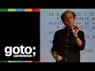

# GOTO 2016 • The Error of Our Ways • Kevlin Henney (2016-11-25)

## Description

This presentation was recorded at GOTO Berlin 2016. #gotocon #gotober
http://gotober.com

Kevlin Henney - Independent Consultant, Speaker, Writer and Trainer

ABSTRACT
What happens when things break? What happens when software fails? We regard it as a normal and personal inconvenience when apps crash or servers become unavailable, but what are the implications beyond the individual user? Is software reliability [...]

Download slides and read the full abstract here:
https://gotocon.com/berlin-2016/presentations/show_talk.jsp?oid=7986

RECOMMENDED BOOKS
Kevlin Henney & Trisha Gee • 97 Things Every Java Programmer Should Know • https://amzn.to/3kiTwJJ

https://twitter.com/gotober
https://www.facebook.com/GOTOConference
http://gotocon.com
#SoftwareEngineering #ITandSociety #philosophy

## Transcript

[0:00:07](https://youtu.be/IiGXq3yY70o?t=7) [Music]  
[0:00:12](https://youtu.be/IiGXq3yY70o?t=12) right thank you good afternoon so my  
[0:00:19](https://youtu.be/IiGXq3yY70o?t=19) parents gave me a conveniently internet  
[0:00:21](https://youtu.be/IiGXq3yY70o?t=21) unique name do this for your children  
[0:00:23](https://youtu.be/IiGXq3yY70o?t=23) okay I did it for my children yes I did  
[0:00:26](https://youtu.be/IiGXq3yY70o?t=26) google their names when they were born  
[0:00:28](https://youtu.be/IiGXq3yY70o?t=28) just to check that the first last name  
[0:00:30](https://youtu.be/IiGXq3yY70o?t=30) combination was unique and it has paid  
[0:00:32](https://youtu.be/IiGXq3yY70o?t=32) off so my older boy now has his own  
[0:00:35](https://youtu.be/IiGXq3yY70o?t=35) domain name you know so you know that  
[0:00:37](https://youtu.be/IiGXq3yY70o?t=37) moment was like 14 years in the making  
[0:00:39](https://youtu.be/IiGXq3yY70o?t=39) now normally what I talk about I worked  
[0:00:44](https://youtu.be/IiGXq3yY70o?t=44) myself I talk about kind of proper curly  
[0:00:47](https://youtu.be/IiGXq3yY70o?t=47) braket nerdy stuff normally talk about  
[0:00:49](https://youtu.be/IiGXq3yY70o?t=49) software architecture design patterns  
[0:00:52](https://youtu.be/IiGXq3yY70o?t=52) development practices very code focused  
[0:00:55](https://youtu.be/IiGXq3yY70o?t=55) stuff talked a lot about test-driven  
[0:00:58](https://youtu.be/IiGXq3yY70o?t=58) development talked with a lot about  
[0:01:00](https://youtu.be/IiGXq3yY70o?t=60) programming paradigms so I'm not going  
[0:01:03](https://youtu.be/IiGXq3yY70o?t=63) to talk about any of those today well  
[0:01:05](https://youtu.be/IiGXq3yY70o?t=65) actually I am a little bit but one of  
[0:01:07](https://youtu.be/IiGXq3yY70o?t=67) the other things that I seem to be known  
[0:01:09](https://youtu.be/IiGXq3yY70o?t=69) for is a fondness for pictures of  
[0:01:14](https://youtu.be/IiGXq3yY70o?t=74) software failures this is one of the  
[0:01:16](https://youtu.be/IiGXq3yY70o?t=76) kind of classics for me  
[0:01:18](https://youtu.be/IiGXq3yY70o?t=78) this is Madrid Airport terminal 1 2006  
[0:01:21](https://youtu.be/IiGXq3yY70o?t=81) October 2006 and it's it's one of these  
[0:01:28](https://youtu.be/IiGXq3yY70o?t=88) things that it's fascinated me for a  
[0:01:30](https://youtu.be/IiGXq3yY70o?t=90) while we have and software developers we  
[0:01:33](https://youtu.be/IiGXq3yY70o?t=93) are the producers of the largest amount  
[0:01:36](https://youtu.be/IiGXq3yY70o?t=96) of installation art on the planet and so  
[0:01:41](https://youtu.be/IiGXq3yY70o?t=101) you know with this one I remember  
[0:01:43](https://youtu.be/IiGXq3yY70o?t=103) specifically with this one that's why I  
[0:01:45](https://youtu.be/IiGXq3yY70o?t=105) remember the dates my youngest son was  
[0:01:47](https://youtu.be/IiGXq3yY70o?t=107) only nine months old at this point  
[0:01:48](https://youtu.be/IiGXq3yY70o?t=108) nine ten months two-year-old and I  
[0:01:50](https://youtu.be/IiGXq3yY70o?t=110) pretty much threw him at my wife while I  
[0:01:53](https://youtu.be/IiGXq3yY70o?t=113) got my camera out to take a photograph  
[0:01:55](https://youtu.be/IiGXq3yY70o?t=115) of this because it's a huge error  
[0:01:56](https://youtu.be/IiGXq3yY70o?t=116) you know it's it's large enough I have  
[0:01:58](https://youtu.be/IiGXq3yY70o?t=118) to take two photographs of it because it  
[0:02:00](https://youtu.be/IiGXq3yY70o?t=120) goes all the way across and so you know  
[0:02:05](https://youtu.be/IiGXq3yY70o?t=125) I'm looking at this as a piece of art as  
[0:02:08](https://youtu.be/IiGXq3yY70o?t=128) something provocative this you know you  
[0:02:11](https://youtu.be/IiGXq3yY70o?t=131) sit there and try and work out the  
[0:02:12](https://youtu.be/IiGXq3yY70o?t=132) operating system no it's not windows  
[0:02:14](https://youtu.be/IiGXq3yY70o?t=134) because windows does not use the  
[0:02:16](https://youtu.be/IiGXq3yY70o?t=136) language of kernel except in one  
[0:02:18](https://youtu.be/IiGXq3yY70o?t=138) particular error message  
[0:02:19](https://youtu.be/IiGXq3yY70o?t=139) so this is most likely a Linux distro  
[0:02:21](https://youtu.be/IiGXq3yY70o?t=141) and you know I'm looking at this game  
[0:02:24](https://youtu.be/IiGXq3yY70o?t=144) all this is really interesting everybody  
[0:02:26](https://youtu.be/IiGXq3yY70o?t=146) else is focusing on the words free  
[0:02:28](https://youtu.be/IiGXq3yY70o?t=148) because that's what humans do five free  
[0:02:31](https://youtu.be/IiGXq3yY70o?t=151) packets I don't know what they are but I  
[0:02:32](https://youtu.be/IiGXq3yY70o?t=152) need to claim them how do I get them so  
[0:02:34](https://youtu.be/IiGXq3yY70o?t=154) you know so this is a constant source of  
[0:02:36](https://youtu.be/IiGXq3yY70o?t=156) fascination to it  
[0:02:38](https://youtu.be/IiGXq3yY70o?t=158) now there's an incidental feature  
[0:02:40](https://youtu.be/IiGXq3yY70o?t=160) because we live in political times we  
[0:02:43](https://youtu.be/IiGXq3yY70o?t=163) always have but we live in political  
[0:02:44](https://youtu.be/IiGXq3yY70o?t=164) times European Union only I'm going to  
[0:02:46](https://youtu.be/IiGXq3yY70o?t=166) come back to that one we get it on our  
[0:02:50](https://youtu.be/IiGXq3yY70o?t=170) screens we get these failures I take  
[0:02:52](https://youtu.be/IiGXq3yY70o?t=172) screenshots I'm going to come back to  
[0:02:53](https://youtu.be/IiGXq3yY70o?t=173) Facebook later as well but I love this  
[0:02:56](https://youtu.be/IiGXq3yY70o?t=176) your feedback will be used to improve  
[0:02:57](https://youtu.be/IiGXq3yY70o?t=177) Facebook thanks for taking the time  
[0:02:59](https://youtu.be/IiGXq3yY70o?t=179) travel to make a report I mean it's just  
[0:03:03](https://youtu.be/IiGXq3yY70o?t=183) like yeah I mean I did not just take the  
[0:03:06](https://youtu.be/IiGXq3yY70o?t=186) time I really took the time I took it  
[0:03:08](https://youtu.be/IiGXq3yY70o?t=188) all the way back if you look at that  
[0:03:10](https://youtu.be/IiGXq3yY70o?t=190) this starts telling you something about  
[0:03:11](https://youtu.be/IiGXq3yY70o?t=191) the nature of failure because look at  
[0:03:13](https://youtu.be/IiGXq3yY70o?t=193) that 31st of December 1969 yes I was I  
[0:03:16](https://youtu.be/IiGXq3yY70o?t=196) was alive but I probably wasn't  
[0:03:18](https://youtu.be/IiGXq3yY70o?t=198) programming much but if you look at that  
[0:03:22](https://youtu.be/IiGXq3yY70o?t=202) what's significant about that date it is  
[0:03:25](https://youtu.be/IiGXq3yY70o?t=205) the day before time began  
[0:03:27](https://youtu.be/IiGXq3yY70o?t=207) yeah the 1st of January in 1970 that is  
[0:03:30](https://youtu.be/IiGXq3yY70o?t=210) officially that when the universe began  
[0:03:32](https://youtu.be/IiGXq3yY70o?t=212) according to Unix so and one of my other  
[0:03:36](https://youtu.be/IiGXq3yY70o?t=216) favorites that you can take this one  
[0:03:37](https://youtu.be/IiGXq3yY70o?t=217) goes back about 10 years and tell it I'm  
[0:03:39](https://youtu.be/IiGXq3yY70o?t=219) using Mozilla at this point it's the  
[0:03:41](https://youtu.be/IiGXq3yY70o?t=221) Dutch rail website and there's something  
[0:03:45](https://youtu.be/IiGXq3yY70o?t=225) interesting about this java dot lang got  
[0:03:49](https://youtu.be/IiGXq3yY70o?t=229) a nullpointerexception  
[0:03:51](https://youtu.be/IiGXq3yY70o?t=231) because i was after a friend of mine  
[0:03:53](https://youtu.be/IiGXq3yY70o?t=233) lives in lived and eivin directs and i  
[0:03:56](https://youtu.be/IiGXq3yY70o?t=236) thought i'm going to go and visit him  
[0:03:57](https://youtu.be/IiGXq3yY70o?t=237) and i would like to get an earlier train  
[0:03:59](https://youtu.be/IiGXq3yY70o?t=239) so i will look for an earlier train  
[0:04:01](https://youtu.be/IiGXq3yY70o?t=241) there are no earlier trains there is  
[0:04:03](https://youtu.be/IiGXq3yY70o?t=243) only nullpointerexception you will look  
[0:04:06](https://youtu.be/IiGXq3yY70o?t=246) into the void and it will look straight  
[0:04:08](https://youtu.be/IiGXq3yY70o?t=248) back at you now what I find fascinating  
[0:04:10](https://youtu.be/IiGXq3yY70o?t=250) about this and this starts telling us  
[0:04:12](https://youtu.be/IiGXq3yY70o?t=252) something about the theme I want to  
[0:04:14](https://youtu.be/IiGXq3yY70o?t=254) explore in this talk which is the  
[0:04:18](https://youtu.be/IiGXq3yY70o?t=258) relationship of failure to people of  
[0:04:20](https://youtu.be/IiGXq3yY70o?t=260) software failures to people and here we  
[0:04:23](https://youtu.be/IiGXq3yY70o?t=263) start seeing something here even if you  
[0:04:25](https://youtu.be/IiGXq3yY70o?t=265) had not guessed by the completely  
[0:04:27](https://youtu.be/IiGXq3yY70o?t=267) uninhabited URL this is a java  
[0:04:30](https://youtu.be/IiGXq3yY70o?t=270) application when an  
[0:04:33](https://youtu.be/IiGXq3yY70o?t=273) vacation fails all of the efforts of the  
[0:04:36](https://youtu.be/IiGXq3yY70o?t=276) software architects the developers the  
[0:04:37](https://youtu.be/IiGXq3yY70o?t=277) testers to encapsulate their software  
[0:04:40](https://youtu.be/IiGXq3yY70o?t=280) all of those encapsulation decisions are  
[0:04:42](https://youtu.be/IiGXq3yY70o?t=282) rendered useless it's like when you drop  
[0:04:45](https://youtu.be/IiGXq3yY70o?t=285) something you see how it breaks you look  
[0:04:47](https://youtu.be/IiGXq3yY70o?t=287) at the fracture lines this breaks and it  
[0:04:49](https://youtu.be/IiGXq3yY70o?t=289) shows you what's really under the hood  
[0:04:51](https://youtu.be/IiGXq3yY70o?t=291) you've lost all encapsulation at this  
[0:04:53](https://youtu.be/IiGXq3yY70o?t=293) point we can tell how it's built  
[0:04:55](https://youtu.be/IiGXq3yY70o?t=295) importantly we can also tell how it's  
[0:04:57](https://youtu.be/IiGXq3yY70o?t=297) built because this is a really simple  
[0:05:00](https://youtu.be/IiGXq3yY70o?t=300) error to trap what we're learning here  
[0:05:03](https://youtu.be/IiGXq3yY70o?t=303) is something about the development  
[0:05:04](https://youtu.be/IiGXq3yY70o?t=304) practices it's really easy to test for  
[0:05:06](https://youtu.be/IiGXq3yY70o?t=306) this case so what does this tell us  
[0:05:08](https://youtu.be/IiGXq3yY70o?t=308) about the team were they under a lot of  
[0:05:10](https://youtu.be/IiGXq3yY70o?t=310) pressure or did they not know well  
[0:05:12](https://youtu.be/IiGXq3yY70o?t=312) they're not familiar with conventional  
[0:05:13](https://youtu.be/IiGXq3yY70o?t=313) practice you know big try block around  
[0:05:15](https://youtu.be/IiGXq3yY70o?t=315) everything do not let the user see this  
[0:05:18](https://youtu.be/IiGXq3yY70o?t=318) kind of thing you know give them a  
[0:05:20](https://youtu.be/IiGXq3yY70o?t=320) message in Dutch or in English saying  
[0:05:23](https://youtu.be/IiGXq3yY70o?t=323) I'm sorry things don't appear to be  
[0:05:25](https://youtu.be/IiGXq3yY70o?t=325) working right now but don't give it to  
[0:05:26](https://youtu.be/IiGXq3yY70o?t=326) them in Java and so there's a sort of an  
[0:05:28](https://youtu.be/IiGXq3yY70o?t=328) interesting thing here we're learning  
[0:05:29](https://youtu.be/IiGXq3yY70o?t=329) about the team what pressures were they  
[0:05:31](https://youtu.be/IiGXq3yY70o?t=331) under what knowledge do they have do  
[0:05:33](https://youtu.be/IiGXq3yY70o?t=333) they have an incentive to improve are  
[0:05:34](https://youtu.be/IiGXq3yY70o?t=334) they aware of these practices  
[0:05:36](https://youtu.be/IiGXq3yY70o?t=336) so it starts telling us something about  
[0:05:37](https://youtu.be/IiGXq3yY70o?t=337) the organization that creates it so from  
[0:05:41](https://youtu.be/IiGXq3yY70o?t=341) this tiny fracture we can start asking  
[0:05:42](https://youtu.be/IiGXq3yY70o?t=342) some questions it has now reached the  
[0:05:46](https://youtu.be/IiGXq3yY70o?t=346) point though that I no longer have to  
[0:05:49](https://youtu.be/IiGXq3yY70o?t=349) take photographs people now send me  
[0:05:53](https://youtu.be/IiGXq3yY70o?t=353) photographs I have I have 800 and this  
[0:05:59](https://youtu.be/IiGXq3yY70o?t=359) is this was said to be and another  
[0:06:02](https://youtu.be/IiGXq3yY70o?t=362) beautiful example when something breaks  
[0:06:04](https://youtu.be/IiGXq3yY70o?t=364) you see how it is built here it is using  
[0:06:06](https://youtu.be/IiGXq3yY70o?t=366) PHP we can see the object model you know  
[0:06:09](https://youtu.be/IiGXq3yY70o?t=369) it fractures on the floor and so we  
[0:06:12](https://youtu.be/IiGXq3yY70o?t=372) start learning about these things it has  
[0:06:14](https://youtu.be/IiGXq3yY70o?t=374) actually got to the point and things are  
[0:06:17](https://youtu.be/IiGXq3yY70o?t=377) retweeted to me so often but apparently  
[0:06:19](https://youtu.be/IiGXq3yY70o?t=379) these are now I'm now an adjective it's  
[0:06:23](https://youtu.be/IiGXq3yY70o?t=383) a careful in heavy screen  
[0:06:27](https://youtu.be/IiGXq3yY70o?t=387) and a week and a half ago at agile in  
[0:06:30](https://youtu.be/IiGXq3yY70o?t=390) the city Inn in Bristol where I live one  
[0:06:34](https://youtu.be/IiGXq3yY70o?t=394) of the guys one of the organizers John  
[0:06:35](https://youtu.be/IiGXq3yY70o?t=395) Clapham said Kevin there's one of those  
[0:06:37](https://youtu.be/IiGXq3yY70o?t=397) screens here in the in the venue I think  
[0:06:41](https://youtu.be/IiGXq3yY70o?t=401) we should take a picture of you standing  
[0:06:44](https://youtu.be/IiGXq3yY70o?t=404) in front of it I will tweet it and then  
[0:06:47](https://youtu.be/IiGXq3yY70o?t=407) you can retweet it so we can have this  
[0:06:48](https://youtu.be/IiGXq3yY70o?t=408) kind of like cyclic effect so yeah I'm  
[0:06:52](https://youtu.be/IiGXq3yY70o?t=412) absolutely fascinated by all of these  
[0:06:54](https://youtu.be/IiGXq3yY70o?t=414) things now some of these are obviously  
[0:06:55](https://youtu.be/IiGXq3yY70o?t=415) kind of just general configuration  
[0:06:56](https://youtu.be/IiGXq3yY70o?t=416) errors but they make a point about the  
[0:07:00](https://youtu.be/IiGXq3yY70o?t=420) impact all of these that I've just shown  
[0:07:02](https://youtu.be/IiGXq3yY70o?t=422) are it's some level minor inconvenience  
[0:07:05](https://youtu.be/IiGXq3yY70o?t=425) and we don't just see it out there in  
[0:07:08](https://youtu.be/IiGXq3yY70o?t=428) the world or on our browser we see it in  
[0:07:09](https://youtu.be/IiGXq3yY70o?t=429) our apps and sometimes it deals with  
[0:07:11](https://youtu.be/IiGXq3yY70o?t=431) money  
[0:07:12](https://youtu.be/IiGXq3yY70o?t=432) this is actually fascinating you cannot  
[0:07:13](https://youtu.be/IiGXq3yY70o?t=433) pay by paypal for orders over 0 pounds  
[0:07:15](https://youtu.be/IiGXq3yY70o?t=435) that's not very useful so this is the  
[0:07:24](https://youtu.be/IiGXq3yY70o?t=444) interesting thing these are all small  
[0:07:26](https://youtu.be/IiGXq3yY70o?t=446) they represent personal inconvenience  
[0:07:28](https://youtu.be/IiGXq3yY70o?t=448) the bugs that we have somebody laughs at  
[0:07:32](https://youtu.be/IiGXq3yY70o?t=452) them they take a photograph they tweet  
[0:07:34](https://youtu.be/IiGXq3yY70o?t=454) it to me and they represent a minor blip  
[0:07:37](https://youtu.be/IiGXq3yY70o?t=457) in somebody's daily experience but what  
[0:07:40](https://youtu.be/IiGXq3yY70o?t=460) happens if it gets bigger so I want to  
[0:07:44](https://youtu.be/IiGXq3yY70o?t=464) take you back to 2012 here because I  
[0:07:46](https://youtu.be/IiGXq3yY70o?t=466) apparently I can time travel according  
[0:07:47](https://youtu.be/IiGXq3yY70o?t=467) to Facebook which is a really neat skill  
[0:07:49](https://youtu.be/IiGXq3yY70o?t=469) I want to take you two back to 2012 I  
[0:07:52](https://youtu.be/IiGXq3yY70o?t=472) want to take you back to the 31st of  
[0:07:53](https://youtu.be/IiGXq3yY70o?t=473) July 2012 and the new york stock  
[0:07:57](https://youtu.be/IiGXq3yY70o?t=477) exchange new york stock exchange it was  
[0:07:58](https://youtu.be/IiGXq3yY70o?t=478) introducing a new system and a  
[0:08:02](https://youtu.be/IiGXq3yY70o?t=482) particular company night capital group  
[0:08:05](https://youtu.be/IiGXq3yY70o?t=485) decided to upgrade their servers in the  
[0:08:07](https://youtu.be/IiGXq3yY70o?t=487) week before in anticipation of the  
[0:08:09](https://youtu.be/IiGXq3yY70o?t=489) changeover on the 1st of august 9:30  
[0:08:14](https://youtu.be/IiGXq3yY70o?t=494) Eastern Time Eastern summer time  
[0:08:17](https://youtu.be/IiGXq3yY70o?t=497) actually has daylight savings time they  
[0:08:19](https://youtu.be/IiGXq3yY70o?t=499) the market opened and they started  
[0:08:23](https://youtu.be/IiGXq3yY70o?t=503) trading nightcap group realized a 460  
[0:08:27](https://youtu.be/IiGXq3yY70o?t=507) million u.s. dollar loss in 45 minutes  
[0:08:30](https://youtu.be/IiGXq3yY70o?t=510) not bad 10 million dollars a minute  
[0:08:33](https://youtu.be/IiGXq3yY70o?t=513) that's skill that's algorithmic trading  
[0:08:36](https://youtu.be/IiGXq3yY70o?t=516) doing the wrong thing at high speed  
[0:08:39](https://youtu.be/IiGXq3yY70o?t=519) okay it'sjust but actually the story is  
[0:08:42](https://youtu.be/IiGXq3yY70o?t=522) worse than that in some ways I mean  
[0:08:43](https://youtu.be/IiGXq3yY70o?t=523) let's just put it this way night capital  
[0:08:45](https://youtu.be/IiGXq3yY70o?t=525) is no longer with us in its form because  
[0:08:47](https://youtu.be/IiGXq3yY70o?t=527) it only had assets of about 400 million  
[0:08:52](https://youtu.be/IiGXq3yY70o?t=532) but they actually lost more in that day  
[0:08:54](https://youtu.be/IiGXq3yY70o?t=534) this is the amount that was outstanding  
[0:08:56](https://youtu.be/IiGXq3yY70o?t=536) after everything had been rolled back  
[0:08:58](https://youtu.be/IiGXq3yY70o?t=538) there's a kind of a agreement that  
[0:09:00](https://youtu.be/IiGXq3yY70o?t=540) software is you know if something arises  
[0:09:03](https://youtu.be/IiGXq3yY70o?t=543) through a software you roll things back  
[0:09:04](https://youtu.be/IiGXq3yY70o?t=544) this is as far as they were able to roll  
[0:09:06](https://youtu.be/IiGXq3yY70o?t=546) it back they lost billions in 45 minutes  
[0:09:09](https://youtu.be/IiGXq3yY70o?t=549) outstanding now there's a really good  
[0:09:11](https://youtu.be/IiGXq3yY70o?t=551) blog I'm going to quote from I've read a  
[0:09:13](https://youtu.be/IiGXq3yY70o?t=553) number of reports about this but I think  
[0:09:15](https://youtu.be/IiGXq3yY70o?t=555) Doug sevens won a couple of years back  
[0:09:17](https://youtu.be/IiGXq3yY70o?t=557) he takes a DevOps perspective he's  
[0:09:19](https://youtu.be/IiGXq3yY70o?t=559) looking at it from the perspective of  
[0:09:21](https://youtu.be/IiGXq3yY70o?t=561) how the system was configured but as a  
[0:09:24](https://youtu.be/IiGXq3yY70o?t=564) couple of points I want to make not only  
[0:09:26](https://youtu.be/IiGXq3yY70o?t=566) does he summarize it well there's a  
[0:09:27](https://youtu.be/IiGXq3yY70o?t=567) couple of other points  
[0:09:28](https://youtu.be/IiGXq3yY70o?t=568) he says the updates Mars was intended  
[0:09:30](https://youtu.be/IiGXq3yY70o?t=570) the system in question was intended to  
[0:09:32](https://youtu.be/IiGXq3yY70o?t=572) replace old unused code referred to as  
[0:09:35](https://youtu.be/IiGXq3yY70o?t=575) power peg functionality that night  
[0:09:38](https://youtu.be/IiGXq3yY70o?t=578) hadn't used in eight years when I'm  
[0:09:41](https://youtu.be/IiGXq3yY70o?t=581) talking about software architecture and  
[0:09:43](https://youtu.be/IiGXq3yY70o?t=583) software quality and the effect of this  
[0:09:45](https://youtu.be/IiGXq3yY70o?t=585) on agility my normal pitch is that dead  
[0:09:48](https://youtu.be/IiGXq3yY70o?t=588) code has a problem it is the dark matter  
[0:09:51](https://youtu.be/IiGXq3yY70o?t=591) of your system it shapes your system  
[0:09:54](https://youtu.be/IiGXq3yY70o?t=594) even though you can't really see it you  
[0:09:55](https://youtu.be/IiGXq3yY70o?t=595) don't notice it it is still there and it  
[0:09:59](https://youtu.be/IiGXq3yY70o?t=599) has a very strong exerts a very strong  
[0:10:01](https://youtu.be/IiGXq3yY70o?t=601) force on your system and the problem is  
[0:10:04](https://youtu.be/IiGXq3yY70o?t=604) there is no code that is truly dead okay  
[0:10:07](https://youtu.be/IiGXq3yY70o?t=607) it turns out all you need to do is make  
[0:10:09](https://youtu.be/IiGXq3yY70o?t=609) a small assumption a change of an  
[0:10:11](https://youtu.be/IiGXq3yY70o?t=611) assumption and then suddenly it's no  
[0:10:14](https://youtu.be/IiGXq3yY70o?t=614) longer dead it's zombie code it has come  
[0:10:16](https://youtu.be/IiGXq3yY70o?t=616) back to life and the zombie apocalypse  
[0:10:17](https://youtu.be/IiGXq3yY70o?t=617) costs money now by the way if you're  
[0:10:21](https://youtu.be/IiGXq3yY70o?t=621) looking for a safe haven the world is  
[0:10:23](https://youtu.be/IiGXq3yY70o?t=623) changing place if you're looking for a  
[0:10:24](https://youtu.be/IiGXq3yY70o?t=624) safe haven so I said in Bristol where I  
[0:10:28](https://youtu.be/IiGXq3yY70o?t=628) live the City Council actually has a  
[0:10:31](https://youtu.be/IiGXq3yY70o?t=631) zombie apocalypse plan okay  
[0:10:34](https://youtu.be/IiGXq3yY70o?t=634) you can google it zombie apocalypse plan  
[0:10:39](https://youtu.be/IiGXq3yY70o?t=639) City Council Bristol should probably get  
[0:10:41](https://youtu.be/IiGXq3yY70o?t=641) you there yeah it's a 2 3 page  
[0:10:43](https://youtu.be/IiGXq3yY70o?t=643) description of you know it's we actually  
[0:10:46](https://youtu.be/IiGXq3yY70o?t=646) have plans so I feel safe um but not too  
[0:10:49](https://youtu.be/IiGXq3yY70o?t=649) safe against this because this is zombie  
[0:10:51](https://youtu.be/IiGXq3yY70o?t=651) code so there's a point here there's  
[0:10:52](https://youtu.be/IiGXq3yY70o?t=652) dead  
[0:10:53](https://youtu.be/IiGXq3yY70o?t=653) code here in the system now this is the  
[0:10:55](https://youtu.be/IiGXq3yY70o?t=655) interesting thing  
[0:10:56](https://youtu.be/IiGXq3yY70o?t=656) dug 7 then observes why code that had  
[0:10:58](https://youtu.be/IiGXq3yY70o?t=658) been dead for eight years was still  
[0:10:59](https://youtu.be/IiGXq3yY70o?t=659) present in the code base is a mystery  
[0:11:00](https://youtu.be/IiGXq3yY70o?t=660) but that's not the point actually it is  
[0:11:05](https://youtu.be/IiGXq3yY70o?t=665) because what we're dealing with here is  
[0:11:07](https://youtu.be/IiGXq3yY70o?t=667) the the eight servers that were supposed  
[0:11:09](https://youtu.be/IiGXq3yY70o?t=669) to be upgraded  
[0:11:10](https://youtu.be/IiGXq3yY70o?t=670) there was an incorrect deployment one of  
[0:11:12](https://youtu.be/IiGXq3yY70o?t=672) them was not upgraded just for those of  
[0:11:14](https://youtu.be/IiGXq3yY70o?t=674) you who are interested in this  
[0:11:16](https://youtu.be/IiGXq3yY70o?t=676) it was manually they were manually  
[0:11:18](https://youtu.be/IiGXq3yY70o?t=678) updated okay so this is yeah this is  
[0:11:21](https://youtu.be/IiGXq3yY70o?t=681) okay so this should have been automated  
[0:11:23](https://youtu.be/IiGXq3yY70o?t=683) but seven out of eight were updated but  
[0:11:26](https://youtu.be/IiGXq3yY70o?t=686) not the eighth one so it's running the  
[0:11:28](https://youtu.be/IiGXq3yY70o?t=688) old code not the new code now an  
[0:11:30](https://youtu.be/IiGXq3yY70o?t=690) important point here is he says that's  
[0:11:33](https://youtu.be/IiGXq3yY70o?t=693) not the point  
[0:11:33](https://youtu.be/IiGXq3yY70o?t=693) no it is because when things like this  
[0:11:36](https://youtu.be/IiGXq3yY70o?t=696) happen they don't happen because of one  
[0:11:38](https://youtu.be/IiGXq3yY70o?t=698) thing or another they happen because of  
[0:11:40](https://youtu.be/IiGXq3yY70o?t=700) one thing and another had it just been  
[0:11:43](https://youtu.be/IiGXq3yY70o?t=703) an incorrect deployment and there been  
[0:11:45](https://youtu.be/IiGXq3yY70o?t=705) no dead code to bring back to life this  
[0:11:48](https://youtu.be/IiGXq3yY70o?t=708) problem would have mad that wouldn't  
[0:11:49](https://youtu.be/IiGXq3yY70o?t=709) have manifested itself had it been a  
[0:11:51](https://youtu.be/IiGXq3yY70o?t=711) correct deployment and the dead code had  
[0:11:54](https://youtu.be/IiGXq3yY70o?t=714) still been there there wouldn't have  
[0:11:55](https://youtu.be/IiGXq3yY70o?t=715) been a problem so the point is that  
[0:11:57](https://youtu.be/IiGXq3yY70o?t=717) these events occur because of a perfect  
[0:12:01](https://youtu.be/IiGXq3yY70o?t=721) storm of things so that is part of the  
[0:12:03](https://youtu.be/IiGXq3yY70o?t=723) point there these subtle things they're  
[0:12:05](https://youtu.be/IiGXq3yY70o?t=725) very difficult to recreate it's an  
[0:12:07](https://youtu.be/IiGXq3yY70o?t=727) assumption combined with another  
[0:12:09](https://youtu.be/IiGXq3yY70o?t=729) assumption combined with another so what  
[0:12:12](https://youtu.be/IiGXq3yY70o?t=732) was the assumption well I'm sure  
[0:12:15](https://youtu.be/IiGXq3yY70o?t=735) nobody's ever done this I have the code  
[0:12:19](https://youtu.be/IiGXq3yY70o?t=739) that was updated repurposed an old flag  
[0:12:21](https://youtu.be/IiGXq3yY70o?t=741) that was used to activate the power peg  
[0:12:22](https://youtu.be/IiGXq3yY70o?t=742) functionality you recycle an old flag  
[0:12:24](https://youtu.be/IiGXq3yY70o?t=744) you recycle an old bit of memory  
[0:12:26](https://youtu.be/IiGXq3yY70o?t=746) something to save you having to change  
[0:12:28](https://youtu.be/IiGXq3yY70o?t=748) the format of something that is  
[0:12:29](https://youtu.be/IiGXq3yY70o?t=749) established within an organization we  
[0:12:31](https://youtu.be/IiGXq3yY70o?t=751) can't change that that group says that  
[0:12:34](https://youtu.be/IiGXq3yY70o?t=754) we can't have more bytes in our headers  
[0:12:36](https://youtu.be/IiGXq3yY70o?t=756) and all the rest of it so something  
[0:12:38](https://youtu.be/IiGXq3yY70o?t=758) happens like this and that was the issue  
[0:12:40](https://youtu.be/IiGXq3yY70o?t=760) and then at that point boom first 45  
[0:12:42](https://youtu.be/IiGXq3yY70o?t=762) minutes the market was open handled  
[0:12:45](https://youtu.be/IiGXq3yY70o?t=765) loads of parent orders four million  
[0:12:48](https://youtu.be/IiGXq3yY70o?t=768) transactions and against nearly 400  
[0:12:51](https://youtu.be/IiGXq3yY70o?t=771) million shares and goodbye night capital  
[0:12:53](https://youtu.be/IiGXq3yY70o?t=773) so it turns out that this little  
[0:12:56](https://youtu.be/IiGXq3yY70o?t=776) coincidence had very very big knock-on  
[0:12:59](https://youtu.be/IiGXq3yY70o?t=779) effects but if you want something really  
[0:13:02](https://youtu.be/IiGXq3yY70o?t=782) explosive then one of my other favorite  
[0:13:05](https://youtu.be/IiGXq3yY70o?t=785) examples  
[0:13:06](https://youtu.be/IiGXq3yY70o?t=786) was the maiden flight of Ariane 5 in  
[0:13:10](https://youtu.be/IiGXq3yY70o?t=790) 1996 4th of June I remember correctly I  
[0:13:14](https://youtu.be/IiGXq3yY70o?t=794) mean Ariane 5 is a magnificent launcher  
[0:13:17](https://youtu.be/IiGXq3yY70o?t=797) it's a very powerful launcher for  
[0:13:19](https://youtu.be/IiGXq3yY70o?t=799) putting satellites into low to high  
[0:13:21](https://youtu.be/IiGXq3yY70o?t=801) orbit and its maiden flight looked a bit  
[0:13:27](https://youtu.be/IiGXq3yY70o?t=807) like this one of the world's most  
[0:13:30](https://youtu.be/IiGXq3yY70o?t=810) expensive fireworks that's 370 million  
[0:13:36](https://youtu.be/IiGXq3yY70o?t=816) dollars it was estimated that and that  
[0:13:38](https://youtu.be/IiGXq3yY70o?t=818) was about 38 39 seconds into flight so  
[0:13:41](https://youtu.be/IiGXq3yY70o?t=821) 10 million dollars a second yeah so yeah  
[0:13:45](https://youtu.be/IiGXq3yY70o?t=825) beat that night capital so the point  
[0:13:48](https://youtu.be/IiGXq3yY70o?t=828) here is they scattered pieces of the  
[0:13:51](https://youtu.be/IiGXq3yY70o?t=831) cluster mission over the forest of  
[0:13:53](https://youtu.be/IiGXq3yY70o?t=833) French Guiana which I'm pretty sure did  
[0:13:55](https://youtu.be/IiGXq3yY70o?t=835) not need that kind of topping and  
[0:13:59](https://youtu.be/IiGXq3yY70o?t=839) ultimately it turns out I dug through  
[0:14:03](https://youtu.be/IiGXq3yY70o?t=843) this it's kind of interesting I found  
[0:14:05](https://youtu.be/IiGXq3yY70o?t=845) the original Cove yeah I read about it  
[0:14:09](https://youtu.be/IiGXq3yY70o?t=849) in 1996 but I didn't find the original  
[0:14:11](https://youtu.be/IiGXq3yY70o?t=851) cones about 5 or 6 years ago my  
[0:14:13](https://youtu.be/IiGXq3yY70o?t=853) co-author Frank Bushman showed me  
[0:14:15](https://youtu.be/IiGXq3yY70o?t=855) something he said Kevin have you seen  
[0:14:18](https://youtu.be/IiGXq3yY70o?t=858) the code from the you know the Arianne  
[0:14:19](https://youtu.be/IiGXq3yY70o?t=859) thing and I said yeah I sometimes talk  
[0:14:21](https://youtu.be/IiGXq3yY70o?t=861) about it have you seen the code and he  
[0:14:23](https://youtu.be/IiGXq3yY70o?t=863) showed me a little piece of code and I  
[0:14:25](https://youtu.be/IiGXq3yY70o?t=865) said that's not the code and he said how  
[0:14:28](https://youtu.be/IiGXq3yY70o?t=868) can you be sure I said I can read it  
[0:14:32](https://youtu.be/IiGXq3yY70o?t=872) the guys who wrote this code they they  
[0:14:35](https://youtu.be/IiGXq3yY70o?t=875) don't read stuff like this in fact if  
[0:14:38](https://youtu.be/IiGXq3yY70o?t=878) you want to guess the language as you  
[0:14:40](https://youtu.be/IiGXq3yY70o?t=880) know some people are guessing but I the  
[0:14:43](https://youtu.be/IiGXq3yY70o?t=883) most perfect description came to me from  
[0:14:44](https://youtu.be/IiGXq3yY70o?t=884) Linda Riesling when I'd use this slider  
[0:14:46](https://youtu.be/IiGXq3yY70o?t=886) a couple of years back and it's a de  
[0:14:48](https://youtu.be/IiGXq3yY70o?t=888) Tran in other words it's a de but spoken  
[0:14:52](https://youtu.be/IiGXq3yY70o?t=892) with a very strong Fortran accent yeah  
[0:14:55](https://youtu.be/IiGXq3yY70o?t=895) okay  
[0:14:56](https://youtu.be/IiGXq3yY70o?t=896) and use it makes no use of any of the  
[0:15:00](https://youtu.be/IiGXq3yY70o?t=900) facilities of Ada whatsoever and and  
[0:15:02](https://youtu.be/IiGXq3yY70o?t=902) what you can see is even without knowing  
[0:15:04](https://youtu.be/IiGXq3yY70o?t=904) the language there are some things that  
[0:15:06](https://youtu.be/IiGXq3yY70o?t=906) might if you're if you're a software  
[0:15:08](https://youtu.be/IiGXq3yY70o?t=908) developer there's some things that might  
[0:15:09](https://youtu.be/IiGXq3yY70o?t=909) arouse your suspicions it's like hard  
[0:15:12](https://youtu.be/IiGXq3yY70o?t=912) coded numbers the same hard-coded  
[0:15:14](https://youtu.be/IiGXq3yY70o?t=914) numbers that obviously have some kind of  
[0:15:16](https://youtu.be/IiGXq3yY70o?t=916) 16-bit significance and also that's the  
[0:15:20](https://youtu.be/IiGXq3yY70o?t=920) same number in hexadecimal so not only  
[0:15:22](https://youtu.be/IiGXq3yY70o?t=922) they're hard coded but the programmer  
[0:15:23](https://youtu.be/IiGXq3yY70o?t=923) got so bored that they switched base  
[0:15:25](https://youtu.be/IiGXq3yY70o?t=925) just to make it more interesting  
[0:15:27](https://youtu.be/IiGXq3yY70o?t=927) okay the same structure the same  
[0:15:32](https://youtu.be/IiGXq3yY70o?t=932) checking what we're doing here is with  
[0:15:33](https://youtu.be/IiGXq3yY70o?t=933) Thresh holding we're checking that  
[0:15:35](https://youtu.be/IiGXq3yY70o?t=935) something's not too great if it's too  
[0:15:36](https://youtu.be/IiGXq3yY70o?t=936) large then we cut it at an upper limit  
[0:15:39](https://youtu.be/IiGXq3yY70o?t=939) it's saturated arithmetic what they're  
[0:15:41](https://youtu.be/IiGXq3yY70o?t=941) doing just for a bit of guidance here is  
[0:15:44](https://youtu.be/IiGXq3yY70o?t=944) V and H that's vertical and horizontal  
[0:15:50](https://youtu.be/IiGXq3yY70o?t=950) and what they're doing here is their  
[0:15:52](https://youtu.be/IiGXq3yY70o?t=952) threshold encoder flow to have integer  
[0:16:02](https://youtu.be/IiGXq3yY70o?t=962) to floating-point overflow in this case  
[0:16:06](https://youtu.be/IiGXq3yY70o?t=966) so this one is unguarded that one is  
[0:16:10](https://youtu.be/IiGXq3yY70o?t=970) unguarded it's not possible for Ariane  
[0:16:12](https://youtu.be/IiGXq3yY70o?t=972) four to exceed this now if you've been  
[0:16:14](https://youtu.be/IiGXq3yY70o?t=974) paying attention and I know it's the end  
[0:16:16](https://youtu.be/IiGXq3yY70o?t=976) of the day you might not have been  
[0:16:17](https://youtu.be/IiGXq3yY70o?t=977) you'll notice I'm talking about ariane  
[0:16:19](https://youtu.be/IiGXq3yY70o?t=979) for now  
[0:16:20](https://youtu.be/IiGXq3yY70o?t=980) this is reuse this is ariane for code  
[0:16:24](https://youtu.be/IiGXq3yY70o?t=984) sitting in ariane 5 this code doesn't  
[0:16:27](https://youtu.be/IiGXq3yY70o?t=987) even have a purpose in ariane 5 it's  
[0:16:29](https://youtu.be/IiGXq3yY70o?t=989) dead code it doesn't even have a role  
[0:16:32](https://youtu.be/IiGXq3yY70o?t=992) and the funniest thing is at 40 seconds  
[0:16:36](https://youtu.be/IiGXq3yY70o?t=996) it shuts off but at 37 seconds it  
[0:16:39](https://youtu.be/IiGXq3yY70o?t=999) overflows and causes a very spectacular  
[0:16:43](https://youtu.be/IiGXq3yY70o?t=1003) spiral of the rocket and  
[0:16:45](https://youtu.be/IiGXq3yY70o?t=1005) that point a really neat piece of  
[0:16:47](https://youtu.be/IiGXq3yY70o?t=1007) software kicks in it's called the  
[0:16:49](https://youtu.be/IiGXq3yY70o?t=1009) self-destruct system that's what the  
[0:16:52](https://youtu.be/IiGXq3yY70o?t=1012) self-destruct system does you see up  
[0:16:54](https://youtu.be/IiGXq3yY70o?t=1014) until 1996 I was used to think that  
[0:16:57](https://youtu.be/IiGXq3yY70o?t=1017) self-destruct was a thing they did in  
[0:16:58](https://youtu.be/IiGXq3yY70o?t=1018) Star Trek and other films but actually  
[0:17:00](https://youtu.be/IiGXq3yY70o?t=1020) no real Rockets it turns out have a  
[0:17:02](https://youtu.be/IiGXq3yY70o?t=1022) self-destruct system because it turns  
[0:17:04](https://youtu.be/IiGXq3yY70o?t=1024) out their missiles and you really don't  
[0:17:06](https://youtu.be/IiGXq3yY70o?t=1026) want those going out of control so at  
[0:17:08](https://youtu.be/IiGXq3yY70o?t=1028) least the self-destruct system works so  
[0:17:09](https://youtu.be/IiGXq3yY70o?t=1029) if you were the author of that code well  
[0:17:11](https://youtu.be/IiGXq3yY70o?t=1031) done nice one how do you know your code  
[0:17:14](https://youtu.be/IiGXq3yY70o?t=1034) works yeah so what we see here is there  
[0:17:18](https://youtu.be/IiGXq3yY70o?t=1038) are some really interesting impacts what  
[0:17:20](https://youtu.be/IiGXq3yY70o?t=1040) we're dealing with at this point is this  
[0:17:22](https://youtu.be/IiGXq3yY70o?t=1042) had profound  
[0:17:23](https://youtu.be/IiGXq3yY70o?t=1043) repercussions not simply a business not  
[0:17:25](https://youtu.be/IiGXq3yY70o?t=1045) simply some small company it's not a  
[0:17:28](https://youtu.be/IiGXq3yY70o?t=1048) ripple in the market this actually had  
[0:17:30](https://youtu.be/IiGXq3yY70o?t=1050) some major implications for aerospace  
[0:17:32](https://youtu.be/IiGXq3yY70o?t=1052) the owners of the cluster mission and a  
[0:17:34](https://youtu.be/IiGXq3yY70o?t=1054) lot of stuff how easy is it to stop this  
[0:17:36](https://youtu.be/IiGXq3yY70o?t=1056) stuff how can we address this or it  
[0:17:39](https://youtu.be/IiGXq3yY70o?t=1059) turns out a recent paper makes a very  
[0:17:42](https://youtu.be/IiGXq3yY70o?t=1062) very simple point we know we should be  
[0:17:45](https://youtu.be/IiGXq3yY70o?t=1065) testing but do we have evidence simple  
[0:17:47](https://youtu.be/IiGXq3yY70o?t=1067) testing can prevent most critical  
[0:17:49](https://youtu.be/IiGXq3yY70o?t=1069) failures almost all catastrophic failure  
[0:17:52](https://youtu.be/IiGXq3yY70o?t=1072) in an analysis of certain open source  
[0:17:54](https://youtu.be/IiGXq3yY70o?t=1074) distributed system software almost all  
[0:17:56](https://youtu.be/IiGXq3yY70o?t=1076) catastrophic failures are the result of  
[0:17:58](https://youtu.be/IiGXq3yY70o?t=1078) incorrect handling of non fatal errors  
[0:18:00](https://youtu.be/IiGXq3yY70o?t=1080) explicitly signaled in software in other  
[0:18:02](https://youtu.be/IiGXq3yY70o?t=1082) words what we're dealing with is oh no  
[0:18:05](https://youtu.be/IiGXq3yY70o?t=1085) something's gone wrong and the code that  
[0:18:07](https://youtu.be/IiGXq3yY70o?t=1087) handles the oh no something's gone wrong  
[0:18:08](https://youtu.be/IiGXq3yY70o?t=1088) goes wrong these are very untested paths  
[0:18:12](https://youtu.be/IiGXq3yY70o?t=1092) I remember first coming across this  
[0:18:14](https://youtu.be/IiGXq3yY70o?t=1094) phenomenon about 15 years ago there was  
[0:18:16](https://youtu.be/IiGXq3yY70o?t=1096) a paper that explored the Linux kernel  
[0:18:19](https://youtu.be/IiGXq3yY70o?t=1099) and the defects in the Linux kernel it  
[0:18:20](https://youtu.be/IiGXq3yY70o?t=1100) turns out that most of the defects are  
[0:18:22](https://youtu.be/IiGXq3yY70o?t=1102) on the error handling paths in other  
[0:18:23](https://youtu.be/IiGXq3yY70o?t=1103) words oh no it's gone wrong but we've  
[0:18:25](https://youtu.be/IiGXq3yY70o?t=1105) never tested it because they're  
[0:18:26](https://youtu.be/IiGXq3yY70o?t=1106) unfamiliar paths what was interesting  
[0:18:29](https://youtu.be/IiGXq3yY70o?t=1109) was one of the other results came out of  
[0:18:30](https://youtu.be/IiGXq3yY70o?t=1110) this paper a majority of the production  
[0:18:33](https://youtu.be/IiGXq3yY70o?t=1113) failures as in 3/4 can be reproduced by  
[0:18:37](https://youtu.be/IiGXq3yY70o?t=1117) a unit test I mean that's that's that's  
[0:18:40](https://youtu.be/IiGXq3yY70o?t=1120) really high people often say oh we don't  
[0:18:42](https://youtu.be/IiGXq3yY70o?t=1122) really want to deal with the unit tests  
[0:18:44](https://youtu.be/IiGXq3yY70o?t=1124) and stuff like that we want to test the  
[0:18:45](https://youtu.be/IiGXq3yY70o?t=1125) whole system but a unit test it's very  
[0:18:47](https://youtu.be/IiGXq3yY70o?t=1127) very modest it's very simple and what's  
[0:18:50](https://youtu.be/IiGXq3yY70o?t=1130) interesting is that when we start taking  
[0:18:52](https://youtu.be/IiGXq3yY70o?t=1132) this perspective and I realized as I was  
[0:18:54](https://youtu.be/IiGXq3yY70o?t=1134) putting this talk together this fits in  
[0:18:59](https://youtu.be/IiGXq3yY70o?t=1139) with a class  
[0:19:00](https://youtu.be/IiGXq3yY70o?t=1140) that dates back to 1980 guy called Maya  
[0:19:04](https://youtu.be/IiGXq3yY70o?t=1144) layman Maya mani layman he came up this  
[0:19:08](https://youtu.be/IiGXq3yY70o?t=1148) classification and his focus was not on  
[0:19:10](https://youtu.be/IiGXq3yY70o?t=1150) correctness his focus was on evolution  
[0:19:12](https://youtu.be/IiGXq3yY70o?t=1152) technical debt as we would now consider  
[0:19:13](https://youtu.be/IiGXq3yY70o?t=1153) it and what happens to code over time  
[0:19:16](https://youtu.be/IiGXq3yY70o?t=1156) and he classified programs into three  
[0:19:19](https://youtu.be/IiGXq3yY70o?t=1159) groupings s P and E s programs at s  
[0:19:25](https://youtu.be/IiGXq3yY70o?t=1165) program one whose functionality is  
[0:19:26](https://youtu.be/IiGXq3yY70o?t=1166) formally defined by and derived more  
[0:19:29](https://youtu.be/IiGXq3yY70o?t=1169) from a specification if you do any  
[0:19:31](https://youtu.be/IiGXq3yY70o?t=1171) coding carters or you look at most of  
[0:19:33](https://youtu.be/IiGXq3yY70o?t=1173) the kind of training examples or  
[0:19:35](https://youtu.be/IiGXq3yY70o?t=1175) teaching examples in computer science  
[0:19:36](https://youtu.be/IiGXq3yY70o?t=1176) they mostly fall into this small  
[0:19:39](https://youtu.be/IiGXq3yY70o?t=1179) problems that are well-defined and  
[0:19:40](https://youtu.be/IiGXq3yY70o?t=1180) sometimes we dismiss them as toy  
[0:19:42](https://youtu.be/IiGXq3yY70o?t=1182) problems except that how do you build a  
[0:19:44](https://youtu.be/IiGXq3yY70o?t=1184) large software system you build a large  
[0:19:46](https://youtu.be/IiGXq3yY70o?t=1186) software system out of small bits of  
[0:19:48](https://youtu.be/IiGXq3yY70o?t=1188) software that's the point we build large  
[0:19:51](https://youtu.be/IiGXq3yY70o?t=1191) things out of smaller things and smaller  
[0:19:53](https://youtu.be/IiGXq3yY70o?t=1193) things out of even smaller things  
[0:19:54](https://youtu.be/IiGXq3yY70o?t=1194) Turtles all the way down and that's the  
[0:19:57](https://youtu.be/IiGXq3yY70o?t=1197) important idea is that if we can compose  
[0:20:00](https://youtu.be/IiGXq3yY70o?t=1200) and that was his thesis we can compose  
[0:20:01](https://youtu.be/IiGXq3yY70o?t=1201) more complex systems out of S programs  
[0:20:04](https://youtu.be/IiGXq3yY70o?t=1204) that whose maintenance and lifecycle we  
[0:20:07](https://youtu.be/IiGXq3yY70o?t=1207) can control but importantly that are  
[0:20:09](https://youtu.be/IiGXq3yY70o?t=1209) unit testable that's the additional  
[0:20:11](https://youtu.be/IiGXq3yY70o?t=1211) point P programs are larger programs  
[0:20:13](https://youtu.be/IiGXq3yY70o?t=1213) what we're talking about is although we  
[0:20:16](https://youtu.be/IiGXq3yY70o?t=1216) can define the problem the acceptability  
[0:20:17](https://youtu.be/IiGXq3yY70o?t=1217) of a solution is determined by the  
[0:20:19](https://youtu.be/IiGXq3yY70o?t=1219) environment in which it is embedded it  
[0:20:21](https://youtu.be/IiGXq3yY70o?t=1221) turns out there are some things where P  
[0:20:24](https://youtu.be/IiGXq3yY70o?t=1224) is for real-world problem in other words  
[0:20:25](https://youtu.be/IiGXq3yY70o?t=1225) although I can characterize it to put it  
[0:20:27](https://youtu.be/IiGXq3yY70o?t=1227) into software is is difficult the  
[0:20:30](https://youtu.be/IiGXq3yY70o?t=1230) classic example of this is climate  
[0:20:33](https://youtu.be/IiGXq3yY70o?t=1233) modeling and weather forecasting all I  
[0:20:36](https://youtu.be/IiGXq3yY70o?t=1236) can show you I can tell you what the  
[0:20:37](https://youtu.be/IiGXq3yY70o?t=1237) equations are actually I can't I'd have  
[0:20:38](https://youtu.be/IiGXq3yY70o?t=1238) to look them up but we can look at what  
[0:20:40](https://youtu.be/IiGXq3yY70o?t=1240) the equations are you can't reproduce  
[0:20:43](https://youtu.be/IiGXq3yY70o?t=1243) those faithfully in a digital computer  
[0:20:45](https://youtu.be/IiGXq3yY70o?t=1245) so therefore you have to approximate and  
[0:20:47](https://youtu.be/IiGXq3yY70o?t=1247) if you want it done within the lifetime  
[0:20:50](https://youtu.be/IiGXq3yY70o?t=1250) of this universe and preferably by next  
[0:20:51](https://youtu.be/IiGXq3yY70o?t=1251) week  
[0:20:52](https://youtu.be/IiGXq3yY70o?t=1252) you really have to approximate so  
[0:20:54](https://youtu.be/IiGXq3yY70o?t=1254) therefore although we know the nature of  
[0:20:56](https://youtu.be/IiGXq3yY70o?t=1256) the problem we are unable to state it  
[0:20:58](https://youtu.be/IiGXq3yY70o?t=1258) exactly as it occurs because there's so  
[0:21:00](https://youtu.be/IiGXq3yY70o?t=1260) many different variables we actually  
[0:21:01](https://youtu.be/IiGXq3yY70o?t=1261) find this in a lot of social systems  
[0:21:03](https://youtu.be/IiGXq3yY70o?t=1263) which leads us to the next one e  
[0:21:06](https://youtu.be/IiGXq3yY70o?t=1266) programs that mechanize a human or  
[0:21:08](https://youtu.be/IiGXq3yY70o?t=1268) societal activity in other words ease  
[0:21:12](https://youtu.be/IiGXq3yY70o?t=1272) environment the probe  
[0:21:13](https://youtu.be/IiGXq3yY70o?t=1273) has become a part of world models it is  
[0:21:15](https://youtu.be/IiGXq3yY70o?t=1275) embedded in it it is embedded in the  
[0:21:17](https://youtu.be/IiGXq3yY70o?t=1277) environment and the output of the  
[0:21:20](https://youtu.be/IiGXq3yY70o?t=1280) software affects something in the real  
[0:21:23](https://youtu.be/IiGXq3yY70o?t=1283) world that ultimately becomes its input  
[0:21:25](https://youtu.be/IiGXq3yY70o?t=1285) in a very obvious example of this a  
[0:21:27](https://youtu.be/IiGXq3yY70o?t=1287) particular scale which involves a few  
[0:21:29](https://youtu.be/IiGXq3yY70o?t=1289) devices is an air traffic control system  
[0:21:33](https://youtu.be/IiGXq3yY70o?t=1293) an air traffic control system whatever  
[0:21:35](https://youtu.be/IiGXq3yY70o?t=1295) comes out of that goes through a human  
[0:21:37](https://youtu.be/IiGXq3yY70o?t=1297) to another human that then guides a  
[0:21:39](https://youtu.be/IiGXq3yY70o?t=1299) plane based on that that then has  
[0:21:41](https://youtu.be/IiGXq3yY70o?t=1301) feedback through that in other words at  
[0:21:42](https://youtu.be/IiGXq3yY70o?t=1302) this point we now start modeling a  
[0:21:44](https://youtu.be/IiGXq3yY70o?t=1304) surprising number of the systems that  
[0:21:46](https://youtu.be/IiGXq3yY70o?t=1306) we've created today and they dominate  
[0:21:48](https://youtu.be/IiGXq3yY70o?t=1308) the world today we are in a world of  
[0:21:50](https://youtu.be/IiGXq3yY70o?t=1310) assistance so what are the cons what are  
[0:21:55](https://youtu.be/IiGXq3yY70o?t=1315) the consequences what can we learn from  
[0:21:56](https://youtu.be/IiGXq3yY70o?t=1316) this well one of the things we can learn  
[0:21:57](https://youtu.be/IiGXq3yY70o?t=1317) is that by the way christmas is coming  
[0:21:59](https://youtu.be/IiGXq3yY70o?t=1319) this is a really good book ok 101 things  
[0:22:02](https://youtu.be/IiGXq3yY70o?t=1322) I learned in architecture school it's  
[0:22:04](https://youtu.be/IiGXq3yY70o?t=1324) got nothing to do with software  
[0:22:05](https://youtu.be/IiGXq3yY70o?t=1325) architecture but it does make you look  
[0:22:08](https://youtu.be/IiGXq3yY70o?t=1328) really smart ok if you have this book  
[0:22:10](https://youtu.be/IiGXq3yY70o?t=1330) and people know you have this book they  
[0:22:12](https://youtu.be/IiGXq3yY70o?t=1332) will look at you and they go you're  
[0:22:13](https://youtu.be/IiGXq3yY70o?t=1333) smarter you're more intelligent more  
[0:22:15](https://youtu.be/IiGXq3yY70o?t=1335) educated ok you're not just a software  
[0:22:17](https://youtu.be/IiGXq3yY70o?t=1337) person it's also a really nice book  
[0:22:19](https://youtu.be/IiGXq3yY70o?t=1339) aesthetically but about half the advice  
[0:22:21](https://youtu.be/IiGXq3yY70o?t=1341) in it applies to any design or creative  
[0:22:24](https://youtu.be/IiGXq3yY70o?t=1344) discipline always design a thing by  
[0:22:27](https://youtu.be/IiGXq3yY70o?t=1347) considering it in its next larger  
[0:22:29](https://youtu.be/IiGXq3yY70o?t=1349) context and that means even the small  
[0:22:33](https://youtu.be/IiGXq3yY70o?t=1353) stuff  
[0:22:33](https://youtu.be/IiGXq3yY70o?t=1353) and here's how s stuff if you get it  
[0:22:36](https://youtu.be/IiGXq3yY70o?t=1356) wrong can have a really interesting  
[0:22:37](https://youtu.be/IiGXq3yY70o?t=1357) effect on the East earth ok what if we  
[0:22:41](https://youtu.be/IiGXq3yY70o?t=1361) stay what did we just deploy a piece of  
[0:22:43](https://youtu.be/IiGXq3yY70o?t=1363) code anybody can use it what how much of  
[0:22:47](https://youtu.be/IiGXq3yY70o?t=1367) any one earlier this year  
[0:22:49](https://youtu.be/IiGXq3yY70o?t=1369) because it was known as the left pad  
[0:22:51](https://youtu.be/IiGXq3yY70o?t=1371) incident as the headline the register  
[0:22:53](https://youtu.be/IiGXq3yY70o?t=1373) how one developer just broke node Babel  
[0:22:56](https://youtu.be/IiGXq3yY70o?t=1376) and so on in 11 lines of JavaScript this  
[0:22:59](https://youtu.be/IiGXq3yY70o?t=1379) is what they describe the author of a  
[0:23:02](https://youtu.be/IiGXq3yY70o?t=1382) little little feature left pad pulled  
[0:23:06](https://youtu.be/IiGXq3yY70o?t=1386) his code from a public repository for  
[0:23:11](https://youtu.be/IiGXq3yY70o?t=1391) reasons that were entirely entirely  
[0:23:13](https://youtu.be/IiGXq3yY70o?t=1393) justifiable and to do with rights but he  
[0:23:16](https://youtu.be/IiGXq3yY70o?t=1396) pulled this the Django metaphor is  
[0:23:18](https://youtu.be/IiGXq3yY70o?t=1398) perfect he pulled this and lots of other  
[0:23:22](https://youtu.be/IiGXq3yY70o?t=1402) things came down let's look at that 11  
[0:23:25](https://youtu.be/IiGXq3yY70o?t=1405) lines of code ok  
[0:23:27](https://youtu.be/IiGXq3yY70o?t=1407) so I think this is a beautiful beautiful  
[0:23:28](https://youtu.be/IiGXq3yY70o?t=1408) one from the if you not come across the  
[0:23:31](https://youtu.be/IiGXq3yY70o?t=1411) oh really books or they're really joke  
[0:23:33](https://youtu.be/IiGXq3yY70o?t=1413) covers co-written by some stranger on  
[0:23:35](https://youtu.be/IiGXq3yY70o?t=1415) the internet is always perfect  
[0:23:36](https://youtu.be/IiGXq3yY70o?t=1416) taking on needless dependencies fragile  
[0:23:39](https://youtu.be/IiGXq3yY70o?t=1419) development guide it's a perfect  
[0:23:41](https://youtu.be/IiGXq3yY70o?t=1421) illustration of this so that eleven  
[0:23:43](https://youtu.be/IiGXq3yY70o?t=1423) lines of code what does it do well it's  
[0:23:46](https://youtu.be/IiGXq3yY70o?t=1426) not even very well written this is the  
[0:23:47](https://youtu.be/IiGXq3yY70o?t=1427) eleven lines of code it's what it does  
[0:23:49](https://youtu.be/IiGXq3yY70o?t=1429) is it pads out a string and you can  
[0:23:55](https://youtu.be/IiGXq3yY70o?t=1435) typically Pat it out using spaces or  
[0:23:57](https://youtu.be/IiGXq3yY70o?t=1437) zeros these are the normal things so you  
[0:24:00](https://youtu.be/IiGXq3yY70o?t=1440) you pad it out to a particular size I  
[0:24:02](https://youtu.be/IiGXq3yY70o?t=1442) mean this is really clumsy way of doing  
[0:24:04](https://youtu.be/IiGXq3yY70o?t=1444) it and most programming languages have a  
[0:24:06](https://youtu.be/IiGXq3yY70o?t=1446) better way of doing it in this since  
[0:24:08](https://youtu.be/IiGXq3yY70o?t=1448) that was pulled something else has taken  
[0:24:09](https://youtu.be/IiGXq3yY70o?t=1449) over maintenance they've ended up with  
[0:24:11](https://youtu.be/IiGXq3yY70o?t=1451) this this isn't a talk on development  
[0:24:17](https://youtu.be/IiGXq3yY70o?t=1457) practice but honestly really it's not  
[0:24:21](https://youtu.be/IiGXq3yY70o?t=1461) what it's let me put it this way it's  
[0:24:22](https://youtu.be/IiGXq3yY70o?t=1462) not an improvement it real and it does  
[0:24:27](https://youtu.be/IiGXq3yY70o?t=1467) all those terrible things I'm going to  
[0:24:29](https://youtu.be/IiGXq3yY70o?t=1469) optimize something actually it doesn't  
[0:24:31](https://youtu.be/IiGXq3yY70o?t=1471) optimize them and oh it's shocking so I  
[0:24:35](https://youtu.be/IiGXq3yY70o?t=1475) had a go at doing it and I ended up with  
[0:24:37](https://youtu.be/IiGXq3yY70o?t=1477) this now I'm not asking you to read that  
[0:24:39](https://youtu.be/IiGXq3yY70o?t=1479) I'm just asking you to count the number  
[0:24:40](https://youtu.be/IiGXq3yY70o?t=1480) of lines I'm also asking you to realize  
[0:24:42](https://youtu.be/IiGXq3yY70o?t=1482) I'm not a JavaScript programmer but it's  
[0:24:45](https://youtu.be/IiGXq3yY70o?t=1485) a case of like well yeah this is  
[0:24:46](https://youtu.be/IiGXq3yY70o?t=1486) solvable it's a programming problem how  
[0:24:48](https://youtu.be/IiGXq3yY70o?t=1488) do we know that it works well I decided  
[0:24:50](https://youtu.be/IiGXq3yY70o?t=1490) given I wasn't a JavaScript programmer  
[0:24:52](https://youtu.be/IiGXq3yY70o?t=1492) to write a simple set of tests and I  
[0:24:54](https://youtu.be/IiGXq3yY70o?t=1494) wrote a test framework for it just to  
[0:24:56](https://youtu.be/IiGXq3yY70o?t=1496) prove that so this is all easily doable  
[0:24:58](https://youtu.be/IiGXq3yY70o?t=1498) these are all everything I've shown you  
[0:24:59](https://youtu.be/IiGXq3yY70o?t=1499) here is s program classically s program  
[0:25:02](https://youtu.be/IiGXq3yY70o?t=1502) when you run it against my code it all  
[0:25:04](https://youtu.be/IiGXq3yY70o?t=1504) passes it's all green what's funny is  
[0:25:07](https://youtu.be/IiGXq3yY70o?t=1507) when you actually run it against the  
[0:25:10](https://youtu.be/IiGXq3yY70o?t=1510) published versions of Left pad it's got  
[0:25:12](https://youtu.be/IiGXq3yY70o?t=1512) three bugs it doesn't actually do what  
[0:25:15](https://youtu.be/IiGXq3yY70o?t=1515) it's supposed to and I'm sure people  
[0:25:17](https://youtu.be/IiGXq3yY70o?t=1517) have got workarounds out there that deal  
[0:25:19](https://youtu.be/IiGXq3yY70o?t=1519) with this now apparently as a result of  
[0:25:22](https://youtu.be/IiGXq3yY70o?t=1522) this one of the future versions of Java  
[0:25:24](https://youtu.be/IiGXq3yY70o?t=1524) Script or ACMA script is going to have a  
[0:25:26](https://youtu.be/IiGXq3yY70o?t=1526) little function called pad start to  
[0:25:28](https://youtu.be/IiGXq3yY70o?t=1528) avoid this I mean quite frankly if you  
[0:25:30](https://youtu.be/IiGXq3yY70o?t=1530) do if you're using a proper language yes  
[0:25:32](https://youtu.be/IiGXq3yY70o?t=1532) I am going to have language Wars in this  
[0:25:34](https://youtu.be/IiGXq3yY70o?t=1534) session you thought you were just come  
[0:25:35](https://youtu.be/IiGXq3yY70o?t=1535) into IT in society then you know if  
[0:25:37](https://youtu.be/IiGXq3yY70o?t=1537) you're doing this in person you do that  
[0:25:39](https://youtu.be/IiGXq3yY70o?t=1539) or that  
[0:25:40](https://youtu.be/IiGXq3yY70o?t=1540) that's it one line well there is no  
[0:25:42](https://youtu.be/IiGXq3yY70o?t=1542) problem the Internet does not collapse  
[0:25:43](https://youtu.be/IiGXq3yY70o?t=1543) as a result of this but it's a valid  
[0:25:47](https://youtu.be/IiGXq3yY70o?t=1547) illustration regardless of the language  
[0:25:49](https://youtu.be/IiGXq3yY70o?t=1549) of Anderson's law I get to see any  
[0:25:54](https://youtu.be/IiGXq3yY70o?t=1554) problem however complicated which when  
[0:25:56](https://youtu.be/IiGXq3yY70o?t=1556) you looked at in the right way did not  
[0:25:57](https://youtu.be/IiGXq3yY70o?t=1557) become still more complicated this is  
[0:26:00](https://youtu.be/IiGXq3yY70o?t=1560) Paul Anderson his science fiction author  
[0:26:01](https://youtu.be/IiGXq3yY70o?t=1561) and he has hit the hole of software  
[0:26:04](https://youtu.be/IiGXq3yY70o?t=1564) development on the head with this quote  
[0:26:06](https://youtu.be/IiGXq3yY70o?t=1566) this is the nature of it and we've known  
[0:26:09](https://youtu.be/IiGXq3yY70o?t=1569) that this is not news this is not news  
[0:26:11](https://youtu.be/IiGXq3yY70o?t=1571) in fact we can go back to communications  
[0:26:14](https://youtu.be/IiGXq3yY70o?t=1574) of the ACM Edition in 2000 essica  
[0:26:17](https://youtu.be/IiGXq3yY70o?t=1577) Dijkstra just before he died  
[0:26:19](https://youtu.be/IiGXq3yY70o?t=1579) wrote a very simple piece but he said I  
[0:26:21](https://youtu.be/IiGXq3yY70o?t=1581) therefore like to posit the computing  
[0:26:23](https://youtu.be/IiGXq3yY70o?t=1583) central challenge how not to make a mess  
[0:26:25](https://youtu.be/IiGXq3yY70o?t=1585) of it has not been met most of our  
[0:26:29](https://youtu.be/IiGXq3yY70o?t=1589) systems are much more complicated  
[0:26:30](https://youtu.be/IiGXq3yY70o?t=1590) because it healthy and are too messy and  
[0:26:32](https://youtu.be/IiGXq3yY70o?t=1592) chaotic to be used in comfort and  
[0:26:35](https://youtu.be/IiGXq3yY70o?t=1595) confidence it's that were their  
[0:26:37](https://youtu.be/IiGXq3yY70o?t=1597) confidence where does our confidence  
[0:26:39](https://youtu.be/IiGXq3yY70o?t=1599) derive from what are the consequences  
[0:26:41](https://youtu.be/IiGXq3yY70o?t=1601) what we find is that we might look at  
[0:26:45](https://youtu.be/IiGXq3yY70o?t=1605) these as isolated things oh I'm a  
[0:26:47](https://youtu.be/IiGXq3yY70o?t=1607) developer I've just made a mistake or  
[0:26:48](https://youtu.be/IiGXq3yY70o?t=1608) maybe I can skip that or I'm an  
[0:26:50](https://youtu.be/IiGXq3yY70o?t=1610) organization that does development and  
[0:26:52](https://youtu.be/IiGXq3yY70o?t=1612) yeah our our customers report back these  
[0:26:56](https://youtu.be/IiGXq3yY70o?t=1616) things when they have bugs but the  
[0:26:58](https://youtu.be/IiGXq3yY70o?t=1618) implications are not merely between you  
[0:27:01](https://youtu.be/IiGXq3yY70o?t=1621) and a social responsibility or a kind of  
[0:27:03](https://youtu.be/IiGXq3yY70o?t=1623) professional responsibility it goes much  
[0:27:04](https://youtu.be/IiGXq3yY70o?t=1624) much further because clearly that  
[0:27:06](https://youtu.be/IiGXq3yY70o?t=1626) professional responsibility goes to  
[0:27:08](https://youtu.be/IiGXq3yY70o?t=1628) people you will never ever meet or  
[0:27:10](https://youtu.be/IiGXq3yY70o?t=1630) interact with so a few months ago the  
[0:27:16](https://youtu.be/IiGXq3yY70o?t=1636) swedish research has published a paper  
[0:27:17](https://youtu.be/IiGXq3yY70o?t=1637) titled the paper software faults raise  
[0:27:20](https://youtu.be/IiGXq3yY70o?t=1640) questions about the validity of brain  
[0:27:21](https://youtu.be/IiGXq3yY70o?t=1641) studies or title one of the headlines  
[0:27:23](https://youtu.be/IiGXq3yY70o?t=1643) turns out there's a lot of functional  
[0:27:25](https://youtu.be/IiGXq3yY70o?t=1645) MRI activity that is actually not  
[0:27:28](https://youtu.be/IiGXq3yY70o?t=1648) activity there's a whole series of  
[0:27:31](https://youtu.be/IiGXq3yY70o?t=1651) algorithms that I use to classify in an  
[0:27:34](https://youtu.be/IiGXq3yY70o?t=1654) MRI scan whether or not a voxel whether  
[0:27:36](https://youtu.be/IiGXq3yY70o?t=1656) or not a visual element a volumetric  
[0:27:38](https://youtu.be/IiGXq3yY70o?t=1658) element is actually valid and is it  
[0:27:41](https://youtu.be/IiGXq3yY70o?t=1661) active and then above this is another  
[0:27:43](https://youtu.be/IiGXq3yY70o?t=1663) set of algorithms there identify  
[0:27:45](https://youtu.be/IiGXq3yY70o?t=1665) clusters of these so we can say oh look  
[0:27:46](https://youtu.be/IiGXq3yY70o?t=1666) that part of the brain lit up that part  
[0:27:48](https://youtu.be/IiGXq3yY70o?t=1668) of the brain didn't and it turns out  
[0:27:50](https://youtu.be/IiGXq3yY70o?t=1670) that the the voxel identification is  
[0:27:53](https://youtu.be/IiGXq3yY70o?t=1673) absolutely fine  
[0:27:54](https://youtu.be/IiGXq3yY70o?t=1674) it's quite conservative but the cluster  
[0:27:56](https://youtu.be/IiGXq3yY70o?t=1676) identification is very very poor so what  
[0:28:00](https://youtu.be/IiGXq3yY70o?t=1680) they found is they frequently assigned  
[0:28:02](https://youtu.be/IiGXq3yY70o?t=1682) activity to a region where none is  
[0:28:03](https://youtu.be/IiGXq3yY70o?t=1683) likely to be present giving one of the  
[0:28:05](https://youtu.be/IiGXq3yY70o?t=1685) classic results that a dead salmon  
[0:28:07](https://youtu.be/IiGXq3yY70o?t=1687) apparently has high brain activity so  
[0:28:13](https://youtu.be/IiGXq3yY70o?t=1693) this is how much that's that's pretty  
[0:28:17](https://youtu.be/IiGXq3yY70o?t=1697) worrying you can be getting false  
[0:28:19](https://youtu.be/IiGXq3yY70o?t=1699) positives and negatives at this level  
[0:28:21](https://youtu.be/IiGXq3yY70o?t=1701) and indeed when they they when they ran  
[0:28:25](https://youtu.be/IiGXq3yY70o?t=1705) these tests they also found a bug  
[0:28:26](https://youtu.be/IiGXq3yY70o?t=1706) they've been sitting there for a decade  
[0:28:28](https://youtu.be/IiGXq3yY70o?t=1708) and a half yeah so these are not  
[0:28:33](https://youtu.be/IiGXq3yY70o?t=1713) insignificant this is affecting medical  
[0:28:36](https://youtu.be/IiGXq3yY70o?t=1716) advice this is not a case of the Machine  
[0:28:38](https://youtu.be/IiGXq3yY70o?t=1718) crashes I mean that's certainly  
[0:28:39](https://youtu.be/IiGXq3yY70o?t=1719) inconvenient but it's one of those ideas  
[0:28:41](https://youtu.be/IiGXq3yY70o?t=1721) that are well at least it crashed now we  
[0:28:43](https://youtu.be/IiGXq3yY70o?t=1723) know this is subtle we are progressively  
[0:28:47](https://youtu.be/IiGXq3yY70o?t=1727) and continuously misinforming people  
[0:28:50](https://youtu.be/IiGXq3yY70o?t=1730) through errors through inappropriate or  
[0:28:53](https://youtu.be/IiGXq3yY70o?t=1733) incorrect things things that we did not  
[0:28:55](https://youtu.be/IiGXq3yY70o?t=1735) know were broken and this kind of scales  
[0:28:59](https://youtu.be/IiGXq3yY70o?t=1739) up but there is a kind of a wonderful  
[0:29:00](https://youtu.be/IiGXq3yY70o?t=1740) assumption here that was originally  
[0:29:03](https://youtu.be/IiGXq3yY70o?t=1743) positioned Charles Babbage yeah these  
[0:29:07](https://youtu.be/IiGXq3yY70o?t=1747) days famous for the analytical and the  
[0:29:09](https://youtu.be/IiGXq3yY70o?t=1749) difference engine in the 19th century  
[0:29:11](https://youtu.be/IiGXq3yY70o?t=1751) one of my favorite one of my favorite  
[0:29:14](https://youtu.be/IiGXq3yY70o?t=1754) quotes of his he says on two occasions I  
[0:29:17](https://youtu.be/IiGXq3yY70o?t=1757) have been asked pray mr. Babbage if you  
[0:29:19](https://youtu.be/IiGXq3yY70o?t=1759) put into the machine wrong figures will  
[0:29:22](https://youtu.be/IiGXq3yY70o?t=1762) the right answers come out I am NOT able  
[0:29:26](https://youtu.be/IiGXq3yY70o?t=1766) rightly to apprehend the kind of  
[0:29:28](https://youtu.be/IiGXq3yY70o?t=1768) confusion of ideas that could provoke  
[0:29:30](https://youtu.be/IiGXq3yY70o?t=1770) such a question and yet and yet we live  
[0:29:36](https://youtu.be/IiGXq3yY70o?t=1776) in a world where this appears to happen  
[0:29:38](https://youtu.be/IiGXq3yY70o?t=1778) all the time what am I talking about one  
[0:29:40](https://youtu.be/IiGXq3yY70o?t=1780) of the most common things spreadsheets  
[0:29:42](https://youtu.be/IiGXq3yY70o?t=1782) so here if you think oh yeah functional  
[0:29:45](https://youtu.be/IiGXq3yY70o?t=1785) programming is the world's next greatest  
[0:29:47](https://youtu.be/IiGXq3yY70o?t=1787) thing I've got news for you everybody's  
[0:29:50](https://youtu.be/IiGXq3yY70o?t=1790) using Excel more people have been doing  
[0:29:52](https://youtu.be/IiGXq3yY70o?t=1792) functional programming than there are  
[0:29:54](https://youtu.be/IiGXq3yY70o?t=1794) software developers interested in it and  
[0:29:56](https://youtu.be/IiGXq3yY70o?t=1796) unfortunately it's not always functional  
[0:29:58](https://youtu.be/IiGXq3yY70o?t=1798) sometimes it malfunctions really rather  
[0:30:00](https://youtu.be/IiGXq3yY70o?t=1800) badly so we have a number of examples so  
[0:30:04](https://youtu.be/IiGXq3yY70o?t=1804) going back there's this  
[0:30:06](https://youtu.be/IiGXq3yY70o?t=1806) is this observation from Steven Levy  
[0:30:09](https://youtu.be/IiGXq3yY70o?t=1809) people tend to forget even the most  
[0:30:10](https://youtu.be/IiGXq3yY70o?t=1810) elegantly crafted spreadsheet is a house  
[0:30:12](https://youtu.be/IiGXq3yY70o?t=1812) of cards ready to collapse at the first  
[0:30:15](https://youtu.be/IiGXq3yY70o?t=1815) erroneous assumption he wrote this in  
[0:30:17](https://youtu.be/IiGXq3yY70o?t=1817) 1984 so there wasn't even an axle this  
[0:30:21](https://youtu.be/IiGXq3yY70o?t=1821) was just the early days this was Lotus  
[0:30:23](https://youtu.be/IiGXq3yY70o?t=1823) 1-2-3 and VisiCalc in August 1984 Wall  
[0:30:27](https://youtu.be/IiGXq3yY70o?t=1827) Street Journal reported a texas-based  
[0:30:28](https://youtu.be/IiGXq3yY70o?t=1828) oil and gas company had fired several  
[0:30:30](https://youtu.be/IiGXq3yY70o?t=1830) executives after the firm lost millions  
[0:30:32](https://youtu.be/IiGXq3yY70o?t=1832) of dollars because of errors traced to a  
[0:30:35](https://youtu.be/IiGXq3yY70o?t=1835) faulty financial analysis spreadsheet  
[0:30:37](https://youtu.be/IiGXq3yY70o?t=1837) model in other words this is 1984 we  
[0:30:40](https://youtu.be/IiGXq3yY70o?t=1840) this was already known as being an  
[0:30:42](https://youtu.be/IiGXq3yY70o?t=1842) emerging problem and it's reported like  
[0:30:44](https://youtu.be/IiGXq3yY70o?t=1844) old news at that point and these days  
[0:30:47](https://youtu.be/IiGXq3yY70o?t=1847) we've seen this scaled up paper earlier  
[0:30:52](https://youtu.be/IiGXq3yY70o?t=1852) this year Jean a mare is a widespread in  
[0:30:55](https://youtu.be/IiGXq3yY70o?t=1855) the scientific literature so a lot of  
[0:30:57](https://youtu.be/IiGXq3yY70o?t=1857) people in there in the genetics base and  
[0:30:59](https://youtu.be/IiGXq3yY70o?t=1859) in by and as basically pharmaceuticals  
[0:31:03](https://youtu.be/IiGXq3yY70o?t=1863) biochemistry all of this kind of space  
[0:31:05](https://youtu.be/IiGXq3yY70o?t=1865) they use a lot of Excel spreadsheets as  
[0:31:07](https://youtu.be/IiGXq3yY70o?t=1867) well as crazily enough a lot of Perl I'm  
[0:31:10](https://youtu.be/IiGXq3yY70o?t=1870) just a little bit concerned about that  
[0:31:11](https://youtu.be/IiGXq3yY70o?t=1871) although some of them are moving to  
[0:31:12](https://youtu.be/IiGXq3yY70o?t=1872) Python which is good it turns out that  
[0:31:15](https://youtu.be/IiGXq3yY70o?t=1875) they're they run foul of the defaults  
[0:31:17](https://youtu.be/IiGXq3yY70o?t=1877) spreadsheet software Excel when used  
[0:31:20](https://youtu.be/IiGXq3yY70o?t=1880) with default settings is known to  
[0:31:21](https://youtu.be/IiGXq3yY70o?t=1881) convert gene names to dates and  
[0:31:23](https://youtu.be/IiGXq3yY70o?t=1883) floating-point numbers which is not the  
[0:31:25](https://youtu.be/IiGXq3yY70o?t=1885) kind of conversion that you expect for  
[0:31:27](https://youtu.be/IiGXq3yY70o?t=1887) your genetics it's not going to give you  
[0:31:28](https://youtu.be/IiGXq3yY70o?t=1888) any kind of x-men powers either a  
[0:31:31](https://youtu.be/IiGXq3yY70o?t=1891) programmatic scan of leading genomics  
[0:31:33](https://youtu.be/IiGXq3yY70o?t=1893) journals reveals that approximately  
[0:31:35](https://youtu.be/IiGXq3yY70o?t=1895) one-fifth of papers with supplementary  
[0:31:37](https://youtu.be/IiGXq3yY70o?t=1897) Excel gene lists contain erroneous gene  
[0:31:39](https://youtu.be/IiGXq3yY70o?t=1899) name conversions so there are companies  
[0:31:42](https://youtu.be/IiGXq3yY70o?t=1902) making decisions based on these papers  
[0:31:43](https://youtu.be/IiGXq3yY70o?t=1903) about how they invest and what products  
[0:31:46](https://youtu.be/IiGXq3yY70o?t=1906) are going to create and you know  
[0:31:47](https://youtu.be/IiGXq3yY70o?t=1907) basically the future of genetics but we  
[0:31:50](https://youtu.be/IiGXq3yY70o?t=1910) also get just bad science ok  
[0:31:53](https://youtu.be/IiGXq3yY70o?t=1913) Christopher Essex and Ross McKittrick  
[0:31:55](https://youtu.be/IiGXq3yY70o?t=1915) their climate change deniers in the  
[0:31:57](https://youtu.be/IiGXq3yY70o?t=1917) number of years ago they published a  
[0:31:59](https://youtu.be/IiGXq3yY70o?t=1919) thing basically that try to say oh look  
[0:32:01](https://youtu.be/IiGXq3yY70o?t=1921) if you take the right kind of average  
[0:32:03](https://youtu.be/IiGXq3yY70o?t=1923) you can end up with you can actually  
[0:32:05](https://youtu.be/IiGXq3yY70o?t=1925) demonstrate the data shows a global  
[0:32:06](https://youtu.be/IiGXq3yY70o?t=1926) cooling and a science blogger Tim  
[0:32:11](https://youtu.be/IiGXq3yY70o?t=1931) Lambert made this observation back in  
[0:32:13](https://youtu.be/IiGXq3yY70o?t=1933) 2004 he said Essex and McKittrick  
[0:32:15](https://youtu.be/IiGXq3yY70o?t=1935) present an example that purports to show  
[0:32:17](https://youtu.be/IiGXq3yY70o?t=1937) that whether you use the arithmetic or  
[0:32:19](https://youtu.be/IiGXq3yY70o?t=1939) some other me  
[0:32:20](https://youtu.be/IiGXq3yY70o?t=1940) can affect whether or not you find a  
[0:32:21](https://youtu.be/IiGXq3yY70o?t=1941) warming trend when they calculated the  
[0:32:25](https://youtu.be/IiGXq3yY70o?t=1945) trend they found an overall cooling  
[0:32:27](https://youtu.be/IiGXq3yY70o?t=1947) trend of naught point - naught point one  
[0:32:29](https://youtu.be/IiGXq3yY70o?t=1949) seven degrees and I would say they are  
[0:32:31](https://youtu.be/IiGXq3yY70o?t=1951) they found a cooling trend now this is  
[0:32:34](https://youtu.be/IiGXq3yY70o?t=1954) interesting they were doing a thing that  
[0:32:35](https://youtu.be/IiGXq3yY70o?t=1955) it's known as a root mean square which I  
[0:32:38](https://youtu.be/IiGXq3yY70o?t=1958) let me put it this way that's just bad  
[0:32:41](https://youtu.be/IiGXq3yY70o?t=1961) physics that's not how you average  
[0:32:43](https://youtu.be/IiGXq3yY70o?t=1963) temperatures they were trying to take an  
[0:32:44](https://youtu.be/IiGXq3yY70o?t=1964) average average the temperature around  
[0:32:46](https://youtu.be/IiGXq3yY70o?t=1966) the world so they are using root mean  
[0:32:49](https://youtu.be/IiGXq3yY70o?t=1969) square that's not the correct way to  
[0:32:51](https://youtu.be/IiGXq3yY70o?t=1971) average temperatures so first of all bad  
[0:32:52](https://youtu.be/IiGXq3yY70o?t=1972) thermodynamics then it turns out that  
[0:32:56](https://youtu.be/IiGXq3yY70o?t=1976) some of the data is missing and so  
[0:33:00](https://youtu.be/IiGXq3yY70o?t=1980) they're actually using bad statistics it  
[0:33:04](https://youtu.be/IiGXq3yY70o?t=1984) turns out that they are making averaging  
[0:33:06](https://youtu.be/IiGXq3yY70o?t=1986) assumptions based on missing data and  
[0:33:08](https://youtu.be/IiGXq3yY70o?t=1988) Tim Lambert spotted another thing I  
[0:33:11](https://youtu.be/IiGXq3yY70o?t=1991) looked at the graphs and something  
[0:33:12](https://youtu.be/IiGXq3yY70o?t=1992) seemed wrong to me the thing that seemed  
[0:33:16](https://youtu.be/IiGXq3yY70o?t=1996) wrong he observes the missing values and  
[0:33:18](https://youtu.be/IiGXq3yY70o?t=1998) he says when calculating the root mean  
[0:33:20](https://youtu.be/IiGXq3yY70o?t=2000) square they treated the missing value as  
[0:33:22](https://youtu.be/IiGXq3yY70o?t=2002) if they were measurements of zero  
[0:33:23](https://youtu.be/IiGXq3yY70o?t=2003) degrees this is a newbie Excel error  
[0:33:32](https://youtu.be/IiGXq3yY70o?t=2012) okay this is a really I was interested  
[0:33:35](https://youtu.be/IiGXq3yY70o?t=2015) so I contacted Tim Lambert because  
[0:33:37](https://youtu.be/IiGXq3yY70o?t=2017) unfortunately spreadsheets are no longer  
[0:33:39](https://youtu.be/IiGXq3yY70o?t=2019) available is quite an old blog but he  
[0:33:41](https://youtu.be/IiGXq3yY70o?t=2021) sent me their spreadsheets I'm not a  
[0:33:43](https://youtu.be/IiGXq3yY70o?t=2023) spreadsheet person it was obvious when  
[0:33:46](https://youtu.be/IiGXq3yY70o?t=2026) you looked at it it's just like really  
[0:33:47](https://youtu.be/IiGXq3yY70o?t=2027) you overlook that this is you know  
[0:33:49](https://youtu.be/IiGXq3yY70o?t=2029) anybody who's been using Excel for more  
[0:33:51](https://youtu.be/IiGXq3yY70o?t=2031) than a few hours knows about what the  
[0:33:54](https://youtu.be/IiGXq3yY70o?t=2034) question of empty cells and if you're  
[0:33:57](https://youtu.be/IiGXq3yY70o?t=2037) doing proper science you don't use Excel  
[0:33:59](https://youtu.be/IiGXq3yY70o?t=2039) so that's a that's another issue so the  
[0:34:01](https://youtu.be/IiGXq3yY70o?t=2041) point here is that what you see here is  
[0:34:03](https://youtu.be/IiGXq3yY70o?t=2043) nothing this is an empty cell okay if  
[0:34:07](https://youtu.be/IiGXq3yY70o?t=2047) you use the average function then Excel  
[0:34:12](https://youtu.be/IiGXq3yY70o?t=2052) ignores the field this is correct if  
[0:34:15](https://youtu.be/IiGXq3yY70o?t=2055) you're taking the arithmetic mean it  
[0:34:17](https://youtu.be/IiGXq3yY70o?t=2057) will ignore the field it just means that  
[0:34:19](https://youtu.be/IiGXq3yY70o?t=2059) they were doing bad statistics as  
[0:34:21](https://youtu.be/IiGXq3yY70o?t=2061) opposed to programming errors okay so  
[0:34:24](https://youtu.be/IiGXq3yY70o?t=2064) bad statistics and bad thermodynamics  
[0:34:26](https://youtu.be/IiGXq3yY70o?t=2066) wait a minute if you want to do bad  
[0:34:28](https://youtu.be/IiGXq3yY70o?t=2068) thing with dynamics well and have a  
[0:34:30](https://youtu.be/IiGXq3yY70o?t=2070) programming error you then end up with  
[0:34:32](https://youtu.be/IiGXq3yY70o?t=2072) this it turns out that root  
[0:34:34](https://youtu.be/IiGXq3yY70o?t=2074) in square is not supported by by Excel  
[0:34:37](https://youtu.be/IiGXq3yY70o?t=2077) so you have to hand code it which they  
[0:34:39](https://youtu.be/IiGXq3yY70o?t=2079) did and at that point empty cells take  
[0:34:42](https://youtu.be/IiGXq3yY70o?t=2082) on a different meaning very basic error  
[0:34:44](https://youtu.be/IiGXq3yY70o?t=2084) so this is also by coincidence the  
[0:34:49](https://youtu.be/IiGXq3yY70o?t=2089) number of peer-reviewed papers that one  
[0:34:52](https://youtu.be/IiGXq3yY70o?t=2092) of the authors Christo asacs has had in  
[0:34:54](https://youtu.be/IiGXq3yY70o?t=2094) terms of climate science the other  
[0:34:56](https://youtu.be/IiGXq3yY70o?t=2096) author Rosberg Ettrick he's an economist  
[0:34:58](https://youtu.be/IiGXq3yY70o?t=2098) and economists they're rubbish right  
[0:35:03](https://youtu.be/IiGXq3yY70o?t=2103) Harvard University economist Carmen  
[0:35:05](https://youtu.be/IiGXq3yY70o?t=2105) Reinhart and Kenneth Rogoff acknowledged  
[0:35:08](https://youtu.be/IiGXq3yY70o?t=2108) making a spreadsheet calculation in  
[0:35:10](https://youtu.be/IiGXq3yY70o?t=2110) their classic 2010 paper growth in a  
[0:35:12](https://youtu.be/IiGXq3yY70o?t=2112) time of debt also not a peer-reviewed  
[0:35:15](https://youtu.be/IiGXq3yY70o?t=2115) paper it turns out um this is important  
[0:35:20](https://youtu.be/IiGXq3yY70o?t=2120) this paper because it has been used as  
[0:35:22](https://youtu.be/IiGXq3yY70o?t=2122) the basis of justifying austerity the  
[0:35:26](https://youtu.be/IiGXq3yY70o?t=2126) austerity economics that has been used  
[0:35:28](https://youtu.be/IiGXq3yY70o?t=2128) in the Western world since around 2010  
[0:35:33](https://youtu.be/IiGXq3yY70o?t=2133) has been justified by this and this is  
[0:35:36](https://youtu.be/IiGXq3yY70o?t=2136) this is where we hit the next level this  
[0:35:39](https://youtu.be/IiGXq3yY70o?t=2139) is not just bad science that informs say  
[0:35:41](https://youtu.be/IiGXq3yY70o?t=2141) a niche niche group of climate change  
[0:35:44](https://youtu.be/IiGXq3yY70o?t=2144) deniers this is also not simply a case  
[0:35:47](https://youtu.be/IiGXq3yY70o?t=2147) of misclassifying gene names or putting  
[0:35:50](https://youtu.be/IiGXq3yY70o?t=2150) a company out of business we've now got  
[0:35:53](https://youtu.be/IiGXq3yY70o?t=2153) to a point where whole economies are  
[0:35:55](https://youtu.be/IiGXq3yY70o?t=2155) effective what happened is they left out  
[0:35:57](https://youtu.be/IiGXq3yY70o?t=2157) a few rows it turns out if you leave out  
[0:35:59](https://youtu.be/IiGXq3yY70o?t=2159) a few rows in your spreadsheet and you  
[0:36:02](https://youtu.be/IiGXq3yY70o?t=2162) want to average things up and add things  
[0:36:04](https://youtu.be/IiGXq3yY70o?t=2164) up it turns out there's a significant  
[0:36:06](https://youtu.be/IiGXq3yY70o?t=2166) result it turns out that if you put the  
[0:36:08](https://youtu.be/IiGXq3yY70o?t=2168) wrong things in you don't get the right  
[0:36:10](https://youtu.be/IiGXq3yY70o?t=2170) answer out by this much instead of  
[0:36:12](https://youtu.be/IiGXq3yY70o?t=2172) shrinking the economy it actually still  
[0:36:15](https://youtu.be/IiGXq3yY70o?t=2175) grows that's a really big difference if  
[0:36:18](https://youtu.be/IiGXq3yY70o?t=2178) you're going to inform political policy  
[0:36:20](https://youtu.be/IiGXq3yY70o?t=2180) so it turns out that these spreadsheet  
[0:36:23](https://youtu.be/IiGXq3yY70o?t=2183) errors Steven Levy observes with  
[0:36:26](https://youtu.be/IiGXq3yY70o?t=2186) spreadsheets the danger is not so much  
[0:36:28](https://youtu.be/IiGXq3yY70o?t=2188) the incorrect figures fed into them is  
[0:36:30](https://youtu.be/IiGXq3yY70o?t=2190) that garbage can be embedded in the  
[0:36:33](https://youtu.be/IiGXq3yY70o?t=2193) models themselves the little little  
[0:36:35](https://youtu.be/IiGXq3yY70o?t=2195) formulae are untested they are ad hoc  
[0:36:38](https://youtu.be/IiGXq3yY70o?t=2198) they are also reliable truth people take  
[0:36:42](https://youtu.be/IiGXq3yY70o?t=2202) a spreadsheet as a particular source of  
[0:36:44](https://youtu.be/IiGXq3yY70o?t=2204) truth but we need to remember one of the  
[0:36:46](https://youtu.be/IiGXq3yY70o?t=2206) oldest sayings in programming is going  
[0:36:48](https://youtu.be/IiGXq3yY70o?t=2208) garbage in garbage out and that's what  
[0:36:50](https://youtu.be/IiGXq3yY70o?t=2210) we get now the problem is that these  
[0:36:53](https://youtu.be/IiGXq3yY70o?t=2213) days we have ways of making this faster  
[0:36:56](https://youtu.be/IiGXq3yY70o?t=2216) I'm going to go back to trading so I  
[0:37:03](https://youtu.be/IiGXq3yY70o?t=2223) don't know if you've been following the  
[0:37:05](https://youtu.be/IiGXq3yY70o?t=2225) fate of the pound as a currency but hang  
[0:37:09](https://youtu.be/IiGXq3yY70o?t=2229) on let me just show you something the  
[0:37:14](https://youtu.be/IiGXq3yY70o?t=2234) pound has not been doing so well due to  
[0:37:17](https://youtu.be/IiGXq3yY70o?t=2237) a little thing in summer and I can just  
[0:37:22](https://youtu.be/IiGXq3yY70o?t=2242) find it dig through here we go so this  
[0:37:27](https://youtu.be/IiGXq3yY70o?t=2247) is roughly the new 20 pound note you  
[0:37:30](https://youtu.be/IiGXq3yY70o?t=2250) might not see it but it's 20 euros  
[0:37:31](https://youtu.be/IiGXq3yY70o?t=2251) that's how much a pound or 20 pounds is  
[0:37:34](https://youtu.be/IiGXq3yY70o?t=2254) worth almost it's pretty much close to  
[0:37:35](https://youtu.be/IiGXq3yY70o?t=2255) that it is dropped massively but not as  
[0:37:40](https://youtu.be/IiGXq3yY70o?t=2260) much as on the 6th and 7th of October  
[0:37:43](https://youtu.be/IiGXq3yY70o?t=2263) where it really did if you look at this  
[0:37:44](https://youtu.be/IiGXq3yY70o?t=2264) cliff edge here Wolfe against the dollar  
[0:37:48](https://youtu.be/IiGXq3yY70o?t=2268) by the way the pound has recovered quite  
[0:37:50](https://youtu.be/IiGXq3yY70o?t=2270) nicely in the last week against the  
[0:37:52](https://youtu.be/IiGXq3yY70o?t=2272) dollar  
[0:37:59](https://youtu.be/IiGXq3yY70o?t=2279) what happened here this is not market  
[0:38:02](https://youtu.be/IiGXq3yY70o?t=2282) confidence this is not this is not  
[0:38:05](https://youtu.be/IiGXq3yY70o?t=2285) somebody announcing a policy that pushes  
[0:38:07](https://youtu.be/IiGXq3yY70o?t=2287) it one way or another this is not a  
[0:38:09](https://youtu.be/IiGXq3yY70o?t=2289) politician saying something this is an  
[0:38:14](https://youtu.be/IiGXq3yY70o?t=2294) automatic trading system that has a  
[0:38:15](https://youtu.be/IiGXq3yY70o?t=2295) slight bug in it and as I said earlier  
[0:38:18](https://youtu.be/IiGXq3yY70o?t=2298) you can really if you want to do  
[0:38:20](https://youtu.be/IiGXq3yY70o?t=2300) something wrong you want to amplify an  
[0:38:22](https://youtu.be/IiGXq3yY70o?t=2302) effect it says that computers can do the  
[0:38:23](https://youtu.be/IiGXq3yY70o?t=2303) wrong thing faster way way faster so  
[0:38:27](https://youtu.be/IiGXq3yY70o?t=2307) Elvina he came of Venus laws he's a he  
[0:38:31](https://youtu.be/IiGXq3yY70o?t=2311) was an avionics safety critical expert  
[0:38:33](https://youtu.be/IiGXq3yY70o?t=2313) and his summary of the challenges and  
[0:38:38](https://youtu.be/IiGXq3yY70o?t=2318) the paradox of automation says digital  
[0:38:40](https://youtu.be/IiGXq3yY70o?t=2320) devices tune out small errors while  
[0:38:42](https://youtu.be/IiGXq3yY70o?t=2322) creating opportunities for large errors  
[0:38:44](https://youtu.be/IiGXq3yY70o?t=2324) they amplify these effects and they can  
[0:38:48](https://youtu.be/IiGXq3yY70o?t=2328) run away before a human being has had  
[0:38:49](https://youtu.be/IiGXq3yY70o?t=2329) time to say wait a minute that's not  
[0:38:51](https://youtu.be/IiGXq3yY70o?t=2331) right and if you have a whole system  
[0:38:54](https://youtu.be/IiGXq3yY70o?t=2334) that set up of devices that are running  
[0:38:56](https://youtu.be/IiGXq3yY70o?t=2336) the software humans aren't really  
[0:38:59](https://youtu.be/IiGXq3yY70o?t=2339) involved anymore it turns out that not  
[0:39:01](https://youtu.be/IiGXq3yY70o?t=2341) only can we affect an economy by  
[0:39:04](https://youtu.be/IiGXq3yY70o?t=2344) misinforming through economic policy it  
[0:39:07](https://youtu.be/IiGXq3yY70o?t=2347) turns out we can have a radical effect  
[0:39:08](https://youtu.be/IiGXq3yY70o?t=2348) even faster at this level by getting  
[0:39:12](https://youtu.be/IiGXq3yY70o?t=2352) just computers to do the whole thing  
[0:39:13](https://youtu.be/IiGXq3yY70o?t=2353) slight misunderstanding as to the  
[0:39:16](https://youtu.be/IiGXq3yY70o?t=2356) context the larger context the next  
[0:39:18](https://youtu.be/IiGXq3yY70o?t=2358) larger context I was talking about  
[0:39:19](https://youtu.be/IiGXq3yY70o?t=2359) earlier it also turns out that human  
[0:39:24](https://youtu.be/IiGXq3yY70o?t=2364) beings are part of the system it's not  
[0:39:25](https://youtu.be/IiGXq3yY70o?t=2365) just we're affected by the economy it  
[0:39:26](https://youtu.be/IiGXq3yY70o?t=2366) turns out that when you put a constraint  
[0:39:28](https://youtu.be/IiGXq3yY70o?t=2368) on people people respond my uber driver  
[0:39:34](https://youtu.be/IiGXq3yY70o?t=2374) describing how drivers coordinate to  
[0:39:37](https://youtu.be/IiGXq3yY70o?t=2377) engineer surge pricing say a big event  
[0:39:39](https://youtu.be/IiGXq3yY70o?t=2379) finishes drivers know this so they shut  
[0:39:41](https://youtu.be/IiGXq3yY70o?t=2381) off apps in unison they're not available  
[0:39:43](https://youtu.be/IiGXq3yY70o?t=2383) so therefore if there are no other  
[0:39:46](https://youtu.be/IiGXq3yY70o?t=2386) drivers available then driver  
[0:39:48](https://youtu.be/IiGXq3yY70o?t=2388) availability is a scarce resource so  
[0:39:52](https://youtu.be/IiGXq3yY70o?t=2392) therefore if you are going to be a  
[0:39:53](https://youtu.be/IiGXq3yY70o?t=2393) driver you want to be the only driver or  
[0:39:55](https://youtu.be/IiGXq3yY70o?t=2395) one of the few drives at that point the  
[0:39:57](https://youtu.be/IiGXq3yY70o?t=2397) pricing goes up at that point they all  
[0:40:00](https://youtu.be/IiGXq3yY70o?t=2400) sign back in they created an artificial  
[0:40:03](https://youtu.be/IiGXq3yY70o?t=2403) shift in demand in other words this is a  
[0:40:06](https://youtu.be/IiGXq3yY70o?t=2406) pure esis 'tom  
[0:40:08](https://youtu.be/IiGXq3yY70o?t=2408) you've now actually and the problem is  
[0:40:10](https://youtu.be/IiGXq3yY70o?t=2410) it's not a software to software system  
[0:40:11](https://youtu.be/IiGXq3yY70o?t=2411) it's a software to human it starts  
[0:40:13](https://youtu.be/IiGXq3yY70o?t=2413) exploiting the defects in us we start  
[0:40:15](https://youtu.be/IiGXq3yY70o?t=2415) gaming the system this is also as a  
[0:40:17](https://youtu.be/IiGXq3yY70o?t=2417) point it's one of those things I've  
[0:40:19](https://youtu.be/IiGXq3yY70o?t=2419) always felt uncomfortable with SEO  
[0:40:21](https://youtu.be/IiGXq3yY70o?t=2421) search engine optimization what we're  
[0:40:23](https://youtu.be/IiGXq3yY70o?t=2423) doing is we're getting people to  
[0:40:24](https://youtu.be/IiGXq3yY70o?t=2424) effectively game a system professionally  
[0:40:27](https://youtu.be/IiGXq3yY70o?t=2427) and that system is something like Google  
[0:40:31](https://youtu.be/IiGXq3yY70o?t=2431) so there is an effect here I want to  
[0:40:34](https://youtu.be/IiGXq3yY70o?t=2434) talk about democracy so let's talk about  
[0:40:36](https://youtu.be/IiGXq3yY70o?t=2436) democracy and show you how good the  
[0:40:38](https://youtu.be/IiGXq3yY70o?t=2438) British public are with democracy some  
[0:40:41](https://youtu.be/IiGXq3yY70o?t=2441) of you may be familiar with the boaty  
[0:40:42](https://youtu.be/IiGXq3yY70o?t=2442) mcboatface incident earlier this year  
[0:40:44](https://youtu.be/IiGXq3yY70o?t=2444) that um I mean I you know it was the  
[0:40:48](https://youtu.be/IiGXq3yY70o?t=2448) will of the people I'm surprised that  
[0:40:50](https://youtu.be/IiGXq3yY70o?t=2450) it's not it's not actually now law that  
[0:40:53](https://youtu.be/IiGXq3yY70o?t=2453) this is the case but what happened is  
[0:40:56](https://youtu.be/IiGXq3yY70o?t=2456) back in March this research vessel was  
[0:40:58](https://youtu.be/IiGXq3yY70o?t=2458) going to be named and it's put out to  
[0:41:00](https://youtu.be/IiGXq3yY70o?t=2460) the public and somebody proposed boaty  
[0:41:03](https://youtu.be/IiGXq3yY70o?t=2463) mcboatface and then via the joy of  
[0:41:05](https://youtu.be/IiGXq3yY70o?t=2465) social media this effect happened  
[0:41:11](https://youtu.be/IiGXq3yY70o?t=2471) disappointingly they didn't call it that  
[0:41:13](https://youtu.be/IiGXq3yY70o?t=2473) right but I think that it was the  
[0:41:15](https://youtu.be/IiGXq3yY70o?t=2475) people's will we should have gone with  
[0:41:16](https://youtu.be/IiGXq3yY70o?t=2476) it and this obviously has broader  
[0:41:19](https://youtu.be/IiGXq3yY70o?t=2479) effects so once you then get the next  
[0:41:21](https://youtu.be/IiGXq3yY70o?t=2481) effect we start looking at how this  
[0:41:24](https://youtu.be/IiGXq3yY70o?t=2484) works with people this is a famous  
[0:41:27](https://youtu.be/IiGXq3yY70o?t=2487) saying it's an actually quite an old  
[0:41:29](https://youtu.be/IiGXq3yY70o?t=2489) saying when it's made more famous by  
[0:41:31](https://youtu.be/IiGXq3yY70o?t=2491) Facebook it's a general engineering  
[0:41:33](https://youtu.be/IiGXq3yY70o?t=2493) saying move fast and break things  
[0:41:36](https://youtu.be/IiGXq3yY70o?t=2496) does that include democracy well number  
[0:41:39](https://youtu.be/IiGXq3yY70o?t=2499) of points been made today about the  
[0:41:41](https://youtu.be/IiGXq3yY70o?t=2501) effect that we've got here but this is  
[0:41:43](https://youtu.be/IiGXq3yY70o?t=2503) interesting because what we have is  
[0:41:45](https://youtu.be/IiGXq3yY70o?t=2505) normal groupings of people naturally  
[0:41:49](https://youtu.be/IiGXq3yY70o?t=2509) have a filter bubble that they create  
[0:41:51](https://youtu.be/IiGXq3yY70o?t=2511) they naturally create an echo chamber  
[0:41:53](https://youtu.be/IiGXq3yY70o?t=2513) this is known within social networks and  
[0:41:56](https://youtu.be/IiGXq3yY70o?t=2516) I don't mean social media I mean  
[0:41:58](https://youtu.be/IiGXq3yY70o?t=2518) ordinary social networks of human beings  
[0:41:59](https://youtu.be/IiGXq3yY70o?t=2519) just talking associating and so on and  
[0:42:02](https://youtu.be/IiGXq3yY70o?t=2522) it turns out you there's already an  
[0:42:04](https://youtu.be/IiGXq3yY70o?t=2524) exponential reinforcement that may be  
[0:42:06](https://youtu.be/IiGXq3yY70o?t=2526) reduced or increased depending on the  
[0:42:08](https://youtu.be/IiGXq3yY70o?t=2528) diversity of people you come into  
[0:42:10](https://youtu.be/IiGXq3yY70o?t=2530) contact with the problem is that the  
[0:42:12](https://youtu.be/IiGXq3yY70o?t=2532) algorithms that people like Facebook use  
[0:42:15](https://youtu.be/IiGXq3yY70o?t=2535) are also exponential so therefore it  
[0:42:19](https://youtu.be/IiGXq3yY70o?t=2539) creates a higher power experience  
[0:42:21](https://youtu.be/IiGXq3yY70o?t=2541) which is basically a vertical wall you  
[0:42:22](https://youtu.be/IiGXq3yY70o?t=2542) cannot hear the effect of things now I  
[0:42:26](https://youtu.be/IiGXq3yY70o?t=2546) said I live in Bristol we do a lot of  
[0:42:28](https://youtu.be/IiGXq3yY70o?t=2548) street art in Bristol this disappeared  
[0:42:31](https://youtu.be/IiGXq3yY70o?t=2551) in May fortunately we managed to get rid  
[0:42:34](https://youtu.be/IiGXq3yY70o?t=2554) of the fellow on the right well only  
[0:42:36](https://youtu.be/IiGXq3yY70o?t=2556) sort of Boris Johnson but sadly the one  
[0:42:41](https://youtu.be/IiGXq3yY70o?t=2561) on the left somehow made it in but  
[0:42:45](https://youtu.be/IiGXq3yY70o?t=2565) there's this really important  
[0:42:47](https://youtu.be/IiGXq3yY70o?t=2567) observation here that we can see this  
[0:42:50](https://youtu.be/IiGXq3yY70o?t=2570) effect brilliant tweet the other day  
[0:42:54](https://youtu.be/IiGXq3yY70o?t=2574) Facebook is now in the awkward position  
[0:42:55](https://youtu.be/IiGXq3yY70o?t=2575) having to explain why they think they  
[0:42:57](https://youtu.be/IiGXq3yY70o?t=2577) drive purchase decisions but not voting  
[0:42:59](https://youtu.be/IiGXq3yY70o?t=2579) decisions in other words the purpose of  
[0:43:01](https://youtu.be/IiGXq3yY70o?t=2581) advertising is to influence people to  
[0:43:04](https://youtu.be/IiGXq3yY70o?t=2584) buy something so therefore you're  
[0:43:05](https://youtu.be/IiGXq3yY70o?t=2585) selling advertising space on this and  
[0:43:07](https://youtu.be/IiGXq3yY70o?t=2587) there's a lot of research that goes into  
[0:43:09](https://youtu.be/IiGXq3yY70o?t=2589) doing this and there's a reinforcement  
[0:43:11](https://youtu.be/IiGXq3yY70o?t=2591) boundary that they create I don't think  
[0:43:14](https://youtu.be/IiGXq3yY70o?t=2594) they necessarily don't maliciously but  
[0:43:15](https://youtu.be/IiGXq3yY70o?t=2595) it's normally people doing lots of small  
[0:43:17](https://youtu.be/IiGXq3yY70o?t=2597) things without realising the bigger  
[0:43:19](https://youtu.be/IiGXq3yY70o?t=2599) picture there it's not obvious they're  
[0:43:21](https://youtu.be/IiGXq3yY70o?t=2601) doing this except that actually we can  
[0:43:24](https://youtu.be/IiGXq3yY70o?t=2604) see that they do do this it was an  
[0:43:26](https://youtu.be/IiGXq3yY70o?t=2606) experiment in 2012 that only came to  
[0:43:28](https://youtu.be/IiGXq3yY70o?t=2608) light two years ago three years ago this  
[0:43:31](https://youtu.be/IiGXq3yY70o?t=2611) is the abstract from the paper that was  
[0:43:33](https://youtu.be/IiGXq3yY70o?t=2613) based it was a huge great social  
[0:43:35](https://youtu.be/IiGXq3yY70o?t=2615) experiment on Facebook we show Vyra  
[0:43:37](https://youtu.be/IiGXq3yY70o?t=2617) massive N equals six hundred and eighty  
[0:43:39](https://youtu.be/IiGXq3yY70o?t=2619) nine thousand and three in other words  
[0:43:41](https://youtu.be/IiGXq3yY70o?t=2621) that's the number of people that did not  
[0:43:43](https://youtu.be/IiGXq3yY70o?t=2623) know they participated in an experiment  
[0:43:45](https://youtu.be/IiGXq3yY70o?t=2625) on Facebook that emotional states can be  
[0:43:48](https://youtu.be/IiGXq3yY70o?t=2628) transferred to others via emotional  
[0:43:50](https://youtu.be/IiGXq3yY70o?t=2630) contagion in other words if we make some  
[0:43:53](https://youtu.be/IiGXq3yY70o?t=2633) people slightly let's see more unhappy  
[0:43:56](https://youtu.be/IiGXq3yY70o?t=2636) posts do they themselves become unhappy  
[0:43:59](https://youtu.be/IiGXq3yY70o?t=2639) and post things that are unhappy can we  
[0:44:01](https://youtu.be/IiGXq3yY70o?t=2641) change people's moods in case you're  
[0:44:04](https://youtu.be/IiGXq3yY70o?t=2644) wondering what the answer is the answer  
[0:44:05](https://youtu.be/IiGXq3yY70o?t=2645) is yes that's the whole significance of  
[0:44:08](https://youtu.be/IiGXq3yY70o?t=2648) n so there is a there's something else  
[0:44:11](https://youtu.be/IiGXq3yY70o?t=2651) going on here that some level there is  
[0:44:14](https://youtu.be/IiGXq3yY70o?t=2654) an awareness now sometimes people say  
[0:44:16](https://youtu.be/IiGXq3yY70o?t=2656) well that's just Facebook That's not me  
[0:44:17](https://youtu.be/IiGXq3yY70o?t=2657) I'm afraid if you do a B testing you  
[0:44:21](https://youtu.be/IiGXq3yY70o?t=2661) need to find out where your line is  
[0:44:22](https://youtu.be/IiGXq3yY70o?t=2662) because you are changing by choosing  
[0:44:25](https://youtu.be/IiGXq3yY70o?t=2665) between a product a and product B you're  
[0:44:26](https://youtu.be/IiGXq3yY70o?t=2666) not simply is a better or be better if  
[0:44:30](https://youtu.be/IiGXq3yY70o?t=2670) you are using a B testing to influence  
[0:44:32](https://youtu.be/IiGXq3yY70o?t=2672) people's product decisions Hey look on  
[0:44:35](https://youtu.be/IiGXq3yY70o?t=2675) a we got more click-throughs and more  
[0:44:36](https://youtu.be/IiGXq3yY70o?t=2676) people spent money you are changing  
[0:44:38](https://youtu.be/IiGXq3yY70o?t=2678) their social behavior you are changing  
[0:44:40](https://youtu.be/IiGXq3yY70o?t=2680) their bank balance when does that start  
[0:44:42](https://youtu.be/IiGXq3yY70o?t=2682) changing mood when does that start  
[0:44:43](https://youtu.be/IiGXq3yY70o?t=2683) changing other effects a B testing is  
[0:44:46](https://youtu.be/IiGXq3yY70o?t=2686) not without a moral side it turns out  
[0:44:49](https://youtu.be/IiGXq3yY70o?t=2689) they just happen to do it on a really  
[0:44:51](https://youtu.be/IiGXq3yY70o?t=2691) big scale at Facebook and we have the  
[0:44:55](https://youtu.be/IiGXq3yY70o?t=2695) filter bubble effect that reinforcement  
[0:44:57](https://youtu.be/IiGXq3yY70o?t=2697) so this was posted the day after the UK  
[0:45:03](https://youtu.be/IiGXq3yY70o?t=2703) referendum I am actively searching  
[0:45:06](https://youtu.be/IiGXq3yY70o?t=2706) through Facebook for people celebrating  
[0:45:08](https://youtu.be/IiGXq3yY70o?t=2708) the brexit leave victory but the filter  
[0:45:10](https://youtu.be/IiGXq3yY70o?t=2710) ball is so strong and extends so far  
[0:45:11](https://youtu.be/IiGXq3yY70o?t=2711) into Facebook's custom search I cannot  
[0:45:14](https://youtu.be/IiGXq3yY70o?t=2714) find anyone who is happy despite the  
[0:45:16](https://youtu.be/IiGXq3yY70o?t=2716) fact that half the country is clearly  
[0:45:18](https://youtu.be/IiGXq3yY70o?t=2718) jubilant today and despite the fact I'm  
[0:45:20](https://youtu.be/IiGXq3yY70o?t=2720) actively looking it turns out that we've  
[0:45:24](https://youtu.be/IiGXq3yY70o?t=2724) ended up we've shifted from the past  
[0:45:26](https://youtu.be/IiGXq3yY70o?t=2726) where we actually had relatively little  
[0:45:28](https://youtu.be/IiGXq3yY70o?t=2728) information and by this I mean when  
[0:45:29](https://youtu.be/IiGXq3yY70o?t=2729) going back a couple of hundred years to  
[0:45:31](https://youtu.be/IiGXq3yY70o?t=2731) a time where we have loads of  
[0:45:34](https://youtu.be/IiGXq3yY70o?t=2734) information but what we lack is not  
[0:45:36](https://youtu.be/IiGXq3yY70o?t=2736) quantity but variety and we have  
[0:45:38](https://youtu.be/IiGXq3yY70o?t=2738) accidentally created a system that  
[0:45:40](https://youtu.be/IiGXq3yY70o?t=2740) reinforces that so there is this idea  
[0:45:47](https://youtu.be/IiGXq3yY70o?t=2747) they're trying to keep us happy we're  
[0:45:50](https://youtu.be/IiGXq3yY70o?t=2750) trying to please people we're trying to  
[0:45:52](https://youtu.be/IiGXq3yY70o?t=2752) please all of the people all the time  
[0:45:53](https://youtu.be/IiGXq3yY70o?t=2753) and finally we have the opportunity to  
[0:45:55](https://youtu.be/IiGXq3yY70o?t=2755) do that so we created algorithms to keep  
[0:45:57](https://youtu.be/IiGXq3yY70o?t=2757) all of the people happy all of the time  
[0:45:58](https://youtu.be/IiGXq3yY70o?t=2758) including it turns out the advertisers  
[0:46:01](https://youtu.be/IiGXq3yY70o?t=2761) the point here is we don't discriminate  
[0:46:03](https://youtu.be/IiGXq3yY70o?t=2763) between true or not true just big or  
[0:46:06](https://youtu.be/IiGXq3yY70o?t=2766) small just popular and unpopular there's  
[0:46:08](https://youtu.be/IiGXq3yY70o?t=2768) a difference here and we're also there's  
[0:46:11](https://youtu.be/IiGXq3yY70o?t=2771) that also into this Facebook is making  
[0:46:14](https://youtu.be/IiGXq3yY70o?t=2774) editorial decisions effectively and it's  
[0:46:18](https://youtu.be/IiGXq3yY70o?t=2778) not doing those consciously the fact  
[0:46:20](https://youtu.be/IiGXq3yY70o?t=2780) that they are being done by algorithms  
[0:46:21](https://youtu.be/IiGXq3yY70o?t=2781) rather than human editors doesn't make  
[0:46:23](https://youtu.be/IiGXq3yY70o?t=2783) Facebook any less responsible this is  
[0:46:26](https://youtu.be/IiGXq3yY70o?t=2786) the kind of classic effect you may  
[0:46:28](https://youtu.be/IiGXq3yY70o?t=2788) remember this from not very long ago at  
[0:46:31](https://youtu.be/IiGXq3yY70o?t=2791) a couple of months ago this is one of  
[0:46:33](https://youtu.be/IiGXq3yY70o?t=2793) the iconic images that is seen to have  
[0:46:34](https://youtu.be/IiGXq3yY70o?t=2794) changed our reporting and our concept of  
[0:46:37](https://youtu.be/IiGXq3yY70o?t=2797) war in the 20th century and this was  
[0:46:39](https://youtu.be/IiGXq3yY70o?t=2799) posted in a Norwegian paper which had an  
[0:46:41](https://youtu.be/IiGXq3yY70o?t=2801) outlet on Facebook and Facebook decided  
[0:46:45](https://youtu.be/IiGXq3yY70o?t=2805) automatically no we're going to take  
[0:46:47](https://youtu.be/IiGXq3yY70o?t=2807) that down and  
[0:46:48](https://youtu.be/IiGXq3yY70o?t=2808) in fail to reinstate it at the  
[0:46:50](https://youtu.be/IiGXq3yY70o?t=2810) appropriate point because well you know  
[0:46:53](https://youtu.be/IiGXq3yY70o?t=2813) it's child pornography no it isn't  
[0:46:55](https://youtu.be/IiGXq3yY70o?t=2815) that's a that is a young child screaming  
[0:46:57](https://youtu.be/IiGXq3yY70o?t=2817) she has a napalm burning on her  
[0:46:58](https://youtu.be/IiGXq3yY70o?t=2818) background is also one of most important  
[0:47:00](https://youtu.be/IiGXq3yY70o?t=2820) images of the 20th century even when it  
[0:47:02](https://youtu.be/IiGXq3yY70o?t=2822) was pointed out to them they did it and  
[0:47:04](https://youtu.be/IiGXq3yY70o?t=2824) they also managed to when the Norwegian  
[0:47:07](https://youtu.be/IiGXq3yY70o?t=2827) Prime Minister also put it on her page  
[0:47:09](https://youtu.be/IiGXq3yY70o?t=2829) they blocked her blocking heads of state  
[0:47:11](https://youtu.be/IiGXq3yY70o?t=2831) is generally considered to be a bad  
[0:47:12](https://youtu.be/IiGXq3yY70o?t=2832) thing  
[0:47:13](https://youtu.be/IiGXq3yY70o?t=2833) okay so we've now ended up with a  
[0:47:16](https://youtu.be/IiGXq3yY70o?t=2836) massive escalation here  
[0:47:18](https://youtu.be/IiGXq3yY70o?t=2838) an accidental escalation and nobody's  
[0:47:20](https://youtu.be/IiGXq3yY70o?t=2840) actually set out to do anything  
[0:47:22](https://youtu.be/IiGXq3yY70o?t=2842) malicious but what it does is it  
[0:47:24](https://youtu.be/IiGXq3yY70o?t=2844) highlights a sort of a social  
[0:47:26](https://youtu.be/IiGXq3yY70o?t=2846) responsibility that we may not have been  
[0:47:28](https://youtu.be/IiGXq3yY70o?t=2848) aware of a broader effect so I'm going  
[0:47:30](https://youtu.be/IiGXq3yY70o?t=2850) to close with a kind of observation I  
[0:47:32](https://youtu.be/IiGXq3yY70o?t=2852) run a page on Facebook word Friday where  
[0:47:36](https://youtu.be/IiGXq3yY70o?t=2856) I talk about linguistics and where I  
[0:47:38](https://youtu.be/IiGXq3yY70o?t=2858) post things are about listening  
[0:47:39](https://youtu.be/IiGXq3yY70o?t=2859) linguistics like every Friday I post an  
[0:47:41](https://youtu.be/IiGXq3yY70o?t=2861) unusual word and it's definition I  
[0:47:46](https://youtu.be/IiGXq3yY70o?t=2866) recently posted this word mecca NOC  
[0:47:48](https://youtu.be/IiGXq3yY70o?t=2868) recei mecca NOC recei government or  
[0:47:52](https://youtu.be/IiGXq3yY70o?t=2872) control society by machines or a state  
[0:47:55](https://youtu.be/IiGXq3yY70o?t=2875) or other association of people run in  
[0:47:56](https://youtu.be/IiGXq3yY70o?t=2876) such a way now of course this kind of  
[0:48:01](https://youtu.be/IiGXq3yY70o?t=2881) sounds very ominous it sounds a bit rise  
[0:48:02](https://youtu.be/IiGXq3yY70o?t=2882) of the machines terminator but the idea  
[0:48:05](https://youtu.be/IiGXq3yY70o?t=2885) of machine rule brings to my robots but  
[0:48:06](https://youtu.be/IiGXq3yY70o?t=2886) the term refers more broadly to the wide  
[0:48:08](https://youtu.be/IiGXq3yY70o?t=2888) scale to my automation of governance and  
[0:48:10](https://youtu.be/IiGXq3yY70o?t=2890) social management through software we  
[0:48:12](https://youtu.be/IiGXq3yY70o?t=2892) are in that era now and it turns out  
[0:48:14](https://youtu.be/IiGXq3yY70o?t=2894) that it's not quite the happy story we  
[0:48:16](https://youtu.be/IiGXq3yY70o?t=2896) thought it was going to be it has  
[0:48:17](https://youtu.be/IiGXq3yY70o?t=2897) engagement it offers engagement it's  
[0:48:19](https://youtu.be/IiGXq3yY70o?t=2899) great there's a whole load of stuff that  
[0:48:21](https://youtu.be/IiGXq3yY70o?t=2901) we we don't want to give up because it  
[0:48:23](https://youtu.be/IiGXq3yY70o?t=2903) really is very good there are a lot of  
[0:48:25](https://youtu.be/IiGXq3yY70o?t=2905) things that are massively improved it  
[0:48:27](https://youtu.be/IiGXq3yY70o?t=2907) brings us into contact with people we  
[0:48:29](https://youtu.be/IiGXq3yY70o?t=2909) would not normally have contact with it  
[0:48:32](https://youtu.be/IiGXq3yY70o?t=2912) also unfortunately has some side effects  
[0:48:35](https://youtu.be/IiGXq3yY70o?t=2915) and we seem to have a blind eye to those  
[0:48:36](https://youtu.be/IiGXq3yY70o?t=2916) side effects the problem here is not  
[0:48:38](https://youtu.be/IiGXq3yY70o?t=2918) that you know it's it's it's realizing  
[0:48:41](https://youtu.be/IiGXq3yY70o?t=2921) the social consequence of that that we  
[0:48:43](https://youtu.be/IiGXq3yY70o?t=2923) may accidentally without meaning to end  
[0:48:46](https://youtu.be/IiGXq3yY70o?t=2926) up with a situation where we as we're  
[0:48:49](https://youtu.be/IiGXq3yY70o?t=2929) part of the feedback loop we end up  
[0:48:51](https://youtu.be/IiGXq3yY70o?t=2931) squeezing ourselves you know through  
[0:48:54](https://youtu.be/IiGXq3yY70o?t=2934) this desire for mekin ah cracy for more  
[0:48:56](https://youtu.be/IiGXq3yY70o?t=2936) efficiency for better business for a  
[0:48:58](https://youtu.be/IiGXq3yY70o?t=2938) neater algorithm or just making a piece  
[0:49:01](https://youtu.be/IiGXq3yY70o?t=2941) of code available but  
[0:49:02](https://youtu.be/IiGXq3yY70o?t=2942) not worry about testing it we may  
[0:49:04](https://youtu.be/IiGXq3yY70o?t=2944) accidentally end up receiving the wrong  
[0:49:08](https://youtu.be/IiGXq3yY70o?t=2948) feedback and I followed I partner a  
[0:49:11](https://youtu.be/IiGXq3yY70o?t=2951) tweeted this recently there's there's a  
[0:49:15](https://youtu.be/IiGXq3yY70o?t=2955) kind of classic Churchill quote we shape  
[0:49:17](https://youtu.be/IiGXq3yY70o?t=2957) our buildings and afterwards our  
[0:49:19](https://youtu.be/IiGXq3yY70o?t=2959) buildings shape us and there is this  
[0:49:21](https://youtu.be/IiGXq3yY70o?t=2961) idea that we have now become part of the  
[0:49:23](https://youtu.be/IiGXq3yY70o?t=2963) system and we are responding in kind  
[0:49:25](https://youtu.be/IiGXq3yY70o?t=2965) thank you very much  
[0:49:35](https://youtu.be/IiGXq3yY70o?t=2975) you  

