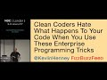

# Clean Coders Hate What Happens to Your Code When You Use These Enterprise Programming Tricks (2017-02-27)

## Description

Kevlin Henney
It is all to easy to dismiss problematic codebases on some nebulous idea of bad practice or bad programmers. Poor code, however, is rarely arbitrary and random in its structure or formulation.
Systems of code, well or poorly structured, emerge from systems of practice, whether effective or ineffective. To improve code quality, it makes more sense to pick apart the specific practices and see their interplay — the cause — than to simply focus on the code itself — the effect. This talk looks at how a handful of coding habits, design practices and assumptions can systematically balloon code and compound its accidental complexity.

NDC Conferences
https://ndc-london.com
https://ndcconferences.com

## Transcript

[0:00:11](https://youtu.be/FyCYva9DhsI?t=11) so often you get to say good morning  
[0:00:14](https://youtu.be/FyCYva9DhsI?t=14) good evening whilst doing talks this is  
[0:00:17](https://youtu.be/FyCYva9DhsI?t=17) the third talk my third talk today  
[0:00:19](https://youtu.be/FyCYva9DhsI?t=19) so obviously it's the one with the  
[0:00:20](https://youtu.be/FyCYva9DhsI?t=20) longest title actually if you look at  
[0:00:23](https://youtu.be/FyCYva9DhsI?t=23) the talks that I've done today they  
[0:00:24](https://youtu.be/FyCYva9DhsI?t=24) titles have got progressively longer so  
[0:00:28](https://youtu.be/FyCYva9DhsI?t=28) good job we don't have a late evening  
[0:00:29](https://youtu.be/FyCYva9DhsI?t=29) talk so this is actually is probably the  
[0:00:33](https://youtu.be/FyCYva9DhsI?t=33) longest talk title I've ever had and yes  
[0:00:38](https://youtu.be/FyCYva9DhsI?t=38) I did actually go to BuzzFeed to just  
[0:00:40](https://youtu.be/FyCYva9DhsI?t=40) check the fonts on the colors and go  
[0:00:42](https://youtu.be/FyCYva9DhsI?t=42) just to make sure I have that like air  
[0:00:43](https://youtu.be/FyCYva9DhsI?t=43) of authenticity what can I say about  
[0:00:47](https://youtu.be/FyCYva9DhsI?t=47) myself and two books with long titles  
[0:00:51](https://youtu.be/FyCYva9DhsI?t=51) another book with a long title and some  
[0:00:56](https://youtu.be/FyCYva9DhsI?t=56) other stuff these books have nothing to  
[0:00:59](https://youtu.be/FyCYva9DhsI?t=59) do with me it turns out that in addition  
[0:01:02](https://youtu.be/FyCYva9DhsI?t=62) to being interested in patents coding  
[0:01:04](https://youtu.be/FyCYva9DhsI?t=64) techniques software craftsmanship and  
[0:01:08](https://youtu.be/FyCYva9DhsI?t=68) taking photographs of books I also have  
[0:01:11](https://youtu.be/FyCYva9DhsI?t=71) an interest in words and language and I  
[0:01:13](https://youtu.be/FyCYva9DhsI?t=73) have a page on Facebook word Friday  
[0:01:18](https://youtu.be/FyCYva9DhsI?t=78) where I present various unusual bits and  
[0:01:20](https://youtu.be/FyCYva9DhsI?t=80) pieces and acquaintance of interest so  
[0:01:22](https://youtu.be/FyCYva9DhsI?t=82) if you language is a thing that you are  
[0:01:25](https://youtu.be/FyCYva9DhsI?t=85) interested in and then I recommend this  
[0:01:27](https://youtu.be/FyCYva9DhsI?t=87) so given that context I'm going to  
[0:01:30](https://youtu.be/FyCYva9DhsI?t=90) explore the word Enterprise from moment  
[0:01:33](https://youtu.be/FyCYva9DhsI?t=93) because I've used it in the title and in  
[0:01:36](https://youtu.be/FyCYva9DhsI?t=96) fact we use it everywhere these days we  
[0:01:39](https://youtu.be/FyCYva9DhsI?t=99) start talking about enterprise scale and  
[0:01:41](https://youtu.be/FyCYva9DhsI?t=101) is that ready for the enterprise and a  
[0:01:43](https://youtu.be/FyCYva9DhsI?t=103) system system can barely go by without  
[0:01:46](https://youtu.be/FyCYva9DhsI?t=106) somebody throwing the word enterprise in  
[0:01:47](https://youtu.be/FyCYva9DhsI?t=107) its direction now there is a small  
[0:01:50](https://youtu.be/FyCYva9DhsI?t=110) problem well I don't think it is a  
[0:01:52](https://youtu.be/FyCYva9DhsI?t=112) problem but if you are of a particular  
[0:01:55](https://youtu.be/FyCYva9DhsI?t=115) disposition and possibly even a  
[0:01:57](https://youtu.be/FyCYva9DhsI?t=117) particular generation in spite of the  
[0:02:00](https://youtu.be/FyCYva9DhsI?t=120) onslaught of the word enterprise in  
[0:02:02](https://youtu.be/FyCYva9DhsI?t=122) software development over the last two  
[0:02:04](https://youtu.be/FyCYva9DhsI?t=124) decades I still think of this you know  
[0:02:07](https://youtu.be/FyCYva9DhsI?t=127) somebody says enterprise enterprise  
[0:02:09](https://youtu.be/FyCYva9DhsI?t=129) software and I'm thinking ok yeah  
[0:02:11](https://youtu.be/FyCYva9DhsI?t=131) running a starship but warp speed that's  
[0:02:13](https://youtu.be/FyCYva9DhsI?t=133) going to take some serious horsepower  
[0:02:15](https://youtu.be/FyCYva9DhsI?t=135) and you're going to need some major CPU  
[0:02:17](https://youtu.be/FyCYva9DhsI?t=137) work here and I want to know what  
[0:02:19](https://youtu.be/FyCYva9DhsI?t=139) languages they use then what's the  
[0:02:21](https://youtu.be/FyCYva9DhsI?t=141) runtime there's lots of interesting  
[0:02:22](https://youtu.be/FyCYva9DhsI?t=142) things there and yeah it's an elegant  
[0:02:25](https://youtu.be/FyCYva9DhsI?t=145) and it's an elegant design  
[0:02:29](https://youtu.be/FyCYva9DhsI?t=149) the reboot especially so and indeed it  
[0:02:34](https://youtu.be/FyCYva9DhsI?t=154) does turn out that you'll look at if you  
[0:02:37](https://youtu.be/FyCYva9DhsI?t=157) look at this drawing there's a NASA logo  
[0:02:40](https://youtu.be/FyCYva9DhsI?t=160) lurking in the background somewhere this  
[0:02:43](https://youtu.be/FyCYva9DhsI?t=163) is an assets impression of what a warp  
[0:02:46](https://youtu.be/FyCYva9DhsI?t=166) drive craft would actually look like and  
[0:02:49](https://youtu.be/FyCYva9DhsI?t=169) it is actually based on some real  
[0:02:51](https://youtu.be/FyCYva9DhsI?t=171) science the those are warped rings warp  
[0:02:55](https://youtu.be/FyCYva9DhsI?t=175) coils and this is based on a theory this  
[0:02:58](https://youtu.be/FyCYva9DhsI?t=178) be explored by a NASA by a NASA team  
[0:03:01](https://youtu.be/FyCYva9DhsI?t=181) obviously it's in the highly speculative  
[0:03:03](https://youtu.be/FyCYva9DhsI?t=183) department Sonny white is exploring  
[0:03:08](https://youtu.be/FyCYva9DhsI?t=188) potential applications of what is known  
[0:03:12](https://youtu.be/FyCYva9DhsI?t=192) as Alcubierre Drive Miguel Alcubierre a  
[0:03:16](https://youtu.be/FyCYva9DhsI?t=196) Mexican physicist who in 1994  
[0:03:20](https://youtu.be/FyCYva9DhsI?t=200) demonstrated that general relativity  
[0:03:22](https://youtu.be/FyCYva9DhsI?t=202) actually does accommodate the concept of  
[0:03:25](https://youtu.be/FyCYva9DhsI?t=205) what we would call warp drive and  
[0:03:26](https://youtu.be/FyCYva9DhsI?t=206) without violating that that awkward  
[0:03:29](https://youtu.be/FyCYva9DhsI?t=209) speed limit the speed of light you  
[0:03:33](https://youtu.be/FyCYva9DhsI?t=213) cannot travel faster than speed than the  
[0:03:35](https://youtu.be/FyCYva9DhsI?t=215) speed of light in a vacuum  
[0:03:37](https://youtu.be/FyCYva9DhsI?t=217) we can work around that with software  
[0:03:40](https://youtu.be/FyCYva9DhsI?t=220) developers we know about work around it  
[0:03:42](https://youtu.be/FyCYva9DhsI?t=222) turns out that this is not an obstacle  
[0:03:43](https://youtu.be/FyCYva9DhsI?t=223) all you need to do is move space-time  
[0:03:46](https://youtu.be/FyCYva9DhsI?t=226) move the vacuum faster than the speed of  
[0:03:48](https://youtu.be/FyCYva9DhsI?t=228) light and you're good yeah you will be  
[0:03:50](https://youtu.be/FyCYva9DhsI?t=230) traveling in the vacuum at a slower  
[0:03:52](https://youtu.be/FyCYva9DhsI?t=232) speed and that's great and basically you  
[0:03:54](https://youtu.be/FyCYva9DhsI?t=234) warp space-time that's what those coils  
[0:03:56](https://youtu.be/FyCYva9DhsI?t=236) are for they contain exotic matter this  
[0:03:59](https://youtu.be/FyCYva9DhsI?t=239) is what we would call a technical  
[0:04:01](https://youtu.be/FyCYva9DhsI?t=241) challenge we don't actually know that  
[0:04:03](https://youtu.be/FyCYva9DhsI?t=243) that exists estimates vary but it is  
[0:04:06](https://youtu.be/FyCYva9DhsI?t=246) entirely possible the amount of exotic  
[0:04:07](https://youtu.be/FyCYva9DhsI?t=247) matter you would need to warp space in  
[0:04:10](https://youtu.be/FyCYva9DhsI?t=250) this fashion is approximately the mass  
[0:04:14](https://youtu.be/FyCYva9DhsI?t=254) of the moon I think that is known as a  
[0:04:18](https://youtu.be/FyCYva9DhsI?t=258) implementation detail and we're going to  
[0:04:20](https://youtu.be/FyCYva9DhsI?t=260) map it out on our storyboard and just  
[0:04:22](https://youtu.be/FyCYva9DhsI?t=262) see how we go why am i introducing this  
[0:04:25](https://youtu.be/FyCYva9DhsI?t=265) stuff well one it's the end of the day -  
[0:04:27](https://youtu.be/FyCYva9DhsI?t=267) good nerdy fun and three what I want to  
[0:04:30](https://youtu.be/FyCYva9DhsI?t=270) talk about is the reality distortion  
[0:04:32](https://youtu.be/FyCYva9DhsI?t=272) field that is the enterprise we do warp  
[0:04:35](https://youtu.be/FyCYva9DhsI?t=275) space and time and the very substance of  
[0:04:37](https://youtu.be/FyCYva9DhsI?t=277) reality on a regular basis so I'm  
[0:04:40](https://youtu.be/FyCYva9DhsI?t=280) plundering the dictionaries  
[0:04:43](https://youtu.be/FyCYva9DhsI?t=283) we are told that enterprise is a project  
[0:04:45](https://youtu.be/FyCYva9DhsI?t=285) or undertaking that is especially bold  
[0:04:48](https://youtu.be/FyCYva9DhsI?t=288) complicated or arduous yeah complicated  
[0:04:51](https://youtu.be/FyCYva9DhsI?t=291) largest that can't let sir that's a  
[0:04:52](https://youtu.be/FyCYva9DhsI?t=292) enterprise polite way of saying all this  
[0:04:55](https://youtu.be/FyCYva9DhsI?t=295) is going to be tricky it's going to be a  
[0:04:57](https://youtu.be/FyCYva9DhsI?t=297) lot of work readiness to engage in  
[0:05:00](https://youtu.be/FyCYva9DhsI?t=300) undertakings of difficulty risk danger  
[0:05:02](https://youtu.be/FyCYva9DhsI?t=302) or daring you know it's just that yeah  
[0:05:05](https://youtu.be/FyCYva9DhsI?t=305) we've got this budget oh this is going  
[0:05:07](https://youtu.be/FyCYva9DhsI?t=307) to be interesting oh you need to deliver  
[0:05:10](https://youtu.be/FyCYva9DhsI?t=310) it by then yep okay I dare you a design  
[0:05:14](https://youtu.be/FyCYva9DhsI?t=314) of which I love the wording I cannot  
[0:05:16](https://youtu.be/FyCYva9DhsI?t=316) remember I'm going to suspect this is  
[0:05:17](https://youtu.be/FyCYva9DhsI?t=317) the Oxford English Dictionary given the  
[0:05:19](https://youtu.be/FyCYva9DhsI?t=319) phrasing a design of which the execution  
[0:05:21](https://youtu.be/FyCYva9DhsI?t=321) is attempted nothing about achievement  
[0:05:24](https://youtu.be/FyCYva9DhsI?t=324) nothing about completion we'll just try  
[0:05:25](https://youtu.be/FyCYva9DhsI?t=325) it and there's a bunch of other ones  
[0:05:27](https://youtu.be/FyCYva9DhsI?t=327) that are really boring so we're not  
[0:05:28](https://youtu.be/FyCYva9DhsI?t=328) interested in those so um there's also  
[0:05:33](https://youtu.be/FyCYva9DhsI?t=333) least the question of what we mean by  
[0:05:34](https://youtu.be/FyCYva9DhsI?t=334) code if I'm talking about Enterprise  
[0:05:37](https://youtu.be/FyCYva9DhsI?t=337) coding clearly I need to have a  
[0:05:38](https://youtu.be/FyCYva9DhsI?t=338) reasonable definition of code a set of  
[0:05:40](https://youtu.be/FyCYva9DhsI?t=340) instructions for a computer I think  
[0:05:41](https://youtu.be/FyCYva9DhsI?t=341) we're all reasonably comfortable with  
[0:05:42](https://youtu.be/FyCYva9DhsI?t=342) that they compute a program or a portion  
[0:05:44](https://youtu.be/FyCYva9DhsI?t=344) thereof yeah likewise now it gets  
[0:05:46](https://youtu.be/FyCYva9DhsI?t=346) interesting  
[0:05:47](https://youtu.be/FyCYva9DhsI?t=347) a system of words figures or symbols  
[0:05:50](https://youtu.be/FyCYva9DhsI?t=350) used to represent others especially for  
[0:05:53](https://youtu.be/FyCYva9DhsI?t=353) the purposes of secrecy yes this is  
[0:05:55](https://youtu.be/FyCYva9DhsI?t=355) enterprise code now we have a  
[0:05:57](https://youtu.be/FyCYva9DhsI?t=357) satisfactory definition also a set of  
[0:06:01](https://youtu.be/FyCYva9DhsI?t=361) conventions or principles governing  
[0:06:05](https://youtu.be/FyCYva9DhsI?t=365) behavior or activity in a particular  
[0:06:06](https://youtu.be/FyCYva9DhsI?t=366) domain there's a concept of a code of  
[0:06:07](https://youtu.be/FyCYva9DhsI?t=367) conduct concept of code as a set of  
[0:06:10](https://youtu.be/FyCYva9DhsI?t=370) conventions and practices or even a  
[0:06:12](https://youtu.be/FyCYva9DhsI?t=372) definition of a culture by which we  
[0:06:14](https://youtu.be/FyCYva9DhsI?t=374) participate in our daily activity so  
[0:06:17](https://youtu.be/FyCYva9DhsI?t=377) there's also a lot going on here so  
[0:06:19](https://youtu.be/FyCYva9DhsI?t=379) let's talk about some of these implied  
[0:06:21](https://youtu.be/FyCYva9DhsI?t=381) practices and here is an interview if  
[0:06:26](https://youtu.be/FyCYva9DhsI?t=386) you follow the practical dev on Twitter  
[0:06:28](https://youtu.be/FyCYva9DhsI?t=388) but these have been doing the rounds  
[0:06:30](https://youtu.be/FyCYva9DhsI?t=390) these kind of really these fake O'Reilly  
[0:06:33](https://youtu.be/FyCYva9DhsI?t=393) book covers they are they are very funny  
[0:06:36](https://youtu.be/FyCYva9DhsI?t=396) in that kind of like there's so much  
[0:06:38](https://youtu.be/FyCYva9DhsI?t=398) truth in that it hurts  
[0:06:41](https://youtu.be/FyCYva9DhsI?t=401) taking on needless dependencies fragile  
[0:06:43](https://youtu.be/FyCYva9DhsI?t=403) developing guard yeah code written by  
[0:06:45](https://youtu.be/FyCYva9DhsI?t=405) some stranger on the Internet is always  
[0:06:46](https://youtu.be/FyCYva9DhsI?t=406) perfect and we have a beautiful example  
[0:06:48](https://youtu.be/FyCYva9DhsI?t=408) of this about ten months ago in fact one  
[0:06:53](https://youtu.be/FyCYva9DhsI?t=413) developer just broke no Babel and  
[0:06:54](https://youtu.be/FyCYva9DhsI?t=414) thousands of projects in eleven lines  
[0:06:56](https://youtu.be/FyCYva9DhsI?t=416) javascript this was a little piece of  
[0:06:59](https://youtu.be/FyCYva9DhsI?t=419) code left pad it turns out that lots of  
[0:07:02](https://youtu.be/FyCYva9DhsI?t=422) libraries had a transitive dependency on  
[0:07:05](https://youtu.be/FyCYva9DhsI?t=425) this little piece of code and for  
[0:07:08](https://youtu.be/FyCYva9DhsI?t=428) various reasons the author pulled them  
[0:07:12](https://youtu.be/FyCYva9DhsI?t=432) for all npm and lots of websites stopped  
[0:07:16](https://youtu.be/FyCYva9DhsI?t=436) working now clearly this little piece of  
[0:07:19](https://youtu.be/FyCYva9DhsI?t=439) code is very very important i mean you  
[0:07:21](https://youtu.be/FyCYva9DhsI?t=441) know it must be really really important  
[0:07:22](https://youtu.be/FyCYva9DhsI?t=442) it must be must be something super  
[0:07:24](https://youtu.be/FyCYva9DhsI?t=444) clever because otherwise why would you  
[0:07:25](https://youtu.be/FyCYva9DhsI?t=445) be reusing it because that is one of the  
[0:07:27](https://youtu.be/FyCYva9DhsI?t=447) reasons people often give this is the  
[0:07:30](https://youtu.be/FyCYva9DhsI?t=450) reason we have code reuse we reuse code  
[0:07:32](https://youtu.be/FyCYva9DhsI?t=452) because somebody else has done the work  
[0:07:34](https://youtu.be/FyCYva9DhsI?t=454) and it is tricky or daring and you know  
[0:07:37](https://youtu.be/FyCYva9DhsI?t=457) what we don't want to reinvent the wheel  
[0:07:39](https://youtu.be/FyCYva9DhsI?t=459) and really that code has stood the test  
[0:07:41](https://youtu.be/FyCYva9DhsI?t=461) of time let's not look at the code  
[0:07:46](https://youtu.be/FyCYva9DhsI?t=466) this is JavaScript which I will happily  
[0:07:49](https://youtu.be/FyCYva9DhsI?t=469) say is not my favorite language this is  
[0:07:54](https://youtu.be/FyCYva9DhsI?t=474) the code and it seems a little bit  
[0:07:55](https://youtu.be/FyCYva9DhsI?t=475) clunky it seems a little bit of Rasik  
[0:07:57](https://youtu.be/FyCYva9DhsI?t=477) and what's it doing it's um left pad yes  
[0:08:00](https://youtu.be/FyCYva9DhsI?t=480) it's actually filling out a string it's  
[0:08:03](https://youtu.be/FyCYva9DhsI?t=483) padding the string for this thousands of  
[0:08:06](https://youtu.be/FyCYva9DhsI?t=486) websites went down it is padding a  
[0:08:09](https://youtu.be/FyCYva9DhsI?t=489) string because it turns out there it  
[0:08:11](https://youtu.be/FyCYva9DhsI?t=491) turns out sometimes when I have a casual  
[0:08:13](https://youtu.be/FyCYva9DhsI?t=493) discussions with people about the use of  
[0:08:15](https://youtu.be/FyCYva9DhsI?t=495) the word developer and versus the word  
[0:08:17](https://youtu.be/FyCYva9DhsI?t=497) programmer and I know some actually well  
[0:08:20](https://youtu.be/FyCYva9DhsI?t=500) I use the word developer I'm actually a  
[0:08:22](https://youtu.be/FyCYva9DhsI?t=502) strong advocate of the word programmer  
[0:08:23](https://youtu.be/FyCYva9DhsI?t=503) because I've had people sort of say to  
[0:08:25](https://youtu.be/FyCYva9DhsI?t=505) me wow you know programmer just makes it  
[0:08:26](https://youtu.be/FyCYva9DhsI?t=506) sound like you're a coder and I said  
[0:08:27](https://youtu.be/FyCYva9DhsI?t=507) well I don't think that's really true  
[0:08:29](https://youtu.be/FyCYva9DhsI?t=509) I mean developer makes it sound like  
[0:08:31](https://youtu.be/FyCYva9DhsI?t=511) you're involved in real estate you know  
[0:08:33](https://youtu.be/FyCYva9DhsI?t=513) so you know they both have potential  
[0:08:35](https://youtu.be/FyCYva9DhsI?t=515) negatives but the thing is that I have  
[0:08:37](https://youtu.be/FyCYva9DhsI?t=517) encountered the deeper truth in all of  
[0:08:40](https://youtu.be/FyCYva9DhsI?t=520) this developer there's a lot of  
[0:08:43](https://youtu.be/FyCYva9DhsI?t=523) developers you can't program it's a  
[0:08:45](https://youtu.be/FyCYva9DhsI?t=525) shameful confession it turns out that  
[0:08:47](https://youtu.be/FyCYva9DhsI?t=527) programming is a lot harder than  
[0:08:49](https://youtu.be/FyCYva9DhsI?t=529) developing and this is this is one of  
[0:08:51](https://youtu.be/FyCYva9DhsI?t=531) the demonstrations so what I found  
[0:08:54](https://youtu.be/FyCYva9DhsI?t=534) absolutely fascinating was that NPM went  
[0:08:57](https://youtu.be/FyCYva9DhsI?t=537) and put up a version that somebody else  
[0:08:59](https://youtu.be/FyCYva9DhsI?t=539) is now maintaining now I would have  
[0:09:01](https://youtu.be/FyCYva9DhsI?t=541) presumed that somebody who's maintaining  
[0:09:02](https://youtu.be/FyCYva9DhsI?t=542) this piece of code is going to do  
[0:09:03](https://youtu.be/FyCYva9DhsI?t=543) something visually clever and really  
[0:09:05](https://youtu.be/FyCYva9DhsI?t=545) tidy is up because I mean there's a  
[0:09:08](https://youtu.be/FyCYva9DhsI?t=548) unfortunately forced to follow the  
[0:09:09](https://youtu.be/FyCYva9DhsI?t=549) rather curious semantics that this thing  
[0:09:11](https://youtu.be/FyCYva9DhsI?t=551) has in terms of its defaults but you'd  
[0:09:14](https://youtu.be/FyCYva9DhsI?t=554) think they're going to do something  
[0:09:15](https://youtu.be/FyCYva9DhsI?t=555) really clever  
[0:09:16](https://youtu.be/FyCYva9DhsI?t=556) instead they did this there's a cache up  
[0:09:20](https://youtu.be/FyCYva9DhsI?t=560) there that is actually if you look at it  
[0:09:22](https://youtu.be/FyCYva9DhsI?t=562) is going to be slower than actually  
[0:09:24](https://youtu.be/FyCYva9DhsI?t=564) running the code there's lots of  
[0:09:26](https://youtu.be/FyCYva9DhsI?t=566) comments just to help you in case you  
[0:09:27](https://youtu.be/FyCYva9DhsI?t=567) can't understand all of this and it is a  
[0:09:29](https://youtu.be/FyCYva9DhsI?t=569) and we don't use plus equals because  
[0:09:32](https://youtu.be/FyCYva9DhsI?t=572) obviously equals something equals  
[0:09:34](https://youtu.be/FyCYva9DhsI?t=574) something plus something is what this is  
[0:09:37](https://youtu.be/FyCYva9DhsI?t=577) written by somebody who I think it has  
[0:09:39](https://youtu.be/FyCYva9DhsI?t=579) got their heart in the right place but  
[0:09:41](https://youtu.be/FyCYva9DhsI?t=581) their brain was out of the room at the  
[0:09:43](https://youtu.be/FyCYva9DhsI?t=583) time you know we have a lot of newbie  
[0:09:45](https://youtu.be/FyCYva9DhsI?t=585) programmers and it's a shame that this  
[0:09:47](https://youtu.be/FyCYva9DhsI?t=587) is now the standard version absol I'd  
[0:09:49](https://youtu.be/FyCYva9DhsI?t=589) have a go at it as I say not a Java  
[0:09:51](https://youtu.be/FyCYva9DhsI?t=591) program a JavaScript programmer so this  
[0:09:53](https://youtu.be/FyCYva9DhsI?t=593) is my version which is shorter it's  
[0:09:56](https://youtu.be/FyCYva9DhsI?t=596) direct it even accounts for the  
[0:09:57](https://youtu.be/FyCYva9DhsI?t=597) weirdness this also has a very  
[0:10:00](https://youtu.be/FyCYva9DhsI?t=600) interesting property it works I had I  
[0:10:06](https://youtu.be/FyCYva9DhsI?t=606) know this stuff because I wrote some  
[0:10:07](https://youtu.be/FyCYva9DhsI?t=607) test for it so I created this ad hoc  
[0:10:09](https://youtu.be/FyCYva9DhsI?t=609) testing framework and a bunch of  
[0:10:11](https://youtu.be/FyCYva9DhsI?t=611) assertions is assertions that's the  
[0:10:13](https://youtu.be/FyCYva9DhsI?t=613) testing framework and that's what  
[0:10:16](https://youtu.be/FyCYva9DhsI?t=616) happens when you run it against my code  
[0:10:17](https://youtu.be/FyCYva9DhsI?t=617) these are the expectations you would  
[0:10:18](https://youtu.be/FyCYva9DhsI?t=618) have a somebody described less pad to  
[0:10:20](https://youtu.be/FyCYva9DhsI?t=620) you if I run it against the versions  
[0:10:22](https://youtu.be/FyCYva9DhsI?t=622) they're actually maintained at NPM and  
[0:10:23](https://youtu.be/FyCYva9DhsI?t=623) three tests fail so yeah  
[0:10:26](https://youtu.be/FyCYva9DhsI?t=626) alternative you could use a real  
[0:10:28](https://youtu.be/FyCYva9DhsI?t=628) language like Python which actually has  
[0:10:31](https://youtu.be/FyCYva9DhsI?t=631) this kind of built in and that doesn't  
[0:10:32](https://youtu.be/FyCYva9DhsI?t=632) have the ambiguity you've got a choice  
[0:10:34](https://youtu.be/FyCYva9DhsI?t=634) there between zero filling and write  
[0:10:37](https://youtu.be/FyCYva9DhsI?t=637) justifying correctly building two  
[0:10:39](https://youtu.be/FyCYva9DhsI?t=639) languages Java Script will have such a  
[0:10:43](https://youtu.be/FyCYva9DhsI?t=643) padding function you know I don't think  
[0:10:46](https://youtu.be/FyCYva9DhsI?t=646) two decades is too long to wait for such  
[0:10:48](https://youtu.be/FyCYva9DhsI?t=648) a thing but there is this issue about  
[0:10:50](https://youtu.be/FyCYva9DhsI?t=650) how we relate to code and this kind of  
[0:10:53](https://youtu.be/FyCYva9DhsI?t=653) stuff it doesn't just pop up on the  
[0:10:55](https://youtu.be/FyCYva9DhsI?t=655) internet what we see is in large  
[0:10:57](https://youtu.be/FyCYva9DhsI?t=657) organizations relatively simple  
[0:11:00](https://youtu.be/FyCYva9DhsI?t=660) programming tasks are well people bring  
[0:11:02](https://youtu.be/FyCYva9DhsI?t=662) a mindset to them and it's not that  
[0:11:04](https://youtu.be/FyCYva9DhsI?t=664) people are stupid it turns out  
[0:11:06](https://youtu.be/FyCYva9DhsI?t=666) programmers are surprisingly smart it is  
[0:11:08](https://youtu.be/FyCYva9DhsI?t=668) just that sometimes when you approach  
[0:11:09](https://youtu.be/FyCYva9DhsI?t=669) the problem from the wrong angle you can  
[0:11:11](https://youtu.be/FyCYva9DhsI?t=671) really make something of it uses Buzz  
[0:11:15](https://youtu.be/FyCYva9DhsI?t=675) earlier so that's that's so let's go  
[0:11:16](https://youtu.be/FyCYva9DhsI?t=676) let's go back to first bus what looking  
[0:11:19](https://youtu.be/FyCYva9DhsI?t=679) at people solving this problem it's  
[0:11:20](https://youtu.be/FyCYva9DhsI?t=680) absolutely fascinating  
[0:11:22](https://youtu.be/FyCYva9DhsI?t=682) because we people often think I was  
[0:11:24](https://youtu.be/FyCYva9DhsI?t=684) fairly trivial I was when I started  
[0:11:27](https://youtu.be/FyCYva9DhsI?t=687) really looking at fizzbuzz I've been  
[0:11:29](https://youtu.be/FyCYva9DhsI?t=689) dismissive of it before that's right  
[0:11:31](https://youtu.be/FyCYva9DhsI?t=691) four years ago now I started looking at  
[0:11:33](https://youtu.be/FyCYva9DhsI?t=693) him gosh you know what there's some fun  
[0:11:34](https://youtu.be/FyCYva9DhsI?t=694) to be had here so I thought let us  
[0:11:36](https://youtu.be/FyCYva9DhsI?t=696) consult the great sink of all human  
[0:11:39](https://youtu.be/FyCYva9DhsI?t=699) knowledge Wikipedia and see what it has  
[0:11:40](https://youtu.be/FyCYva9DhsI?t=700) to say on the subject  
[0:11:41](https://youtu.be/FyCYva9DhsI?t=701) apparently I discovered at that point is  
[0:11:43](https://youtu.be/FyCYva9DhsI?t=703) a group word game for children to teach  
[0:11:45](https://youtu.be/FyCYva9DhsI?t=705) them about division that's certainly not  
[0:11:46](https://youtu.be/FyCYva9DhsI?t=706) how I learnt it when I was a teenager  
[0:11:47](https://youtu.be/FyCYva9DhsI?t=707) and there's a whole description of how  
[0:11:52](https://youtu.be/FyCYva9DhsI?t=712) to play it we highlight the things of  
[0:11:54](https://youtu.be/FyCYva9DhsI?t=714) interest in account numbers 1 2 3 except  
[0:11:57](https://youtu.be/FyCYva9DhsI?t=717) any number divisible by 3 is fear so 1 2  
[0:11:59](https://youtu.be/FyCYva9DhsI?t=719) fears for buzz 5 fears and so on 14 is  
[0:12:05](https://youtu.be/FyCYva9DhsI?t=725) buzz 16 and then so and the idea there  
[0:12:08](https://youtu.be/FyCYva9DhsI?t=728) is that you are doing a substitution and  
[0:12:11](https://youtu.be/FyCYva9DhsI?t=731) conditional substitution it's not the  
[0:12:14](https://youtu.be/FyCYva9DhsI?t=734) hardest thing in the world but actually  
[0:12:15](https://youtu.be/FyCYva9DhsI?t=735) the thing that drew me and this is the  
[0:12:17](https://youtu.be/FyCYva9DhsI?t=737) great thing there's these little gems  
[0:12:18](https://youtu.be/FyCYva9DhsI?t=738) these little nuggets buried in Wikipedia  
[0:12:21](https://youtu.be/FyCYva9DhsI?t=741) just like they're buried in enterprise  
[0:12:23](https://youtu.be/FyCYva9DhsI?t=743) comments it is the use of word dense  
[0:12:25](https://youtu.be/FyCYva9DhsI?t=745) force I mean perhaps after whoever wrote  
[0:12:29](https://youtu.be/FyCYva9DhsI?t=749) that piece that is archaic it is only  
[0:12:31](https://youtu.be/FyCYva9DhsI?t=751) occasionally used in poetry it kind of  
[0:12:34](https://youtu.be/FyCYva9DhsI?t=754) left mainstream English around the 17th  
[0:12:37](https://youtu.be/FyCYva9DhsI?t=757) or 18th century it would be unusual to  
[0:12:39](https://youtu.be/FyCYva9DhsI?t=759) find it even in Victorian England so you  
[0:12:42](https://youtu.be/FyCYva9DhsI?t=762) know well done that is probably the most  
[0:12:45](https://youtu.be/FyCYva9DhsI?t=765) interesting thing about that article  
[0:12:46](https://youtu.be/FyCYva9DhsI?t=766) apart from the fact that it then goes on  
[0:12:48](https://youtu.be/FyCYva9DhsI?t=768) to say adults may play fizzbuzz as a  
[0:12:50](https://youtu.be/FyCYva9DhsI?t=770) drinking game this is where I learnt it  
[0:12:52](https://youtu.be/FyCYva9DhsI?t=772) we're making a mistake leads to the  
[0:12:54](https://youtu.be/FyCYva9DhsI?t=774) player having to make a drinking related  
[0:12:56](https://youtu.be/FyCYva9DhsI?t=776) forfeit and really I'm going to say you  
[0:12:58](https://youtu.be/FyCYva9DhsI?t=778) do need to have alcohol to make this  
[0:13:00](https://youtu.be/FyCYva9DhsI?t=780) interesting well we tried playing it as  
[0:13:05](https://youtu.be/FyCYva9DhsI?t=785) a family we're on holiday about a year  
[0:13:07](https://youtu.be/FyCYva9DhsI?t=787) ago and so that's me my wife and the two  
[0:13:10](https://youtu.be/FyCYva9DhsI?t=790) boys at the time my young my younger one  
[0:13:13](https://youtu.be/FyCYva9DhsI?t=793) was 10 but he really likes his numbers  
[0:13:16](https://youtu.be/FyCYva9DhsI?t=796) he's got a good relationship with  
[0:13:17](https://youtu.be/FyCYva9DhsI?t=797) mathematics so we decided to play this  
[0:13:19](https://youtu.be/FyCYva9DhsI?t=799) while waiting for our food and our wine  
[0:13:21](https://youtu.be/FyCYva9DhsI?t=801) which means the adults were shockingly  
[0:13:23](https://youtu.be/FyCYva9DhsI?t=803) sober at this point and we can all do  
[0:13:25](https://youtu.be/FyCYva9DhsI?t=805) our times tables and I don't know I  
[0:13:27](https://youtu.be/FyCYva9DhsI?t=807) think we got about 50 before we gave up  
[0:13:29](https://youtu.be/FyCYva9DhsI?t=809) it's just like we are sober and we can  
[0:13:31](https://youtu.be/FyCYva9DhsI?t=811) all do this this is dull you need  
[0:13:33](https://youtu.be/FyCYva9DhsI?t=813) alcohol to make it interesting  
[0:13:35](https://youtu.be/FyCYva9DhsI?t=815) the best bit about the Wikipedia article  
[0:13:37](https://youtu.be/FyCYva9DhsI?t=817) though citation needed yeah there's a  
[0:13:43](https://youtu.be/FyCYva9DhsI?t=823) lot of people who won't remember that  
[0:13:44](https://youtu.be/FyCYva9DhsI?t=824) they had a drinking forfeit every time  
[0:13:45](https://youtu.be/FyCYva9DhsI?t=825) they got it wrong but you know there it  
[0:13:47](https://youtu.be/FyCYva9DhsI?t=827) is  
[0:13:48](https://youtu.be/FyCYva9DhsI?t=828) now there's a deeper reality that what  
[0:13:50](https://youtu.be/FyCYva9DhsI?t=830) we find is that it's been used as an  
[0:13:52](https://youtu.be/FyCYva9DhsI?t=832) interview question for many programmers  
[0:13:54](https://youtu.be/FyCYva9DhsI?t=834) and and we kind of assume that everybody  
[0:13:58](https://youtu.be/FyCYva9DhsI?t=838) is able to do this stuff and we have it  
[0:13:59](https://youtu.be/FyCYva9DhsI?t=839) will generally tend toward something  
[0:14:02](https://youtu.be/FyCYva9DhsI?t=842) like this so here it is in in Python and  
[0:14:06](https://youtu.be/FyCYva9DhsI?t=846) there's a kind of a sort of a simple  
[0:14:08](https://youtu.be/FyCYva9DhsI?t=848) ways of doing it for example this is the  
[0:14:11](https://youtu.be/FyCYva9DhsI?t=851) accumulation model we recognize that  
[0:14:15](https://youtu.be/FyCYva9DhsI?t=855) there is a divisible by three a  
[0:14:17](https://youtu.be/FyCYva9DhsI?t=857) divisible by five we accumulate into a  
[0:14:19](https://youtu.be/FyCYva9DhsI?t=859) result but we check did we get anything  
[0:14:22](https://youtu.be/FyCYva9DhsI?t=862) if we didn't we're going to go with a  
[0:14:23](https://youtu.be/FyCYva9DhsI?t=863) number alternatively we have a basically  
[0:14:27](https://youtu.be/FyCYva9DhsI?t=867) a tail return approach where we check  
[0:14:30](https://youtu.be/FyCYva9DhsI?t=870) each case explicitly and there's no RIA  
[0:14:33](https://youtu.be/FyCYva9DhsI?t=873) cumulation of state but actually we are  
[0:14:34](https://youtu.be/FyCYva9DhsI?t=874) still testing something twice that and  
[0:14:37](https://youtu.be/FyCYva9DhsI?t=877) mod fifteen is effectively n mod three  
[0:14:39](https://youtu.be/FyCYva9DhsI?t=879) and in more five so we're always  
[0:14:43](https://youtu.be/FyCYva9DhsI?t=883) stopping we're either rechecking  
[0:14:44](https://youtu.be/FyCYva9DhsI?t=884) something or stopping to recheck  
[0:14:46](https://youtu.be/FyCYva9DhsI?t=886) something and it's there's something  
[0:14:48](https://youtu.be/FyCYva9DhsI?t=888) here that is quite interesting of course  
[0:14:51](https://youtu.be/FyCYva9DhsI?t=891) we can take the fully and so there's  
[0:14:53](https://youtu.be/FyCYva9DhsI?t=893) nothing exciting if you just want to  
[0:14:54](https://youtu.be/FyCYva9DhsI?t=894) solve it to get something going but if  
[0:14:56](https://youtu.be/FyCYva9DhsI?t=896) you're going to do this in a in a truly  
[0:14:58](https://youtu.be/FyCYva9DhsI?t=898) scalable solve no more than you need  
[0:15:01](https://youtu.be/FyCYva9DhsI?t=901) simplest solution works all this kind of  
[0:15:04](https://youtu.be/FyCYva9DhsI?t=904) stuff you may end up with this approach  
[0:15:06](https://youtu.be/FyCYva9DhsI?t=906) and you can end up with this if you do  
[0:15:08](https://youtu.be/FyCYva9DhsI?t=908) TDD horribly wrong we'll test the one  
[0:15:10](https://youtu.be/FyCYva9DhsI?t=910) case now we'll test the two case now  
[0:15:12](https://youtu.be/FyCYva9DhsI?t=912) with tests for three case you'll see the  
[0:15:14](https://youtu.be/FyCYva9DhsI?t=914) progression you're getting paid by the  
[0:15:16](https://youtu.be/FyCYva9DhsI?t=916) line of code well done good job so you  
[0:15:19](https://youtu.be/FyCYva9DhsI?t=919) know there are some fairly crazy ways of  
[0:15:21](https://youtu.be/FyCYva9DhsI?t=921) doing it  
[0:15:22](https://youtu.be/FyCYva9DhsI?t=922) crazier than this still might still my  
[0:15:24](https://youtu.be/FyCYva9DhsI?t=924) favorite and it gets embellished and  
[0:15:26](https://youtu.be/FyCYva9DhsI?t=926) added to over the years is the fizzbuzz  
[0:15:29](https://youtu.be/FyCYva9DhsI?t=929) Enterprise Edition which I did have to  
[0:15:32](https://youtu.be/FyCYva9DhsI?t=932) sell somebody know this really is a  
[0:15:33](https://youtu.be/FyCYva9DhsI?t=933) spoof fought a spoof site because  
[0:15:35](https://youtu.be/FyCYva9DhsI?t=935) somebody was people are not always sure  
[0:15:38](https://youtu.be/FyCYva9DhsI?t=938) you know it's just like is this a joke  
[0:15:41](https://youtu.be/FyCYva9DhsI?t=941) or is this not because we've had so much  
[0:15:43](https://youtu.be/FyCYva9DhsI?t=943) experience of enterprise software but  
[0:15:45](https://youtu.be/FyCYva9DhsI?t=945) sometimes you think this is funny but  
[0:15:47](https://youtu.be/FyCYva9DhsI?t=947) actually no really  
[0:15:48](https://youtu.be/FyCYva9DhsI?t=948) isn't it could actually be real  
[0:15:53](https://youtu.be/FyCYva9DhsI?t=953) enterprise software marks a special high  
[0:15:56](https://youtu.be/FyCYva9DhsI?t=956) grade class of software you can always  
[0:15:58](https://youtu.be/FyCYva9DhsI?t=958) feel the scare quotes coming in a  
[0:16:01](https://youtu.be/FyCYva9DhsI?t=961) software that makes careful use of  
[0:16:02](https://youtu.be/FyCYva9DhsI?t=962) relevant software architecture design  
[0:16:04](https://youtu.be/FyCYva9DhsI?t=964) principles to Bill's particularly  
[0:16:05](https://youtu.be/FyCYva9DhsI?t=965) customizable and extensible solutions to  
[0:16:07](https://youtu.be/FyCYva9DhsI?t=967) real problems which of course fizzbuzz  
[0:16:10](https://youtu.be/FyCYva9DhsI?t=970) it's just crying out for  
[0:16:11](https://youtu.be/FyCYva9DhsI?t=971) parameterization configurability you  
[0:16:12](https://youtu.be/FyCYva9DhsI?t=972) know sir this project is an example how  
[0:16:14](https://youtu.be/FyCYva9DhsI?t=974) the popular fizzbuzz game might well be  
[0:16:16](https://youtu.be/FyCYva9DhsI?t=976) built aware it's subject to high quality  
[0:16:18](https://youtu.be/FyCYva9DhsI?t=978) standards of enterprise software and  
[0:16:20](https://youtu.be/FyCYva9DhsI?t=980) here I'm just going to just I'll just go  
[0:16:24](https://youtu.be/FyCYva9DhsI?t=984) to this yeah just look at the the past  
[0:16:27](https://youtu.be/FyCYva9DhsI?t=987) name on that and get hub and it's just  
[0:16:28](https://youtu.be/FyCYva9DhsI?t=988) right here the some of the factories  
[0:16:29](https://youtu.be/FyCYva9DhsI?t=989) because yeah you know that's that's how  
[0:16:32](https://youtu.be/FyCYva9DhsI?t=992) you doing real software development  
[0:16:33](https://youtu.be/FyCYva9DhsI?t=993) you've got factories that's a you know  
[0:16:35](https://youtu.be/FyCYva9DhsI?t=995) and there's above strategy factory  
[0:16:37](https://youtu.be/FyCYva9DhsI?t=997) there's a buzz string printer factory  
[0:16:38](https://youtu.be/FyCYva9DhsI?t=998) there's a buzz string returner factory I  
[0:16:40](https://youtu.be/FyCYva9DhsI?t=1000) I was slightly disappointed not see any  
[0:16:43](https://youtu.be/FyCYva9DhsI?t=1003) factory factories but you know we've got  
[0:16:46](https://youtu.be/FyCYva9DhsI?t=1006) integer integer string returner  
[0:16:47](https://youtu.be/FyCYva9DhsI?t=1007) factories which I thought was quite good  
[0:16:49](https://youtu.be/FyCYva9DhsI?t=1009) and don't have any don't have any loops  
[0:16:52](https://youtu.be/FyCYva9DhsI?t=1012) because we've got loop component  
[0:16:53](https://youtu.be/FyCYva9DhsI?t=1013) factories and it's just you know this is  
[0:16:57](https://youtu.be/FyCYva9DhsI?t=1017) the kind of thing that you could hang up  
[0:16:59](https://youtu.be/FyCYva9DhsI?t=1019) in in an art gallery  
[0:17:01](https://youtu.be/FyCYva9DhsI?t=1021) you know it's truly a work of art you  
[0:17:04](https://youtu.be/FyCYva9DhsI?t=1024) aren't hanging up in an art gallery or  
[0:17:05](https://youtu.be/FyCYva9DhsI?t=1025) you get a large budget for it so it's at  
[0:17:09](https://youtu.be/FyCYva9DhsI?t=1029) this point that we can kind of take a  
[0:17:12](https://youtu.be/FyCYva9DhsI?t=1032) bit of wisdom from Paul Anderson I have  
[0:17:15](https://youtu.be/FyCYva9DhsI?t=1035) yet to see any problem however  
[0:17:16](https://youtu.be/FyCYva9DhsI?t=1036) complicated which when you looked at it  
[0:17:17](https://youtu.be/FyCYva9DhsI?t=1037) in the right way did not become still  
[0:17:19](https://youtu.be/FyCYva9DhsI?t=1039) more complicated okay this is almost a  
[0:17:21](https://youtu.be/FyCYva9DhsI?t=1041) manifesto for software development  
[0:17:23](https://youtu.be/FyCYva9DhsI?t=1043) sometimes you feel that there's a  
[0:17:25](https://youtu.be/FyCYva9DhsI?t=1045) approach that sometimes people take they  
[0:17:27](https://youtu.be/FyCYva9DhsI?t=1047) don't know they're doing it and this is  
[0:17:29](https://youtu.be/FyCYva9DhsI?t=1049) the thing how do you create a large  
[0:17:31](https://youtu.be/FyCYva9DhsI?t=1051) problem you give people the mindset that  
[0:17:33](https://youtu.be/FyCYva9DhsI?t=1053) it's going to be big if you tell people  
[0:17:35](https://youtu.be/FyCYva9DhsI?t=1055) this is going to be six months worth of  
[0:17:36](https://youtu.be/FyCYva9DhsI?t=1056) work they will pack it full to the six  
[0:17:39](https://youtu.be/FyCYva9DhsI?t=1059) months and beyond if you give them the  
[0:17:41](https://youtu.be/FyCYva9DhsI?t=1061) same task in 18 months they will more  
[0:17:42](https://youtu.be/FyCYva9DhsI?t=1062) than lies for that challenge and overrun  
[0:17:44](https://youtu.be/FyCYva9DhsI?t=1064) the project okay if you take a ten  
[0:17:47](https://youtu.be/FyCYva9DhsI?t=1067) people to solve a task I'm pretty sure  
[0:17:49](https://youtu.be/FyCYva9DhsI?t=1069) that ten people be able to do it but  
[0:17:51](https://youtu.be/FyCYva9DhsI?t=1071) they will also be able to do you also be  
[0:17:53](https://youtu.be/FyCYva9DhsI?t=1073) able to do with a hundred people and  
[0:17:54](https://youtu.be/FyCYva9DhsI?t=1074) what you get out of that hundred people  
[0:17:56](https://youtu.be/FyCYva9DhsI?t=1076) will be not too similar to this  
[0:17:59](https://youtu.be/FyCYva9DhsI?t=1079) okay sorry I thought it's sort of a  
[0:18:03](https://youtu.be/FyCYva9DhsI?t=1083) tangential experience of one that was  
[0:18:06](https://youtu.be/FyCYva9DhsI?t=1086) actually a ten versus 100 system it was  
[0:18:08](https://youtu.be/FyCYva9DhsI?t=1088) done in two different parts of the  
[0:18:10](https://youtu.be/FyCYva9DhsI?t=1090) country and being a true enterprise one  
[0:18:12](https://youtu.be/FyCYva9DhsI?t=1092) passed one part of the organization  
[0:18:14](https://youtu.be/FyCYva9DhsI?t=1094) didn't know the other part was producing  
[0:18:15](https://youtu.be/FyCYva9DhsI?t=1095) identical software and they didn't know  
[0:18:17](https://youtu.be/FyCYva9DhsI?t=1097) it was a big problem so they had ten  
[0:18:20](https://youtu.be/FyCYva9DhsI?t=1100) developers work on it in under a year  
[0:18:21](https://youtu.be/FyCYva9DhsI?t=1101) whereas the other guys clearly thought  
[0:18:23](https://youtu.be/FyCYva9DhsI?t=1103) that it took a hundred people three  
[0:18:24](https://youtu.be/FyCYva9DhsI?t=1104) years to do the same thing you know one  
[0:18:27](https://youtu.be/FyCYva9DhsI?t=1107) of those guys doing ten people you know  
[0:18:29](https://youtu.be/FyCYva9DhsI?t=1109) delivering early doing have they have no  
[0:18:32](https://youtu.be/FyCYva9DhsI?t=1112) idea of the complexity they have not  
[0:18:33](https://youtu.be/FyCYva9DhsI?t=1113) looked at it closely enough so it is  
[0:18:36](https://youtu.be/FyCYva9DhsI?t=1116) this sort of Anderson approach that we  
[0:18:38](https://youtu.be/FyCYva9DhsI?t=1118) were able to take we can mess about I  
[0:18:40](https://youtu.be/FyCYva9DhsI?t=1120) mean there's a lot of funion you feel  
[0:18:42](https://youtu.be/FyCYva9DhsI?t=1122) you want to throw a lamdaur at it and  
[0:18:44](https://youtu.be/FyCYva9DhsI?t=1124) you know you can do that you can make it  
[0:18:45](https://youtu.be/FyCYva9DhsI?t=1125) even shorter in Python this is one of  
[0:18:47](https://youtu.be/FyCYva9DhsI?t=1127) the shortest that I know of  
[0:18:48](https://youtu.be/FyCYva9DhsI?t=1128) I've not been able to get it I'm able to  
[0:18:50](https://youtu.be/FyCYva9DhsI?t=1130) get it to know apart from knocking out  
[0:18:52](https://youtu.be/FyCYva9DhsI?t=1132) whitespace that's about as short as I've  
[0:18:53](https://youtu.be/FyCYva9DhsI?t=1133) been able to get it fits in a tweet  
[0:18:54](https://youtu.be/FyCYva9DhsI?t=1134) which I write which I rather like but it  
[0:18:57](https://youtu.be/FyCYva9DhsI?t=1137) also there is a case where we can also  
[0:19:00](https://youtu.be/FyCYva9DhsI?t=1140) become too clever in a different way and  
[0:19:03](https://youtu.be/FyCYva9DhsI?t=1143) there's a a rather elegant paper that  
[0:19:08](https://youtu.be/FyCYva9DhsI?t=1148) somebody pointed me in the direction of  
[0:19:10](https://youtu.be/FyCYva9DhsI?t=1150) last year match your pirogue fizzbuzz in  
[0:19:15](https://youtu.be/FyCYva9DhsI?t=1155) haskell by embedding a domain-specific  
[0:19:16](https://youtu.be/FyCYva9DhsI?t=1156) language you know you know when  
[0:19:19](https://youtu.be/FyCYva9DhsI?t=1159) somebody's going to you know when  
[0:19:21](https://youtu.be/FyCYva9DhsI?t=1161) somebody uses words like DSL and Haskell  
[0:19:23](https://youtu.be/FyCYva9DhsI?t=1163) and then they throw it at fizzbuzz that  
[0:19:25](https://youtu.be/FyCYva9DhsI?t=1165) you're in for some kind of rollercoaster  
[0:19:27](https://youtu.be/FyCYva9DhsI?t=1167) ride and it's a very interesting paper  
[0:19:29](https://youtu.be/FyCYva9DhsI?t=1169) it's also worth looking at on SlideShare  
[0:19:31](https://youtu.be/FyCYva9DhsI?t=1171) it's more gentle in that and as he says  
[0:19:35](https://youtu.be/FyCYva9DhsI?t=1175) yeah the default action is executed only  
[0:19:37](https://youtu.be/FyCYva9DhsI?t=1177) if some previous actions were not  
[0:19:38](https://youtu.be/FyCYva9DhsI?t=1178) executed so if I revisit this one and go  
[0:19:43](https://youtu.be/FyCYva9DhsI?t=1183) back to this one in JavaScript  
[0:19:46](https://youtu.be/FyCYva9DhsI?t=1186) there's our kind of accumulation model  
[0:19:49](https://youtu.be/FyCYva9DhsI?t=1189) we have to revisit stuff I can be a  
[0:19:53](https://youtu.be/FyCYva9DhsI?t=1193) little bit crazy here and do it as a  
[0:19:54](https://youtu.be/FyCYva9DhsI?t=1194) kind of sort of table lookup I'm quite  
[0:19:57](https://youtu.be/FyCYva9DhsI?t=1197) quite proud of the bonkers notion of  
[0:19:58](https://youtu.be/FyCYva9DhsI?t=1198) that one that is a little bit crazy but  
[0:20:00](https://youtu.be/FyCYva9DhsI?t=1200) again I have to recheck the or on the  
[0:20:02](https://youtu.be/FyCYva9DhsI?t=1202) right-hand side basically is a recheck  
[0:20:05](https://youtu.be/FyCYva9DhsI?t=1205) basically I have to check the results on  
[0:20:07](https://youtu.be/FyCYva9DhsI?t=1207) the left and then do an action on that  
[0:20:10](https://youtu.be/FyCYva9DhsI?t=1210) so I haven't really got rid of the  
[0:20:11](https://youtu.be/FyCYva9DhsI?t=1211) recheck although I've certainly  
[0:20:13](https://youtu.be/FyCYva9DhsI?t=1213) well there is a there is a saying that  
[0:20:15](https://youtu.be/FyCYva9DhsI?t=1215) if you kind of dazzle people with  
[0:20:16](https://youtu.be/FyCYva9DhsI?t=1216) brilliance baffle them with and  
[0:20:18](https://youtu.be/FyCYva9DhsI?t=1218) this is a kind of a good example because  
[0:20:19](https://youtu.be/FyCYva9DhsI?t=1219) I you busy looking at the table lookup  
[0:20:21](https://youtu.be/FyCYva9DhsI?t=1221) going whatever but a little all on the  
[0:20:23](https://youtu.be/FyCYva9DhsI?t=1223) right-hand side means I have not got rid  
[0:20:24](https://youtu.be/FyCYva9DhsI?t=1224) of the second check so he comes up with  
[0:20:29](https://youtu.be/FyCYva9DhsI?t=1229) a sort of says although we asked if we  
[0:20:31](https://youtu.be/FyCYva9DhsI?t=1231) can accomplish this without having to  
[0:20:32](https://youtu.be/FyCYva9DhsI?t=1232) check the conditions for the previous  
[0:20:34](https://youtu.be/FyCYva9DhsI?t=1234) actions twice in other words if we can  
[0:20:35](https://youtu.be/FyCYva9DhsI?t=1235) make the control flow follow the  
[0:20:37](https://youtu.be/FyCYva9DhsI?t=1237) information flow without losing  
[0:20:38](https://youtu.be/FyCYva9DhsI?t=1238) modularity and there's a whole load of  
[0:20:40](https://youtu.be/FyCYva9DhsI?t=1240) detours and fascinating stuff in the  
[0:20:42](https://youtu.be/FyCYva9DhsI?t=1242) haskell paper but I really wasn't sure I  
[0:20:44](https://youtu.be/FyCYva9DhsI?t=1244) could understand it so I gave myself the  
[0:20:46](https://youtu.be/FyCYva9DhsI?t=1246) challenge I thought I can only I will  
[0:20:48](https://youtu.be/FyCYva9DhsI?t=1248) understand it if I can implement the  
[0:20:50](https://youtu.be/FyCYva9DhsI?t=1250) same result or all parts of his working  
[0:20:52](https://youtu.be/FyCYva9DhsI?t=1252) if I can do that in a number of  
[0:20:54](https://youtu.be/FyCYva9DhsI?t=1254) different languages so I had to go I  
[0:20:56](https://youtu.be/FyCYva9DhsI?t=1256) going ban Java and C++ Python and groovy  
[0:21:01](https://youtu.be/FyCYva9DhsI?t=1261) and here's is a the JavaScript version  
[0:21:05](https://youtu.be/FyCYva9DhsI?t=1265) and which I are kind of proud off in a  
[0:21:08](https://youtu.be/FyCYva9DhsI?t=1268) kind of sad way but all nicely landed  
[0:21:13](https://youtu.be/FyCYva9DhsI?t=1273) and it turns out that this is all based  
[0:21:15](https://youtu.be/FyCYva9DhsI?t=1275) on function composition and you return a  
[0:21:16](https://youtu.be/FyCYva9DhsI?t=1276) function you return a higher-order  
[0:21:18](https://youtu.be/FyCYva9DhsI?t=1278) function that gives you the result you  
[0:21:20](https://youtu.be/FyCYva9DhsI?t=1280) make the decision about the 3 and the 5  
[0:21:22](https://youtu.be/FyCYva9DhsI?t=1282) only really once and you return a chain  
[0:21:25](https://youtu.be/FyCYva9DhsI?t=1285) of functions set of compositions that  
[0:21:27](https://youtu.be/FyCYva9DhsI?t=1287) will give you the right answer based on  
[0:21:28](https://youtu.be/FyCYva9DhsI?t=1288) what was given and this is one of those  
[0:21:32](https://youtu.be/FyCYva9DhsI?t=1292) things that it certainly doesn't have  
[0:21:34](https://youtu.be/FyCYva9DhsI?t=1294) the vast expanse of the enterprise  
[0:21:37](https://youtu.be/FyCYva9DhsI?t=1297) fizzbuzz Edition but the density of  
[0:21:39](https://youtu.be/FyCYva9DhsI?t=1299) ideas in there versus if else you know  
[0:21:44](https://youtu.be/FyCYva9DhsI?t=1304) you're looking like maybe somebody's  
[0:21:45](https://youtu.be/FyCYva9DhsI?t=1305) been a little bit too clever here yeah  
[0:21:47](https://youtu.be/FyCYva9DhsI?t=1307) this is the other kind of enterprise  
[0:21:48](https://youtu.be/FyCYva9DhsI?t=1308) hanging out in every enterprise it's a  
[0:21:50](https://youtu.be/FyCYva9DhsI?t=1310) there are smart individuals who are  
[0:21:52](https://youtu.be/FyCYva9DhsI?t=1312) frustrated by the rather sort of verbose  
[0:21:58](https://youtu.be/FyCYva9DhsI?t=1318) nature of other code and they are  
[0:21:59](https://youtu.be/FyCYva9DhsI?t=1319) seeking to distill everything down to I  
[0:22:02](https://youtu.be/FyCYva9DhsI?t=1322) mean I feel a little bit indulgent that  
[0:22:04](https://youtu.be/FyCYva9DhsI?t=1324) I've actually used I've actually I've  
[0:22:06](https://youtu.be/FyCYva9DhsI?t=1326) retained the vowels and the word test  
[0:22:08](https://youtu.be/FyCYva9DhsI?t=1328) fees and buzz but there we've certainly  
[0:22:10](https://youtu.be/FyCYva9DhsI?t=1330) got rid of all the other letters those  
[0:22:12](https://youtu.be/FyCYva9DhsI?t=1332) are not necessary clearly and we've  
[0:22:14](https://youtu.be/FyCYva9DhsI?t=1334) reduced it to its essence and we can  
[0:22:16](https://youtu.be/FyCYva9DhsI?t=1336) wander around feeding mathematical  
[0:22:17](https://youtu.be/FyCYva9DhsI?t=1337) functional and remarkably cool and also  
[0:22:20](https://youtu.be/FyCYva9DhsI?t=1340) very certain of our jobs so there's this  
[0:22:23](https://youtu.be/FyCYva9DhsI?t=1343) other side to enterprise programming  
[0:22:25](https://youtu.be/FyCYva9DhsI?t=1345) that we see in a number of cases at  
[0:22:27](https://youtu.be/FyCYva9DhsI?t=1347) and again I want to refer to this point  
[0:22:29](https://youtu.be/FyCYva9DhsI?t=1349) as being asked there's clearly a unique  
[0:22:31](https://youtu.be/FyCYva9DhsI?t=1351) result of a unique temperament so where  
[0:22:35](https://youtu.be/FyCYva9DhsI?t=1355) else can we take the stuff well one of  
[0:22:37](https://youtu.be/FyCYva9DhsI?t=1357) the things that we saw one of the things  
[0:22:41](https://youtu.be/FyCYva9DhsI?t=1361) that we've seen is is this is concept as  
[0:22:43](https://youtu.be/FyCYva9DhsI?t=1363) cargo cult programming a style of  
[0:22:46](https://youtu.be/FyCYva9DhsI?t=1366) computer programming characterized by  
[0:22:48](https://youtu.be/FyCYva9DhsI?t=1368) the ritual inclusion of code or program  
[0:22:51](https://youtu.be/FyCYva9DhsI?t=1371) structures that serve no real purpose  
[0:22:53](https://youtu.be/FyCYva9DhsI?t=1373) and we see a lot of this in their  
[0:22:58](https://youtu.be/FyCYva9DhsI?t=1378) enterprise programming and it's perhaps  
[0:23:01](https://youtu.be/FyCYva9DhsI?t=1381) best to think about it from an  
[0:23:02](https://youtu.be/FyCYva9DhsI?t=1382) engineering point of view  
[0:23:03](https://youtu.be/FyCYva9DhsI?t=1383) signal-to-noise ratio your code your  
[0:23:07](https://youtu.be/FyCYva9DhsI?t=1387) source code it has desired signal and it  
[0:23:12](https://youtu.be/FyCYva9DhsI?t=1392) has noise and we use this informally and  
[0:23:14](https://youtu.be/FyCYva9DhsI?t=1394) as a metaphor talk about useful  
[0:23:16](https://youtu.be/FyCYva9DhsI?t=1396) information versus false information or  
[0:23:18](https://youtu.be/FyCYva9DhsI?t=1398) irrelevant data most common source of  
[0:23:21](https://youtu.be/FyCYva9DhsI?t=1401) noise well first of all there's the  
[0:23:26](https://youtu.be/FyCYva9DhsI?t=1406) intelligent expansion of things managed  
[0:23:28](https://youtu.be/FyCYva9DhsI?t=1408) to get Shakespeare into my other two  
[0:23:30](https://youtu.be/FyCYva9DhsI?t=1410) Talk's today so it I felt it was  
[0:23:32](https://youtu.be/FyCYva9DhsI?t=1412) necessary to get into the video final  
[0:23:34](https://youtu.be/FyCYva9DhsI?t=1414) talk so a reasonably famous soliloquy to  
[0:23:39](https://youtu.be/FyCYva9DhsI?t=1419) be or not to be that is the question the  
[0:23:42](https://youtu.be/FyCYva9DhsI?t=1422) author Tom Burton had a go at turning  
[0:23:45](https://youtu.be/FyCYva9DhsI?t=1425) this into a business speak in his book  
[0:23:48](https://youtu.be/FyCYva9DhsI?t=1428) long words bother me same content and  
[0:23:50](https://youtu.be/FyCYva9DhsI?t=1430) yet skillfully double the length with  
[0:23:53](https://youtu.be/FyCYva9DhsI?t=1433) words which are somewhat longer and you  
[0:23:56](https://youtu.be/FyCYva9DhsI?t=1436) know continuing existence or cessation  
[0:23:58](https://youtu.be/FyCYva9DhsI?t=1438) of existence of those are the scenarios  
[0:24:00](https://youtu.be/FyCYva9DhsI?t=1440) is it more empowering mentally to work  
[0:24:01](https://youtu.be/FyCYva9DhsI?t=1441) towards an accommodation of the  
[0:24:02](https://youtu.be/FyCYva9DhsI?t=1442) downsizings and negative outcomes of  
[0:24:04](https://youtu.be/FyCYva9DhsI?t=1444) adversarial circumstance those of you  
[0:24:06](https://youtu.be/FyCYva9DhsI?t=1446) would buzz with bingo cards at this  
[0:24:07](https://youtu.be/FyCYva9DhsI?t=1447) point you're probably doing quite well  
[0:24:08](https://youtu.be/FyCYva9DhsI?t=1448) okay but as I then pointed out once when  
[0:24:11](https://youtu.be/FyCYva9DhsI?t=1451) I want to show this I've something that  
[0:24:13](https://youtu.be/FyCYva9DhsI?t=1453) this is not how a developer would write  
[0:24:14](https://youtu.be/FyCYva9DhsI?t=1454) it this is not how an enterprise  
[0:24:16](https://youtu.be/FyCYva9DhsI?t=1456) developer writer they use some kind of  
[0:24:17](https://youtu.be/FyCYva9DhsI?t=1457) like crazy alignment and you know if you  
[0:24:19](https://youtu.be/FyCYva9DhsI?t=1459) find most of your code is actually on  
[0:24:21](https://youtu.be/FyCYva9DhsI?t=1461) the second screen or something like that  
[0:24:22](https://youtu.be/FyCYva9DhsI?t=1462) and some guy now I know it's fine I've  
[0:24:24](https://youtu.be/FyCYva9DhsI?t=1464) got 2 HD monitors you know and I'm going  
[0:24:26](https://youtu.be/FyCYva9DhsI?t=1466) to upgrade to WiMAX soon so I can just  
[0:24:28](https://youtu.be/FyCYva9DhsI?t=1468) run out to column 500 not a problem and  
[0:24:31](https://youtu.be/FyCYva9DhsI?t=1471) and so you end up with this kind of  
[0:24:33](https://youtu.be/FyCYva9DhsI?t=1473) approach now the other one of the other  
[0:24:36](https://youtu.be/FyCYva9DhsI?t=1476) sources of this not simply paucity in  
[0:24:38](https://youtu.be/FyCYva9DhsI?t=1478) terms  
[0:24:39](https://youtu.be/FyCYva9DhsI?t=1479) people's approach you know if I explain  
[0:24:41](https://youtu.be/FyCYva9DhsI?t=1481) it if I use really long words and I  
[0:24:43](https://youtu.be/FyCYva9DhsI?t=1483) really spell things out and everything  
[0:24:45](https://youtu.be/FyCYva9DhsI?t=1485) then it'll be more easily comprehensible  
[0:24:49](https://youtu.be/FyCYva9DhsI?t=1489) the other one is comments now Rob Pike  
[0:24:53](https://youtu.be/FyCYva9DhsI?t=1493) wrote this around 1989 actually round  
[0:24:56](https://youtu.be/FyCYva9DhsI?t=1496) the time that I was learning see I came  
[0:24:58](https://youtu.be/FyCYva9DhsI?t=1498) across this year and a half later as he  
[0:25:03](https://youtu.be/FyCYva9DhsI?t=1503) says in these notes on program you see a  
[0:25:04](https://youtu.be/FyCYva9DhsI?t=1504) delicate matter requiring taste and  
[0:25:07](https://youtu.be/FyCYva9DhsI?t=1507) judgment I tend to err on the side of  
[0:25:09](https://youtu.be/FyCYva9DhsI?t=1509) eliminating comments for several reasons  
[0:25:10](https://youtu.be/FyCYva9DhsI?t=1510) first if the code is clear and uses good  
[0:25:12](https://youtu.be/FyCYva9DhsI?t=1512) type names and variable names it should  
[0:25:14](https://youtu.be/FyCYva9DhsI?t=1514) explain itself but I'm going to make a  
[0:25:16](https://youtu.be/FyCYva9DhsI?t=1516) sort of a cautionary observation here  
[0:25:19](https://youtu.be/FyCYva9DhsI?t=1519) people often say well you know my code  
[0:25:22](https://youtu.be/FyCYva9DhsI?t=1522) is you know it's self-explanatory you  
[0:25:24](https://youtu.be/FyCYva9DhsI?t=1524) know it's a right if you say that that's  
[0:25:28](https://youtu.be/FyCYva9DhsI?t=1528) that's wonderful but who gets to judge  
[0:25:30](https://youtu.be/FyCYva9DhsI?t=1530) that and let me just offer you the  
[0:25:33](https://youtu.be/FyCYva9DhsI?t=1533) suggestion that the self that makes that  
[0:25:35](https://youtu.be/FyCYva9DhsI?t=1535) judgment is not the self that wrote the  
[0:25:36](https://youtu.be/FyCYva9DhsI?t=1536) code okay you need somebody else to come  
[0:25:39](https://youtu.be/FyCYva9DhsI?t=1539) along and go yes my my goodness that is  
[0:25:42](https://youtu.be/FyCYva9DhsI?t=1542) so clear and crisp it is it does explain  
[0:25:44](https://youtu.be/FyCYva9DhsI?t=1544) itself beautifully as opposed to have  
[0:25:47](https://youtu.be/FyCYva9DhsI?t=1547) you been reading that Haskell fizzbuzz  
[0:25:48](https://youtu.be/FyCYva9DhsI?t=1548) paper again which clearly is a different  
[0:25:51](https://youtu.be/FyCYva9DhsI?t=1551) different path and second comics aren't  
[0:25:54](https://youtu.be/FyCYva9DhsI?t=1554) checked by the compiler and I mean the  
[0:25:59](https://youtu.be/FyCYva9DhsI?t=1559) obvious corollary to that is they also  
[0:26:00](https://youtu.be/FyCYva9DhsI?t=1560) not check by the programmer  
[0:26:01](https://youtu.be/FyCYva9DhsI?t=1561) so is that your two audiences and  
[0:26:03](https://youtu.be/FyCYva9DhsI?t=1563) neither of them is actually interested  
[0:26:05](https://youtu.be/FyCYva9DhsI?t=1565) and so there's no guarantee they're  
[0:26:06](https://youtu.be/FyCYva9DhsI?t=1566) right especially after the code is  
[0:26:08](https://youtu.be/FyCYva9DhsI?t=1568) modified a misleading comment can be  
[0:26:11](https://youtu.be/FyCYva9DhsI?t=1571) very confusing third the issue of  
[0:26:12](https://youtu.be/FyCYva9DhsI?t=1572) typography comments clutter code but my  
[0:26:15](https://youtu.be/FyCYva9DhsI?t=1575) favorite thing about the Rob Pike quote  
[0:26:17](https://youtu.be/FyCYva9DhsI?t=1577) is is this aspect he he threw in this  
[0:26:22](https://youtu.be/FyCYva9DhsI?t=1582) little observation you know this is  
[0:26:25](https://youtu.be/FyCYva9DhsI?t=1585) there's a famously bad comment style I  
[0:26:28](https://youtu.be/FyCYva9DhsI?t=1588) equals I plus one and you know therefore  
[0:26:31](https://youtu.be/FyCYva9DhsI?t=1591) add one two I there are worse ways to do  
[0:26:34](https://youtu.be/FyCYva9DhsI?t=1594) it and then he shows a big banner  
[0:26:35](https://youtu.be/FyCYva9DhsI?t=1595) comment which is magnificent add one to  
[0:26:38](https://youtu.be/FyCYva9DhsI?t=1598) I and says don't laugh now wait until  
[0:26:40](https://youtu.be/FyCYva9DhsI?t=1600) you see it in real life so obviously I  
[0:26:43](https://youtu.be/FyCYva9DhsI?t=1603) laughed when I first read it five years  
[0:26:45](https://youtu.be/FyCYva9DhsI?t=1605) later I actually did see that in  
[0:26:47](https://youtu.be/FyCYva9DhsI?t=1607) production code it was at a bank in the  
[0:26:49](https://youtu.be/FyCYva9DhsI?t=1609) city they no longer exist I mean I've  
[0:26:52](https://youtu.be/FyCYva9DhsI?t=1612) just put  
[0:26:52](https://youtu.be/FyCYva9DhsI?t=1612) those two Khan's I just put those two  
[0:26:54](https://youtu.be/FyCYva9DhsI?t=1614) things there and your mind has already  
[0:26:56](https://youtu.be/FyCYva9DhsI?t=1616) made a causal relationship between them  
[0:26:58](https://youtu.be/FyCYva9DhsI?t=1618) and it wouldn't surprise me if there was  
[0:27:00](https://youtu.be/FyCYva9DhsI?t=1620) some deeper causal relationship because  
[0:27:02](https://youtu.be/FyCYva9DhsI?t=1622) some of the code I saw there was  
[0:27:03](https://youtu.be/FyCYva9DhsI?t=1623) shocking and any was stuff like this we  
[0:27:06](https://youtu.be/FyCYva9DhsI?t=1626) were never told about adding to though  
[0:27:07](https://youtu.be/FyCYva9DhsI?t=1627) that was on a few lines later apparently  
[0:27:09](https://youtu.be/FyCYva9DhsI?t=1629) that wasn't worthy of comment so it does  
[0:27:13](https://youtu.be/FyCYva9DhsI?t=1633) lead to this interesting challenge a  
[0:27:16](https://youtu.be/FyCYva9DhsI?t=1636) common fallacies to assume authors of  
[0:27:18](https://youtu.be/FyCYva9DhsI?t=1638) incomprehensible code will somehow be  
[0:27:20](https://youtu.be/FyCYva9DhsI?t=1640) able to express themselves loosely and  
[0:27:21](https://youtu.be/FyCYva9DhsI?t=1641) clearly in comments it's not that it  
[0:27:23](https://youtu.be/FyCYva9DhsI?t=1643) never happens but if the person that  
[0:27:25](https://youtu.be/FyCYva9DhsI?t=1645) could not explain their code clearly  
[0:27:27](https://youtu.be/FyCYva9DhsI?t=1647) using code and you say please explain  
[0:27:30](https://youtu.be/FyCYva9DhsI?t=1650) what you did in English I'm pretty sure  
[0:27:33](https://youtu.be/FyCYva9DhsI?t=1653) that well experience suggests that most  
[0:27:35](https://youtu.be/FyCYva9DhsI?t=1655) of the time they will have the same  
[0:27:36](https://youtu.be/FyCYva9DhsI?t=1656) problem it is the same thinking process  
[0:27:39](https://youtu.be/FyCYva9DhsI?t=1659) that goes into it if they understand it  
[0:27:40](https://youtu.be/FyCYva9DhsI?t=1660) at some level but that's not the same as  
[0:27:42](https://youtu.be/FyCYva9DhsI?t=1662) being able to express it so this is why  
[0:27:45](https://youtu.be/FyCYva9DhsI?t=1665) you know don't do this stuff alone you  
[0:27:47](https://youtu.be/FyCYva9DhsI?t=1667) need that other head it turns out  
[0:27:48](https://youtu.be/FyCYva9DhsI?t=1668) somebody else will give you the insight  
[0:27:49](https://youtu.be/FyCYva9DhsI?t=1669) that you probably had but were unable to  
[0:27:52](https://youtu.be/FyCYva9DhsI?t=1672) articulate and cargo can't programming  
[0:27:57](https://youtu.be/FyCYva9DhsI?t=1677) the ritual inclusion of code that has no  
[0:28:00](https://youtu.be/FyCYva9DhsI?t=1680) purpose and there's this really  
[0:28:03](https://youtu.be/FyCYva9DhsI?t=1683) interesting stuff here so I found this  
[0:28:06](https://youtu.be/FyCYva9DhsI?t=1686) so this is one of those frustrations I  
[0:28:09](https://youtu.be/FyCYva9DhsI?t=1689) deal with a number different languages  
[0:28:10](https://youtu.be/FyCYva9DhsI?t=1690) at different times I and there is a  
[0:28:12](https://youtu.be/FyCYva9DhsI?t=1692) there is a habit in the Java world of  
[0:28:17](https://youtu.be/FyCYva9DhsI?t=1697) importing everything explicitly and in  
[0:28:20](https://youtu.be/FyCYva9DhsI?t=1700) detail if you want to use something from  
[0:28:22](https://youtu.be/FyCYva9DhsI?t=1702) packaged you import just that thing you  
[0:28:23](https://youtu.be/FyCYva9DhsI?t=1703) don't use wild cards or anything like  
[0:28:25](https://youtu.be/FyCYva9DhsI?t=1705) that you know I currently have an  
[0:28:27](https://youtu.be/FyCYva9DhsI?t=1707) average of 15 to 25 imports in each  
[0:28:28](https://youtu.be/FyCYva9DhsI?t=1708) source file which is seriously making my  
[0:28:30](https://youtu.be/FyCYva9DhsI?t=1710) code mixed up and confusing I'll just  
[0:28:33](https://youtu.be/FyCYva9DhsI?t=1713) point out on Stack Overflow too many  
[0:28:35](https://youtu.be/FyCYva9DhsI?t=1715) imports spamming my code is the URL and  
[0:28:37](https://youtu.be/FyCYva9DhsI?t=1717) that is the that is the perfect  
[0:28:38](https://youtu.be/FyCYva9DhsI?t=1718) description of it is spam it is just  
[0:28:41](https://youtu.be/FyCYva9DhsI?t=1721) noise is too many imports in your code a  
[0:28:44](https://youtu.be/FyCYva9DhsI?t=1724) bad thing is there any way around this  
[0:28:48](https://youtu.be/FyCYva9DhsI?t=1728) Stack Overflow this is this is where  
[0:28:51](https://youtu.be/FyCYva9DhsI?t=1731) this is actually my older son discovered  
[0:28:54](https://youtu.be/FyCYva9DhsI?t=1734) Stack Overflow without my help and he's  
[0:28:56](https://youtu.be/FyCYva9DhsI?t=1736) not really a programmer he was just  
[0:28:57](https://youtu.be/FyCYva9DhsI?t=1737) doing some code and I'm sitting there  
[0:29:00](https://youtu.be/FyCYva9DhsI?t=1740) and coming along and I said you need any  
[0:29:01](https://youtu.be/FyCYva9DhsI?t=1741) help said I'll no dad I did have a  
[0:29:03](https://youtu.be/FyCYva9DhsI?t=1743) question but I found this site stack  
[0:29:04](https://youtu.be/FyCYva9DhsI?t=1744) over  
[0:29:05](https://youtu.be/FyCYva9DhsI?t=1745) it's just like yep all roads lead to  
[0:29:07](https://youtu.be/FyCYva9DhsI?t=1747) stackoverflow the problem is that not  
[0:29:09](https://youtu.be/FyCYva9DhsI?t=1749) all the roads are that well cleaned okay  
[0:29:12](https://youtu.be/FyCYva9DhsI?t=1752) and you know you get all kinds of people  
[0:29:14](https://youtu.be/FyCYva9DhsI?t=1754) traipsing in and so it's normal in Java  
[0:29:17](https://youtu.be/FyCYva9DhsI?t=1757) world to have a lot of imports we  
[0:29:20](https://youtu.be/FyCYva9DhsI?t=1760) haven't said if it's good we haven't  
[0:29:22](https://youtu.be/FyCYva9DhsI?t=1762) said if it's bad it turns out that a lot  
[0:29:24](https://youtu.be/FyCYva9DhsI?t=1764) of people you know if lots of people are  
[0:29:26](https://youtu.be/FyCYva9DhsI?t=1766) doing it you know that's okay not  
[0:29:28](https://youtu.be/FyCYva9DhsI?t=1768) importing whole packages is good  
[0:29:30](https://youtu.be/FyCYva9DhsI?t=1770) practice and assertion no there's  
[0:29:33](https://youtu.be/FyCYva9DhsI?t=1773) nothing to back it up  
[0:29:34](https://youtu.be/FyCYva9DhsI?t=1774) what else did I find it's a good  
[0:29:36](https://youtu.be/FyCYva9DhsI?t=1776) practice to import class by class  
[0:29:37](https://youtu.be/FyCYva9DhsI?t=1777) instead of importing whole packages  
[0:29:39](https://youtu.be/FyCYva9DhsI?t=1779) again we are asserting this without any  
[0:29:41](https://youtu.be/FyCYva9DhsI?t=1781) kind of qualification so I mean I'm you  
[0:29:46](https://youtu.be/FyCYva9DhsI?t=1786) know I'm an inquisitive person I like to  
[0:29:49](https://youtu.be/FyCYva9DhsI?t=1789) know the reason for things in fact that  
[0:29:51](https://youtu.be/FyCYva9DhsI?t=1791) has got me into trouble I'm not a  
[0:29:53](https://youtu.be/FyCYva9DhsI?t=1793) troublemaker normally but that has got  
[0:29:55](https://youtu.be/FyCYva9DhsI?t=1795) me in trouble in in the past when I  
[0:29:57](https://youtu.be/FyCYva9DhsI?t=1797) really because I've not understood what  
[0:29:59](https://youtu.be/FyCYva9DhsI?t=1799) something is supposed to be for well how  
[0:30:02](https://youtu.be/FyCYva9DhsI?t=1802) can I develop it I mean I really need to  
[0:30:03](https://youtu.be/FyCYva9DhsI?t=1803) understand what is this practice what  
[0:30:05](https://youtu.be/FyCYva9DhsI?t=1805) makes us tick what problem are we  
[0:30:06](https://youtu.be/FyCYva9DhsI?t=1806) actually trying to solve it turns out  
[0:30:09](https://youtu.be/FyCYva9DhsI?t=1809) those are surprisingly awkward questions  
[0:30:10](https://youtu.be/FyCYva9DhsI?t=1810) and most people choose not to answer  
[0:30:12](https://youtu.be/FyCYva9DhsI?t=1812) them so back to Stack Overflow  
[0:30:17](https://youtu.be/FyCYva9DhsI?t=1817) here's people's explanations enough this  
[0:30:20](https://youtu.be/FyCYva9DhsI?t=1820) it's not a problem  
[0:30:22](https://youtu.be/FyCYva9DhsI?t=1822) any IDE will manage imports and show  
[0:30:25](https://youtu.be/FyCYva9DhsI?t=1825) them to you only when needed hang on  
[0:30:28](https://youtu.be/FyCYva9DhsI?t=1828) most IDE support code folding where all  
[0:30:30](https://youtu.be/FyCYva9DhsI?t=1830) the imports are folded down to one line  
[0:30:31](https://youtu.be/FyCYva9DhsI?t=1831) I rarely even see my imports these days  
[0:30:33](https://youtu.be/FyCYva9DhsI?t=1833) as the ID manages them and hides them as  
[0:30:36](https://youtu.be/FyCYva9DhsI?t=1836) well hang on so anyway the IDE puts from  
[0:30:39](https://youtu.be/FyCYva9DhsI?t=1839) there and then it hides it away because  
[0:30:42](https://youtu.be/FyCYva9DhsI?t=1842) it will get in the way otherwise any  
[0:30:44](https://youtu.be/FyCYva9DhsI?t=1844) good IDE such as eclipse pause for a  
[0:30:47](https://youtu.be/FyCYva9DhsI?t=1847) moment frankly will collapse the imports  
[0:30:50](https://youtu.be/FyCYva9DhsI?t=1850) in one line and you can expand them when  
[0:30:52](https://youtu.be/FyCYva9DhsI?t=1852) they needed so they won't clutter your  
[0:30:53](https://youtu.be/FyCYva9DhsI?t=1853) view  
[0:30:53](https://youtu.be/FyCYva9DhsI?t=1853) so basically we're saying you don't need  
[0:30:55](https://youtu.be/FyCYva9DhsI?t=1855) them so the IDE give us and it taketh  
[0:30:57](https://youtu.be/FyCYva9DhsI?t=1857) away  
[0:30:57](https://youtu.be/FyCYva9DhsI?t=1857) so I mean I remember reading this and it  
[0:30:59](https://youtu.be/FyCYva9DhsI?t=1859) was just you know facepalm moment so  
[0:31:05](https://youtu.be/FyCYva9DhsI?t=1865) let's have a look closely what's really  
[0:31:06](https://youtu.be/FyCYva9DhsI?t=1866) going on here  
[0:31:09](https://youtu.be/FyCYva9DhsI?t=1869) ah it's not even March so  
[0:31:23](https://youtu.be/FyCYva9DhsI?t=1883) what is the matrix  
[0:31:27](https://youtu.be/FyCYva9DhsI?t=1887) control The Matrix is a  
[0:31:30](https://youtu.be/FyCYva9DhsI?t=1890) computer-generated dream world built to  
[0:31:32](https://youtu.be/FyCYva9DhsI?t=1892) keep us under control in order to change  
[0:31:34](https://youtu.be/FyCYva9DhsI?t=1894) a human being into this that is an IDE  
[0:31:42](https://youtu.be/FyCYva9DhsI?t=1902) you won't pass the matrix the whole  
[0:31:46](https://youtu.be/FyCYva9DhsI?t=1906) thing is that ideas can really help us  
[0:31:48](https://youtu.be/FyCYva9DhsI?t=1908) with a lot of stuff but it turns out  
[0:31:50](https://youtu.be/FyCYva9DhsI?t=1910) that when I ask people about certain  
[0:31:51](https://youtu.be/FyCYva9DhsI?t=1911) coding practices why you doing that all  
[0:31:53](https://youtu.be/FyCYva9DhsI?t=1913) the IDE generated it for me the idea  
[0:31:55](https://youtu.be/FyCYva9DhsI?t=1915) said this is a good thing the IDE said  
[0:31:57](https://youtu.be/FyCYva9DhsI?t=1917) it was a bad thing but this is a this is  
[0:31:59](https://youtu.be/FyCYva9DhsI?t=1919) a good style and I can show you why but  
[0:32:01](https://youtu.be/FyCYva9DhsI?t=1921) that's not the way the IDE defaults you  
[0:32:02](https://youtu.be/FyCYva9DhsI?t=1922) do know you can change the default we  
[0:32:04](https://youtu.be/FyCYva9DhsI?t=1924) don't touch the sacred defaults the  
[0:32:06](https://youtu.be/FyCYva9DhsI?t=1926) sacred defaults has been brought down to  
[0:32:08](https://youtu.be/FyCYva9DhsI?t=1928) us from the mountain and it's a case of  
[0:32:12](https://youtu.be/FyCYva9DhsI?t=1932) originally the purpose of the idea is to  
[0:32:14](https://youtu.be/FyCYva9DhsI?t=1934) help us get around all these things it's  
[0:32:16](https://youtu.be/FyCYva9DhsI?t=1936) justice  
[0:32:17](https://youtu.be/FyCYva9DhsI?t=1937) to extend our reach but what happened is  
[0:32:20](https://youtu.be/FyCYva9DhsI?t=1940) some crazy through the mirror thing  
[0:32:22](https://youtu.be/FyCYva9DhsI?t=1942) where we reach in he reaches back to us  
[0:32:26](https://youtu.be/FyCYva9DhsI?t=1946) so let's go back to the original  
[0:32:28](https://youtu.be/FyCYva9DhsI?t=1948) question I currently have an answer is  
[0:32:29](https://youtu.be/FyCYva9DhsI?t=1949) it says excusing ya is too many inputs  
[0:32:34](https://youtu.be/FyCYva9DhsI?t=1954) in your code a bad thing yes it's noise  
[0:32:36](https://youtu.be/FyCYva9DhsI?t=1956) it's classic noise if I open up a Java  
[0:32:39](https://youtu.be/FyCYva9DhsI?t=1959) source file assuming it's the first  
[0:32:42](https://youtu.be/FyCYva9DhsI?t=1962) thing I see is a huge great typically in  
[0:32:43](https://youtu.be/FyCYva9DhsI?t=1963) bonuses for many languages the first  
[0:32:45](https://youtu.be/FyCYva9DhsI?t=1965) thing I see is a huge great copyright  
[0:32:47](https://youtu.be/FyCYva9DhsI?t=1967) statement which is obviously incredibly  
[0:32:49](https://youtu.be/FyCYva9DhsI?t=1969) useful and you know exactly what you  
[0:32:53](https://youtu.be/FyCYva9DhsI?t=1973) wanted to look for the terms and  
[0:32:54](https://youtu.be/FyCYva9DhsI?t=1974) conditions and all the rest of it so a  
[0:32:58](https://youtu.be/FyCYva9DhsI?t=1978) practice that I'm pretty sure that John  
[0:33:00](https://youtu.be/FyCYva9DhsI?t=1980) Jagger told me a few years ago was you  
[0:33:03](https://youtu.be/FyCYva9DhsI?t=1983) pull the noise at the back if you need  
[0:33:05](https://youtu.be/FyCYva9DhsI?t=1985) the copyright state when you put it at  
[0:33:07](https://youtu.be/FyCYva9DhsI?t=1987) the end and you have a little bit at the  
[0:33:08](https://youtu.be/FyCYva9DhsI?t=1988) beginning that says you know look at the  
[0:33:09](https://youtu.be/FyCYva9DhsI?t=1989) ends it you don't want to read all that  
[0:33:11](https://youtu.be/FyCYva9DhsI?t=1991) stuff it's irrelevant it's not the first  
[0:33:13](https://youtu.be/FyCYva9DhsI?t=1993) thing you want to see yeah is there's a  
[0:33:16](https://youtu.be/FyCYva9DhsI?t=1996) there's a thing you want to drop people  
[0:33:17](https://youtu.be/FyCYva9DhsI?t=1997) into the action here is the stuff of  
[0:33:19](https://youtu.be/FyCYva9DhsI?t=1999) interest oh it's not actually the  
[0:33:21](https://youtu.be/FyCYva9DhsI?t=2001) copyright comment  
[0:33:22](https://youtu.be/FyCYva9DhsI?t=2002) it's the import again not interesting so  
[0:33:26](https://youtu.be/FyCYva9DhsI?t=2006) is there a way around it yes it turns  
[0:33:28](https://youtu.be/FyCYva9DhsI?t=2008) out back in the mid-90s when Java was  
[0:33:31](https://youtu.be/FyCYva9DhsI?t=2011) created there is a very simple technique  
[0:33:34](https://youtu.be/FyCYva9DhsI?t=2014) and Uncle Bob has the same view on this  
[0:33:37](https://youtu.be/FyCYva9DhsI?t=2017) is that I do  
[0:33:38](https://youtu.be/FyCYva9DhsI?t=2018) avoid long import lists by using what  
[0:33:39](https://youtu.be/FyCYva9DhsI?t=2019) oh gods long lists of imports are  
[0:33:41](https://youtu.be/FyCYva9DhsI?t=2021) daunting to the reader we don't want to  
[0:33:43](https://youtu.be/FyCYva9DhsI?t=2023) clutter up the tops of our modules with  
[0:33:44](https://youtu.be/FyCYva9DhsI?t=2024) 80 lines of imports but people do and  
[0:33:46](https://youtu.be/FyCYva9DhsI?t=2026) what happens your your eyes slip off the  
[0:33:49](https://youtu.be/FyCYva9DhsI?t=2029) screen which is why they add the feature  
[0:33:51](https://youtu.be/FyCYva9DhsI?t=2031) that you can now fold them away they're  
[0:33:53](https://youtu.be/FyCYva9DhsI?t=2033) so important that they default to don't  
[0:33:56](https://youtu.be/FyCYva9DhsI?t=2036) worry about this you don't need to see  
[0:33:57](https://youtu.be/FyCYva9DhsI?t=2037) this don't look at the don't look at the  
[0:33:59](https://youtu.be/FyCYva9DhsI?t=2039) imports behind the curtain rather we  
[0:34:02](https://youtu.be/FyCYva9DhsI?t=2042) want the import to be a concise  
[0:34:03](https://youtu.be/FyCYva9DhsI?t=2043) statement about which packages we  
[0:34:04](https://youtu.be/FyCYva9DhsI?t=2044) collaborate with the fine detail about  
[0:34:06](https://youtu.be/FyCYva9DhsI?t=2046) you're actually using this collection  
[0:34:08](https://youtu.be/FyCYva9DhsI?t=2048) class and this collection class and this  
[0:34:09](https://youtu.be/FyCYva9DhsI?t=2049) collection class is not interesting  
[0:34:11](https://youtu.be/FyCYva9DhsI?t=2051) you're using some utils great let's move  
[0:34:14](https://youtu.be/FyCYva9DhsI?t=2054) on to the next thing of interest a broad  
[0:34:16](https://youtu.be/FyCYva9DhsI?t=2056) brushstroke view of your dependencies is  
[0:34:17](https://youtu.be/FyCYva9DhsI?t=2057) sufficient so I I went out and raided  
[0:34:22](https://youtu.be/FyCYva9DhsI?t=2062) some open source software I tried to  
[0:34:24](https://youtu.be/FyCYva9DhsI?t=2064) find stuff that was that was dependent  
[0:34:29](https://youtu.be/FyCYva9DhsI?t=2069) only on the Java standard libraries and  
[0:34:31](https://youtu.be/FyCYva9DhsI?t=2071) with fairly core code and just doing  
[0:34:33](https://youtu.be/FyCYva9DhsI?t=2073) basic tasks and there was much longer  
[0:34:35](https://youtu.be/FyCYva9DhsI?t=2075) ones but I thought I'd do stuff that was  
[0:34:37](https://youtu.be/FyCYva9DhsI?t=2077) in a reasonable font size so we see this  
[0:34:40](https://youtu.be/FyCYva9DhsI?t=2080) is not untypical and it reduces  
[0:34:42](https://youtu.be/FyCYva9DhsI?t=2082) beautifully to one-line I mean are you  
[0:34:45](https://youtu.be/FyCYva9DhsI?t=2085) actually that interested in all of that  
[0:34:48](https://youtu.be/FyCYva9DhsI?t=2088) detail remember that you've actually got  
[0:34:50](https://youtu.be/FyCYva9DhsI?t=2090) the you've got a source file where you  
[0:34:51](https://youtu.be/FyCYva9DhsI?t=2091) can actually see the coding this has  
[0:34:54](https://youtu.be/FyCYva9DhsI?t=2094) surprisingly little values similarly we  
[0:34:56](https://youtu.be/FyCYva9DhsI?t=2096) can reduce all of this to our right  
[0:34:59](https://youtu.be/FyCYva9DhsI?t=2099) we're using beans that's unusual  
[0:35:02](https://youtu.be/FyCYva9DhsI?t=2102) reflection and some usuals great not as  
[0:35:05](https://youtu.be/FyCYva9DhsI?t=2105) obvious this is the point this is noise  
[0:35:07](https://youtu.be/FyCYva9DhsI?t=2107) I can't actually really see what's going  
[0:35:08](https://youtu.be/FyCYva9DhsI?t=2108) on if I cared about the detail while I  
[0:35:10](https://youtu.be/FyCYva9DhsI?t=2110) can see the detail it's called code  
[0:35:12](https://youtu.be/FyCYva9DhsI?t=2112) we've got that this is should this  
[0:35:14](https://youtu.be/FyCYva9DhsI?t=2114) should be a broad brushstroke here are  
[0:35:16](https://youtu.be/FyCYva9DhsI?t=2116) the dependencies it should not be  
[0:35:17](https://youtu.be/FyCYva9DhsI?t=2117) fragile that every time I make a slight  
[0:35:19](https://youtu.be/FyCYva9DhsI?t=2119) shift in my choices collections if I  
[0:35:21](https://youtu.be/FyCYva9DhsI?t=2121) want to use a tree map instead of a hash  
[0:35:23](https://youtu.be/FyCYva9DhsI?t=2123) map why is that important here it's not  
[0:35:26](https://youtu.be/FyCYva9DhsI?t=2126) it has no relevance but we artificially  
[0:35:28](https://youtu.be/FyCYva9DhsI?t=2128) raising its importance we're creating  
[0:35:31](https://youtu.be/FyCYva9DhsI?t=2131) noise so what is the original motivating  
[0:35:35](https://youtu.be/FyCYva9DhsI?t=2135) example I was interested so again I  
[0:35:38](https://youtu.be/FyCYva9DhsI?t=2138) thought I'd dig through and see what why  
[0:35:42](https://youtu.be/FyCYva9DhsI?t=2142) why are people people are doing this  
[0:35:44](https://youtu.be/FyCYva9DhsI?t=2144) partly because of IDE support but what  
[0:35:48](https://youtu.be/FyCYva9DhsI?t=2148) was the original motivating example what  
[0:35:50](https://youtu.be/FyCYva9DhsI?t=2150) is the motivating example that makes  
[0:35:51](https://youtu.be/FyCYva9DhsI?t=2151) people say I need to  
[0:35:53](https://youtu.be/FyCYva9DhsI?t=2153) physically import to avoid name  
[0:35:54](https://youtu.be/FyCYva9DhsI?t=2154) collisions and in over fifty percent of  
[0:35:59](https://youtu.be/FyCYva9DhsI?t=2159) the cases that I found and indeed the  
[0:36:01](https://youtu.be/FyCYva9DhsI?t=2161) ones that were when when this practice  
[0:36:03](https://youtu.be/FyCYva9DhsI?t=2163) kind of started the ones that are deal  
[0:36:06](https://youtu.be/FyCYva9DhsI?t=2166) with name collision the observation in  
[0:36:07](https://youtu.be/FyCYva9DhsI?t=2167) the AWT which nobody uses and inutile  
[0:36:10](https://youtu.be/FyCYva9DhsI?t=2170) there is a thing called list it has the  
[0:36:13](https://youtu.be/FyCYva9DhsI?t=2173) same name and therefore there is  
[0:36:14](https://youtu.be/FyCYva9DhsI?t=2174) potential for a collision and this is  
[0:36:17](https://youtu.be/FyCYva9DhsI?t=2177) the motivating example the number of  
[0:36:19](https://youtu.be/FyCYva9DhsI?t=2179) times has actually happens in production  
[0:36:21](https://youtu.be/FyCYva9DhsI?t=2181) code is vanishing it might not even fit  
[0:36:24](https://youtu.be/FyCYva9DhsI?t=2184) in a double okay so it turns out that  
[0:36:27](https://youtu.be/FyCYva9DhsI?t=2187) this is a solvable problem this is how  
[0:36:30](https://youtu.be/FyCYva9DhsI?t=2190) you do it and been able to do it for  
[0:36:32](https://youtu.be/FyCYva9DhsI?t=2192) over two decades in other words this is  
[0:36:34](https://youtu.be/FyCYva9DhsI?t=2194) a this is a salt puff of smoke that has  
[0:36:36](https://youtu.be/FyCYva9DhsI?t=2196) led people into this crazy style if I  
[0:36:39](https://youtu.be/FyCYva9DhsI?t=2199) look at other languages I don't see  
[0:36:40](https://youtu.be/FyCYva9DhsI?t=2200) people doing the same things people are  
[0:36:42](https://youtu.be/FyCYva9DhsI?t=2202) not individually exporting absolutely  
[0:36:43](https://youtu.be/FyCYva9DhsI?t=2203) everything a couple of people have  
[0:36:45](https://youtu.be/FyCYva9DhsI?t=2205) pointed out that people do that in  
[0:36:46](https://youtu.be/FyCYva9DhsI?t=2206) Python no they don't they don't do this  
[0:36:48](https://youtu.be/FyCYva9DhsI?t=2208) to the import structure is different and  
[0:36:50](https://youtu.be/FyCYva9DhsI?t=2210) there is a very very different set of  
[0:36:52](https://youtu.be/FyCYva9DhsI?t=2212) cultures and support for that as well  
[0:36:55](https://youtu.be/FyCYva9DhsI?t=2215) so nobody really does it the way the  
[0:36:57](https://youtu.be/FyCYva9DhsI?t=2217) Java programs do they're kind of special  
[0:36:58](https://youtu.be/FyCYva9DhsI?t=2218) in that sense now if we're talking about  
[0:37:00](https://youtu.be/FyCYva9DhsI?t=2220) cargo cult programming the point is that  
[0:37:02](https://youtu.be/FyCYva9DhsI?t=2222) where does truth come from this is a  
[0:37:04](https://youtu.be/FyCYva9DhsI?t=2224) very profound question  
[0:37:05](https://youtu.be/FyCYva9DhsI?t=2225) we're in January and we're in the post  
[0:37:07](https://youtu.be/FyCYva9DhsI?t=2227) post truth year and I'm going surely  
[0:37:10](https://youtu.be/FyCYva9DhsI?t=2230) sure that the posts cancel out but you  
[0:37:12](https://youtu.be/FyCYva9DhsI?t=2232) know but there is this point how do we  
[0:37:14](https://youtu.be/FyCYva9DhsI?t=2234) obtain truth or one of the most common  
[0:37:16](https://youtu.be/FyCYva9DhsI?t=2236) ways that we as people detained truth is  
[0:37:18](https://youtu.be/FyCYva9DhsI?t=2238) through repetition the more you say it  
[0:37:22](https://youtu.be/FyCYva9DhsI?t=2242) the more true it is I want to get back  
[0:37:24](https://youtu.be/FyCYva9DhsI?t=2244) to Morpheus here yeah and we all know  
[0:37:28](https://youtu.be/FyCYva9DhsI?t=2248) what it says because we've seen it on a  
[0:37:30](https://youtu.be/FyCYva9DhsI?t=2250) thousand means what if I told you  
[0:37:33](https://youtu.be/FyCYva9DhsI?t=2253) Morpheus never says what if I told you  
[0:37:35](https://youtu.be/FyCYva9DhsI?t=2255) in any of the Matrix films  
[0:37:38](https://youtu.be/FyCYva9DhsI?t=2258) mind blown matrix moment red pill taken  
[0:37:41](https://youtu.be/FyCYva9DhsI?t=2261) he never says that okay and and likewise  
[0:37:44](https://youtu.be/FyCYva9DhsI?t=2264) um you know Luke I am your father  
[0:37:47](https://youtu.be/FyCYva9DhsI?t=2267) turns out Duff never says that either  
[0:37:49](https://youtu.be/FyCYva9DhsI?t=2269) but these are true because we've  
[0:37:51](https://youtu.be/FyCYva9DhsI?t=2271) repeated them and this is how coding  
[0:37:53](https://youtu.be/FyCYva9DhsI?t=2273) guidelines and enterprise cultures are  
[0:37:55](https://youtu.be/FyCYva9DhsI?t=2275) created by the repetition of an idea or  
[0:37:58](https://youtu.be/FyCYva9DhsI?t=2278) something somebody heard from someone  
[0:38:00](https://youtu.be/FyCYva9DhsI?t=2280) else and it just goes around and  
[0:38:02](https://youtu.be/FyCYva9DhsI?t=2282) suddenly that's how we do things here  
[0:38:04](https://youtu.be/FyCYva9DhsI?t=2284) becomes a culture so we need to be on  
[0:38:05](https://youtu.be/FyCYva9DhsI?t=2285) our guard for this so we have this idea  
[0:38:11](https://youtu.be/FyCYva9DhsI?t=2291) this is creates our cargo style and  
[0:38:13](https://youtu.be/FyCYva9DhsI?t=2293) programming and sometimes we do this  
[0:38:15](https://youtu.be/FyCYva9DhsI?t=2295) without understanding this idea a  
[0:38:17](https://youtu.be/FyCYva9DhsI?t=2297) wonderful one a good one to follow as  
[0:38:19](https://youtu.be/FyCYva9DhsI?t=2299) well the expert beginner what are people  
[0:38:21](https://youtu.be/FyCYva9DhsI?t=2301) in operations want for me I'm already  
[0:38:22](https://youtu.be/FyCYva9DhsI?t=2302) logging at the beginning and end of  
[0:38:24](https://youtu.be/FyCYva9DhsI?t=2304) every method guess I'll do the middle -  
[0:38:27](https://youtu.be/FyCYva9DhsI?t=2307) yeah  
[0:38:29](https://youtu.be/FyCYva9DhsI?t=2309) so there's another aspect cargo cult  
[0:38:31](https://youtu.be/FyCYva9DhsI?t=2311) programming applying a design pattern or  
[0:38:34](https://youtu.be/FyCYva9DhsI?t=2314) coding style blindly without  
[0:38:35](https://youtu.be/FyCYva9DhsI?t=2315) understanding the reasons behind that  
[0:38:37](https://youtu.be/FyCYva9DhsI?t=2317) principle and this has led to as it were  
[0:38:41](https://youtu.be/FyCYva9DhsI?t=2321) the over adoption of Factory ok the  
[0:38:44](https://youtu.be/FyCYva9DhsI?t=2324) factory concept is a really good concept  
[0:38:46](https://youtu.be/FyCYva9DhsI?t=2326) the idea of the complexity of creation  
[0:38:49](https://youtu.be/FyCYva9DhsI?t=2329) of an object cannot be handled through a  
[0:38:52](https://youtu.be/FyCYva9DhsI?t=2332) simple new expression there are reasons  
[0:38:55](https://youtu.be/FyCYva9DhsI?t=2335) perhaps that it cannot be handled  
[0:38:56](https://youtu.be/FyCYva9DhsI?t=2336) typically related to lack of knowledge  
[0:38:59](https://youtu.be/FyCYva9DhsI?t=2339) about the core point at the point of  
[0:39:00](https://youtu.be/FyCYva9DhsI?t=2340) creation we do not know enough to create  
[0:39:02](https://youtu.be/FyCYva9DhsI?t=2342) this object but somebody else does that  
[0:39:05](https://youtu.be/FyCYva9DhsI?t=2345) knowledge exists somewhere in the code  
[0:39:06](https://youtu.be/FyCYva9DhsI?t=2346) if only we were able to embody that and  
[0:39:09](https://youtu.be/FyCYva9DhsI?t=2349) encapsulate it let us call that idea  
[0:39:10](https://youtu.be/FyCYva9DhsI?t=2350) Factory  
[0:39:11](https://youtu.be/FyCYva9DhsI?t=2351) it's a very powerful concept but and one  
[0:39:14](https://youtu.be/FyCYva9DhsI?t=2354) of the things I quite like about the  
[0:39:16](https://youtu.be/FyCYva9DhsI?t=2356) path and style that Alastair Coburn used  
[0:39:19](https://youtu.be/FyCYva9DhsI?t=2359) to use is when describing a pattern he  
[0:39:23](https://youtu.be/FyCYva9DhsI?t=2363) would not simply describe the mechanics  
[0:39:24](https://youtu.be/FyCYva9DhsI?t=2364) and the motivation for it he would also  
[0:39:26](https://youtu.be/FyCYva9DhsI?t=2366) include an overdose section what happens  
[0:39:29](https://youtu.be/FyCYva9DhsI?t=2369) when I do this everywhere in other words  
[0:39:31](https://youtu.be/FyCYva9DhsI?t=2371) this is a really good idea you know I  
[0:39:33](https://youtu.be/FyCYva9DhsI?t=2373) enjoy a glass of wine what happens when  
[0:39:35](https://youtu.be/FyCYva9DhsI?t=2375) I have 10 I have actually I can't  
[0:39:38](https://youtu.be/FyCYva9DhsI?t=2378) actually answer that question because I  
[0:39:39](https://youtu.be/FyCYva9DhsI?t=2379) can't remember  
[0:39:41](https://youtu.be/FyCYva9DhsI?t=2381) so the point there is and over does it  
[0:39:45](https://youtu.be/FyCYva9DhsI?t=2385) what happened this is a good idea it  
[0:39:46](https://youtu.be/FyCYva9DhsI?t=2386) solves a particular part but what if we  
[0:39:48](https://youtu.be/FyCYva9DhsI?t=2388) just decide you know this is the finest  
[0:39:49](https://youtu.be/FyCYva9DhsI?t=2389) hammer I have ever seen it is gold and  
[0:39:51](https://youtu.be/FyCYva9DhsI?t=2391) is wonderful and all of those things out  
[0:39:53](https://youtu.be/FyCYva9DhsI?t=2393) there are really looking like nails  
[0:39:55](https://youtu.be/FyCYva9DhsI?t=2395) let's just do that everybody's going to  
[0:39:56](https://youtu.be/FyCYva9DhsI?t=2396) get a factory this is brilliant and you  
[0:39:58](https://youtu.be/FyCYva9DhsI?t=2398) end up you know apartment what happens  
[0:40:01](https://youtu.be/FyCYva9DhsI?t=2401) with hammers I think it was now at price  
[0:40:03](https://youtu.be/FyCYva9DhsI?t=2403) that gave me the wonderful observation  
[0:40:05](https://youtu.be/FyCYva9DhsI?t=2405) that you know when all you have is a  
[0:40:09](https://youtu.be/FyCYva9DhsI?t=2409) hammer then all the world looks like a  
[0:40:11](https://youtu.be/FyCYva9DhsI?t=2411) thumb and another guy who maintained  
[0:40:15](https://youtu.be/FyCYva9DhsI?t=2415) some of our code  
[0:40:16](https://youtu.be/FyCYva9DhsI?t=2416) tell us less turbo he has his  
[0:40:17](https://youtu.be/FyCYva9DhsI?t=2417) observation was when it when all you  
[0:40:19](https://youtu.be/FyCYva9DhsI?t=2419) have is a hammer then everything begins  
[0:40:21](https://youtu.be/FyCYva9DhsI?t=2421) to look like a screw you so you start  
[0:40:25](https://youtu.be/FyCYva9DhsI?t=2425) kind of like yeah that screws really not  
[0:40:27](https://youtu.be/FyCYva9DhsI?t=2427) going in I just need to hit harder so we  
[0:40:30](https://youtu.be/FyCYva9DhsI?t=2430) have this problem a kind of lack of  
[0:40:31](https://youtu.be/FyCYva9DhsI?t=2431) understanding now normally when people  
[0:40:33](https://youtu.be/FyCYva9DhsI?t=2433) talk about patterns one of the first up  
[0:40:35](https://youtu.be/FyCYva9DhsI?t=2435) is going to be singleton  
[0:40:37](https://youtu.be/FyCYva9DhsI?t=2437) so I'm going to get that one out of the  
[0:40:38](https://youtu.be/FyCYva9DhsI?t=2438) way I'm not a big fan of singleton  
[0:40:40](https://youtu.be/FyCYva9DhsI?t=2440) I actually know it's not bad as a  
[0:40:41](https://youtu.be/FyCYva9DhsI?t=2441) whiskey that will actually improve your  
[0:40:44](https://youtu.be/FyCYva9DhsI?t=2444) design okay I'm offering you the  
[0:40:47](https://youtu.be/FyCYva9DhsI?t=2447) singleton that will work because you're  
[0:40:49](https://youtu.be/FyCYva9DhsI?t=2449) going to sit there and you're gonna have  
[0:40:50](https://youtu.be/FyCYva9DhsI?t=2450) a sweet little sip of it and kind of  
[0:40:52](https://youtu.be/FyCYva9DhsI?t=2452) roll around I kind of like beautiful  
[0:40:54](https://youtu.be/FyCYva9DhsI?t=2454) burning fire of a single mole that's  
[0:40:56](https://youtu.be/FyCYva9DhsI?t=2456) just my air and you pause because you  
[0:40:58](https://youtu.be/FyCYva9DhsI?t=2458) can't drink whisky without pausing and  
[0:41:00](https://youtu.be/FyCYva9DhsI?t=2460) getting philosophical at some point and  
[0:41:02](https://youtu.be/FyCYva9DhsI?t=2462) you will reason about the nature of the  
[0:41:04](https://youtu.be/FyCYva9DhsI?t=2464) universe the concepts of code and ones  
[0:41:08](https://youtu.be/FyCYva9DhsI?t=2468) and zeros will stream through in a  
[0:41:10](https://youtu.be/FyCYva9DhsI?t=2470) matrix like fashion and you will go you  
[0:41:11](https://youtu.be/FyCYva9DhsI?t=2471) know what I won't put that big global  
[0:41:14](https://youtu.be/FyCYva9DhsI?t=2474) variable in my code today I will I will  
[0:41:16](https://youtu.be/FyCYva9DhsI?t=2476) do good things from my code you just  
[0:41:18](https://youtu.be/FyCYva9DhsI?t=2478) chill out and relax map sync from never  
[0:41:20](https://youtu.be/FyCYva9DhsI?t=2480) appears in your code just in your  
[0:41:21](https://youtu.be/FyCYva9DhsI?t=2481) stomach okay so that's the good stuff  
[0:41:24](https://youtu.be/FyCYva9DhsI?t=2484) and I did find that I could actually  
[0:41:25](https://youtu.be/FyCYva9DhsI?t=2485) spell out Kevin any single - it's  
[0:41:27](https://youtu.be/FyCYva9DhsI?t=2487) surprising what I keep in my office it  
[0:41:29](https://youtu.be/FyCYva9DhsI?t=2489) turns out so what are some of the other  
[0:41:33](https://youtu.be/FyCYva9DhsI?t=2493) practices that we have well I referred  
[0:41:35](https://youtu.be/FyCYva9DhsI?t=2495) earlier on to ever-expanding screen size  
[0:41:40](https://youtu.be/FyCYva9DhsI?t=2500) so it turns out that you know there was  
[0:41:45](https://youtu.be/FyCYva9DhsI?t=2505) a concern number of decades ago and it's  
[0:41:49](https://youtu.be/FyCYva9DhsI?t=2509) resurfacing about what is the carrying  
[0:41:53](https://youtu.be/FyCYva9DhsI?t=2513) capacity of this planet in population  
[0:41:55](https://youtu.be/FyCYva9DhsI?t=2515) explosion and so on and you know we're  
[0:41:59](https://youtu.be/FyCYva9DhsI?t=2519) hitting the seven and a half billion  
[0:42:00](https://youtu.be/FyCYva9DhsI?t=2520) people mark this is this is a lot but  
[0:42:02](https://youtu.be/FyCYva9DhsI?t=2522) the population is exploding but there's  
[0:42:04](https://youtu.be/FyCYva9DhsI?t=2524) a big problem screen sizes and  
[0:42:05](https://youtu.be/FyCYva9DhsI?t=2525) resolution is expanding far far faster  
[0:42:08](https://youtu.be/FyCYva9DhsI?t=2528) and there is a problem here because  
[0:42:10](https://youtu.be/FyCYva9DhsI?t=2530) people start thinking well there's more  
[0:42:12](https://youtu.be/FyCYva9DhsI?t=2532) real estate on the screen so what I  
[0:42:13](https://youtu.be/FyCYva9DhsI?t=2533) shall use is I should use longer names I  
[0:42:16](https://youtu.be/FyCYva9DhsI?t=2536) should be expressive because you're  
[0:42:17](https://youtu.be/FyCYva9DhsI?t=2537) supposed to be expressive and what and  
[0:42:19](https://youtu.be/FyCYva9DhsI?t=2539) what I found is about twenty years ago I  
[0:42:20](https://youtu.be/FyCYva9DhsI?t=2540) was I spent a lot of time telling  
[0:42:22](https://youtu.be/FyCYva9DhsI?t=2542) developers you know the great vowel  
[0:42:24](https://youtu.be/FyCYva9DhsI?t=2544) shortage is over the great vowel  
[0:42:26](https://youtu.be/FyCYva9DhsI?t=2546) shortage of the 70s 80s and early 90s is  
[0:42:29](https://youtu.be/FyCYva9DhsI?t=2549) over  
[0:42:29](https://youtu.be/FyCYva9DhsI?t=2549) you can spell word by including all the  
[0:42:31](https://youtu.be/FyCYva9DhsI?t=2551) vowels you don't have to abbreviate the  
[0:42:33](https://youtu.be/FyCYva9DhsI?t=2553) hell out of them it's okay  
[0:42:34](https://youtu.be/FyCYva9DhsI?t=2554) good times are here these days at a  
[0:42:38](https://youtu.be/FyCYva9DhsI?t=2558) point I guess the point is the crossover  
[0:42:40](https://youtu.be/FyCYva9DhsI?t=2560) must have happened around 10 to 15 years  
[0:42:42](https://youtu.be/FyCYva9DhsI?t=2562) ago because now I go around telling me  
[0:42:43](https://youtu.be/FyCYva9DhsI?t=2563) much too long you need less you need  
[0:42:46](https://youtu.be/FyCYva9DhsI?t=2566) less you know we're not running a lira  
[0:42:48](https://youtu.be/FyCYva9DhsI?t=2568) based economy here it's just like less  
[0:42:50](https://youtu.be/FyCYva9DhsI?t=2570) you know those names are too long we've  
[0:42:52](https://youtu.be/FyCYva9DhsI?t=2572) got stuff here so bonkers world two  
[0:42:55](https://youtu.be/FyCYva9DhsI?t=2575) years ago  
[0:42:56](https://youtu.be/FyCYva9DhsI?t=2576) beautiful cartoon the world seemed  
[0:42:58](https://youtu.be/FyCYva9DhsI?t=2578) important importantly the scare quotes  
[0:42:59](https://youtu.be/FyCYva9DhsI?t=2579) are there object-oriented program we  
[0:43:02](https://youtu.be/FyCYva9DhsI?t=2582) have the entertainment provider  
[0:43:03](https://youtu.be/FyCYva9DhsI?t=2583) singleton we have the indoor session  
[0:43:05](https://youtu.be/FyCYva9DhsI?t=2585) initializer we have the privacy manager  
[0:43:07](https://youtu.be/FyCYva9DhsI?t=2587) delicate my personal favorite the multi  
[0:43:09](https://youtu.be/FyCYva9DhsI?t=2589) buck supporter you know it's all there  
[0:43:11](https://youtu.be/FyCYva9DhsI?t=2591) this is this is how people name stuff  
[0:43:13](https://youtu.be/FyCYva9DhsI?t=2593) now this naming is not merely labeling  
[0:43:15](https://youtu.be/FyCYva9DhsI?t=2595) if you get the names right you are  
[0:43:18](https://youtu.be/FyCYva9DhsI?t=2598) communicating design the programming is  
[0:43:20](https://youtu.be/FyCYva9DhsI?t=2600) an act of communication it is an act of  
[0:43:23](https://youtu.be/FyCYva9DhsI?t=2603) Applied thinking if this is how you  
[0:43:25](https://youtu.be/FyCYva9DhsI?t=2605) think you need help  
[0:43:27](https://youtu.be/FyCYva9DhsI?t=2607) and it's not the kind of help that we  
[0:43:29](https://youtu.be/FyCYva9DhsI?t=2609) can offer you here in this conference  
[0:43:30](https://youtu.be/FyCYva9DhsI?t=2610) and there are professionals who can  
[0:43:32](https://youtu.be/FyCYva9DhsI?t=2612) probably sort you out okay  
[0:43:35](https://youtu.be/FyCYva9DhsI?t=2615) this is this is a problem the whole  
[0:43:36](https://youtu.be/FyCYva9DhsI?t=2616) concept of the object metaphor  
[0:43:38](https://youtu.be/FyCYva9DhsI?t=2618) originally was that we are able to say  
[0:43:40](https://youtu.be/FyCYva9DhsI?t=2620) you know you see that thing that looks  
[0:43:41](https://youtu.be/FyCYva9DhsI?t=2621) like a door well it's a door but what if  
[0:43:46](https://youtu.be/FyCYva9DhsI?t=2626) that collides with another door use  
[0:43:47](https://youtu.be/FyCYva9DhsI?t=2627) namespaces or packages or whatever you  
[0:43:49](https://youtu.be/FyCYva9DhsI?t=2629) know it's you know these things are more  
[0:43:52](https://youtu.be/FyCYva9DhsI?t=2632) direct the only thing that even remotely  
[0:43:53](https://youtu.be/FyCYva9DhsI?t=2633) looks like its previous forms of  
[0:43:55](https://youtu.be/FyCYva9DhsI?t=2635) television remote control and but  
[0:43:58](https://youtu.be/FyCYva9DhsI?t=2638) everything else has simpler name use it  
[0:44:00](https://youtu.be/FyCYva9DhsI?t=2640) referring once again to Morpheus there  
[0:44:02](https://youtu.be/FyCYva9DhsI?t=2642) is a point in the matrix where he says  
[0:44:07](https://youtu.be/FyCYva9DhsI?t=2647) Taniya and by the way if you haven't  
[0:44:09](https://youtu.be/FyCYva9DhsI?t=2649) watched the matrix you really really  
[0:44:11](https://youtu.be/FyCYva9DhsI?t=2651) need help you're a software developer  
[0:44:13](https://youtu.be/FyCYva9DhsI?t=2653) okay come on there's a kind of standard  
[0:44:15](https://youtu.be/FyCYva9DhsI?t=2655) syllabus of things you need to know that  
[0:44:17](https://youtu.be/FyCYva9DhsI?t=2657) is in there so I make these references  
[0:44:19](https://youtu.be/FyCYva9DhsI?t=2659) without apology and there is a point in  
[0:44:23](https://youtu.be/FyCYva9DhsI?t=2663) the film where you give me as cart come  
[0:44:25](https://youtu.be/FyCYva9DhsI?t=2665) on stop trying to hit me and hit me and  
[0:44:28](https://youtu.be/FyCYva9DhsI?t=2668) you look at a lot of names like this it  
[0:44:31](https://youtu.be/FyCYva9DhsI?t=2671) stopped trying to communicate and just  
[0:44:33](https://youtu.be/FyCYva9DhsI?t=2673) communicate you're trying way too hard  
[0:44:35](https://youtu.be/FyCYva9DhsI?t=2675) you're spelling out everything about  
[0:44:37](https://youtu.be/FyCYva9DhsI?t=2677) this yeah and its mother and it's its  
[0:44:41](https://youtu.be/FyCYva9DhsI?t=2681) parentage and it's family  
[0:44:43](https://youtu.be/FyCYva9DhsI?t=2683) och no you don't need that so one of the  
[0:44:47](https://youtu.be/FyCYva9DhsI?t=2687) things that I do apart from taking  
[0:44:49](https://youtu.be/FyCYva9DhsI?t=2689) photographs of books and things is I do  
[0:44:51](https://youtu.be/FyCYva9DhsI?t=2691) actually write a little I don't just  
[0:44:53](https://youtu.be/FyCYva9DhsI?t=2693) write technical stuff I write short  
[0:44:54](https://youtu.be/FyCYva9DhsI?t=2694) fiction occasionally for rid of fun and  
[0:44:57](https://youtu.be/FyCYva9DhsI?t=2697) and so I've got a few books on guidance  
[0:45:01](https://youtu.be/FyCYva9DhsI?t=2701) for writing and this particular book  
[0:45:05](https://youtu.be/FyCYva9DhsI?t=2705) comes with the set of cards namely  
[0:45:07](https://youtu.be/FyCYva9DhsI?t=2707) Apple's observation deck that I thought  
[0:45:09](https://youtu.be/FyCYva9DhsI?t=2709) it's quite good because it's going  
[0:45:10](https://youtu.be/FyCYva9DhsI?t=2710) through this a sh t hoff these are  
[0:45:11](https://youtu.be/FyCYva9DhsI?t=2711) actually applicable to code and I have  
[0:45:14](https://youtu.be/FyCYva9DhsI?t=2714) picked three here eliminate words name  
[0:45:18](https://youtu.be/FyCYva9DhsI?t=2718) choose the right name okay these are the  
[0:45:22](https://youtu.be/FyCYva9DhsI?t=2722) name is not merely a label on your  
[0:45:24](https://youtu.be/FyCYva9DhsI?t=2724) design your name is your design you  
[0:45:26](https://youtu.be/FyCYva9DhsI?t=2726) don't have much bandwidth when you're  
[0:45:28](https://youtu.be/FyCYva9DhsI?t=2728) talking or communicating to somebody  
[0:45:30](https://youtu.be/FyCYva9DhsI?t=2730) through code if you think about it when  
[0:45:31](https://youtu.be/FyCYva9DhsI?t=2731) you communicate through codes you only  
[0:45:33](https://youtu.be/FyCYva9DhsI?t=2733) really got three tools you've got names  
[0:45:35](https://youtu.be/FyCYva9DhsI?t=2735) you've got spacing you've got  
[0:45:36](https://youtu.be/FyCYva9DhsI?t=2736) punctuation and there's only so much you  
[0:45:40](https://youtu.be/FyCYva9DhsI?t=2740) can do with spacing but it helps and  
[0:45:42](https://youtu.be/FyCYva9DhsI?t=2742) there's only so much you can do with  
[0:45:44](https://youtu.be/FyCYva9DhsI?t=2744) punctuation because clearly the compiler  
[0:45:46](https://youtu.be/FyCYva9DhsI?t=2746) has an opinion about where you can and  
[0:45:47](https://youtu.be/FyCYva9DhsI?t=2747) can't put it it's not like arguments  
[0:45:49](https://youtu.be/FyCYva9DhsI?t=2749) over should we or shouldn't we use  
[0:45:51](https://youtu.be/FyCYva9DhsI?t=2751) Oxford commas the compiler has very  
[0:45:52](https://youtu.be/FyCYva9DhsI?t=2752) definite opinions about know that  
[0:45:54](https://youtu.be/FyCYva9DhsI?t=2754) semicolon doesn't belong there you  
[0:45:55](https://youtu.be/FyCYva9DhsI?t=2755) wanted that semi core down here it has  
[0:45:58](https://youtu.be/FyCYva9DhsI?t=2758) very strong opinions but that's it names  
[0:46:01](https://youtu.be/FyCYva9DhsI?t=2761) spacing punctuation names of where you  
[0:46:04](https://youtu.be/FyCYva9DhsI?t=2764) have the greatest freedom that is where  
[0:46:05](https://youtu.be/FyCYva9DhsI?t=2765) the greatest communication comes from  
[0:46:07](https://youtu.be/FyCYva9DhsI?t=2767) and so often we squander them because we  
[0:46:08](https://youtu.be/FyCYva9DhsI?t=2768) think about them as merely labels you  
[0:46:11](https://youtu.be/FyCYva9DhsI?t=2771) know I will just point out that my two  
[0:46:12](https://youtu.be/FyCYva9DhsI?t=2772) boys are not called son one son - or  
[0:46:15](https://youtu.be/FyCYva9DhsI?t=2775) even sing one thing - in reference to  
[0:46:17](https://youtu.be/FyCYva9DhsI?t=2777) dr. Seuss we did actually spend a lot of  
[0:46:20](https://youtu.be/FyCYva9DhsI?t=2780) time coming up with names so you know  
[0:46:22](https://youtu.be/FyCYva9DhsI?t=2782) treat your code in this sense if you're  
[0:46:25](https://youtu.be/FyCYva9DhsI?t=2785) trying to do something is going to going  
[0:46:27](https://youtu.be/FyCYva9DhsI?t=2787) to have some endurance and communication  
[0:46:29](https://youtu.be/FyCYva9DhsI?t=2789) and get specific okay there's a feel  
[0:46:31](https://youtu.be/FyCYva9DhsI?t=2791) free to get specific so this are  
[0:46:37](https://youtu.be/FyCYva9DhsI?t=2797) throwing a piece of code that's quite  
[0:46:38](https://youtu.be/FyCYva9DhsI?t=2798) common one I didn't just see an a piece  
[0:46:40](https://youtu.be/FyCYva9DhsI?t=2800) of code now we've got an object it's  
[0:46:41](https://youtu.be/FyCYva9DhsI?t=2801) probably a single tooth configuration  
[0:46:43](https://youtu.be/FyCYva9DhsI?t=2803) manager  
[0:46:47](https://youtu.be/FyCYva9DhsI?t=2807) that word manager I'm not going to say  
[0:46:50](https://youtu.be/FyCYva9DhsI?t=2810) it's always bad but I'm going to say  
[0:46:52](https://youtu.be/FyCYva9DhsI?t=2812) that it's pretty good probability that  
[0:46:55](https://youtu.be/FyCYva9DhsI?t=2815) it is bad you know if we were rolling a  
[0:46:58](https://youtu.be/FyCYva9DhsI?t=2818) six-sided die and you know I said that  
[0:47:02](https://youtu.be/FyCYva9DhsI?t=2822) yeah use of the word manager comes up on  
[0:47:04](https://youtu.be/FyCYva9DhsI?t=2824) one that might be about the right ratio  
[0:47:06](https://youtu.be/FyCYva9DhsI?t=2826) that might even be too generous we might  
[0:47:08](https://youtu.be/FyCYva9DhsI?t=2828) even have to go to a d20 configuration  
[0:47:11](https://youtu.be/FyCYva9DhsI?t=2831) manager what is this what does it  
[0:47:13](https://youtu.be/FyCYva9DhsI?t=2833) represent and so I had this conversation  
[0:47:14](https://youtu.be/FyCYva9DhsI?t=2834) with one group and so what is it oh it's  
[0:47:16](https://youtu.be/FyCYva9DhsI?t=2836) the configuration you mean can you can  
[0:47:20](https://youtu.be/FyCYva9DhsI?t=2840) do that yes it turns out this is the  
[0:47:22](https://youtu.be/FyCYva9DhsI?t=2842) configuration that's what that's its job  
[0:47:24](https://youtu.be/FyCYva9DhsI?t=2844) it represents if it doesn't manage it it  
[0:47:27](https://youtu.be/FyCYva9DhsI?t=2847) don't you know stop trying to hit me and  
[0:47:29](https://youtu.be/FyCYva9DhsI?t=2849) hit me it is not merely a kind of an  
[0:47:31](https://youtu.be/FyCYva9DhsI?t=2851) indirection to a thing about a thought  
[0:47:32](https://youtu.be/FyCYva9DhsI?t=2852) about an abstraction about an idea that  
[0:47:34](https://youtu.be/FyCYva9DhsI?t=2854) maybe possibly we have something to do  
[0:47:36](https://youtu.be/FyCYva9DhsI?t=2856) with configuration but we can't say so  
[0:47:37](https://youtu.be/FyCYva9DhsI?t=2857) directly because that we call no that's  
[0:47:39](https://youtu.be/FyCYva9DhsI?t=2859) too close say yeah you know it's  
[0:47:42](https://youtu.be/FyCYva9DhsI?t=2862) configuration there it is this is in a  
[0:47:46](https://youtu.be/FyCYva9DhsI?t=2866) piece of code for my clients condition  
[0:47:49](https://youtu.be/FyCYva9DhsI?t=2869) checker for hierarchy of condition  
[0:47:51](https://youtu.be/FyCYva9DhsI?t=2871) checkers check condition there's a bunch  
[0:47:54](https://youtu.be/FyCYva9DhsI?t=2874) of noise words get set check validate  
[0:47:56](https://youtu.be/FyCYva9DhsI?t=2876) there's a whole load of words they they  
[0:47:58](https://youtu.be/FyCYva9DhsI?t=2878) hang around together you know like the  
[0:48:00](https://youtu.be/FyCYva9DhsI?t=2880) hanging around together they're the kids  
[0:48:02](https://youtu.be/FyCYva9DhsI?t=2882) behind the bike sheds just okay yeah  
[0:48:03](https://youtu.be/FyCYva9DhsI?t=2883) yeah we're going to make plans we're  
[0:48:04](https://youtu.be/FyCYva9DhsI?t=2884) going to take over the school we get  
[0:48:06](https://youtu.be/FyCYva9DhsI?t=2886) validations here check get set we're  
[0:48:08](https://youtu.be/FyCYva9DhsI?t=2888) going to take over we're going to get  
[0:48:09](https://youtu.be/FyCYva9DhsI?t=2889) everywhere and they do and this is  
[0:48:13](https://youtu.be/FyCYva9DhsI?t=2893) object-oriented assembler okay we're  
[0:48:15](https://youtu.be/FyCYva9DhsI?t=2895) using these very very simple overly  
[0:48:17](https://youtu.be/FyCYva9DhsI?t=2897) primitive kind of knuckle scraping of  
[0:48:20](https://youtu.be/FyCYva9DhsI?t=2900) naming approaches so I have a  
[0:48:22](https://youtu.be/FyCYva9DhsI?t=2902) conversation with them because sometimes  
[0:48:24](https://youtu.be/FyCYva9DhsI?t=2904) you don't it's not obvious what the idea  
[0:48:25](https://youtu.be/FyCYva9DhsI?t=2905) is it normally comes out and in the  
[0:48:27](https://youtu.be/FyCYva9DhsI?t=2907) space between people  
[0:48:28](https://youtu.be/FyCYva9DhsI?t=2908) you throw a conversation it so what do  
[0:48:30](https://youtu.be/FyCYva9DhsI?t=2910) these do and they told me about the  
[0:48:31](https://youtu.be/FyCYva9DhsI?t=2911) things in the hierarchy and they were  
[0:48:33](https://youtu.be/FyCYva9DhsI?t=2913) firing events based on certain  
[0:48:35](https://youtu.be/FyCYva9DhsI?t=2915) conditions becoming true oh you mean  
[0:48:40](https://youtu.be/FyCYva9DhsI?t=2920) this yes they said they are conditions  
[0:48:45](https://youtu.be/FyCYva9DhsI?t=2925) condition checker did we add anything by  
[0:48:48](https://youtu.be/FyCYva9DhsI?t=2928) adding the word checker except a few  
[0:48:50](https://youtu.be/FyCYva9DhsI?t=2930) extra letters check condition well what  
[0:48:53](https://youtu.be/FyCYva9DhsI?t=2933) the conditions do I mean you know let's  
[0:48:54](https://youtu.be/FyCYva9DhsI?t=2934) let's have a really deep meaningful  
[0:48:56](https://youtu.be/FyCYva9DhsI?t=2936) consider discussion about the nature of  
[0:48:58](https://youtu.be/FyCYva9DhsI?t=2938) conditions they can be true or false  
[0:49:00](https://youtu.be/FyCYva9DhsI?t=2940) oh well there then we're done and then  
[0:49:05](https://youtu.be/FyCYva9DhsI?t=2945) if you're using the right language you  
[0:49:06](https://youtu.be/FyCYva9DhsI?t=2946) suddenly realize oh this disappears in a  
[0:49:08](https://youtu.be/FyCYva9DhsI?t=2948) puff of land Ernest I don't actually  
[0:49:10](https://youtu.be/FyCYva9DhsI?t=2950) need something there at all because it's  
[0:49:12](https://youtu.be/FyCYva9DhsI?t=2952) just stuff that I can pass around I  
[0:49:14](https://youtu.be/FyCYva9DhsI?t=2954) don't need a class hierarchy my  
[0:49:16](https://youtu.be/FyCYva9DhsI?t=2956) conditions that have to be in that form  
[0:49:18](https://youtu.be/FyCYva9DhsI?t=2958) so it just disappears and this  
[0:49:22](https://youtu.be/FyCYva9DhsI?t=2962) progression this procession as it were  
[0:49:25](https://youtu.be/FyCYva9DhsI?t=2965) of disappearance is quite an important  
[0:49:27](https://youtu.be/FyCYva9DhsI?t=2967) idea refactoring we often talk about  
[0:49:29](https://youtu.be/FyCYva9DhsI?t=2969) refactoring as shuffling around code and  
[0:49:32](https://youtu.be/FyCYva9DhsI?t=2972) the one of the most common refactorings  
[0:49:34](https://youtu.be/FyCYva9DhsI?t=2974) people deal with is rename okay that is  
[0:49:37](https://youtu.be/FyCYva9DhsI?t=2977) leaving something in place but  
[0:49:39](https://youtu.be/FyCYva9DhsI?t=2979) transforming its ability to communicate  
[0:49:40](https://youtu.be/FyCYva9DhsI?t=2980) and there's there's a fluidity to that  
[0:49:43](https://youtu.be/FyCYva9DhsI?t=2983) but that's what you want you you don't  
[0:49:45](https://youtu.be/FyCYva9DhsI?t=2985) know what you're going to say until you  
[0:49:47](https://youtu.be/FyCYva9DhsI?t=2987) say it in fact sometimes you don't know  
[0:49:48](https://youtu.be/FyCYva9DhsI?t=2988) what you mean until sometime after the  
[0:49:50](https://youtu.be/FyCYva9DhsI?t=2990) fact that's what I meant  
[0:49:51](https://youtu.be/FyCYva9DhsI?t=2991) so names should be considered to be as  
[0:49:53](https://youtu.be/FyCYva9DhsI?t=2993) fluid as possible okay be a little bit  
[0:49:55](https://youtu.be/FyCYva9DhsI?t=2995) reluctant about putting things in  
[0:49:57](https://youtu.be/FyCYva9DhsI?t=2997) published interfaces until you've let  
[0:49:59](https://youtu.be/FyCYva9DhsI?t=2999) them settle in your mind now I truly  
[0:50:01](https://youtu.be/FyCYva9DhsI?t=3001) understand the nature of this thing okay  
[0:50:03](https://youtu.be/FyCYva9DhsI?t=3003) well I'm happy with that okay  
[0:50:05](https://youtu.be/FyCYva9DhsI?t=3005) listen to your conversations when you're  
[0:50:07](https://youtu.be/FyCYva9DhsI?t=3007) having them with people see what words  
[0:50:09](https://youtu.be/FyCYva9DhsI?t=3009) they use in that you use it's just that  
[0:50:11](https://youtu.be/FyCYva9DhsI?t=3011) you know that abstraction is not the  
[0:50:13](https://youtu.be/FyCYva9DhsI?t=3013) that's not the right name for it now I  
[0:50:15](https://youtu.be/FyCYva9DhsI?t=3015) understand that it started over here and  
[0:50:17](https://youtu.be/FyCYva9DhsI?t=3017) I've retained the same name and people  
[0:50:19](https://youtu.be/FyCYva9DhsI?t=3019) people give you feedback that was honest  
[0:50:22](https://youtu.be/FyCYva9DhsI?t=3022) in your head you you have all kinds of  
[0:50:23](https://youtu.be/FyCYva9DhsI?t=3023) substitutions that you quite happily  
[0:50:25](https://youtu.be/FyCYva9DhsI?t=3025) apply without realizing most extreme  
[0:50:27](https://youtu.be/FyCYva9DhsI?t=3027) example I know of was a an example a  
[0:50:32](https://youtu.be/FyCYva9DhsI?t=3032) number of years ago where I struggled to  
[0:50:34](https://youtu.be/FyCYva9DhsI?t=3034) understand the purpose of the class that  
[0:50:37](https://youtu.be/FyCYva9DhsI?t=3037) was named database I've been looking at  
[0:50:41](https://youtu.be/FyCYva9DhsI?t=3041) the documentation I didn't have the code  
[0:50:42](https://youtu.be/FyCYva9DhsI?t=3042) I've been on the train been looking at  
[0:50:43](https://youtu.be/FyCYva9DhsI?t=3043) the documentation and I've been called  
[0:50:45](https://youtu.be/FyCYva9DhsI?t=3045) in to kind of a chat with somebody about  
[0:50:47](https://youtu.be/FyCYva9DhsI?t=3047) the problems they were having with the  
[0:50:49](https://youtu.be/FyCYva9DhsI?t=3049) code from the project manager called me  
[0:50:50](https://youtu.be/FyCYva9DhsI?t=3050) in and I'm just looking at the  
[0:50:51](https://youtu.be/FyCYva9DhsI?t=3051) documentation and this is a beautiful  
[0:50:54](https://youtu.be/FyCYva9DhsI?t=3054) example of the documentation was written  
[0:50:56](https://youtu.be/FyCYva9DhsI?t=3056) by the person that wrote the code and it  
[0:50:58](https://youtu.be/FyCYva9DhsI?t=3058) turns out that they weren't very good at  
[0:51:00](https://youtu.be/FyCYva9DhsI?t=3060) communicating and the code had the same  
[0:51:02](https://youtu.be/FyCYva9DhsI?t=3062) problem and so I said you know I've been  
[0:51:04](https://youtu.be/FyCYva9DhsI?t=3064) puzzling all the way from Bristol to  
[0:51:05](https://youtu.be/FyCYva9DhsI?t=3065) London on the train why is database the  
[0:51:08](https://youtu.be/FyCYva9DhsI?t=3068) most important class in the system it  
[0:51:10](https://youtu.be/FyCYva9DhsI?t=3070) seems to be the anchor for everything  
[0:51:12](https://youtu.be/FyCYva9DhsI?t=3072) and the guy says are no no that's  
[0:51:15](https://youtu.be/FyCYva9DhsI?t=3075) actually not the database that's the  
[0:51:18](https://youtu.be/FyCYva9DhsI?t=3078) application controller obviously with a  
[0:51:21](https://youtu.be/FyCYva9DhsI?t=3081) name like database you would immediately  
[0:51:23](https://youtu.be/FyCYva9DhsI?t=3083) think that is the application controller  
[0:51:24](https://youtu.be/FyCYva9DhsI?t=3084) no all the database stuff is in the  
[0:51:26](https://youtu.be/FyCYva9DhsI?t=3086) classical database to add a database  
[0:51:32](https://youtu.be/FyCYva9DhsI?t=3092) also database the son of so names matter  
[0:51:36](https://youtu.be/FyCYva9DhsI?t=3096) they really do you know you don't want  
[0:51:38](https://youtu.be/FyCYva9DhsI?t=3098) to be sent off in the wrong direction  
[0:51:40](https://youtu.be/FyCYva9DhsI?t=3100) it's never too late to stop going down  
[0:51:42](https://youtu.be/FyCYva9DhsI?t=3102) the wrong road so there is a simple idea  
[0:51:46](https://youtu.be/FyCYva9DhsI?t=3106) a refactoring is a change made to the  
[0:51:48](https://youtu.be/FyCYva9DhsI?t=3108) internal structure of the software but  
[0:51:50](https://youtu.be/FyCYva9DhsI?t=3110) it's not just about names it is about  
[0:51:52](https://youtu.be/FyCYva9DhsI?t=3112) moving things around but one of those  
[0:51:53](https://youtu.be/FyCYva9DhsI?t=3113) common approaches that I think is  
[0:51:57](https://youtu.be/FyCYva9DhsI?t=3117) overlooked is the nature of reduction  
[0:51:59](https://youtu.be/FyCYva9DhsI?t=3119) reducing things down refraction can lead  
[0:52:02](https://youtu.be/FyCYva9DhsI?t=3122) to additions they can need to move they  
[0:52:03](https://youtu.be/FyCYva9DhsI?t=3123) can really lay relabeling but  
[0:52:05](https://youtu.be/FyCYva9DhsI?t=3125) elimination is one of the most important  
[0:52:07](https://youtu.be/FyCYva9DhsI?t=3127) things this vital act so I'm going to  
[0:52:11](https://youtu.be/FyCYva9DhsI?t=3131) close with a sort of a brief exploration  
[0:52:13](https://youtu.be/FyCYva9DhsI?t=3133) of a number of here's that here's a few  
[0:52:16](https://youtu.be/FyCYva9DhsI?t=3136) smells that I kind of see and they're  
[0:52:20](https://youtu.be/FyCYva9DhsI?t=3140) kind of interesting because this is  
[0:52:21](https://youtu.be/FyCYva9DhsI?t=3141) actually based on some code from a from  
[0:52:25](https://youtu.be/FyCYva9DhsI?t=3145) a client and and I've been dealing with  
[0:52:29](https://youtu.be/FyCYva9DhsI?t=3149) them for a number of years and so I  
[0:52:31](https://youtu.be/FyCYva9DhsI?t=3151) could actually run off a number of  
[0:52:33](https://youtu.be/FyCYva9DhsI?t=3153) things that they enjoyed doing that I've  
[0:52:34](https://youtu.be/FyCYva9DhsI?t=3154) also seen other people they loved  
[0:52:36](https://youtu.be/FyCYva9DhsI?t=3156) singleton configuration in fact quite  
[0:52:37](https://youtu.be/FyCYva9DhsI?t=3157) frankly they have a a deep and quite  
[0:52:40](https://youtu.be/FyCYva9DhsI?t=3160) frankly unhealthy relationship with  
[0:52:41](https://youtu.be/FyCYva9DhsI?t=3161) single things overall they're good on  
[0:52:44](https://youtu.be/FyCYva9DhsI?t=3164) the verbose naming they're also good  
[0:52:46](https://youtu.be/FyCYva9DhsI?t=3166) going to the other extreme you know  
[0:52:48](https://youtu.be/FyCYva9DhsI?t=3168) you'll find something that is verbosity  
[0:52:50](https://youtu.be/FyCYva9DhsI?t=3170) named and then ten lines later  
[0:52:52](https://youtu.be/FyCYva9DhsI?t=3172) it's they've ripped out the valve and  
[0:52:56](https://youtu.be/FyCYva9DhsI?t=3176) it's just like how did we go from that  
[0:52:57](https://youtu.be/FyCYva9DhsI?t=3177) to this this is the bit where I need  
[0:52:59](https://youtu.be/FyCYva9DhsI?t=3179) more and this is the bit where I can't  
[0:53:02](https://youtu.be/FyCYva9DhsI?t=3182) don't understand you you've got what I  
[0:53:04](https://youtu.be/FyCYva9DhsI?t=3184) would refer to as homeopathic naming it  
[0:53:06](https://youtu.be/FyCYva9DhsI?t=3186) has been diluted below any reasonable  
[0:53:08](https://youtu.be/FyCYva9DhsI?t=3188) level of potency it has no force  
[0:53:10](https://youtu.be/FyCYva9DhsI?t=3190) whatsoever but it has a certain belief  
[0:53:12](https://youtu.be/FyCYva9DhsI?t=3192) system around it  
[0:53:14](https://youtu.be/FyCYva9DhsI?t=3194) noisy logging what is it about logging  
[0:53:17](https://youtu.be/FyCYva9DhsI?t=3197) there is a logging one of the most  
[0:53:20](https://youtu.be/FyCYva9DhsI?t=3200) fascinating things you can ever do in a  
[0:53:22](https://youtu.be/FyCYva9DhsI?t=3202) project is ask somebody what are you  
[0:53:25](https://youtu.be/FyCYva9DhsI?t=3205) logging do you  
[0:53:26](https://youtu.be/FyCYva9DhsI?t=3206) have requirements for your logging have  
[0:53:28](https://youtu.be/FyCYva9DhsI?t=3208) you as a team discussed what is it that  
[0:53:30](https://youtu.be/FyCYva9DhsI?t=3210) your logging people get a little bit  
[0:53:32](https://youtu.be/FyCYva9DhsI?t=3212) uncomfortable with that question because  
[0:53:35](https://youtu.be/FyCYva9DhsI?t=3215) it's like oh we discussed the customer  
[0:53:36](https://youtu.be/FyCYva9DhsI?t=3216) requirements and the logging was just  
[0:53:38](https://youtu.be/FyCYva9DhsI?t=3218) left to the developers so what is it  
[0:53:40](https://youtu.be/FyCYva9DhsI?t=3220) that you're logging oh we we were told  
[0:53:41](https://youtu.be/FyCYva9DhsI?t=3221) we should log everything oh you see I  
[0:53:44](https://youtu.be/FyCYva9DhsI?t=3224) love it when people say that so you log  
[0:53:47](https://youtu.be/FyCYva9DhsI?t=3227) the act of logging well no that would be  
[0:53:48](https://youtu.be/FyCYva9DhsI?t=3228) silly well okay  
[0:53:49](https://youtu.be/FyCYva9DhsI?t=3229) you know call me a little bit you know  
[0:53:53](https://youtu.be/FyCYva9DhsI?t=3233) pedantic but I have a very clear idea in  
[0:53:56](https://youtu.be/FyCYva9DhsI?t=3236) my head of that what the word everything  
[0:53:59](https://youtu.be/FyCYva9DhsI?t=3239) means and clearly you are not logging  
[0:54:01](https://youtu.be/FyCYva9DhsI?t=3241) everything are you or are you logging  
[0:54:03](https://youtu.be/FyCYva9DhsI?t=3243) that assignment there no no we don't log  
[0:54:05](https://youtu.be/FyCYva9DhsI?t=3245) that sir well clearly you are doing a  
[0:54:07](https://youtu.be/FyCYva9DhsI?t=3247) subset of everything because everything  
[0:54:09](https://youtu.be/FyCYva9DhsI?t=3249) means everything and then you're not  
[0:54:11](https://youtu.be/FyCYva9DhsI?t=3251) logging everything so there is a subset  
[0:54:13](https://youtu.be/FyCYva9DhsI?t=3253) what is it that defines that subset and  
[0:54:15](https://youtu.be/FyCYva9DhsI?t=3255) then they were so a lot of stuff that  
[0:54:16](https://youtu.be/FyCYva9DhsI?t=3256) will be useful and then to give me an  
[0:54:19](https://youtu.be/FyCYva9DhsI?t=3259) example and then somebody else will say  
[0:54:20](https://youtu.be/FyCYva9DhsI?t=3260) oh I don't log for that I log for this  
[0:54:21](https://youtu.be/FyCYva9DhsI?t=3261) oh you have personal different  
[0:54:23](https://youtu.be/FyCYva9DhsI?t=3263) definitions of everything  
[0:54:24](https://youtu.be/FyCYva9DhsI?t=3264) great so you end up with this one  
[0:54:29](https://youtu.be/FyCYva9DhsI?t=3269) codebase I saw as three years ago they  
[0:54:32](https://youtu.be/FyCYva9DhsI?t=3272) had three different approaches to  
[0:54:33](https://youtu.be/FyCYva9DhsI?t=3273) logging cohabiting in the same codebase  
[0:54:37](https://youtu.be/FyCYva9DhsI?t=3277) if somebody asked you what does this  
[0:54:40](https://youtu.be/FyCYva9DhsI?t=3280) code base do just a quick cursory look  
[0:54:43](https://youtu.be/FyCYva9DhsI?t=3283) at the code i'll just code base logs it  
[0:54:45](https://youtu.be/FyCYva9DhsI?t=3285) actually controls machinery but first  
[0:54:48](https://youtu.be/FyCYva9DhsI?t=3288) blush it logs that's what it does most  
[0:54:50](https://youtu.be/FyCYva9DhsI?t=3290) off if you looked at the proportion of  
[0:54:52](https://youtu.be/FyCYva9DhsI?t=3292) the lines of code two things that  
[0:54:53](https://youtu.be/FyCYva9DhsI?t=3293) actually did stuff logging is the most  
[0:54:55](https://youtu.be/FyCYva9DhsI?t=3295) important single most important activity  
[0:54:57](https://youtu.be/FyCYva9DhsI?t=3297) in that code base and why were there  
[0:54:59](https://youtu.be/FyCYva9DhsI?t=3299) three because these three different  
[0:55:00](https://youtu.be/FyCYva9DhsI?t=3300) factions could not agree with each other  
[0:55:02](https://youtu.be/FyCYva9DhsI?t=3302) and nobody called in the United Nations  
[0:55:04](https://youtu.be/FyCYva9DhsI?t=3304) to resolve it log and throw also popular  
[0:55:08](https://youtu.be/FyCYva9DhsI?t=3308) when it comes to logging log it  
[0:55:13](https://youtu.be/FyCYva9DhsI?t=3313) repetition and duplication because  
[0:55:14](https://youtu.be/FyCYva9DhsI?t=3314) that's where truth comes from okay it  
[0:55:18](https://youtu.be/FyCYva9DhsI?t=3318) must be true I repeated it  
[0:55:19](https://youtu.be/FyCYva9DhsI?t=3319) but also there's a there's a comfort you  
[0:55:22](https://youtu.be/FyCYva9DhsI?t=3322) don't even see that you're duplicating  
[0:55:23](https://youtu.be/FyCYva9DhsI?t=3323) stuff and that is a problem because we  
[0:55:25](https://youtu.be/FyCYva9DhsI?t=3325) often talk about dry principle but the  
[0:55:27](https://youtu.be/FyCYva9DhsI?t=3327) things you don't notice it when you  
[0:55:29](https://youtu.be/FyCYva9DhsI?t=3329) become comfortable with something it  
[0:55:31](https://youtu.be/FyCYva9DhsI?t=3331) disappears when it no it's either  
[0:55:33](https://youtu.be/FyCYva9DhsI?t=3333) automated by the IDE or it becomes  
[0:55:35](https://youtu.be/FyCYva9DhsI?t=3335) automated through this and it bypasses  
[0:55:38](https://youtu.be/FyCYva9DhsI?t=3338) this bit  
[0:55:39](https://youtu.be/FyCYva9DhsI?t=3339) yeah and I want you to think about your  
[0:55:41](https://youtu.be/FyCYva9DhsI?t=3341) breathing for a moment okay you don't  
[0:55:44](https://youtu.be/FyCYva9DhsI?t=3344) normally think about it do you  
[0:55:46](https://youtu.be/FyCYva9DhsI?t=3346) that's because it's automatic it turns  
[0:55:47](https://youtu.be/FyCYva9DhsI?t=3347) out the code duplication is down there  
[0:55:49](https://youtu.be/FyCYva9DhsI?t=3349) with breathing heartbeat and a few other  
[0:55:53](https://youtu.be/FyCYva9DhsI?t=3353) fundamental things in a developer it is  
[0:55:54](https://youtu.be/FyCYva9DhsI?t=3354) not coded into your basic reptile brain  
[0:55:57](https://youtu.be/FyCYva9DhsI?t=3357) it's automatic your autonomic system  
[0:56:00](https://youtu.be/FyCYva9DhsI?t=3360) handles it perfectly unnecessary code  
[0:56:03](https://youtu.be/FyCYva9DhsI?t=3363) source of noise you know either it's for  
[0:56:07](https://youtu.be/FyCYva9DhsI?t=3367) those or it's just like leftover code  
[0:56:09](https://youtu.be/FyCYva9DhsI?t=3369) mixed levels of distraction business  
[0:56:13](https://youtu.be/FyCYva9DhsI?t=3373) concept business concept bit bash bit  
[0:56:15](https://youtu.be/FyCYva9DhsI?t=3375) bash socket connections per sub point  
[0:56:16](https://youtu.be/FyCYva9DhsI?t=3376) business concepts you're taken on a  
[0:56:18](https://youtu.be/FyCYva9DhsI?t=3378) rollercoaster ride which is absolutely  
[0:56:20](https://youtu.be/FyCYva9DhsI?t=3380) brilliant if you're having a boring day  
[0:56:21](https://youtu.be/FyCYva9DhsI?t=3381) then going to one of those methods is  
[0:56:23](https://youtu.be/FyCYva9DhsI?t=3383) quite exciting yeah you'll be awake  
[0:56:25](https://youtu.be/FyCYva9DhsI?t=3385) pretty quickly it's like whoa hang on we  
[0:56:27](https://youtu.be/FyCYva9DhsI?t=3387) were doing high-level stuff related to  
[0:56:29](https://youtu.be/FyCYva9DhsI?t=3389) governance and suddenly on bit shifting  
[0:56:31](https://youtu.be/FyCYva9DhsI?t=3391) here why am i doing that yeah you can't  
[0:56:33](https://youtu.be/FyCYva9DhsI?t=3393) fall asleep in that code because the  
[0:56:35](https://youtu.be/FyCYva9DhsI?t=3395) code will get you  
[0:56:37](https://youtu.be/FyCYva9DhsI?t=3397) legacy coding habits any language has  
[0:56:40](https://youtu.be/FyCYva9DhsI?t=3400) been around for more than about two  
[0:56:41](https://youtu.be/FyCYva9DhsI?t=3401) minutes has legacy code I mean in the  
[0:56:43](https://youtu.be/FyCYva9DhsI?t=3403) Java exaggerated but obviously there are  
[0:56:45](https://youtu.be/FyCYva9DhsI?t=3405) different standards you know today I've  
[0:56:47](https://youtu.be/FyCYva9DhsI?t=3407) been talking a lot about C++ and there's  
[0:56:50](https://youtu.be/FyCYva9DhsI?t=3410) a whole load of C++ 98 code out there  
[0:56:52](https://youtu.be/FyCYva9DhsI?t=3412) that never really was good C++ 98 and  
[0:56:55](https://youtu.be/FyCYva9DhsI?t=3415) now he's having to catch up with C++ 11  
[0:56:57](https://youtu.be/FyCYva9DhsI?t=3417) and so on visited a company two years  
[0:57:00](https://youtu.be/FyCYva9DhsI?t=3420) ago they had Fortran that actually goes  
[0:57:03](https://youtu.be/FyCYva9DhsI?t=3423) back these guys take the record you can  
[0:57:06](https://youtu.be/FyCYva9DhsI?t=3426) think about how old is the oldest piece  
[0:57:08](https://youtu.be/FyCYva9DhsI?t=3428) of code that is existed in a company  
[0:57:10](https://youtu.be/FyCYva9DhsI?t=3430) that you have worked in these guys will  
[0:57:12](https://youtu.be/FyCYva9DhsI?t=3432) beat it these guys actually had Fortran  
[0:57:15](https://youtu.be/FyCYva9DhsI?t=3435) code going back to 1959 Fortran was  
[0:57:19](https://youtu.be/FyCYva9DhsI?t=3439) invented in 1957 they get the record I  
[0:57:22](https://youtu.be/FyCYva9DhsI?t=3442) have never met a company that has that  
[0:57:24](https://youtu.be/FyCYva9DhsI?t=3444) kind of like and they are now  
[0:57:25](https://youtu.be/FyCYva9DhsI?t=3445) programming in the 21st century version  
[0:57:28](https://youtu.be/FyCYva9DhsI?t=3448) of Fortran that means they have a legacy  
[0:57:30](https://youtu.be/FyCYva9DhsI?t=3450) spread over half a century you can start  
[0:57:34](https://youtu.be/FyCYva9DhsI?t=3454) in one part of the codebase and time  
[0:57:36](https://youtu.be/FyCYva9DhsI?t=3456) travel let us put it this way those  
[0:57:40](https://youtu.be/FyCYva9DhsI?t=3460) coding idioms have not remained stable  
[0:57:41](https://youtu.be/FyCYva9DhsI?t=3461) for half a century or so so you end up  
[0:57:44](https://youtu.be/FyCYva9DhsI?t=3464) and you know in the JavaScript world you  
[0:57:45](https://youtu.be/FyCYva9DhsI?t=3465) can get legacy coding habits within like  
[0:57:47](https://youtu.be/FyCYva9DhsI?t=3467) about three or four days because you  
[0:57:49](https://youtu.be/FyCYva9DhsI?t=3469) know a different framework it's not this  
[0:57:51](https://youtu.be/FyCYva9DhsI?t=3471) week spring when I was last week's  
[0:57:52](https://youtu.be/FyCYva9DhsI?t=3472) framework and that's so  
[0:57:54](https://youtu.be/FyCYva9DhsI?t=3474) programming by coincidence it works and  
[0:57:56](https://youtu.be/FyCYva9DhsI?t=3476) you look at it and go does that yes it  
[0:57:59](https://youtu.be/FyCYva9DhsI?t=3479) does it's always worked what works on my  
[0:58:01](https://youtu.be/FyCYva9DhsI?t=3481) machine and programming right  
[0:58:03](https://youtu.be/FyCYva9DhsI?t=3483) superstition if somebody once told me  
[0:58:05](https://youtu.be/FyCYva9DhsI?t=3485) the number we've always followed that  
[0:58:07](https://youtu.be/FyCYva9DhsI?t=3487) ever since so I'm going to pick on this  
[0:58:08](https://youtu.be/FyCYva9DhsI?t=3488) code it is what I was fascinated by as a  
[0:58:12](https://youtu.be/FyCYva9DhsI?t=3492) sort of thinking exercise and I'm not  
[0:58:14](https://youtu.be/FyCYva9DhsI?t=3494) asking you to read the detail of the  
[0:58:16](https://youtu.be/FyCYva9DhsI?t=3496) code was that I was able to I was trying  
[0:58:19](https://youtu.be/FyCYva9DhsI?t=3499) to give an example these guys about  
[0:58:22](https://youtu.be/FyCYva9DhsI?t=3502) something I basically adopted the style  
[0:58:24](https://youtu.be/FyCYva9DhsI?t=3504) I said I when you ask some of your write  
[0:58:27](https://youtu.be/FyCYva9DhsI?t=3507) code badly they can't do it but if you  
[0:58:31](https://youtu.be/FyCYva9DhsI?t=3511) give them a system and this is the most  
[0:58:32](https://youtu.be/FyCYva9DhsI?t=3512) important thing I want to get across  
[0:58:34](https://youtu.be/FyCYva9DhsI?t=3514) here is people are not soft developers  
[0:58:36](https://youtu.be/FyCYva9DhsI?t=3516) in our it's stupid or malicious by and  
[0:58:38](https://youtu.be/FyCYva9DhsI?t=3518) large though they they what they do is  
[0:58:40](https://youtu.be/FyCYva9DhsI?t=3520) they follow codes they follow  
[0:58:41](https://youtu.be/FyCYva9DhsI?t=3521) conventions they don't even know they  
[0:58:42](https://youtu.be/FyCYva9DhsI?t=3522) pick them up and what happens is that  
[0:58:45](https://youtu.be/FyCYva9DhsI?t=3525) what we often consider to be bad code is  
[0:58:47](https://youtu.be/FyCYva9DhsI?t=3527) a product that is systematic it is not  
[0:58:51](https://youtu.be/FyCYva9DhsI?t=3531) coincidental or random actually it turns  
[0:58:53](https://youtu.be/FyCYva9DhsI?t=3533) out that if you say we're going to do  
[0:58:55](https://youtu.be/FyCYva9DhsI?t=3535) log and throw write that function as if  
[0:58:58](https://youtu.be/FyCYva9DhsI?t=3538) you were doing log and throw you will be  
[0:58:59](https://youtu.be/FyCYva9DhsI?t=3539) able to write that function if I give  
[0:59:01](https://youtu.be/FyCYva9DhsI?t=3541) you a drop down menu of here I like  
[0:59:02](https://youtu.be/FyCYva9DhsI?t=3542) these style choices so I basically took  
[0:59:05](https://youtu.be/FyCYva9DhsI?t=3545) a number of these style choices and took  
[0:59:07](https://youtu.be/FyCYva9DhsI?t=3547) a simple problem and then coded it in  
[0:59:09](https://youtu.be/FyCYva9DhsI?t=3549) their style and I was or rather I coded  
[0:59:11](https://youtu.be/FyCYva9DhsI?t=3551) it using those and I'm surprised at how  
[0:59:13](https://youtu.be/FyCYva9DhsI?t=3553) close it came to their style so it was a  
[0:59:15](https://youtu.be/FyCYva9DhsI?t=3555) revelation to me it's like yeah what we  
[0:59:18](https://youtu.be/FyCYva9DhsI?t=3558) often think of as poor code is  
[0:59:19](https://youtu.be/FyCYva9DhsI?t=3559) systematically created it is not created  
[0:59:21](https://youtu.be/FyCYva9DhsI?t=3561) arbitrarily or with malice so um what do  
[0:59:25](https://youtu.be/FyCYva9DhsI?t=3565) we got here we've got a bunch of C++  
[0:59:27](https://youtu.be/FyCYva9DhsI?t=3567) code I don't need you to know the C++  
[0:59:28](https://youtu.be/FyCYva9DhsI?t=3568) code I'll talk you through the the bits  
[0:59:30](https://youtu.be/FyCYva9DhsI?t=3570) that you don't have to worry about we've  
[0:59:32](https://youtu.be/FyCYva9DhsI?t=3572) got a function called create server  
[0:59:33](https://youtu.be/FyCYva9DhsI?t=3573) connection the name create server  
[0:59:35](https://youtu.be/FyCYva9DhsI?t=3575) connection tells you kind of what's  
[0:59:36](https://youtu.be/FyCYva9DhsI?t=3576) going on so create some connection we've  
[0:59:38](https://youtu.be/FyCYva9DhsI?t=3578) got a bunch of declarations all the way  
[0:59:39](https://youtu.be/FyCYva9DhsI?t=3579) up at the top of the function then we've  
[0:59:42](https://youtu.be/FyCYva9DhsI?t=3582) got a whole load of stuff we're going to  
[0:59:44](https://youtu.be/FyCYva9DhsI?t=3584) get an address and check its ok and get  
[0:59:46](https://youtu.be/FyCYva9DhsI?t=3586) it some configuration manager single  
[0:59:48](https://youtu.be/FyCYva9DhsI?t=3588) turn and then we're going to check  
[0:59:49](https://youtu.be/FyCYva9DhsI?t=3589) whether the string is empty if it's  
[0:59:51](https://youtu.be/FyCYva9DhsI?t=3591) empty then oh no we've got a  
[0:59:52](https://youtu.be/FyCYva9DhsI?t=3592) configuration value missing log and  
[0:59:54](https://youtu.be/FyCYva9DhsI?t=3594) throw we can do the same again for other  
[0:59:56](https://youtu.be/FyCYva9DhsI?t=3596) aspects of the address and other bits of  
[0:59:59](https://youtu.be/FyCYva9DhsI?t=3599) configuration and so we're going to  
[1:00:01](https://youtu.be/FyCYva9DhsI?t=3601) convert things and then we're going to  
[1:00:04](https://youtu.be/FyCYva9DhsI?t=3604) create a new object because we want to  
[1:00:05](https://youtu.be/FyCYva9DhsI?t=3605) create connection  
[1:00:06](https://youtu.be/FyCYva9DhsI?t=3606) well I mean that's the nature of life  
[1:00:08](https://youtu.be/FyCYva9DhsI?t=3608) really ultimately isn't it we want would  
[1:00:10](https://youtu.be/FyCYva9DhsI?t=3610) create connection but here this  
[1:00:11](https://youtu.be/FyCYva9DhsI?t=3611) particular piece of code that's what  
[1:00:13](https://youtu.be/FyCYva9DhsI?t=3613) we're going to do and then finally we're  
[1:00:16](https://youtu.be/FyCYva9DhsI?t=3616) going to tell people that that's what  
[1:00:17](https://youtu.be/FyCYva9DhsI?t=3617) we're going to return just to make sure  
[1:00:18](https://youtu.be/FyCYva9DhsI?t=3618) and we're going to do that right so  
[1:00:24](https://youtu.be/FyCYva9DhsI?t=3624) first of all let's go look at these  
[1:00:26](https://youtu.be/FyCYva9DhsI?t=3626) these comments whenever you have  
[1:00:32](https://youtu.be/FyCYva9DhsI?t=3632) comments there are a number of things  
[1:00:34](https://youtu.be/FyCYva9DhsI?t=3634) that they suggest one of those common  
[1:00:36](https://youtu.be/FyCYva9DhsI?t=3636) guidelines is that if you comment off  
[1:00:39](https://youtu.be/FyCYva9DhsI?t=3639) blocks then perhaps those blocks are  
[1:00:41](https://youtu.be/FyCYva9DhsI?t=3641) named blocks you know we have a name  
[1:00:44](https://youtu.be/FyCYva9DhsI?t=3644) from named blocks functions  
[1:00:45](https://youtu.be/FyCYva9DhsI?t=3645) okay so perhaps you should be organizing  
[1:00:47](https://youtu.be/FyCYva9DhsI?t=3647) like that but I'm not going to get rid  
[1:00:48](https://youtu.be/FyCYva9DhsI?t=3648) of them just yet and in fact I'm not  
[1:00:50](https://youtu.be/FyCYva9DhsI?t=3650) going to do that refactoring the first  
[1:00:52](https://youtu.be/FyCYva9DhsI?t=3652) thing I'm going to do is I'm going to  
[1:00:53](https://youtu.be/FyCYva9DhsI?t=3653) correct all those damn spelling and  
[1:00:54](https://youtu.be/FyCYva9DhsI?t=3654) punctuation errors right now I've  
[1:00:58](https://youtu.be/FyCYva9DhsI?t=3658) corrected it now I delete them okay okay  
[1:01:01](https://youtu.be/FyCYva9DhsI?t=3661) but there you got it you you gonna you  
[1:01:04](https://youtu.be/FyCYva9DhsI?t=3664) know this is do the right thing before  
[1:01:06](https://youtu.be/FyCYva9DhsI?t=3666) you do the right thing okay so that's  
[1:01:09](https://youtu.be/FyCYva9DhsI?t=3669) gone right there history now the next  
[1:01:11](https://youtu.be/FyCYva9DhsI?t=3671) thing we may notice is that all of those  
[1:01:14](https://youtu.be/FyCYva9DhsI?t=3674) declarations are looking at the top and  
[1:01:16](https://youtu.be/FyCYva9DhsI?t=3676) this is a habit that funnily enough I  
[1:01:19](https://youtu.be/FyCYva9DhsI?t=3679) mentioned Fortran started out with  
[1:01:20](https://youtu.be/FyCYva9DhsI?t=3680) fortunately people love to there's some  
[1:01:22](https://youtu.be/FyCYva9DhsI?t=3682) kind of up with gravitational force the  
[1:01:24](https://youtu.be/FyCYva9DhsI?t=3684) sovereign function or maybe maybe it's  
[1:01:26](https://youtu.be/FyCYva9DhsI?t=3686) just smoke smoke rises so maybe maybe  
[1:01:29](https://youtu.be/FyCYva9DhsI?t=3689) that's what happens but people feel  
[1:01:30](https://youtu.be/FyCYva9DhsI?t=3690) compelled to put declarations at the top  
[1:01:32](https://youtu.be/FyCYva9DhsI?t=3692) even when the languages don't require it  
[1:01:34](https://youtu.be/FyCYva9DhsI?t=3694) so we will distribute this and so that  
[1:01:37](https://youtu.be/FyCYva9DhsI?t=3697) we can say well look really you should  
[1:01:39](https://youtu.be/FyCYva9DhsI?t=3699) only be initializing things you should  
[1:01:40](https://youtu.be/FyCYva9DhsI?t=3700) only be declaring them when you can  
[1:01:41](https://youtu.be/FyCYva9DhsI?t=3701) initialize there are going to take a bit  
[1:01:43](https://youtu.be/FyCYva9DhsI?t=3703) of advantage there's a bit of a bit of  
[1:01:45](https://youtu.be/FyCYva9DhsI?t=3705) extra type information there I can  
[1:01:46](https://youtu.be/FyCYva9DhsI?t=3706) actually reduce the amount of type  
[1:01:47](https://youtu.be/FyCYva9DhsI?t=3707) information and use deduced types if  
[1:01:52](https://youtu.be/FyCYva9DhsI?t=3712) you're familiar it's also in in C++ of  
[1:01:56](https://youtu.be/FyCYva9DhsI?t=3716) you familiar with c-sharp that's far and  
[1:01:58](https://youtu.be/FyCYva9DhsI?t=3718) so on so I'm just going to let compiler  
[1:01:59](https://youtu.be/FyCYva9DhsI?t=3719) do some of the work we both know what's  
[1:02:01](https://youtu.be/FyCYva9DhsI?t=3721) really going on there's no secrets  
[1:02:02](https://youtu.be/FyCYva9DhsI?t=3722) between us  
[1:02:02](https://youtu.be/FyCYva9DhsI?t=3722) so I'm good with this now wait let's  
[1:02:05](https://youtu.be/FyCYva9DhsI?t=3725) let's go and peel off a couple of bits  
[1:02:07](https://youtu.be/FyCYva9DhsI?t=3727) here there's some fascinating stuff  
[1:02:08](https://youtu.be/FyCYva9DhsI?t=3728) going on here not least of which is  
[1:02:12](https://youtu.be/FyCYva9DhsI?t=3732) these log and throw things  
[1:02:15](https://youtu.be/FyCYva9DhsI?t=3735) so there's sprinter sprinter F is like  
[1:02:19](https://youtu.be/FyCYva9DhsI?t=3739) I'm working and see if I start  
[1:02:20](https://youtu.be/FyCYva9DhsI?t=3740) working in C++ now I'm working in C  
[1:02:23](https://youtu.be/FyCYva9DhsI?t=3743) sprint F is all really good at things  
[1:02:26](https://youtu.be/FyCYva9DhsI?t=3746) like allowing buffer overrun attacks  
[1:02:28](https://youtu.be/FyCYva9DhsI?t=3748) it's that's a great feature built into  
[1:02:31](https://youtu.be/FyCYva9DhsI?t=3751) the standard library and we also have  
[1:02:34](https://youtu.be/FyCYva9DhsI?t=3754) another element here which is a curious  
[1:02:39](https://youtu.be/FyCYva9DhsI?t=3759) piece of legacy coding is that we create  
[1:02:41](https://youtu.be/FyCYva9DhsI?t=3761) a new object what if new fails if new  
[1:02:44](https://youtu.be/FyCYva9DhsI?t=3764) fails somebody's going to check that  
[1:02:45](https://youtu.be/FyCYva9DhsI?t=3765) it's not a null pointer no no it doesn't  
[1:02:48](https://youtu.be/FyCYva9DhsI?t=3768) return a null pointer it throws an  
[1:02:49](https://youtu.be/FyCYva9DhsI?t=3769) exception so this first part is a fancy  
[1:02:52](https://youtu.be/FyCYva9DhsI?t=3772) way of writing true so we'll get rid of  
[1:02:54](https://youtu.be/FyCYva9DhsI?t=3774) that but the other thing that people  
[1:02:58](https://youtu.be/FyCYva9DhsI?t=3778) like is they will notice if they are C++  
[1:03:00](https://youtu.be/FyCYva9DhsI?t=3780) programmers I got all your using raw  
[1:03:01](https://youtu.be/FyCYva9DhsI?t=3781) pointers you should use some smart  
[1:03:03](https://youtu.be/FyCYva9DhsI?t=3783) pointers so they'll go ahead and do a  
[1:03:05](https://youtu.be/FyCYva9DhsI?t=3785) C++ 98 Auto pointer their colleague  
[1:03:08](https://youtu.be/FyCYva9DhsI?t=3788) would come along correctly with C++ 11  
[1:03:10](https://youtu.be/FyCYva9DhsI?t=3790) say oh no you should be using unique  
[1:03:11](https://youtu.be/FyCYva9DhsI?t=3791) pointer I'm going to come along and say  
[1:03:13](https://youtu.be/FyCYva9DhsI?t=3793) I love your thinking but let's just pull  
[1:03:15](https://youtu.be/FyCYva9DhsI?t=3795) back a moment because I don't want to  
[1:03:18](https://youtu.be/FyCYva9DhsI?t=3798) change the interface yes I want to  
[1:03:20](https://youtu.be/FyCYva9DhsI?t=3800) change the internal structure I'm gonna  
[1:03:22](https://youtu.be/FyCYva9DhsI?t=3802) use I'm going to use a unique pointer  
[1:03:24](https://youtu.be/FyCYva9DhsI?t=3804) internally but I don't know changing  
[1:03:27](https://youtu.be/FyCYva9DhsI?t=3807) outward appearance of the function just  
[1:03:28](https://youtu.be/FyCYva9DhsI?t=3808) yeah let's sort out the insides before I  
[1:03:30](https://youtu.be/FyCYva9DhsI?t=3810) start propagating signature changes so  
[1:03:34](https://youtu.be/FyCYva9DhsI?t=3814) I'm going to take a sort of a rain check  
[1:03:36](https://youtu.be/FyCYva9DhsI?t=3816) on that one so the next thing we are  
[1:03:38](https://youtu.be/FyCYva9DhsI?t=3818) going to do is going to have a look at  
[1:03:40](https://youtu.be/FyCYva9DhsI?t=3820) these these are these various print X  
[1:03:44](https://youtu.be/FyCYva9DhsI?t=3824) which are there for logging and the  
[1:03:46](https://youtu.be/FyCYva9DhsI?t=3826) first thing I notice is that there is a  
[1:03:48](https://youtu.be/FyCYva9DhsI?t=3828) string object and we are asking for its  
[1:03:50](https://youtu.be/FyCYva9DhsI?t=3830) data that seems a little bit suspicious  
[1:03:54](https://youtu.be/FyCYva9DhsI?t=3834) the data is the raw data that is the  
[1:03:57](https://youtu.be/FyCYva9DhsI?t=3837) underlying data of the string I don't  
[1:04:00](https://youtu.be/FyCYva9DhsI?t=3840) know if what we want what we want in  
[1:04:01](https://youtu.be/FyCYva9DhsI?t=3841) this particular case is we're passing it  
[1:04:03](https://youtu.be/FyCYva9DhsI?t=3843) to C style functions we want a C style  
[1:04:05](https://youtu.be/FyCYva9DhsI?t=3845) string a C star string ends with a null  
[1:04:08](https://youtu.be/FyCYva9DhsI?t=3848) null terminated you're not guaranteed  
[1:04:10](https://youtu.be/FyCYva9DhsI?t=3850) that a success the string will have this  
[1:04:12](https://youtu.be/FyCYva9DhsI?t=3852) by coincidence data will not that the  
[1:04:16](https://youtu.be/FyCYva9DhsI?t=3856) buffer held will normally have a null  
[1:04:18](https://youtu.be/FyCYva9DhsI?t=3858) termination it's just easier to  
[1:04:19](https://youtu.be/FyCYva9DhsI?t=3859) implement it that way so this works by  
[1:04:23](https://youtu.be/FyCYva9DhsI?t=3863) coincidence so let's do the right thing  
[1:04:25](https://youtu.be/FyCYva9DhsI?t=3865) and change it to I want to see string  
[1:04:26](https://youtu.be/FyCYva9DhsI?t=3866) please let's actually capture the  
[1:04:28](https://youtu.be/FyCYva9DhsI?t=3868) intention but if we look more closely we  
[1:04:31](https://youtu.be/FyCYva9DhsI?t=3871) realize it in a number of these cases  
[1:04:33](https://youtu.be/FyCYva9DhsI?t=3873) this is actually not going to be  
[1:04:34](https://youtu.be/FyCYva9DhsI?t=3874) particularly helpful but in that case  
[1:04:37](https://youtu.be/FyCYva9DhsI?t=3877) there we can actually instead of using  
[1:04:39](https://youtu.be/FyCYva9DhsI?t=3879) 8y we clearly love the C for the C  
[1:04:41](https://youtu.be/FyCYva9DhsI?t=3881) library here we can actually do this in  
[1:04:43](https://youtu.be/FyCYva9DhsI?t=3883) C++ and use f2i which does a proper  
[1:04:46](https://youtu.be/FyCYva9DhsI?t=3886) string conversion the next thing is to  
[1:04:47](https://youtu.be/FyCYva9DhsI?t=3887) go and look at the rest of these things  
[1:04:48](https://youtu.be/FyCYva9DhsI?t=3888) all these others printf notice the  
[1:04:51](https://youtu.be/FyCYva9DhsI?t=3891) buffer I have no idea how big the buffer  
[1:04:54](https://youtu.be/FyCYva9DhsI?t=3894) should be 512 make it bigger  
[1:04:56](https://youtu.be/FyCYva9DhsI?t=3896) that should avoid overruns now people  
[1:04:59](https://youtu.be/FyCYva9DhsI?t=3899) take a love you know they pick at an  
[1:05:01](https://youtu.be/FyCYva9DhsI?t=3901) arbitrary number and it's morally a  
[1:05:02](https://youtu.be/FyCYva9DhsI?t=3902) power of two so it's not completely  
[1:05:04](https://youtu.be/FyCYva9DhsI?t=3904) arbitrary but if your colleagues ever  
[1:05:05](https://youtu.be/FyCYva9DhsI?t=3905) pick a number that's not a power of two  
[1:05:06](https://youtu.be/FyCYva9DhsI?t=3906) you know they are freaks and should be  
[1:05:09](https://youtu.be/FyCYva9DhsI?t=3909) exported from the building immediately  
[1:05:11](https://youtu.be/FyCYva9DhsI?t=3911) so I'm you know but nonetheless there's  
[1:05:13](https://youtu.be/FyCYva9DhsI?t=3913) a piece of hard coding there and let's  
[1:05:15](https://youtu.be/FyCYva9DhsI?t=3915) get the nature of these things some of  
[1:05:17](https://youtu.be/FyCYva9DhsI?t=3917) you may go along and say well look but  
[1:05:18](https://youtu.be/FyCYva9DhsI?t=3918) really you should be using sprint f you  
[1:05:21](https://youtu.be/FyCYva9DhsI?t=3921) should be using SM printf which does the  
[1:05:25](https://youtu.be/FyCYva9DhsI?t=3925) buffer checking for you in conditions of  
[1:05:28](https://youtu.be/FyCYva9DhsI?t=3928) a buffer overrun it's way beyond your  
[1:05:30](https://youtu.be/FyCYva9DhsI?t=3930) control  
[1:05:30](https://youtu.be/FyCYva9DhsI?t=3930) 10:24 is not going to help you okay so  
[1:05:34](https://youtu.be/FyCYva9DhsI?t=3934) the next thing let's kind of move in on  
[1:05:37](https://youtu.be/FyCYva9DhsI?t=3937) these guys and say well really you  
[1:05:39](https://youtu.be/FyCYva9DhsI?t=3939) should probably be using string streams  
[1:05:41](https://youtu.be/FyCYva9DhsI?t=3941) and so let's go and use string strings  
[1:05:43](https://youtu.be/FyCYva9DhsI?t=3943) that's the kind of like the politically  
[1:05:44](https://youtu.be/FyCYva9DhsI?t=3944) correct C++ 98 answer but if you start  
[1:05:47](https://youtu.be/FyCYva9DhsI?t=3947) looking at the nature of the strings the  
[1:05:50](https://youtu.be/FyCYva9DhsI?t=3950) first thing that springs up mind is that  
[1:05:51](https://youtu.be/FyCYva9DhsI?t=3951) wait a minute that first one is actually  
[1:05:52](https://youtu.be/FyCYva9DhsI?t=3952) two string literals people don't  
[1:05:54](https://youtu.be/FyCYva9DhsI?t=3954) intentionally do this in other words  
[1:05:55](https://youtu.be/FyCYva9DhsI?t=3955) it's actually a fixed string it turns  
[1:05:58](https://youtu.be/FyCYva9DhsI?t=3958) out the other one you can just do by  
[1:05:59](https://youtu.be/FyCYva9DhsI?t=3959) adding two strings together you don't  
[1:06:01](https://youtu.be/FyCYva9DhsI?t=3961) need all this choreography the problem  
[1:06:03](https://youtu.be/FyCYva9DhsI?t=3963) is when people start down repeating it I  
[1:06:05](https://youtu.be/FyCYva9DhsI?t=3965) set up a string buffer I put this I put  
[1:06:07](https://youtu.be/FyCYva9DhsI?t=3967) that they stop their habit prevents them  
[1:06:10](https://youtu.be/FyCYva9DhsI?t=3970) from seeing that the actual content of  
[1:06:12](https://youtu.be/FyCYva9DhsI?t=3972) the message can already be dealt with by  
[1:06:14](https://youtu.be/FyCYva9DhsI?t=3974) the features of the string the next  
[1:06:18](https://youtu.be/FyCYva9DhsI?t=3978) thing is to go and look at these other  
[1:06:19](https://youtu.be/FyCYva9DhsI?t=3979) these other ones that don't submit to  
[1:06:22](https://youtu.be/FyCYva9DhsI?t=3982) quite that simplicity but we've seen we  
[1:06:25](https://youtu.be/FyCYva9DhsI?t=3985) can add everything together the next  
[1:06:27](https://youtu.be/FyCYva9DhsI?t=3987) thing I'm going to deal with is this  
[1:06:28](https://youtu.be/FyCYva9DhsI?t=3988) whole log and throw now sometimes people  
[1:06:30](https://youtu.be/FyCYva9DhsI?t=3990) may say well hey why don't we need we  
[1:06:31](https://youtu.be/FyCYva9DhsI?t=3991) need to really rethink to this and  
[1:06:33](https://youtu.be/FyCYva9DhsI?t=3993) figure this one out I'm actually going  
[1:06:34](https://youtu.be/FyCYva9DhsI?t=3994) to do a minor simplification here I'm  
[1:06:38](https://youtu.be/FyCYva9DhsI?t=3998) going to take that one way to tidy  
[1:06:39](https://youtu.be/FyCYva9DhsI?t=3999) things up is to pull all the stuff you  
[1:06:41](https://youtu.be/FyCYva9DhsI?t=4001) don't like and put it into one bucket  
[1:06:42](https://youtu.be/FyCYva9DhsI?t=4002) and say I'll come back to it so I'm  
[1:06:45](https://youtu.be/FyCYva9DhsI?t=4005) going to factor out log and throw I'm  
[1:06:46](https://youtu.be/FyCYva9DhsI?t=4006) going to make it  
[1:06:47](https://youtu.be/FyCYva9DhsI?t=4007) a function failed to connect okay it's  
[1:06:51](https://youtu.be/FyCYva9DhsI?t=4011) got a little more intention there and  
[1:06:52](https://youtu.be/FyCYva9DhsI?t=4012) inside that it does log and throw in  
[1:06:54](https://youtu.be/FyCYva9DhsI?t=4014) other words I haven't sold the log and  
[1:06:55](https://youtu.be/FyCYva9DhsI?t=4015) throw problem but I've just parceled it  
[1:06:57](https://youtu.be/FyCYva9DhsI?t=4017) away it brushed it under the carpet  
[1:06:59](https://youtu.be/FyCYva9DhsI?t=4019) we're going to come back to that carpet  
[1:07:01](https://youtu.be/FyCYva9DhsI?t=4021) in a bit and in fact now we look at it  
[1:07:04](https://youtu.be/FyCYva9DhsI?t=4024) you know what I could get rid of those  
[1:07:06](https://youtu.be/FyCYva9DhsI?t=4026) extra curly brackets there and I know  
[1:07:08](https://youtu.be/FyCYva9DhsI?t=4028) that this are now I'm now actually  
[1:07:10](https://youtu.be/FyCYva9DhsI?t=4030) touching a deep point of religion with  
[1:07:11](https://youtu.be/FyCYva9DhsI?t=4031) many people and you know we all have  
[1:07:13](https://youtu.be/FyCYva9DhsI?t=4033) different faiths and there you go I'm  
[1:07:15](https://youtu.be/FyCYva9DhsI?t=4035) doing it it's the end of the day you can  
[1:07:17](https://youtu.be/FyCYva9DhsI?t=4037) run screaming from the building  
[1:07:19](https://youtu.be/FyCYva9DhsI?t=4039) afterwards if you like but I like the  
[1:07:21](https://youtu.be/FyCYva9DhsI?t=4041) idea it was an idea that Uncle Bob put  
[1:07:24](https://youtu.be/FyCYva9DhsI?t=4044) forward a while back you sort of said  
[1:07:26](https://youtu.be/FyCYva9DhsI?t=4046) well actually why we why do we always  
[1:07:27](https://youtu.be/FyCYva9DhsI?t=4047) put these double why we've put these  
[1:07:30](https://youtu.be/FyCYva9DhsI?t=4050) mashed pans in why we always put the  
[1:07:32](https://youtu.be/FyCYva9DhsI?t=4052) curly braces and even when it's only a  
[1:07:33](https://youtu.be/FyCYva9DhsI?t=4053) single statement because we are afraid  
[1:07:35](https://youtu.be/FyCYva9DhsI?t=4055) of what will happen in certain cases  
[1:07:37](https://youtu.be/FyCYva9DhsI?t=4057) well it says that compiler is mostly on  
[1:07:38](https://youtu.be/FyCYva9DhsI?t=4058) your side with this one and all the  
[1:07:40](https://youtu.be/FyCYva9DhsI?t=4060) other tools are as well but I like the  
[1:07:42](https://youtu.be/FyCYva9DhsI?t=4062) other way of looking at you said well I  
[1:07:43](https://youtu.be/FyCYva9DhsI?t=4063) want to create it so that I don't need  
[1:07:46](https://youtu.be/FyCYva9DhsI?t=4066) them in other words that everything  
[1:07:48](https://youtu.be/FyCYva9DhsI?t=4068) should be as short as a single statement  
[1:07:50](https://youtu.be/FyCYva9DhsI?t=4070) ideally and that gets you thinking about  
[1:07:52](https://youtu.be/FyCYva9DhsI?t=4072) your code very differently so we'll take  
[1:07:53](https://youtu.be/FyCYva9DhsI?t=4073) that now the next thing to look at is  
[1:07:56](https://youtu.be/FyCYva9DhsI?t=4076) our friend the less resizes next thing  
[1:08:03](https://youtu.be/FyCYva9DhsI?t=4083) to look at is our friend the  
[1:08:04](https://youtu.be/FyCYva9DhsI?t=4084) configuration manager and indeed the  
[1:08:07](https://youtu.be/FyCYva9DhsI?t=4087) name of the function and its signature  
[1:08:10](https://youtu.be/FyCYva9DhsI?t=4090) I'm ready for the signature change so  
[1:08:12](https://youtu.be/FyCYva9DhsI?t=4092) we're going to make that change to the  
[1:08:13](https://youtu.be/FyCYva9DhsI?t=4093) smart pointer at this point so we're  
[1:08:15](https://youtu.be/FyCYva9DhsI?t=4095) going to do that we're also going to  
[1:08:17](https://youtu.be/FyCYva9DhsI?t=4097) change the name because create server  
[1:08:21](https://youtu.be/FyCYva9DhsI?t=4101) connection well whilst that at one level  
[1:08:23](https://youtu.be/FyCYva9DhsI?t=4103) isn't it's an accurate description is  
[1:08:25](https://youtu.be/FyCYva9DhsI?t=4105) that really my intention is it my  
[1:08:27](https://youtu.be/FyCYva9DhsI?t=4107) intention to create a serve connection  
[1:08:28](https://youtu.be/FyCYva9DhsI?t=4108) or is it my intention to connect a  
[1:08:29](https://youtu.be/FyCYva9DhsI?t=4109) server the point is that we know we're  
[1:08:31](https://youtu.be/FyCYva9DhsI?t=4111) going to create that try and capture  
[1:08:33](https://youtu.be/FyCYva9DhsI?t=4113) what somebody really wants okay the  
[1:08:35](https://youtu.be/FyCYva9DhsI?t=4115) problem is there is a developer  
[1:08:36](https://youtu.be/FyCYva9DhsI?t=4116) sometimes you don't it's very difficult  
[1:08:38](https://youtu.be/FyCYva9DhsI?t=4118) to zoom out and go that is what we're  
[1:08:40](https://youtu.be/FyCYva9DhsI?t=4120) trying to achieve are we are trying to  
[1:08:41](https://youtu.be/FyCYva9DhsI?t=4121) achieve the creation of an object or we  
[1:08:44](https://youtu.be/FyCYva9DhsI?t=4124) are we trying to have a connection and  
[1:08:46](https://youtu.be/FyCYva9DhsI?t=4126) that is what we're after next thing  
[1:08:49](https://youtu.be/FyCYva9DhsI?t=4129) that's going to look at this this  
[1:08:50](https://youtu.be/FyCYva9DhsI?t=4130) singleton get value not a big fan of get  
[1:08:53](https://youtu.be/FyCYva9DhsI?t=4133) I would prefer to say that what I'm  
[1:08:55](https://youtu.be/FyCYva9DhsI?t=4135) after is the value of the address or  
[1:08:57](https://youtu.be/FyCYva9DhsI?t=4137) simple renaming there we did the other  
[1:09:00](https://youtu.be/FyCYva9DhsI?t=4140) one earlier on  
[1:09:01](https://youtu.be/FyCYva9DhsI?t=4141) configuration manager becomes  
[1:09:02](https://youtu.be/FyCYva9DhsI?t=4142) configuration it's at this point that  
[1:09:04](https://youtu.be/FyCYva9DhsI?t=4144) you have a moment of insight and you  
[1:09:06](https://youtu.be/FyCYva9DhsI?t=4146) think wait a minute why are we having  
[1:09:08](https://youtu.be/FyCYva9DhsI?t=4148) this conversation with this big global  
[1:09:09](https://youtu.be/FyCYva9DhsI?t=4149) object why don't we just pass in the  
[1:09:12](https://youtu.be/FyCYva9DhsI?t=4152) configuration the address and the port  
[1:09:14](https://youtu.be/FyCYva9DhsI?t=4154) as arguments well there you go that's a  
[1:09:18](https://youtu.be/FyCYva9DhsI?t=4158) lot easier and then if we're passing  
[1:09:20](https://youtu.be/FyCYva9DhsI?t=4160) them in as arguments why don't we pass  
[1:09:22](https://youtu.be/FyCYva9DhsI?t=4162) them in as the right types because the  
[1:09:24](https://youtu.be/FyCYva9DhsI?t=4164) only reason they were coming in as  
[1:09:25](https://youtu.be/FyCYva9DhsI?t=4165) strings is because we got mad the config  
[1:09:27](https://youtu.be/FyCYva9DhsI?t=4167) which defaults to representing  
[1:09:30](https://youtu.be/FyCYva9DhsI?t=4170) everything as a string yeah it's a  
[1:09:31](https://youtu.be/FyCYva9DhsI?t=4171) string lis type system so the idea is  
[1:09:34](https://youtu.be/FyCYva9DhsI?t=4174) that by the time we get to this code I  
[1:09:35](https://youtu.be/FyCYva9DhsI?t=4175) shouldn't have to do any kind of tight  
[1:09:37](https://youtu.be/FyCYva9DhsI?t=4177) laundering or conversion the goal of  
[1:09:39](https://youtu.be/FyCYva9DhsI?t=4179) this piece of code is to connect to  
[1:09:40](https://youtu.be/FyCYva9DhsI?t=4180) server' is not to check whether or not  
[1:09:42](https://youtu.be/FyCYva9DhsI?t=4182) the configuration is correct it is not  
[1:09:44](https://youtu.be/FyCYva9DhsI?t=4184) to do transformations on you gave me a  
[1:09:46](https://youtu.be/FyCYva9DhsI?t=4186) number but you gave it to me in the  
[1:09:47](https://youtu.be/FyCYva9DhsI?t=4187) wrong type so now I've got to convert it  
[1:09:49](https://youtu.be/FyCYva9DhsI?t=4189) so well that's a bit easier okay so now  
[1:09:54](https://youtu.be/FyCYva9DhsI?t=4194) we've reduced this down we can actually  
[1:09:55](https://youtu.be/FyCYva9DhsI?t=4195) start asking deep philosophical  
[1:09:57](https://youtu.be/FyCYva9DhsI?t=4197) questions about the nature of creation  
[1:10:01](https://youtu.be/FyCYva9DhsI?t=4201) and connection and I'm going to say that  
[1:10:04](https://youtu.be/FyCYva9DhsI?t=4204) the purpose of a constructor which is  
[1:10:07](https://youtu.be/FyCYva9DhsI?t=4207) being invoked inside the make unique  
[1:10:10](https://youtu.be/FyCYva9DhsI?t=4210) helper the purpose of a constructor is  
[1:10:13](https://youtu.be/FyCYva9DhsI?t=4213) not merely to initialize an object it is  
[1:10:15](https://youtu.be/FyCYva9DhsI?t=4215) to create an object in a well-defined  
[1:10:16](https://youtu.be/FyCYva9DhsI?t=4216) state therefore we should never be in a  
[1:10:20](https://youtu.be/FyCYva9DhsI?t=4220) position ideally where we go back to an  
[1:10:22](https://youtu.be/FyCYva9DhsI?t=4222) object as are you okay you good it was  
[1:10:25](https://youtu.be/FyCYva9DhsI?t=4225) that good for you you know you know what  
[1:10:27](https://youtu.be/FyCYva9DhsI?t=4227) worked for you what didn't um we  
[1:10:29](https://youtu.be/FyCYva9DhsI?t=4229) shouldn't be in that position if that  
[1:10:31](https://youtu.be/FyCYva9DhsI?t=4231) object could not be created we do not  
[1:10:33](https://youtu.be/FyCYva9DhsI?t=4233) have a valid connection therefore there  
[1:10:34](https://youtu.be/FyCYva9DhsI?t=4234) should be no object for a stole on to  
[1:10:36](https://youtu.be/FyCYva9DhsI?t=4236) the constructor should throw an  
[1:10:38](https://youtu.be/FyCYva9DhsI?t=4238) exception now is why constructors were  
[1:10:40](https://youtu.be/FyCYva9DhsI?t=4240) originally invented so therefore there  
[1:10:42](https://youtu.be/FyCYva9DhsI?t=4242) is no we're going to we're going to get  
[1:10:44](https://youtu.be/FyCYva9DhsI?t=4244) rid of that and suddenly whoa we got rid  
[1:10:47](https://youtu.be/FyCYva9DhsI?t=4247) of all that log and throw stuff it's no  
[1:10:49](https://youtu.be/FyCYva9DhsI?t=4249) longer our problem whoever called us is  
[1:10:51](https://youtu.be/FyCYva9DhsI?t=4251) going to get all of that somebody else  
[1:10:53](https://youtu.be/FyCYva9DhsI?t=4253) is going to do work there's a  
[1:10:54](https://youtu.be/FyCYva9DhsI?t=4254) configuration problem it should be found  
[1:10:56](https://youtu.be/FyCYva9DhsI?t=4256) earlier this is this is the wrong kind  
[1:10:58](https://youtu.be/FyCYva9DhsI?t=4258) of late binding if there is a failed  
[1:11:00](https://youtu.be/FyCYva9DhsI?t=4260) connection we will give them enough  
[1:11:01](https://youtu.be/FyCYva9DhsI?t=4261) information in the connection  
[1:11:02](https://youtu.be/FyCYva9DhsI?t=4262) constructor for them to make a decision  
[1:11:04](https://youtu.be/FyCYva9DhsI?t=4264) as to what they do next at this point  
[1:11:07](https://youtu.be/FyCYva9DhsI?t=4267) however we realize that there is a  
[1:11:09](https://youtu.be/FyCYva9DhsI?t=4269) surprisingly little value in this name  
[1:11:12](https://youtu.be/FyCYva9DhsI?t=4272) and so this is the final refractory  
[1:11:15](https://youtu.be/FyCYva9DhsI?t=4275) thank you very much  
[1:11:17](https://youtu.be/FyCYva9DhsI?t=4277) [Applause]  

