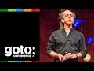

# GOTO 2017 • Code as Risk • Kevlin Henney (2017-06-22)

## Description

This presentation was recorded at GOTO Amsterdam 2017. #GOTOcon #GOTOams
http://gotoams.nl

Kevlin Henney - Independent Consultant, Speaker, Writer & Trainer

ABSTRACT
What is risk? Many people aren't sure, but it's not just uncertainty: risk is exposure to uncertainty.
Instead of just plastering over the cracks, security should also involve reducing the size and number of cracks, reducing the opportunities for cracks to appear, reducing the class of errors and [...]

Download slides and read the full abstract here:
https://gotoams.nl/2017/sessions/144

RECOMMENDED BOOKS
Kevlin Henney & Trisha Gee • 97 Things Every Java Programmer Should Know • https://amzn.to/3kiTwJJ

https://twitter.com/gotoamst
https://www.facebook.com/GOTOConference
http://gotocon.com
#CodeAsRisk #Security #Encryption

Looking for a unique learning experience?
Attend the next GOTO Conference near you! Get your ticket at http://gotocon.com

SUBSCRIBE TO OUR CHANNEL - new videos posted almost daily.
https://www.youtube.com/user/GotoConferences/?sub_confirmation=1

## Transcript

[0:00:06](https://youtu.be/YyhfK-aBo-Y?t=6) [Music]  
[0:00:10](https://youtu.be/YyhfK-aBo-Y?t=10) right so I'm it so where's architecture  
[0:00:15](https://youtu.be/YyhfK-aBo-Y?t=15) begin for me architecture ultimately  
[0:00:19](https://youtu.be/YyhfK-aBo-Y?t=19) begins and ends in the code because  
[0:00:21](https://youtu.be/YyhfK-aBo-Y?t=21) that's the thing that is ultimately real  
[0:00:23](https://youtu.be/YyhfK-aBo-Y?t=23) and a lot of people tend to consider  
[0:00:27](https://youtu.be/YyhfK-aBo-Y?t=27) code to be a detail the problem is that  
[0:00:31](https://youtu.be/YyhfK-aBo-Y?t=31) that is exactly what software is  
[0:00:32](https://youtu.be/YyhfK-aBo-Y?t=32) software is lots and lots of details all  
[0:00:37](https://youtu.be/YyhfK-aBo-Y?t=37) put together in a particular way it's  
[0:00:39](https://youtu.be/YyhfK-aBo-Y?t=39) not-it's not hand-waving we might do  
[0:00:41](https://youtu.be/YyhfK-aBo-Y?t=41) that in meetings we might do that at  
[0:00:42](https://youtu.be/YyhfK-aBo-Y?t=42) whiteboards it might help us think  
[0:00:43](https://youtu.be/YyhfK-aBo-Y?t=43) sometimes it might prevent us from  
[0:00:45](https://youtu.be/YyhfK-aBo-Y?t=45) thinking but ultimately it comes out in  
[0:00:47](https://youtu.be/YyhfK-aBo-Y?t=47) the detail that's where it actually  
[0:00:49](https://youtu.be/YyhfK-aBo-Y?t=49) happens and so I'm not so I have this  
[0:00:54](https://youtu.be/YyhfK-aBo-Y?t=54) kind of issue here is that I'm in the  
[0:00:55](https://youtu.be/YyhfK-aBo-Y?t=55) security track and you know apart from  
[0:00:57](https://youtu.be/YyhfK-aBo-Y?t=57) feeling reasonably secure within myself  
[0:00:59](https://youtu.be/YyhfK-aBo-Y?t=59) that's about as far as security goes for  
[0:01:02](https://youtu.be/YyhfK-aBo-Y?t=62) me I don't that's not an area of  
[0:01:04](https://youtu.be/YyhfK-aBo-Y?t=64) specialization but one thing that is  
[0:01:07](https://youtu.be/YyhfK-aBo-Y?t=67) specialized or rather an area of  
[0:01:09](https://youtu.be/YyhfK-aBo-Y?t=69) interest in which eyes do specialize is  
[0:01:11](https://youtu.be/YyhfK-aBo-Y?t=71) coding practice coding quality how that  
[0:01:14](https://youtu.be/YyhfK-aBo-Y?t=74) builds up to be the larger thing and it  
[0:01:16](https://youtu.be/YyhfK-aBo-Y?t=76) turns out there is a surprising overlap  
[0:01:18](https://youtu.be/YyhfK-aBo-Y?t=78) between these two areas if you want to  
[0:01:20](https://youtu.be/YyhfK-aBo-Y?t=80) reduce the attack surface area of your  
[0:01:22](https://youtu.be/YyhfK-aBo-Y?t=82) software it's no good just looking in  
[0:01:25](https://youtu.be/YyhfK-aBo-Y?t=85) one direction and saying we've got it  
[0:01:26](https://youtu.be/YyhfK-aBo-Y?t=86) covered by frameworks or these guys have  
[0:01:28](https://youtu.be/YyhfK-aBo-Y?t=88) got our back we're using the right  
[0:01:29](https://youtu.be/YyhfK-aBo-Y?t=89) operating system it's a full 360 and I  
[0:01:33](https://youtu.be/YyhfK-aBo-Y?t=93) want to cover one aspect of that which  
[0:01:34](https://youtu.be/YyhfK-aBo-Y?t=94) is often neglected so my background and  
[0:01:37](https://youtu.be/YyhfK-aBo-Y?t=97) I care deeply about the code and edited  
[0:01:41](https://youtu.be/YyhfK-aBo-Y?t=101) this book a few years ago and I also  
[0:01:45](https://youtu.be/YyhfK-aBo-Y?t=105) care about the bigger picture so I've  
[0:01:47](https://youtu.be/YyhfK-aBo-Y?t=107) got a couple of books there with word  
[0:01:48](https://youtu.be/YyhfK-aBo-Y?t=108) software architecture in the title which  
[0:01:50](https://youtu.be/YyhfK-aBo-Y?t=110) immediately qualifies me to talk about  
[0:01:51](https://youtu.be/YyhfK-aBo-Y?t=111) this I believe that's all you need but  
[0:01:55](https://youtu.be/YyhfK-aBo-Y?t=115) there's something else I'm known for a  
[0:01:59](https://youtu.be/YyhfK-aBo-Y?t=119) few years ago I started taking  
[0:02:01](https://youtu.be/YyhfK-aBo-Y?t=121) photographs of software failures in  
[0:02:02](https://youtu.be/YyhfK-aBo-Y?t=122) public places and this is everything  
[0:02:07](https://youtu.be/YyhfK-aBo-Y?t=127) this is 2000 and  
[0:02:10](https://youtu.be/YyhfK-aBo-Y?t=130) six 2006 at Madrid Airport terminal 1  
[0:02:15](https://youtu.be/YyhfK-aBo-Y?t=135) and this is quite a visible failure I  
[0:02:21](https://youtu.be/YyhfK-aBo-Y?t=141) think it's fair to say there's lots of  
[0:02:24](https://youtu.be/YyhfK-aBo-Y?t=144) people wandering through kind of looking  
[0:02:25](https://youtu.be/YyhfK-aBo-Y?t=145) at that and you can kind of spot the  
[0:02:28](https://youtu.be/YyhfK-aBo-Y?t=148) sort of the more nerdy people whenever  
[0:02:29](https://youtu.be/YyhfK-aBo-Y?t=149) this kind of things happen because they  
[0:02:31](https://youtu.be/YyhfK-aBo-Y?t=151) kind of slow down and try and work out  
[0:02:32](https://youtu.be/YyhfK-aBo-Y?t=152) what operating system is about what  
[0:02:33](https://youtu.be/YyhfK-aBo-Y?t=153) works turns out I'd misidentified this  
[0:02:36](https://youtu.be/YyhfK-aBo-Y?t=156) for years and somebody correctly pointed  
[0:02:37](https://youtu.be/YyhfK-aBo-Y?t=157) out but this was actually a 16-bit  
[0:02:41](https://youtu.be/YyhfK-aBo-Y?t=161) networking stack but they misidentified  
[0:02:43](https://youtu.be/YyhfK-aBo-Y?t=163) as as Windows I tracked it down further  
[0:02:45](https://youtu.be/YyhfK-aBo-Y?t=165) this is DOS this is a DOS message from a  
[0:02:50](https://youtu.be/YyhfK-aBo-Y?t=170) particular networking stack this is DOS  
[0:02:53](https://youtu.be/YyhfK-aBo-Y?t=173) in 2006 ok dos had been dead we were it  
[0:03:00](https://youtu.be/YyhfK-aBo-Y?t=180) was the it has been dead so long that we  
[0:03:03](https://youtu.be/YyhfK-aBo-Y?t=183) now think the do S stands for denial of  
[0:03:05](https://youtu.be/YyhfK-aBo-Y?t=185) service and that's what you're getting  
[0:03:07](https://youtu.be/YyhfK-aBo-Y?t=187) here ok this is a huge was this is a  
[0:03:11](https://youtu.be/YyhfK-aBo-Y?t=191) huge error message I mean Saturday took  
[0:03:13](https://youtu.be/YyhfK-aBo-Y?t=193) two photographs yeah it's just like can  
[0:03:16](https://youtu.be/YyhfK-aBo-Y?t=196) I remember it very vividly because my  
[0:03:18](https://youtu.be/YyhfK-aBo-Y?t=198) second my second child he was only he  
[0:03:20](https://youtu.be/YyhfK-aBo-Y?t=200) was only a few months old and it's  
[0:03:22](https://youtu.be/YyhfK-aBo-Y?t=202) pretty much I threw him rugby style to  
[0:03:24](https://youtu.be/YyhfK-aBo-Y?t=204) my wife to catch whilst I got out my  
[0:03:26](https://youtu.be/YyhfK-aBo-Y?t=206) camera to take a photograph of that  
[0:03:28](https://youtu.be/YyhfK-aBo-Y?t=208) because everybody else is wondering whoa  
[0:03:29](https://youtu.be/YyhfK-aBo-Y?t=209) look free packets that's what people  
[0:03:32](https://youtu.be/YyhfK-aBo-Y?t=212) tune into the word free suddenly  
[0:03:34](https://youtu.be/YyhfK-aBo-Y?t=214) everything is good because it's free  
[0:03:37](https://youtu.be/YyhfK-aBo-Y?t=217) anyway I got I got reasonably well now I  
[0:03:39](https://youtu.be/YyhfK-aBo-Y?t=219) started doing this sometimes in between  
[0:03:41](https://youtu.be/YyhfK-aBo-Y?t=221) talks of something and I also take  
[0:03:43](https://youtu.be/YyhfK-aBo-Y?t=223) screenshots so given that we're going  
[0:03:45](https://youtu.be/YyhfK-aBo-Y?t=225) back a few years for some of some of you  
[0:03:49](https://youtu.be/YyhfK-aBo-Y?t=229) this may be a fond memory yeah you can  
[0:03:53](https://youtu.be/YyhfK-aBo-Y?t=233) tell how old it is because I'm still  
[0:03:54](https://youtu.be/YyhfK-aBo-Y?t=234) using Mozilla you know and I was I used  
[0:03:59](https://youtu.be/YyhfK-aBo-Y?t=239) the I remember I was trying to see a  
[0:04:00](https://youtu.be/YyhfK-aBo-Y?t=240) friend of mine visit him in diving  
[0:04:02](https://youtu.be/YyhfK-aBo-Y?t=242) direct and I wanted an earlier train  
[0:04:04](https://youtu.be/YyhfK-aBo-Y?t=244) apparently there are no earlier trains  
[0:04:06](https://youtu.be/YyhfK-aBo-Y?t=246) there are there is only java.lang got a  
[0:04:08](https://youtu.be/YyhfK-aBo-Y?t=248) nullpointerexception  
[0:04:09](https://youtu.be/YyhfK-aBo-Y?t=249) and I use this at a conference in in  
[0:04:15](https://youtu.be/YyhfK-aBo-Y?t=255) Amsterdam a couple of years after I had  
[0:04:18](https://youtu.be/YyhfK-aBo-Y?t=258) this I took this image and somebody came  
[0:04:20](https://youtu.be/YyhfK-aBo-Y?t=260) up to me afterwards and he said  
[0:04:23](https://youtu.be/YyhfK-aBo-Y?t=263) Kaplan you know they still have that bug  
[0:04:25](https://youtu.be/YyhfK-aBo-Y?t=265) on the site and this is this is this is  
[0:04:29](https://youtu.be/YyhfK-aBo-Y?t=269) kind of where the penny dropped where I  
[0:04:31](https://youtu.be/YyhfK-aBo-Y?t=271) started realizing that we in failure we  
[0:04:35](https://youtu.be/YyhfK-aBo-Y?t=275) learn a great deal about a system we  
[0:04:37](https://youtu.be/YyhfK-aBo-Y?t=277) don't simply learn about it's technology  
[0:04:40](https://youtu.be/YyhfK-aBo-Y?t=280) the underlying technology we if you  
[0:04:43](https://youtu.be/YyhfK-aBo-Y?t=283) hadn't guessed it was Java because  
[0:04:45](https://youtu.be/YyhfK-aBo-Y?t=285) somebody has decided to plaster the  
[0:04:46](https://youtu.be/YyhfK-aBo-Y?t=286) technology all over the URL why say it's  
[0:04:49](https://youtu.be/YyhfK-aBo-Y?t=289) a service why do people put ASP JSP PHP  
[0:04:53](https://youtu.be/YyhfK-aBo-Y?t=293) etc in their URLs  
[0:04:55](https://youtu.be/YyhfK-aBo-Y?t=295) did they not learn about encapsulation  
[0:04:57](https://youtu.be/YyhfK-aBo-Y?t=297) okay nothing says nothing says  
[0:05:00](https://youtu.be/YyhfK-aBo-Y?t=300) encapsulation like a stack trace okay  
[0:05:04](https://youtu.be/YyhfK-aBo-Y?t=304) hello this is full stack development  
[0:05:07](https://youtu.be/YyhfK-aBo-Y?t=307) this is a Hilton website as she goes on  
[0:05:10](https://youtu.be/YyhfK-aBo-Y?t=310) for you about there if you want to know  
[0:05:12](https://youtu.be/YyhfK-aBo-Y?t=312) what they're using on this site yeah  
[0:05:14](https://youtu.be/YyhfK-aBo-Y?t=314) fine if you want to find out the  
[0:05:15](https://youtu.be/YyhfK-aBo-Y?t=315) vulnerabilities there's a software  
[0:05:17](https://youtu.be/YyhfK-aBo-Y?t=317) checklist there but this is the other  
[0:05:21](https://youtu.be/YyhfK-aBo-Y?t=321) thing you're learning about you're  
[0:05:23](https://youtu.be/YyhfK-aBo-Y?t=323) learning about how oh how did a simple  
[0:05:26](https://youtu.be/YyhfK-aBo-Y?t=326) how did a simple error like this get  
[0:05:28](https://youtu.be/YyhfK-aBo-Y?t=328) through shouldn't there be a big try  
[0:05:30](https://youtu.be/YyhfK-aBo-Y?t=330) catch that basically says nothing  
[0:05:33](https://youtu.be/YyhfK-aBo-Y?t=333) nothing raw gets out of here okay if  
[0:05:36](https://youtu.be/YyhfK-aBo-Y?t=336) something bad happens we tell we tell  
[0:05:39](https://youtu.be/YyhfK-aBo-Y?t=339) the user we present them with a message  
[0:05:40](https://youtu.be/YyhfK-aBo-Y?t=340) and we say you know what I'm sorry  
[0:05:42](https://youtu.be/YyhfK-aBo-Y?t=342) things didn't work out and we do that in  
[0:05:43](https://youtu.be/YyhfK-aBo-Y?t=343) English or we do that in Dutch but we  
[0:05:45](https://youtu.be/YyhfK-aBo-Y?t=345) don't do it in Java okay there's an idea  
[0:05:48](https://youtu.be/YyhfK-aBo-Y?t=348) so how how could this obvious thing I  
[0:05:50](https://youtu.be/YyhfK-aBo-Y?t=350) mean it's a really obvious thing is  
[0:05:51](https://youtu.be/YyhfK-aBo-Y?t=351) practically mental check this check that  
[0:05:53](https://youtu.be/YyhfK-aBo-Y?t=353) no exceptions propagate across this  
[0:05:54](https://youtu.be/YyhfK-aBo-Y?t=354) boundary so what about the boundaries  
[0:05:56](https://youtu.be/YyhfK-aBo-Y?t=356) always about the boundaries so so what  
[0:05:59](https://youtu.be/YyhfK-aBo-Y?t=359) what happened now I can't tell you what  
[0:06:01](https://youtu.be/YyhfK-aBo-Y?t=361) happened but we can throw out some  
[0:06:02](https://youtu.be/YyhfK-aBo-Y?t=362) theories so maybe the developers were  
[0:06:05](https://youtu.be/YyhfK-aBo-Y?t=365) not aware of this perhaps they were new  
[0:06:08](https://youtu.be/YyhfK-aBo-Y?t=368) to Java  
[0:06:08](https://youtu.be/YyhfK-aBo-Y?t=368) perhaps they were hurried perhaps they  
[0:06:12](https://youtu.be/YyhfK-aBo-Y?t=372) were against deadlines perhaps they were  
[0:06:13](https://youtu.be/YyhfK-aBo-Y?t=373) rushed perhaps this code was checked in  
[0:06:15](https://youtu.be/YyhfK-aBo-Y?t=375) under pressure from management perhaps  
[0:06:17](https://youtu.be/YyhfK-aBo-Y?t=377) this is all out sourced and nobody  
[0:06:19](https://youtu.be/YyhfK-aBo-Y?t=379) actually cared because it wasn't their  
[0:06:20](https://youtu.be/YyhfK-aBo-Y?t=380) interest the fact that it took over two  
[0:06:22](https://youtu.be/YyhfK-aBo-Y?t=382) years for them to fix this in fact they  
[0:06:25](https://youtu.be/YyhfK-aBo-Y?t=385) actually rewrote the site and the next  
[0:06:26](https://youtu.be/YyhfK-aBo-Y?t=386) time I checked what does that tell you  
[0:06:29](https://youtu.be/YyhfK-aBo-Y?t=389) about the management and the  
[0:06:30](https://youtu.be/YyhfK-aBo-Y?t=390) organization around it in other words in  
[0:06:31](https://youtu.be/YyhfK-aBo-Y?t=391) failure we actually reveal a profound  
[0:06:34](https://youtu.be/YyhfK-aBo-Y?t=394) something much more profound about how a  
[0:06:36](https://youtu.be/YyhfK-aBo-Y?t=396) system is built but these days I don't  
[0:06:39](https://youtu.be/YyhfK-aBo-Y?t=399) have to take these photographs anymore  
[0:06:41](https://youtu.be/YyhfK-aBo-Y?t=401) because people send them to me oh thank  
[0:06:49](https://youtu.be/YyhfK-aBo-Y?t=409) you for your object model I can now see  
[0:06:50](https://youtu.be/YyhfK-aBo-Y?t=410) it reveals yeah people just send them to  
[0:06:54](https://youtu.be/YyhfK-aBo-Y?t=414) me  
[0:06:54](https://youtu.be/YyhfK-aBo-Y?t=414) so yeah I've got I've got over a  
[0:06:56](https://youtu.be/YyhfK-aBo-Y?t=416) thousand of these images that people  
[0:06:58](https://youtu.be/YyhfK-aBo-Y?t=418) have sent me and in fact it's got it's  
[0:07:01](https://youtu.be/YyhfK-aBo-Y?t=421) got to the point that somebody recently  
[0:07:03](https://youtu.be/YyhfK-aBo-Y?t=423) coined a phrase for him there apparently  
[0:07:05](https://youtu.be/YyhfK-aBo-Y?t=425) I am I'm nine aim is now been used I  
[0:07:08](https://youtu.be/YyhfK-aBo-Y?t=428) they are Kevin Henny screens and you  
[0:07:13](https://youtu.be/YyhfK-aBo-Y?t=433) know once you've got an adjective then  
[0:07:15](https://youtu.be/YyhfK-aBo-Y?t=435) you know somebody else said oh eh Kevin  
[0:07:17](https://youtu.be/YyhfK-aBo-Y?t=437) Henny apparently there's more than one  
[0:07:19](https://youtu.be/YyhfK-aBo-Y?t=439) of me which is slightly disturbing but  
[0:07:21](https://youtu.be/YyhfK-aBo-Y?t=441) but yeah so there you go so that my name  
[0:07:23](https://youtu.be/YyhfK-aBo-Y?t=443) has come to the point that at the agile  
[0:07:26](https://youtu.be/YyhfK-aBo-Y?t=446) in the City conference in Bristol where  
[0:07:28](https://youtu.be/YyhfK-aBo-Y?t=448) I live last year one of the organizers  
[0:07:32](https://youtu.be/YyhfK-aBo-Y?t=452) John Classen came up to me said Kevin  
[0:07:35](https://youtu.be/YyhfK-aBo-Y?t=455) there's a screen downstairs quick I want  
[0:07:38](https://youtu.be/YyhfK-aBo-Y?t=458) to take a photograph with you pointing  
[0:07:40](https://youtu.be/YyhfK-aBo-Y?t=460) to it then I'll tweet it then you  
[0:07:41](https://youtu.be/YyhfK-aBo-Y?t=461) retweet it so we kind of right there you  
[0:07:45](https://youtu.be/YyhfK-aBo-Y?t=465) know would the snake is eating the tail  
[0:07:47](https://youtu.be/YyhfK-aBo-Y?t=467) at this point okay but this is an  
[0:07:50](https://youtu.be/YyhfK-aBo-Y?t=470) interesting thing the question you have  
[0:07:51](https://youtu.be/YyhfK-aBo-Y?t=471) to ask these are all these are all  
[0:07:53](https://youtu.be/YyhfK-aBo-Y?t=473) failures at what different levels in the  
[0:07:55](https://youtu.be/YyhfK-aBo-Y?t=475) system but this is a track on security  
[0:07:57](https://youtu.be/YyhfK-aBo-Y?t=477) and the question I put to you is what is  
[0:07:59](https://youtu.be/YyhfK-aBo-Y?t=479) the difference between a failure and a  
[0:08:01](https://youtu.be/YyhfK-aBo-Y?t=481) failure what is the difference between a  
[0:08:02](https://youtu.be/YyhfK-aBo-Y?t=482) defect in one aspect and a defect in  
[0:08:04](https://youtu.be/YyhfK-aBo-Y?t=484) another because a few weeks ago lots of  
[0:08:08](https://youtu.be/YyhfK-aBo-Y?t=488) people were sending me these from all  
[0:08:11](https://youtu.be/YyhfK-aBo-Y?t=491) over Germany the train system I've got a  
[0:08:13](https://youtu.be/YyhfK-aBo-Y?t=493) couple from the NHS in the UK these  
[0:08:18](https://youtu.be/YyhfK-aBo-Y?t=498) ransomware this is the wanna cry malware  
[0:08:21](https://youtu.be/YyhfK-aBo-Y?t=501) this is so there's a question what is  
[0:08:24](https://youtu.be/YyhfK-aBo-Y?t=504) the difference between one of these and  
[0:08:26](https://youtu.be/YyhfK-aBo-Y?t=506) the other from the user point of view  
[0:08:27](https://youtu.be/YyhfK-aBo-Y?t=507) there's a thing they can no longer do it  
[0:08:30](https://youtu.be/YyhfK-aBo-Y?t=510) happened there last year in San  
[0:08:31](https://youtu.be/YyhfK-aBo-Y?t=511) Francisco and a lot of people got free  
[0:08:34](https://youtu.be/YyhfK-aBo-Y?t=514) rides for a few days because of  
[0:08:36](https://youtu.be/YyhfK-aBo-Y?t=516) ransomware ok the whole thing was taken  
[0:08:39](https://youtu.be/YyhfK-aBo-Y?t=519) down and some of these are based on  
[0:08:40](https://youtu.be/YyhfK-aBo-Y?t=520) spear phishing attacks and therefore the  
[0:08:42](https://youtu.be/YyhfK-aBo-Y?t=522) human element but ultimately there's the  
[0:08:45](https://youtu.be/YyhfK-aBo-Y?t=525) idea that if you can just drive a wedge  
[0:08:46](https://youtu.be/YyhfK-aBo-Y?t=526) somewhere in a  
[0:08:47](https://youtu.be/YyhfK-aBo-Y?t=527) you know anything about its  
[0:08:48](https://youtu.be/YyhfK-aBo-Y?t=528) vulnerabilities and this particular case  
[0:08:50](https://youtu.be/YyhfK-aBo-Y?t=530) this is to do with not having the right  
[0:08:53](https://youtu.be/YyhfK-aBo-Y?t=533) versions of the software as in running  
[0:08:55](https://youtu.be/YyhfK-aBo-Y?t=535) things like XP which are definitely past  
[0:08:58](https://youtu.be/YyhfK-aBo-Y?t=538) their sell-by date but the point there  
[0:09:01](https://youtu.be/YyhfK-aBo-Y?t=541) is that these vulnerabilities exist and  
[0:09:03](https://youtu.be/YyhfK-aBo-Y?t=543) they exist at all levels from within the  
[0:09:06](https://youtu.be/YyhfK-aBo-Y?t=546) code all the way out of the human level  
[0:09:08](https://youtu.be/YyhfK-aBo-Y?t=548) now we're not going to deal with  
[0:09:09](https://youtu.be/YyhfK-aBo-Y?t=549) directly with the human level but I want  
[0:09:12](https://youtu.be/YyhfK-aBo-Y?t=552) to make the point here that the user  
[0:09:13](https://youtu.be/YyhfK-aBo-Y?t=553) experience of these from a user's point  
[0:09:17](https://youtu.be/YyhfK-aBo-Y?t=557) of view these are almost equivalent user  
[0:09:19](https://youtu.be/YyhfK-aBo-Y?t=559) experience and the security experience  
[0:09:22](https://youtu.be/YyhfK-aBo-Y?t=562) which I quite like it we make that sex  
[0:09:23](https://youtu.be/YyhfK-aBo-Y?t=563) that's good that's you know it's much  
[0:09:25](https://youtu.be/YyhfK-aBo-Y?t=565) Ochs come on come what kind of is that  
[0:09:26](https://youtu.be/YyhfK-aBo-Y?t=566) security experience sex yeah but I want  
[0:09:30](https://youtu.be/YyhfK-aBo-Y?t=570) to talk about something else because  
[0:09:31](https://youtu.be/YyhfK-aBo-Y?t=571) whereas some of this come from this  
[0:09:34](https://youtu.be/YyhfK-aBo-Y?t=574) comes from the programmer experience  
[0:09:35](https://youtu.be/YyhfK-aBo-Y?t=575) what is it like to be in the code  
[0:09:37](https://youtu.be/YyhfK-aBo-Y?t=577) because people are not generally one of  
[0:09:39](https://youtu.be/YyhfK-aBo-Y?t=579) the things I've discovered is that  
[0:09:40](https://youtu.be/YyhfK-aBo-Y?t=580) people in software development are  
[0:09:42](https://youtu.be/YyhfK-aBo-Y?t=582) generally not stupid or malicious okay  
[0:09:45](https://youtu.be/YyhfK-aBo-Y?t=585) but they are often in a hurry they are  
[0:09:49](https://youtu.be/YyhfK-aBo-Y?t=589) often confused by multiple priorities  
[0:09:52](https://youtu.be/YyhfK-aBo-Y?t=592) there is so much to know that you cannot  
[0:09:54](https://youtu.be/YyhfK-aBo-Y?t=594) know it all and so there is this idea  
[0:09:57](https://youtu.be/YyhfK-aBo-Y?t=597) that we need a decent environment in  
[0:09:59](https://youtu.be/YyhfK-aBo-Y?t=599) which to work what is the programmer  
[0:10:00](https://youtu.be/YyhfK-aBo-Y?t=600) experience we often talk about the  
[0:10:02](https://youtu.be/YyhfK-aBo-Y?t=602) architecture of a space as just meaning  
[0:10:05](https://youtu.be/YyhfK-aBo-Y?t=605) structure but from my point of view an  
[0:10:07](https://youtu.be/YyhfK-aBo-Y?t=607) architecture is not simply a structural  
[0:10:09](https://youtu.be/YyhfK-aBo-Y?t=609) arrangement it defines the quality of  
[0:10:12](https://youtu.be/YyhfK-aBo-Y?t=612) living or working in a particular place  
[0:10:14](https://youtu.be/YyhfK-aBo-Y?t=614) what is the quality of being in that  
[0:10:16](https://youtu.be/YyhfK-aBo-Y?t=616) code what is the quality of working  
[0:10:18](https://youtu.be/YyhfK-aBo-Y?t=618) within that environment you know if  
[0:10:21](https://youtu.be/YyhfK-aBo-Y?t=621) you're spending eight hours a day in  
[0:10:22](https://youtu.be/YyhfK-aBo-Y?t=622) there what does that feel like is it  
[0:10:24](https://youtu.be/YyhfK-aBo-Y?t=624) comfortable do you enjoy going in there  
[0:10:26](https://youtu.be/YyhfK-aBo-Y?t=626) or do you feel that you know maybe you  
[0:10:28](https://youtu.be/YyhfK-aBo-Y?t=628) need to put on armor okay it's an it's  
[0:10:30](https://youtu.be/YyhfK-aBo-Y?t=630) another day 10,000 line class it's me  
[0:10:32](https://youtu.be/YyhfK-aBo-Y?t=632) versus the class you know what's it  
[0:10:35](https://youtu.be/YyhfK-aBo-Y?t=635) going to be there are no tests right  
[0:10:37](https://youtu.be/YyhfK-aBo-Y?t=637) your will before you go in so this is  
[0:10:40](https://youtu.be/YyhfK-aBo-Y?t=640) whole idea what's the program experience  
[0:10:42](https://youtu.be/YyhfK-aBo-Y?t=642) and we see that this affects things this  
[0:10:44](https://youtu.be/YyhfK-aBo-Y?t=644) is where the details matter because and  
[0:10:46](https://youtu.be/YyhfK-aBo-Y?t=646) this is also where we find equivalence  
[0:10:47](https://youtu.be/YyhfK-aBo-Y?t=647) so 2014 there were two SSL bugs which  
[0:10:54](https://youtu.be/YyhfK-aBo-Y?t=654) arose from very simple coding situations  
[0:10:56](https://youtu.be/YyhfK-aBo-Y?t=656) go to fail and heartbleed yes here's an  
[0:11:00](https://youtu.be/YyhfK-aBo-Y?t=660) extract  
[0:11:01](https://youtu.be/YyhfK-aBo-Y?t=661) I've taken this strong and refer to my  
[0:11:02](https://youtu.be/YyhfK-aBo-Y?t=662) clans article a bit later but here's an  
[0:11:05](https://youtu.be/YyhfK-aBo-Y?t=665) extract of the go-to fail thing now we  
[0:11:07](https://youtu.be/YyhfK-aBo-Y?t=667) can have various debates about the  
[0:11:09](https://youtu.be/YyhfK-aBo-Y?t=669) merits or demerits of the go-to but this  
[0:11:12](https://youtu.be/YyhfK-aBo-Y?t=672) isn't this comes from a much larger  
[0:11:13](https://youtu.be/YyhfK-aBo-Y?t=673) context it is not immediately obvious  
[0:11:15](https://youtu.be/YyhfK-aBo-Y?t=675) that it is correct and it is not obvious  
[0:11:17](https://youtu.be/YyhfK-aBo-Y?t=677) that it is wrong and this is the point  
[0:11:20](https://youtu.be/YyhfK-aBo-Y?t=680) this is one detail that one line that is  
[0:11:23](https://youtu.be/YyhfK-aBo-Y?t=683) a detail  
[0:11:24](https://youtu.be/YyhfK-aBo-Y?t=684) remember those details people say oh  
[0:11:26](https://youtu.be/YyhfK-aBo-Y?t=686) don't worry about it's just a detail it  
[0:11:27](https://youtu.be/YyhfK-aBo-Y?t=687) turns out is the difference between a  
[0:11:29](https://youtu.be/YyhfK-aBo-Y?t=689) system that works and a system that does  
[0:11:32](https://youtu.be/YyhfK-aBo-Y?t=692) not a system that has vulnerabilities so  
[0:11:35](https://youtu.be/YyhfK-aBo-Y?t=695) all architecture is founded on the  
[0:11:36](https://youtu.be/YyhfK-aBo-Y?t=696) details ultimately it comes down to the  
[0:11:38](https://youtu.be/YyhfK-aBo-Y?t=698) quality of your mortar the quality of  
[0:11:39](https://youtu.be/YyhfK-aBo-Y?t=699) your screws it has to be consistent all  
[0:11:41](https://youtu.be/YyhfK-aBo-Y?t=701) the way through therefore coding  
[0:11:43](https://youtu.be/YyhfK-aBo-Y?t=703) practice is important notice that  
[0:11:44](https://youtu.be/YyhfK-aBo-Y?t=704) there's almost no difference between  
[0:11:45](https://youtu.be/YyhfK-aBo-Y?t=705) that and this recreation of the AT&T bug  
[0:11:49](https://youtu.be/YyhfK-aBo-Y?t=709) in 1990 which basically knocked out the  
[0:11:53](https://youtu.be/YyhfK-aBo-Y?t=713) telephone network for about 150 million  
[0:11:56](https://youtu.be/YyhfK-aBo-Y?t=716) subscribers in North America on a  
[0:11:59](https://youtu.be/YyhfK-aBo-Y?t=719) weekday back in an era when people  
[0:12:02](https://youtu.be/YyhfK-aBo-Y?t=722) actually use telephones as telephony  
[0:12:05](https://youtu.be/YyhfK-aBo-Y?t=725) devices so that's a lot of business and  
[0:12:08](https://youtu.be/YyhfK-aBo-Y?t=728) this this comes down because the  
[0:12:10](https://youtu.be/YyhfK-aBo-Y?t=730) programmer wasn't really thinking  
[0:12:11](https://youtu.be/YyhfK-aBo-Y?t=731) straight and just had a kind of doll  
[0:12:13](https://youtu.be/YyhfK-aBo-Y?t=733) I'll just put a break in here this is  
[0:12:16](https://youtu.be/YyhfK-aBo-Y?t=736) this is equivalent to a denial of  
[0:12:17](https://youtu.be/YyhfK-aBo-Y?t=737) service attack this is the point these  
[0:12:20](https://youtu.be/YyhfK-aBo-Y?t=740) things happen they reveal  
[0:12:21](https://youtu.be/YyhfK-aBo-Y?t=741) vulnerabilities they deny people our  
[0:12:24](https://youtu.be/YyhfK-aBo-Y?t=744) access to things they give us a very  
[0:12:26](https://youtu.be/YyhfK-aBo-Y?t=746) poor user experience so this idea in a  
[0:12:31](https://youtu.be/YyhfK-aBo-Y?t=751) quote local boy Dijkstra most of our  
[0:12:33](https://youtu.be/YyhfK-aBo-Y?t=753) systems are much more complicated than  
[0:12:34](https://youtu.be/YyhfK-aBo-Y?t=754) can be considered healthy and are too  
[0:12:37](https://youtu.be/YyhfK-aBo-Y?t=757) messy and chaotic to be used in comfort  
[0:12:39](https://youtu.be/YyhfK-aBo-Y?t=759) and confidence and this is true of the  
[0:12:42](https://youtu.be/YyhfK-aBo-Y?t=762) outside but it is also true of the  
[0:12:43](https://youtu.be/YyhfK-aBo-Y?t=763) inside it's what's going on inside the  
[0:12:45](https://youtu.be/YyhfK-aBo-Y?t=765) system that we have to care about here  
[0:12:47](https://youtu.be/YyhfK-aBo-Y?t=767) so let's have a little bit of a look at  
[0:12:50](https://youtu.be/YyhfK-aBo-Y?t=770) structure and do we know anything it  
[0:12:53](https://youtu.be/YyhfK-aBo-Y?t=773) turns out we actually know an awful lot  
[0:12:55](https://youtu.be/YyhfK-aBo-Y?t=775) sir quote from GERD Holtzman who he's  
[0:13:00](https://youtu.be/YyhfK-aBo-Y?t=780) one of the chief architects for chief  
[0:13:05](https://youtu.be/YyhfK-aBo-Y?t=785) designers and developers at NASA's JPL  
[0:13:08](https://youtu.be/YyhfK-aBo-Y?t=788) laboratory and he headed up the software  
[0:13:11](https://youtu.be/YyhfK-aBo-Y?t=791) development for  
[0:13:12](https://youtu.be/YyhfK-aBo-Y?t=792) the Mars Curiosity rover which is one of  
[0:13:15](https://youtu.be/YyhfK-aBo-Y?t=795) the coolest pieces of space hardware in  
[0:13:17](https://youtu.be/YyhfK-aBo-Y?t=797) existence and wrote this wonderful piece  
[0:13:20](https://youtu.be/YyhfK-aBo-Y?t=800) for communications of the ACM a couple  
[0:13:22](https://youtu.be/YyhfK-aBo-Y?t=802) of years ago Mars code and you can get  
[0:13:24](https://youtu.be/YyhfK-aBo-Y?t=804) an only one free read I strongly  
[0:13:26](https://youtu.be/YyhfK-aBo-Y?t=806) recommend this one at that site there  
[0:13:28](https://youtu.be/YyhfK-aBo-Y?t=808) are standard precautions that can help  
[0:13:29](https://youtu.be/YyhfK-aBo-Y?t=809) reduce risk in complex software systems  
[0:13:31](https://youtu.be/YyhfK-aBo-Y?t=811) and he lists them this includes the  
[0:13:34](https://youtu.be/YyhfK-aBo-Y?t=814) definition of a good software  
[0:13:36](https://youtu.be/YyhfK-aBo-Y?t=816) architecture based on a clean separation  
[0:13:38](https://youtu.be/YyhfK-aBo-Y?t=818) of concerns data hiding modularity  
[0:13:41](https://youtu.be/YyhfK-aBo-Y?t=821) well-defined interfaces install a strong  
[0:13:44](https://youtu.be/YyhfK-aBo-Y?t=824) fault protection mechanisms that last  
[0:13:46](https://youtu.be/YyhfK-aBo-Y?t=826) one is clearly very context-specific  
[0:13:47](https://youtu.be/YyhfK-aBo-Y?t=827) you need fault protection mechanisms if  
[0:13:50](https://youtu.be/YyhfK-aBo-Y?t=830) you're going to put a probe on another  
[0:13:52](https://youtu.be/YyhfK-aBo-Y?t=832) planet because it turns out if it goes  
[0:13:54](https://youtu.be/YyhfK-aBo-Y?t=834) down you can't easily just oh okay just  
[0:13:56](https://youtu.be/YyhfK-aBo-Y?t=836) send something into the server room and  
[0:13:57](https://youtu.be/YyhfK-aBo-Y?t=837) hit the button if we could send some  
[0:13:59](https://youtu.be/YyhfK-aBo-Y?t=839) buddies to the server room and do that  
[0:14:01](https://youtu.be/YyhfK-aBo-Y?t=841) we have people on Mars but that's not  
[0:14:03](https://youtu.be/YyhfK-aBo-Y?t=843) going to happen right now so that last  
[0:14:05](https://youtu.be/YyhfK-aBo-Y?t=845) one is very context-specific but look at  
[0:14:07](https://youtu.be/YyhfK-aBo-Y?t=847) the previous ones separation of concerns  
[0:14:09](https://youtu.be/YyhfK-aBo-Y?t=849) data hiding modularity well-defined  
[0:14:11](https://youtu.be/YyhfK-aBo-Y?t=851) interfaces these terms are so old that  
[0:14:14](https://youtu.be/YyhfK-aBo-Y?t=854) practically hanging out with the  
[0:14:15](https://youtu.be/YyhfK-aBo-Y?t=855) dinosaur bones okay these are not new  
[0:14:18](https://youtu.be/YyhfK-aBo-Y?t=858) concepts and he's doing this because  
[0:14:21](https://youtu.be/YyhfK-aBo-Y?t=861) he's saying well this is how you make  
[0:14:23](https://youtu.be/YyhfK-aBo-Y?t=863) stuff comprehensible this is how a human  
[0:14:25](https://youtu.be/YyhfK-aBo-Y?t=865) being can understand something how on  
[0:14:26](https://youtu.be/YyhfK-aBo-Y?t=866) earth you supposed to say that a system  
[0:14:29](https://youtu.be/YyhfK-aBo-Y?t=869) is you know secure how are you supposed  
[0:14:33](https://youtu.be/YyhfK-aBo-Y?t=873) to say that it is robust how are you  
[0:14:36](https://youtu.be/YyhfK-aBo-Y?t=876) supposed to say all these things unless  
[0:14:37](https://youtu.be/YyhfK-aBo-Y?t=877) you can actually reason about it and  
[0:14:39](https://youtu.be/YyhfK-aBo-Y?t=879) tackle it on its own terms so I have  
[0:14:42](https://youtu.be/YyhfK-aBo-Y?t=882) another interest amongst many I mean  
[0:14:45](https://youtu.be/YyhfK-aBo-Y?t=885) obviously I like taking photographs of  
[0:14:46](https://youtu.be/YyhfK-aBo-Y?t=886) books and I run a page on what on  
[0:14:50](https://youtu.be/YyhfK-aBo-Y?t=890) Facebook called word Friday and word  
[0:14:51](https://youtu.be/YyhfK-aBo-Y?t=891) Friday every Friday I have to name  
[0:14:54](https://youtu.be/YyhfK-aBo-Y?t=894) suggest I put up a definition of an  
[0:14:57](https://youtu.be/YyhfK-aBo-Y?t=897) unusual word and the rest of the week I  
[0:14:59](https://youtu.be/YyhfK-aBo-Y?t=899) just focus on linguistics and other  
[0:15:00](https://youtu.be/YyhfK-aBo-Y?t=900) vocabulary and so it's all good fun but  
[0:15:03](https://youtu.be/YyhfK-aBo-Y?t=903) given that I do like a I actually like  
[0:15:06](https://youtu.be/YyhfK-aBo-Y?t=906) dictionaries just for their own sake I  
[0:15:08](https://youtu.be/YyhfK-aBo-Y?t=908) thought I would go and look at the  
[0:15:10](https://youtu.be/YyhfK-aBo-Y?t=910) dictionary for the words that I've used  
[0:15:13](https://youtu.be/YyhfK-aBo-Y?t=913) in my title code as risk I'm going to  
[0:15:16](https://youtu.be/YyhfK-aBo-Y?t=916) say that as is easy enough let's just  
[0:15:18](https://youtu.be/YyhfK-aBo-Y?t=918) focus on code for a moment code a set of  
[0:15:21](https://youtu.be/YyhfK-aBo-Y?t=921) instructions for a computer hopefully we  
[0:15:22](https://youtu.be/YyhfK-aBo-Y?t=922) are all comfortable with this I know  
[0:15:24](https://youtu.be/YyhfK-aBo-Y?t=924) it's straight after lunch but hopefully  
[0:15:26](https://youtu.be/YyhfK-aBo-Y?t=926) we're all  
[0:15:26](https://youtu.be/YyhfK-aBo-Y?t=926) with this a computer program or a  
[0:15:28](https://youtu.be/YyhfK-aBo-Y?t=928) portion they're off yet this will make  
[0:15:29](https://youtu.be/YyhfK-aBo-Y?t=929) sense a system of words figures or  
[0:15:33](https://youtu.be/YyhfK-aBo-Y?t=933) symbols used to represent others  
[0:15:35](https://youtu.be/YyhfK-aBo-Y?t=935) especially for the purposes of secrecy  
[0:15:37](https://youtu.be/YyhfK-aBo-Y?t=937) ah yes it turns out that many people who  
[0:15:42](https://youtu.be/YyhfK-aBo-Y?t=942) write code write code you know you kind  
[0:15:47](https://youtu.be/YyhfK-aBo-Y?t=947) of looking at it go like Kevin you're  
[0:15:49](https://youtu.be/YyhfK-aBo-Y?t=949) looking it upside down oh you're right  
[0:15:50](https://youtu.be/YyhfK-aBo-Y?t=950) yeah I couldn't quite tell if it was odd  
[0:15:52](https://youtu.be/YyhfK-aBo-Y?t=952) furred no no no it's not obfuscated that  
[0:15:54](https://youtu.be/YyhfK-aBo-Y?t=954) just my natural style so the point there  
[0:15:58](https://youtu.be/YyhfK-aBo-Y?t=958) is we want to we won't understand  
[0:15:59](https://youtu.be/YyhfK-aBo-Y?t=959) meaning we won't understand intent we  
[0:16:01](https://youtu.be/YyhfK-aBo-Y?t=961) want to be able to we want our code  
[0:16:03](https://youtu.be/YyhfK-aBo-Y?t=963) quite literally to be reasonable to be  
[0:16:05](https://youtu.be/YyhfK-aBo-Y?t=965) able to reason about it the classic  
[0:16:07](https://youtu.be/YyhfK-aBo-Y?t=967) sense of the word but there's another  
[0:16:09](https://youtu.be/YyhfK-aBo-Y?t=969) meaning of the word code which i think  
[0:16:10](https://youtu.be/YyhfK-aBo-Y?t=970) is interesting here a set of conventions  
[0:16:13](https://youtu.be/YyhfK-aBo-Y?t=973) or principles governing behavior or  
[0:16:15](https://youtu.be/YyhfK-aBo-Y?t=975) activity in a particular domain a code  
[0:16:17](https://youtu.be/YyhfK-aBo-Y?t=977) of conduct for example the set of  
[0:16:19](https://youtu.be/YyhfK-aBo-Y?t=979) practices which a developer will arrive  
[0:16:22](https://youtu.be/YyhfK-aBo-Y?t=982) at the code and collaborate with team  
[0:16:24](https://youtu.be/YyhfK-aBo-Y?t=984) members that is the code as it were okay  
[0:16:28](https://youtu.be/YyhfK-aBo-Y?t=988) so let's look at risk now risk is often  
[0:16:30](https://youtu.be/YyhfK-aBo-Y?t=990) often misunderstood a lot of people say  
[0:16:32](https://youtu.be/YyhfK-aBo-Y?t=992) Oh risk is uncertainty or risk is hazard  
[0:16:35](https://youtu.be/YyhfK-aBo-Y?t=995) or it's danger it's not it's a very it's  
[0:16:37](https://youtu.be/YyhfK-aBo-Y?t=997) a very as much I'm specifically defined  
[0:16:40](https://youtu.be/YyhfK-aBo-Y?t=1000) so we go around and dig around we find a  
[0:16:42](https://youtu.be/YyhfK-aBo-Y?t=1002) situation involving exposure to danger  
[0:16:45](https://youtu.be/YyhfK-aBo-Y?t=1005) and these are two elements we're going  
[0:16:47](https://youtu.be/YyhfK-aBo-Y?t=1007) to see running through this the chance  
[0:16:49](https://youtu.be/YyhfK-aBo-Y?t=1009) or hazard of commercial loss a very  
[0:16:50](https://youtu.be/YyhfK-aBo-Y?t=1010) specific one that is used in the  
[0:16:52](https://youtu.be/YyhfK-aBo-Y?t=1012) insurance industry product of the  
[0:16:54](https://youtu.be/YyhfK-aBo-Y?t=1014) consequence and probability of a  
[0:16:56](https://youtu.be/YyhfK-aBo-Y?t=1016) hazardous event or phenomenon ah now  
[0:16:58](https://youtu.be/YyhfK-aBo-Y?t=1018) this is interesting because actually  
[0:17:00](https://youtu.be/YyhfK-aBo-Y?t=1020) this is we've actually got an equation  
[0:17:01](https://youtu.be/YyhfK-aBo-Y?t=1021) here it takes it takes the basic idea  
[0:17:05](https://youtu.be/YyhfK-aBo-Y?t=1025) that we can see exposure to a  
[0:17:07](https://youtu.be/YyhfK-aBo-Y?t=1027) proposition of which one is uncertain  
[0:17:09](https://youtu.be/YyhfK-aBo-Y?t=1029) it's not about uncertainty it's about  
[0:17:13](https://youtu.be/YyhfK-aBo-Y?t=1033) exposure to uncertainty it's a very  
[0:17:15](https://youtu.be/YyhfK-aBo-Y?t=1035) subtle distinction if you put yourself  
[0:17:18](https://youtu.be/YyhfK-aBo-Y?t=1038) in harm's way then that's clearly going  
[0:17:20](https://youtu.be/YyhfK-aBo-Y?t=1040) to be a worse proposition than keeping  
[0:17:23](https://youtu.be/YyhfK-aBo-Y?t=1043) yourself out of harm's way and so there  
[0:17:25](https://youtu.be/YyhfK-aBo-Y?t=1045) is this idea of exposure to uncertainty  
[0:17:28](https://youtu.be/YyhfK-aBo-Y?t=1048) risk is something we can do something  
[0:17:30](https://youtu.be/YyhfK-aBo-Y?t=1050) about in other words we can reduce  
[0:17:32](https://youtu.be/YyhfK-aBo-Y?t=1052) exposure we can reduce uncertainty by  
[0:17:35](https://youtu.be/YyhfK-aBo-Y?t=1055) doing a number of different things and  
[0:17:36](https://youtu.be/YyhfK-aBo-Y?t=1056) it turns out very few of these things on  
[0:17:38](https://youtu.be/YyhfK-aBo-Y?t=1058) you  
[0:17:39](https://youtu.be/YyhfK-aBo-Y?t=1059) but also there's a mindset change coke  
[0:17:42](https://youtu.be/YyhfK-aBo-Y?t=1062) pepperdine a few years ago tweeted this  
[0:17:44](https://youtu.be/YyhfK-aBo-Y?t=1064) one at me functionality is an asset code  
[0:17:48](https://youtu.be/YyhfK-aBo-Y?t=1068) is a liability  
[0:17:49](https://youtu.be/YyhfK-aBo-Y?t=1069) however thinking this is really  
[0:17:51](https://youtu.be/YyhfK-aBo-Y?t=1071) interesting because I've spent the  
[0:17:53](https://youtu.be/YyhfK-aBo-Y?t=1073) better part of my career trying to  
[0:17:54](https://youtu.be/YyhfK-aBo-Y?t=1074) convince people that code is an asset it  
[0:17:56](https://youtu.be/YyhfK-aBo-Y?t=1076) turns out that these are both  
[0:17:57](https://youtu.be/YyhfK-aBo-Y?t=1077) simultaneously true but they offer us  
[0:17:59](https://youtu.be/YyhfK-aBo-Y?t=1079) different perspectives the idea is that  
[0:18:02](https://youtu.be/YyhfK-aBo-Y?t=1082) what people want is functionality when  
[0:18:05](https://youtu.be/YyhfK-aBo-Y?t=1085) you download a new framework that's what  
[0:18:07](https://youtu.be/YyhfK-aBo-Y?t=1087) you want functionality the fact you  
[0:18:08](https://youtu.be/YyhfK-aBo-Y?t=1088) might be able to see the source code  
[0:18:09](https://youtu.be/YyhfK-aBo-Y?t=1089) that's great but normally what you want  
[0:18:12](https://youtu.be/YyhfK-aBo-Y?t=1092) is the functionality you also want  
[0:18:14](https://youtu.be/YyhfK-aBo-Y?t=1094) confidence in the functionality in other  
[0:18:15](https://youtu.be/YyhfK-aBo-Y?t=1095) words you want a system around it that  
[0:18:18](https://youtu.be/YyhfK-aBo-Y?t=1098) system is a system of people a community  
[0:18:20](https://youtu.be/YyhfK-aBo-Y?t=1100) a sense that other people have used this  
[0:18:22](https://youtu.be/YyhfK-aBo-Y?t=1102) software and have you done so reliably  
[0:18:25](https://youtu.be/YyhfK-aBo-Y?t=1105) you want the sense of activity that the  
[0:18:27](https://youtu.be/YyhfK-aBo-Y?t=1107) system is alive rather than dead if the  
[0:18:29](https://youtu.be/YyhfK-aBo-Y?t=1109) last check-in was five years ago  
[0:18:31](https://youtu.be/YyhfK-aBo-Y?t=1111) then perhaps don't touch ok you want  
[0:18:34](https://youtu.be/YyhfK-aBo-Y?t=1114) that kind of responsiveness and  
[0:18:35](https://youtu.be/YyhfK-aBo-Y?t=1115) reactivity you want to sense beyond you  
[0:18:38](https://youtu.be/YyhfK-aBo-Y?t=1118) want the system beyond the system so to  
[0:18:40](https://youtu.be/YyhfK-aBo-Y?t=1120) speak you're looking for something very  
[0:18:41](https://youtu.be/YyhfK-aBo-Y?t=1121) specific that becomes the asset as well  
[0:18:46](https://youtu.be/YyhfK-aBo-Y?t=1126) but why is the catalyzer code the  
[0:18:48](https://youtu.be/YyhfK-aBo-Y?t=1128) liability well I want you to imagine a  
[0:18:49](https://youtu.be/YyhfK-aBo-Y?t=1129) change to the current system you're  
[0:18:51](https://youtu.be/YyhfK-aBo-Y?t=1131) working on ok done good that was easy  
[0:18:54](https://youtu.be/YyhfK-aBo-Y?t=1134) what is preventing you from doing it  
[0:18:57](https://youtu.be/YyhfK-aBo-Y?t=1137) what is the friction that prevents you  
[0:19:01](https://youtu.be/YyhfK-aBo-Y?t=1141) from applying a change it turns out is  
[0:19:03](https://youtu.be/YyhfK-aBo-Y?t=1143) the code the code is the thing that  
[0:19:06](https://youtu.be/YyhfK-aBo-Y?t=1146) prevents you from changing the code now  
[0:19:09](https://youtu.be/YyhfK-aBo-Y?t=1149) why is this a useful construct well it  
[0:19:11](https://youtu.be/YyhfK-aBo-Y?t=1151) turns out that what companies do when  
[0:19:13](https://youtu.be/YyhfK-aBo-Y?t=1153) they recognize they have liabilities if  
[0:19:15](https://youtu.be/YyhfK-aBo-Y?t=1155) you have a financial liability you watch  
[0:19:17](https://youtu.be/YyhfK-aBo-Y?t=1157) it like a hawk you make sure you  
[0:19:20](https://youtu.be/YyhfK-aBo-Y?t=1160) minimize your but it's not about  
[0:19:22](https://youtu.be/YyhfK-aBo-Y?t=1162) elimination of liabilities there are  
[0:19:23](https://youtu.be/YyhfK-aBo-Y?t=1163) very few companies that have zero  
[0:19:25](https://youtu.be/YyhfK-aBo-Y?t=1165) liability what they're trying to do is  
[0:19:27](https://youtu.be/YyhfK-aBo-Y?t=1167) understand the balance they're  
[0:19:28](https://youtu.be/YyhfK-aBo-Y?t=1168) understanding the trade-off they don't  
[0:19:29](https://youtu.be/YyhfK-aBo-Y?t=1169) want to have their liabilities run out  
[0:19:31](https://youtu.be/YyhfK-aBo-Y?t=1171) of control and wipe out their assets so  
[0:19:35](https://youtu.be/YyhfK-aBo-Y?t=1175) that's what you do that's why code as a  
[0:19:36](https://youtu.be/YyhfK-aBo-Y?t=1176) liability is actually quite a useful  
[0:19:38](https://youtu.be/YyhfK-aBo-Y?t=1178) construct because it means you watch it  
[0:19:39](https://youtu.be/YyhfK-aBo-Y?t=1179) like a hawk you make sure you have less  
[0:19:41](https://youtu.be/YyhfK-aBo-Y?t=1181) of it rather than more of it you make  
[0:19:43](https://youtu.be/YyhfK-aBo-Y?t=1183) sure that you can understand it so when  
[0:19:44](https://youtu.be/YyhfK-aBo-Y?t=1184) somebody says I have no idea what's  
[0:19:47](https://youtu.be/YyhfK-aBo-Y?t=1187) going on in this subsystem but it seems  
[0:19:49](https://youtu.be/YyhfK-aBo-Y?t=1189) to work seems is not good enough  
[0:19:52](https://youtu.be/YyhfK-aBo-Y?t=1192) the fact that you had no idea that's a  
[0:19:55](https://youtu.be/YyhfK-aBo-Y?t=1195) liability you have no you are exposing  
[0:19:57](https://youtu.be/YyhfK-aBo-Y?t=1197) yourself to risk and you have no idea  
[0:20:00](https://youtu.be/YyhfK-aBo-Y?t=1200) there's uncertainty in there you don't  
[0:20:03](https://youtu.be/YyhfK-aBo-Y?t=1203) want to be in that position so the idea  
[0:20:05](https://youtu.be/YyhfK-aBo-Y?t=1205) that it's a liability is really useful  
[0:20:06](https://youtu.be/YyhfK-aBo-Y?t=1206) way of thinking about it you want to  
[0:20:07](https://youtu.be/YyhfK-aBo-Y?t=1207) minimize it you want it to be exactly  
[0:20:10](https://youtu.be/YyhfK-aBo-Y?t=1210) what you want you don't want dead code  
[0:20:11](https://youtu.be/YyhfK-aBo-Y?t=1211) you don't want incomprehensible code you  
[0:20:13](https://youtu.be/YyhfK-aBo-Y?t=1213) want to be able to understand it and  
[0:20:14](https://youtu.be/YyhfK-aBo-Y?t=1214) that everything there is a necessary  
[0:20:16](https://youtu.be/YyhfK-aBo-Y?t=1216) part so that when things change because  
[0:20:19](https://youtu.be/YyhfK-aBo-Y?t=1219) it turns out that's one of the most  
[0:20:20](https://youtu.be/YyhfK-aBo-Y?t=1220) popular things to ever happen to a piece  
[0:20:21](https://youtu.be/YyhfK-aBo-Y?t=1221) of software but humans are very bad at  
[0:20:24](https://youtu.be/YyhfK-aBo-Y?t=1224) recognizing this we use words like done  
[0:20:27](https://youtu.be/YyhfK-aBo-Y?t=1227) we've even elaborated it we've even  
[0:20:29](https://youtu.be/YyhfK-aBo-Y?t=1229) raised it to the power I even hear  
[0:20:31](https://youtu.be/YyhfK-aBo-Y?t=1231) people going dun dun dun as if that will  
[0:20:34](https://youtu.be/YyhfK-aBo-Y?t=1234) somehow assert that it really is done a  
[0:20:38](https://youtu.be/YyhfK-aBo-Y?t=1238) system is only done when nobody's using  
[0:20:40](https://youtu.be/YyhfK-aBo-Y?t=1240) it it's abandoned at that point okay so  
[0:20:43](https://youtu.be/YyhfK-aBo-Y?t=1243) you need to be able to create an  
[0:20:44](https://youtu.be/YyhfK-aBo-Y?t=1244) environment a situation in which you can  
[0:20:46](https://youtu.be/YyhfK-aBo-Y?t=1246) change stuff it's pretty simple  
[0:20:49](https://youtu.be/YyhfK-aBo-Y?t=1249) observation complexity complexity  
[0:20:52](https://youtu.be/YyhfK-aBo-Y?t=1252) introduces bugs so therefore avoid it  
[0:20:54](https://youtu.be/YyhfK-aBo-Y?t=1254) where possible and this is the our  
[0:20:56](https://youtu.be/YyhfK-aBo-Y?t=1256) aspect it reduces vulnerabilities if you  
[0:20:59](https://youtu.be/YyhfK-aBo-Y?t=1259) avoid complexity you produces  
[0:21:00](https://youtu.be/YyhfK-aBo-Y?t=1260) vulnerabilities so what do we only talk  
[0:21:03](https://youtu.be/YyhfK-aBo-Y?t=1263) about when we're talking about code  
[0:21:04](https://youtu.be/YyhfK-aBo-Y?t=1264) complexity and things like technical  
[0:21:06](https://youtu.be/YyhfK-aBo-Y?t=1266) debt and so on we only talk about  
[0:21:07](https://youtu.be/YyhfK-aBo-Y?t=1267) refactoring but I want to introduce you  
[0:21:09](https://youtu.be/YyhfK-aBo-Y?t=1269) to very simple very simple kind of  
[0:21:13](https://youtu.be/YyhfK-aBo-Y?t=1273) right-hand rule about how you reason  
[0:21:15](https://youtu.be/YyhfK-aBo-Y?t=1275) about the changes in your code because  
[0:21:17](https://youtu.be/YyhfK-aBo-Y?t=1277) when we talk about the properties of our  
[0:21:19](https://youtu.be/YyhfK-aBo-Y?t=1279) code and when we use the language of  
[0:21:21](https://youtu.be/YyhfK-aBo-Y?t=1281) requirements we're not very good we have  
[0:21:24](https://youtu.be/YyhfK-aBo-Y?t=1284) this very poor vocabulary when we talk  
[0:21:27](https://youtu.be/YyhfK-aBo-Y?t=1287) about the semantics of a system when we  
[0:21:29](https://youtu.be/YyhfK-aBo-Y?t=1289) talk about its behaviors and  
[0:21:30](https://youtu.be/YyhfK-aBo-Y?t=1290) interactions its general correctness we  
[0:21:32](https://youtu.be/YyhfK-aBo-Y?t=1292) talk about functional requirements and  
[0:21:35](https://youtu.be/YyhfK-aBo-Y?t=1295) then you ask people okay so what about  
[0:21:38](https://youtu.be/YyhfK-aBo-Y?t=1298) the other requirements and you're stuck  
[0:21:40](https://youtu.be/YyhfK-aBo-Y?t=1300) for a word and you go non-functional  
[0:21:46](https://youtu.be/YyhfK-aBo-Y?t=1306) because they're so important we don't  
[0:21:48](https://youtu.be/YyhfK-aBo-Y?t=1308) even have a word for them and you're  
[0:21:51](https://youtu.be/YyhfK-aBo-Y?t=1311) saying what are those requirements  
[0:21:52](https://youtu.be/YyhfK-aBo-Y?t=1312) they're the ones that aren't those you  
[0:21:55](https://youtu.be/YyhfK-aBo-Y?t=1315) know we're human beings each natural  
[0:21:58](https://youtu.be/YyhfK-aBo-Y?t=1318) language that humans have has a vast  
[0:22:00](https://youtu.be/YyhfK-aBo-Y?t=1320) vocabulary to draw on and the best we  
[0:22:02](https://youtu.be/YyhfK-aBo-Y?t=1322) can do in English which has trolled  
[0:22:04](https://youtu.be/YyhfK-aBo-Y?t=1324) pretty much  
[0:22:05](https://youtu.be/YyhfK-aBo-Y?t=1325) ransacked every other language on the  
[0:22:07](https://youtu.be/YyhfK-aBo-Y?t=1327) planet for its own vocabulary the best  
[0:22:09](https://youtu.be/YyhfK-aBo-Y?t=1329) we can come up with is non-functional  
[0:22:10](https://youtu.be/YyhfK-aBo-Y?t=1330) the default meaning of non-functional  
[0:22:13](https://youtu.be/YyhfK-aBo-Y?t=1333) English by the way does not work okay if  
[0:22:18](https://youtu.be/YyhfK-aBo-Y?t=1338) your washing machine is non-functional  
[0:22:19](https://youtu.be/YyhfK-aBo-Y?t=1339) that is not a good thing we're not  
[0:22:20](https://youtu.be/YyhfK-aBo-Y?t=1340) talking about availability or rather we  
[0:22:22](https://youtu.be/YyhfK-aBo-Y?t=1342) are we're talking about two completely  
[0:22:23](https://youtu.be/YyhfK-aBo-Y?t=1343) lack of availability there is not a  
[0:22:26](https://youtu.be/YyhfK-aBo-Y?t=1346) proper word called non-functional you  
[0:22:27](https://youtu.be/YyhfK-aBo-Y?t=1347) need to give it it but the other thing  
[0:22:29](https://youtu.be/YyhfK-aBo-Y?t=1349) we do is we collude we combine and  
[0:22:32](https://youtu.be/YyhfK-aBo-Y?t=1352) accidentally create a category that  
[0:22:34](https://youtu.be/YyhfK-aBo-Y?t=1354) doesn't exist there are three categories  
[0:22:36](https://youtu.be/YyhfK-aBo-Y?t=1356) or we can split these further but there  
[0:22:38](https://youtu.be/YyhfK-aBo-Y?t=1358) are three essential categories that will  
[0:22:40](https://youtu.be/YyhfK-aBo-Y?t=1360) help us focus  
[0:22:40](https://youtu.be/YyhfK-aBo-Y?t=1360) there's the functional stuff there's the  
[0:22:42](https://youtu.be/YyhfK-aBo-Y?t=1362) operational stuff the executional stuff  
[0:22:45](https://youtu.be/YyhfK-aBo-Y?t=1365) that's the how does it run what are its  
[0:22:48](https://youtu.be/YyhfK-aBo-Y?t=1368) resources what about time what about  
[0:22:50](https://youtu.be/YyhfK-aBo-Y?t=1370) these other illa T's that people talk  
[0:22:52](https://youtu.be/YyhfK-aBo-Y?t=1372) about the manifests themselves at  
[0:22:53](https://youtu.be/YyhfK-aBo-Y?t=1373) runtime and then now are the  
[0:22:54](https://youtu.be/YyhfK-aBo-Y?t=1374) developmental qualities of a system its  
[0:22:57](https://youtu.be/YyhfK-aBo-Y?t=1377) maintainability its testability  
[0:22:59](https://youtu.be/YyhfK-aBo-Y?t=1379) these are development books they see the  
[0:23:01](https://youtu.be/YyhfK-aBo-Y?t=1381) top two are experienced at runtime the  
[0:23:05](https://youtu.be/YyhfK-aBo-Y?t=1385) bottom the bottom category is  
[0:23:07](https://youtu.be/YyhfK-aBo-Y?t=1387) experienced by developers now these are  
[0:23:09](https://youtu.be/YyhfK-aBo-Y?t=1389) not perfectly orthogonal but then again  
[0:23:11](https://youtu.be/YyhfK-aBo-Y?t=1391) neither my fingers so I'm not worried  
[0:23:12](https://youtu.be/YyhfK-aBo-Y?t=1392) about that but it is a useful thinking  
[0:23:14](https://youtu.be/YyhfK-aBo-Y?t=1394) structure because what it means is when  
[0:23:16](https://youtu.be/YyhfK-aBo-Y?t=1396) we are refactoring what you're doing  
[0:23:17](https://youtu.be/YyhfK-aBo-Y?t=1397) you're refactoring is you're trying to  
[0:23:18](https://youtu.be/YyhfK-aBo-Y?t=1398) hold the functional axis still and  
[0:23:22](https://youtu.be/YyhfK-aBo-Y?t=1402) you're trying to improve something about  
[0:23:24](https://youtu.be/YyhfK-aBo-Y?t=1404) the developmental axis you're trying to  
[0:23:25](https://youtu.be/YyhfK-aBo-Y?t=1405) say I want this to be more readable I  
[0:23:27](https://youtu.be/YyhfK-aBo-Y?t=1407) want this to be simpler I wanted to use  
[0:23:29](https://youtu.be/YyhfK-aBo-Y?t=1409) a more recent version of the language or  
[0:23:31](https://youtu.be/YyhfK-aBo-Y?t=1411) libraries you'll try to change something  
[0:23:33](https://youtu.be/YyhfK-aBo-Y?t=1413) on this so one remains fixed and one you  
[0:23:36](https://youtu.be/YyhfK-aBo-Y?t=1416) go to improve but the operational axis  
[0:23:39](https://youtu.be/YyhfK-aBo-Y?t=1419) is open it's a wild card it can go  
[0:23:41](https://youtu.be/YyhfK-aBo-Y?t=1421) either way it can get faster or slower  
[0:23:43](https://youtu.be/YyhfK-aBo-Y?t=1423) they become more or less secure it can  
[0:23:45](https://youtu.be/YyhfK-aBo-Y?t=1425) become more greedy for memory or  
[0:23:48](https://youtu.be/YyhfK-aBo-Y?t=1428) actually more streamlined in memory in  
[0:23:50](https://youtu.be/YyhfK-aBo-Y?t=1430) other words that's not the one we're  
[0:23:51](https://youtu.be/YyhfK-aBo-Y?t=1431) concentrating on there's another  
[0:23:53](https://youtu.be/YyhfK-aBo-Y?t=1433) function out to prefer preserving  
[0:23:54](https://youtu.be/YyhfK-aBo-Y?t=1434) transformation that's the other way  
[0:23:56](https://youtu.be/YyhfK-aBo-Y?t=1436) around  
[0:23:56](https://youtu.be/YyhfK-aBo-Y?t=1436) which is we focus on functionality we  
[0:24:00](https://youtu.be/YyhfK-aBo-Y?t=1440) focus on improving some aspect of the  
[0:24:02](https://youtu.be/YyhfK-aBo-Y?t=1442) operational side with such as  
[0:24:04](https://youtu.be/YyhfK-aBo-Y?t=1444) performance tuning and the developmental  
[0:24:06](https://youtu.be/YyhfK-aBo-Y?t=1446) aspect is open maybe the code gets  
[0:24:08](https://youtu.be/YyhfK-aBo-Y?t=1448) Messier maybe it gets better so with  
[0:24:13](https://youtu.be/YyhfK-aBo-Y?t=1453) that in mind let's just take a piece of  
[0:24:15](https://youtu.be/YyhfK-aBo-Y?t=1455) code and refactor it and this is a piece  
[0:24:17](https://youtu.be/YyhfK-aBo-Y?t=1457) of code I was quite a kind of  
[0:24:18](https://youtu.be/YyhfK-aBo-Y?t=1458) interesting because I was going  
[0:24:19](https://youtu.be/YyhfK-aBo-Y?t=1459) some code and then discover that she had  
[0:24:21](https://youtu.be/YyhfK-aBo-Y?t=1461) a piece of code lying around another  
[0:24:24](https://youtu.be/YyhfK-aBo-Y?t=1464) talk which I just tweaked a little bit  
[0:24:26](https://youtu.be/YyhfK-aBo-Y?t=1466) and that's actually based on something  
[0:24:28](https://youtu.be/YyhfK-aBo-Y?t=1468) from one of my clients and I've rounded  
[0:24:30](https://youtu.be/YyhfK-aBo-Y?t=1470) it and changed everything to protect the  
[0:24:32](https://youtu.be/YyhfK-aBo-Y?t=1472) innocent and the guilty but it's a piece  
[0:24:35](https://youtu.be/YyhfK-aBo-Y?t=1475) of C++ code and we might say well the  
[0:24:37](https://youtu.be/YyhfK-aBo-Y?t=1477) first part of security is don't use C++  
[0:24:39](https://youtu.be/YyhfK-aBo-Y?t=1479) yeah you know if you're a JavaScript  
[0:24:41](https://youtu.be/YyhfK-aBo-Y?t=1481) programmer you just tell yourself that  
[0:24:42](https://youtu.be/YyhfK-aBo-Y?t=1482) all right languages do expose themselves  
[0:24:47](https://youtu.be/YyhfK-aBo-Y?t=1487) more or less to this and certainly raw  
[0:24:50](https://youtu.be/YyhfK-aBo-Y?t=1490) languages that have a raw memory model  
[0:24:52](https://youtu.be/YyhfK-aBo-Y?t=1492) like C and C++ that does increase your  
[0:24:54](https://youtu.be/YyhfK-aBo-Y?t=1494) liability but all the things I'm going  
[0:24:57](https://youtu.be/YyhfK-aBo-Y?t=1497) to look at here are related to you can  
[0:25:00](https://youtu.be/YyhfK-aBo-Y?t=1500) apply in other languages so here's a  
[0:25:02](https://youtu.be/YyhfK-aBo-Y?t=1502) piece of code which obviously you can  
[0:25:03](https://youtu.be/YyhfK-aBo-Y?t=1503) see at the back yes good and what I want  
[0:25:06](https://youtu.be/YyhfK-aBo-Y?t=1506) to do is I want to go through this piece  
[0:25:08](https://youtu.be/YyhfK-aBo-Y?t=1508) of code and simplify because the  
[0:25:11](https://youtu.be/YyhfK-aBo-Y?t=1511) original goal of this was actually  
[0:25:12](https://youtu.be/YyhfK-aBo-Y?t=1512) simplification and then I realized that  
[0:25:13](https://youtu.be/YyhfK-aBo-Y?t=1513) half of what I was talking about  
[0:25:15](https://youtu.be/YyhfK-aBo-Y?t=1515) actually has that fits directly with the  
[0:25:19](https://youtu.be/YyhfK-aBo-Y?t=1519) message of what we're talking about here  
[0:25:20](https://youtu.be/YyhfK-aBo-Y?t=1520) we are reducing the idea of code as risk  
[0:25:23](https://youtu.be/YyhfK-aBo-Y?t=1523) so first of all I'm going to give you a  
[0:25:25](https://youtu.be/YyhfK-aBo-Y?t=1525) quick tour just run through this just to  
[0:25:29](https://youtu.be/YyhfK-aBo-Y?t=1529) get a sense of what are all the things  
[0:25:31](https://youtu.be/YyhfK-aBo-Y?t=1531) that are potentially reveal some kind of  
[0:25:34](https://youtu.be/YyhfK-aBo-Y?t=1534) vulnerability or involved in some kind  
[0:25:35](https://youtu.be/YyhfK-aBo-Y?t=1535) of vulnerability there you go so those  
[0:25:39](https://youtu.be/YyhfK-aBo-Y?t=1539) are your red-green color blind like me  
[0:25:41](https://youtu.be/YyhfK-aBo-Y?t=1541) that's half the lines so wow let's go  
[0:25:47](https://youtu.be/YyhfK-aBo-Y?t=1547) have a quick look at these guys sort of  
[0:25:48](https://youtu.be/YyhfK-aBo-Y?t=1548) we got we've got a bunch of declarations  
[0:25:50](https://youtu.be/YyhfK-aBo-Y?t=1550) helpfully called declarations just so  
[0:25:52](https://youtu.be/YyhfK-aBo-Y?t=1552) you know and we've got some information  
[0:25:55](https://youtu.be/YyhfK-aBo-Y?t=1555) about getting some config and we get  
[0:25:57](https://youtu.be/YyhfK-aBo-Y?t=1557) some more config and then we get some  
[0:25:58](https://youtu.be/YyhfK-aBo-Y?t=1558) more config and we do things so much  
[0:26:01](https://youtu.be/YyhfK-aBo-Y?t=1561) code is imperative it's all about the  
[0:26:03](https://youtu.be/YyhfK-aBo-Y?t=1563) doing and then finally we actually do  
[0:26:06](https://youtu.be/YyhfK-aBo-Y?t=1566) something meaningful we do a conversion  
[0:26:07](https://youtu.be/YyhfK-aBo-Y?t=1567) and then we do some more we do some  
[0:26:09](https://youtu.be/YyhfK-aBo-Y?t=1569) checking and finally we return somebody  
[0:26:12](https://youtu.be/YyhfK-aBo-Y?t=1572) a result okay so let's go back to this  
[0:26:15](https://youtu.be/YyhfK-aBo-Y?t=1575) the first thing I'm going to notice is  
[0:26:16](https://youtu.be/YyhfK-aBo-Y?t=1576) all of these wretched comments okay what  
[0:26:20](https://youtu.be/YyhfK-aBo-Y?t=1580) is the thing you're going to do with  
[0:26:21](https://youtu.be/YyhfK-aBo-Y?t=1581) lots of sections that are commented huh  
[0:26:26](https://youtu.be/YyhfK-aBo-Y?t=1586) methods you can factor no you're going  
[0:26:28](https://youtu.be/YyhfK-aBo-Y?t=1588) to correct the spelling mistakes  
[0:26:30](https://youtu.be/YyhfK-aBo-Y?t=1590) right now check it in now delete them  
[0:26:35](https://youtu.be/YyhfK-aBo-Y?t=1595) okay okay I did say I'm into words and  
[0:26:40](https://youtu.be/YyhfK-aBo-Y?t=1600) language you know I'm going to check  
[0:26:41](https://youtu.be/YyhfK-aBo-Y?t=1601) those spelling mistakes they've really  
[0:26:42](https://youtu.be/YyhfK-aBo-Y?t=1602) bugged me okay now now you've got a  
[0:26:44](https://youtu.be/YyhfK-aBo-Y?t=1604) version that's got the correct version  
[0:26:45](https://youtu.be/YyhfK-aBo-Y?t=1605) of the comments should anybody want to  
[0:26:46](https://youtu.be/YyhfK-aBo-Y?t=1606) roll back to this okay then we get rid  
[0:26:49](https://youtu.be/YyhfK-aBo-Y?t=1609) of them okay let's go through piece by  
[0:26:50](https://youtu.be/YyhfK-aBo-Y?t=1610) piece there's all these declarations up  
[0:26:52](https://youtu.be/YyhfK-aBo-Y?t=1612) at the top and see was a block  
[0:26:58](https://youtu.be/YyhfK-aBo-Y?t=1618) structured language still is a block  
[0:26:59](https://youtu.be/YyhfK-aBo-Y?t=1619) structured language that means you can  
[0:27:01](https://youtu.be/YyhfK-aBo-Y?t=1621) put variables in blocks a lot of people  
[0:27:03](https://youtu.be/YyhfK-aBo-Y?t=1623) are not aware of this and I remember  
[0:27:04](https://youtu.be/YyhfK-aBo-Y?t=1624) saying this to a colleague and he said  
[0:27:06](https://youtu.be/YyhfK-aBo-Y?t=1626) oh that's just your crazy C++ stuff you  
[0:27:08](https://youtu.be/YyhfK-aBo-Y?t=1628) can move that you can move that you know  
[0:27:09](https://youtu.be/YyhfK-aBo-Y?t=1629) I said no no really it's it's C you can  
[0:27:12](https://youtu.be/YyhfK-aBo-Y?t=1632) actually look in knr they've got  
[0:27:13](https://youtu.be/YyhfK-aBo-Y?t=1633) examples there so well how long has that  
[0:27:14](https://youtu.be/YyhfK-aBo-Y?t=1634) been in C language  
[0:27:15](https://youtu.be/YyhfK-aBo-Y?t=1635) I don't know 1971-72 Oh so let's  
[0:27:21](https://youtu.be/YyhfK-aBo-Y?t=1641) redistribute the variables so that we  
[0:27:24](https://youtu.be/YyhfK-aBo-Y?t=1644) reduce the distance we increase the  
[0:27:26](https://youtu.be/YyhfK-aBo-Y?t=1646) awareness that we have humans are really  
[0:27:28](https://youtu.be/YyhfK-aBo-Y?t=1648) good at chunking so it's play to our  
[0:27:30](https://youtu.be/YyhfK-aBo-Y?t=1650) strengths instead of playing to our  
[0:27:31](https://youtu.be/YyhfK-aBo-Y?t=1651) weaknesses we're very poor when things  
[0:27:33](https://youtu.be/YyhfK-aBo-Y?t=1653) are fragmented we cannot reason about  
[0:27:34](https://youtu.be/YyhfK-aBo-Y?t=1654) them so let's allow somebody to reason  
[0:27:37](https://youtu.be/YyhfK-aBo-Y?t=1657) confidently about the code let's move  
[0:27:38](https://youtu.be/YyhfK-aBo-Y?t=1658) things to where they need to be so we'll  
[0:27:40](https://youtu.be/YyhfK-aBo-Y?t=1660) do that okay that's the first step and  
[0:27:41](https://youtu.be/YyhfK-aBo-Y?t=1661) the next thing I'm going to do is Ivan  
[0:27:43](https://youtu.be/YyhfK-aBo-Y?t=1663) this code was originally old C++ but  
[0:27:46](https://youtu.be/YyhfK-aBo-Y?t=1666) it's been compiled using a C++ 11  
[0:27:49](https://youtu.be/YyhfK-aBo-Y?t=1669) compiler and C++ 11 there's about as  
[0:27:53](https://youtu.be/YyhfK-aBo-Y?t=1673) much resemblance to classic C as perhaps  
[0:27:56](https://youtu.be/YyhfK-aBo-Y?t=1676) modern English does to anglo-saxon it's  
[0:27:59](https://youtu.be/YyhfK-aBo-Y?t=1679) yeah you can kind of compile it but  
[0:28:02](https://youtu.be/YyhfK-aBo-Y?t=1682) really there's an awful lot more there  
[0:28:03](https://youtu.be/YyhfK-aBo-Y?t=1683) so let's just tidy a few things up I'm  
[0:28:05](https://youtu.be/YyhfK-aBo-Y?t=1685) going to tidy up some declarations and  
[0:28:07](https://youtu.be/YyhfK-aBo-Y?t=1687) we'll continue doing that let's just  
[0:28:09](https://youtu.be/YyhfK-aBo-Y?t=1689) focus in we've got some stuff going on  
[0:28:11](https://youtu.be/YyhfK-aBo-Y?t=1691) here  
[0:28:13](https://youtu.be/YyhfK-aBo-Y?t=1693) look at that going on well what's with  
[0:28:15](https://youtu.be/YyhfK-aBo-Y?t=1695) the issue here yeah it turns out you're  
[0:28:18](https://youtu.be/YyhfK-aBo-Y?t=1698) never going to get a null pointer in  
[0:28:21](https://youtu.be/YyhfK-aBo-Y?t=1701) these cases this is just noisy code it  
[0:28:23](https://youtu.be/YyhfK-aBo-Y?t=1703) prevents people from actually seeing the  
[0:28:24](https://youtu.be/YyhfK-aBo-Y?t=1704) condition there is no situation in which  
[0:28:26](https://youtu.be/YyhfK-aBo-Y?t=1706) a null will be returned so therefore we  
[0:28:28](https://youtu.be/YyhfK-aBo-Y?t=1708) get rid of that okay we might want to be  
[0:28:31](https://youtu.be/YyhfK-aBo-Y?t=1711) memory safe so sometimes people try and  
[0:28:34](https://youtu.be/YyhfK-aBo-Y?t=1714) use a smart pointer problem is that this  
[0:28:35](https://youtu.be/YyhfK-aBo-Y?t=1715) is a C++ 98 smart pointer so we're using  
[0:28:39](https://youtu.be/YyhfK-aBo-Y?t=1719) older versions so this is a very  
[0:28:40](https://youtu.be/YyhfK-aBo-Y?t=1720) important generalised observation is  
[0:28:42](https://youtu.be/YyhfK-aBo-Y?t=1722) that the you  
[0:28:44](https://youtu.be/YyhfK-aBo-Y?t=1724) you actually care when people say I want  
[0:28:46](https://youtu.be/YyhfK-aBo-Y?t=1726) to upgrade stuff when people say I want  
[0:28:48](https://youtu.be/YyhfK-aBo-Y?t=1728) to use a new library I want to avoid  
[0:28:50](https://youtu.be/YyhfK-aBo-Y?t=1730) using deprecated features they have a  
[0:28:52](https://youtu.be/YyhfK-aBo-Y?t=1732) very strong case in their favorites not  
[0:28:54](https://youtu.be/YyhfK-aBo-Y?t=1734) just because they want to try new shiny  
[0:28:56](https://youtu.be/YyhfK-aBo-Y?t=1736) things but I'm just going to refer you  
[0:28:58](https://youtu.be/YyhfK-aBo-Y?t=1738) back to the idea that older code older  
[0:29:01](https://youtu.be/YyhfK-aBo-Y?t=1741) libraries is more likely to be error  
[0:29:02](https://youtu.be/YyhfK-aBo-Y?t=1742) prone and more likely to have  
[0:29:04](https://youtu.be/YyhfK-aBo-Y?t=1744) vulnerabilities so therefore there is a  
[0:29:06](https://youtu.be/YyhfK-aBo-Y?t=1746) very good reason to stay up to date with  
[0:29:07](https://youtu.be/YyhfK-aBo-Y?t=1747) stuff Auto pointer is deprecated so we  
[0:29:10](https://youtu.be/YyhfK-aBo-Y?t=1750) shouldn't use that we should use unique  
[0:29:12](https://youtu.be/YyhfK-aBo-Y?t=1752) pointer however this is too early in the  
[0:29:13](https://youtu.be/YyhfK-aBo-Y?t=1753) process to change the signature of the  
[0:29:16](https://youtu.be/YyhfK-aBo-Y?t=1756) method so I'm going to move that one out  
[0:29:17](https://youtu.be/YyhfK-aBo-Y?t=1757) and we're just going to keep it private  
[0:29:20](https://youtu.be/YyhfK-aBo-Y?t=1760) and we'll come back when we change the  
[0:29:21](https://youtu.be/YyhfK-aBo-Y?t=1761) signature and I'm going to change the  
[0:29:22](https://youtu.be/YyhfK-aBo-Y?t=1762) signature at the moment because as a  
[0:29:24](https://youtu.be/YyhfK-aBo-Y?t=1764) statically typed language you have lots  
[0:29:26](https://youtu.be/YyhfK-aBo-Y?t=1766) of excitement in breaking things so  
[0:29:27](https://youtu.be/YyhfK-aBo-Y?t=1767) let's not do that just yet okay now the  
[0:29:30](https://youtu.be/YyhfK-aBo-Y?t=1770) next thing the next thing is some a  
[0:29:31](https://youtu.be/YyhfK-aBo-Y?t=1771) little more interesting the next thing  
[0:29:33](https://youtu.be/YyhfK-aBo-Y?t=1773) is I'm going to focus on these things  
[0:29:37](https://youtu.be/YyhfK-aBo-Y?t=1777) instance you've got these little like  
[0:29:39](https://youtu.be/YyhfK-aBo-Y?t=1779) this is obsession that people have with  
[0:29:45](https://youtu.be/YyhfK-aBo-Y?t=1785) getting using a using a language like  
[0:29:47](https://youtu.be/YyhfK-aBo-Y?t=1787) C++ using a language that actually does  
[0:29:49](https://youtu.be/YyhfK-aBo-Y?t=1789) have a few high-level bits and pieces  
[0:29:51](https://youtu.be/YyhfK-aBo-Y?t=1791) and then completely ignoring them we  
[0:29:53](https://youtu.be/YyhfK-aBo-Y?t=1793) generally call this C+ okay so we're  
[0:29:56](https://youtu.be/YyhfK-aBo-Y?t=1796) going to use strings except we're not  
[0:29:57](https://youtu.be/YyhfK-aBo-Y?t=1797) really going to use strings we're going  
[0:29:58](https://youtu.be/YyhfK-aBo-Y?t=1798) to use strings and then we going to go  
[0:29:59](https://youtu.be/YyhfK-aBo-Y?t=1799) inside them and we're going to go yeah  
[0:30:01](https://youtu.be/YyhfK-aBo-Y?t=1801) I'm just going to get that pointer out  
[0:30:02](https://youtu.be/YyhfK-aBo-Y?t=1802) of you I know you said you were a nice  
[0:30:04](https://youtu.be/YyhfK-aBo-Y?t=1804) string object but I really want your raw  
[0:30:06](https://youtu.be/YyhfK-aBo-Y?t=1806) char pointers I want to see that null  
[0:30:08](https://youtu.be/YyhfK-aBo-Y?t=1808) you know it's just like this is this is  
[0:30:11](https://youtu.be/YyhfK-aBo-Y?t=1811) keyhole surgery with a sledgehammer now  
[0:30:15](https://youtu.be/YyhfK-aBo-Y?t=1815) the problem is that curiously enough  
[0:30:16](https://youtu.be/YyhfK-aBo-Y?t=1816) this works by coincidence there's a data  
[0:30:19](https://youtu.be/YyhfK-aBo-Y?t=1819) function data doesn't guarantee its null  
[0:30:22](https://youtu.be/YyhfK-aBo-Y?t=1822) terminated which is something that C has  
[0:30:24](https://youtu.be/YyhfK-aBo-Y?t=1824) a very strong opinion about if  
[0:30:26](https://youtu.be/YyhfK-aBo-Y?t=1826) something's not null terminated you get  
[0:30:28](https://youtu.be/YyhfK-aBo-Y?t=1828) lots of exciting possibilities for oh  
[0:30:30](https://youtu.be/YyhfK-aBo-Y?t=1830) that's it buffer overflow one of them  
[0:30:31](https://youtu.be/YyhfK-aBo-Y?t=1831) still one of the world's most popular  
[0:30:33](https://youtu.be/YyhfK-aBo-Y?t=1833) forms of attack it turns out that c++  
[0:30:37](https://youtu.be/YyhfK-aBo-Y?t=1837) 11th i did this one up but it also told  
[0:30:38](https://youtu.be/YyhfK-aBo-Y?t=1838) us way back when you if you want the  
[0:30:41](https://youtu.be/YyhfK-aBo-Y?t=1841) underlying c string you can ask politely  
[0:30:43](https://youtu.be/YyhfK-aBo-Y?t=1843) you can manifest your intention and say  
[0:30:45](https://youtu.be/YyhfK-aBo-Y?t=1845) I want the C straight I don't merely  
[0:30:46](https://youtu.be/YyhfK-aBo-Y?t=1846) want your data data is a terrible name  
[0:30:50](https://youtu.be/YyhfK-aBo-Y?t=1850) anyway for anything  
[0:30:51](https://youtu.be/YyhfK-aBo-Y?t=1851) Peter Hilton and space in the  
[0:30:53](https://youtu.be/YyhfK-aBo-Y?t=1853) Netherlands he did a study on variable  
[0:30:56](https://youtu.be/YyhfK-aBo-Y?t=1856) names most popular variable name  
[0:30:58](https://youtu.be/YyhfK-aBo-Y?t=1858) longer than one character turns out to  
[0:31:00](https://youtu.be/YyhfK-aBo-Y?t=1860) be data either github server turns out  
[0:31:03](https://youtu.be/YyhfK-aBo-Y?t=1863) the second most popular is data too so  
[0:31:08](https://youtu.be/YyhfK-aBo-Y?t=1868) okay that's a very minor one but let's  
[0:31:10](https://youtu.be/YyhfK-aBo-Y?t=1870) move on to another area which is there's  
[0:31:16](https://youtu.be/YyhfK-aBo-Y?t=1876) all these things sprinters if you want  
[0:31:22](https://youtu.be/YyhfK-aBo-Y?t=1882) vulnerability its spelt printf a lot of  
[0:31:25](https://youtu.be/YyhfK-aBo-Y?t=1885) people aren't just formatting a string  
[0:31:28](https://youtu.be/YyhfK-aBo-Y?t=1888) printf is an interpreter it is a  
[0:31:31](https://youtu.be/YyhfK-aBo-Y?t=1891) language it is not far removed from  
[0:31:33](https://youtu.be/YyhfK-aBo-Y?t=1893) basically saying I wish to evaluate  
[0:31:36](https://youtu.be/YyhfK-aBo-Y?t=1896) content please I invite your I invite  
[0:31:39](https://youtu.be/YyhfK-aBo-Y?t=1899) your injection attacks I invite  
[0:31:41](https://youtu.be/YyhfK-aBo-Y?t=1901) cross-site scripting all of Esther this  
[0:31:42](https://youtu.be/YyhfK-aBo-Y?t=1902) is the gateway this is the gateway and  
[0:31:45](https://youtu.be/YyhfK-aBo-Y?t=1905) everything else in other languages that  
[0:31:47](https://youtu.be/YyhfK-aBo-Y?t=1907) has an Evo or any kind of interpreter  
[0:31:49](https://youtu.be/YyhfK-aBo-Y?t=1909) you need to recognize that whenever  
[0:31:50](https://youtu.be/YyhfK-aBo-Y?t=1910) you're using something like printf it is  
[0:31:53](https://youtu.be/YyhfK-aBo-Y?t=1913) a whole language and it allows all kinds  
[0:31:55](https://youtu.be/YyhfK-aBo-Y?t=1915) of exciting things so it is at one level  
[0:31:58](https://youtu.be/YyhfK-aBo-Y?t=1918) equivalent to a very modest form of eval  
[0:32:00](https://youtu.be/YyhfK-aBo-Y?t=1920) and that's not something you really want  
[0:32:02](https://youtu.be/YyhfK-aBo-Y?t=1922) it's conveniently spelled close to this  
[0:32:04](https://youtu.be/YyhfK-aBo-Y?t=1924) yeah the classic example of an injection  
[0:32:07](https://youtu.be/YyhfK-aBo-Y?t=1927) attack is beautifully covered in this  
[0:32:09](https://youtu.be/YyhfK-aBo-Y?t=1929) xkcd hi this is your son score we're  
[0:32:12](https://youtu.be/YyhfK-aBo-Y?t=1932) having some computer trouble oh dear did  
[0:32:13](https://youtu.be/YyhfK-aBo-Y?t=1933) he break something in a way did you  
[0:32:15](https://youtu.be/YyhfK-aBo-Y?t=1935) really named your son Robert etc etc  
[0:32:19](https://youtu.be/YyhfK-aBo-Y?t=1939) oh yes it'll Bobby tables we call him  
[0:32:21](https://youtu.be/YyhfK-aBo-Y?t=1941) well we've lost this year's student  
[0:32:23](https://youtu.be/YyhfK-aBo-Y?t=1943) records I hope you're happy and I hope  
[0:32:25](https://youtu.be/YyhfK-aBo-Y?t=1945) you've learnt to sanitize your database  
[0:32:26](https://youtu.be/YyhfK-aBo-Y?t=1946) inputs this is a point I Oh remember I  
[0:32:30](https://youtu.be/YyhfK-aBo-Y?t=1950) said earlier on boundaries that's what  
[0:32:32](https://youtu.be/YyhfK-aBo-Y?t=1952) you need to guard it's all about the  
[0:32:33](https://youtu.be/YyhfK-aBo-Y?t=1953) boundaries it actually doesn't really  
[0:32:36](https://youtu.be/YyhfK-aBo-Y?t=1956) matter if there's C++ in the core of  
[0:32:38](https://youtu.be/YyhfK-aBo-Y?t=1958) your application it's the stuff that's  
[0:32:41](https://youtu.be/YyhfK-aBo-Y?t=1961) at the edge you need to worry about and  
[0:32:42](https://youtu.be/YyhfK-aBo-Y?t=1962) it doesn't all look like memory memory  
[0:32:45](https://youtu.be/YyhfK-aBo-Y?t=1965) based languages it turns out that you  
[0:32:46](https://youtu.be/YyhfK-aBo-Y?t=1966) can quite happily have interpreted  
[0:32:49](https://youtu.be/YyhfK-aBo-Y?t=1969) languages softer languages any language  
[0:32:52](https://youtu.be/YyhfK-aBo-Y?t=1972) that allows you to embed content within  
[0:32:53](https://youtu.be/YyhfK-aBo-Y?t=1973) something else immediately opens up  
[0:32:55](https://youtu.be/YyhfK-aBo-Y?t=1975) these possibilities the simple way of  
[0:32:57](https://youtu.be/YyhfK-aBo-Y?t=1977) looking at these are all about escape  
[0:32:58](https://youtu.be/YyhfK-aBo-Y?t=1978) codes as I've observed in the past every  
[0:33:01](https://youtu.be/YyhfK-aBo-Y?t=1981) escape as an entrance okay that's the  
[0:33:03](https://youtu.be/YyhfK-aBo-Y?t=1983) way you need to think about this stuff  
[0:33:04](https://youtu.be/YyhfK-aBo-Y?t=1984) you need to guard this very very  
[0:33:05](https://youtu.be/YyhfK-aBo-Y?t=1985) strongly so we can get rid of that and  
[0:33:07](https://youtu.be/YyhfK-aBo-Y?t=1987) say no that's printf should not be there  
[0:33:09](https://youtu.be/YyhfK-aBo-Y?t=1989) I can use a more valid secure  
[0:33:12](https://youtu.be/YyhfK-aBo-Y?t=1992) TV version SN printf but actually this  
[0:33:14](https://youtu.be/YyhfK-aBo-Y?t=1994) is C++ I can simplify it even further I  
[0:33:16](https://youtu.be/YyhfK-aBo-Y?t=1996) can actually look at the content  
[0:33:18](https://youtu.be/YyhfK-aBo-Y?t=1998) realized we shouldn't be formatting  
[0:33:19](https://youtu.be/YyhfK-aBo-Y?t=1999) strings anyway for this kind of thing  
[0:33:21](https://youtu.be/YyhfK-aBo-Y?t=2001) these are almost always constant and  
[0:33:24](https://youtu.be/YyhfK-aBo-Y?t=2004) progressively the code reduces well the  
[0:33:27](https://youtu.be/YyhfK-aBo-Y?t=2007) next thing I might do is notice this  
[0:33:29](https://youtu.be/YyhfK-aBo-Y?t=2009) terrible habit is terrible but popular  
[0:33:32](https://youtu.be/YyhfK-aBo-Y?t=2012) habit of I've got an error so I'm going  
[0:33:36](https://youtu.be/YyhfK-aBo-Y?t=2016) to log it and throw log and throw log  
[0:33:39](https://youtu.be/YyhfK-aBo-Y?t=2019) and throw if you ask some people what  
[0:33:41](https://youtu.be/YyhfK-aBo-Y?t=2021) does your system do well mostly it logs  
[0:33:43](https://youtu.be/YyhfK-aBo-Y?t=2023) and throws does it do anything else yeah  
[0:33:46](https://youtu.be/YyhfK-aBo-Y?t=2026) we've got some stuff in there about  
[0:33:47](https://youtu.be/YyhfK-aBo-Y?t=2027) insurance you know or maybe it's a games  
[0:33:51](https://youtu.be/YyhfK-aBo-Y?t=2031) platform but mostly it logs and throws  
[0:33:53](https://youtu.be/YyhfK-aBo-Y?t=2033) if you look at some code bases that's  
[0:33:55](https://youtu.be/YyhfK-aBo-Y?t=2035) what they seem to do they seem to be  
[0:33:56](https://youtu.be/YyhfK-aBo-Y?t=2036) dominated by this stuff so in theory I  
[0:33:59](https://youtu.be/YyhfK-aBo-Y?t=2039) could reduce that but what I'm going to  
[0:34:00](https://youtu.be/YyhfK-aBo-Y?t=2040) do is I'm going to pass it away and say  
[0:34:01](https://youtu.be/YyhfK-aBo-Y?t=2041) you know what I'm not interested in that  
[0:34:02](https://youtu.be/YyhfK-aBo-Y?t=2042) I'm just going to say failed to connect  
[0:34:04](https://youtu.be/YyhfK-aBo-Y?t=2044) we'll come back and deal with that later  
[0:34:06](https://youtu.be/YyhfK-aBo-Y?t=2046) well maybe not and because I like my  
[0:34:09](https://youtu.be/YyhfK-aBo-Y?t=2049) code to be less noisy there's an awful  
[0:34:11](https://youtu.be/YyhfK-aBo-Y?t=2051) lot of open close curly bracket there we  
[0:34:14](https://youtu.be/YyhfK-aBo-Y?t=2054) can get rid of that and reduce that to  
[0:34:15](https://youtu.be/YyhfK-aBo-Y?t=2055) one line which song has some people  
[0:34:16](https://youtu.be/YyhfK-aBo-Y?t=2056) exclude can you do that yes you can and  
[0:34:18](https://youtu.be/YyhfK-aBo-Y?t=2058) you're perfectly entitled to isn't that  
[0:34:21](https://youtu.be/YyhfK-aBo-Y?t=2061) the basis of the go-to fail ah well I'm  
[0:34:23](https://youtu.be/YyhfK-aBo-Y?t=2063) going to introduce you to a really cool  
[0:34:25](https://youtu.be/YyhfK-aBo-Y?t=2065) idea it's called a static analysis tool  
[0:34:28](https://youtu.be/YyhfK-aBo-Y?t=2068) it's an extension of your compiler if  
[0:34:31](https://youtu.be/YyhfK-aBo-Y?t=2071) you're working in a dynamically typed  
[0:34:32](https://youtu.be/YyhfK-aBo-Y?t=2072) language you need one of these  
[0:34:34](https://youtu.be/YyhfK-aBo-Y?t=2074) okay as well in other words the idea is  
[0:34:37](https://youtu.be/YyhfK-aBo-Y?t=2077) don't just go with what the compiler  
[0:34:38](https://youtu.be/YyhfK-aBo-Y?t=2078) says extend your reach so we can zoom in  
[0:34:44](https://youtu.be/YyhfK-aBo-Y?t=2084) now and we can notice this kind of  
[0:34:45](https://youtu.be/YyhfK-aBo-Y?t=2085) beautiful gentle repetition this kind of  
[0:34:47](https://youtu.be/YyhfK-aBo-Y?t=2087) lulls you to sleep let's pick on  
[0:34:50](https://youtu.be/YyhfK-aBo-Y?t=2090) something else let's pick on the  
[0:34:51](https://youtu.be/YyhfK-aBo-Y?t=2091) signature at this point I'm comfortable  
[0:34:53](https://youtu.be/YyhfK-aBo-Y?t=2093) making a change I'm also going to move  
[0:34:55](https://youtu.be/YyhfK-aBo-Y?t=2095) away from this wretched I bet I guess I  
[0:34:59](https://youtu.be/YyhfK-aBo-Y?t=2099) call it object-oriented assembler this  
[0:35:02](https://youtu.be/YyhfK-aBo-Y?t=2102) rather there's terrible debasing of  
[0:35:03](https://youtu.be/YyhfK-aBo-Y?t=2103) language where people walk around and  
[0:35:06](https://youtu.be/YyhfK-aBo-Y?t=2106) they're only vocabulary is create and  
[0:35:07](https://youtu.be/YyhfK-aBo-Y?t=2107) get and set and all of these kinds of  
[0:35:10](https://youtu.be/YyhfK-aBo-Y?t=2110) primitive words nobody ever wants to  
[0:35:12](https://youtu.be/YyhfK-aBo-Y?t=2112) create a server connection or rather  
[0:35:14](https://youtu.be/YyhfK-aBo-Y?t=2114) we've created a server connection we've  
[0:35:15](https://youtu.be/YyhfK-aBo-Y?t=2115) got a new expression you don't want to  
[0:35:18](https://youtu.be/YyhfK-aBo-Y?t=2118) create a server connection what you want  
[0:35:20](https://youtu.be/YyhfK-aBo-Y?t=2120) to do is connect to a server okay yeah  
[0:35:23](https://youtu.be/YyhfK-aBo-Y?t=2123) picture code at the right level stop  
[0:35:24](https://youtu.be/YyhfK-aBo-Y?t=2124) describing the assembly  
[0:35:26](https://youtu.be/YyhfK-aBo-Y?t=2126) version of your code communicate this is  
[0:35:28](https://youtu.be/YyhfK-aBo-Y?t=2128) what it takes to connect to a server  
[0:35:29](https://youtu.be/YyhfK-aBo-Y?t=2129) offer the reader the right level of  
[0:35:31](https://youtu.be/YyhfK-aBo-Y?t=2131) abstraction communicate with them it's  
[0:35:33](https://youtu.be/YyhfK-aBo-Y?t=2133) an act of communication if you  
[0:35:35](https://youtu.be/YyhfK-aBo-Y?t=2135) communicate to your reader they will  
[0:35:37](https://youtu.be/YyhfK-aBo-Y?t=2137) listen they will learn this is about  
[0:35:39](https://youtu.be/YyhfK-aBo-Y?t=2139) knowledge it's about the ability to  
[0:35:40](https://youtu.be/YyhfK-aBo-Y?t=2140) reason then we got to go inside ok  
[0:35:44](https://youtu.be/YyhfK-aBo-Y?t=2144) configure my configuration manager :  
[0:35:46](https://youtu.be/YyhfK-aBo-Y?t=2146) code on incidents get values ok well  
[0:35:50](https://youtu.be/YyhfK-aBo-Y?t=2150) let's let's try to turn this into  
[0:35:51](https://youtu.be/YyhfK-aBo-Y?t=2151) English configuration manager instance  
[0:35:53](https://youtu.be/YyhfK-aBo-Y?t=2153) get value no configuration manager  
[0:35:55](https://youtu.be/YyhfK-aBo-Y?t=2155) instance value of configure Hall we  
[0:35:59](https://youtu.be/YyhfK-aBo-Y?t=2159) don't need the manager word there who  
[0:36:00](https://youtu.be/YyhfK-aBo-Y?t=2160) knew you know it's just like people kind  
[0:36:04](https://youtu.be/YyhfK-aBo-Y?t=2164) of pad out their words oh yeah here's  
[0:36:06](https://youtu.be/YyhfK-aBo-Y?t=2166) the thing can you call it a thing no I  
[0:36:08](https://youtu.be/YyhfK-aBo-Y?t=2168) need to call it a thing controller  
[0:36:09](https://youtu.be/YyhfK-aBo-Y?t=2169) manager proxy yeah but that's not the  
[0:36:12](https://youtu.be/YyhfK-aBo-Y?t=2172) real one oh the abstract thing control  
[0:36:14](https://youtu.be/YyhfK-aBo-Y?t=2174) about your proxy yeah do we have a  
[0:36:16](https://youtu.be/YyhfK-aBo-Y?t=2176) factory for that yes we do and that  
[0:36:18](https://youtu.be/YyhfK-aBo-Y?t=2178) guess what it's called no no no no no  
[0:36:20](https://youtu.be/YyhfK-aBo-Y?t=2180) stop it's a thing call it what it is now  
[0:36:25](https://youtu.be/YyhfK-aBo-Y?t=2185) there is still a problem with this now a  
[0:36:26](https://youtu.be/YyhfK-aBo-Y?t=2186) lot of people think oh oh Kevin's going  
[0:36:28](https://youtu.be/YyhfK-aBo-Y?t=2188) to talk about Singleton's yes he is  
[0:36:31](https://youtu.be/YyhfK-aBo-Y?t=2191) there you go when we're done and because  
[0:36:33](https://youtu.be/YyhfK-aBo-Y?t=2193) there's another problem here yes it is a  
[0:36:35](https://youtu.be/YyhfK-aBo-Y?t=2195) whiskey yes it is better for your code  
[0:36:38](https://youtu.be/YyhfK-aBo-Y?t=2198) okay that's all you need to know yeah so  
[0:36:42](https://youtu.be/YyhfK-aBo-Y?t=2202) there was a paper published last year  
[0:36:46](https://youtu.be/YyhfK-aBo-Y?t=2206) using it as using its conference early  
[0:36:49](https://youtu.be/YyhfK-aBo-Y?t=2209) detection of configuration errors to  
[0:36:50](https://youtu.be/YyhfK-aBo-Y?t=2210) reduce failure damage if you notice  
[0:36:54](https://youtu.be/YyhfK-aBo-Y?t=2214) we've just been using all of that we  
[0:36:56](https://youtu.be/YyhfK-aBo-Y?t=2216) haven't actually done much validation  
[0:36:57](https://youtu.be/YyhfK-aBo-Y?t=2217) what we did in that code was check  
[0:36:59](https://youtu.be/YyhfK-aBo-Y?t=2219) whether or not the data was empty that  
[0:37:01](https://youtu.be/YyhfK-aBo-Y?t=2221) was it it turns out that studying across  
[0:37:04](https://youtu.be/YyhfK-aBo-Y?t=2224) a number of systems and applying a  
[0:37:06](https://youtu.be/YyhfK-aBo-Y?t=2226) particular tool which is not the focus  
[0:37:08](https://youtu.be/YyhfK-aBo-Y?t=2228) of this talk I'll study shows that many  
[0:37:10](https://youtu.be/YyhfK-aBo-Y?t=2230) of today's mature widely used software  
[0:37:11](https://youtu.be/YyhfK-aBo-Y?t=2231) systems are subject to latent  
[0:37:13](https://youtu.be/YyhfK-aBo-Y?t=2233) configuration errors in their critically  
[0:37:15](https://youtu.be/YyhfK-aBo-Y?t=2235) important configurations those related  
[0:37:16](https://youtu.be/YyhfK-aBo-Y?t=2236) to reliability and all the rest of her  
[0:37:21](https://youtu.be/YyhfK-aBo-Y?t=2241) latent configuration error that's a  
[0:37:23](https://youtu.be/YyhfK-aBo-Y?t=2243) polite way of saying we didn't check it  
[0:37:25](https://youtu.be/YyhfK-aBo-Y?t=2245) when we ran ok we we got it at first  
[0:37:28](https://youtu.be/YyhfK-aBo-Y?t=2248) point of use something bad happens how  
[0:37:31](https://youtu.be/YyhfK-aBo-Y?t=2251) often well across there's quite a wide  
[0:37:33](https://youtu.be/YyhfK-aBo-Y?t=2253) range some systems it's over 90% of  
[0:37:37](https://youtu.be/YyhfK-aBo-Y?t=2257) these configurations do not have  
[0:37:40](https://youtu.be/YyhfK-aBo-Y?t=2260) special code for checking the  
[0:37:41](https://youtu.be/YyhfK-aBo-Y?t=2261) correctness of their settings at the  
[0:37:42](https://youtu.be/YyhfK-aBo-Y?t=2262) system's initialization time that  
[0:37:44](https://youtu.be/YyhfK-aBo-Y?t=2264) settings about everything that settings  
[0:37:47](https://youtu.be/YyhfK-aBo-Y?t=2267) about who is using the system that is  
[0:37:49](https://youtu.be/YyhfK-aBo-Y?t=2269) settings all about how the system runs  
[0:37:51](https://youtu.be/YyhfK-aBo-Y?t=2271) and these are not checked now this can  
[0:37:54](https://youtu.be/YyhfK-aBo-Y?t=2274) give you exciting runtime errors but it  
[0:37:55](https://youtu.be/YyhfK-aBo-Y?t=2275) also opens and reveals and enlarges and  
[0:37:59](https://youtu.be/YyhfK-aBo-Y?t=2279) attack surface area so the first thing  
[0:38:03](https://youtu.be/YyhfK-aBo-Y?t=2283) we're going to do is we're going to  
[0:38:03](https://youtu.be/YyhfK-aBo-Y?t=2283) observe that this is not a singleton  
[0:38:05](https://youtu.be/YyhfK-aBo-Y?t=2285) issue it's not the job of this function  
[0:38:09](https://youtu.be/YyhfK-aBo-Y?t=2289) to know how to validate these two  
[0:38:11](https://youtu.be/YyhfK-aBo-Y?t=2291) configuration aspects it's the job of  
[0:38:14](https://youtu.be/YyhfK-aBo-Y?t=2294) whoever calls it so we move that up  
[0:38:16](https://youtu.be/YyhfK-aBo-Y?t=2296) whoever calls it they are responsible  
[0:38:18](https://youtu.be/YyhfK-aBo-Y?t=2298) for that because this code turns outs  
[0:38:19](https://youtu.be/YyhfK-aBo-Y?t=2299) repeated all over the place whoever  
[0:38:22](https://youtu.be/YyhfK-aBo-Y?t=2302) gives you the data in fact it turns out  
[0:38:25](https://youtu.be/YyhfK-aBo-Y?t=2305) there's another aspect and this is where  
[0:38:27](https://youtu.be/YyhfK-aBo-Y?t=2307) I'm going to go against one of the  
[0:38:28](https://youtu.be/YyhfK-aBo-Y?t=2308) classic observations from john postal  
[0:38:31](https://youtu.be/YyhfK-aBo-Y?t=2311) you've made it into the one of the early  
[0:38:33](https://youtu.be/YyhfK-aBo-Y?t=2313) RFC s for tcp postal is law we often use  
[0:38:37](https://youtu.be/YyhfK-aBo-Y?t=2317) as a way of describing general you know  
[0:38:40](https://youtu.be/YyhfK-aBo-Y?t=2320) acceptability or tolerance code be  
[0:38:42](https://youtu.be/YyhfK-aBo-Y?t=2322) conservative in what you do be liberal  
[0:38:43](https://youtu.be/YyhfK-aBo-Y?t=2323) in what you accept from others actually  
[0:38:46](https://youtu.be/YyhfK-aBo-Y?t=2326) I think that that's too general  
[0:38:49](https://youtu.be/YyhfK-aBo-Y?t=2329) we conserved in what you do but be  
[0:38:51](https://youtu.be/YyhfK-aBo-Y?t=2331) conservative in what you accept from  
[0:38:53](https://youtu.be/YyhfK-aBo-Y?t=2333) others actually it is your the job of  
[0:38:55](https://youtu.be/YyhfK-aBo-Y?t=2335) your code to be as hardline as possible  
[0:38:57](https://youtu.be/YyhfK-aBo-Y?t=2337) and this this applies both in the large  
[0:39:00](https://youtu.be/YyhfK-aBo-Y?t=2340) and in the small and if that means  
[0:39:02](https://youtu.be/YyhfK-aBo-Y?t=2342) certain things don't connect then that's  
[0:39:03](https://youtu.be/YyhfK-aBo-Y?t=2343) fine now that gives you better long-term  
[0:39:04](https://youtu.be/YyhfK-aBo-Y?t=2344) compatibility as people shift standards  
[0:39:07](https://youtu.be/YyhfK-aBo-Y?t=2347) but it also turns out to be irrelevant  
[0:39:08](https://youtu.be/YyhfK-aBo-Y?t=2348) in the context of your code why am i  
[0:39:12](https://youtu.be/YyhfK-aBo-Y?t=2352) accepting strings address is not a  
[0:39:15](https://youtu.be/YyhfK-aBo-Y?t=2355) straight n address is not a string a  
[0:39:17](https://youtu.be/YyhfK-aBo-Y?t=2357) port is not a string we already have  
[0:39:20](https://youtu.be/YyhfK-aBo-Y?t=2360) types for those from the friend standard  
[0:39:22](https://youtu.be/YyhfK-aBo-Y?t=2362) c library so I'm not changing the  
[0:39:24](https://youtu.be/YyhfK-aBo-Y?t=2364) language here but I'm actually showing  
[0:39:25](https://youtu.be/YyhfK-aBo-Y?t=2365) you this is what you can do if you  
[0:39:26](https://youtu.be/YyhfK-aBo-Y?t=2366) actually use the language now you may  
[0:39:27](https://youtu.be/YyhfK-aBo-Y?t=2367) notice that we've managed to reduce a  
[0:39:29](https://youtu.be/YyhfK-aBo-Y?t=2369) surprising amount of code I've changed  
[0:39:32](https://youtu.be/YyhfK-aBo-Y?t=2372) font size I could change it again and  
[0:39:34](https://youtu.be/YyhfK-aBo-Y?t=2374) actually fill up the screen and then we  
[0:39:37](https://youtu.be/YyhfK-aBo-Y?t=2377) look a little more closely because it  
[0:39:40](https://youtu.be/YyhfK-aBo-Y?t=2380) turns out that it's not the job of an  
[0:39:41](https://youtu.be/YyhfK-aBo-Y?t=2381) object if a drive an object cannot be  
[0:39:44](https://youtu.be/YyhfK-aBo-Y?t=2384) created correctly don't have a  
[0:39:46](https://youtu.be/YyhfK-aBo-Y?t=2386) conversation with it are you okay yes  
[0:39:47](https://youtu.be/YyhfK-aBo-Y?t=2387) they're okay for you are we good no it's  
[0:39:51](https://youtu.be/YyhfK-aBo-Y?t=2391) a job as the construction of the object  
[0:39:52](https://youtu.be/YyhfK-aBo-Y?t=2392) if you cannot create  
[0:39:54](https://youtu.be/YyhfK-aBo-Y?t=2394) a valid instance then you do not have a  
[0:39:55](https://youtu.be/YyhfK-aBo-Y?t=2395) valid instance it's as simple as that  
[0:39:57](https://youtu.be/YyhfK-aBo-Y?t=2397) for profound and very simple existential  
[0:39:59](https://youtu.be/YyhfK-aBo-Y?t=2399) concept so therefore it should fail on  
[0:40:02](https://youtu.be/YyhfK-aBo-Y?t=2402) creation which allows us this which you  
[0:40:05](https://youtu.be/YyhfK-aBo-Y?t=2405) know what actually we don't need any of  
[0:40:07](https://youtu.be/YyhfK-aBo-Y?t=2407) this code at all it turns out it's one  
[0:40:10](https://youtu.be/YyhfK-aBo-Y?t=2410) of my favorite refactoring exercises at  
[0:40:12](https://youtu.be/YyhfK-aBo-Y?t=2412) this point this could be any language  
[0:40:13](https://youtu.be/YyhfK-aBo-Y?t=2413) because it turns out it's the same idea  
[0:40:15](https://youtu.be/YyhfK-aBo-Y?t=2415) we have certain habits all of those  
[0:40:17](https://youtu.be/YyhfK-aBo-Y?t=2417) things that we say a bad code poor code  
[0:40:20](https://youtu.be/YyhfK-aBo-Y?t=2420) and so on they're not created randomly  
[0:40:22](https://youtu.be/YyhfK-aBo-Y?t=2422) they're created through certain  
[0:40:24](https://youtu.be/YyhfK-aBo-Y?t=2424) systematic habits and that was one of  
[0:40:26](https://youtu.be/YyhfK-aBo-Y?t=2426) the things that my client had they had  
[0:40:27](https://youtu.be/YyhfK-aBo-Y?t=2427) the log and throw habit they had the  
[0:40:30](https://youtu.be/YyhfK-aBo-Y?t=2430) late binding a configuration through a  
[0:40:31](https://youtu.be/YyhfK-aBo-Y?t=2431) singleton habit they had a number of  
[0:40:33](https://youtu.be/YyhfK-aBo-Y?t=2433) these things and if you write code like  
[0:40:34](https://youtu.be/YyhfK-aBo-Y?t=2434) that you can turn hello world into an  
[0:40:36](https://youtu.be/YyhfK-aBo-Y?t=2436) enterprise masterpiece okay  
[0:40:39](https://youtu.be/YyhfK-aBo-Y?t=2439) it's a sick it people don't create code  
[0:40:41](https://youtu.be/YyhfK-aBo-Y?t=2441) randomly it's a systematic approach so  
[0:40:44](https://youtu.be/YyhfK-aBo-Y?t=2444) observations from this first observation  
[0:40:47](https://youtu.be/YyhfK-aBo-Y?t=2447) there is no code faster no code have  
[0:40:50](https://youtu.be/YyhfK-aBo-Y?t=2450) some intelligent guide to designing  
[0:40:51](https://youtu.be/YyhfK-aBo-Y?t=2451) programs there is no code more secure  
[0:40:55](https://youtu.be/YyhfK-aBo-Y?t=2455) than no code it's really difficult to  
[0:40:57](https://youtu.be/YyhfK-aBo-Y?t=2457) hack something what it isn't there and  
[0:40:59](https://youtu.be/YyhfK-aBo-Y?t=2459) that's one of the key things you wanna  
[0:41:00](https://youtu.be/YyhfK-aBo-Y?t=2460) reduce the surface area reduce the  
[0:41:02](https://youtu.be/YyhfK-aBo-Y?t=2462) volume then we have other things and go  
[0:41:05](https://youtu.be/YyhfK-aBo-Y?t=2465) well that's fine we're using javascript  
[0:41:08](https://youtu.be/YyhfK-aBo-Y?t=2468) so about a year ago it turns out that a  
[0:41:12](https://youtu.be/YyhfK-aBo-Y?t=2472) lot of people depended on a few lines of  
[0:41:14](https://youtu.be/YyhfK-aBo-Y?t=2474) code and for various reasons that were  
[0:41:18](https://youtu.be/YyhfK-aBo-Y?t=2478) I'm not going to go into here the author  
[0:41:21](https://youtu.be/YyhfK-aBo-Y?t=2481) of that code pulled pull this code from  
[0:41:24](https://youtu.be/YyhfK-aBo-Y?t=2484) NPM and large parts the internet stopped  
[0:41:29](https://youtu.be/YyhfK-aBo-Y?t=2489) working so let's have a look at this  
[0:41:31](https://youtu.be/YyhfK-aBo-Y?t=2491) code that is really important now if you  
[0:41:37](https://youtu.be/YyhfK-aBo-Y?t=2497) have open source code I salute you it's  
[0:41:40](https://youtu.be/YyhfK-aBo-Y?t=2500) a great contribution and that's that's  
[0:41:43](https://youtu.be/YyhfK-aBo-Y?t=2503) wonderful but that doesn't necessarily  
[0:41:44](https://youtu.be/YyhfK-aBo-Y?t=2504) mean it's good one of the other things  
[0:41:46](https://youtu.be/YyhfK-aBo-Y?t=2506) about open source is gather other  
[0:41:47](https://youtu.be/YyhfK-aBo-Y?t=2507) people's opinions see what they say get  
[0:41:50](https://youtu.be/YyhfK-aBo-Y?t=2510) their feedback but to be honest here  
[0:41:52](https://youtu.be/YyhfK-aBo-Y?t=2512) this is not necessarily the greatest  
[0:41:54](https://youtu.be/YyhfK-aBo-Y?t=2514) code but it does something very trivial  
[0:41:57](https://youtu.be/YyhfK-aBo-Y?t=2517) it pans out a string it turns out lots  
[0:41:59](https://youtu.be/YyhfK-aBo-Y?t=2519) of people were including this just to  
[0:42:01](https://youtu.be/YyhfK-aBo-Y?t=2521) pan out a string I'm I'm going to I'm  
[0:42:05](https://youtu.be/YyhfK-aBo-Y?t=2525) going to suggest that this is not one of  
[0:42:06](https://youtu.be/YyhfK-aBo-Y?t=2526) those really hard problems  
[0:42:08](https://youtu.be/YyhfK-aBo-Y?t=2528) this is this is something perhaps that  
[0:42:11](https://youtu.be/YyhfK-aBo-Y?t=2531) we should be able to do when this is  
[0:42:14](https://youtu.be/YyhfK-aBo-Y?t=2534) pulled somebody went and replaced it  
[0:42:15](https://youtu.be/YyhfK-aBo-Y?t=2535) with this which actually is more complex  
[0:42:21](https://youtu.be/YyhfK-aBo-Y?t=2541) and shows some slightly deeper  
[0:42:23](https://youtu.be/YyhfK-aBo-Y?t=2543) misunderstandings of code which makes me  
[0:42:25](https://youtu.be/YyhfK-aBo-Y?t=2545) a sight  
[0:42:25](https://youtu.be/YyhfK-aBo-Y?t=2545) Anson's law I have yet to see any  
[0:42:27](https://youtu.be/YyhfK-aBo-Y?t=2547) problem however complicated which when  
[0:42:28](https://youtu.be/YyhfK-aBo-Y?t=2548) you looked in the right way did not  
[0:42:30](https://youtu.be/YyhfK-aBo-Y?t=2550) become still more complicated we need to  
[0:42:32](https://youtu.be/YyhfK-aBo-Y?t=2552) be moving the opposite direction but  
[0:42:35](https://youtu.be/YyhfK-aBo-Y?t=2555) that's not why I'm that's not why I'm  
[0:42:36](https://youtu.be/YyhfK-aBo-Y?t=2556) here because there wasn't really a  
[0:42:37](https://youtu.be/YyhfK-aBo-Y?t=2557) security issue there or was there  
[0:42:39](https://youtu.be/YyhfK-aBo-Y?t=2559) because let's be serious we are taking  
[0:42:42](https://youtu.be/YyhfK-aBo-Y?t=2562) on dependencies we're taking on needless  
[0:42:44](https://youtu.be/YyhfK-aBo-Y?t=2564) dependencies if you're not seeing the oh  
[0:42:45](https://youtu.be/YyhfK-aBo-Y?t=2565) really  
[0:42:46](https://youtu.be/YyhfK-aBo-Y?t=2566) series of joke titles these are  
[0:42:48](https://youtu.be/YyhfK-aBo-Y?t=2568) wonderful because code written by some  
[0:42:51](https://youtu.be/YyhfK-aBo-Y?t=2571) stranger on the internet is always  
[0:42:52](https://youtu.be/YyhfK-aBo-Y?t=2572) perfect so people are just depending on  
[0:42:56](https://youtu.be/YyhfK-aBo-Y?t=2576) stuff and they are depending on stuff I  
[0:42:58](https://youtu.be/YyhfK-aBo-Y?t=2578) have no problem with you depending on  
[0:42:59](https://youtu.be/YyhfK-aBo-Y?t=2579) stuff if you know that you're depending  
[0:43:01](https://youtu.be/YyhfK-aBo-Y?t=2581) on it the problem is a lot of people did  
[0:43:03](https://youtu.be/YyhfK-aBo-Y?t=2583) not know that there was a transitive  
[0:43:05](https://youtu.be/YyhfK-aBo-Y?t=2585) dependency they did not know that this  
[0:43:07](https://youtu.be/YyhfK-aBo-Y?t=2587) was sitting beneath what they had chosen  
[0:43:09](https://youtu.be/YyhfK-aBo-Y?t=2589) and dependencies are part of your  
[0:43:12](https://youtu.be/YyhfK-aBo-Y?t=2592) architecture so when somebody goes ahead  
[0:43:14](https://youtu.be/YyhfK-aBo-Y?t=2594) and does this this was a this is  
[0:43:16](https://youtu.be/YyhfK-aBo-Y?t=2596) unprecedented and there was a lot of  
[0:43:19](https://youtu.be/YyhfK-aBo-Y?t=2599) discussion about this hey NPM users left  
[0:43:22](https://youtu.be/YyhfK-aBo-Y?t=2602) pads in it was unpublished breaking lots  
[0:43:24](https://youtu.be/YyhfK-aBo-Y?t=2604) of bills to fix we are undone publishing  
[0:43:26](https://youtu.be/YyhfK-aBo-Y?t=2606) it at the request of the new owner so  
[0:43:27](https://youtu.be/YyhfK-aBo-Y?t=2607) hang on there's a lot of websites out  
[0:43:29](https://youtu.be/YyhfK-aBo-Y?t=2609) there that are just taking on trust a  
[0:43:31](https://youtu.be/YyhfK-aBo-Y?t=2611) piece of code and now somebody is able  
[0:43:34](https://youtu.be/YyhfK-aBo-Y?t=2614) to just upload an alternative version  
[0:43:35](https://youtu.be/YyhfK-aBo-Y?t=2615) now what if the original developer  
[0:43:37](https://youtu.be/YyhfK-aBo-Y?t=2617) decided to do that and instead of having  
[0:43:39](https://youtu.be/YyhfK-aBo-Y?t=2619) this then replaced it with something  
[0:43:43](https://youtu.be/YyhfK-aBo-Y?t=2623) with a little bit of fun so let's be  
[0:43:46](https://youtu.be/YyhfK-aBo-Y?t=2626) very serious here when you have a  
[0:43:49](https://youtu.be/YyhfK-aBo-Y?t=2629) dependency on something else and you  
[0:43:50](https://youtu.be/YyhfK-aBo-Y?t=2630) wander around going our systems secure  
[0:43:52](https://youtu.be/YyhfK-aBo-Y?t=2632) then one of these statements is not  
[0:43:54](https://youtu.be/YyhfK-aBo-Y?t=2634) correct you need to guard your  
[0:43:57](https://youtu.be/YyhfK-aBo-Y?t=2637) boundaries this is when we look when we  
[0:43:59](https://youtu.be/YyhfK-aBo-Y?t=2639) talk about architecture one of the  
[0:44:00](https://youtu.be/YyhfK-aBo-Y?t=2640) definition is the Grady Booch officers  
[0:44:02](https://youtu.be/YyhfK-aBo-Y?t=2642) on architecture architectural decisions  
[0:44:04](https://youtu.be/YyhfK-aBo-Y?t=2644) tend to concentrate on PI identifying  
[0:44:06](https://youtu.be/YyhfK-aBo-Y?t=2646) controlling the scenes in a system which  
[0:44:09](https://youtu.be/YyhfK-aBo-Y?t=2649) are described in terms of interfaces and  
[0:44:10](https://youtu.be/YyhfK-aBo-Y?t=2650) mechanism now normally we think purely  
[0:44:12](https://youtu.be/YyhfK-aBo-Y?t=2652) in terms of the abstractions of the  
[0:44:14](https://youtu.be/YyhfK-aBo-Y?t=2654) language but whenever you introduce a  
[0:44:15](https://youtu.be/YyhfK-aBo-Y?t=2655) process boundary your dll boundary a jar  
[0:44:18](https://youtu.be/YyhfK-aBo-Y?t=2658) boundary or any of these boundaries  
[0:44:20](https://youtu.be/YyhfK-aBo-Y?t=2660) you're saying something significant  
[0:44:21](https://youtu.be/YyhfK-aBo-Y?t=2661) about who gets to touch and deploy these  
[0:44:24](https://youtu.be/YyhfK-aBo-Y?t=2664) things these are one of the simplest  
[0:44:25](https://youtu.be/YyhfK-aBo-Y?t=2665) ways of you know revealing an insecurity  
[0:44:28](https://youtu.be/YyhfK-aBo-Y?t=2668) in system and just spoofing in not  
[0:44:31](https://youtu.be/YyhfK-aBo-Y?t=2671) spoofing cleverly on the wire but just  
[0:44:33](https://youtu.be/YyhfK-aBo-Y?t=2673) spoofing via repository or spoofing via  
[0:44:36](https://youtu.be/YyhfK-aBo-Y?t=2676) somebody's user ID because it turns out  
[0:44:38](https://youtu.be/YyhfK-aBo-Y?t=2678) that yes indeed people are sometimes the  
[0:44:41](https://youtu.be/YyhfK-aBo-Y?t=2681) weakest link if you can get one of the  
[0:44:42](https://youtu.be/YyhfK-aBo-Y?t=2682) developers you can get their login then  
[0:44:44](https://youtu.be/YyhfK-aBo-Y?t=2684) you can do all kinds of stuff so it's a  
[0:44:46](https://youtu.be/YyhfK-aBo-Y?t=2686) very simple idea do you know your  
[0:44:48](https://youtu.be/YyhfK-aBo-Y?t=2688) dependencies and what is the criticality  
[0:44:50](https://youtu.be/YyhfK-aBo-Y?t=2690) of those things so Maya layman it's  
[0:44:55](https://youtu.be/YyhfK-aBo-Y?t=2695) wonderful observation it's around 1980  
[0:44:57](https://youtu.be/YyhfK-aBo-Y?t=2697) said as mankind realized more and more  
[0:44:59](https://youtu.be/YyhfK-aBo-Y?t=2699) on the software that controls the  
[0:45:00](https://youtu.be/YyhfK-aBo-Y?t=2700) computers that in turn going society  
[0:45:01](https://youtu.be/YyhfK-aBo-Y?t=2701) becomes crucial that people control  
[0:45:03](https://youtu.be/YyhfK-aBo-Y?t=2703) absolutely the programs and processes by  
[0:45:06](https://youtu.be/YyhfK-aBo-Y?t=2706) which they are produced throughout the  
[0:45:07](https://youtu.be/YyhfK-aBo-Y?t=2707) useful life of the program and that's a  
[0:45:10](https://youtu.be/YyhfK-aBo-Y?t=2710) point here are you controlling  
[0:45:12](https://youtu.be/YyhfK-aBo-Y?t=2712) dependencies when you say we'll use that  
[0:45:14](https://youtu.be/YyhfK-aBo-Y?t=2714) library to what extent are you  
[0:45:15](https://youtu.be/YyhfK-aBo-Y?t=2715) controlling that dependency have you  
[0:45:16](https://youtu.be/YyhfK-aBo-Y?t=2716) safeguarded that what do you thought  
[0:45:18](https://youtu.be/YyhfK-aBo-Y?t=2718) about it what if what happens if that's  
[0:45:20](https://youtu.be/YyhfK-aBo-Y?t=2720) taken away it's a very good question  
[0:45:22](https://youtu.be/YyhfK-aBo-Y?t=2722) what are the consequences of it's taken  
[0:45:25](https://youtu.be/YyhfK-aBo-Y?t=2725) away if the consequences are minimal  
[0:45:26](https://youtu.be/YyhfK-aBo-Y?t=2726) then that's fine but you need to  
[0:45:29](https://youtu.be/YyhfK-aBo-Y?t=2729) evaluate that before coming to their  
[0:45:30](https://youtu.be/YyhfK-aBo-Y?t=2730) conclusion but what about the processes  
[0:45:33](https://youtu.be/YyhfK-aBo-Y?t=2733) so I'm going to go back to something I  
[0:45:35](https://youtu.be/YyhfK-aBo-Y?t=2735) mentioned throughout the beginning mike  
[0:45:36](https://youtu.be/YyhfK-aBo-Y?t=2736) Bland's piece really it's a long read  
[0:45:39](https://youtu.be/YyhfK-aBo-Y?t=2739) hosted it it's an essay many parts  
[0:45:42](https://youtu.be/YyhfK-aBo-Y?t=2742) hosted on martin fowler's site and go to  
[0:45:45](https://youtu.be/YyhfK-aBo-Y?t=2745) fail heartbleed in the unit testing  
[0:45:46](https://youtu.be/YyhfK-aBo-Y?t=2746) culture and he made some really  
[0:45:48](https://youtu.be/YyhfK-aBo-Y?t=2748) important points here and he explores  
[0:45:50](https://youtu.be/YyhfK-aBo-Y?t=2750) all of these details as he says these  
[0:45:54](https://youtu.be/YyhfK-aBo-Y?t=2754) bugs are as instructive as they are as  
[0:45:57](https://youtu.be/YyhfK-aBo-Y?t=2757) they were devastating they were rooted  
[0:45:58](https://youtu.be/YyhfK-aBo-Y?t=2758) in the same programmer optimism  
[0:46:00](https://youtu.be/YyhfK-aBo-Y?t=2760) overconfidence and haste that strike  
[0:46:02](https://youtu.be/YyhfK-aBo-Y?t=2762) projects of all sizes and domains these  
[0:46:05](https://youtu.be/YyhfK-aBo-Y?t=2765) bugs arouse my passion because I've seen  
[0:46:06](https://youtu.be/YyhfK-aBo-Y?t=2766) and lived the benefits the unit testing  
[0:46:08](https://youtu.be/YyhfK-aBo-Y?t=2768) so he's thinking from these points of  
[0:46:12](https://youtu.be/YyhfK-aBo-Y?t=2772) view let me just go back to that left  
[0:46:13](https://youtu.be/YyhfK-aBo-Y?t=2773) pad example there was this and there was  
[0:46:16](https://youtu.be/YyhfK-aBo-Y?t=2776) this I ended up having a go doing this  
[0:46:19](https://youtu.be/YyhfK-aBo-Y?t=2779) and replaced it slightly more recent  
[0:46:21](https://youtu.be/YyhfK-aBo-Y?t=2781) version of JavaScript so there's an  
[0:46:24](https://youtu.be/YyhfK-aBo-Y?t=2784) extra there's one line less there but I  
[0:46:26](https://youtu.be/YyhfK-aBo-Y?t=2786) can tell you that this is not  
[0:46:29](https://youtu.be/YyhfK-aBo-Y?t=2789) functionally equivalent to these two now  
[0:46:31](https://youtu.be/YyhfK-aBo-Y?t=2791) surely when you replace something it  
[0:46:33](https://youtu.be/YyhfK-aBo-Y?t=2793) should be functional equivalence  
[0:46:35](https://youtu.be/YyhfK-aBo-Y?t=2795) well how do I know this and what are the  
[0:46:38](https://youtu.be/YyhfK-aBo-Y?t=2798) differences well I wrote a very simple  
[0:46:39](https://youtu.be/YyhfK-aBo-Y?t=2799) test set of tests you know you can put  
[0:46:42](https://youtu.be/YyhfK-aBo-Y?t=2802) it on two slides including the framework  
[0:46:45](https://youtu.be/YyhfK-aBo-Y?t=2805) this is what happens when you run the  
[0:46:48](https://youtu.be/YyhfK-aBo-Y?t=2808) tests this is the screen you get when  
[0:46:50](https://youtu.be/YyhfK-aBo-Y?t=2810) you run the tests against my code for  
[0:46:51](https://youtu.be/YyhfK-aBo-Y?t=2811) left pad this is the screen you get and  
[0:46:54](https://youtu.be/YyhfK-aBo-Y?t=2814) red means bad when you run it against  
[0:46:58](https://youtu.be/YyhfK-aBo-Y?t=2818) the other tooth it turns out not only  
[0:46:59](https://youtu.be/YyhfK-aBo-Y?t=2819) but people using it wasn't a security  
[0:47:01](https://youtu.be/YyhfK-aBo-Y?t=2821) vulnerability but actually didn't quite  
[0:47:02](https://youtu.be/YyhfK-aBo-Y?t=2822) do the correct thing so it was actually  
[0:47:04](https://youtu.be/YyhfK-aBo-Y?t=2824) wrong this is the whole thing you need  
[0:47:06](https://youtu.be/YyhfK-aBo-Y?t=2826) to trust these things this is why we  
[0:47:10](https://youtu.be/YyhfK-aBo-Y?t=2830) have observations like this one from  
[0:47:12](https://youtu.be/YyhfK-aBo-Y?t=2832) Neal Ford testing is the engineering  
[0:47:15](https://youtu.be/YyhfK-aBo-Y?t=2835) rigor of software development it's very  
[0:47:16](https://youtu.be/YyhfK-aBo-Y?t=2836) much that idea of something that gives a  
[0:47:19](https://youtu.be/YyhfK-aBo-Y?t=2839) sense of reality and strength to what  
[0:47:21](https://youtu.be/YyhfK-aBo-Y?t=2841) you're working on I'm going to let them  
[0:47:25](https://youtu.be/YyhfK-aBo-Y?t=2845) go first because I'm polite but I'm  
[0:47:27](https://youtu.be/YyhfK-aBo-Y?t=2847) going to I want to close by considering  
[0:47:29](https://youtu.be/YyhfK-aBo-Y?t=2849) when we look at testing what is the role  
[0:47:32](https://youtu.be/YyhfK-aBo-Y?t=2852) of testing here well I've lost focus how  
[0:47:39](https://youtu.be/YyhfK-aBo-Y?t=2859) do you test let me just introduce you to  
[0:47:41](https://youtu.be/YyhfK-aBo-Y?t=2861) three different ways of thinking there's  
[0:47:43](https://youtu.be/YyhfK-aBo-Y?t=2863) a passive approach which we can call  
[0:47:46](https://youtu.be/YyhfK-aBo-Y?t=2866) plain old unit testing counting that's  
[0:47:49](https://youtu.be/YyhfK-aBo-Y?t=2869) you write the code you test after ok not  
[0:47:52](https://youtu.be/YyhfK-aBo-Y?t=2872) too long after but you test after you've  
[0:47:54](https://youtu.be/YyhfK-aBo-Y?t=2874) got an active approach which is where  
[0:47:56](https://youtu.be/YyhfK-aBo-Y?t=2876) the code doesn't really exist you you  
[0:47:57](https://youtu.be/YyhfK-aBo-Y?t=2877) actively create the code and the tests  
[0:48:00](https://youtu.be/YyhfK-aBo-Y?t=2880) alongside better known as test-driven  
[0:48:02](https://youtu.be/YyhfK-aBo-Y?t=2882) development but one that Mike bland uses  
[0:48:06](https://youtu.be/YyhfK-aBo-Y?t=2886) it in an article extensively was  
[0:48:08](https://youtu.be/YyhfK-aBo-Y?t=2888) something we might call DDT defects  
[0:48:11](https://youtu.be/YyhfK-aBo-Y?t=2891) driven testing the idea that in response  
[0:48:14](https://youtu.be/YyhfK-aBo-Y?t=2894) to an observation either external or a  
[0:48:16](https://youtu.be/YyhfK-aBo-Y?t=2896) bugs that you have found there is an  
[0:48:18](https://youtu.be/YyhfK-aBo-Y?t=2898) insecurity or just a user annoyance you  
[0:48:22](https://youtu.be/YyhfK-aBo-Y?t=2902) are in a position to write a test that  
[0:48:25](https://youtu.be/YyhfK-aBo-Y?t=2905) catches that and demonstrate your system  
[0:48:27](https://youtu.be/YyhfK-aBo-Y?t=2907) does not have this vulnerability does  
[0:48:30](https://youtu.be/YyhfK-aBo-Y?t=2910) not have this weakness it's a very  
[0:48:31](https://youtu.be/YyhfK-aBo-Y?t=2911) simple idea and that's a much richer  
[0:48:33](https://youtu.be/YyhfK-aBo-Y?t=2913) idea because there's this other paper  
[0:48:35](https://youtu.be/YyhfK-aBo-Y?t=2915) from use Nick observes simple testing  
[0:48:38](https://youtu.be/YyhfK-aBo-Y?t=2918) can prevent most critical failures how  
[0:48:41](https://youtu.be/YyhfK-aBo-Y?t=2921) much turns out on a particular system  
[0:48:43](https://youtu.be/YyhfK-aBo-Y?t=2923) they were looking at specifically the  
[0:48:45](https://youtu.be/YyhfK-aBo-Y?t=2925) non-fatal are the fatal errors they were  
[0:48:47](https://youtu.be/YyhfK-aBo-Y?t=2927) looking at  
[0:48:48](https://youtu.be/YyhfK-aBo-Y?t=2928) it was around 77% of production both  
[0:48:51](https://youtu.be/YyhfK-aBo-Y?t=2931) could be reproduced by a unit test so  
[0:48:54](https://youtu.be/YyhfK-aBo-Y?t=2934) that's three quarters now for some  
[0:48:56](https://youtu.be/YyhfK-aBo-Y?t=2936) people that's astonishingly high for  
[0:48:57](https://youtu.be/YyhfK-aBo-Y?t=2937) some people it's starching Leeloo  
[0:48:58](https://youtu.be/YyhfK-aBo-Y?t=2938) however it's a number it's a number you  
[0:49:00](https://youtu.be/YyhfK-aBo-Y?t=2940) can do something with it's a number  
[0:49:02](https://youtu.be/YyhfK-aBo-Y?t=2942) you're never going to reach in advance  
[0:49:04](https://youtu.be/YyhfK-aBo-Y?t=2944) necessarily but retrospectively you can  
[0:49:06](https://youtu.be/YyhfK-aBo-Y?t=2946) there is this idea that this is not done  
[0:49:08](https://youtu.be/YyhfK-aBo-Y?t=2948) it's always an ongoing process so is  
[0:49:13](https://youtu.be/YyhfK-aBo-Y?t=2953) there anything well I'm going to leave  
[0:49:15](https://youtu.be/YyhfK-aBo-Y?t=2955) this one for the slides it turns out the  
[0:49:19](https://youtu.be/YyhfK-aBo-Y?t=2959) cert guide you know top ten well top  
[0:49:23](https://youtu.be/YyhfK-aBo-Y?t=2963) twelve secure coding practices over half  
[0:49:25](https://youtu.be/YyhfK-aBo-Y?t=2965) of them are to do with code quality and  
[0:49:27](https://youtu.be/YyhfK-aBo-Y?t=2967) basic testing so this idea that these  
[0:49:31](https://youtu.be/YyhfK-aBo-Y?t=2971) are not optional extras sometimes  
[0:49:34](https://youtu.be/YyhfK-aBo-Y?t=2974) they'll yeah we'll deal with the code  
[0:49:35](https://youtu.be/YyhfK-aBo-Y?t=2975) college next year this year we want to  
[0:49:36](https://youtu.be/YyhfK-aBo-Y?t=2976) make our code secure we want to make our  
[0:49:38](https://youtu.be/YyhfK-aBo-Y?t=2978) system secure but we're not going to  
[0:49:40](https://youtu.be/YyhfK-aBo-Y?t=2980) touch the code to do that it's like no  
[0:49:41](https://youtu.be/YyhfK-aBo-Y?t=2981) this is one of the this is one of the  
[0:49:43](https://youtu.be/YyhfK-aBo-Y?t=2983) surfaces that you need to address  
[0:49:45](https://youtu.be/YyhfK-aBo-Y?t=2985) because you want your system to have the  
[0:49:47](https://youtu.be/YyhfK-aBo-Y?t=2987) classic qualities of an architecture  
[0:49:51](https://youtu.be/YyhfK-aBo-Y?t=2991) these are the qualities that the Roman  
[0:49:52](https://youtu.be/YyhfK-aBo-Y?t=2992) architect Vitruvius observed of a good  
[0:49:54](https://youtu.be/YyhfK-aBo-Y?t=2994) building it should be firm it should be  
[0:49:58](https://youtu.be/YyhfK-aBo-Y?t=2998) robust it should be strong it should be  
[0:50:00](https://youtu.be/YyhfK-aBo-Y?t=3000) resilient it should be useful it should  
[0:50:03](https://youtu.be/YyhfK-aBo-Y?t=3003) serve a purpose and it should work for  
[0:50:06](https://youtu.be/YyhfK-aBo-Y?t=3006) that purpose and then if des Venus the  
[0:50:09](https://youtu.be/YyhfK-aBo-Y?t=3009) goddess of beauty you should also have  
[0:50:11](https://youtu.be/YyhfK-aBo-Y?t=3011) some aesthetic it should also be  
[0:50:14](https://youtu.be/YyhfK-aBo-Y?t=3014) something that as a human being I can  
[0:50:15](https://youtu.be/YyhfK-aBo-Y?t=3015) appreciate and as a human being in the  
[0:50:18](https://youtu.be/YyhfK-aBo-Y?t=3018) code I want to be able to appreciate it  
[0:50:19](https://youtu.be/YyhfK-aBo-Y?t=3019) on those terms thank you very much  
[0:50:22](https://youtu.be/YyhfK-aBo-Y?t=3022) [Applause]  

