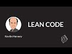

# 🚀 DevTernity 2019: Kevlin Henney - Lean Code (2019-12-20)

## Description

Lean has been applied as a toolkit to fine-tune development processes and organisational workflow, but what does it mean when we apply the practices to the detail of the code, the practices used to develop it and the people who develop it? What does Lean Code and its creation look like? There is a need to move beyond often separated worlds of software craft and agile development, to properly embrace code in its detail, but to also connect it more completely to the flow of business and the intelligence of people around it. To move beyond simple exhortations of clean code to something more human. This talk offers a fresh look at Lean principles and practices from the perspective of the code and the coder, rather than the usual scale of the organisation and the development process.

## Transcript

[0:00:00](https://youtu.be/-nWhH-4wWBU?t=0) [Music]  
[0:00:17](https://youtu.be/-nWhH-4wWBU?t=17) good morning good to be back what  
[0:00:21](https://youtu.be/-nWhH-4wWBU?t=21) happened to the snow last time I was  
[0:00:23](https://youtu.be/-nWhH-4wWBU?t=23) here there was snow what did you do with  
[0:00:25](https://youtu.be/-nWhH-4wWBU?t=25) it okay so what we're going to talk  
[0:00:28](https://youtu.be/-nWhH-4wWBU?t=28) about this morning is the Alps no lien  
[0:00:39](https://youtu.be/-nWhH-4wWBU?t=39) coat  
[0:00:40](https://youtu.be/-nWhH-4wWBU?t=40) the only realest Li the only reason that  
[0:00:44](https://youtu.be/-nWhH-4wWBU?t=44) there's I've got a picture of the Alps  
[0:00:46](https://youtu.be/-nWhH-4wWBU?t=46) Terrace it's the only photograph I had  
[0:00:48](https://youtu.be/-nWhH-4wWBU?t=48) that had something that leaned so sorry  
[0:00:51](https://youtu.be/-nWhH-4wWBU?t=51) terrible joke  
[0:00:55](https://youtu.be/-nWhH-4wWBU?t=55) so I want to talk about this from the  
[0:00:59](https://youtu.be/-nWhH-4wWBU?t=59) point of view of the developer and we've  
[0:01:01](https://youtu.be/-nWhH-4wWBU?t=61) got an idea of lean lean has been  
[0:01:03](https://youtu.be/-nWhH-4wWBU?t=63) kicking around as a term in software for  
[0:01:07](https://youtu.be/-nWhH-4wWBU?t=67) nearly 20 years and it dates back to  
[0:01:13](https://youtu.be/-nWhH-4wWBU?t=73) very much this book that Mary and Tom  
[0:01:19](https://youtu.be/-nWhH-4wWBU?t=79) poppendieck published in 2003 but this  
[0:01:24](https://youtu.be/-nWhH-4wWBU?t=84) was based on a previous paper published  
[0:01:27](https://youtu.be/-nWhH-4wWBU?t=87) in 2001 extended work that Mary in  
[0:01:31](https://youtu.be/-nWhH-4wWBU?t=91) particular had done from about the late  
[0:01:33](https://youtu.be/-nWhH-4wWBU?t=93) 90s onwards and what is interesting here  
[0:01:38](https://youtu.be/-nWhH-4wWBU?t=98) is you can notice there's a change of  
[0:01:39](https://youtu.be/-nWhH-4wWBU?t=99) terminology lean programming this is  
[0:01:42](https://youtu.be/-nWhH-4wWBU?t=102) around the time of the agile manifesto  
[0:01:44](https://youtu.be/-nWhH-4wWBU?t=104) just around that year and it's also the  
[0:01:48](https://youtu.be/-nWhH-4wWBU?t=108) time before everybody got I was gonna  
[0:01:51](https://youtu.be/-nWhH-4wWBU?t=111) say excited about scrum but I think  
[0:01:53](https://youtu.be/-nWhH-4wWBU?t=113) probably bored is the right term most  
[0:01:56](https://youtu.be/-nWhH-4wWBU?t=116) people hadn't heard of scrum at that  
[0:01:57](https://youtu.be/-nWhH-4wWBU?t=117) point the big buzz the big disrupter was  
[0:02:01](https://youtu.be/-nWhH-4wWBU?t=121) extreme programming okay the original XP  
[0:02:05](https://youtu.be/-nWhH-4wWBU?t=125) okay and so therefore putting the word  
[0:02:08](https://youtu.be/-nWhH-4wWBU?t=128) programming on something was kind of  
[0:02:10](https://youtu.be/-nWhH-4wWBU?t=130) cool so it started off as lean  
[0:02:11](https://youtu.be/-nWhH-4wWBU?t=131) programming rather lean software  
[0:02:13](https://youtu.be/-nWhH-4wWBU?t=133) development a Mary said recent work in  
[0:02:17](https://youtu.be/-nWhH-4wWBU?t=137) agile methodologies adaptive software  
[0:02:18](https://youtu.be/-nWhH-4wWBU?t=138) development extreme programming habit  
[0:02:20](https://youtu.be/-nWhH-4wWBU?t=140) effect applied simple rules of lean  
[0:02:22](https://youtu.be/-nWhH-4wWBU?t=142) manufacturing to software development  
[0:02:24](https://youtu.be/-nWhH-4wWBU?t=144) we need to be always very cautious when  
[0:02:27](https://youtu.be/-nWhH-4wWBU?t=147) we borrow metaphors from other  
[0:02:28](https://youtu.be/-nWhH-4wWBU?t=148) disciplines software development is not  
[0:02:31](https://youtu.be/-nWhH-4wWBU?t=151) really a manufacturing discipline or  
[0:02:33](https://youtu.be/-nWhH-4wWBU?t=153) rather yes it is that's what the build  
[0:02:35](https://youtu.be/-nWhH-4wWBU?t=155) process is for the bit that people do  
[0:02:38](https://youtu.be/-nWhH-4wWBU?t=158) that's not manufacturing okay we don't  
[0:02:40](https://youtu.be/-nWhH-4wWBU?t=160) carefully handcraft  
[0:02:43](https://youtu.be/-nWhH-4wWBU?t=163) the bits when people talk about software  
[0:02:44](https://youtu.be/-nWhH-4wWBU?t=164) craft that's not where they're doing  
[0:02:46](https://youtu.be/-nWhH-4wWBU?t=166) like here your personalized bits made in  
[0:02:48](https://youtu.be/-nWhH-4wWBU?t=168) Latvia the finest ones and zeros in all  
[0:02:50](https://youtu.be/-nWhH-4wWBU?t=170) of Europe  
[0:02:51](https://youtu.be/-nWhH-4wWBU?t=171) that's not a software craft that's not  
[0:02:53](https://youtu.be/-nWhH-4wWBU?t=173) what people are talking about the  
[0:02:56](https://youtu.be/-nWhH-4wWBU?t=176) results which we call lean programming  
[0:02:58](https://youtu.be/-nWhH-4wWBU?t=178) are as dramatic as the improvements in  
[0:02:59](https://youtu.be/-nWhH-4wWBU?t=179) manufacturing brought on by just in time  
[0:03:01](https://youtu.be/-nWhH-4wWBU?t=181) and total quality management movements  
[0:03:03](https://youtu.be/-nWhH-4wWBU?t=183) in the 1980s so this is kind of where it  
[0:03:07](https://youtu.be/-nWhH-4wWBU?t=187) started what mary was doing was looking  
[0:03:10](https://youtu.be/-nWhH-4wWBU?t=190) and saying what are these ideas from  
[0:03:12](https://youtu.be/-nWhH-4wWBU?t=192) this domain that I am familiar with  
[0:03:14](https://youtu.be/-nWhH-4wWBU?t=194) brought back to software and  
[0:03:16](https://youtu.be/-nWhH-4wWBU?t=196) interestingly there's this whole agile  
[0:03:18](https://youtu.be/-nWhH-4wWBU?t=198) space going on and she articulated seven  
[0:03:23](https://youtu.be/-nWhH-4wWBU?t=203) what she referred to as principles  
[0:03:25](https://youtu.be/-nWhH-4wWBU?t=205) eliminate waste build quality in create  
[0:03:28](https://youtu.be/-nWhH-4wWBU?t=208) knowledge defer commitment deliver fast  
[0:03:29](https://youtu.be/-nWhH-4wWBU?t=209) respect people optimize the whole now  
[0:03:34](https://youtu.be/-nWhH-4wWBU?t=214) these are described as principles but  
[0:03:36](https://youtu.be/-nWhH-4wWBU?t=216) actually if you I don't think they are  
[0:03:37](https://youtu.be/-nWhH-4wWBU?t=217) principles if you look at the names they  
[0:03:40](https://youtu.be/-nWhH-4wWBU?t=220) are more like directives they are  
[0:03:44](https://youtu.be/-nWhH-4wWBU?t=224) telling you what to do  
[0:03:45](https://youtu.be/-nWhH-4wWBU?t=225) and so I want to revisit these but I  
[0:03:49](https://youtu.be/-nWhH-4wWBU?t=229) want to revisit them actually with the  
[0:03:52](https://youtu.be/-nWhH-4wWBU?t=232) programmer perspective I want to revisit  
[0:03:54](https://youtu.be/-nWhH-4wWBU?t=234) them and what it means from the code to  
[0:03:57](https://youtu.be/-nWhH-4wWBU?t=237) the developer then to the bigger picture  
[0:03:59](https://youtu.be/-nWhH-4wWBU?t=239) because often lean is envisioned from  
[0:04:02](https://youtu.be/-nWhH-4wWBU?t=242) the bigger picture in words but  
[0:04:04](https://youtu.be/-nWhH-4wWBU?t=244) somewhere we stop the message and I'm  
[0:04:08](https://youtu.be/-nWhH-4wWBU?t=248) going to reframe this as a series of  
[0:04:09](https://youtu.be/-nWhH-4wWBU?t=249) goals simple one-word goals so I'm gonna  
[0:04:15](https://youtu.be/-nWhH-4wWBU?t=255) start with value I'm going to start with  
[0:04:17](https://youtu.be/-nWhH-4wWBU?t=257) value partly because it's the most  
[0:04:19](https://youtu.be/-nWhH-4wWBU?t=259) overused word that I find these days the  
[0:04:22](https://youtu.be/-nWhH-4wWBU?t=262) problem with the word value is you have  
[0:04:25](https://youtu.be/-nWhH-4wWBU?t=265) to quantify what you mean by it  
[0:04:27](https://youtu.be/-nWhH-4wWBU?t=267) you have to qualify what you mean by it  
[0:04:29](https://youtu.be/-nWhH-4wWBU?t=269) when people say you should be working on  
[0:04:31](https://youtu.be/-nWhH-4wWBU?t=271) something that has value that has no  
[0:04:35](https://youtu.be/-nWhH-4wWBU?t=275) meaning I mean it sounds good  
[0:04:36](https://youtu.be/-nWhH-4wWBU?t=276) it's  
[0:04:37](https://youtu.be/-nWhH-4wWBU?t=277) great and when people say we're going to  
[0:04:40](https://youtu.be/-nWhH-4wWBU?t=280) prioritize by value we're going to  
[0:04:43](https://youtu.be/-nWhH-4wWBU?t=283) prioritize our requirements by value  
[0:04:44](https://youtu.be/-nWhH-4wWBU?t=284) that's an entirely content-free  
[0:04:46](https://youtu.be/-nWhH-4wWBU?t=286) statement it has no meaning it sounds  
[0:04:49](https://youtu.be/-nWhH-4wWBU?t=289) great it makes you feel good but you  
[0:04:51](https://youtu.be/-nWhH-4wWBU?t=291) need to figure out what does it actually  
[0:04:52](https://youtu.be/-nWhH-4wWBU?t=292) mean so the first question you always  
[0:04:57](https://youtu.be/-nWhH-4wWBU?t=297) have to ask is value for whom who is it  
[0:05:01](https://youtu.be/-nWhH-4wWBU?t=301) a value to is it a value to the  
[0:05:04](https://youtu.be/-nWhH-4wWBU?t=304) developer is it a value to the team is  
[0:05:07](https://youtu.be/-nWhH-4wWBU?t=307) it a value to the organization is it a  
[0:05:09](https://youtu.be/-nWhH-4wWBU?t=309) value to the manager of the team but to  
[0:05:12](https://youtu.be/-nWhH-4wWBU?t=312) nobody else that one happens is it a  
[0:05:16](https://youtu.be/-nWhH-4wWBU?t=316) value to the user we really don't ask  
[0:05:18](https://youtu.be/-nWhH-4wWBU?t=318) that often enough is it a value to  
[0:05:22](https://youtu.be/-nWhH-4wWBU?t=322) society okay  
[0:05:24](https://youtu.be/-nWhH-4wWBU?t=324) and when we say is it of value I mean  
[0:05:27](https://youtu.be/-nWhH-4wWBU?t=327) what are the things that you value  
[0:05:28](https://youtu.be/-nWhH-4wWBU?t=328) normally when you ask people name me the  
[0:05:31](https://youtu.be/-nWhH-4wWBU?t=331) things that you value money is not one  
[0:05:33](https://youtu.be/-nWhH-4wWBU?t=333) of them they normally talk about their  
[0:05:35](https://youtu.be/-nWhH-4wWBU?t=335) family and things like that so you see  
[0:05:37](https://youtu.be/-nWhH-4wWBU?t=337) this word has huge variants huge range  
[0:05:40](https://youtu.be/-nWhH-4wWBU?t=340) and then when we talk about value we  
[0:05:43](https://youtu.be/-nWhH-4wWBU?t=343) need to think about something else over  
[0:05:45](https://youtu.be/-nWhH-4wWBU?t=345) what period okay over what period is  
[0:05:49](https://youtu.be/-nWhH-4wWBU?t=349) something valuable is it a short-term  
[0:05:51](https://youtu.be/-nWhH-4wWBU?t=351) gain or is it a long-term gain you see  
[0:05:53](https://youtu.be/-nWhH-4wWBU?t=353) the word value is far more complex than  
[0:05:56](https://youtu.be/-nWhH-4wWBU?t=356) it suggests otherwise you end up with  
[0:05:58](https://youtu.be/-nWhH-4wWBU?t=358) really very shallow most people end up  
[0:06:00](https://youtu.be/-nWhH-4wWBU?t=360) with this kind of interpretation yes the  
[0:06:02](https://youtu.be/-nWhH-4wWBU?t=362) planet got destroyed but for a beautiful  
[0:06:04](https://youtu.be/-nWhH-4wWBU?t=364) moment in time we created a lot of value  
[0:06:06](https://youtu.be/-nWhH-4wWBU?t=366) for shareholders the point there is that  
[0:06:09](https://youtu.be/-nWhH-4wWBU?t=369) value is that the value that you're  
[0:06:11](https://youtu.be/-nWhH-4wWBU?t=371) pursuing I have no idea so when somebody  
[0:06:14](https://youtu.be/-nWhH-4wWBU?t=374) says value you really need to push hard  
[0:06:18](https://youtu.be/-nWhH-4wWBU?t=378) to understand what you mean so in this  
[0:06:20](https://youtu.be/-nWhH-4wWBU?t=380) sense value is not simply a goal it is  
[0:06:22](https://youtu.be/-nWhH-4wWBU?t=382) also a question and that's why I start  
[0:06:24](https://youtu.be/-nWhH-4wWBU?t=384) with it you need to figure out what you  
[0:06:26](https://youtu.be/-nWhH-4wWBU?t=386) mean the value for you the value for  
[0:06:29](https://youtu.be/-nWhH-4wWBU?t=389) your team the value for the customer  
[0:06:31](https://youtu.be/-nWhH-4wWBU?t=391) what period of value are you looking at  
[0:06:34](https://youtu.be/-nWhH-4wWBU?t=394) short termism or long term ism this also  
[0:06:37](https://youtu.be/-nWhH-4wWBU?t=397) gets us to question as developers many  
[0:06:40](https://youtu.be/-nWhH-4wWBU?t=400) of the frameworks that we work within  
[0:06:43](https://youtu.be/-nWhH-4wWBU?t=403) and what I mean by frameworks I'm not  
[0:06:45](https://youtu.be/-nWhH-4wWBU?t=405) talking about you know  
[0:06:47](https://youtu.be/-nWhH-4wWBU?t=407) honestly since the time I started  
[0:06:49](https://youtu.be/-nWhH-4wWBU?t=409) talking somebody's probably released a  
[0:06:50](https://youtu.be/-nWhH-4wWBU?t=410) new JavaScript framework you know that's  
[0:06:54](https://youtu.be/-nWhH-4wWBU?t=414) not the kind of framework I'm talking  
[0:06:55](https://youtu.be/-nWhH-4wWBU?t=415) about I'm talking about business  
[0:06:55](https://youtu.be/-nWhH-4wWBU?t=415) framework there is this idea of what is  
[0:07:00](https://youtu.be/-nWhH-4wWBU?t=420) the concept that you are working with  
[0:07:03](https://youtu.be/-nWhH-4wWBU?t=423) what do you value as an organization all  
[0:07:07](https://youtu.be/-nWhH-4wWBU?t=427) of these questions so you need to ask  
[0:07:10](https://youtu.be/-nWhH-4wWBU?t=430) that question and when you start talking  
[0:07:14](https://youtu.be/-nWhH-4wWBU?t=434) about things there's another thing  
[0:07:16](https://youtu.be/-nWhH-4wWBU?t=436) you've got to deal with the code and it  
[0:07:19](https://youtu.be/-nWhH-4wWBU?t=439) turns out that many organizations seem  
[0:07:22](https://youtu.be/-nWhH-4wWBU?t=442) to believe that they are being paid for  
[0:07:25](https://youtu.be/-nWhH-4wWBU?t=445) the line of code at least that's the  
[0:07:27](https://youtu.be/-nWhH-4wWBU?t=447) only way I can explain how there's so  
[0:07:29](https://youtu.be/-nWhH-4wWBU?t=449) much code that does so little ok the  
[0:07:32](https://youtu.be/-nWhH-4wWBU?t=452) amount of value per line of code  
[0:07:36](https://youtu.be/-nWhH-4wWBU?t=456) decreases hugely as a system gets old as  
[0:07:40](https://youtu.be/-nWhH-4wWBU?t=460) a system has work done to it unless  
[0:07:42](https://youtu.be/-nWhH-4wWBU?t=462) somebody puts particular effort they  
[0:07:46](https://youtu.be/-nWhH-4wWBU?t=466) will end up diluting the value of the  
[0:07:49](https://youtu.be/-nWhH-4wWBU?t=469) code so directly from the developer  
[0:07:51](https://youtu.be/-nWhH-4wWBU?t=471) point of view what is the value of this  
[0:07:54](https://youtu.be/-nWhH-4wWBU?t=474) line of code put simply I'm going to  
[0:07:58](https://youtu.be/-nWhH-4wWBU?t=478) travel back in time a couple of thousand  
[0:07:59](https://youtu.be/-nWhH-4wWBU?t=479) years this is not the only Latin in this  
[0:08:02](https://youtu.be/-nWhH-4wWBU?t=482) talk okay these are three qualities of a  
[0:08:08](https://youtu.be/-nWhH-4wWBU?t=488) building that  
[0:08:10](https://youtu.be/-nWhH-4wWBU?t=490) Vitruvius Roman architect described in  
[0:08:15](https://youtu.be/-nWhH-4wWBU?t=495) his volumes de architectura on  
[0:08:17](https://youtu.be/-nWhH-4wWBU?t=497) architecture fermitas  
[0:08:19](https://youtu.be/-nWhH-4wWBU?t=499) who Tillet ass venustas firm it s  
[0:08:24](https://youtu.be/-nWhH-4wWBU?t=504) firmness strength robustness utility s  
[0:08:29](https://youtu.be/-nWhH-4wWBU?t=509) utility usefulness value Venice das  
[0:08:36](https://youtu.be/-nWhH-4wWBU?t=516) Venus the goddess of beauty is it  
[0:08:40](https://youtu.be/-nWhH-4wWBU?t=520) beautiful that's kind of an interesting  
[0:08:42](https://youtu.be/-nWhH-4wWBU?t=522) question to ask about code I'm not going  
[0:08:44](https://youtu.be/-nWhH-4wWBU?t=524) to answer that today but we'll get close  
[0:08:46](https://youtu.be/-nWhH-4wWBU?t=526) so I just want to concentrate on your  
[0:08:48](https://youtu.be/-nWhH-4wWBU?t=528) tinnitus the very minimum that we should  
[0:08:53](https://youtu.be/-nWhH-4wWBU?t=533) be expecting when we are looking at our  
[0:08:54](https://youtu.be/-nWhH-4wWBU?t=534) code is that it has utility it is useful  
[0:08:57](https://youtu.be/-nWhH-4wWBU?t=537) it solves a problem  
[0:09:00](https://youtu.be/-nWhH-4wWBU?t=540) code is there because somebody needs  
[0:09:03](https://youtu.be/-nWhH-4wWBU?t=543) something from it and that somebody  
[0:09:05](https://youtu.be/-nWhH-4wWBU?t=545) could be another piece of code another  
[0:09:07](https://youtu.be/-nWhH-4wWBU?t=547) piece of code or an end user in other  
[0:09:11](https://youtu.be/-nWhH-4wWBU?t=551) words this has a job to do  
[0:09:13](https://youtu.be/-nWhH-4wWBU?t=553) it is useful that's a very hard thing to  
[0:09:17](https://youtu.be/-nWhH-4wWBU?t=557) do we have a real problem with most  
[0:09:19](https://youtu.be/-nWhH-4wWBU?t=559) systems it's not just verbose code it's  
[0:09:22](https://youtu.be/-nWhH-4wWBU?t=562) not just code that is very long-winded  
[0:09:26](https://youtu.be/-nWhH-4wWBU?t=566) because sometimes what happens is people  
[0:09:28](https://youtu.be/-nWhH-4wWBU?t=568) I don't think people necessarily sit  
[0:09:30](https://youtu.be/-nWhH-4wWBU?t=570) down and say you know what I'm gonna  
[0:09:32](https://youtu.be/-nWhH-4wWBU?t=572) write some really long-winded code today  
[0:09:34](https://youtu.be/-nWhH-4wWBU?t=574) I'm just gonna I could take one line but  
[0:09:36](https://youtu.be/-nWhH-4wWBU?t=576) I'm gonna write 20 I'm gonna take the  
[0:09:39](https://youtu.be/-nWhH-4wWBU?t=579) simple idea and turn it into something  
[0:09:41](https://youtu.be/-nWhH-4wWBU?t=581) complex I don't think people sit down  
[0:09:42](https://youtu.be/-nWhH-4wWBU?t=582) with that objective but what happens is  
[0:09:46](https://youtu.be/-nWhH-4wWBU?t=586) that we are often caught in a trap where  
[0:09:49](https://youtu.be/-nWhH-4wWBU?t=589) our first idea when you're playing  
[0:09:51](https://youtu.be/-nWhH-4wWBU?t=591) around with ideas you don't yet know  
[0:09:53](https://youtu.be/-nWhH-4wWBU?t=593) what that idea looks like and we are not  
[0:09:56](https://youtu.be/-nWhH-4wWBU?t=596) very good at that question of coming  
[0:09:59](https://youtu.be/-nWhH-4wWBU?t=599) back to the thing we write the first  
[0:10:01](https://youtu.be/-nWhH-4wWBU?t=601) thing it seems to work and then we check  
[0:10:04](https://youtu.be/-nWhH-4wWBU?t=604) it in and when we say it works what do  
[0:10:08](https://youtu.be/-nWhH-4wWBU?t=608) we actually mean when you run it it  
[0:10:11](https://youtu.be/-nWhH-4wWBU?t=611) doesn't do something unexpected that's a  
[0:10:14](https://youtu.be/-nWhH-4wWBU?t=614) very shallow definition of it works does  
[0:10:17](https://youtu.be/-nWhH-4wWBU?t=617) it work for the business does it work  
[0:10:20](https://youtu.be/-nWhH-4wWBU?t=620) for future developers oh no this is  
[0:10:24](https://youtu.be/-nWhH-4wWBU?t=624) really bad it's like the first thing I  
[0:10:25](https://youtu.be/-nWhH-4wWBU?t=625) thought of maybe I should do something  
[0:10:27](https://youtu.be/-nWhH-4wWBU?t=627) with it  
[0:10:27](https://youtu.be/-nWhH-4wWBU?t=627) we need to be of the idea that our code  
[0:10:31](https://youtu.be/-nWhH-4wWBU?t=631) is not permanent that we are able to  
[0:10:33](https://youtu.be/-nWhH-4wWBU?t=633) update as our knowledge updates I'm  
[0:10:35](https://youtu.be/-nWhH-4wWBU?t=635) going to come back to knowledge the  
[0:10:37](https://youtu.be/-nWhH-4wWBU?t=637) other thing is you know what you got to  
[0:10:40](https://youtu.be/-nWhH-4wWBU?t=640) get rid of dead code I gave a talk here  
[0:10:42](https://youtu.be/-nWhH-4wWBU?t=642) two years ago the error of our ways I  
[0:10:45](https://youtu.be/-nWhH-4wWBU?t=645) had a whole section devoted to how much  
[0:10:48](https://youtu.be/-nWhH-4wWBU?t=648) money has been lost through dead code  
[0:10:52](https://youtu.be/-nWhH-4wWBU?t=652) that I know of Oh billions pick a  
[0:10:56](https://youtu.be/-nWhH-4wWBU?t=656) currency doesn't matter billions simply  
[0:11:00](https://youtu.be/-nWhH-4wWBU?t=660) because of dead code so when somebody  
[0:11:02](https://youtu.be/-nWhH-4wWBU?t=662) says all that dead code it doesn't  
[0:11:03](https://youtu.be/-nWhH-4wWBU?t=663) matter it'll never get executed if it  
[0:11:07](https://youtu.be/-nWhH-4wWBU?t=667) doesn't get executed what's it doing  
[0:11:08](https://youtu.be/-nWhH-4wWBU?t=668) there it has no value but there's always  
[0:11:11](https://youtu.be/-nWhH-4wWBU?t=671) this thing there's a kind of a  
[0:11:14](https://youtu.be/-nWhH-4wWBU?t=674) developer arrogance we don't need to  
[0:11:16](https://youtu.be/-nWhH-4wWBU?t=676) worry about that I know it will never  
[0:11:18](https://youtu.be/-nWhH-4wWBU?t=678) get executed do you know it or do you  
[0:11:20](https://youtu.be/-nWhH-4wWBU?t=680) just believe it what happens if it's not  
[0:11:23](https://youtu.be/-nWhH-4wWBU?t=683) actually well dead what happens if you  
[0:11:27](https://youtu.be/-nWhH-4wWBU?t=687) end up with the zombie apocalypse and it  
[0:11:29](https://youtu.be/-nWhH-4wWBU?t=689) comes back to life  
[0:11:31](https://youtu.be/-nWhH-4wWBU?t=691) that's where rockets explode where  
[0:11:34](https://youtu.be/-nWhH-4wWBU?t=694) companies go out of business because  
[0:11:36](https://youtu.be/-nWhH-4wWBU?t=696) they trade in the wrong way against the  
[0:11:38](https://youtu.be/-nWhH-4wWBU?t=698) wrong model of the market there are so  
[0:11:41](https://youtu.be/-nWhH-4wWBU?t=701) many stories about this dead code has a  
[0:11:43](https://youtu.be/-nWhH-4wWBU?t=703) value and the value is negative yeah  
[0:11:47](https://youtu.be/-nWhH-4wWBU?t=707) it's not a hard thing to do you don't  
[0:11:49](https://youtu.be/-nWhH-4wWBU?t=709) even need strong refactoring tools what  
[0:11:52](https://youtu.be/-nWhH-4wWBU?t=712) you tend to find is culture and mindset  
[0:11:55](https://youtu.be/-nWhH-4wWBU?t=715) because oh we're we can't delete it  
[0:11:56](https://youtu.be/-nWhH-4wWBU?t=716) because we don't know of anybody uses it  
[0:11:59](https://youtu.be/-nWhH-4wWBU?t=719) now you've just told me something about  
[0:12:01](https://youtu.be/-nWhH-4wWBU?t=721) how much you know about your code you're  
[0:12:04](https://youtu.be/-nWhH-4wWBU?t=724) you're basically saying we have no idea  
[0:12:05](https://youtu.be/-nWhH-4wWBU?t=725) what's happening with our code our code  
[0:12:08](https://youtu.be/-nWhH-4wWBU?t=728) is insecure because we don't know what  
[0:12:10](https://youtu.be/-nWhH-4wWBU?t=730) it does our code is unsafe because we  
[0:12:12](https://youtu.be/-nWhH-4wWBU?t=732) don't know what it does that is very  
[0:12:14](https://youtu.be/-nWhH-4wWBU?t=734) telling that's where we need to focus so  
[0:12:16](https://youtu.be/-nWhH-4wWBU?t=736) therefore we don't need to just think  
[0:12:18](https://youtu.be/-nWhH-4wWBU?t=738) about adding code I find very few very  
[0:12:22](https://youtu.be/-nWhH-4wWBU?t=742) few books or very few blogs and very few  
[0:12:24](https://youtu.be/-nWhH-4wWBU?t=744) discussions people ever talk about how  
[0:12:27](https://youtu.be/-nWhH-4wWBU?t=747) they retire the code they spend a lot of  
[0:12:28](https://youtu.be/-nWhH-4wWBU?t=748) time talking about oh we generates this  
[0:12:30](https://youtu.be/-nWhH-4wWBU?t=750) or we do this and we add this and when  
[0:12:33](https://youtu.be/-nWhH-4wWBU?t=753) you want to add this and when you want  
[0:12:35](https://youtu.be/-nWhH-4wWBU?t=755) to refactor this to add this there's  
[0:12:38](https://youtu.be/-nWhH-4wWBU?t=758) lots of addition  
[0:12:39](https://youtu.be/-nWhH-4wWBU?t=759) but life is made up of two ends what is  
[0:12:44](https://youtu.be/-nWhH-4wWBU?t=764) the natural life cycle of your code  
[0:12:46](https://youtu.be/-nWhH-4wWBU?t=766) under what circumstances do you remove  
[0:12:49](https://youtu.be/-nWhH-4wWBU?t=769) it now this is not a new idea we  
[0:12:51](https://youtu.be/-nWhH-4wWBU?t=771) actually have it you can see it in  
[0:12:53](https://youtu.be/-nWhH-4wWBU?t=773) networking software you can see in  
[0:12:55](https://youtu.be/-nWhH-4wWBU?t=775) network protocols they have a time to  
[0:12:57](https://youtu.be/-nWhH-4wWBU?t=777) live TTL so that dead packets don't  
[0:12:59](https://youtu.be/-nWhH-4wWBU?t=779) dominate your network we have this in  
[0:13:03](https://youtu.be/-nWhH-4wWBU?t=783) things that we build this is not simply  
[0:13:05](https://youtu.be/-nWhH-4wWBU?t=785) a consequence of life credit cards have  
[0:13:08](https://youtu.be/-nWhH-4wWBU?t=788) expiry dates sometimes it is a matter of  
[0:13:11](https://youtu.be/-nWhH-4wWBU?t=791) life yogurt has an expiry date you know  
[0:13:14](https://youtu.be/-nWhH-4wWBU?t=794) unless you want to create new life I  
[0:13:16](https://youtu.be/-nWhH-4wWBU?t=796) suggest you respect it but that's the  
[0:13:19](https://youtu.be/-nWhH-4wWBU?t=799) point we have this idea that everything  
[0:13:22](https://youtu.be/-nWhH-4wWBU?t=802) has a life cycle except  
[0:13:25](https://youtu.be/-nWhH-4wWBU?t=805) dude we're really bad at this and we  
[0:13:28](https://youtu.be/-nWhH-4wWBU?t=808) kind of slowly but surely started  
[0:13:31](https://youtu.be/-nWhH-4wWBU?t=811) acknowledging that this may be a thing  
[0:13:33](https://youtu.be/-nWhH-4wWBU?t=813) but that's just a little tag that's not  
[0:13:36](https://youtu.be/-nWhH-4wWBU?t=816) a philosophy that's not a we as a team  
[0:13:39](https://youtu.be/-nWhH-4wWBU?t=819) have a process and a philosophy for how  
[0:13:42](https://youtu.be/-nWhH-4wWBU?t=822) we retire code and how we retire  
[0:13:44](https://youtu.be/-nWhH-4wWBU?t=824) features yeah death is a part of life  
[0:13:47](https://youtu.be/-nWhH-4wWBU?t=827) death is a part of product development  
[0:13:49](https://youtu.be/-nWhH-4wWBU?t=829) projects don't worry about death  
[0:13:51](https://youtu.be/-nWhH-4wWBU?t=831) products have to that's a really  
[0:13:54](https://youtu.be/-nWhH-4wWBU?t=834) important part okay in other words if  
[0:13:56](https://youtu.be/-nWhH-4wWBU?t=836) you have an entity it stays alive  
[0:13:59](https://youtu.be/-nWhH-4wWBU?t=839) because the things that it is made of  
[0:14:01](https://youtu.be/-nWhH-4wWBU?t=841) have a natural life cycle that is  
[0:14:03](https://youtu.be/-nWhH-4wWBU?t=843) shorter I am not the same person that I  
[0:14:05](https://youtu.be/-nWhH-4wWBU?t=845) was when I was born okay I might share a  
[0:14:08](https://youtu.be/-nWhH-4wWBU?t=848) few molecules but mostly is new  
[0:14:11](https://youtu.be/-nWhH-4wWBU?t=851) disappointing  
[0:14:14](https://youtu.be/-nWhH-4wWBU?t=854) so we keep talking about incremental  
[0:14:17](https://youtu.be/-nWhH-4wWBU?t=857) development we need to talk a little  
[0:14:19](https://youtu.be/-nWhH-4wWBU?t=859) more about decremental development but  
[0:14:22](https://youtu.be/-nWhH-4wWBU?t=862) there's a lot of things here that  
[0:14:24](https://youtu.be/-nWhH-4wWBU?t=864) overlap in another area that push us  
[0:14:26](https://youtu.be/-nWhH-4wWBU?t=866) into another thing quality finally this  
[0:14:30](https://youtu.be/-nWhH-4wWBU?t=870) was one of with this is a word that when  
[0:14:33](https://youtu.be/-nWhH-4wWBU?t=873) I got into software development people  
[0:14:35](https://youtu.be/-nWhH-4wWBU?t=875) use the word quality a lot more not  
[0:14:39](https://youtu.be/-nWhH-4wWBU?t=879) because they had it but mostly because  
[0:14:40](https://youtu.be/-nWhH-4wWBU?t=880) they didn't have it I'm not saying that  
[0:14:42](https://youtu.be/-nWhH-4wWBU?t=882) the stuff we do now is necessarily  
[0:14:44](https://youtu.be/-nWhH-4wWBU?t=884) better or worse but the conversations  
[0:14:46](https://youtu.be/-nWhH-4wWBU?t=886) specifically using that word as opposed  
[0:14:49](https://youtu.be/-nWhH-4wWBU?t=889) to anything else we're much stronger and  
[0:14:53](https://youtu.be/-nWhH-4wWBU?t=893) so quality covers many things I'm going  
[0:14:57](https://youtu.be/-nWhH-4wWBU?t=897) to focus initially on the idea of simply  
[0:15:00](https://youtu.be/-nWhH-4wWBU?t=900) robustness it works it doesn't fall over  
[0:15:04](https://youtu.be/-nWhH-4wWBU?t=904) that's a kind of basic requirement it  
[0:15:07](https://youtu.be/-nWhH-4wWBU?t=907) works as expected not only does it work  
[0:15:10](https://youtu.be/-nWhH-4wWBU?t=910) as expected but we it doesn't have nasty  
[0:15:13](https://youtu.be/-nWhH-4wWBU?t=913) side effects when we do things that are  
[0:15:15](https://youtu.be/-nWhH-4wWBU?t=915) stupid because guess what we are human  
[0:15:17](https://youtu.be/-nWhH-4wWBU?t=917) well I am pretty sure most of you are  
[0:15:21](https://youtu.be/-nWhH-4wWBU?t=921) but here's an interesting thing when we  
[0:15:24](https://youtu.be/-nWhH-4wWBU?t=924) talk about robustness I want to about  
[0:15:27](https://youtu.be/-nWhH-4wWBU?t=927) the quality of the code itself as an  
[0:15:30](https://youtu.be/-nWhH-4wWBU?t=930) entity and this is an interesting one  
[0:15:33](https://youtu.be/-nWhH-4wWBU?t=933) because this takes us into the territory  
[0:15:35](https://youtu.be/-nWhH-4wWBU?t=935) of things like technical debt  
[0:15:38](https://youtu.be/-nWhH-4wWBU?t=938) and what I found recently was an  
[0:15:42](https://youtu.be/-nWhH-4wWBU?t=942) interesting way of looking at it because  
[0:15:43](https://youtu.be/-nWhH-4wWBU?t=943) sometimes the technical debt is probably  
[0:15:46](https://youtu.be/-nWhH-4wWBU?t=946) one of the most accessible metaphors  
[0:15:49](https://youtu.be/-nWhH-4wWBU?t=949) that we have for trying to reason about  
[0:15:52](https://youtu.be/-nWhH-4wWBU?t=952) code and the problems we might have  
[0:15:54](https://youtu.be/-nWhH-4wWBU?t=954) within it  
[0:15:55](https://youtu.be/-nWhH-4wWBU?t=955) now when Ward Cunningham introduced the  
[0:15:57](https://youtu.be/-nWhH-4wWBU?t=957) term technical debt in 1992 he did not  
[0:16:00](https://youtu.be/-nWhH-4wWBU?t=960) imagine that people would run up huge  
[0:16:02](https://youtu.be/-nWhH-4wWBU?t=962) amounts of it intentionally the problem  
[0:16:06](https://youtu.be/-nWhH-4wWBU?t=966) is it turns out people have very  
[0:16:07](https://youtu.be/-nWhH-4wWBU?t=967) different relationships with debt for  
[0:16:09](https://youtu.be/-nWhH-4wWBU?t=969) some people for example credit card debt  
[0:16:12](https://youtu.be/-nWhH-4wWBU?t=972) for some people they pay back their  
[0:16:14](https://youtu.be/-nWhH-4wWBU?t=974) credit cards every month I think Ward is  
[0:16:17](https://youtu.be/-nWhH-4wWBU?t=977) one of those people for some people a  
[0:16:21](https://youtu.be/-nWhH-4wWBU?t=981) credit card is magic money with a bit of  
[0:16:25](https://youtu.be/-nWhH-4wWBU?t=985) inconvenience attached and so therefore  
[0:16:28](https://youtu.be/-nWhH-4wWBU?t=988) running up a debt is not a bad thing I  
[0:16:31](https://youtu.be/-nWhH-4wWBU?t=991) remember discussing with you know over  
[0:16:34](https://youtu.be/-nWhH-4wWBU?t=994) here well discussing it with a group of  
[0:16:36](https://youtu.be/-nWhH-4wWBU?t=996) people who are from startups a number of  
[0:16:39](https://youtu.be/-nWhH-4wWBU?t=999) years ago there were two people who were  
[0:16:42](https://youtu.be/-nWhH-4wWBU?t=1002) talking about their burn rate and this  
[0:16:44](https://youtu.be/-nWhH-4wWBU?t=1004) is financial debt not technical debt and  
[0:16:46](https://youtu.be/-nWhH-4wWBU?t=1006) it was kind of like a pissing contest  
[0:16:49](https://youtu.be/-nWhH-4wWBU?t=1009) who is burning up the most investor  
[0:16:52](https://youtu.be/-nWhH-4wWBU?t=1012) money who is creating the bigger debt  
[0:16:56](https://youtu.be/-nWhH-4wWBU?t=1016) financially that was a mark of  
[0:16:59](https://youtu.be/-nWhH-4wWBU?t=1019) achievement the problem is that some  
[0:17:01](https://youtu.be/-nWhH-4wWBU?t=1021) people regard that regard technical debt  
[0:17:03](https://youtu.be/-nWhH-4wWBU?t=1023) as a mark of achievement no that's not  
[0:17:06](https://youtu.be/-nWhH-4wWBU?t=1026) why  
[0:17:07](https://youtu.be/-nWhH-4wWBU?t=1027) Ward originally introduced it he  
[0:17:09](https://youtu.be/-nWhH-4wWBU?t=1029) introduced it for a very different  
[0:17:11](https://youtu.be/-nWhH-4wWBU?t=1031) reason it's the idea that you are able  
[0:17:13](https://youtu.be/-nWhH-4wWBU?t=1033) to temporarily get an advantage as long  
[0:17:16](https://youtu.be/-nWhH-4wWBU?t=1036) as you pay something back and it's the  
[0:17:18](https://youtu.be/-nWhH-4wWBU?t=1038) paying back remember I said the thing  
[0:17:20](https://youtu.be/-nWhH-4wWBU?t=1040) about death there's two events there's  
[0:17:22](https://youtu.be/-nWhH-4wWBU?t=1042) creation and then there's destruction or  
[0:17:25](https://youtu.be/-nWhH-4wWBU?t=1045) removal addition removal we make the  
[0:17:28](https://youtu.be/-nWhH-4wWBU?t=1048) debt we pay the debt we seem to be  
[0:17:30](https://youtu.be/-nWhH-4wWBU?t=1050) really good at this site this side not  
[0:17:32](https://youtu.be/-nWhH-4wWBU?t=1052) so much but sometimes people say always  
[0:17:36](https://youtu.be/-nWhH-4wWBU?t=1056) just a technical debt problem or we've  
[0:17:37](https://youtu.be/-nWhH-4wWBU?t=1057) got technical debt let's go back to  
[0:17:39](https://youtu.be/-nWhH-4wWBU?t=1059) worrying about what the customer wants I  
[0:17:41](https://youtu.be/-nWhH-4wWBU?t=1061) want you to go to the customer and say  
[0:17:42](https://youtu.be/-nWhH-4wWBU?t=1062) you have never seen the codebase like  
[0:17:44](https://youtu.be/-nWhH-4wWBU?t=1064) ass do you you know let me tell you all  
[0:17:48](https://youtu.be/-nWhH-4wWBU?t=1068) the problems with it anyway what did you  
[0:17:50](https://youtu.be/-nWhH-4wWBU?t=1070) want again your features  
[0:17:52](https://youtu.be/-nWhH-4wWBU?t=1072) are they really important do you want us  
[0:17:54](https://youtu.be/-nWhH-4wWBU?t=1074) to deliver features next year as well or  
[0:17:56](https://youtu.be/-nWhH-4wWBU?t=1076) the year after whenever people tell me  
[0:17:59](https://youtu.be/-nWhH-4wWBU?t=1079) oh the customer never wants us to pay  
[0:18:01](https://youtu.be/-nWhH-4wWBU?t=1081) back technical debt I think that's a  
[0:18:03](https://youtu.be/-nWhH-4wWBU?t=1083) little bit dishonest very few people  
[0:18:05](https://youtu.be/-nWhH-4wWBU?t=1085) have ever gone to a customer and said  
[0:18:07](https://youtu.be/-nWhH-4wWBU?t=1087) this is what this is going to cost this  
[0:18:09](https://youtu.be/-nWhH-4wWBU?t=1089) is what this is going to mean in six  
[0:18:11](https://youtu.be/-nWhH-4wWBU?t=1091) months twelve months two years three  
[0:18:12](https://youtu.be/-nWhH-4wWBU?t=1092) years that's what it's going to me when  
[0:18:16](https://youtu.be/-nWhH-4wWBU?t=1096) you tell people this is their repayment  
[0:18:17](https://youtu.be/-nWhH-4wWBU?t=1097) sense if when you tell people you know  
[0:18:21](https://youtu.be/-nWhH-4wWBU?t=1101) that loan you took out we're going to  
[0:18:24](https://youtu.be/-nWhH-4wWBU?t=1104) send people round with baseball bats to  
[0:18:27](https://youtu.be/-nWhH-4wWBU?t=1107) recover it and that is your cost that's  
[0:18:30](https://youtu.be/-nWhH-4wWBU?t=1110) the issue technical debt is also not  
[0:18:32](https://youtu.be/-nWhH-4wWBU?t=1112) just that issue it has other  
[0:18:34](https://youtu.be/-nWhH-4wWBU?t=1114) consequences technical debt is something  
[0:18:38](https://youtu.be/-nWhH-4wWBU?t=1118) that will lead to staff problems why do  
[0:18:41](https://youtu.be/-nWhH-4wWBU?t=1121) people want to work in that if they have  
[0:18:43](https://youtu.be/-nWhH-4wWBU?t=1123) a choice if people don't have a choice  
[0:18:44](https://youtu.be/-nWhH-4wWBU?t=1124) they don't have a choice but if they  
[0:18:46](https://youtu.be/-nWhH-4wWBU?t=1126) feel they have a choice to move  
[0:18:47](https://youtu.be/-nWhH-4wWBU?t=1127) elsewhere they will it also has some  
[0:18:50](https://youtu.be/-nWhH-4wWBU?t=1130) really interesting implications for  
[0:18:51](https://youtu.be/-nWhH-4wWBU?t=1131) security because what you're saying when  
[0:18:54](https://youtu.be/-nWhH-4wWBU?t=1134) you say technical debt you're basically  
[0:18:56](https://youtu.be/-nWhH-4wWBU?t=1136) saying we have no idea what I code does  
[0:18:57](https://youtu.be/-nWhH-4wWBU?t=1137) or there are bits of our code that we  
[0:19:00](https://youtu.be/-nWhH-4wWBU?t=1140) don't properly understand there are bits  
[0:19:02](https://youtu.be/-nWhH-4wWBU?t=1142) of our code base that we do not properly  
[0:19:04](https://youtu.be/-nWhH-4wWBU?t=1144) control anyway by the way our system is  
[0:19:06](https://youtu.be/-nWhH-4wWBU?t=1146) very secure those two statements do not  
[0:19:09](https://youtu.be/-nWhH-4wWBU?t=1149) live in the same sentence okay security  
[0:19:13](https://youtu.be/-nWhH-4wWBU?t=1153) part of it is knowledge compliance  
[0:19:16](https://youtu.be/-nWhH-4wWBU?t=1156) defects all of these things are related  
[0:19:18](https://youtu.be/-nWhH-4wWBU?t=1158) to this so there's a deeper case here  
[0:19:24](https://youtu.be/-nWhH-4wWBU?t=1164) one of the oldest pieces of advice that  
[0:19:27](https://youtu.be/-nWhH-4wWBU?t=1167) still survives from tangents guide to  
[0:19:29](https://youtu.be/-nWhH-4wWBU?t=1169) designing programs is this remember  
[0:19:31](https://youtu.be/-nWhH-4wWBU?t=1171) there is no code faster the net than no  
[0:19:33](https://youtu.be/-nWhH-4wWBU?t=1173) code it is one of the simplest things to  
[0:19:34](https://youtu.be/-nWhH-4wWBU?t=1174) optimize sometimes removing something is  
[0:19:38](https://youtu.be/-nWhH-4wWBU?t=1178) the thing that gives you the performance  
[0:19:39](https://youtu.be/-nWhH-4wWBU?t=1179) now I've worked with worked with a  
[0:19:42](https://youtu.be/-nWhH-4wWBU?t=1182) number of teams over the years and  
[0:19:44](https://youtu.be/-nWhH-4wWBU?t=1184) sometimes performance improvements are  
[0:19:47](https://youtu.be/-nWhH-4wWBU?t=1187) let's add complexity let's handle  
[0:19:49](https://youtu.be/-nWhH-4wWBU?t=1189) special cases sometimes it's let's get  
[0:19:52](https://youtu.be/-nWhH-4wWBU?t=1192) rid of special cases it's not always an  
[0:19:54](https://youtu.be/-nWhH-4wWBU?t=1194) addition sometimes it's actually removal  
[0:19:57](https://youtu.be/-nWhH-4wWBU?t=1197) sometimes it is actually asking the hard  
[0:19:58](https://youtu.be/-nWhH-4wWBU?t=1198) question it's saying do we actually need  
[0:20:00](https://youtu.be/-nWhH-4wWBU?t=1200) this and when you get rid of it suddenly  
[0:20:03](https://youtu.be/-nWhH-4wWBU?t=1203) everything goes faster with one team  
[0:20:05](https://youtu.be/-nWhH-4wWBU?t=1205) that was  
[0:20:06](https://youtu.be/-nWhH-4wWBU?t=1206) a simple question of network-based and  
[0:20:09](https://youtu.be/-nWhH-4wWBU?t=1209) disk-based I oh it turns out there was a  
[0:20:10](https://youtu.be/-nWhH-4wWBU?t=1210) whole load of Io they didn't need to do  
[0:20:12](https://youtu.be/-nWhH-4wWBU?t=1212) and when they got rid of that it was it  
[0:20:16](https://youtu.be/-nWhH-4wWBU?t=1216) was like they'd taken the brakes off  
[0:20:18](https://youtu.be/-nWhH-4wWBU?t=1218) when they were driving it's like they've  
[0:20:19](https://youtu.be/-nWhH-4wWBU?t=1219) been their code had been driving around  
[0:20:20](https://youtu.be/-nWhH-4wWBU?t=1220) with one foot on the accelerator one  
[0:20:23](https://youtu.be/-nWhH-4wWBU?t=1223) foot on the brake but suddenly they got  
[0:20:27](https://youtu.be/-nWhH-4wWBU?t=1227) like 200% speed-up so then we can  
[0:20:31](https://youtu.be/-nWhH-4wWBU?t=1231) generalize this there is no code cheaper  
[0:20:33](https://youtu.be/-nWhH-4wWBU?t=1233) to maintain than no code there's no code  
[0:20:36](https://youtu.be/-nWhH-4wWBU?t=1236) more secure than no code so this is not  
[0:20:40](https://youtu.be/-nWhH-4wWBU?t=1240) unique to software we see it in other  
[0:20:42](https://youtu.be/-nWhH-4wWBU?t=1242) disciplines  
[0:20:43](https://youtu.be/-nWhH-4wWBU?t=1243) I love the these Miles Davis perspective  
[0:20:46](https://youtu.be/-nWhH-4wWBU?t=1246) I mean honestly I always thought the  
[0:20:48](https://youtu.be/-nWhH-4wWBU?t=1248) trumpet was one of the least sexy  
[0:20:50](https://youtu.be/-nWhH-4wWBU?t=1250) instruments you could ever have  
[0:20:52](https://youtu.be/-nWhH-4wWBU?t=1252) I mean trumpets do not scream rock and  
[0:20:54](https://youtu.be/-nWhH-4wWBU?t=1254) roll at you but Miles Davis managed it  
[0:20:56](https://youtu.be/-nWhH-4wWBU?t=1256) I always listen to what I can leave out  
[0:21:00](https://youtu.be/-nWhH-4wWBU?t=1260) this is a fundamental aspect and there's  
[0:21:03](https://youtu.be/-nWhH-4wWBU?t=1263) an idea here paying attention to what's  
[0:21:05](https://youtu.be/-nWhH-4wWBU?t=1265) going on sometimes we're in a hurry  
[0:21:07](https://youtu.be/-nWhH-4wWBU?t=1267) we're all about the speed I think we  
[0:21:09](https://youtu.be/-nWhH-4wWBU?t=1269) need to slow down I'll get to that one  
[0:21:11](https://youtu.be/-nWhH-4wWBU?t=1271) now there's this interesting thing  
[0:21:14](https://youtu.be/-nWhH-4wWBU?t=1274) called knowledge what we do encode is  
[0:21:18](https://youtu.be/-nWhH-4wWBU?t=1278) knowledge work what you are doing is  
[0:21:20](https://youtu.be/-nWhH-4wWBU?t=1280) codifying quite literally codifying  
[0:21:22](https://youtu.be/-nWhH-4wWBU?t=1282) knowledge you are codifying an  
[0:21:24](https://youtu.be/-nWhH-4wWBU?t=1284) understanding of this is the world of  
[0:21:26](https://youtu.be/-nWhH-4wWBU?t=1286) the problem and this is the technical  
[0:21:28](https://youtu.be/-nWhH-4wWBU?t=1288) world and this is how we as a team  
[0:21:30](https://youtu.be/-nWhH-4wWBU?t=1290) potentially believe you can bring these  
[0:21:33](https://youtu.be/-nWhH-4wWBU?t=1293) two together using the technologies that  
[0:21:36](https://youtu.be/-nWhH-4wWBU?t=1296) we have against the context that we are  
[0:21:38](https://youtu.be/-nWhH-4wWBU?t=1298) aware of and you're going to organize  
[0:21:40](https://youtu.be/-nWhH-4wWBU?t=1300) your knowledge when you separate things  
[0:21:42](https://youtu.be/-nWhH-4wWBU?t=1302) out according to whatever paradigm  
[0:21:44](https://youtu.be/-nWhH-4wWBU?t=1304) you're using the paradigm gives you a  
[0:21:46](https://youtu.be/-nWhH-4wWBU?t=1306) model of organizing your knowledge it's  
[0:21:49](https://youtu.be/-nWhH-4wWBU?t=1309) appropriate we're in a library there is  
[0:21:51](https://youtu.be/-nWhH-4wWBU?t=1311) a whole idea of how do you structure  
[0:21:53](https://youtu.be/-nWhH-4wWBU?t=1313) knowledge there's more than one way to  
[0:21:56](https://youtu.be/-nWhH-4wWBU?t=1316) do it and you may have a particular  
[0:21:57](https://youtu.be/-nWhH-4wWBU?t=1317) philosophy you may go this is a data  
[0:22:01](https://youtu.be/-nWhH-4wWBU?t=1321) flow based organization of knowledge or  
[0:22:04](https://youtu.be/-nWhH-4wWBU?t=1324) this is a classic applicative functional  
[0:22:06](https://youtu.be/-nWhH-4wWBU?t=1326) model or this is a reactive model or  
[0:22:09](https://youtu.be/-nWhH-4wWBU?t=1329) this is a classic object-oriented model  
[0:22:11](https://youtu.be/-nWhH-4wWBU?t=1331) this is an enterprise object-oriented  
[0:22:12](https://youtu.be/-nWhH-4wWBU?t=1332) model I'm going to distinguish those two  
[0:22:15](https://youtu.be/-nWhH-4wWBU?t=1335) enterprise object orientation is  
[0:22:17](https://youtu.be/-nWhH-4wWBU?t=1337) generally 10 times bigger than  
[0:22:19](https://youtu.be/-nWhH-4wWBU?t=1339) classic object orientation and it will  
[0:22:22](https://youtu.be/-nWhH-4wWBU?t=1342) involve ten times more people now funny  
[0:22:25](https://youtu.be/-nWhH-4wWBU?t=1345) I'm mentioning ten because there is  
[0:22:27](https://youtu.be/-nWhH-4wWBU?t=1347) another aspect we have this myth about  
[0:22:30](https://youtu.be/-nWhH-4wWBU?t=1350) the 10x developer and there's lots of  
[0:22:35](https://youtu.be/-nWhH-4wWBU?t=1355) things been written forward against it  
[0:22:37](https://youtu.be/-nWhH-4wWBU?t=1357) but my favorite quote on this is  
[0:22:39](https://youtu.be/-nWhH-4wWBU?t=1359) actually from Brandon Schwartz I love  
[0:22:40](https://youtu.be/-nWhH-4wWBU?t=1360) this whole idea to be a 10x developer  
[0:22:44](https://youtu.be/-nWhH-4wWBU?t=1364) you need to be a good developer who  
[0:22:47](https://youtu.be/-nWhH-4wWBU?t=1367) helps 10 other people get better at what  
[0:22:48](https://youtu.be/-nWhH-4wWBU?t=1368) they do that's a lovely way of putting  
[0:22:51](https://youtu.be/-nWhH-4wWBU?t=1371) it it is the idea of quite simply you're  
[0:22:56](https://youtu.be/-nWhH-4wWBU?t=1376) going to communicate knowledge you can  
[0:23:00](https://youtu.be/-nWhH-4wWBU?t=1380) localize knowledge you can keep  
[0:23:02](https://youtu.be/-nWhH-4wWBU?t=1382) knowledge in one place but it turns out  
[0:23:03](https://youtu.be/-nWhH-4wWBU?t=1383) that's not a lot of use if you put a lot  
[0:23:06](https://youtu.be/-nWhH-4wWBU?t=1386) of effort into figuring out what that  
[0:23:08](https://youtu.be/-nWhH-4wWBU?t=1388) one variable called I does your initial  
[0:23:13](https://youtu.be/-nWhH-4wWBU?t=1393) instinct was it's an index because it's  
[0:23:15](https://youtu.be/-nWhH-4wWBU?t=1395) I and then you discovered it wasn't and  
[0:23:18](https://youtu.be/-nWhH-4wWBU?t=1398) you discovered later that it was an  
[0:23:20](https://youtu.be/-nWhH-4wWBU?t=1400) altitude or maybe later that it was an  
[0:23:24](https://youtu.be/-nWhH-4wWBU?t=1404) upper limit or made who knows and you  
[0:23:27](https://youtu.be/-nWhH-4wWBU?t=1407) make a note to yourself and you go I  
[0:23:28](https://youtu.be/-nWhH-4wWBU?t=1408) know what this is you have just  
[0:23:31](https://youtu.be/-nWhH-4wWBU?t=1411) rediscovered something that somebody  
[0:23:33](https://youtu.be/-nWhH-4wWBU?t=1413) else did but you've not yet created  
[0:23:36](https://youtu.be/-nWhH-4wWBU?t=1416) knowledge because it's yours the next  
[0:23:38](https://youtu.be/-nWhH-4wWBU?t=1418) person along probably you actually will  
[0:23:40](https://youtu.be/-nWhH-4wWBU?t=1420) have forgotten that okay that knowledge  
[0:23:43](https://youtu.be/-nWhH-4wWBU?t=1423) has a half-life in about two weeks time  
[0:23:47](https://youtu.be/-nWhH-4wWBU?t=1427) it will be gone you'll come back and go  
[0:23:49](https://youtu.be/-nWhH-4wWBU?t=1429) I oh that's an index and you'll go  
[0:23:51](https://youtu.be/-nWhH-4wWBU?t=1431) through the high you'll have this kind  
[0:23:56](https://youtu.be/-nWhH-4wWBU?t=1436) of haunting sense of deja vu and maybe  
[0:23:59](https://youtu.be/-nWhH-4wWBU?t=1439) that will speed you up but that thing  
[0:24:01](https://youtu.be/-nWhH-4wWBU?t=1441) you could have done you could have just  
[0:24:02](https://youtu.be/-nWhH-4wWBU?t=1442) renamed it and that would have been a  
[0:24:05](https://youtu.be/-nWhH-4wWBU?t=1445) communication but there's something more  
[0:24:08](https://youtu.be/-nWhH-4wWBU?t=1448) to communication than this and it's an  
[0:24:11](https://youtu.be/-nWhH-4wWBU?t=1451) interesting thing the word communicate  
[0:24:14](https://youtu.be/-nWhH-4wWBU?t=1454) comes from the Latin community RA I said  
[0:24:17](https://youtu.be/-nWhH-4wWBU?t=1457) there'd be more Latin community RA I  
[0:24:20](https://youtu.be/-nWhH-4wWBU?t=1460) also like the fact that in English the  
[0:24:22](https://youtu.be/-nWhH-4wWBU?t=1462) default reading of this is communique  
[0:24:25](https://youtu.be/-nWhH-4wWBU?t=1465) this is the origin of the word community  
[0:24:27](https://youtu.be/-nWhH-4wWBU?t=1467) it is the origin of the word common what  
[0:24:30](https://youtu.be/-nWhH-4wWBU?t=1470) this means in Latin is that  
[0:24:33](https://youtu.be/-nWhH-4wWBU?t=1473) to share among many that is what the  
[0:24:36](https://youtu.be/-nWhH-4wWBU?t=1476) word communicate has as its original  
[0:24:39](https://youtu.be/-nWhH-4wWBU?t=1479) meaning to share among many that's a  
[0:24:41](https://youtu.be/-nWhH-4wWBU?t=1481) great meaning and sometimes that is the  
[0:24:44](https://youtu.be/-nWhH-4wWBU?t=1484) knowledge you have about your tools  
[0:24:46](https://youtu.be/-nWhH-4wWBU?t=1486) sometimes that is the knowledge you have  
[0:24:47](https://youtu.be/-nWhH-4wWBU?t=1487) about the architecture sometimes it is  
[0:24:49](https://youtu.be/-nWhH-4wWBU?t=1489) simply the stuff you put in the code so  
[0:24:52](https://youtu.be/-nWhH-4wWBU?t=1492) a book I published 10 years ago and  
[0:24:54](https://youtu.be/-nWhH-4wWBU?t=1494) currently with Trisha geom we're editing  
[0:24:57](https://youtu.be/-nWhH-4wWBU?t=1497) 97 things every Java programmer should  
[0:24:59](https://youtu.be/-nWhH-4wWBU?t=1499) know so watch out for that a New Year  
[0:25:02](https://youtu.be/-nWhH-4wWBU?t=1502) Dan North had this lovely piece code in  
[0:25:05](https://youtu.be/-nWhH-4wWBU?t=1505) the language of the domain there is a  
[0:25:07](https://youtu.be/-nWhH-4wWBU?t=1507) reason that we care about this but when  
[0:25:13](https://youtu.be/-nWhH-4wWBU?t=1513) we talk about coding in the language of  
[0:25:14](https://youtu.be/-nWhH-4wWBU?t=1514) the domain that is not simply about the  
[0:25:17](https://youtu.be/-nWhH-4wWBU?t=1517) names sometimes people misunderstand  
[0:25:19](https://youtu.be/-nWhH-4wWBU?t=1519) they think that coding in the language  
[0:25:22](https://youtu.be/-nWhH-4wWBU?t=1522) domain just means using good names no  
[0:25:24](https://youtu.be/-nWhH-4wWBU?t=1524) it's that's the starting point but a  
[0:25:27](https://youtu.be/-nWhH-4wWBU?t=1527) good name is more than a label if you  
[0:25:29](https://youtu.be/-nWhH-4wWBU?t=1529) look at this piece of code you will see  
[0:25:32](https://youtu.be/-nWhH-4wWBU?t=1532) that all the names that belong to the  
[0:25:35](https://youtu.be/-nWhH-4wWBU?t=1535) user has opposed to the ones that are in  
[0:25:37](https://youtu.be/-nWhH-4wWBU?t=1537) there the Java collections are clear  
[0:25:40](https://youtu.be/-nWhH-4wWBU?t=1540) they are good there's nothing I could do  
[0:25:42](https://youtu.be/-nWhH-4wWBU?t=1542) to improve them portfolio IDs by trader  
[0:25:44](https://youtu.be/-nWhH-4wWBU?t=1544) ok trader portfolio these are great  
[0:25:48](https://youtu.be/-nWhH-4wWBU?t=1548) the only abbreviation in there is not a  
[0:25:51](https://youtu.be/-nWhH-4wWBU?t=1551) programmer abbreviation it's a  
[0:25:52](https://youtu.be/-nWhH-4wWBU?t=1552) real-world abbreviation ID that's a  
[0:25:55](https://youtu.be/-nWhH-4wWBU?t=1555) real-world abbreviation the this looks  
[0:25:57](https://youtu.be/-nWhH-4wWBU?t=1557) really like we're using the language of  
[0:25:59](https://youtu.be/-nWhH-4wWBU?t=1559) the domain but that's not what it means  
[0:26:01](https://youtu.be/-nWhH-4wWBU?t=1561) language also involves other structures  
[0:26:06](https://youtu.be/-nWhH-4wWBU?t=1566) this is what this means and this is the  
[0:26:11](https://youtu.be/-nWhH-4wWBU?t=1571) interesting idea that the language will  
[0:26:13](https://youtu.be/-nWhH-4wWBU?t=1573) shape your thoughts you're not simply  
[0:26:16](https://youtu.be/-nWhH-4wWBU?t=1576) moving collections around there is a  
[0:26:18](https://youtu.be/-nWhH-4wWBU?t=1578) purpose what we're doing here is  
[0:26:21](https://youtu.be/-nWhH-4wWBU?t=1581) preventing insider dealing traders  
[0:26:25](https://youtu.be/-nWhH-4wWBU?t=1585) cannot look at everything there are  
[0:26:26](https://youtu.be/-nWhH-4wWBU?t=1586) certain portfolios that they cannot look  
[0:26:28](https://youtu.be/-nWhH-4wWBU?t=1588) at and should not look at by law by  
[0:26:30](https://youtu.be/-nWhH-4wWBU?t=1590) governance so therefore this is the  
[0:26:34](https://youtu.be/-nWhH-4wWBU?t=1594) piece of code that does that this does  
[0:26:37](https://youtu.be/-nWhH-4wWBU?t=1597) exactly what this does it's a very  
[0:26:38](https://youtu.be/-nWhH-4wWBU?t=1598) simple piece of encapsulation but that's  
[0:26:41](https://youtu.be/-nWhH-4wWBU?t=1601) what encapsulation is about  
[0:26:43](https://youtu.be/-nWhH-4wWBU?t=1603) encapsulation is not about making data  
[0:26:47](https://youtu.be/-nWhH-4wWBU?t=1607) people often misunderstand that although  
[0:26:50](https://youtu.be/-nWhH-4wWBU?t=1610) I wish they at least understood that  
[0:26:52](https://youtu.be/-nWhH-4wWBU?t=1612) it's not about making data private  
[0:26:54](https://youtu.be/-nWhH-4wWBU?t=1614) making data private is a consequence of  
[0:26:56](https://youtu.be/-nWhH-4wWBU?t=1616) encapsulation it's Michael feathers  
[0:26:58](https://youtu.be/-nWhH-4wWBU?t=1618) notes encapsulation is important but the  
[0:27:00](https://youtu.be/-nWhH-4wWBU?t=1620) reason why it is important is more  
[0:27:01](https://youtu.be/-nWhH-4wWBU?t=1621) important yeah  
[0:27:04](https://youtu.be/-nWhH-4wWBU?t=1624) just digest that slowly encapsulation  
[0:27:06](https://youtu.be/-nWhH-4wWBU?t=1626) helps us reason about our code it allows  
[0:27:10](https://youtu.be/-nWhH-4wWBU?t=1630) us to reason it allows us to think it  
[0:27:12](https://youtu.be/-nWhH-4wWBU?t=1632) allows us to create knowledge to have  
[0:27:16](https://youtu.be/-nWhH-4wWBU?t=1636) knowledge to pass on knowledge that's  
[0:27:18](https://youtu.be/-nWhH-4wWBU?t=1638) what it's about  
[0:27:18](https://youtu.be/-nWhH-4wWBU?t=1638) quite literally we're talking about  
[0:27:20](https://youtu.be/-nWhH-4wWBU?t=1640) reasonable code the word reasonable in  
[0:27:23](https://youtu.be/-nWhH-4wWBU?t=1643) English has two meanings the most common  
[0:27:26](https://youtu.be/-nWhH-4wWBU?t=1646) one that people know of is that's okay  
[0:27:29](https://youtu.be/-nWhH-4wWBU?t=1649) you will hear British people in  
[0:27:30](https://youtu.be/-nWhH-4wWBU?t=1650) particular saying that's reasonable  
[0:27:32](https://youtu.be/-nWhH-4wWBU?t=1652) that's what we say to everything the  
[0:27:35](https://youtu.be/-nWhH-4wWBU?t=1655) world is going to hell  
[0:27:37](https://youtu.be/-nWhH-4wWBU?t=1657) yeah that's reasonable oh that is the  
[0:27:39](https://youtu.be/-nWhH-4wWBU?t=1659) best thing I've ever seen that's  
[0:27:41](https://youtu.be/-nWhH-4wWBU?t=1661) reasonable  
[0:27:42](https://youtu.be/-nWhH-4wWBU?t=1662) yeah we've got a kind of flat response  
[0:27:46](https://youtu.be/-nWhH-4wWBU?t=1666) but the idea of reason is generally  
[0:27:48](https://youtu.be/-nWhH-4wWBU?t=1668) positive but its original meaning is you  
[0:27:51](https://youtu.be/-nWhH-4wWBU?t=1671) can reason about this is my code  
[0:27:55](https://youtu.be/-nWhH-4wWBU?t=1675) reasonable is it okay but also can I  
[0:27:58](https://youtu.be/-nWhH-4wWBU?t=1678) think about it in well encapsulated code  
[0:28:01](https://youtu.be/-nWhH-4wWBU?t=1681) there are fewer paths to follow as you  
[0:28:02](https://youtu.be/-nWhH-4wWBU?t=1682) try to understand it understanding and  
[0:28:05](https://youtu.be/-nWhH-4wWBU?t=1685) knowledge are intimately related  
[0:28:06](https://youtu.be/-nWhH-4wWBU?t=1686) encapsulation isn't an end in itself it  
[0:28:09](https://youtu.be/-nWhH-4wWBU?t=1689) is a tool for understanding that is what  
[0:28:11](https://youtu.be/-nWhH-4wWBU?t=1691) we want our knowledge is there so that  
[0:28:13](https://youtu.be/-nWhH-4wWBU?t=1693) we can create and respond to it and  
[0:28:17](https://youtu.be/-nWhH-4wWBU?t=1697) response also involves handling change  
[0:28:22](https://youtu.be/-nWhH-4wWBU?t=1702) change we are terrible at this  
[0:28:25](https://youtu.be/-nWhH-4wWBU?t=1705) so this is this is I think the  
[0:28:33](https://youtu.be/-nWhH-4wWBU?t=1713) government the British government have  
[0:28:35](https://youtu.be/-nWhH-4wWBU?t=1715) been having a few problems in recent  
[0:28:37](https://youtu.be/-nWhH-4wWBU?t=1717) years you may have noticed Britain is  
[0:28:40](https://youtu.be/-nWhH-4wWBU?t=1720) running a rather large social experiment  
[0:28:44](https://youtu.be/-nWhH-4wWBU?t=1724) I'd say it's not going well don't do  
[0:28:48](https://youtu.be/-nWhH-4wWBU?t=1728) this at home  
[0:28:51](https://youtu.be/-nWhH-4wWBU?t=1731) and this is the this is the kind of the  
[0:28:53](https://youtu.be/-nWhH-4wWBU?t=1733) next generation computer that will be  
[0:28:55](https://youtu.be/-nWhH-4wWBU?t=1735) coming out of Britain because apparently  
[0:28:57](https://youtu.be/-nWhH-4wWBU?t=1737) we're gonna make everything ourselves  
[0:28:58](https://youtu.be/-nWhH-4wWBU?t=1738) now it's silicon based and twice a year  
[0:29:06](https://youtu.be/-nWhH-4wWBU?t=1746) it gives the right answer we're not sure  
[0:29:08](https://youtu.be/-nWhH-4wWBU?t=1748) why or how but it does what we have here  
[0:29:13](https://youtu.be/-nWhH-4wWBU?t=1753) is yeah we've moved from Latin to Greek  
[0:29:16](https://youtu.be/-nWhH-4wWBU?t=1756) monolith us monoliths one stone one  
[0:29:21](https://youtu.be/-nWhH-4wWBU?t=1761) heavy stone a stone stones that are so  
[0:29:24](https://youtu.be/-nWhH-4wWBU?t=1764) hard to move that it takes teams of  
[0:29:28](https://youtu.be/-nWhH-4wWBU?t=1768) people and we look back in time we look  
[0:29:31](https://youtu.be/-nWhH-4wWBU?t=1771) at this and we go how did they build it  
[0:29:33](https://youtu.be/-nWhH-4wWBU?t=1773) and we go in to work on Monday and we  
[0:29:38](https://youtu.be/-nWhH-4wWBU?t=1778) look at it and we go how did they build  
[0:29:40](https://youtu.be/-nWhH-4wWBU?t=1780) it why did they build it how does it  
[0:29:44](https://youtu.be/-nWhH-4wWBU?t=1784) work and you know what we originally  
[0:29:49](https://youtu.be/-nWhH-4wWBU?t=1789) envisioned when the system was young  
[0:29:53](https://youtu.be/-nWhH-4wWBU?t=1793) this is what we had in mind beautiful  
[0:29:56](https://youtu.be/-nWhH-4wWBU?t=1796) small stones elegance with the kind of  
[0:29:59](https://youtu.be/-nWhH-4wWBU?t=1799) like sort of nice Japanese seaweed  
[0:30:02](https://youtu.be/-nWhH-4wWBU?t=1802) aesthetic going on this is my youngest  
[0:30:04](https://youtu.be/-nWhH-4wWBU?t=1804) son when he was five it's just that he  
[0:30:06](https://youtu.be/-nWhH-4wWBU?t=1806) arranged this is just that and this is  
[0:30:09](https://youtu.be/-nWhH-4wWBU?t=1809) what you hear when bubu Sal yeah yeah  
[0:30:11](https://youtu.be/-nWhH-4wWBU?t=1811) we're talking about micro-services yeah  
[0:30:13](https://youtu.be/-nWhH-4wWBU?t=1813) you know what happens to micro service  
[0:30:15](https://youtu.be/-nWhH-4wWBU?t=1815) architectures if you don't really know  
[0:30:17](https://youtu.be/-nWhH-4wWBU?t=1817) how to do the architecture thing and you  
[0:30:19](https://youtu.be/-nWhH-4wWBU?t=1819) don't really respect the code and you  
[0:30:21](https://youtu.be/-nWhH-4wWBU?t=1821) don't slow down to ask the questions and  
[0:30:23](https://youtu.be/-nWhH-4wWBU?t=1823) say how are we organizing the knowledge  
[0:30:25](https://youtu.be/-nWhH-4wWBU?t=1825) are we making this valuable for the  
[0:30:28](https://youtu.be/-nWhH-4wWBU?t=1828) people who work in it and valuable in  
[0:30:30](https://youtu.be/-nWhH-4wWBU?t=1830) the long term not just a short term for  
[0:30:32](https://youtu.be/-nWhH-4wWBU?t=1832) the people who use it if you just go at  
[0:30:35](https://youtu.be/-nWhH-4wWBU?t=1835) it thinking microservices is the answer  
[0:30:37](https://youtu.be/-nWhH-4wWBU?t=1837) this is what you get the observation was  
[0:30:44](https://youtu.be/-nWhH-4wWBU?t=1844) made in the early 1980s by Alan Perlis  
[0:30:46](https://youtu.be/-nWhH-4wWBU?t=1846) the first winner of the cheering award  
[0:30:49](https://youtu.be/-nWhH-4wWBU?t=1849) in the long run every program becomes  
[0:30:52](https://youtu.be/-nWhH-4wWBU?t=1852) Rococo and then ruble this is the fate  
[0:30:55](https://youtu.be/-nWhH-4wWBU?t=1855) of everything if we do not pay attention  
[0:30:57](https://youtu.be/-nWhH-4wWBU?t=1857) to it that is what we're trying to do  
[0:31:00](https://youtu.be/-nWhH-4wWBU?t=1860) this is how we organize our knowledge  
[0:31:02](https://youtu.be/-nWhH-4wWBU?t=1862) but it is also the fact that not  
[0:31:04](https://youtu.be/-nWhH-4wWBU?t=1864) Changez now this is something we are  
[0:31:06](https://youtu.be/-nWhH-4wWBU?t=1866) very poor at doing we have an assumption  
[0:31:08](https://youtu.be/-nWhH-4wWBU?t=1868) that everything we know is fixed even  
[0:31:10](https://youtu.be/-nWhH-4wWBU?t=1870) though that is contradicted regularly  
[0:31:12](https://youtu.be/-nWhH-4wWBU?t=1872) our understanding of a system is going  
[0:31:14](https://youtu.be/-nWhH-4wWBU?t=1874) to be different even if even if  
[0:31:18](https://youtu.be/-nWhH-4wWBU?t=1878) requirements never changed so I'm going  
[0:31:21](https://youtu.be/-nWhH-4wWBU?t=1881) to run a simple thought experiment here  
[0:31:23](https://youtu.be/-nWhH-4wWBU?t=1883) the great thing about thought  
[0:31:25](https://youtu.be/-nWhH-4wWBU?t=1885) experiments is that you can defy the  
[0:31:26](https://youtu.be/-nWhH-4wWBU?t=1886) laws of physics imagine that you had the  
[0:31:33](https://youtu.be/-nWhH-4wWBU?t=1893) perfect specification that contained  
[0:31:37](https://youtu.be/-nWhH-4wWBU?t=1897) every piece of information you ever  
[0:31:39](https://youtu.be/-nWhH-4wWBU?t=1899) needed and it was all given to you  
[0:31:41](https://youtu.be/-nWhH-4wWBU?t=1901) upfront and not only did it contain  
[0:31:44](https://youtu.be/-nWhH-4wWBU?t=1904) every piece of knowledge you ever needed  
[0:31:46](https://youtu.be/-nWhH-4wWBU?t=1906) it was also comprehensible and it was  
[0:31:49](https://youtu.be/-nWhH-4wWBU?t=1909) never going to change and because I'm  
[0:31:51](https://youtu.be/-nWhH-4wWBU?t=1911) feeling generous because it's Friday  
[0:31:53](https://youtu.be/-nWhH-4wWBU?t=1913) we're not we're going to allow we're  
[0:31:55](https://youtu.be/-nWhH-4wWBU?t=1915) gonna basically prevent change to  
[0:31:56](https://youtu.be/-nWhH-4wWBU?t=1916) everything else except time oh no no  
[0:31:59](https://youtu.be/-nWhH-4wWBU?t=1919) there's going to be no team change no  
[0:32:01](https://youtu.be/-nWhH-4wWBU?t=1921) technology change there's going to be no  
[0:32:03](https://youtu.be/-nWhH-4wWBU?t=1923) market change everything has been frozen  
[0:32:06](https://youtu.be/-nWhH-4wWBU?t=1926) in place and yet there is still change  
[0:32:12](https://youtu.be/-nWhH-4wWBU?t=1932) you your knowledge as time progresses as  
[0:32:15](https://youtu.be/-nWhH-4wWBU?t=1935) you build a thing you learn how to build  
[0:32:18](https://youtu.be/-nWhH-4wWBU?t=1938) it you learn what it is that you're  
[0:32:19](https://youtu.be/-nWhH-4wWBU?t=1939) building the those brilliant ideas you  
[0:32:22](https://youtu.be/-nWhH-4wWBU?t=1942) had six months ago don't even seem so  
[0:32:24](https://youtu.be/-nWhH-4wWBU?t=1944) brilliant now because you're they are  
[0:32:25](https://youtu.be/-nWhH-4wWBU?t=1945) more you have better ideas you truly  
[0:32:27](https://youtu.be/-nWhH-4wWBU?t=1947) understand how to build something what  
[0:32:29](https://youtu.be/-nWhH-4wWBU?t=1949) we've just done there is completely  
[0:32:31](https://youtu.be/-nWhH-4wWBU?t=1951) artificial but what we did do was  
[0:32:33](https://youtu.be/-nWhH-4wWBU?t=1953) eliminate requirements change it turns  
[0:32:35](https://youtu.be/-nWhH-4wWBU?t=1955) out that even when you eliminate all  
[0:32:37](https://youtu.be/-nWhH-4wWBU?t=1957) sources of change there is still change  
[0:32:39](https://youtu.be/-nWhH-4wWBU?t=1959) that is your knowledge of course there  
[0:32:41](https://youtu.be/-nWhH-4wWBU?t=1961) are two exceptions one is you already  
[0:32:44](https://youtu.be/-nWhH-4wWBU?t=1964) know everything I have met people who  
[0:32:46](https://youtu.be/-nWhH-4wWBU?t=1966) have that belief that that is a problem  
[0:32:49](https://youtu.be/-nWhH-4wWBU?t=1969) or you're not very good at learning in  
[0:32:52](https://youtu.be/-nWhH-4wWBU?t=1972) other words you will never learn  
[0:32:53](https://youtu.be/-nWhH-4wWBU?t=1973) anything I've also met those people  
[0:32:56](https://youtu.be/-nWhH-4wWBU?t=1976) they've been in the industry decades and  
[0:32:58](https://youtu.be/-nWhH-4wWBU?t=1978) yet they seem to have acquired nothing  
[0:33:01](https://youtu.be/-nWhH-4wWBU?t=1981) and knowledge is flatlined but that's  
[0:33:05](https://youtu.be/-nWhH-4wWBU?t=1985) the point change is intrinsic to what we  
[0:33:08](https://youtu.be/-nWhH-4wWBU?t=1988) do because it is knowledge work you are  
[0:33:10](https://youtu.be/-nWhH-4wWBU?t=1990) always operating with incomplete  
[0:33:12](https://youtu.be/-nWhH-4wWBU?t=1992) knowledge so even if the customer never  
[0:33:14](https://youtu.be/-nWhH-4wWBU?t=1994) wanted to change anything even if the  
[0:33:16](https://youtu.be/-nWhH-4wWBU?t=1996) technology never changed  
[0:33:17](https://youtu.be/-nWhH-4wWBU?t=1997) would still be changed it is normal and  
[0:33:21](https://youtu.be/-nWhH-4wWBU?t=2001) how do we account for it well lovely  
[0:33:25](https://youtu.be/-nWhH-4wWBU?t=2005) observation so Haggard Hawks is a  
[0:33:30](https://youtu.be/-nWhH-4wWBU?t=2010) Twitter feed and actually Instagram feed  
[0:33:32](https://youtu.be/-nWhH-4wWBU?t=2012) that I follow presents unusual words and  
[0:33:36](https://youtu.be/-nWhH-4wWBU?t=2016) I missed this one until Michael  
[0:33:39](https://youtu.be/-nWhH-4wWBU?t=2019) retweeted this with the observation a  
[0:33:42](https://youtu.be/-nWhH-4wWBU?t=2022) word for the software architecture  
[0:33:43](https://youtu.be/-nWhH-4wWBU?t=2023) lexicon trauma tropism the regrowth of a  
[0:33:46](https://youtu.be/-nWhH-4wWBU?t=2026) plant or tree often in a bizarre shape  
[0:33:48](https://youtu.be/-nWhH-4wWBU?t=2028) or direction as a result of earlier  
[0:33:50](https://youtu.be/-nWhH-4wWBU?t=2030) damage or trauma like a lightning strike  
[0:33:53](https://youtu.be/-nWhH-4wWBU?t=2033) or a company merger or a technology  
[0:33:56](https://youtu.be/-nWhH-4wWBU?t=2036) migration or you name it but that's  
[0:34:00](https://youtu.be/-nWhH-4wWBU?t=2040) great because this is now you can go  
[0:34:01](https://youtu.be/-nWhH-4wWBU?t=2041) into meetings and you've got a richer  
[0:34:04](https://youtu.be/-nWhH-4wWBU?t=2044) vocabulary for describing you can say oh  
[0:34:07](https://youtu.be/-nWhH-4wWBU?t=2047) yeah that class yeah we've got some real  
[0:34:10](https://youtu.be/-nWhH-4wWBU?t=2050) trauma tropism in this yeah or we are  
[0:34:14](https://youtu.be/-nWhH-4wWBU?t=2054) experiencing trauma tropic technical  
[0:34:17](https://youtu.be/-nWhH-4wWBU?t=2057) debt oh that's good  
[0:34:19](https://youtu.be/-nWhH-4wWBU?t=2059) that is good trauma tropic technical  
[0:34:21](https://youtu.be/-nWhH-4wWBU?t=2061) debt TTD okay you heard it here first  
[0:34:26](https://youtu.be/-nWhH-4wWBU?t=2066) okay so the point here is that this is  
[0:34:29](https://youtu.be/-nWhH-4wWBU?t=2069) what natural systems do and this is fine  
[0:34:33](https://youtu.be/-nWhH-4wWBU?t=2073) except that I don't have to make we're  
[0:34:35](https://youtu.be/-nWhH-4wWBU?t=2075) not trying to build a company around  
[0:34:37](https://youtu.be/-nWhH-4wWBU?t=2077) that tree we're not trying to build a  
[0:34:38](https://youtu.be/-nWhH-4wWBU?t=2078) team around that tree we do have some  
[0:34:40](https://youtu.be/-nWhH-4wWBU?t=2080) control code is ours we don't get to  
[0:34:43](https://youtu.be/-nWhH-4wWBU?t=2083) control nature every time we try and  
[0:34:45](https://youtu.be/-nWhH-4wWBU?t=2085) nature tends to fight back the problem  
[0:34:48](https://youtu.be/-nWhH-4wWBU?t=2088) is when we tell people things might  
[0:34:50](https://youtu.be/-nWhH-4wWBU?t=2090) change  
[0:34:51](https://youtu.be/-nWhH-4wWBU?t=2091) they generally set hole I see what you  
[0:34:54](https://youtu.be/-nWhH-4wWBU?t=2094) mean we need to generalize we need to  
[0:34:55](https://youtu.be/-nWhH-4wWBU?t=2095) make everything configurable yeah that  
[0:34:59](https://youtu.be/-nWhH-4wWBU?t=2099) doesn't generally work out that brings  
[0:35:01](https://youtu.be/-nWhH-4wWBU?t=2101) with it complexity it brings with it  
[0:35:03](https://youtu.be/-nWhH-4wWBU?t=2103) masses of guesswork because what you're  
[0:35:05](https://youtu.be/-nWhH-4wWBU?t=2105) doing is you're working without  
[0:35:07](https://youtu.be/-nWhH-4wWBU?t=2107) knowledge you're saying this might  
[0:35:09](https://youtu.be/-nWhH-4wWBU?t=2109) change and if it might change it might  
[0:35:11](https://youtu.be/-nWhH-4wWBU?t=2111) change in this way there's a lot of  
[0:35:13](https://youtu.be/-nWhH-4wWBU?t=2113) mites and maybes in this it's a game of  
[0:35:16](https://youtu.be/-nWhH-4wWBU?t=2116) probabilities you will probably lose and  
[0:35:18](https://youtu.be/-nWhH-4wWBU?t=2118) you're going to end up adding a lot of  
[0:35:20](https://youtu.be/-nWhH-4wWBU?t=2120) complexity it turns out the easiest way  
[0:35:23](https://youtu.be/-nWhH-4wWBU?t=2123) to future-proof your code is to get rid  
[0:35:25](https://youtu.be/-nWhH-4wWBU?t=2125) of all this stuff to go into the future  
[0:35:28](https://youtu.be/-nWhH-4wWBU?t=2128) streamlined kind of ready for ready for  
[0:35:31](https://youtu.be/-nWhH-4wWBU?t=2131) anything  
[0:35:31](https://youtu.be/-nWhH-4wWBU?t=2131) the coat as lean as possible just get  
[0:35:34](https://youtu.be/-nWhH-4wWBU?t=2134) rid of the stuff it doesn't need make it  
[0:35:36](https://youtu.be/-nWhH-4wWBU?t=2136) focused this is what we're doing okay  
[0:35:38](https://youtu.be/-nWhH-4wWBU?t=2138) and this is easy too well easy to evolve  
[0:35:43](https://youtu.be/-nWhH-4wWBU?t=2143) we need a philosophy of how we've  
[0:35:45](https://youtu.be/-nWhH-4wWBU?t=2145) evolved this is something that platforms  
[0:35:48](https://youtu.be/-nWhH-4wWBU?t=2148) have struggled with Java has started  
[0:35:50](https://youtu.be/-nWhH-4wWBU?t=2150) dealing with it I've noticed C++ has  
[0:35:52](https://youtu.be/-nWhH-4wWBU?t=2152) started dealing with it different  
[0:35:54](https://youtu.be/-nWhH-4wWBU?t=2154) languages and platforms often have this  
[0:35:57](https://youtu.be/-nWhH-4wWBU?t=2157) blind view of the future is just  
[0:36:00](https://youtu.be/-nWhH-4wWBU?t=2160) addition the future does not involve  
[0:36:03](https://youtu.be/-nWhH-4wWBU?t=2163) experimentation the future does involve  
[0:36:05](https://youtu.be/-nWhH-4wWBU?t=2165) experimentation because the future  
[0:36:07](https://youtu.be/-nWhH-4wWBU?t=2167) branches we don't know which path we're  
[0:36:10](https://youtu.be/-nWhH-4wWBU?t=2170) going to take and so this is the idea of  
[0:36:13](https://youtu.be/-nWhH-4wWBU?t=2173) how do you deal with this uncertainty  
[0:36:16](https://youtu.be/-nWhH-4wWBU?t=2176) and there are lots of different  
[0:36:18](https://youtu.be/-nWhH-4wWBU?t=2178) approaches but you have to acknowledge  
[0:36:19](https://youtu.be/-nWhH-4wWBU?t=2179) here  
[0:36:20](https://youtu.be/-nWhH-4wWBU?t=2180) the other one is this other idea right  
[0:36:23](https://youtu.be/-nWhH-4wWBU?t=2183) code that is easy to delete not easy to  
[0:36:26](https://youtu.be/-nWhH-4wWBU?t=2186) extend we've got caught in a trap  
[0:36:28](https://youtu.be/-nWhH-4wWBU?t=2188) thinking that everything must be  
[0:36:30](https://youtu.be/-nWhH-4wWBU?t=2190) extensible okay the idea must be able to  
[0:36:34](https://youtu.be/-nWhH-4wWBU?t=2194) add and plug in and do there sometimes  
[0:36:37](https://youtu.be/-nWhH-4wWBU?t=2197) that is exactly what you need a lot of  
[0:36:40](https://youtu.be/-nWhH-4wWBU?t=2200) the time it is not there is this idea of  
[0:36:43](https://youtu.be/-nWhH-4wWBU?t=2203) find out which path you're on and  
[0:36:46](https://youtu.be/-nWhH-4wWBU?t=2206) sometimes if you're unreal n travel  
[0:36:49](https://youtu.be/-nWhH-4wWBU?t=2209) light okay the lean approach the more  
[0:36:52](https://youtu.be/-nWhH-4wWBU?t=2212) streamlined approach is what you need  
[0:36:53](https://youtu.be/-nWhH-4wWBU?t=2213) the plug-in architecture that you think  
[0:36:56](https://youtu.be/-nWhH-4wWBU?t=2216) you need will become apparent over time  
[0:36:58](https://youtu.be/-nWhH-4wWBU?t=2218) if you're not sure of it if you already  
[0:37:00](https://youtu.be/-nWhH-4wWBU?t=2220) have experience of what it should look  
[0:37:01](https://youtu.be/-nWhH-4wWBU?t=2221) like well done you've got knowledge but  
[0:37:04](https://youtu.be/-nWhH-4wWBU?t=2224) if you don't you're better off taking a  
[0:37:06](https://youtu.be/-nWhH-4wWBU?t=2226) streamlined view and this is old  
[0:37:10](https://youtu.be/-nWhH-4wWBU?t=2230) knowledge if you're not sure of  
[0:37:12](https://youtu.be/-nWhH-4wWBU?t=2232) something if you have a lack of  
[0:37:15](https://youtu.be/-nWhH-4wWBU?t=2235) knowledge then how do you organize it  
[0:37:17](https://youtu.be/-nWhH-4wWBU?t=2237) well it capsulated it turns out that  
[0:37:21](https://youtu.be/-nWhH-4wWBU?t=2241) this is a structuring technique this is  
[0:37:23](https://youtu.be/-nWhH-4wWBU?t=2243) 1972 we proposed one begins with a list  
[0:37:26](https://youtu.be/-nWhH-4wWBU?t=2246) of difficult design decisions or design  
[0:37:28](https://youtu.be/-nWhH-4wWBU?t=2248) decisions which are likely to change  
[0:37:29](https://youtu.be/-nWhH-4wWBU?t=2249) each module is then designed to hide  
[0:37:31](https://youtu.be/-nWhH-4wWBU?t=2251) such a decision from the others this  
[0:37:34](https://youtu.be/-nWhH-4wWBU?t=2254) advice is not new what is interesting is  
[0:37:36](https://youtu.be/-nWhH-4wWBU?t=2256) that sometimes when I quote this people  
[0:37:39](https://youtu.be/-nWhH-4wWBU?t=2259) say yeah but how do you know that their  
[0:37:40](https://youtu.be/-nWhH-4wWBU?t=2260) design decision is difficult sometimes  
[0:37:43](https://youtu.be/-nWhH-4wWBU?t=2263) you already know because  
[0:37:45](https://youtu.be/-nWhH-4wWBU?t=2265) just sitting there go like I've been  
[0:37:47](https://youtu.be/-nWhH-4wWBU?t=2267) wrestling with this problem but I'm  
[0:37:50](https://youtu.be/-nWhH-4wWBU?t=2270) gonna I'm gonna throw out something here  
[0:37:52](https://youtu.be/-nWhH-4wWBU?t=2272) that's really quite an interesting one  
[0:37:54](https://youtu.be/-nWhH-4wWBU?t=2274) maybe you are not the best person to  
[0:37:57](https://youtu.be/-nWhH-4wWBU?t=2277) determine this maybe the fact that you  
[0:37:59](https://youtu.be/-nWhH-4wWBU?t=2279) can't agree with your colleague is the  
[0:38:02](https://youtu.be/-nWhH-4wWBU?t=2282) most interesting piece of information  
[0:38:04](https://youtu.be/-nWhH-4wWBU?t=2284) that you have and you're not looking at  
[0:38:06](https://youtu.be/-nWhH-4wWBU?t=2286) that you might dis you might regard it  
[0:38:08](https://youtu.be/-nWhH-4wWBU?t=2288) as a difference of opinion of the tech  
[0:38:10](https://youtu.be/-nWhH-4wWBU?t=2290) the technology or the coding style that  
[0:38:12](https://youtu.be/-nWhH-4wWBU?t=2292) should be used but actually what that is  
[0:38:14](https://youtu.be/-nWhH-4wWBU?t=2294) telling you is the fact that the two of  
[0:38:16](https://youtu.be/-nWhH-4wWBU?t=2296) you or the three of you or more have a  
[0:38:20](https://youtu.be/-nWhH-4wWBU?t=2300) difference of opinion and I'm going to  
[0:38:22](https://youtu.be/-nWhH-4wWBU?t=2302) guess because you're developers you're  
[0:38:23](https://youtu.be/-nWhH-4wWBU?t=2303) probably not too stupid you're probably  
[0:38:26](https://youtu.be/-nWhH-4wWBU?t=2306) reasonably well-informed it turns out  
[0:38:29](https://youtu.be/-nWhH-4wWBU?t=2309) that that's the world or the universe  
[0:38:31](https://youtu.be/-nWhH-4wWBU?t=2311) telling you this might be difficult this  
[0:38:33](https://youtu.be/-nWhH-4wWBU?t=2313) might change so you have to kind of  
[0:38:35](https://youtu.be/-nWhH-4wWBU?t=2315) listen around the fact that somebody  
[0:38:37](https://youtu.be/-nWhH-4wWBU?t=2317) thinks differently actually is an  
[0:38:40](https://youtu.be/-nWhH-4wWBU?t=2320) indicator we probably don't want to have  
[0:38:42](https://youtu.be/-nWhH-4wWBU?t=2322) everybody depend on this assumption I  
[0:38:44](https://youtu.be/-nWhH-4wWBU?t=2324) wonder if I need to add an isolation  
[0:38:46](https://youtu.be/-nWhH-4wWBU?t=2326) layer a private key word or whatever it  
[0:38:49](https://youtu.be/-nWhH-4wWBU?t=2329) is at whatever scale it's quite an  
[0:38:52](https://youtu.be/-nWhH-4wWBU?t=2332) important yet really simple idea it  
[0:38:54](https://youtu.be/-nWhH-4wWBU?t=2334) doesn't involve normally a lot of code  
[0:38:55](https://youtu.be/-nWhH-4wWBU?t=2335) it just involves adding a little bit of  
[0:38:56](https://youtu.be/-nWhH-4wWBU?t=2336) distance and this is an interesting  
[0:38:58](https://youtu.be/-nWhH-4wWBU?t=2338) observation because it also teaches us  
[0:39:01](https://youtu.be/-nWhH-4wWBU?t=2341) why it is that one of the reasons that  
[0:39:03](https://youtu.be/-nWhH-4wWBU?t=2343) we care about loose coupling to reduce  
[0:39:06](https://youtu.be/-nWhH-4wWBU?t=2346) dependencies in a system the idea is to  
[0:39:10](https://youtu.be/-nWhH-4wWBU?t=2350) allow you to change your mind yeah your  
[0:39:12](https://youtu.be/-nWhH-4wWBU?t=2352) knowledge is not perfect and if I  
[0:39:15](https://youtu.be/-nWhH-4wWBU?t=2355) tightly couple to one assumption of  
[0:39:17](https://youtu.be/-nWhH-4wWBU?t=2357) knowledge and it changes then I'm gonna  
[0:39:20](https://youtu.be/-nWhH-4wWBU?t=2360) have to do more work than ever kept it a  
[0:39:22](https://youtu.be/-nWhH-4wWBU?t=2362) little bit further away okay and we see  
[0:39:25](https://youtu.be/-nWhH-4wWBU?t=2365) lots of examples if it's a standard  
[0:39:26](https://youtu.be/-nWhH-4wWBU?t=2366) example that I tend to use I get people  
[0:39:29](https://youtu.be/-nWhH-4wWBU?t=2369) to talk about how would you represent a  
[0:39:32](https://youtu.be/-nWhH-4wWBU?t=2372) date the reason I pick on dates is  
[0:39:35](https://youtu.be/-nWhH-4wWBU?t=2375) because apparently it's a really easy  
[0:39:37](https://youtu.be/-nWhH-4wWBU?t=2377) problem that everybody gets wrong yes  
[0:39:39](https://youtu.be/-nWhH-4wWBU?t=2379) Oracle some IBM Microsoft I'm looking at  
[0:39:43](https://youtu.be/-nWhH-4wWBU?t=2383) you the list goes on yeah there is  
[0:39:46](https://youtu.be/-nWhH-4wWBU?t=2386) there's kind of a there's kind of a very  
[0:39:49](https://youtu.be/-nWhH-4wWBU?t=2389) simple rule anybody who thinks they  
[0:39:51](https://youtu.be/-nWhH-4wWBU?t=2391) understand date/time handling really  
[0:39:53](https://youtu.be/-nWhH-4wWBU?t=2393) well doesn't anybody who thinks they do  
[0:39:56](https://youtu.be/-nWhH-4wWBU?t=2396) not understand date/time hand  
[0:39:59](https://youtu.be/-nWhH-4wWBU?t=2399) really well is probably right okay it's  
[0:40:02](https://youtu.be/-nWhH-4wWBU?t=2402) really simple but I pick on that as an  
[0:40:06](https://youtu.be/-nWhH-4wWBU?t=2406) interesting domain because how would you  
[0:40:09](https://youtu.be/-nWhH-4wWBU?t=2409) represent a day I could represent a year  
[0:40:11](https://youtu.be/-nWhH-4wWBU?t=2411) month and day I could also represent as  
[0:40:14](https://youtu.be/-nWhH-4wWBU?t=2414) a number of days since an epoch date  
[0:40:15](https://youtu.be/-nWhH-4wWBU?t=2415) both of these are valid which one's the  
[0:40:18](https://youtu.be/-nWhH-4wWBU?t=2418) best the word the best best is an  
[0:40:21](https://youtu.be/-nWhH-4wWBU?t=2421) interesting word you know what I can do  
[0:40:23](https://youtu.be/-nWhH-4wWBU?t=2423) I can implement both of those that's  
[0:40:25](https://youtu.be/-nWhH-4wWBU?t=2425) fine  
[0:40:25](https://youtu.be/-nWhH-4wWBU?t=2425) tell you what why don't we not depend on  
[0:40:28](https://youtu.be/-nWhH-4wWBU?t=2428) that why don't we not depend on the fact  
[0:40:32](https://youtu.be/-nWhH-4wWBU?t=2432) that it's one integer or three integers  
[0:40:33](https://youtu.be/-nWhH-4wWBU?t=2433) why don't we capture a concept called  
[0:40:35](https://youtu.be/-nWhH-4wWBU?t=2435) date and make the concept stable and we  
[0:40:38](https://youtu.be/-nWhH-4wWBU?t=2438) separate that out this is old-school  
[0:40:40](https://youtu.be/-nWhH-4wWBU?t=2440) classic encapsulation but it's not just  
[0:40:44](https://youtu.be/-nWhH-4wWBU?t=2444) at the the little stuff it turns out  
[0:40:46](https://youtu.be/-nWhH-4wWBU?t=2446) that that's quite big you if you've ever  
[0:40:48](https://youtu.be/-nWhH-4wWBU?t=2448) seen a large code base where you've had  
[0:40:50](https://youtu.be/-nWhH-4wWBU?t=2450) a representation assumption that's gone  
[0:40:52](https://youtu.be/-nWhH-4wWBU?t=2452) all the way through and you've decided  
[0:40:53](https://youtu.be/-nWhH-4wWBU?t=2453) to change it you will have realized that  
[0:40:55](https://youtu.be/-nWhH-4wWBU?t=2455) lots of little things repeated become a  
[0:40:58](https://youtu.be/-nWhH-4wWBU?t=2458) big thing it turns out it becomes  
[0:41:00](https://youtu.be/-nWhH-4wWBU?t=2460) architectural but we see this all the  
[0:41:02](https://youtu.be/-nWhH-4wWBU?t=2462) time one of the classic examples that  
[0:41:06](https://youtu.be/-nWhH-4wWBU?t=2466) you see is in web browsers or in web  
[0:41:08](https://youtu.be/-nWhH-4wWBU?t=2468) apps look at the look at the actual  
[0:41:10](https://youtu.be/-nWhH-4wWBU?t=2470) address on a lot of pages and you will  
[0:41:13](https://youtu.be/-nWhH-4wWBU?t=2473) still see in the URL dot PHP dot ASP I  
[0:41:18](https://youtu.be/-nWhH-4wWBU?t=2478) look to one of those just last week and  
[0:41:22](https://youtu.be/-nWhH-4wWBU?t=2482) it's a case of all hang on  
[0:41:23](https://youtu.be/-nWhH-4wWBU?t=2483) why are you publishing your  
[0:41:25](https://youtu.be/-nWhH-4wWBU?t=2485) implementation technology as part of the  
[0:41:28](https://youtu.be/-nWhH-4wWBU?t=2488) address you don't have to do that you  
[0:41:31](https://youtu.be/-nWhH-4wWBU?t=2491) know that's that's kind of a little bit  
[0:41:33](https://youtu.be/-nWhH-4wWBU?t=2493) strange why are you losing the  
[0:41:36](https://youtu.be/-nWhH-4wWBU?t=2496) encapsulation of your system your system  
[0:41:38](https://youtu.be/-nWhH-4wWBU?t=2498) from the users point of view should just  
[0:41:40](https://youtu.be/-nWhH-4wWBU?t=2500) be a system that does whatever it is  
[0:41:42](https://youtu.be/-nWhH-4wWBU?t=2502) allows you to get tickets for dev turna  
[0:41:44](https://youtu.be/-nWhH-4wWBU?t=2504) t except that it's sold out you can't do  
[0:41:47](https://youtu.be/-nWhH-4wWBU?t=2507) that anymore allows you to buy books  
[0:41:51](https://youtu.be/-nWhH-4wWBU?t=2511) yeah that's what you want but we publish  
[0:41:54](https://youtu.be/-nWhH-4wWBU?t=2514) the underlying technology which leads to  
[0:41:57](https://youtu.be/-nWhH-4wWBU?t=2517) some really strange consequences I spoke  
[0:41:59](https://youtu.be/-nWhH-4wWBU?t=2519) to a Ruby on Rails developer who had  
[0:42:01](https://youtu.be/-nWhH-4wWBU?t=2521) just redeveloped a side that was  
[0:42:05](https://youtu.be/-nWhH-4wWBU?t=2525) originally written in PHP and said yep  
[0:42:07](https://youtu.be/-nWhH-4wWBU?t=2527) we had to preserve all the PHP URLs as  
[0:42:10](https://youtu.be/-nWhH-4wWBU?t=2530) well so  
[0:42:11](https://youtu.be/-nWhH-4wWBU?t=2531) now you have something that has got this  
[0:42:13](https://youtu.be/-nWhH-4wWBU?t=2533) legacy naming it turns out it's very  
[0:42:14](https://youtu.be/-nWhH-4wWBU?t=2534) easy to inject so this is this idea this  
[0:42:19](https://youtu.be/-nWhH-4wWBU?t=2539) thing this idea is deep it's all the way  
[0:42:21](https://youtu.be/-nWhH-4wWBU?t=2541) through your architecture at every  
[0:42:23](https://youtu.be/-nWhH-4wWBU?t=2543) single level it's a simple idea it's not  
[0:42:25](https://youtu.be/-nWhH-4wWBU?t=2545) hard I'm not saying it's not hard so you  
[0:42:28](https://youtu.be/-nWhH-4wWBU?t=2548) should you know why aren't you doing it  
[0:42:30](https://youtu.be/-nWhH-4wWBU?t=2550) I'm saying it doesn't involve a lot of  
[0:42:32](https://youtu.be/-nWhH-4wWBU?t=2552) extra effort it just involves slowing  
[0:42:34](https://youtu.be/-nWhH-4wWBU?t=2554) down now that's kind of an interesting  
[0:42:37](https://youtu.be/-nWhH-4wWBU?t=2557) one because slowing down is - is relates  
[0:42:43](https://youtu.be/-nWhH-4wWBU?t=2563) to how we do things in time and there is  
[0:42:46](https://youtu.be/-nWhH-4wWBU?t=2566) if you like old school lean was very  
[0:42:49](https://youtu.be/-nWhH-4wWBU?t=2569) much more focused on this idea of  
[0:42:52](https://youtu.be/-nWhH-4wWBU?t=2572) eliminating waste and that's part of the  
[0:42:56](https://youtu.be/-nWhH-4wWBU?t=2576) story but these days pen to pen to  
[0:42:58](https://youtu.be/-nWhH-4wWBU?t=2578) emphasize the idea of flow a lot more  
[0:43:01](https://youtu.be/-nWhH-4wWBU?t=2581) things are in flow that they don't stop  
[0:43:04](https://youtu.be/-nWhH-4wWBU?t=2584) stop stop start and stop forever you  
[0:43:07](https://youtu.be/-nWhH-4wWBU?t=2587) know that the things are not blocked  
[0:43:09](https://youtu.be/-nWhH-4wWBU?t=2589) there's a very different way of looking  
[0:43:10](https://youtu.be/-nWhH-4wWBU?t=2590) at it and kind of what we're looking at  
[0:43:12](https://youtu.be/-nWhH-4wWBU?t=2592) so picking up on a remark that I threw  
[0:43:17](https://youtu.be/-nWhH-4wWBU?t=2597) out earlier the difference between  
[0:43:19](https://youtu.be/-nWhH-4wWBU?t=2599) project versus product if in software  
[0:43:23](https://youtu.be/-nWhH-4wWBU?t=2603) development we have often we often work  
[0:43:25](https://youtu.be/-nWhH-4wWBU?t=2605) in the project mindset we often work  
[0:43:28](https://youtu.be/-nWhH-4wWBU?t=2608) with deadlines and we know the  
[0:43:30](https://youtu.be/-nWhH-4wWBU?t=2610) consequences of those deadlines as you  
[0:43:32](https://youtu.be/-nWhH-4wWBU?t=2612) work towards a deadline what happens is  
[0:43:34](https://youtu.be/-nWhH-4wWBU?t=2614) that perhaps you achieve what you set  
[0:43:37](https://youtu.be/-nWhH-4wWBU?t=2617) out to do you've now got something that  
[0:43:38](https://youtu.be/-nWhH-4wWBU?t=2618) works or kind of works but you're  
[0:43:41](https://youtu.be/-nWhH-4wWBU?t=2621) exhausted it was hard to get there and  
[0:43:45](https://youtu.be/-nWhH-4wWBU?t=2625) now you need to do it again well that's  
[0:43:48](https://youtu.be/-nWhH-4wWBU?t=2628) not very clever but also what are you  
[0:43:50](https://youtu.be/-nWhH-4wWBU?t=2630) going to do about all the shortcuts all  
[0:43:52](https://youtu.be/-nWhH-4wWBU?t=2632) the technical debt this was Ward Ward's  
[0:43:55](https://youtu.be/-nWhH-4wWBU?t=2635) model the whole point about a technical  
[0:43:57](https://youtu.be/-nWhH-4wWBU?t=2637) debt model is you are able to run up a  
[0:44:01](https://youtu.be/-nWhH-4wWBU?t=2641) slight debt to achieve a short-term  
[0:44:03](https://youtu.be/-nWhH-4wWBU?t=2643) objective and then you repay this is the  
[0:44:07](https://youtu.be/-nWhH-4wWBU?t=2647) whole point of life cycles and code  
[0:44:10](https://youtu.be/-nWhH-4wWBU?t=2650) philosophies that allow you to say and  
[0:44:13](https://youtu.be/-nWhH-4wWBU?t=2653) now we pay back for the next thing I  
[0:44:16](https://youtu.be/-nWhH-4wWBU?t=2656) find a lot of people say well they again  
[0:44:19](https://youtu.be/-nWhH-4wWBU?t=2659) going back to this idea customers don't  
[0:44:21](https://youtu.be/-nWhH-4wWBU?t=2661) want to pay for this  
[0:44:24](https://youtu.be/-nWhH-4wWBU?t=2664) never assume what the customer wants  
[0:44:25](https://youtu.be/-nWhH-4wWBU?t=2665) unless they told you directly very few  
[0:44:27](https://youtu.be/-nWhH-4wWBU?t=2667) people ever asked the customer hey do  
[0:44:30](https://youtu.be/-nWhH-4wWBU?t=2670) you want us to really hit this deadline  
[0:44:31](https://youtu.be/-nWhH-4wWBU?t=2671) hard so that it messes up the next  
[0:44:33](https://youtu.be/-nWhH-4wWBU?t=2673) delivery I think they probably say no  
[0:44:37](https://youtu.be/-nWhH-4wWBU?t=2677) why were you planning to do that that  
[0:44:39](https://youtu.be/-nWhH-4wWBU?t=2679) sounds like a terrible idea if we regard  
[0:44:43](https://youtu.be/-nWhH-4wWBU?t=2683) software development as a game an idea I  
[0:44:46](https://youtu.be/-nWhH-4wWBU?t=2686) first came across through hours to  
[0:44:49](https://youtu.be/-nWhH-4wWBU?t=2689) Coburn the idea of software development  
[0:44:51](https://youtu.be/-nWhH-4wWBU?t=2691) is a cooperative game there is a very  
[0:44:55](https://youtu.be/-nWhH-4wWBU?t=2695) interesting thing about the nature of  
[0:44:57](https://youtu.be/-nWhH-4wWBU?t=2697) games there are lots of different kinds  
[0:44:59](https://youtu.be/-nWhH-4wWBU?t=2699) of games there's cooperative games  
[0:45:00](https://youtu.be/-nWhH-4wWBU?t=2700) competitive games there are games that  
[0:45:02](https://youtu.be/-nWhH-4wWBU?t=2702) are bounded and there are games that are  
[0:45:04](https://youtu.be/-nWhH-4wWBU?t=2704) unbounded okay so standard standard  
[0:45:07](https://youtu.be/-nWhH-4wWBU?t=2707) football match is structured as two  
[0:45:10](https://youtu.be/-nWhH-4wWBU?t=2710) halves to 45 minutes each way with a  
[0:45:13](https://youtu.be/-nWhH-4wWBU?t=2713) little bit of extra time on each half  
[0:45:17](https://youtu.be/-nWhH-4wWBU?t=2717) for injury and the possibility in a  
[0:45:19](https://youtu.be/-nWhH-4wWBU?t=2719) tournament of having extra time and  
[0:45:21](https://youtu.be/-nWhH-4wWBU?t=2721) maybe a golden goal or a penalty  
[0:45:24](https://youtu.be/-nWhH-4wWBU?t=2724) shootout at the end in other words  
[0:45:26](https://youtu.be/-nWhH-4wWBU?t=2726) there's a clear structuring but it has  
[0:45:28](https://youtu.be/-nWhH-4wWBU?t=2728) an end it has a number of criteria for  
[0:45:30](https://youtu.be/-nWhH-4wWBU?t=2730) defining an end it is about the end that  
[0:45:34](https://youtu.be/-nWhH-4wWBU?t=2734) is how projects are structured but that  
[0:45:37](https://youtu.be/-nWhH-4wWBU?t=2737) is entirely the wrong philosophy code  
[0:45:40](https://youtu.be/-nWhH-4wWBU?t=2740) that is written in that style is not  
[0:45:43](https://youtu.be/-nWhH-4wWBU?t=2743) written with this approach in mind the  
[0:45:46](https://youtu.be/-nWhH-4wWBU?t=2746) idea of sustainable development is  
[0:45:48](https://youtu.be/-nWhH-4wWBU?t=2748) simply you need to meet the Pope needs  
[0:45:50](https://youtu.be/-nWhH-4wWBU?t=2750) of the present don't put off stuff for  
[0:45:54](https://youtu.be/-nWhH-4wWBU?t=2754) the perfect architecture that will come  
[0:45:55](https://youtu.be/-nWhH-4wWBU?t=2755) they'll always be six months in the  
[0:45:57](https://youtu.be/-nWhH-4wWBU?t=2757) future what are you going to deliver  
[0:45:59](https://youtu.be/-nWhH-4wWBU?t=2759) this system Oh in six months you said  
[0:46:01](https://youtu.be/-nWhH-4wWBU?t=2761) that six months ago yep my answer is  
[0:46:03](https://youtu.be/-nWhH-4wWBU?t=2763) consistent yeah I've visited a company  
[0:46:06](https://youtu.be/-nWhH-4wWBU?t=2766) that had exactly this they've been  
[0:46:07](https://youtu.be/-nWhH-4wWBU?t=2767) working on the framework and I think the  
[0:46:10](https://youtu.be/-nWhH-4wWBU?t=2770) framework was spelt in caps and in bold  
[0:46:13](https://youtu.be/-nWhH-4wWBU?t=2773) and it was a few years late but the  
[0:46:17](https://youtu.be/-nWhH-4wWBU?t=2777) problem is we don't a sacrifice the  
[0:46:19](https://youtu.be/-nWhH-4wWBU?t=2779) future in order to meet the present it's  
[0:46:21](https://youtu.be/-nWhH-4wWBU?t=2781) a balancing act that's why it's hard if  
[0:46:24](https://youtu.be/-nWhH-4wWBU?t=2784) it were easy we'd all be doing it this  
[0:46:26](https://youtu.be/-nWhH-4wWBU?t=2786) is sustainability it's this balancing  
[0:46:28](https://youtu.be/-nWhH-4wWBU?t=2788) act but that's the point product  
[0:46:31](https://youtu.be/-nWhH-4wWBU?t=2791) development and therefore I would say  
[0:46:34](https://youtu.be/-nWhH-4wWBU?t=2794) most code falls into this not all code  
[0:46:37](https://youtu.be/-nWhH-4wWBU?t=2797) sometime  
[0:46:37](https://youtu.be/-nWhH-4wWBU?t=2797) code does have a very short lifetime we  
[0:46:40](https://youtu.be/-nWhH-4wWBU?t=2800) know we know certain things have a short  
[0:46:42](https://youtu.be/-nWhH-4wWBU?t=2802) lifetime things that are truly  
[0:46:43](https://youtu.be/-nWhH-4wWBU?t=2803) prototypes not prototypes that go into  
[0:46:45](https://youtu.be/-nWhH-4wWBU?t=2805) production things that are truly  
[0:46:47](https://youtu.be/-nWhH-4wWBU?t=2807) prototypes things that are written in  
[0:46:49](https://youtu.be/-nWhH-4wWBU?t=2809) competitions competition code has a very  
[0:46:51](https://youtu.be/-nWhH-4wWBU?t=2811) bounded lifetime there are a number of  
[0:46:53](https://youtu.be/-nWhH-4wWBU?t=2813) cases where we can say the lifetime of  
[0:46:55](https://youtu.be/-nWhH-4wWBU?t=2815) this code is fixed or is short and we  
[0:46:59](https://youtu.be/-nWhH-4wWBU?t=2819) know it's end sometimes there is a  
[0:47:00](https://youtu.be/-nWhH-4wWBU?t=2820) feature that we know is going to  
[0:47:02](https://youtu.be/-nWhH-4wWBU?t=2822) disappear because of a change you're  
[0:47:04](https://youtu.be/-nWhH-4wWBU?t=2824) saying government regulations that  
[0:47:06](https://youtu.be/-nWhH-4wWBU?t=2826) that's going to change in six months  
[0:47:08](https://youtu.be/-nWhH-4wWBU?t=2828) time and we will never need that piece  
[0:47:09](https://youtu.be/-nWhH-4wWBU?t=2829) of code again so we shouldn't put all  
[0:47:11](https://youtu.be/-nWhH-4wWBU?t=2831) our refactoring effort on it it works  
[0:47:13](https://youtu.be/-nWhH-4wWBU?t=2833) well enough sure it's not great but in  
[0:47:15](https://youtu.be/-nWhH-4wWBU?t=2835) six months time because the law is  
[0:47:17](https://youtu.be/-nWhH-4wWBU?t=2837) changing that code is no longer  
[0:47:19](https://youtu.be/-nWhH-4wWBU?t=2839) applicable sometimes code does have this  
[0:47:22](https://youtu.be/-nWhH-4wWBU?t=2842) property but most of the time when we're  
[0:47:24](https://youtu.be/-nWhH-4wWBU?t=2844) dealing with product development the  
[0:47:26](https://youtu.be/-nWhH-4wWBU?t=2846) goal of the game is to keep playing the  
[0:47:28](https://youtu.be/-nWhH-4wWBU?t=2848) game that's very different to the goal  
[0:47:31](https://youtu.be/-nWhH-4wWBU?t=2851) of football we also have a number of  
[0:47:34](https://youtu.be/-nWhH-4wWBU?t=2854) really bad sayings that have made their  
[0:47:37](https://youtu.be/-nWhH-4wWBU?t=2857) way into software you can guess which  
[0:47:40](https://youtu.be/-nWhH-4wWBU?t=2860) company popularized this just from my  
[0:47:42](https://youtu.be/-nWhH-4wWBU?t=2862) use of the font but this is not unique  
[0:47:45](https://youtu.be/-nWhH-4wWBU?t=2865) to Facebook this is actually an old  
[0:47:48](https://youtu.be/-nWhH-4wWBU?t=2868) engineering saying dates back to the  
[0:47:50](https://youtu.be/-nWhH-4wWBU?t=2870) 1950s as best as I can get it could be  
[0:47:53](https://youtu.be/-nWhH-4wWBU?t=2873) wrong could go back further move fast  
[0:47:55](https://youtu.be/-nWhH-4wWBU?t=2875) and break things like democracy and  
[0:47:58](https://youtu.be/-nWhH-4wWBU?t=2878) stuff like that that's not what we want  
[0:48:02](https://youtu.be/-nWhH-4wWBU?t=2882) at all I don't think it is I don't think  
[0:48:05](https://youtu.be/-nWhH-4wWBU?t=2885) that's the right philosophy I think we  
[0:48:08](https://youtu.be/-nWhH-4wWBU?t=2888) actually need to do exactly the opposite  
[0:48:10](https://youtu.be/-nWhH-4wWBU?t=2890) move slow I think people are obsessed  
[0:48:13](https://youtu.be/-nWhH-4wWBU?t=2893) with speed I I don't I've never seen  
[0:48:17](https://youtu.be/-nWhH-4wWBU?t=2897) anybody developed something fast that's  
[0:48:21](https://youtu.be/-nWhH-4wWBU?t=2901) come out well and we want to have some  
[0:48:23](https://youtu.be/-nWhH-4wWBU?t=2903) kind of sense of progress but we're  
[0:48:26](https://youtu.be/-nWhH-4wWBU?t=2906) trying to play the game to keep on  
[0:48:28](https://youtu.be/-nWhH-4wWBU?t=2908) playing the game it turns out that the  
[0:48:31](https://youtu.be/-nWhH-4wWBU?t=2911) obsession with speed when people talk  
[0:48:33](https://youtu.be/-nWhH-4wWBU?t=2913) about deliver fast in fact that was one  
[0:48:35](https://youtu.be/-nWhH-4wWBU?t=2915) of the original principles of lean  
[0:48:37](https://youtu.be/-nWhH-4wWBU?t=2917) development and I still see it now in  
[0:48:39](https://youtu.be/-nWhH-4wWBU?t=2919) fact I did a keynote at a company event  
[0:48:40](https://youtu.be/-nWhH-4wWBU?t=2920) where they sort of said I think was the  
[0:48:43](https://youtu.be/-nWhH-4wWBU?t=2923) tagline it was faster better etc some  
[0:48:48](https://youtu.be/-nWhH-4wWBU?t=2928) tagline like that first thing I did was  
[0:48:50](https://youtu.be/-nWhH-4wWBU?t=2930) get up on stage and say  
[0:48:51](https://youtu.be/-nWhH-4wWBU?t=2931) you don't want to do things faster  
[0:48:55](https://youtu.be/-nWhH-4wWBU?t=2935) there's a subtle difference you want to  
[0:48:58](https://youtu.be/-nWhH-4wWBU?t=2938) do things sooner not faster sooner now  
[0:49:03](https://youtu.be/-nWhH-4wWBU?t=2943) let me clarify the difference because  
[0:49:05](https://youtu.be/-nWhH-4wWBU?t=2945) this is a linguistic difference but it  
[0:49:07](https://youtu.be/-nWhH-4wWBU?t=2947) has huge huge consequence so when my  
[0:49:15](https://youtu.be/-nWhH-4wWBU?t=2955) kids were younger my wife and I used to  
[0:49:18](https://youtu.be/-nWhH-4wWBU?t=2958) have two axes act as a taxi service  
[0:49:20](https://youtu.be/-nWhH-4wWBU?t=2960) my older son has just passed his driving  
[0:49:23](https://youtu.be/-nWhH-4wWBU?t=2963) test so he is now the taxi service  
[0:49:26](https://youtu.be/-nWhH-4wWBU?t=2966) so you see this is what life cycles are  
[0:49:28](https://youtu.be/-nWhH-4wWBU?t=2968) all about so we used to have to taxi  
[0:49:33](https://youtu.be/-nWhH-4wWBU?t=2973) them around and sometimes at the weekend  
[0:49:35](https://youtu.be/-nWhH-4wWBU?t=2975) we'd end up you know oh this child has  
[0:49:38](https://youtu.be/-nWhH-4wWBU?t=2978) to go to this party and then we're gonna  
[0:49:40](https://youtu.be/-nWhH-4wWBU?t=2980) we I've got to do this I'll take the  
[0:49:42](https://youtu.be/-nWhH-4wWBU?t=2982) other child and then we'll meet up  
[0:49:44](https://youtu.be/-nWhH-4wWBU?t=2984) somewhere and maybe it'll be a cinema or  
[0:49:46](https://youtu.be/-nWhH-4wWBU?t=2986) maybe it'll be somewhere for sort of  
[0:49:48](https://youtu.be/-nWhH-4wWBU?t=2988) some fast food but whatever happened  
[0:49:52](https://youtu.be/-nWhH-4wWBU?t=2992) we'd end up with two cars and so then  
[0:49:57](https://youtu.be/-nWhH-4wWBU?t=2997) we'd say okay let's go home and a child  
[0:50:01](https://youtu.be/-nWhH-4wWBU?t=3001) would choose a parent you know one show  
[0:50:04](https://youtu.be/-nWhH-4wWBU?t=3004) up here who's gonna get home first  
[0:50:07](https://youtu.be/-nWhH-4wWBU?t=3007) ah I would always drive faster but my  
[0:50:16](https://youtu.be/-nWhH-4wWBU?t=3016) wife would always arrive sooner I have I  
[0:50:20](https://youtu.be/-nWhH-4wWBU?t=3020) have the speeding tickets to prove it  
[0:50:22](https://youtu.be/-nWhH-4wWBU?t=3022) okay but I also have a relatively poor  
[0:50:26](https://youtu.be/-nWhH-4wWBU?t=3026) sense of direction I don't have good  
[0:50:29](https://youtu.be/-nWhH-4wWBU?t=3029) knowledge of routes this relates to  
[0:50:32](https://youtu.be/-nWhH-4wWBU?t=3032) knowledge your goal here is to  
[0:50:34](https://youtu.be/-nWhH-4wWBU?t=3034) accumulate the knowledge that allows you  
[0:50:36](https://youtu.be/-nWhH-4wWBU?t=3036) to do things sooner it may be faster an  
[0:50:39](https://youtu.be/-nWhH-4wWBU?t=3039) execution from the outside it looks  
[0:50:40](https://youtu.be/-nWhH-4wWBU?t=3040) faster but there is a subtle difference  
[0:50:43](https://youtu.be/-nWhH-4wWBU?t=3043) my wife had far better route knowledge  
[0:50:45](https://youtu.be/-nWhH-4wWBU?t=3045) she would travel a shorter distance more  
[0:50:48](https://youtu.be/-nWhH-4wWBU?t=3048) effectively with less fuel and less time  
[0:50:51](https://youtu.be/-nWhH-4wWBU?t=3051) that's what you're trying to aim for  
[0:50:53](https://youtu.be/-nWhH-4wWBU?t=3053) simply looking busy is not is not really  
[0:50:57](https://youtu.be/-nWhH-4wWBU?t=3057) the goal of software development so the  
[0:51:01](https://youtu.be/-nWhH-4wWBU?t=3061) point here is you want to focus on  
[0:51:03](https://youtu.be/-nWhH-4wWBU?t=3063) velocity not speed now I know there are  
[0:51:05](https://youtu.be/-nWhH-4wWBU?t=3065) a lot  
[0:51:05](https://youtu.be/-nWhH-4wWBU?t=3065) of teams who say yes we're focused on  
[0:51:07](https://youtu.be/-nWhH-4wWBU?t=3067) velocity no you're not you're focused on  
[0:51:09](https://youtu.be/-nWhH-4wWBU?t=3069) speed there is a subtle difference and  
[0:51:11](https://youtu.be/-nWhH-4wWBU?t=3071) this is where you know somewhere in my  
[0:51:13](https://youtu.be/-nWhH-4wWBU?t=3073) past I have a degree in physics this is  
[0:51:15](https://youtu.be/-nWhH-4wWBU?t=3075) where my by kind of like care about  
[0:51:17](https://youtu.be/-nWhH-4wWBU?t=3077) words comes out again because speed is a  
[0:51:20](https://youtu.be/-nWhH-4wWBU?t=3080) magnitude velocity includes Direction  
[0:51:24](https://youtu.be/-nWhH-4wWBU?t=3084) most teams that say they're focusing on  
[0:51:27](https://youtu.be/-nWhH-4wWBU?t=3087) velocity have no idea what their  
[0:51:29](https://youtu.be/-nWhH-4wWBU?t=3089) velocity is it's kind of like saying yes  
[0:51:31](https://youtu.be/-nWhH-4wWBU?t=3091) I'm heading at 150 kilometers per hour  
[0:51:34](https://youtu.be/-nWhH-4wWBU?t=3094) are you heading in the right direction I  
[0:51:37](https://youtu.be/-nWhH-4wWBU?t=3097) have no idea but I'm going really fast  
[0:51:40](https://youtu.be/-nWhH-4wWBU?t=3100) you're going north $150 per hour yes you  
[0:51:44](https://youtu.be/-nWhH-4wWBU?t=3104) do know you should be going south it  
[0:51:47](https://youtu.be/-nWhH-4wWBU?t=3107) turns out that walking would have been  
[0:51:48](https://youtu.be/-nWhH-4wWBU?t=3108) faster so there is this idea that teams  
[0:51:52](https://youtu.be/-nWhH-4wWBU?t=3112) are obsessed with this one-dimensional  
[0:51:54](https://youtu.be/-nWhH-4wWBU?t=3114) view of how to measure themselves it's  
[0:51:58](https://youtu.be/-nWhH-4wWBU?t=3118) not their fault but it was like we have  
[0:52:00](https://youtu.be/-nWhH-4wWBU?t=3120) an echo chamber culture where we've  
[0:52:02](https://youtu.be/-nWhH-4wWBU?t=3122) reinforced this message progress is not  
[0:52:05](https://youtu.be/-nWhH-4wWBU?t=3125) simple and linear what you need to do is  
[0:52:07](https://youtu.be/-nWhH-4wWBU?t=3127) are we moving in the right direction in  
[0:52:09](https://youtu.be/-nWhH-4wWBU?t=3129) the right way  
[0:52:10](https://youtu.be/-nWhH-4wWBU?t=3130) is it fuel-efficient it's the simple way  
[0:52:12](https://youtu.be/-nWhH-4wWBU?t=3132) of putting it how much effort are we  
[0:52:14](https://youtu.be/-nWhH-4wWBU?t=3134) putting into our coat how you know is  
[0:52:17](https://youtu.be/-nWhH-4wWBU?t=3137) the code responding well every time we  
[0:52:19](https://youtu.be/-nWhH-4wWBU?t=3139) need to do changes is that the hardest  
[0:52:22](https://youtu.be/-nWhH-4wWBU?t=3142) thing in the universe or actually is it  
[0:52:23](https://youtu.be/-nWhH-4wWBU?t=3143) okay and is it well actually what the  
[0:52:26](https://youtu.be/-nWhH-4wWBU?t=3146) customer needs this kind of thing this  
[0:52:31](https://youtu.be/-nWhH-4wWBU?t=3151) is a this is a this is a more subtle  
[0:52:32](https://youtu.be/-nWhH-4wWBU?t=3152) process and we understand that such  
[0:52:37](https://youtu.be/-nWhH-4wWBU?t=3157) processes are cyclic and there's a  
[0:52:39](https://youtu.be/-nWhH-4wWBU?t=3159) classic way of looking at this plan do  
[0:52:42](https://youtu.be/-nWhH-4wWBU?t=3162) study act the PDSA cycle Deming shuart  
[0:52:46](https://youtu.be/-nWhH-4wWBU?t=3166) cycle I first encountered this in the  
[0:52:49](https://youtu.be/-nWhH-4wWBU?t=3169) 1990s I think probably under the TQM  
[0:52:52](https://youtu.be/-nWhH-4wWBU?t=3172) thing total quality management thing and  
[0:52:55](https://youtu.be/-nWhH-4wWBU?t=3175) I didn't pay it pay much attention to it  
[0:52:56](https://youtu.be/-nWhH-4wWBU?t=3176) and it was only when I started reading  
[0:52:59](https://youtu.be/-nWhH-4wWBU?t=3179) more deeply in the 2000s on development  
[0:53:02](https://youtu.be/-nWhH-4wWBU?t=3182) process I suddenly realized this is  
[0:53:03](https://youtu.be/-nWhH-4wWBU?t=3183) really simple this is the only  
[0:53:05](https://youtu.be/-nWhH-4wWBU?t=3185) development process you kind of ever  
[0:53:07](https://youtu.be/-nWhH-4wWBU?t=3187) need to start from because it has  
[0:53:09](https://youtu.be/-nWhH-4wWBU?t=3189) everything that you need you can make it  
[0:53:10](https://youtu.be/-nWhH-4wWBU?t=3190) more sophisticated you can make it  
[0:53:12](https://youtu.be/-nWhH-4wWBU?t=3192) simpler here's what we're going to do  
[0:53:14](https://youtu.be/-nWhH-4wWBU?t=3194) let's try doing it let's slow down this  
[0:53:18](https://youtu.be/-nWhH-4wWBU?t=3198) is  
[0:53:18](https://youtu.be/-nWhH-4wWBU?t=3198) by the way you may have heard a variant  
[0:53:20](https://youtu.be/-nWhH-4wWBU?t=3200) of this plan do check act PDCA I prefer  
[0:53:23](https://youtu.be/-nWhH-4wWBU?t=3203) study the original formulation for a  
[0:53:27](https://youtu.be/-nWhH-4wWBU?t=3207) very simple reason study sounds slower  
[0:53:31](https://youtu.be/-nWhH-4wWBU?t=3211) okay my my old boy is about to take  
[0:53:34](https://youtu.be/-nWhH-4wWBU?t=3214) exams next year to go to university my  
[0:53:38](https://youtu.be/-nWhH-4wWBU?t=3218) wife and I are not simply encouraging  
[0:53:39](https://youtu.be/-nWhH-4wWBU?t=3219) him to check his work have you checked  
[0:53:42](https://youtu.be/-nWhH-4wWBU?t=3222) your what yep done checking is really  
[0:53:44](https://youtu.be/-nWhH-4wWBU?t=3224) quick study sounds slow and so it should  
[0:53:48](https://youtu.be/-nWhH-4wWBU?t=3228) it takes time it takes you have to make  
[0:53:51](https://youtu.be/-nWhH-4wWBU?t=3231) a deliberate effort to do it how are we  
[0:53:54](https://youtu.be/-nWhH-4wWBU?t=3234) doing is that was that the right thing  
[0:53:56](https://youtu.be/-nWhH-4wWBU?t=3236) did we do that well can we've done it  
[0:53:58](https://youtu.be/-nWhH-4wWBU?t=3238) better  
[0:53:59](https://youtu.be/-nWhH-4wWBU?t=3239) you know what questions has that raised  
[0:54:02](https://youtu.be/-nWhH-4wWBU?t=3242) that's the other important one we don't  
[0:54:04](https://youtu.be/-nWhH-4wWBU?t=3244) stop to ask questions about what we're  
[0:54:05](https://youtu.be/-nWhH-4wWBU?t=3245) doing should we ask the client this  
[0:54:07](https://youtu.be/-nWhH-4wWBU?t=3247) maybe that's a good idea should I ask  
[0:54:09](https://youtu.be/-nWhH-4wWBU?t=3249) the architect this should we ask each  
[0:54:10](https://youtu.be/-nWhH-4wWBU?t=3250) other this is there a tool that would  
[0:54:12](https://youtu.be/-nWhH-4wWBU?t=3252) make that easier and then whatever  
[0:54:15](https://youtu.be/-nWhH-4wWBU?t=3255) you've discussed and decided do  
[0:54:17](https://youtu.be/-nWhH-4wWBU?t=3257) something about it  
[0:54:18](https://youtu.be/-nWhH-4wWBU?t=3258) make it so repeat we can even see that  
[0:54:21](https://youtu.be/-nWhH-4wWBU?t=3261) that is reflected when you talk about  
[0:54:23](https://youtu.be/-nWhH-4wWBU?t=3263) test-driven development it's not just a  
[0:54:25](https://youtu.be/-nWhH-4wWBU?t=3265) macroscale thing over weeks and months  
[0:54:28](https://youtu.be/-nWhH-4wWBU?t=3268) at EDD cycle people often rephrase it in  
[0:54:31](https://youtu.be/-nWhH-4wWBU?t=3271) terms of red green refactor which is  
[0:54:33](https://youtu.be/-nWhH-4wWBU?t=3273) kind of okay but I've never been found  
[0:54:34](https://youtu.be/-nWhH-4wWBU?t=3274) it very compelling when people sort of  
[0:54:37](https://youtu.be/-nWhH-4wWBU?t=3277) say the first thing you do is write  
[0:54:38](https://youtu.be/-nWhH-4wWBU?t=3278) something that doesn't pass a test well  
[0:54:40](https://youtu.be/-nWhH-4wWBU?t=3280) that's not exactly a very check very big  
[0:54:42](https://youtu.be/-nWhH-4wWBU?t=3282) challenge right something that doesn't  
[0:54:44](https://youtu.be/-nWhH-4wWBU?t=3284) work done come on give me something give  
[0:54:47](https://youtu.be/-nWhH-4wWBU?t=3287) you something else no the way you look  
[0:54:49](https://youtu.be/-nWhH-4wWBU?t=3289) at it look at these four steps what does  
[0:54:51](https://youtu.be/-nWhH-4wWBU?t=3291) success look like that's your plan what  
[0:54:53](https://youtu.be/-nWhH-4wWBU?t=3293) is the simplest thing that could  
[0:54:54](https://youtu.be/-nWhH-4wWBU?t=3294) possibly work  
[0:54:55](https://youtu.be/-nWhH-4wWBU?t=3295) that's your do take a step back what's  
[0:54:58](https://youtu.be/-nWhH-4wWBU?t=3298) going on what are the gaps and  
[0:55:00](https://youtu.be/-nWhH-4wWBU?t=3300) repetitions inconsistencies or trends I  
[0:55:02](https://youtu.be/-nWhH-4wWBU?t=3302) have about the code or the tests or the  
[0:55:04](https://youtu.be/-nWhH-4wWBU?t=3304) domain that's your study how would you  
[0:55:09](https://youtu.be/-nWhH-4wWBU?t=3309) address them  
[0:55:09](https://youtu.be/-nWhH-4wWBU?t=3309) that's your act it turns out these  
[0:55:11](https://youtu.be/-nWhH-4wWBU?t=3311) cyclic structures are really simple you  
[0:55:13](https://youtu.be/-nWhH-4wWBU?t=3313) don't need to learn lots of different  
[0:55:15](https://youtu.be/-nWhH-4wWBU?t=3315) methodologies it turns out once you've  
[0:55:17](https://youtu.be/-nWhH-4wWBU?t=3317) got this in your head and you realize  
[0:55:18](https://youtu.be/-nWhH-4wWBU?t=3318) it's works at different scales it's very  
[0:55:20](https://youtu.be/-nWhH-4wWBU?t=3320) powerful which takes us to this other  
[0:55:23](https://youtu.be/-nWhH-4wWBU?t=3323) thing which I've kind of suggested is  
[0:55:25](https://youtu.be/-nWhH-4wWBU?t=3325) quite important it turns out that people  
[0:55:27](https://youtu.be/-nWhH-4wWBU?t=3327) really are quite important when it comes  
[0:55:29](https://youtu.be/-nWhH-4wWBU?t=3329) to software development and there's you  
[0:55:32](https://youtu.be/-nWhH-4wWBU?t=3332) know I've just  
[0:55:32](https://youtu.be/-nWhH-4wWBU?t=3332) tdd so I'm going to pick on James  
[0:55:34](https://youtu.be/-nWhH-4wWBU?t=3334) Groening definition of te D from his  
[0:55:37](https://youtu.be/-nWhH-4wWBU?t=3337) book test-driven development for  
[0:55:39](https://youtu.be/-nWhH-4wWBU?t=3339) embedded C now I do this for a number of  
[0:55:41](https://youtu.be/-nWhH-4wWBU?t=3341) reasons one I like the way that he has  
[0:55:45](https://youtu.be/-nWhH-4wWBU?t=3345) described TDD here TDD is fun it's like  
[0:55:49](https://youtu.be/-nWhH-4wWBU?t=3349) a game oh it's the game metaphor again  
[0:55:51](https://youtu.be/-nWhH-4wWBU?t=3351) where you navigate a maze of technical  
[0:55:52](https://youtu.be/-nWhH-4wWBU?t=3352) decisions that lead to highly robust  
[0:55:54](https://youtu.be/-nWhH-4wWBU?t=3354) software while avoiding the quagmire of  
[0:55:56](https://youtu.be/-nWhH-4wWBU?t=3356) long debug sessions with each test there  
[0:55:58](https://youtu.be/-nWhH-4wWBU?t=3358) is a renewed sense of accomplishment  
[0:55:59](https://youtu.be/-nWhH-4wWBU?t=3359) that's quite good you know you feel like  
[0:56:01](https://youtu.be/-nWhH-4wWBU?t=3361) you're going forward and clear progress  
[0:56:03](https://youtu.be/-nWhH-4wWBU?t=3363) toward the goal automated tests record  
[0:56:05](https://youtu.be/-nWhH-4wWBU?t=3365) assumptions capture decisions and  
[0:56:07](https://youtu.be/-nWhH-4wWBU?t=3367) freeing the mind to focus on the next  
[0:56:08](https://youtu.be/-nWhH-4wWBU?t=3368) challenge here he's talking about a lot  
[0:56:10](https://youtu.be/-nWhH-4wWBU?t=3370) of things and yet has captured quite  
[0:56:11](https://youtu.be/-nWhH-4wWBU?t=3371) well a lot of our motivation for unit  
[0:56:14](https://youtu.be/-nWhH-4wWBU?t=3374) tests whether we do them TDD or not or  
[0:56:17](https://youtu.be/-nWhH-4wWBU?t=3377) any kind of test but what is interesting  
[0:56:20](https://youtu.be/-nWhH-4wWBU?t=3380) here it's not just that it's also the  
[0:56:23](https://youtu.be/-nWhH-4wWBU?t=3383) fact that it's for embedded C because  
[0:56:24](https://youtu.be/-nWhH-4wWBU?t=3384) sometimes people tell me oh yeah I see  
[0:56:26](https://youtu.be/-nWhH-4wWBU?t=3386) that TDD stuff you're talking about well  
[0:56:28](https://youtu.be/-nWhH-4wWBU?t=3388) that's all right for c-sharp Java or  
[0:56:30](https://youtu.be/-nWhH-4wWBU?t=3390) whatever but we're in a special domain  
[0:56:32](https://youtu.be/-nWhH-4wWBU?t=3392) we're special yeah are you special is  
[0:56:36](https://youtu.be/-nWhH-4wWBU?t=3396) embedded C that's the thing I think is  
[0:56:40](https://youtu.be/-nWhH-4wWBU?t=3400) interesting when people say oh we can't  
[0:56:41](https://youtu.be/-nWhH-4wWBU?t=3401) do that because we're special okay  
[0:56:43](https://youtu.be/-nWhH-4wWBU?t=3403) here's something is fairly special  
[0:56:44](https://youtu.be/-nWhH-4wWBU?t=3404) there's a whole book on it but there's  
[0:56:46](https://youtu.be/-nWhH-4wWBU?t=3406) something else here look at that we are  
[0:56:52](https://youtu.be/-nWhH-4wWBU?t=3412) a lap we keep focusing on productivity  
[0:56:54](https://youtu.be/-nWhH-4wWBU?t=3414) that's another one of those speed words  
[0:56:56](https://youtu.be/-nWhH-4wWBU?t=3416) I think that we should probably focus  
[0:57:00](https://youtu.be/-nWhH-4wWBU?t=3420) with a little more eye enjoyment it  
[0:57:01](https://youtu.be/-nWhH-4wWBU?t=3421) turns out that most problems to do with  
[0:57:03](https://youtu.be/-nWhH-4wWBU?t=3423) organizational culture team  
[0:57:05](https://youtu.be/-nWhH-4wWBU?t=3425) effectiveness and all the rest of it  
[0:57:06](https://youtu.be/-nWhH-4wWBU?t=3426) disappear when people just start  
[0:57:09](https://youtu.be/-nWhH-4wWBU?t=3429) enjoying themselves if you're doing  
[0:57:11](https://youtu.be/-nWhH-4wWBU?t=3431) things that are pleasurable you know  
[0:57:13](https://youtu.be/-nWhH-4wWBU?t=3433) what most of the problems disappear you  
[0:57:14](https://youtu.be/-nWhH-4wWBU?t=3434) don't have to do anything you don't need  
[0:57:16](https://youtu.be/-nWhH-4wWBU?t=3436) to read a book on a new technique to  
[0:57:19](https://youtu.be/-nWhH-4wWBU?t=3439) apply to your team turns out that these  
[0:57:22](https://youtu.be/-nWhH-4wWBU?t=3442) have human consequences now I can't give  
[0:57:25](https://youtu.be/-nWhH-4wWBU?t=3445) you beauty but I can't give you  
[0:57:26](https://youtu.be/-nWhH-4wWBU?t=3446) something that is a similarly aesthetic  
[0:57:29](https://youtu.be/-nWhH-4wWBU?t=3449) and patterns of software in the 1990s  
[0:57:33](https://youtu.be/-nWhH-4wWBU?t=3453) dick Gabriel talked about a very simple  
[0:57:34](https://youtu.be/-nWhH-4wWBU?t=3454) idea habitability is the characteristic  
[0:57:37](https://youtu.be/-nWhH-4wWBU?t=3457) of source code that makes a place  
[0:57:38](https://youtu.be/-nWhH-4wWBU?t=3458) livable like home when we talk about  
[0:57:40](https://youtu.be/-nWhH-4wWBU?t=3460) architecture and software architecture  
[0:57:42](https://youtu.be/-nWhH-4wWBU?t=3462) we are normally focused on structure  
[0:57:46](https://youtu.be/-nWhH-4wWBU?t=3466) but for some reason for such a long time  
[0:57:48](https://youtu.be/-nWhH-4wWBU?t=3468) we have missed the implication of the  
[0:57:51](https://youtu.be/-nWhH-4wWBU?t=3471) metaphor building architecture is for  
[0:57:54](https://youtu.be/-nWhH-4wWBU?t=3474) people it's not just there to look  
[0:57:56](https://youtu.be/-nWhH-4wWBU?t=3476) pretty it's not just there to be what  
[0:57:58](https://youtu.be/-nWhH-4wWBU?t=3478) has been turned Magazine architecture  
[0:58:00](https://youtu.be/-nWhH-4wWBU?t=3480) you know some buildings look really good  
[0:58:02](https://youtu.be/-nWhH-4wWBU?t=3482) in magazines with nice photographs but  
[0:58:04](https://youtu.be/-nWhH-4wWBU?t=3484) they don't work quite so well with  
[0:58:05](https://youtu.be/-nWhH-4wWBU?t=3485) people in them the purpose of a building  
[0:58:07](https://youtu.be/-nWhH-4wWBU?t=3487) is to have people in it what's it like  
[0:58:09](https://youtu.be/-nWhH-4wWBU?t=3489) purpose of a software architecture is  
[0:58:12](https://youtu.be/-nWhH-4wWBU?t=3492) not simply to be a structure that is  
[0:58:13](https://youtu.be/-nWhH-4wWBU?t=3493) rational so to allow people to work  
[0:58:15](https://youtu.be/-nWhH-4wWBU?t=3495) within it so we have a kind of a simple  
[0:58:19](https://youtu.be/-nWhH-4wWBU?t=3499) observation that it's a place that we  
[0:58:22](https://youtu.be/-nWhH-4wWBU?t=3502) live it's how we organize our team's  
[0:58:27](https://youtu.be/-nWhH-4wWBU?t=3507) biggest advantage of autonomously  
[0:58:29](https://youtu.be/-nWhH-4wWBU?t=3509) working teams is Risk Reduction through  
[0:58:31](https://youtu.be/-nWhH-4wWBU?t=3511) group intelligence this goes back to the  
[0:58:33](https://youtu.be/-nWhH-4wWBU?t=3513) knowledge idea as a team you're not  
[0:58:35](https://youtu.be/-nWhH-4wWBU?t=3515) simply a bunch of people who are good or  
[0:58:38](https://youtu.be/-nWhH-4wWBU?t=3518) hope to be good what you're trying to do  
[0:58:40](https://youtu.be/-nWhH-4wWBU?t=3520) is think better think more broadly and  
[0:58:43](https://youtu.be/-nWhH-4wWBU?t=3523) this is one of those simple observations  
[0:58:46](https://youtu.be/-nWhH-4wWBU?t=3526) you can't just add a bunch of people  
[0:58:49](https://youtu.be/-nWhH-4wWBU?t=3529) together and hope that it works out this  
[0:58:52](https://youtu.be/-nWhH-4wWBU?t=3532) is a problem with how we often recruit  
[0:58:54](https://youtu.be/-nWhH-4wWBU?t=3534) people we often end up recruiting people  
[0:58:56](https://youtu.be/-nWhH-4wWBU?t=3536) like ourselves we recruit people for  
[0:58:58](https://youtu.be/-nWhH-4wWBU?t=3538) being a good fit whatever that is we  
[0:59:02](https://youtu.be/-nWhH-4wWBU?t=3542) recruit people just based on their  
[0:59:03](https://youtu.be/-nWhH-4wWBU?t=3543) technical skills it's important that  
[0:59:05](https://youtu.be/-nWhH-4wWBU?t=3545) they do have some appropriate technical  
[0:59:06](https://youtu.be/-nWhH-4wWBU?t=3546) skills but actually there's other skills  
[0:59:09](https://youtu.be/-nWhH-4wWBU?t=3549) that are more important there's a little  
[0:59:11](https://youtu.be/-nWhH-4wWBU?t=3551) correlation between a group's collective  
[0:59:12](https://youtu.be/-nWhH-4wWBU?t=3552) intelligence and the IQs of its  
[0:59:13](https://youtu.be/-nWhH-4wWBU?t=3553) individual members but if a group  
[0:59:15](https://youtu.be/-nWhH-4wWBU?t=3555) includes more women its collective  
[0:59:17](https://youtu.be/-nWhH-4wWBU?t=3557) intelligence Rises now there are a few  
[0:59:20](https://youtu.be/-nWhH-4wWBU?t=3560) of you here already knew there but I'm  
[0:59:22](https://youtu.be/-nWhH-4wWBU?t=3562) going to say collectively we could be  
[0:59:24](https://youtu.be/-nWhH-4wWBU?t=3564) smarter in this room and it turns out  
[0:59:27](https://youtu.be/-nWhH-4wWBU?t=3567) there's a very simple reason for some of  
[0:59:29](https://youtu.be/-nWhH-4wWBU?t=3569) this people from diverse backgrounds  
[0:59:32](https://youtu.be/-nWhH-4wWBU?t=3572) might actually alter the behavior of a  
[0:59:34](https://youtu.be/-nWhH-4wWBU?t=3574) group social majority in ways that lead  
[0:59:36](https://youtu.be/-nWhH-4wWBU?t=3576) to improved more accurate group thinking  
[0:59:38](https://youtu.be/-nWhH-4wWBU?t=3578) it comes down to how people examine  
[0:59:41](https://youtu.be/-nWhH-4wWBU?t=3581) facts how people communicate it turns  
[0:59:44](https://youtu.be/-nWhH-4wWBU?t=3584) out if you're trying to do software  
[0:59:45](https://youtu.be/-nWhH-4wWBU?t=3585) development which is one of the most  
[0:59:46](https://youtu.be/-nWhH-4wWBU?t=3586) intellectually challenging things that  
[0:59:48](https://youtu.be/-nWhH-4wWBU?t=3588) humans have ever done thinking having  
[0:59:50](https://youtu.be/-nWhH-4wWBU?t=3590) lots of people thinking the same way is  
[0:59:52](https://youtu.be/-nWhH-4wWBU?t=3592) actually not very helpful it means  
[0:59:54](https://youtu.be/-nWhH-4wWBU?t=3594) you're not really thinking having lots  
[0:59:56](https://youtu.be/-nWhH-4wWBU?t=3596) of people who have the same degree who  
[0:59:58](https://youtu.be/-nWhH-4wWBU?t=3598) have the say come from the  
[1:00:00](https://youtu.be/-nWhH-4wWBU?t=3600) same place have the same background  
[1:00:02](https://youtu.be/-nWhH-4wWBU?t=3602) turns out that's a bit of a problem yeah  
[1:00:05](https://youtu.be/-nWhH-4wWBU?t=3605) it kind of gets you over one hunt for  
[1:00:07](https://youtu.be/-nWhH-4wWBU?t=3607) slams you straight into the next wall  
[1:00:08](https://youtu.be/-nWhH-4wWBU?t=3608) turns out you do need to have people  
[1:00:11](https://youtu.be/-nWhH-4wWBU?t=3611) looking at things very very differently  
[1:00:13](https://youtu.be/-nWhH-4wWBU?t=3613) and that will allow you to get instead  
[1:00:16](https://youtu.be/-nWhH-4wWBU?t=3616) of groupthink collective intelligence  
[1:00:18](https://youtu.be/-nWhH-4wWBU?t=3618) the wisdom of crowds is referred to  
[1:00:21](https://youtu.be/-nWhH-4wWBU?t=3621) James Surowiecki said you know for  
[1:00:23](https://youtu.be/-nWhH-4wWBU?t=3623) conditions that characterize wise crowds  
[1:00:25](https://youtu.be/-nWhH-4wWBU?t=3625) diversity of opinion independence  
[1:00:27](https://youtu.be/-nWhH-4wWBU?t=3627) decentralization and aggregation you  
[1:00:29](https://youtu.be/-nWhH-4wWBU?t=3629) can't all think the same way but you do  
[1:00:31](https://youtu.be/-nWhH-4wWBU?t=3631) have to get together now one of the best  
[1:00:34](https://youtu.be/-nWhH-4wWBU?t=3634) observations when it comes to human  
[1:00:36](https://youtu.be/-nWhH-4wWBU?t=3636) beings because I love this is a very  
[1:00:40](https://youtu.be/-nWhH-4wWBU?t=3640) simple one  
[1:00:41](https://youtu.be/-nWhH-4wWBU?t=3641) Hillel Wayne one of my most  
[1:00:43](https://youtu.be/-nWhH-4wWBU?t=3643) controversial software pinyons is that  
[1:00:45](https://youtu.be/-nWhH-4wWBU?t=3645) your sleep quality and stress level  
[1:00:46](https://youtu.be/-nWhH-4wWBU?t=3646) matter far far more than the language  
[1:00:48](https://youtu.be/-nWhH-4wWBU?t=3648) you use or the practices you follow a  
[1:00:51](https://youtu.be/-nWhH-4wWBU?t=3651) huge difference oh we spent so long  
[1:00:54](https://youtu.be/-nWhH-4wWBU?t=3654) arguing about this stuff it's fun  
[1:00:56](https://youtu.be/-nWhH-4wWBU?t=3656) sometimes  
[1:00:57](https://youtu.be/-nWhH-4wWBU?t=3657) but as he says nothing else comes close  
[1:01:00](https://youtu.be/-nWhH-4wWBU?t=3660) not type systems not TDD not formal  
[1:01:02](https://youtu.be/-nWhH-4wWBU?t=3662) methods not anything he's a formal  
[1:01:04](https://youtu.be/-nWhH-4wWBU?t=3664) methods advocate his stuffs really good  
[1:01:06](https://youtu.be/-nWhH-4wWBU?t=3666) but he's right it really makes a huge  
[1:01:09](https://youtu.be/-nWhH-4wWBU?t=3669) difference it's your ability to take on  
[1:01:12](https://youtu.be/-nWhH-4wWBU?t=3672) the world  
[1:01:13](https://youtu.be/-nWhH-4wWBU?t=3673) he's measurably changed when you've had  
[1:01:16](https://youtu.be/-nWhH-4wWBU?t=3676) a decent night's sleep and that actually  
[1:01:18](https://youtu.be/-nWhH-4wWBU?t=3678) you know when you don't feel stressed  
[1:01:20](https://youtu.be/-nWhH-4wWBU?t=3680) that actually has a huge consequence so  
[1:01:24](https://youtu.be/-nWhH-4wWBU?t=3684) overall there's this interesting effect  
[1:01:27](https://youtu.be/-nWhH-4wWBU?t=3687) that I'm going to end by putting it all  
[1:01:30](https://youtu.be/-nWhH-4wWBU?t=3690) together holism you got to take  
[1:01:34](https://youtu.be/-nWhH-4wWBU?t=3694) everything into account when it comes to  
[1:01:36](https://youtu.be/-nWhH-4wWBU?t=3696) your code this is a lovely book  
[1:01:39](https://youtu.be/-nWhH-4wWBU?t=3699) christmas is coming this is a good book  
[1:01:41](https://youtu.be/-nWhH-4wWBU?t=3701) it's a good book because it's a good  
[1:01:44](https://youtu.be/-nWhH-4wWBU?t=3704) book for a number of reasons one I found  
[1:01:45](https://youtu.be/-nWhH-4wWBU?t=3705) it quite inspiring it's about building  
[1:01:47](https://youtu.be/-nWhH-4wWBU?t=3707) architecture yet about half the design  
[1:01:50](https://youtu.be/-nWhH-4wWBU?t=3710) applies to any design base 1/2 the  
[1:01:52](https://youtu.be/-nWhH-4wWBU?t=3712) advice applies to any design based  
[1:01:53](https://youtu.be/-nWhH-4wWBU?t=3713) discipline the other thing is this is  
[1:01:56](https://youtu.be/-nWhH-4wWBU?t=3716) one of those books that if people see  
[1:01:57](https://youtu.be/-nWhH-4wWBU?t=3717) that you have it they will immediately  
[1:01:59](https://youtu.be/-nWhH-4wWBU?t=3719) think that you are far smarter more  
[1:02:01](https://youtu.be/-nWhH-4wWBU?t=3721) sophisticated than you are okay oh not  
[1:02:04](https://youtu.be/-nWhH-4wWBU?t=3724) just a software developer yeah always  
[1:02:07](https://youtu.be/-nWhH-4wWBU?t=3727) designers think by considering it in its  
[1:02:09](https://youtu.be/-nWhH-4wWBU?t=3729) next larger context we often focus we're  
[1:02:13](https://youtu.be/-nWhH-4wWBU?t=3733) very good at  
[1:02:13](https://youtu.be/-nWhH-4wWBU?t=3733) focusing in sometimes you need to just  
[1:02:16](https://youtu.be/-nWhH-4wWBU?t=3736) zoom out yeah when people talk about  
[1:02:19](https://youtu.be/-nWhH-4wWBU?t=3739) algorithms in computer science they  
[1:02:21](https://youtu.be/-nWhH-4wWBU?t=3741) don't focus on where they're being used  
[1:02:23](https://youtu.be/-nWhH-4wWBU?t=3743) they focus very much on the inward  
[1:02:26](https://youtu.be/-nWhH-4wWBU?t=3746) aspect which is fine but you have to  
[1:02:27](https://youtu.be/-nWhH-4wWBU?t=3747) then zoom out and we have we have a very  
[1:02:32](https://youtu.be/-nWhH-4wWBU?t=3752) interesting language going on I did a  
[1:02:34](https://youtu.be/-nWhH-4wWBU?t=3754) search the other week and LinkedIn full  
[1:02:39](https://youtu.be/-nWhH-4wWBU?t=3759) stack developer okay that's a great  
[1:02:42](https://youtu.be/-nWhH-4wWBU?t=3762) phrase even better you've got to be  
[1:02:45](https://youtu.be/-nWhH-4wWBU?t=3765) passionate as well it's just that wow  
[1:02:47](https://youtu.be/-nWhH-4wWBU?t=3767) this is really hard work I've got to be  
[1:02:49](https://youtu.be/-nWhH-4wWBU?t=3769) full stack and passionate that's that's  
[1:02:51](https://youtu.be/-nWhH-4wWBU?t=3771) that's a lot of love for a lot of coat  
[1:02:53](https://youtu.be/-nWhH-4wWBU?t=3773) okay maybe we're over writing that we  
[1:03:01](https://youtu.be/-nWhH-4wWBU?t=3781) need to be careful with our words my  
[1:03:03](https://youtu.be/-nWhH-4wWBU?t=3783) experience is that front-end development  
[1:03:06](https://youtu.be/-nWhH-4wWBU?t=3786) back-end development that's what people  
[1:03:07](https://youtu.be/-nWhH-4wWBU?t=3787) normally mean when they talk about full  
[1:03:09](https://youtu.be/-nWhH-4wWBU?t=3789) stack development now I'm not really a  
[1:03:11](https://youtu.be/-nWhH-4wWBU?t=3791) web developer at all my background is  
[1:03:13](https://youtu.be/-nWhH-4wWBU?t=3793) actually the other bit of the stack the  
[1:03:18](https://youtu.be/-nWhH-4wWBU?t=3798) the bit of the stack that kind of goes  
[1:03:20](https://youtu.be/-nWhH-4wWBU?t=3800) down this is my background so when  
[1:03:24](https://youtu.be/-nWhH-4wWBU?t=3804) people say I'm a full stack developer  
[1:03:25](https://youtu.be/-nWhH-4wWBU?t=3805) it's kind of like oh so what's your work  
[1:03:27](https://youtu.be/-nWhH-4wWBU?t=3807) on device drivers like what well that's  
[1:03:32](https://youtu.be/-nWhH-4wWBU?t=3812) the stack that stack goes all the way  
[1:03:34](https://youtu.be/-nWhH-4wWBU?t=3814) down there you know I'm not saying  
[1:03:38](https://youtu.be/-nWhH-4wWBU?t=3818) everybody needs to know this but there's  
[1:03:39](https://youtu.be/-nWhH-4wWBU?t=3819) another direction as well which i think  
[1:03:42](https://youtu.be/-nWhH-4wWBU?t=3822) is kind of important  
[1:03:47](https://youtu.be/-nWhH-4wWBU?t=3827) it turns out the full stack is quite  
[1:03:50](https://youtu.be/-nWhH-4wWBU?t=3830) deep it turns out where is this being  
[1:03:53](https://youtu.be/-nWhH-4wWBU?t=3833) used am I thinking about it as a product  
[1:03:54](https://youtu.be/-nWhH-4wWBU?t=3834) or as a short-term goal am I just  
[1:03:56](https://youtu.be/-nWhH-4wWBU?t=3836) thinking about the next deadline what  
[1:03:59](https://youtu.be/-nWhH-4wWBU?t=3839) about the people who are going to use it  
[1:04:01](https://youtu.be/-nWhH-4wWBU?t=3841) we're very we're very poor at thinking  
[1:04:03](https://youtu.be/-nWhH-4wWBU?t=3843) about users and the true user experience  
[1:04:05](https://youtu.be/-nWhH-4wWBU?t=3845) in fact we've even degraded the idea of  
[1:04:08](https://youtu.be/-nWhH-4wWBU?t=3848) user experience to simply mean UI design  
[1:04:10](https://youtu.be/-nWhH-4wWBU?t=3850) and a lot of people who say I'm doing  
[1:04:11](https://youtu.be/-nWhH-4wWBU?t=3851) user experience they're not they're just  
[1:04:14](https://youtu.be/-nWhH-4wWBU?t=3854) pushing buttons around I think that the  
[1:04:16](https://youtu.be/-nWhH-4wWBU?t=3856) idea is much deeper we should actually  
[1:04:18](https://youtu.be/-nWhH-4wWBU?t=3858) care about the user examine what is  
[1:04:19](https://youtu.be/-nWhH-4wWBU?t=3859) their experience actually like not do I  
[1:04:21](https://youtu.be/-nWhH-4wWBU?t=3861) think it's like and then there's broader  
[1:04:24](https://youtu.be/-nWhH-4wWBU?t=3864) picture some of which I touched on in my  
[1:04:26](https://youtu.be/-nWhH-4wWBU?t=3866) keynote two years ago developed needs to  
[1:04:29](https://youtu.be/-nWhH-4wWBU?t=3869) go further than the technical stack  
[1:04:30](https://youtu.be/-nWhH-4wWBU?t=3870) includes the world and the people around  
[1:04:32](https://youtu.be/-nWhH-4wWBU?t=3872) the software so on that note hopefully  
[1:04:36](https://youtu.be/-nWhH-4wWBU?t=3876) I've given you a kind of sense of what I  
[1:04:38](https://youtu.be/-nWhH-4wWBU?t=3878) mean by lean code and hopefully these  
[1:04:40](https://youtu.be/-nWhH-4wWBU?t=3880) are thoughts that you can take forward  
[1:04:41](https://youtu.be/-nWhH-4wWBU?t=3881) to your work and to your coffee thank  
[1:04:45](https://youtu.be/-nWhH-4wWBU?t=3885) you  
[1:04:46](https://youtu.be/-nWhH-4wWBU?t=3886) [Music]  
[1:04:53](https://youtu.be/-nWhH-4wWBU?t=3893) you  
[1:04:56](https://youtu.be/-nWhH-4wWBU?t=3896) [Music]  

