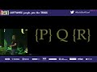

# Kevlin Henney - Full Stack Development (2020-03-14)

## Description

There is often a lot of talk about full-stack development, but with few exceptions such development only touches a subset of the technologies, practices and disciplines that constitute a full stack. The focus is largely on using JavaScript frameworks and databases to create web apps, but device drivers, middleware development and other forms of systems programming are normally missing from the "full stack". This talk, however, has little to do with all that: it actually is about stacks. They appear all over code and computer science, from call stacks to undo lists to common examples for testing and specification. This talk will use the stack as its vehicle to drive through a number of topics of interest and relevance to the modern developer, from state machines to functional programming, from unit tests to concurrency, from lambda calculus to actors, from the code to the real full stack of development.

## Transcript

[0:00:05](https://youtu.be/USRCAGCu6mE?t=5) good afternoon  
[0:00:08](https://youtu.be/USRCAGCu6mE?t=8) we're all here for some full stack  
[0:00:10](https://youtu.be/USRCAGCu6mE?t=10) development  
[0:00:14](https://youtu.be/USRCAGCu6mE?t=14) now I know the I know the theme of the  
[0:00:19](https://youtu.be/USRCAGCu6mE?t=19) conference is software jungle and I'm  
[0:00:23](https://youtu.be/USRCAGCu6mE?t=23) really tempted to use lots of references  
[0:00:26](https://youtu.be/USRCAGCu6mE?t=26) into that but at the moment I can't help  
[0:00:28](https://youtu.be/USRCAGCu6mE?t=28) myself it's November 2019 and I there's  
[0:00:32](https://youtu.be/USRCAGCu6mE?t=32) only one reference that's valid  
[0:00:33](https://youtu.be/USRCAGCu6mE?t=33) and that's Blade Runner although we can  
[0:00:35](https://youtu.be/USRCAGCu6mE?t=35) do a slight adaptation here and at least  
[0:00:38](https://youtu.be/USRCAGCu6mE?t=38) begins without but yes of course I want  
[0:00:42](https://youtu.be/USRCAGCu6mE?t=42) to provide you that how do we get  
[0:00:44](https://youtu.be/USRCAGCu6mE?t=44) through a jungle with a machete a clear  
[0:00:48](https://youtu.be/USRCAGCu6mE?t=48) path and in case you're wondering how to  
[0:00:51](https://youtu.be/USRCAGCu6mE?t=51) watch the first six Star Wars films what  
[0:00:55](https://youtu.be/USRCAGCu6mE?t=55) is the order correct order for that a  
[0:00:57](https://youtu.be/USRCAGCu6mE?t=57) correct order if you want all of them is  
[0:01:00](https://youtu.be/USRCAGCu6mE?t=60) the machete ordering which is four five  
[0:01:04](https://youtu.be/USRCAGCu6mE?t=64) two three six  
[0:01:07](https://youtu.be/USRCAGCu6mE?t=67) okay go and google that one you may  
[0:01:10](https://youtu.be/USRCAGCu6mE?t=70) notice I left out one there's about five  
[0:01:11](https://youtu.be/USRCAGCu6mE?t=71) minutes of one that's relevant okay so  
[0:01:15](https://youtu.be/USRCAGCu6mE?t=75) that's enough film references  
[0:01:16](https://youtu.be/USRCAGCu6mE?t=76) so that's list way Nia let's go to the  
[0:01:19](https://youtu.be/USRCAGCu6mE?t=79) UK so I did this search this week on  
[0:01:22](https://youtu.be/USRCAGCu6mE?t=82) LinkedIn full stack developer in the UK  
[0:01:25](https://youtu.be/USRCAGCu6mE?t=85) over 7000 results Wow and some of them  
[0:01:31](https://youtu.be/USRCAGCu6mE?t=91) require quite a lot of you  
[0:01:34](https://youtu.be/USRCAGCu6mE?t=94) you've got a passionate and driven I  
[0:01:37](https://youtu.be/USRCAGCu6mE?t=97) presume that passion is how we get baby  
[0:01:39](https://youtu.be/USRCAGCu6mE?t=99) developers I don't quite sure about that  
[0:01:41](https://youtu.be/USRCAGCu6mE?t=101) one and driven very focused in other  
[0:01:45](https://youtu.be/USRCAGCu6mE?t=105) words we we're not going to provide you  
[0:01:47](https://youtu.be/USRCAGCu6mE?t=107) with any motivation you better come with  
[0:01:48](https://youtu.be/USRCAGCu6mE?t=108) your own motivation  
[0:01:50](https://youtu.be/USRCAGCu6mE?t=110) you better be itself self motivating is  
[0:01:52](https://youtu.be/USRCAGCu6mE?t=112) this is really dull you're going to need  
[0:01:54](https://youtu.be/USRCAGCu6mE?t=114) to have deep reserves of passion to get  
[0:01:57](https://youtu.be/USRCAGCu6mE?t=117) through this  
[0:01:57](https://youtu.be/USRCAGCu6mE?t=117) not just anger we start off by looking  
[0:02:03](https://youtu.be/USRCAGCu6mE?t=123) at how we think about this terminology  
[0:02:04](https://youtu.be/USRCAGCu6mE?t=124) these days we talk about this this is  
[0:02:07](https://youtu.be/USRCAGCu6mE?t=127) term full stack development and what  
[0:02:10](https://youtu.be/USRCAGCu6mE?t=130) I've learned is that it covers front-end  
[0:02:12](https://youtu.be/USRCAGCu6mE?t=132) development and back-end development  
[0:02:15](https://youtu.be/USRCAGCu6mE?t=135) that's kind of it this is called  
[0:02:17](https://youtu.be/USRCAGCu6mE?t=137) full-stack turns out there's a little  
[0:02:19](https://youtu.be/USRCAGCu6mE?t=139) bit more to the world than this and  
[0:02:21](https://youtu.be/USRCAGCu6mE?t=141) there's  
[0:02:25](https://youtu.be/USRCAGCu6mE?t=145) kinds of other things this is not an  
[0:02:26](https://youtu.be/USRCAGCu6mE?t=146) exclusive list but it turns out that  
[0:02:28](https://youtu.be/USRCAGCu6mE?t=148) there's a bunch of other things that  
[0:02:29](https://youtu.be/USRCAGCu6mE?t=149) probably qualify you see your stack goes  
[0:02:31](https://youtu.be/USRCAGCu6mE?t=151) all the way down it's kind of all these  
[0:02:34](https://youtu.be/USRCAGCu6mE?t=154) people whose call self full stack  
[0:02:35](https://youtu.be/USRCAGCu6mE?t=155) developers but it's just like have you  
[0:02:36](https://youtu.be/USRCAGCu6mE?t=156) ever done the device driver work  
[0:02:38](https://youtu.be/USRCAGCu6mE?t=158) honestly it's not as exciting as it  
[0:02:40](https://youtu.be/USRCAGCu6mE?t=160) sounds or maybe it doesn't sound very  
[0:02:41](https://youtu.be/USRCAGCu6mE?t=161) exciting at all in which case yes it is  
[0:02:43](https://youtu.be/USRCAGCu6mE?t=163) that exciting but all of this other  
[0:02:45](https://youtu.be/USRCAGCu6mE?t=165) stuff is kind of interesting so I guess  
[0:02:49](https://youtu.be/USRCAGCu6mE?t=169) really that's all start development and  
[0:02:54](https://youtu.be/USRCAGCu6mE?t=174) a lot of things get cool full-stack are  
[0:02:57](https://youtu.be/USRCAGCu6mE?t=177) from what I can tell it's here do you  
[0:02:59](https://youtu.be/USRCAGCu6mE?t=179) know JavaScript and  
[0:03:02](https://youtu.be/USRCAGCu6mE?t=182) database and you know I my background is  
[0:03:06](https://youtu.be/USRCAGCu6mE?t=186) in systems programming so starting from  
[0:03:08](https://youtu.be/USRCAGCu6mE?t=188) C but I did I did have a conversation  
[0:03:11](https://youtu.be/USRCAGCu6mE?t=191) with somebody who said yeah you know C  
[0:03:13](https://youtu.be/USRCAGCu6mE?t=193) is too low-level and weird  
[0:03:15](https://youtu.be/USRCAGCu6mE?t=195) they were JavaScript programmer how  
[0:03:18](https://youtu.be/USRCAGCu6mE?t=198) could they say this JavaScript turns out  
[0:03:20](https://youtu.be/USRCAGCu6mE?t=200) is very low level for example there's  
[0:03:22](https://youtu.be/USRCAGCu6mE?t=202) the specter and meltdown of a  
[0:03:25](https://youtu.be/USRCAGCu6mE?t=205) speculative execution in the firmware it  
[0:03:27](https://youtu.be/USRCAGCu6mE?t=207) turns out that that manifests itself  
[0:03:29](https://youtu.be/USRCAGCu6mE?t=209) right at the top level anyway I don't  
[0:03:31](https://youtu.be/USRCAGCu6mE?t=211) know what I'm talking about this because  
[0:03:32](https://youtu.be/USRCAGCu6mE?t=212) that's full stack development that's not  
[0:03:33](https://youtu.be/USRCAGCu6mE?t=213) what this talk is about that's actually  
[0:03:35](https://youtu.be/USRCAGCu6mE?t=215) the correct way to talk about that kind  
[0:03:37](https://youtu.be/USRCAGCu6mE?t=217) develop what I'm here to talk about is  
[0:03:38](https://youtu.be/USRCAGCu6mE?t=218) full stack development just slightly  
[0:03:41](https://youtu.be/USRCAGCu6mE?t=221) different it's actually about stacks it  
[0:03:45](https://youtu.be/USRCAGCu6mE?t=225) is about the computer science structure  
[0:03:47](https://youtu.be/USRCAGCu6mE?t=227) a stack possibly the most overused  
[0:03:50](https://youtu.be/USRCAGCu6mE?t=230) example in the history of computer  
[0:03:52](https://youtu.be/USRCAGCu6mE?t=232) science it's not the most over specified  
[0:03:54](https://youtu.be/USRCAGCu6mE?t=234) example yet we don't fully understand it  
[0:03:58](https://youtu.be/USRCAGCu6mE?t=238) people don't get as much from it as they  
[0:04:00](https://youtu.be/USRCAGCu6mE?t=240) can so I want to be able to only use  
[0:04:01](https://youtu.be/USRCAGCu6mE?t=241) that today to kind of take a round and  
[0:04:04](https://youtu.be/USRCAGCu6mE?t=244) walk through some elements of computer  
[0:04:05](https://youtu.be/USRCAGCu6mE?t=245) science that may be of use for you and  
[0:04:07](https://youtu.be/USRCAGCu6mE?t=247) if nothing else they should be  
[0:04:08](https://youtu.be/USRCAGCu6mE?t=248) reasonably entertainment so that's  
[0:04:12](https://youtu.be/USRCAGCu6mE?t=252) that's brilliant I love it I have a  
[0:04:16](https://youtu.be/USRCAGCu6mE?t=256) slide later on that actually uses more  
[0:04:18](https://youtu.be/USRCAGCu6mE?t=258) pink so I'm looking forward to that you  
[0:04:20](https://youtu.be/USRCAGCu6mE?t=260) can look forward to it now so I edited  
[0:04:23](https://youtu.be/USRCAGCu6mE?t=263) this book a few years ago 97 things  
[0:04:26](https://youtu.be/USRCAGCu6mE?t=266) every programmer should know and in it  
[0:04:28](https://youtu.be/USRCAGCu6mE?t=268) JC van winkle included this observation  
[0:04:32](https://youtu.be/USRCAGCu6mE?t=272) this this recommendation used the right  
[0:04:34](https://youtu.be/USRCAGCu6mE?t=274) algorithm and data structure and this is  
[0:04:38](https://youtu.be/USRCAGCu6mE?t=278) kind of classic computer science stuff  
[0:04:39](https://youtu.be/USRCAGCu6mE?t=279) and everybody thinks oh I don't really  
[0:04:40](https://youtu.be/USRCAGCu6mE?t=280) need to worry about that but it turns  
[0:04:42](https://youtu.be/USRCAGCu6mE?t=282) out you do because it makes a huge  
[0:04:44](https://youtu.be/USRCAGCu6mE?t=284) difference depending on the language and  
[0:04:46](https://youtu.be/USRCAGCu6mE?t=286) the environment that you're in how you  
[0:04:48](https://youtu.be/USRCAGCu6mE?t=288) think about these things they turns out  
[0:04:50](https://youtu.be/USRCAGCu6mE?t=290) if you want to talk about stacks and you  
[0:04:52](https://youtu.be/USRCAGCu6mE?t=292) kind of go back to 1960 old-school  
[0:04:58](https://youtu.be/USRCAGCu6mE?t=298) programming language Lisp many people  
[0:05:02](https://youtu.be/USRCAGCu6mE?t=302) say well you know Lisp was the last and  
[0:05:03](https://youtu.be/USRCAGCu6mE?t=303) first programming language and it turns  
[0:05:05](https://youtu.be/USRCAGCu6mE?t=305) out that if you're working in Lisp  
[0:05:07](https://youtu.be/USRCAGCu6mE?t=307) stacks are really simple just linked  
[0:05:10](https://youtu.be/USRCAGCu6mE?t=310) lists and the privileges the whole  
[0:05:11](https://youtu.be/USRCAGCu6mE?t=311) language is structured around primitives  
[0:05:14](https://youtu.be/USRCAGCu6mE?t=314) for lists for stack up  
[0:05:15](https://youtu.be/USRCAGCu6mE?t=315) patience it turns out you don't have to  
[0:05:17](https://youtu.be/USRCAGCu6mE?t=317) do any work if you've got a stack and  
[0:05:19](https://youtu.be/USRCAGCu6mE?t=319) that's a link a singly linked list in  
[0:05:20](https://youtu.be/USRCAGCu6mE?t=320) memory then that operation gives you the  
[0:05:24](https://youtu.be/USRCAGCu6mE?t=324) top element this operation is a pop and  
[0:05:27](https://youtu.be/USRCAGCu6mE?t=327) cons is a push that's it we're done we  
[0:05:30](https://youtu.be/USRCAGCu6mE?t=330) can go home that was a quick talk for  
[0:05:33](https://youtu.be/USRCAGCu6mE?t=333) some people basically the last 60 years  
[0:05:35](https://youtu.be/USRCAGCu6mE?t=335) of software development has been simply  
[0:05:38](https://youtu.be/USRCAGCu6mE?t=338) waiting for hardware to allow you to do  
[0:05:40](https://youtu.be/USRCAGCu6mE?t=340) Lisp and Lisp ideas properly but  
[0:05:45](https://youtu.be/USRCAGCu6mE?t=345) down your data structures you got to  
[0:05:47](https://youtu.be/USRCAGCu6mE?t=347) understand what they cost and the  
[0:05:49](https://youtu.be/USRCAGCu6mE?t=349) concepts that are used for them  
[0:05:53](https://youtu.be/USRCAGCu6mE?t=353) and that's concrete datatypes in  
[0:05:55](https://youtu.be/USRCAGCu6mE?t=355) particular yeah insertion to a regular  
[0:05:57](https://youtu.be/USRCAGCu6mE?t=357) linked list has a cost of o1u to  
[0:05:59](https://youtu.be/USRCAGCu6mE?t=359) understand complexity but if you add a  
[0:06:00](https://youtu.be/USRCAGCu6mE?t=360) cryptographic hash to every link and an  
[0:06:02](https://youtu.be/USRCAGCu6mE?t=362) insertion can cost one megawatt-hour  
[0:06:04](https://youtu.be/USRCAGCu6mE?t=364) and this is the basis of Bitcoin  
[0:06:07](https://youtu.be/USRCAGCu6mE?t=367) blockchain and various other they call  
[0:06:10](https://youtu.be/USRCAGCu6mE?t=370) currencies but they're speculative  
[0:06:12](https://youtu.be/USRCAGCu6mE?t=372) assets so just as with speculative  
[0:06:14](https://youtu.be/USRCAGCu6mE?t=374) execution there are surprises to be  
[0:06:16](https://youtu.be/USRCAGCu6mE?t=376) helped there let's talk about that's a  
[0:06:19](https://youtu.be/USRCAGCu6mE?t=379) concrete data structure about the  
[0:06:21](https://youtu.be/USRCAGCu6mE?t=381) abstract a dispersed structure stuff  
[0:06:23](https://youtu.be/USRCAGCu6mE?t=383) because ADT's or one of the most  
[0:06:25](https://youtu.be/USRCAGCu6mE?t=385) influential ideas even though people  
[0:06:27](https://youtu.be/USRCAGCu6mE?t=387) often don't work in languages that  
[0:06:28](https://youtu.be/USRCAGCu6mE?t=388) express them directly they have hugely  
[0:06:30](https://youtu.be/USRCAGCu6mE?t=390) shaped  
[0:06:31](https://youtu.be/USRCAGCu6mE?t=391) our thinking and this is comes out of  
[0:06:34](https://youtu.be/USRCAGCu6mE?t=394) the work of Barbara Liskov in the early  
[0:06:36](https://youtu.be/USRCAGCu6mE?t=396) 1970s you may recognize her name from  
[0:06:38](https://youtu.be/USRCAGCu6mE?t=398) the list cough substitution principle  
[0:06:39](https://youtu.be/USRCAGCu6mE?t=399) yes it's that Barbara Misgav winner of  
[0:06:43](https://youtu.be/USRCAGCu6mE?t=403) the cheering award and this paper in  
[0:06:45](https://youtu.be/USRCAGCu6mE?t=405) 1974 really talks about what do we mean  
[0:06:48](https://youtu.be/USRCAGCu6mE?t=408) how do we reason in these things what is  
[0:06:51](https://youtu.be/USRCAGCu6mE?t=411) the purpose of this stuff an abstract  
[0:06:53](https://youtu.be/USRCAGCu6mE?t=413) data type defines a class of abstract  
[0:06:54](https://youtu.be/USRCAGCu6mE?t=414) data objects which is completely  
[0:06:56](https://youtu.be/USRCAGCu6mE?t=416) characterized by the operations  
[0:06:58](https://youtu.be/USRCAGCu6mE?t=418) available knows object now for a lot of  
[0:06:59](https://youtu.be/USRCAGCu6mE?t=419) people they think wait a minute  
[0:07:00](https://youtu.be/USRCAGCu6mE?t=420) this is object orientation yeah sort of  
[0:07:02](https://youtu.be/USRCAGCu6mE?t=422) they overlap but the fundamental idea is  
[0:07:05](https://youtu.be/USRCAGCu6mE?t=425) data abstraction she's not talking about  
[0:07:06](https://youtu.be/USRCAGCu6mE?t=426) anything else here  
[0:07:08](https://youtu.be/USRCAGCu6mE?t=428) most of what we think of as being good  
[0:07:11](https://youtu.be/USRCAGCu6mE?t=431) with their own is actually it overlaps  
[0:07:14](https://youtu.be/USRCAGCu6mE?t=434) and comes from the ADT world the fact  
[0:07:17](https://youtu.be/USRCAGCu6mE?t=437) they use the word object as well perhaps  
[0:07:19](https://youtu.be/USRCAGCu6mE?t=439) as to the confusion or means that people  
[0:07:21](https://youtu.be/USRCAGCu6mE?t=441) and the less about ADT's programmers  
[0:07:23](https://youtu.be/USRCAGCu6mE?t=443) concerned only with the behavior which  
[0:07:25](https://youtu.be/USRCAGCu6mE?t=445) that object exhibits but not with any  
[0:07:27](https://youtu.be/USRCAGCu6mE?t=447) details of how that behavior is achieved  
[0:07:28](https://youtu.be/USRCAGCu6mE?t=448) by means of an implementation so that's  
[0:07:30](https://youtu.be/USRCAGCu6mE?t=450) kind of an interesting segue let's  
[0:07:32](https://youtu.be/USRCAGCu6mE?t=452) actually talk about stacks so here's a  
[0:07:34](https://youtu.be/USRCAGCu6mE?t=454) stack of books that are about objects  
[0:07:37](https://youtu.be/USRCAGCu6mE?t=457) and let's stack of books how do I talk  
[0:07:41](https://youtu.be/USRCAGCu6mE?t=461) about it without talking about its  
[0:07:43](https://youtu.be/USRCAGCu6mE?t=463) implementation program is a very drawn  
[0:07:47](https://youtu.be/USRCAGCu6mE?t=467) towards the implementation sometimes  
[0:07:49](https://youtu.be/USRCAGCu6mE?t=469) very difficult to separate people's  
[0:07:50](https://youtu.be/USRCAGCu6mE?t=470) thinking about how do i implement  
[0:07:52](https://youtu.be/USRCAGCu6mE?t=472) something from how is it from how do i  
[0:07:54](https://youtu.be/USRCAGCu6mE?t=474) reason about it how do i think about it  
[0:07:56](https://youtu.be/USRCAGCu6mE?t=476) how do I use it  
[0:07:57](https://youtu.be/USRCAGCu6mE?t=477) this idea of usage is quite important  
[0:07:59](https://youtu.be/USRCAGCu6mE?t=479) I'm going to see that informs the way we  
[0:08:01](https://youtu.be/USRCAGCu6mE?t=481) think about tests this is a very  
[0:08:03](https://youtu.be/USRCAGCu6mE?t=483) unifying subject now if I think about  
[0:08:04](https://youtu.be/USRCAGCu6mE?t=484) stack  
[0:08:06](https://youtu.be/USRCAGCu6mE?t=486) what can I do with that stack well  
[0:08:07](https://youtu.be/USRCAGCu6mE?t=487) there's a bunch of operations I can  
[0:08:09](https://youtu.be/USRCAGCu6mE?t=489) create one I can push pop I can find the  
[0:08:11](https://youtu.be/USRCAGCu6mE?t=491) debt and I can find the top element now  
[0:08:12](https://youtu.be/USRCAGCu6mE?t=492) that's not enough to give you a model of  
[0:08:14](https://youtu.be/USRCAGCu6mE?t=494) reasoning I can sit there and dig into  
[0:08:16](https://youtu.be/USRCAGCu6mE?t=496) the maths into a math book and come up  
[0:08:19](https://youtu.be/USRCAGCu6mE?t=499) with this which is just a gratuitous  
[0:08:21](https://youtu.be/USRCAGCu6mE?t=501) excuse for me to use an upside down a  
[0:08:23](https://youtu.be/USRCAGCu6mE?t=503) and back to front II talk this is for  
[0:08:28](https://youtu.be/USRCAGCu6mE?t=508) all for all types T so this is generic  
[0:08:30](https://youtu.be/USRCAGCu6mE?t=510) there is a thing called a stack which is  
[0:08:32](https://youtu.be/USRCAGCu6mE?t=512) basically a Cartesian product of or it's  
[0:08:35](https://youtu.be/USRCAGCu6mE?t=515) a tracer a tagged product are all five  
[0:08:38](https://youtu.be/USRCAGCu6mE?t=518) operations or five fields which give you  
[0:08:42](https://youtu.be/USRCAGCu6mE?t=522) these basic behaviors and that's great  
[0:08:46](https://youtu.be/USRCAGCu6mE?t=526) that gives me some types we'll come back  
[0:08:48](https://youtu.be/USRCAGCu6mE?t=528) to the fact that these guys are slashed  
[0:08:50](https://youtu.be/USRCAGCu6mE?t=530) here these are partial functions these  
[0:08:52](https://youtu.be/USRCAGCu6mE?t=532) are full functions or total functions a  
[0:08:55](https://youtu.be/USRCAGCu6mE?t=535) total functions can be called at any  
[0:08:57](https://youtu.be/USRCAGCu6mE?t=537) time a partial function basically means  
[0:08:59](https://youtu.be/USRCAGCu6mE?t=539) you can't always call this it doesn't  
[0:09:01](https://youtu.be/USRCAGCu6mE?t=541) always mean something useful it's not  
[0:09:03](https://youtu.be/USRCAGCu6mE?t=543) always defined and so what is the top of  
[0:09:07](https://youtu.be/USRCAGCu6mE?t=547) an empty stack okay that's an  
[0:09:08](https://youtu.be/USRCAGCu6mE?t=548) interesting one what happens might pop  
[0:09:10](https://youtu.be/USRCAGCu6mE?t=550) an empty stack that's an interesting one  
[0:09:12](https://youtu.be/USRCAGCu6mE?t=552) this is an idea of undefined behavior  
[0:09:14](https://youtu.be/USRCAGCu6mE?t=554) however apart from the types and that  
[0:09:18](https://youtu.be/USRCAGCu6mE?t=558) partial versus total distinction this is  
[0:09:21](https://youtu.be/USRCAGCu6mE?t=561) not enough to talk about this without an  
[0:09:23](https://youtu.be/USRCAGCu6mE?t=563) implementation oh yeah we can go back we  
[0:09:27](https://youtu.be/USRCAGCu6mE?t=567) can sit there and sort of sketch out a  
[0:09:28](https://youtu.be/USRCAGCu6mE?t=568) driver class get something there I guess  
[0:09:30](https://youtu.be/USRCAGCu6mE?t=570) if you're a Java programmer you might  
[0:09:32](https://youtu.be/USRCAGCu6mE?t=572) think oh you know I need to use the word  
[0:09:34](https://youtu.be/USRCAGCu6mE?t=574) get somewhere because it's not obvious  
[0:09:35](https://youtu.be/USRCAGCu6mE?t=575) what depth and taught me maybe I should  
[0:09:38](https://youtu.be/USRCAGCu6mE?t=578) put the word get because that will help  
[0:09:40](https://youtu.be/USRCAGCu6mE?t=580) people okay honestly I think Java  
[0:09:43](https://youtu.be/USRCAGCu6mE?t=583) programmers are not committed enough if  
[0:09:46](https://youtu.be/USRCAGCu6mE?t=586) you're going to do it do it okay I want  
[0:09:49](https://youtu.be/USRCAGCu6mE?t=589) to get that ought to do this it's like  
[0:09:50](https://youtu.be/USRCAGCu6mE?t=590) really that you should only have three  
[0:09:53](https://youtu.be/USRCAGCu6mE?t=593) prefixes in the well maybe four if we  
[0:09:55](https://youtu.be/USRCAGCu6mE?t=595) allow is but in all of your Java code  
[0:09:57](https://youtu.be/USRCAGCu6mE?t=597) should we get do okay we don't want we  
[0:10:00](https://youtu.be/USRCAGCu6mE?t=600) don't want to have meaningful words we  
[0:10:02](https://youtu.be/USRCAGCu6mE?t=602) want to fill the world with noise how  
[0:10:05](https://youtu.be/USRCAGCu6mE?t=605) I'm gonna nor that I focus on that and  
[0:10:07](https://youtu.be/USRCAGCu6mE?t=607) then I'm going to take you back on a  
[0:10:09](https://youtu.be/USRCAGCu6mE?t=609) journey to 1969  
[0:10:11](https://youtu.be/USRCAGCu6mE?t=611) so fifty years ago actually a massive  
[0:10:13](https://youtu.be/USRCAGCu6mE?t=613) basis for computer programming Tony Hawk  
[0:10:15](https://youtu.be/USRCAGCu6mE?t=615) this is kind of like the beginning of  
[0:10:17](https://youtu.be/USRCAGCu6mE?t=617) all methods how do I reason about  
[0:10:20](https://youtu.be/USRCAGCu6mE?t=620) behavior okay so this is quite an  
[0:10:22](https://youtu.be/USRCAGCu6mE?t=622) interesting one because this kind of  
[0:10:24](https://youtu.be/USRCAGCu6mE?t=624) introduces an idea now the notation that  
[0:10:26](https://youtu.be/USRCAGCu6mE?t=626) he used in the original paper is this  
[0:10:30](https://youtu.be/USRCAGCu6mE?t=630) bqr said is if the assertion P is true  
[0:10:34](https://youtu.be/USRCAGCu6mE?t=634) before initiation of a program Q then  
[0:10:37](https://youtu.be/USRCAGCu6mE?t=637) the assertion R will be true on its  
[0:10:38](https://youtu.be/USRCAGCu6mE?t=638) completion and these days we use  
[0:10:40](https://youtu.be/USRCAGCu6mE?t=640) slightly adaptive notation and that is  
[0:10:43](https://youtu.be/USRCAGCu6mE?t=643) precondition action post condition  
[0:10:47](https://youtu.be/USRCAGCu6mE?t=647) that's what that's where all this comes  
[0:10:49](https://youtu.be/USRCAGCu6mE?t=649) from we can apply this kind of  
[0:10:52](https://youtu.be/USRCAGCu6mE?t=652) reasonable to stack and this gives us  
[0:10:57](https://youtu.be/USRCAGCu6mE?t=657) what has become known as the programming  
[0:10:59](https://youtu.be/USRCAGCu6mE?t=659) by contract model which was contrived in  
[0:11:01](https://youtu.be/USRCAGCu6mE?t=661) the 1980s by Bertrand Meyer but it is  
[0:11:03](https://youtu.be/USRCAGCu6mE?t=663) basically just laws work for methods  
[0:11:06](https://youtu.be/USRCAGCu6mE?t=666) were just applied to regular code what  
[0:11:10](https://youtu.be/USRCAGCu6mE?t=670) is the post condition of the constructor  
[0:11:12](https://youtu.be/USRCAGCu6mE?t=672) well the death to zero that's the post  
[0:11:13](https://youtu.be/USRCAGCu6mE?t=673) condition once I pulled it that's the  
[0:11:15](https://youtu.be/USRCAGCu6mE?t=675) one thing I can guarantee  
[0:11:16](https://youtu.be/USRCAGCu6mE?t=676) what about push okay where the pre death  
[0:11:19](https://youtu.be/USRCAGCu6mE?t=679) is the death before you called it the  
[0:11:22](https://youtu.be/USRCAGCu6mE?t=682) post condition is that the death is the  
[0:11:23](https://youtu.be/USRCAGCu6mE?t=683) pre death plus one and the top is  
[0:11:25](https://youtu.be/USRCAGCu6mE?t=685) whatever you just pushed well  
[0:11:29](https://youtu.be/USRCAGCu6mE?t=689) Oh  
[0:11:31](https://youtu.be/USRCAGCu6mE?t=691) we condition can't be empty as condition  
[0:11:34](https://youtu.be/USRCAGCu6mE?t=694) it'll have one less element  
[0:11:37](https://youtu.be/USRCAGCu6mE?t=697) death yeah gonna actually find that this  
[0:11:41](https://youtu.be/USRCAGCu6mE?t=701) citing  
[0:11:43](https://youtu.be/USRCAGCu6mE?t=703) depth is well it can't be negative  
[0:11:45](https://youtu.be/USRCAGCu6mE?t=705) that's all we can say about it in the  
[0:11:46](https://youtu.be/USRCAGCu6mE?t=706) top really we can't say very much about  
[0:11:48](https://youtu.be/USRCAGCu6mE?t=708) it at all apparently some people get  
[0:11:49](https://youtu.be/USRCAGCu6mE?t=709) very excited about this kind of thing I  
[0:11:51](https://youtu.be/USRCAGCu6mE?t=711) can't get very excited about the this  
[0:11:54](https://youtu.be/USRCAGCu6mE?t=714) program by contract model because it is  
[0:11:56](https://youtu.be/USRCAGCu6mE?t=716) too incomplete you can't actually say  
[0:11:59](https://youtu.be/USRCAGCu6mE?t=719) anything useful with it I mean really  
[0:12:01](https://youtu.be/USRCAGCu6mE?t=721) there's not a lot here that you can do  
[0:12:02](https://youtu.be/USRCAGCu6mE?t=722) this is probably one of the weakest  
[0:12:04](https://youtu.be/USRCAGCu6mE?t=724) specifications you ever like you to see  
[0:12:06](https://youtu.be/USRCAGCu6mE?t=726) and it's probably one of the reasons  
[0:12:07](https://youtu.be/USRCAGCu6mE?t=727) people weren't very impressed with  
[0:12:08](https://youtu.be/USRCAGCu6mE?t=728) formal methods I mean doesn't tell me  
[0:12:09](https://youtu.be/USRCAGCu6mE?t=729) what was in the stack when I asked for  
[0:12:11](https://youtu.be/USRCAGCu6mE?t=731) top I have no idea what's there you  
[0:12:13](https://youtu.be/USRCAGCu6mE?t=733) return something it's not very helpful  
[0:12:16](https://youtu.be/USRCAGCu6mE?t=736) I hoped it would but you know that's it  
[0:12:20](https://youtu.be/USRCAGCu6mE?t=740) now what is interesting is that if we  
[0:12:27](https://youtu.be/USRCAGCu6mE?t=747) switch this to C++ I could say the same  
[0:12:32](https://youtu.be/USRCAGCu6mE?t=752) thing I've got a few tweaks for  
[0:12:35](https://youtu.be/USRCAGCu6mE?t=755) conventions in C++ the reason I picked  
[0:12:38](https://youtu.be/USRCAGCu6mE?t=758) two is switching from Java C++ is  
[0:12:40](https://youtu.be/USRCAGCu6mE?t=760) because C++ 23 is due to have pre and  
[0:12:45](https://youtu.be/USRCAGCu6mE?t=765) post conditions it was due to V C++ 20  
[0:12:48](https://youtu.be/USRCAGCu6mE?t=768) but people couldn't really agree on  
[0:12:50](https://youtu.be/USRCAGCu6mE?t=770) certain things  
[0:12:51](https://youtu.be/USRCAGCu6mE?t=771) so yes the joy of committees but here is  
[0:12:55](https://youtu.be/USRCAGCu6mE?t=775) what it will look like unless they  
[0:12:57](https://youtu.be/USRCAGCu6mE?t=777) change it again in C++ 23 use  
[0:13:03](https://youtu.be/USRCAGCu6mE?t=783) pre-imposed but you'll actually see  
[0:13:05](https://youtu.be/USRCAGCu6mE?t=785) there's some stuff missing it turns out  
[0:13:06](https://youtu.be/USRCAGCu6mE?t=786) that an already weak specification is  
[0:13:09](https://youtu.be/USRCAGCu6mE?t=789) now almost useless because at this point  
[0:13:13](https://youtu.be/USRCAGCu6mE?t=793) I can't really say anything about push  
[0:13:16](https://youtu.be/USRCAGCu6mE?t=796) because I can't even say that the depth  
[0:13:18](https://youtu.be/USRCAGCu6mE?t=798) is one greater top is going to equal the  
[0:13:20](https://youtu.be/USRCAGCu6mE?t=800) new top that's it the post condition of  
[0:13:24](https://youtu.be/USRCAGCu6mE?t=804) pop is that it won't be negative  
[0:13:29](https://youtu.be/USRCAGCu6mE?t=809) that's it a lot going on here is that  
[0:13:31](https://youtu.be/USRCAGCu6mE?t=811) it's very difficult to get excited about  
[0:13:33](https://youtu.be/USRCAGCu6mE?t=813) this and if you're actually looking very  
[0:13:35](https://youtu.be/USRCAGCu6mE?t=815) closely you will realize as you're not  
[0:13:37](https://youtu.be/USRCAGCu6mE?t=817) familiar with C or C++ size T is an  
[0:13:40](https://youtu.be/USRCAGCu6mE?t=820) unsigned type it has no negative domain  
[0:13:43](https://youtu.be/USRCAGCu6mE?t=823) so it turns out that actually some of  
[0:13:46](https://youtu.be/USRCAGCu6mE?t=826) these are not very exciting at all  
[0:13:49](https://youtu.be/USRCAGCu6mE?t=829) and we can get rid of them  
[0:13:52](https://youtu.be/USRCAGCu6mE?t=832) and in few slides time I'll show you  
[0:13:54](https://youtu.be/USRCAGCu6mE?t=834) about potentially getting rid of the  
[0:13:56](https://youtu.be/USRCAGCu6mE?t=836) preconditions it's almost an entirely  
[0:13:59](https://youtu.be/USRCAGCu6mE?t=839) useless feature which is maybe why  
[0:14:01](https://youtu.be/USRCAGCu6mE?t=841) people find so much scope to disagree  
[0:14:02](https://youtu.be/USRCAGCu6mE?t=842) about it this is really not as useful as  
[0:14:05](https://youtu.be/USRCAGCu6mE?t=845) it could be if you're all the examples  
[0:14:08](https://youtu.be/USRCAGCu6mE?t=848) I've ever seen a pre imposed condition  
[0:14:10](https://youtu.be/USRCAGCu6mE?t=850) form and reasoning require a lot more  
[0:14:13](https://youtu.be/USRCAGCu6mE?t=853) support and even your the fact that you  
[0:14:16](https://youtu.be/USRCAGCu6mE?t=856) can't even specify a trivial stack and  
[0:14:19](https://youtu.be/USRCAGCu6mE?t=859) it tells you you don't want it in an  
[0:14:20](https://youtu.be/USRCAGCu6mE?t=860) application development it's not going  
[0:14:22](https://youtu.be/USRCAGCu6mE?t=862) to be useful there unless you can do  
[0:14:23](https://youtu.be/USRCAGCu6mE?t=863) something else well there is there is a  
[0:14:25](https://youtu.be/USRCAGCu6mE?t=865) formalism to the rescue so it's used in  
[0:14:29](https://youtu.be/USRCAGCu6mE?t=869) number places Tony Hall used it in  
[0:14:30](https://youtu.be/USRCAGCu6mE?t=870) communicating sequential processes a  
[0:14:33](https://youtu.be/USRCAGCu6mE?t=873) formalism for reasoning about concurrent  
[0:14:36](https://youtu.be/USRCAGCu6mE?t=876) code let's go back and revisit one idea  
[0:14:40](https://youtu.be/USRCAGCu6mE?t=880) we've already had stack the alphabet he  
[0:14:43](https://youtu.be/USRCAGCu6mE?t=883) talks about the alphabet in other words  
[0:14:44](https://youtu.be/USRCAGCu6mE?t=884) what is that what is the language or the  
[0:14:47](https://youtu.be/USRCAGCu6mE?t=887) symbols that are available when you're  
[0:14:48](https://youtu.be/USRCAGCu6mE?t=888) talking about stacks there you go  
[0:14:50](https://youtu.be/USRCAGCu6mE?t=890) but instead of looking at signatures  
[0:14:53](https://youtu.be/USRCAGCu6mE?t=893) what he then says is like I want you to  
[0:14:54](https://youtu.be/USRCAGCu6mE?t=894) imagine a trace of all the behaviors and  
[0:14:57](https://youtu.be/USRCAGCu6mE?t=897) a stack so on this is not exactly CSP  
[0:15:00](https://youtu.be/USRCAGCu6mE?t=900) but it I'm borrowing from CSP heavily  
[0:15:02](https://youtu.be/USRCAGCu6mE?t=902) what we've got here is all the possible  
[0:15:06](https://youtu.be/USRCAGCu6mE?t=906) call sequences all the possible call  
[0:15:09](https://youtu.be/USRCAGCu6mE?t=909) sequences you could ever have when  
[0:15:11](https://youtu.be/USRCAGCu6mE?t=911) interacting with a stack you can create  
[0:15:13](https://youtu.be/USRCAGCu6mE?t=913) one new you can create one and push it  
[0:15:15](https://youtu.be/USRCAGCu6mE?t=915) you can create one and find its depth  
[0:15:18](https://youtu.be/USRCAGCu6mE?t=918) you can create one and push and then pop  
[0:15:19](https://youtu.be/USRCAGCu6mE?t=919) you can create one and push and then  
[0:15:21](https://youtu.be/USRCAGCu6mE?t=921) find its top you can create you'll  
[0:15:23](https://youtu.be/USRCAGCu6mE?t=923) notice that there's no case where you  
[0:15:24](https://youtu.be/USRCAGCu6mE?t=924) can create one and call pop there's no  
[0:15:26](https://youtu.be/USRCAGCu6mE?t=926) case where you can create one and call  
[0:15:28](https://youtu.be/USRCAGCu6mE?t=928) top that simply is not allowed in the  
[0:15:31](https://youtu.be/USRCAGCu6mE?t=931) possible traces of the universe and  
[0:15:33](https://youtu.be/USRCAGCu6mE?t=933) possible traces you'll think wait a  
[0:15:34](https://youtu.be/USRCAGCu6mE?t=934) minute how many possible uses of a stack  
[0:15:36](https://youtu.be/USRCAGCu6mE?t=936) are there you may notice I've I've  
[0:15:39](https://youtu.be/USRCAGCu6mE?t=939) aligned it a little bit of detail here  
[0:15:41](https://youtu.be/USRCAGCu6mE?t=941) it turns out that that's quite big  
[0:15:44](https://youtu.be/USRCAGCu6mE?t=944) infinitely big we'll come back to  
[0:15:46](https://youtu.be/USRCAGCu6mE?t=946) infinity later not in an infinite amount  
[0:15:49](https://youtu.be/USRCAGCu6mE?t=949) of time in a finite amount of time of  
[0:15:51](https://youtu.be/USRCAGCu6mE?t=951) course if you're ever kind of if you've  
[0:15:54](https://youtu.be/USRCAGCu6mE?t=954) got a junior developer who's just joined  
[0:15:56](https://youtu.be/USRCAGCu6mE?t=956) the team and you're not sure what they  
[0:15:57](https://youtu.be/USRCAGCu6mE?t=957) should do you can get them to write this  
[0:15:58](https://youtu.be/USRCAGCu6mE?t=958) out you know that'll keep them busy they  
[0:16:02](https://youtu.be/USRCAGCu6mE?t=962) probably do with great enthusiasm  
[0:16:03](https://youtu.be/USRCAGCu6mE?t=963) however this is where state machines  
[0:16:06](https://youtu.be/USRCAGCu6mE?t=966) help us this is how you generate that  
[0:16:09](https://youtu.be/USRCAGCu6mE?t=969) sequence a new one you've got an empty  
[0:16:11](https://youtu.be/USRCAGCu6mE?t=971) stack you can ask for its death you can  
[0:16:12](https://youtu.be/USRCAGCu6mE?t=972) push it becomes non empty then you can  
[0:16:15](https://youtu.be/USRCAGCu6mE?t=975) call death top push and pop if you pop  
[0:16:17](https://youtu.be/USRCAGCu6mE?t=977) and the death is one then it becomes  
[0:16:18](https://youtu.be/USRCAGCu6mE?t=978) empty go ah this is getting a little  
[0:16:20](https://youtu.be/USRCAGCu6mE?t=980) more helpful now what happens when you  
[0:16:23](https://youtu.be/USRCAGCu6mE?t=983) call top and pop in the empty State  
[0:16:25](https://youtu.be/USRCAGCu6mE?t=985) quite literally it is undefined there is  
[0:16:27](https://youtu.be/USRCAGCu6mE?t=987) no definition of that now this is one of  
[0:16:31](https://youtu.be/USRCAGCu6mE?t=991) those things what is undefined mean it  
[0:16:34](https://youtu.be/USRCAGCu6mE?t=994) means we've not provided a behavior  
[0:16:35](https://youtu.be/USRCAGCu6mE?t=995) there which is a fancy way of saying  
[0:16:37](https://youtu.be/USRCAGCu6mE?t=997) don't do this if you've ever programmed  
[0:16:40](https://youtu.be/USRCAGCu6mE?t=1000) in C or C++ you'll be familiar with this  
[0:16:42](https://youtu.be/USRCAGCu6mE?t=1002) hey look I've got a bug in this program  
[0:16:44](https://youtu.be/USRCAGCu6mE?t=1004) instead of helping you your local C++  
[0:16:47](https://youtu.be/USRCAGCu6mE?t=1007) expert will say oh you shouldn't have  
[0:16:49](https://youtu.be/USRCAGCu6mE?t=1009) done that well thanks  
[0:16:52](https://youtu.be/USRCAGCu6mE?t=1012) that's the problem you got undefined  
[0:16:53](https://youtu.be/USRCAGCu6mE?t=1013) behavior well I'm afraid it's now being  
[0:16:55](https://youtu.be/USRCAGCu6mE?t=1015) defined as a bug okay which is a valid  
[0:16:58](https://youtu.be/USRCAGCu6mE?t=1018) definition of undefined behavior we  
[0:17:00](https://youtu.be/USRCAGCu6mE?t=1020) didn't define it so anything is possible  
[0:17:02](https://youtu.be/USRCAGCu6mE?t=1022) we're gonna see that that has some  
[0:17:03](https://youtu.be/USRCAGCu6mE?t=1023) interesting consequences later what we  
[0:17:05](https://youtu.be/USRCAGCu6mE?t=1025) normally do is we say we don't want that  
[0:17:07](https://youtu.be/USRCAGCu6mE?t=1027) let us map that to something that we've  
[0:17:08](https://youtu.be/USRCAGCu6mE?t=1028) defined let's throw let's just say this  
[0:17:12](https://youtu.be/USRCAGCu6mE?t=1032) is illegal okay so how do we talk about  
[0:17:15](https://youtu.be/USRCAGCu6mE?t=1035) it well it turns out that we have a way  
[0:17:17](https://youtu.be/USRCAGCu6mE?t=1037) of doing this so we can reason about it  
[0:17:19](https://youtu.be/USRCAGCu6mE?t=1039) so I presented here some j-unit 5 code  
[0:17:22](https://youtu.be/USRCAGCu6mE?t=1042) I've skipped the implementation I just  
[0:17:24](https://youtu.be/USRCAGCu6mE?t=1044) want you to focus on the names and this  
[0:17:28](https://youtu.be/USRCAGCu6mE?t=1048) kind of nesting structure is quite  
[0:17:29](https://youtu.be/USRCAGCu6mE?t=1049) powerful  
[0:17:29](https://youtu.be/USRCAGCu6mE?t=1049) we've got stacks back the new stack is  
[0:17:31](https://youtu.be/USRCAGCu6mE?t=1051) empty an empty stack throws our  
[0:17:32](https://youtu.be/USRCAGCu6mE?t=1052) inquiries top item an empty stack throws  
[0:17:34](https://youtu.be/USRCAGCu6mE?t=1054) when popped an empty stack acquires  
[0:17:36](https://youtu.be/USRCAGCu6mE?t=1056) death by rotating a pushed item as its  
[0:17:37](https://youtu.be/USRCAGCu6mE?t=1057) top the one that gives you the sense of  
[0:17:40](https://youtu.be/USRCAGCu6mE?t=1060) depth and non empty stack on popping  
[0:17:42](https://youtu.be/USRCAGCu6mE?t=1062) reveals it stops in reverse order  
[0:17:43](https://youtu.be/USRCAGCu6mE?t=1063) pushing in other words this is history  
[0:17:45](https://youtu.be/USRCAGCu6mE?t=1065) aware it turns out that the pre and post  
[0:17:47](https://youtu.be/USRCAGCu6mE?t=1067) condition model is not very good with  
[0:17:49](https://youtu.be/USRCAGCu6mE?t=1069) history and state change which is  
[0:17:51](https://youtu.be/USRCAGCu6mE?t=1071) probably the one thing you care about so  
[0:17:53](https://youtu.be/USRCAGCu6mE?t=1073) this is quite useful this is quite  
[0:17:55](https://youtu.be/USRCAGCu6mE?t=1075) powerful  
[0:17:57](https://youtu.be/USRCAGCu6mE?t=1077) if you've ever wondered how do i name my  
[0:17:58](https://youtu.be/USRCAGCu6mE?t=1078) tests now you have an answer test push  
[0:18:01](https://youtu.be/USRCAGCu6mE?t=1081) is not the answer okay or do test push  
[0:18:05](https://youtu.be/USRCAGCu6mE?t=1085) sorry so point here is we've now got a  
[0:18:09](https://youtu.be/USRCAGCu6mE?t=1089) model here but there's some really  
[0:18:10](https://youtu.be/USRCAGCu6mE?t=1090) interesting things about this  
[0:18:13](https://youtu.be/USRCAGCu6mE?t=1093) servation made by Jason gone Hey given  
[0:18:17](https://youtu.be/USRCAGCu6mE?t=1097) when then given when then it's one of  
[0:18:20](https://youtu.be/USRCAGCu6mE?t=1100) the common patterns of unit testing  
[0:18:22](https://youtu.be/USRCAGCu6mE?t=1102) whether TDD style or BDD behavior driven  
[0:18:25](https://youtu.be/USRCAGCu6mE?t=1105) development given when then what we call  
[0:18:28](https://youtu.be/USRCAGCu6mE?t=1108) a or triple well that's the Tony Hoare  
[0:18:31](https://youtu.be/USRCAGCu6mE?t=1111) start  
[0:18:32](https://youtu.be/USRCAGCu6mE?t=1112) that's that turns out this is given when  
[0:18:36](https://youtu.be/USRCAGCu6mE?t=1116) there it's the same idea there's one  
[0:18:38](https://youtu.be/USRCAGCu6mE?t=1118) unifying idea it turns out that you  
[0:18:40](https://youtu.be/USRCAGCu6mE?t=1120) don't need to know an awful lot there's  
[0:18:42](https://youtu.be/USRCAGCu6mE?t=1122) normally at the bottom of all software  
[0:18:44](https://youtu.be/USRCAGCu6mE?t=1124) development matter what the change is  
[0:18:45](https://youtu.be/USRCAGCu6mE?t=1125) there's a few basic ideas once you  
[0:18:47](https://youtu.be/USRCAGCu6mE?t=1127) realize what those are you just wait for  
[0:18:49](https://youtu.be/USRCAGCu6mE?t=1129) the next terminology shift I think we do  
[0:18:52](https://youtu.be/USRCAGCu6mE?t=1132) one about now but yeah you can win then  
[0:18:55](https://youtu.be/USRCAGCu6mE?t=1135) now that doesn't mean that you should go  
[0:18:57](https://youtu.be/USRCAGCu6mE?t=1137) ahead and put that all over your code  
[0:18:59](https://youtu.be/USRCAGCu6mE?t=1139) all over your test code because because  
[0:19:03](https://youtu.be/USRCAGCu6mE?t=1143) it means it's not just the internal  
[0:19:04](https://youtu.be/USRCAGCu6mE?t=1144) structure it can actually you be used to  
[0:19:07](https://youtu.be/USRCAGCu6mE?t=1147) structure the nesting and hierarchy of  
[0:19:09](https://youtu.be/USRCAGCu6mE?t=1149) your tests you can write this when a  
[0:19:12](https://youtu.be/USRCAGCu6mE?t=1152) stack is created then it is empty given  
[0:19:14](https://youtu.be/USRCAGCu6mE?t=1154) an empty stack when it is query for its  
[0:19:15](https://youtu.be/USRCAGCu6mE?t=1155) top item then it throws good you can do  
[0:19:18](https://youtu.be/USRCAGCu6mE?t=1158) that but that's kind of a very excessive  
[0:19:21](https://youtu.be/USRCAGCu6mE?t=1161) use of English you can keep it shorter  
[0:19:23](https://youtu.be/USRCAGCu6mE?t=1163) but if it helps you get there absolutely  
[0:19:26](https://youtu.be/USRCAGCu6mE?t=1166) go for it but this gives you a model of  
[0:19:28](https://youtu.be/USRCAGCu6mE?t=1168) reasoning so it turns out you can use  
[0:19:29](https://youtu.be/USRCAGCu6mE?t=1169) the formal thinking you can still use  
[0:19:32](https://youtu.be/USRCAGCu6mE?t=1172) that rigorous thinking that idea of  
[0:19:34](https://youtu.be/USRCAGCu6mE?t=1174) reasoning but you're not going to end up  
[0:19:36](https://youtu.be/USRCAGCu6mE?t=1176) trapped with an incomplete formalism  
[0:19:39](https://youtu.be/USRCAGCu6mE?t=1179) like program by contract now it turns  
[0:19:43](https://youtu.be/USRCAGCu6mE?t=1183) out that one of the things you can do  
[0:19:44](https://youtu.be/USRCAGCu6mE?t=1184) here if you're trying to structure your  
[0:19:46](https://youtu.be/USRCAGCu6mE?t=1186) unit tests and people often struggle  
[0:19:48](https://youtu.be/USRCAGCu6mE?t=1188) with structuring their unit tests they  
[0:19:50](https://youtu.be/USRCAGCu6mE?t=1190) often end up with a very flat thing they  
[0:19:51](https://youtu.be/USRCAGCu6mE?t=1191) don't use nesting which is an oversight  
[0:19:53](https://youtu.be/USRCAGCu6mE?t=1193) you can do this in most testing  
[0:19:54](https://youtu.be/USRCAGCu6mE?t=1194) frameworks some form of nesting but how  
[0:19:57](https://youtu.be/USRCAGCu6mE?t=1197) you group things it turns out you can  
[0:19:58](https://youtu.be/USRCAGCu6mE?t=1198) actually use given as a grouping  
[0:20:00](https://youtu.be/USRCAGCu6mE?t=1200) construct or you know if I have common  
[0:20:02](https://youtu.be/USRCAGCu6mE?t=1202) state then I group my test together  
[0:20:04](https://youtu.be/USRCAGCu6mE?t=1204) according to the common given if I want  
[0:20:06](https://youtu.be/USRCAGCu6mE?t=1206) people to focus on the common operation  
[0:20:09](https://youtu.be/USRCAGCu6mE?t=1209) then I group by common operation  
[0:20:11](https://youtu.be/USRCAGCu6mE?t=1211) alternatively I can group by common  
[0:20:14](https://youtu.be/USRCAGCu6mE?t=1214) outcome here are all the tests with the  
[0:20:16](https://youtu.be/USRCAGCu6mE?t=1216) same outcome okay it depends it's up to  
[0:20:19](https://youtu.be/USRCAGCu6mE?t=1219) you but you've now got three basic ideas  
[0:20:22](https://youtu.be/USRCAGCu6mE?t=1222) it turns out that given when then think  
[0:20:23](https://youtu.be/USRCAGCu6mE?t=1223) actually informs your thinking about how  
[0:20:26](https://youtu.be/USRCAGCu6mE?t=1226) to reason communicate now let's go back  
[0:20:28](https://youtu.be/USRCAGCu6mE?t=1228) to this what we've seen so far is sort  
[0:20:34](https://youtu.be/USRCAGCu6mE?t=1234) of very simple kind of stank model I've  
[0:20:38](https://youtu.be/USRCAGCu6mE?t=1238) added the throws here  
[0:20:40](https://youtu.be/USRCAGCu6mE?t=1240) not because that's a good practice it  
[0:20:42](https://youtu.be/USRCAGCu6mE?t=1242) really is generally considered not to be  
[0:20:43](https://youtu.be/USRCAGCu6mE?t=1243) a good one in Java but because I wanted  
[0:20:45](https://youtu.be/USRCAGCu6mE?t=1245) to emphasize the decision that we took  
[0:20:47](https://youtu.be/USRCAGCu6mE?t=1247) about what is the result of calling  
[0:20:50](https://youtu.be/USRCAGCu6mE?t=1250) something when you're not supposed to  
[0:20:51](https://youtu.be/USRCAGCu6mE?t=1251) call it so I'm going to make that  
[0:20:53](https://youtu.be/USRCAGCu6mE?t=1253) explicit here and that's basically our  
[0:20:55](https://youtu.be/USRCAGCu6mE?t=1255) interpretation of don't do that which is  
[0:20:58](https://youtu.be/USRCAGCu6mE?t=1258) the the partial function thing okay for  
[0:21:02](https://youtu.be/USRCAGCu6mE?t=1262) a moment we said let's change this let  
[0:21:06](https://youtu.be/USRCAGCu6mE?t=1266) us have only total functions this starts  
[0:21:09](https://youtu.be/USRCAGCu6mE?t=1269) getting us into an interesting space  
[0:21:10](https://youtu.be/USRCAGCu6mE?t=1270) some of which overlaps with their  
[0:21:12](https://youtu.be/USRCAGCu6mE?t=1272) concerns and functional programming  
[0:21:13](https://youtu.be/USRCAGCu6mE?t=1273) behind your total functions you can  
[0:21:16](https://youtu.be/USRCAGCu6mE?t=1276) always call it you will always get a  
[0:21:18](https://youtu.be/USRCAGCu6mE?t=1278) result okay what if we make that a  
[0:21:21](https://youtu.be/USRCAGCu6mE?t=1281) first-class citizen rather than as a  
[0:21:22](https://youtu.be/USRCAGCu6mE?t=1282) secondary design citizen what do I do  
[0:21:24](https://youtu.be/USRCAGCu6mE?t=1284) with this unwanted State shrug my  
[0:21:26](https://youtu.be/USRCAGCu6mE?t=1286) shoulders go and inform somebody they  
[0:21:28](https://youtu.be/USRCAGCu6mE?t=1288) shouldn't have called it like that I  
[0:21:29](https://youtu.be/USRCAGCu6mE?t=1289) have an assertion throw an exception  
[0:21:31](https://youtu.be/USRCAGCu6mE?t=1291) what should I do well here we're gonna  
[0:21:33](https://youtu.be/USRCAGCu6mE?t=1293) say you can always call pop and you can  
[0:21:35](https://youtu.be/USRCAGCu6mE?t=1295) always call stack I've got an algebraic  
[0:21:37](https://youtu.be/USRCAGCu6mE?t=1297) datatype here this is known rather  
[0:21:40](https://youtu.be/USRCAGCu6mE?t=1300) excitingly as the bottom type it  
[0:21:41](https://youtu.be/USRCAGCu6mE?t=1301) basically means nothing quite literally  
[0:21:43](https://youtu.be/USRCAGCu6mE?t=1303) nothing you  
[0:21:45](https://youtu.be/USRCAGCu6mE?t=1305) when you call top you either get a value  
[0:21:48](https://youtu.be/USRCAGCu6mE?t=1308) of type T or you don't get a thing an  
[0:21:51](https://youtu.be/USRCAGCu6mE?t=1311) empty thing it turns out there's an  
[0:21:54](https://youtu.be/USRCAGCu6mE?t=1314) easier way of writing that in Java if  
[0:21:55](https://youtu.be/USRCAGCu6mE?t=1315) you're busy trying to find the key for  
[0:21:57](https://youtu.be/USRCAGCu6mE?t=1317) that symbol optional it basically means  
[0:22:01](https://youtu.be/USRCAGCu6mE?t=1321) that when I pop we effectively treat it  
[0:22:03](https://youtu.be/USRCAGCu6mE?t=1323) as nothing happens when I call top if  
[0:22:06](https://youtu.be/USRCAGCu6mE?t=1326) there's nothing there then we get  
[0:22:07](https://youtu.be/USRCAGCu6mE?t=1327) returned an empty value now what that  
[0:22:09](https://youtu.be/USRCAGCu6mE?t=1329) looks like from the point of view of the  
[0:22:11](https://youtu.be/USRCAGCu6mE?t=1331) test is let's just emphasize  
[0:22:16](https://youtu.be/USRCAGCu6mE?t=1336) an empty stack returns an empty value as  
[0:22:18](https://youtu.be/USRCAGCu6mE?t=1338) its top item an empty stack retains a  
[0:22:20](https://youtu.be/USRCAGCu6mE?t=1340) remains empty when popped so actually  
[0:22:23](https://youtu.be/USRCAGCu6mE?t=1343) this is quite nice we've actually got  
[0:22:24](https://youtu.be/USRCAGCu6mE?t=1344) tests that tell us what we're expecting  
[0:22:26](https://youtu.be/USRCAGCu6mE?t=1346) in a specification life format but  
[0:22:28](https://youtu.be/USRCAGCu6mE?t=1348) something that's communicable in natural  
[0:22:30](https://youtu.be/USRCAGCu6mE?t=1350) language now that's kind of interesting  
[0:22:32](https://youtu.be/USRCAGCu6mE?t=1352) but I want to take a different path  
[0:22:34](https://youtu.be/USRCAGCu6mE?t=1354) we've made that we've made it do this I  
[0:22:37](https://youtu.be/USRCAGCu6mE?t=1357) want to try something different I'm  
[0:22:40](https://youtu.be/USRCAGCu6mE?t=1360) going to make such a simple stack but  
[0:22:42](https://youtu.be/USRCAGCu6mE?t=1362) it's only going to have two operations  
[0:22:43](https://youtu.be/USRCAGCu6mE?t=1363) on it the ultimate minimal design you  
[0:22:48](https://youtu.be/USRCAGCu6mE?t=1368) can only push and you can only pop  
[0:22:51](https://youtu.be/USRCAGCu6mE?t=1371) where do I find my depth from well you  
[0:22:54](https://youtu.be/USRCAGCu6mE?t=1374) can  
[0:22:55](https://youtu.be/USRCAGCu6mE?t=1375) calculate your depth we can basically  
[0:22:57](https://youtu.be/USRCAGCu6mE?t=1377) say a few things these are called  
[0:22:58](https://youtu.be/USRCAGCu6mE?t=1378) invariants the number of times I push  
[0:23:01](https://youtu.be/USRCAGCu6mE?t=1381) must be greater than or equal to zero  
[0:23:02](https://youtu.be/USRCAGCu6mE?t=1382) the number of times I pop must be  
[0:23:04](https://youtu.be/USRCAGCu6mE?t=1384) greater than or equal to zero the number  
[0:23:05](https://youtu.be/USRCAGCu6mE?t=1385) of times I push is greater than or equal  
[0:23:07](https://youtu.be/USRCAGCu6mE?t=1387) to the number of times I pop that seems  
[0:23:08](https://youtu.be/USRCAGCu6mE?t=1388) reasonable and the debt is the number of  
[0:23:10](https://youtu.be/USRCAGCu6mE?t=1390) pushes minus the number of pops Pais  
[0:23:15](https://youtu.be/USRCAGCu6mE?t=1395) what language is sufficiently minimal  
[0:23:17](https://youtu.be/USRCAGCu6mE?t=1397) that we can express this heightened so  
[0:23:22](https://youtu.be/USRCAGCu6mE?t=1402) stack is a stack surprises let's push  
[0:23:25](https://youtu.be/USRCAGCu6mE?t=1405) okay let's push some more and let's pop  
[0:23:29](https://youtu.be/USRCAGCu6mE?t=1409) and what we should get is 2019  
[0:23:32](https://youtu.be/USRCAGCu6mE?t=1412) let's pop again what we should get is  
[0:23:34](https://youtu.be/USRCAGCu6mE?t=1414) build stuff nice okay  
[0:23:36](https://youtu.be/USRCAGCu6mE?t=1416) let's try a different usage or rather  
[0:23:38](https://youtu.be/USRCAGCu6mE?t=1418) here's the implementation before we try  
[0:23:40](https://youtu.be/USRCAGCu6mE?t=1420) the different usage it's not very  
[0:23:41](https://youtu.be/USRCAGCu6mE?t=1421) exciting we're just going to use a  
[0:23:42](https://youtu.be/USRCAGCu6mE?t=1422) built-in list it does most of the work  
[0:23:44](https://youtu.be/USRCAGCu6mE?t=1424) for us and that's it I've kind of done  
[0:23:46](https://youtu.be/USRCAGCu6mE?t=1426) here that was very exciting  
[0:23:49](https://youtu.be/USRCAGCu6mE?t=1429) what happens when we owe what we  
[0:23:53](https://youtu.be/USRCAGCu6mE?t=1433) actually get is an indexing area even  
[0:23:57](https://youtu.be/USRCAGCu6mE?t=1437) though we've got no concept of index  
[0:23:58](https://youtu.be/USRCAGCu6mE?t=1438) that comes from the underlying list  
[0:24:00](https://youtu.be/USRCAGCu6mE?t=1440) fortunately it happens to have the right  
[0:24:03](https://youtu.be/USRCAGCu6mE?t=1443) vocabulary up from an empty list you  
[0:24:05](https://youtu.be/USRCAGCu6mE?t=1445) can't do that but we have a problem  
[0:24:07](https://youtu.be/USRCAGCu6mE?t=1447) there is strictly this is a an incorrect  
[0:24:11](https://youtu.be/USRCAGCu6mE?t=1451) interpretation of our specification  
[0:24:13](https://youtu.be/USRCAGCu6mE?t=1453) because now I've popped so pop is now  
[0:24:17](https://youtu.be/USRCAGCu6mE?t=1457) greater than 1 it is 1  
[0:24:20](https://youtu.be/USRCAGCu6mE?t=1460) and the number of pushes must always be  
[0:24:22](https://youtu.be/USRCAGCu6mE?t=1462) greater than pops that's false because  
[0:24:24](https://youtu.be/USRCAGCu6mE?t=1464) we've not pushed and the death is 0-1 so  
[0:24:27](https://youtu.be/USRCAGCu6mE?t=1467) the depth is minus one damn this doesn't  
[0:24:30](https://youtu.be/USRCAGCu6mE?t=1470) work  
[0:24:32](https://youtu.be/USRCAGCu6mE?t=1472) what we need  
[0:24:35](https://youtu.be/USRCAGCu6mE?t=1475) change this so that when we're non-empty  
[0:24:37](https://youtu.be/USRCAGCu6mE?t=1477) we provide two operations where empty we  
[0:24:41](https://youtu.be/USRCAGCu6mE?t=1481) only provide one operation and I have a  
[0:24:43](https://youtu.be/USRCAGCu6mE?t=1483) dynamic interface this is a property  
[0:24:45](https://youtu.be/USRCAGCu6mE?t=1485) that we can get away with in Python this  
[0:24:48](https://youtu.be/USRCAGCu6mE?t=1488) is the original the origin quote for why  
[0:24:52](https://youtu.be/USRCAGCu6mE?t=1492) we call this duck typing see a bird that  
[0:24:54](https://youtu.be/USRCAGCu6mE?t=1494) walks like a duck and swims like a duck  
[0:24:56](https://youtu.be/USRCAGCu6mE?t=1496) and quacks like a duck I call that bird  
[0:24:58](https://youtu.be/USRCAGCu6mE?t=1498) a duck I think this was written in some  
[0:24:59](https://youtu.be/USRCAGCu6mE?t=1499) bird-watching guide from the 1930s we'll  
[0:25:02](https://youtu.be/USRCAGCu6mE?t=1502) come back to the 1930s later and but  
[0:25:06](https://youtu.be/USRCAGCu6mE?t=1506) because we like animals as it's a jungle  
[0:25:09](https://youtu.be/USRCAGCu6mE?t=1509) right  
[0:25:09](https://youtu.be/USRCAGCu6mE?t=1509) I've got monkeys as well in Ruby Python  
[0:25:12](https://youtu.be/USRCAGCu6mE?t=1512) and many dynamic Pro languages the term  
[0:25:15](https://youtu.be/USRCAGCu6mE?t=1515) monkey patch anywhere refers to dynamic  
[0:25:17](https://youtu.be/USRCAGCu6mE?t=1517) modifications of a class or module at  
[0:25:19](https://youtu.be/USRCAGCu6mE?t=1519) runtime  
[0:25:19](https://youtu.be/USRCAGCu6mE?t=1519) excellent self-modifying code that's  
[0:25:23](https://youtu.be/USRCAGCu6mE?t=1523) what we want so let's actually see how  
[0:25:26](https://youtu.be/USRCAGCu6mE?t=1526) are we going to do this in a way that  
[0:25:27](https://youtu.be/USRCAGCu6mE?t=1527) satisfies the original specification and  
[0:25:29](https://youtu.be/USRCAGCu6mE?t=1529) learn an extra bit about Python  
[0:25:30](https://youtu.be/USRCAGCu6mE?t=1530) enclosures as well well we've got a  
[0:25:32](https://youtu.be/USRCAGCu6mE?t=1532) class stack it's only got one method  
[0:25:38](https://youtu.be/USRCAGCu6mE?t=1538) enough familiars pison the init method  
[0:25:40](https://youtu.be/USRCAGCu6mE?t=1540) is the kind of the constructor  
[0:25:42](https://youtu.be/USRCAGCu6mE?t=1542) it's the bootstrap method what we're  
[0:25:44](https://youtu.be/USRCAGCu6mE?t=1544) going to do inside that is we're going  
[0:25:46](https://youtu.be/USRCAGCu6mE?t=1546) to define four operations the first push  
[0:25:48](https://youtu.be/USRCAGCu6mE?t=1548) the end to push the end pop in the last  
[0:25:50](https://youtu.be/USRCAGCu6mE?t=1550) pop  
[0:25:52](https://youtu.be/USRCAGCu6mE?t=1552) what we do and then what we're going to  
[0:25:53](https://youtu.be/USRCAGCu6mE?t=1553) do is once we've our last active  
[0:25:56](https://youtu.be/USRCAGCu6mE?t=1556) initialization is that our pull-push  
[0:25:59](https://youtu.be/USRCAGCu6mE?t=1559) cell flop push will be the first push  
[0:26:00](https://youtu.be/USRCAGCu6mE?t=1560) because obviously the only thing you can  
[0:26:02](https://youtu.be/USRCAGCu6mE?t=1562) now do is the first push there are no  
[0:26:05](https://youtu.be/USRCAGCu6mE?t=1565) other operations available  
[0:26:08](https://youtu.be/USRCAGCu6mE?t=1568) what happens once you've done the first  
[0:26:09](https://youtu.be/USRCAGCu6mE?t=1569) push is that we will it now replace the  
[0:26:13](https://youtu.be/USRCAGCu6mE?t=1573) push operation with a new operation an  
[0:26:15](https://youtu.be/USRCAGCu6mE?t=1575) nth push because we've done the first  
[0:26:17](https://youtu.be/USRCAGCu6mE?t=1577) one but now it's going to be N equals  
[0:26:19](https://youtu.be/USRCAGCu6mE?t=1579) two three four etc and the pop operation  
[0:26:21](https://youtu.be/USRCAGCu6mE?t=1581) will now be the last pot because if it's  
[0:26:24](https://youtu.be/USRCAGCu6mE?t=1584) the first push it must be the last pot  
[0:26:25](https://youtu.be/USRCAGCu6mE?t=1585) last in first out and it's whatever last  
[0:26:28](https://youtu.be/USRCAGCu6mE?t=1588) popper turns for top the nth push when  
[0:26:32](https://youtu.be/USRCAGCu6mE?t=1592) you push then the pop gets reinstalled  
[0:26:34](https://youtu.be/USRCAGCu6mE?t=1594) as the end up the nth pot this is where  
[0:26:37](https://youtu.be/USRCAGCu6mE?t=1597) it gets fun we make a note of our own  
[0:26:39](https://youtu.be/USRCAGCu6mE?t=1599) old pop operation then we've got a new  
[0:26:41](https://youtu.be/USRCAGCu6mE?t=1601) pop operation that returns our local  
[0:26:45](https://youtu.be/USRCAGCu6mE?t=1605) variable axis closure and then we return  
[0:26:49](https://youtu.be/USRCAGCu6mE?t=1609) the new operation and then the last pot  
[0:26:52](https://youtu.be/USRCAGCu6mE?t=1612) sort of that again so what we actually  
[0:26:54](https://youtu.be/USRCAGCu6mE?t=1614) end up doing is we end up creating a  
[0:26:57](https://youtu.be/USRCAGCu6mE?t=1617) linked list of operations in memory that  
[0:27:00](https://youtu.be/USRCAGCu6mE?t=1620) are joined by scopes okay so if you  
[0:27:03](https://youtu.be/USRCAGCu6mE?t=1623) wondered about nested scopes turns out  
[0:27:05](https://youtu.be/USRCAGCu6mE?t=1625) nested scopes are far more powerful and  
[0:27:06](https://youtu.be/USRCAGCu6mE?t=1626) you've been given credit for languages  
[0:27:09](https://youtu.be/USRCAGCu6mE?t=1629) like C sharp and Java so what that means  
[0:27:13](https://youtu.be/USRCAGCu6mE?t=1633) in practice is we now push exactly the  
[0:27:17](https://youtu.be/USRCAGCu6mE?t=1637) same as before identical behavior if  
[0:27:19](https://youtu.be/USRCAGCu6mE?t=1639) you're running unit tests on this you  
[0:27:21](https://youtu.be/USRCAGCu6mE?t=1641) get exactly the same results okay  
[0:27:25](https://youtu.be/USRCAGCu6mE?t=1645) now it gets exciting now we're going to  
[0:27:27](https://youtu.be/USRCAGCu6mE?t=1647) pop  
[0:27:29](https://youtu.be/USRCAGCu6mE?t=1649) now you see it's all there there is no  
[0:27:32](https://youtu.be/USRCAGCu6mE?t=1652) attribute pop we are unable to call pop  
[0:27:35](https://youtu.be/USRCAGCu6mE?t=1655) the number of times we have called pop  
[0:27:36](https://youtu.be/USRCAGCu6mE?t=1656) is zero because there are no pop  
[0:27:38](https://youtu.be/USRCAGCu6mE?t=1658) operations finally we've satisfied the  
[0:27:40](https://youtu.be/USRCAGCu6mE?t=1660) specification excellent  
[0:27:43](https://youtu.be/USRCAGCu6mE?t=1663) not safe for work don't do this at work  
[0:27:46](https://youtu.be/USRCAGCu6mE?t=1666) okay but this is one of those things of  
[0:27:49](https://youtu.be/USRCAGCu6mE?t=1669) like if you really want to abuse a  
[0:27:50](https://youtu.be/USRCAGCu6mE?t=1670) language and you really when people say  
[0:27:52](https://youtu.be/USRCAGCu6mE?t=1672) oh I understand stacks do you you  
[0:27:53](https://youtu.be/USRCAGCu6mE?t=1673) understand that you're doing very well  
[0:27:55](https://youtu.be/USRCAGCu6mE?t=1675) because that mixes a number of more more  
[0:27:57](https://youtu.be/USRCAGCu6mE?t=1677) advanced concepts all together in one  
[0:28:00](https://youtu.be/USRCAGCu6mE?t=1680) place okay so give your brains a  
[0:28:03](https://youtu.be/USRCAGCu6mE?t=1683) breather from that table with full stack  
[0:28:06](https://youtu.be/USRCAGCu6mE?t=1686) developers you can't push them  
[0:28:10](https://youtu.be/USRCAGCu6mE?t=1690) yes we talked about stack an idea that  
[0:28:12](https://youtu.be/USRCAGCu6mE?t=1692) is often related and talked about when  
[0:28:13](https://youtu.be/USRCAGCu6mE?t=1693) we talk about stacks is queues and these  
[0:28:14](https://youtu.be/USRCAGCu6mE?t=1694) are different these differ by discipline  
[0:28:16](https://youtu.be/USRCAGCu6mE?t=1696) it turns out if you understand stacks  
[0:28:18](https://youtu.be/USRCAGCu6mE?t=1698) and queues you probably understand most  
[0:28:19](https://youtu.be/USRCAGCu6mE?t=1699) of the things you will ever need to know  
[0:28:21](https://youtu.be/USRCAGCu6mE?t=1701) okay  
[0:28:22](https://youtu.be/USRCAGCu6mE?t=1702) people say oh yeah is that true well  
[0:28:24](https://youtu.be/USRCAGCu6mE?t=1704) yeah it is so a queue would be like  
[0:28:28](https://youtu.be/USRCAGCu6mE?t=1708) people queuing for drinks that was mean  
[0:28:31](https://youtu.be/USRCAGCu6mE?t=1711) a few years ago I've recovered by my  
[0:28:35](https://youtu.be/USRCAGCu6mE?t=1715) kill off the Frank Bushman and Michie  
[0:28:36](https://youtu.be/USRCAGCu6mE?t=1716) hanging you did a lot of work on Moodle  
[0:28:38](https://youtu.be/USRCAGCu6mE?t=1718) web that still does a lot of work with  
[0:28:39](https://youtu.be/USRCAGCu6mE?t=1719) middleware I believe there's a nice cute  
[0:28:41](https://youtu.be/USRCAGCu6mE?t=1721) drink there for us but we need to  
[0:28:43](https://youtu.be/USRCAGCu6mE?t=1723) understand why is it the queues are so  
[0:28:44](https://youtu.be/USRCAGCu6mE?t=1724) powerful as a construct and where are we  
[0:28:47](https://youtu.be/USRCAGCu6mE?t=1727) going to get two stacks together don't  
[0:28:48](https://youtu.be/USRCAGCu6mE?t=1728) worry we'll come back two stacks so a  
[0:28:50](https://youtu.be/USRCAGCu6mE?t=1730) queue is a way of all queue models break  
[0:28:53](https://youtu.be/USRCAGCu6mE?t=1733) down to a producer and a consumer on a  
[0:28:55](https://youtu.be/USRCAGCu6mE?t=1735) queue in the middle this doesn't mean  
[0:28:56](https://youtu.be/USRCAGCu6mE?t=1736) they're distributed it doesn't even mean  
[0:28:57](https://youtu.be/USRCAGCu6mE?t=1737) that concurrent if you're bored of the  
[0:29:00](https://youtu.be/USRCAGCu6mE?t=1740) term queue I offer you a new profound  
[0:29:02](https://youtu.be/USRCAGCu6mE?t=1742) insight an alternative piece of  
[0:29:03](https://youtu.be/USRCAGCu6mE?t=1743) terminology a queue is a spacetime  
[0:29:05](https://youtu.be/USRCAGCu6mE?t=1745) decoupling okay that is way more  
[0:29:08](https://youtu.be/USRCAGCu6mE?t=1748) interesting okay when you're having a  
[0:29:10](https://youtu.be/USRCAGCu6mE?t=1750) conversation with your colleagues and  
[0:29:11](https://youtu.be/USRCAGCu6mE?t=1751) you're kind of looking at stuff it's  
[0:29:12](https://youtu.be/USRCAGCu6mE?t=1752) like yeah but getting all these requests  
[0:29:13](https://youtu.be/USRCAGCu6mE?t=1753) in what we need here is a spacetime  
[0:29:15](https://youtu.be/USRCAGCu6mE?t=1755) decoupling so so much better  
[0:29:17](https://youtu.be/USRCAGCu6mE?t=1757) a queue is heard of cubes message queues  
[0:29:20](https://youtu.be/USRCAGCu6mE?t=1760) all your products all the products tend  
[0:29:23](https://youtu.be/USRCAGCu6mE?t=1763) to have queue in them and because Q is  
[0:29:25](https://youtu.be/USRCAGCu6mE?t=1765) also the name of a letter in English  
[0:29:27](https://youtu.be/USRCAGCu6mE?t=1767) they all end in queue I think that was  
[0:29:29](https://youtu.be/USRCAGCu6mE?t=1769) probably cute the first time you know  
[0:29:31](https://youtu.be/USRCAGCu6mE?t=1771) maybe in the 1970s but we're kind of  
[0:29:34](https://youtu.be/USRCAGCu6mE?t=1774) over that these days we should be  
[0:29:37](https://youtu.be/USRCAGCu6mE?t=1777) looking at space-time D couplings much  
[0:29:39](https://youtu.be/USRCAGCu6mE?t=1779) more excited because that's what it is  
[0:29:40](https://youtu.be/USRCAGCu6mE?t=1780) because you queue something up and I you  
[0:29:42](https://youtu.be/USRCAGCu6mE?t=1782) come back to it later or it's something  
[0:29:44](https://youtu.be/USRCAGCu6mE?t=1784) separate spatially such as a different  
[0:29:47](https://youtu.be/USRCAGCu6mE?t=1787) process or both  
[0:29:49](https://youtu.be/USRCAGCu6mE?t=1789) right now how do we understand them  
[0:29:52](https://youtu.be/USRCAGCu6mE?t=1792) queues have sizes which means they're  
[0:29:55](https://youtu.be/USRCAGCu6mE?t=1795) buffered bounded in a synchronous for n  
[0:29:58](https://youtu.be/USRCAGCu6mE?t=1798) is greater than zero  
[0:29:59](https://youtu.be/USRCAGCu6mE?t=1799) generally infinities not recommended  
[0:30:05](https://youtu.be/USRCAGCu6mE?t=1805) everybody's default idea of a queue it  
[0:30:07](https://youtu.be/USRCAGCu6mE?t=1807) just you just keep on pushing things  
[0:30:08](https://youtu.be/USRCAGCu6mE?t=1808) into it there's one problem your  
[0:30:11](https://youtu.be/USRCAGCu6mE?t=1811) computer  
[0:30:13](https://youtu.be/USRCAGCu6mE?t=1813) even the ones in the cloud was not your  
[0:30:15](https://youtu.be/USRCAGCu6mE?t=1815) computer their computer even the one in  
[0:30:19](https://youtu.be/USRCAGCu6mE?t=1819) the cloud has only got finite resources  
[0:30:21](https://youtu.be/USRCAGCu6mE?t=1821) cannot rely on this you need to put a  
[0:30:24](https://youtu.be/USRCAGCu6mE?t=1824) boundary it because otherwise something  
[0:30:26](https://youtu.be/USRCAGCu6mE?t=1826) will eventually run out it will happen  
[0:30:28](https://youtu.be/USRCAGCu6mE?t=1828) rather nasty side-effects on your coat  
[0:30:30](https://youtu.be/USRCAGCu6mE?t=1830) and your runtime so always work with  
[0:30:32](https://youtu.be/USRCAGCu6mE?t=1832) bounded queues but it gets more  
[0:30:35](https://youtu.be/USRCAGCu6mE?t=1835) interesting when we think of limiting  
[0:30:36](https://youtu.be/USRCAGCu6mE?t=1836) cases what is a queue with one element  
[0:30:42](https://youtu.be/USRCAGCu6mE?t=1842) yeah we have a name for that it's called  
[0:30:43](https://youtu.be/USRCAGCu6mE?t=1843) the future  
[0:30:45](https://youtu.be/USRCAGCu6mE?t=1845) and what's the other side of it cool  
[0:30:47](https://youtu.be/USRCAGCu6mE?t=1847) it's called a promise turns out like I  
[0:30:49](https://youtu.be/USRCAGCu6mE?t=1849) said there are only a few ideas yeah  
[0:30:51](https://youtu.be/USRCAGCu6mE?t=1851) once you understand oh okay now I've  
[0:30:54](https://youtu.be/USRCAGCu6mE?t=1854) understood pretty much everything there  
[0:30:56](https://youtu.be/USRCAGCu6mE?t=1856) is to do with concurrency at all in fact  
[0:30:59](https://youtu.be/USRCAGCu6mE?t=1859) if what about N equals zero it son  
[0:31:01](https://youtu.be/USRCAGCu6mE?t=1861) before it's synchronous that means it's  
[0:31:03](https://youtu.be/USRCAGCu6mE?t=1863) a rendezvous the default way of  
[0:31:06](https://youtu.be/USRCAGCu6mE?t=1866) interpreting this often people use a  
[0:31:08](https://youtu.be/USRCAGCu6mE?t=1868) slightly different term here so channel  
[0:31:10](https://youtu.be/USRCAGCu6mE?t=1870) channels were basically popularized by  
[0:31:13](https://youtu.be/USRCAGCu6mE?t=1873) the CSP which we've already met the idea  
[0:31:16](https://youtu.be/USRCAGCu6mE?t=1876) of how to reason about sequential  
[0:31:18](https://youtu.be/USRCAGCu6mE?t=1878) processes as they communicate by  
[0:31:19](https://youtu.be/USRCAGCu6mE?t=1879) channels this is a surprisingly powerful  
[0:31:21](https://youtu.be/USRCAGCu6mE?t=1881) construct so yeah we shall observe the  
[0:31:25](https://youtu.be/USRCAGCu6mE?t=1885) convention that channels are used for  
[0:31:26](https://youtu.be/USRCAGCu6mE?t=1886) communication in only one direction in  
[0:31:28](https://youtu.be/USRCAGCu6mE?t=1888) between only two processes really nice  
[0:31:30](https://youtu.be/USRCAGCu6mE?t=1890) simple way of doing it so sometimes cues  
[0:31:33](https://youtu.be/USRCAGCu6mE?t=1893) can be fed from multiple things so  
[0:31:35](https://youtu.be/USRCAGCu6mE?t=1895) distinction is that a channel should  
[0:31:36](https://youtu.be/USRCAGCu6mE?t=1896) only have on destination one producer  
[0:31:39](https://youtu.be/USRCAGCu6mE?t=1899) and one consumer that's a submits a  
[0:31:41](https://youtu.be/USRCAGCu6mE?t=1901) linguistic distinction but it can be  
[0:31:42](https://youtu.be/USRCAGCu6mE?t=1902) quite powerful now the language that  
[0:31:44](https://youtu.be/USRCAGCu6mE?t=1904) people often associate with channels  
[0:31:47](https://youtu.be/USRCAGCu6mE?t=1907) these days and this kind of approach is  
[0:31:48](https://youtu.be/USRCAGCu6mE?t=1908) go so let's go and have a look at a  
[0:31:50](https://youtu.be/USRCAGCu6mE?t=1910) stack and go but this time I'm going to  
[0:31:52](https://youtu.be/USRCAGCu6mE?t=1912) do this I'm going to treat the stack as  
[0:31:54](https://youtu.be/USRCAGCu6mE?t=1914) a separate running go routine  
[0:31:57](https://youtu.be/USRCAGCu6mE?t=1917) effectively a mini process I'm going to  
[0:32:01](https://youtu.be/USRCAGCu6mE?t=1921) create a channel for Strings that is  
[0:32:03](https://youtu.be/USRCAGCu6mE?t=1923) going to be for pushing and I'm gonna  
[0:32:05](https://youtu.be/USRCAGCu6mE?t=1925) create another channel called pop that  
[0:32:06](https://youtu.be/USRCAGCu6mE?t=1926) is going to be for also for Strings but  
[0:32:09](https://youtu.be/USRCAGCu6mE?t=1929) that's where I'm going to get results  
[0:32:10](https://youtu.be/USRCAGCu6mE?t=1930) back and what I'm going to do is I'm  
[0:32:11](https://youtu.be/USRCAGCu6mE?t=1931) gonna launch a function called stack  
[0:32:13](https://youtu.be/USRCAGCu6mE?t=1933) with these two channels I'm not going to  
[0:32:16](https://youtu.be/USRCAGCu6mE?t=1936) do with the stack identity at any point  
[0:32:18](https://youtu.be/USRCAGCu6mE?t=1938) in time I'm just going to communicate  
[0:32:20](https://youtu.be/USRCAGCu6mE?t=1940) with effectively a concurrent running  
[0:32:22](https://youtu.be/USRCAGCu6mE?t=1942) function which is kind of cool so the  
[0:32:24](https://youtu.be/USRCAGCu6mE?t=1944) way I use it I push or rather I've used  
[0:32:30](https://youtu.be/USRCAGCu6mE?t=1950) the name so that's suggestive I send on  
[0:32:33](https://youtu.be/USRCAGCu6mE?t=1953) to the push channel build stuff I send  
[0:32:36](https://youtu.be/USRCAGCu6mE?t=1956) 2019 on to that and when I do a print  
[0:32:39](https://youtu.be/USRCAGCu6mE?t=1959) then this is a read from the pop channel  
[0:32:41](https://youtu.be/USRCAGCu6mE?t=1961) see if I get 2019 and when I do receive  
[0:32:45](https://youtu.be/USRCAGCu6mE?t=1965) then I get build stuff brilliant  
[0:32:49](https://youtu.be/USRCAGCu6mE?t=1969) now the question is given that again  
[0:32:50](https://youtu.be/USRCAGCu6mE?t=1970) I've gone for this minimal you you go  
[0:32:53](https://youtu.be/USRCAGCu6mE?t=1973) hang on I've grown you've got push and  
[0:32:54](https://youtu.be/USRCAGCu6mE?t=1974) pop what about the other operations what  
[0:32:57](https://youtu.be/USRCAGCu6mE?t=1977) happens  
[0:33:01](https://youtu.be/USRCAGCu6mE?t=1981) I'm pop an empty stack  
[0:33:04](https://youtu.be/USRCAGCu6mE?t=1984) hmm turns out there's an answer to this  
[0:33:08](https://youtu.be/USRCAGCu6mE?t=1988) we can find this in the original CSP  
[0:33:11](https://youtu.be/USRCAGCu6mE?t=1991) paper which I think was 1978  
[0:33:15](https://youtu.be/USRCAGCu6mE?t=1995) the delay we never will never be ended  
[0:33:17](https://youtu.be/USRCAGCu6mE?t=1997) for example if a group of processes are  
[0:33:18](https://youtu.be/USRCAGCu6mE?t=1998) attempting communication but none of  
[0:33:20](https://youtu.be/USRCAGCu6mE?t=2000) their input and output commands  
[0:33:21](https://youtu.be/USRCAGCu6mE?t=2001) correspond with each other there is no  
[0:33:23](https://youtu.be/USRCAGCu6mE?t=2003) send trying to receive it's nothing  
[0:33:26](https://youtu.be/USRCAGCu6mE?t=2006) there  
[0:33:28](https://youtu.be/USRCAGCu6mE?t=2008) we have a name for this  
[0:33:30](https://youtu.be/USRCAGCu6mE?t=2010) guess what this is a valid  
[0:33:32](https://youtu.be/USRCAGCu6mE?t=2012) implementation defined behavior so we're  
[0:33:36](https://youtu.be/USRCAGCu6mE?t=2016) going to say you're not allowed to do  
[0:33:37](https://youtu.be/USRCAGCu6mE?t=2017) that this is one of those points where  
[0:33:39](https://youtu.be/USRCAGCu6mE?t=2019) your colleague comes over says oh you  
[0:33:40](https://youtu.be/USRCAGCu6mE?t=2020) should have done that but I've got a  
[0:33:42](https://youtu.be/USRCAGCu6mE?t=2022) problem yeah you shouldn't have that  
[0:33:43](https://youtu.be/USRCAGCu6mE?t=2023) problem because of the things that  
[0:33:44](https://youtu.be/USRCAGCu6mE?t=2024) you've done but if you don't do the  
[0:33:45](https://youtu.be/USRCAGCu6mE?t=2025) things that you did then you might have  
[0:33:46](https://youtu.be/USRCAGCu6mE?t=2026) that problem Thanks  
[0:33:50](https://youtu.be/USRCAGCu6mE?t=2030) what does that look like in code so  
[0:33:52](https://youtu.be/USRCAGCu6mE?t=2032) here's the notation I stack I've got an  
[0:33:55](https://youtu.be/USRCAGCu6mE?t=2035) input channel an hour I've got an input  
[0:33:58](https://youtu.be/USRCAGCu6mE?t=2038) channel an output channel push and pop  
[0:34:00](https://youtu.be/USRCAGCu6mE?t=2040) I'm gonna use the same names here is my  
[0:34:01](https://youtu.be/USRCAGCu6mE?t=2041) actual representation what we've done  
[0:34:04](https://youtu.be/USRCAGCu6mE?t=2044) here if you like is we've turned a  
[0:34:06](https://youtu.be/USRCAGCu6mE?t=2046) function into an object here is the  
[0:34:09](https://youtu.be/USRCAGCu6mE?t=2049) representation and this function is  
[0:34:11](https://youtu.be/USRCAGCu6mE?t=2051) going to continue executing but how long  
[0:34:13](https://youtu.be/USRCAGCu6mE?t=2053) Oh forever and continue forever  
[0:34:19](https://youtu.be/USRCAGCu6mE?t=2059) and this is the first bit if it's empty  
[0:34:22](https://youtu.be/USRCAGCu6mE?t=2062) if the depth is zero then the only thing  
[0:34:25](https://youtu.be/USRCAGCu6mE?t=2065) we can do is receive on the push channel  
[0:34:27](https://youtu.be/USRCAGCu6mE?t=2067) somebody must be pushing to us we are  
[0:34:29](https://youtu.be/USRCAGCu6mE?t=2069) not listening to any questions about pop  
[0:34:31](https://youtu.be/USRCAGCu6mE?t=2071) they are dead to us or they are dead log  
[0:34:34](https://youtu.be/USRCAGCu6mE?t=2074) to us okay now I've got the alternative  
[0:34:38](https://youtu.be/USRCAGCu6mE?t=2078) what if it's not empty well in that case  
[0:34:40](https://youtu.be/USRCAGCu6mE?t=2080) I could be I'm waiting for two things  
[0:34:42](https://youtu.be/USRCAGCu6mE?t=2082) I'm selecting on either somebody wants  
[0:34:44](https://youtu.be/USRCAGCu6mE?t=2084) to push to us in which case I'm happy to  
[0:34:46](https://youtu.be/USRCAGCu6mE?t=2086) receive it and I will append it to my  
[0:34:48](https://youtu.be/USRCAGCu6mE?t=2088) internal variable items so what I've  
[0:34:51](https://youtu.be/USRCAGCu6mE?t=2091) done is I've taken take an a local  
[0:34:53](https://youtu.be/USRCAGCu6mE?t=2093) variable it's now so local there's a  
[0:34:55](https://youtu.be/USRCAGCu6mE?t=2095) private instance variable if you like  
[0:34:56](https://youtu.be/USRCAGCu6mE?t=2096) you want to use that like and then  
[0:34:59](https://youtu.be/USRCAGCu6mE?t=2099) if somebody wants to pop from us then  
[0:35:01](https://youtu.be/USRCAGCu6mE?t=2101) what we'll do is we will give them the  
[0:35:03](https://youtu.be/USRCAGCu6mE?t=2103) last element and then we will resize  
[0:35:05](https://youtu.be/USRCAGCu6mE?t=2105) ourselves accordingly so now we're  
[0:35:06](https://youtu.be/USRCAGCu6mE?t=2106) running concurrently this is quite nice  
[0:35:08](https://youtu.be/USRCAGCu6mE?t=2108) in fact we can actually see an example  
[0:35:10](https://youtu.be/USRCAGCu6mE?t=2110) of how the concurrency works because we  
[0:35:13](https://youtu.be/USRCAGCu6mE?t=2113) actually return the pop value before we  
[0:35:16](https://youtu.be/USRCAGCu6mE?t=2116) actually decrease our own size so we  
[0:35:19](https://youtu.be/USRCAGCu6mE?t=2119) kind of like here's your result I'll get  
[0:35:20](https://youtu.be/USRCAGCu6mE?t=2120) on with the housekeeping later even  
[0:35:22](https://youtu.be/USRCAGCu6mE?t=2122) though it's one statement later  
[0:35:25](https://youtu.be/USRCAGCu6mE?t=2125) now this is all very nice it's very  
[0:35:26](https://youtu.be/USRCAGCu6mE?t=2126) iterative it's very procedural go is a  
[0:35:29](https://youtu.be/USRCAGCu6mE?t=2129) very procedural language if you're  
[0:35:31](https://youtu.be/USRCAGCu6mE?t=2131) wondering about the paradigm go is a  
[0:35:32](https://youtu.be/USRCAGCu6mE?t=2132) procedural language with a few extras  
[0:35:34](https://youtu.be/USRCAGCu6mE?t=2134) top at it on top it's not an  
[0:35:36](https://youtu.be/USRCAGCu6mE?t=2136) object-oriented languages it's not a  
[0:35:37](https://youtu.be/USRCAGCu6mE?t=2137) functional language predominantly  
[0:35:39](https://youtu.be/USRCAGCu6mE?t=2139) procedural but it has this idea of the  
[0:35:42](https://youtu.be/USRCAGCu6mE?t=2142) channel based programming  
[0:35:45](https://youtu.be/USRCAGCu6mE?t=2145) procedural coding is often associated  
[0:35:48](https://youtu.be/USRCAGCu6mE?t=2148) with iteration but if you want to get  
[0:35:49](https://youtu.be/USRCAGCu6mE?t=2149) functional you need to recurse and  
[0:35:52](https://youtu.be/USRCAGCu6mE?t=2152) recursion that is truly that that will  
[0:35:54](https://youtu.be/USRCAGCu6mE?t=2154) make your colleagues stand in awe of you  
[0:35:58](https://youtu.be/USRCAGCu6mE?t=2158) so what's that going to look like here  
[0:36:01](https://youtu.be/USRCAGCu6mE?t=2161) that's going to look like this we're  
[0:36:04](https://youtu.be/USRCAGCu6mE?t=2164) going to forever loop around the  
[0:36:05](https://youtu.be/USRCAGCu6mE?t=2165) non-empty stack we're not listening to  
[0:36:07](https://youtu.be/USRCAGCu6mE?t=2167) so basically the first thing we do is we  
[0:36:09](https://youtu.be/USRCAGCu6mE?t=2169) receive a push when we've received it we  
[0:36:13](https://youtu.be/USRCAGCu6mE?t=2173) are now non-empty in the non-empty  
[0:36:15](https://youtu.be/USRCAGCu6mE?t=2175) example we've got this and what we do is  
[0:36:21](https://youtu.be/USRCAGCu6mE?t=2181) that when we receive a push  
[0:36:22](https://youtu.be/USRCAGCu6mE?t=2182) we call ourselves again non-empty if you  
[0:36:26](https://youtu.be/USRCAGCu6mE?t=2186) like what we're now doing is we are  
[0:36:28](https://youtu.be/USRCAGCu6mE?t=2188) representing ourselves on the call stack  
[0:36:30](https://youtu.be/USRCAGCu6mE?t=2190) it really is a stack okay we've got no  
[0:36:33](https://youtu.be/USRCAGCu6mE?t=2193) rep you'll notice I've not kept any  
[0:36:34](https://youtu.be/USRCAGCu6mE?t=2194) local variables except the argument so  
[0:36:37](https://youtu.be/USRCAGCu6mE?t=2197) we've actually modeled the stack using a  
[0:36:38](https://youtu.be/USRCAGCu6mE?t=2198) stack yeah and see that and then we  
[0:36:43](https://youtu.be/USRCAGCu6mE?t=2203) return from that now that's kind of cute  
[0:36:46](https://youtu.be/USRCAGCu6mE?t=2206) it's not very go like but you can do it  
[0:36:49](https://youtu.be/USRCAGCu6mE?t=2209) and go  
[0:36:51](https://youtu.be/USRCAGCu6mE?t=2211) is this not safe for work well this also  
[0:36:53](https://youtu.be/USRCAGCu6mE?t=2213) teaches us something else  
[0:36:56](https://youtu.be/USRCAGCu6mE?t=2216) be very unusual for a go programmer but  
[0:36:58](https://youtu.be/USRCAGCu6mE?t=2218) if you're working in Erlang that's  
[0:37:00](https://youtu.be/USRCAGCu6mE?t=2220) exactly what you would do it would look  
[0:37:01](https://youtu.be/USRCAGCu6mE?t=2221) exactly like this you would use  
[0:37:04](https://youtu.be/USRCAGCu6mE?t=2224) recursion in this way you would use this  
[0:37:06](https://youtu.be/USRCAGCu6mE?t=2226) kind of replacement behavior exactly in  
[0:37:08](https://youtu.be/USRCAGCu6mE?t=2228) this way which teaches us one thing  
[0:37:10](https://youtu.be/USRCAGCu6mE?t=2230) whenever people say this is a good  
[0:37:11](https://youtu.be/USRCAGCu6mE?t=2231) practice or a bad practice always be a  
[0:37:13](https://youtu.be/USRCAGCu6mE?t=2233) little bit suspicious  
[0:37:16](https://youtu.be/USRCAGCu6mE?t=2236) it might be a poor prop bad is a very  
[0:37:17](https://youtu.be/USRCAGCu6mE?t=2237) strong word normally it's context  
[0:37:19](https://youtu.be/USRCAGCu6mE?t=2239) dependent one of the things we often  
[0:37:21](https://youtu.be/USRCAGCu6mE?t=2241) don't appreciate is that practices  
[0:37:23](https://youtu.be/USRCAGCu6mE?t=2243) depend the quality of a practice depends  
[0:37:25](https://youtu.be/USRCAGCu6mE?t=2245) on where it is used and it turns out  
[0:37:28](https://youtu.be/USRCAGCu6mE?t=2248) that what is a good practice in one  
[0:37:29](https://youtu.be/USRCAGCu6mE?t=2249) language may actually be a poor practice  
[0:37:31](https://youtu.be/USRCAGCu6mE?t=2251) in another and vice-versa so here this  
[0:37:34](https://youtu.be/USRCAGCu6mE?t=2254) turns out to be a a different idiom a  
[0:37:36](https://youtu.be/USRCAGCu6mE?t=2256) different way of thinking but one thing  
[0:37:38](https://youtu.be/USRCAGCu6mE?t=2258) we're not going to forget is that we  
[0:37:39](https://youtu.be/USRCAGCu6mE?t=2259) need to test testing is a good thing  
[0:37:42](https://youtu.be/USRCAGCu6mE?t=2262) generally so how are we going to test  
[0:37:45](https://youtu.be/USRCAGCu6mE?t=2265) the behaviors that we've got here  
[0:37:47](https://youtu.be/USRCAGCu6mE?t=2267) this is kind of interesting it actually  
[0:37:49](https://youtu.be/USRCAGCu6mE?t=2269) we we slam straight into a philosophical  
[0:37:52](https://youtu.be/USRCAGCu6mE?t=2272) problem  
[0:37:55](https://youtu.be/USRCAGCu6mE?t=2275) so we're going to get our two channels  
[0:37:57](https://youtu.be/USRCAGCu6mE?t=2277) we're going to launch a stack and now we  
[0:38:02](https://youtu.be/USRCAGCu6mE?t=2282) are going to test it with a select  
[0:38:03](https://youtu.be/USRCAGCu6mE?t=2283) statement and what we're going to do is  
[0:38:05](https://youtu.be/USRCAGCu6mE?t=2285) we're going to try and pop now if I can  
[0:38:09](https://youtu.be/USRCAGCu6mE?t=2289) pop anything if the pop operation is  
[0:38:11](https://youtu.be/USRCAGCu6mE?t=2291) successful then it means that it's  
[0:38:14](https://youtu.be/USRCAGCu6mE?t=2294) incorrectly implemented we should not be  
[0:38:16](https://youtu.be/USRCAGCu6mE?t=2296) able to pop stack is empty we're not  
[0:38:18](https://youtu.be/USRCAGCu6mE?t=2298) allowed to pop so if anything comes back  
[0:38:20](https://youtu.be/USRCAGCu6mE?t=2300) from the pop up or from the pop channel  
[0:38:21](https://youtu.be/USRCAGCu6mE?t=2301) that test fails the test how do we know  
[0:38:25](https://youtu.be/USRCAGCu6mE?t=2305) we succeeded well here you need a weight  
[0:38:27](https://youtu.be/USRCAGCu6mE?t=2307) statement we need to wait for others or  
[0:38:30](https://youtu.be/USRCAGCu6mE?t=2310) other infinity by the way just to  
[0:38:33](https://youtu.be/USRCAGCu6mE?t=2313) clarify this is not available in go  
[0:38:36](https://youtu.be/USRCAGCu6mE?t=2316) if there is no eternity although  
[0:38:39](https://youtu.be/USRCAGCu6mE?t=2319) sometimes things can feel like that  
[0:38:40](https://youtu.be/USRCAGCu6mE?t=2320) software development there is no  
[0:38:43](https://youtu.be/USRCAGCu6mE?t=2323) eternity you cannot say well if we  
[0:38:46](https://youtu.be/USRCAGCu6mE?t=2326) succeed in waiting forever then this  
[0:38:49](https://youtu.be/USRCAGCu6mE?t=2329) code worked I mean you could try that  
[0:38:51](https://youtu.be/USRCAGCu6mE?t=2331) with your boss there you are sitting  
[0:38:53](https://youtu.be/USRCAGCu6mE?t=2333) with your feet up on the desk looking at  
[0:38:55](https://youtu.be/USRCAGCu6mE?t=2335) pictures of cats on the internet and the  
[0:38:58](https://youtu.be/USRCAGCu6mE?t=2338) boss says what are you doing I'm saying  
[0:38:59](https://youtu.be/USRCAGCu6mE?t=2339) why I'm waiting for the test to succeed  
[0:39:02](https://youtu.be/USRCAGCu6mE?t=2342) well you have a bit of a problem here  
[0:39:05](https://youtu.be/USRCAGCu6mE?t=2345) but we can approximate it I'll say one  
[0:39:08](https://youtu.be/USRCAGCu6mE?t=2348) second is normally enough so one second  
[0:39:10](https://youtu.be/USRCAGCu6mE?t=2350) can't feel like an eternity this is true  
[0:39:12](https://youtu.be/USRCAGCu6mE?t=2352) but what you have just encountered is a  
[0:39:15](https://youtu.be/USRCAGCu6mE?t=2355) rather interesting problem it is related  
[0:39:17](https://youtu.be/USRCAGCu6mE?t=2357) to a thing we call the halting problem  
[0:39:18](https://youtu.be/USRCAGCu6mE?t=2358) which is can we decide automatically  
[0:39:21](https://youtu.be/USRCAGCu6mE?t=2361) whether or not a piece of code will  
[0:39:22](https://youtu.be/USRCAGCu6mE?t=2362) terminate okay and it turns out that  
[0:39:27](https://youtu.be/USRCAGCu6mE?t=2367) that's quite a difficult problem it has  
[0:39:29](https://youtu.be/USRCAGCu6mE?t=2369) no solution or other you know it's a  
[0:39:32](https://youtu.be/USRCAGCu6mE?t=2372) there's no way of determining in advance  
[0:39:34](https://youtu.be/USRCAGCu6mE?t=2374) this will not work and therefore that  
[0:39:36](https://youtu.be/USRCAGCu6mE?t=2376) will have failed or will have passed  
[0:39:38](https://youtu.be/USRCAGCu6mE?t=2378) sorry so except we've discovered a  
[0:39:41](https://youtu.be/USRCAGCu6mE?t=2381) solution we put a timeout in  
[0:39:44](https://youtu.be/USRCAGCu6mE?t=2384) finite time out this is how you solve  
[0:39:47](https://youtu.be/USRCAGCu6mE?t=2387) the halting problem put a finite time at  
[0:39:49](https://youtu.be/USRCAGCu6mE?t=2389) something that means that every  
[0:39:51](https://youtu.be/USRCAGCu6mE?t=2391) operation will either have a  
[0:39:53](https://youtu.be/USRCAGCu6mE?t=2393) well-defined value outcome or it will  
[0:39:57](https://youtu.be/USRCAGCu6mE?t=2397) timeout it might be a little bit not  
[0:40:00](https://youtu.be/USRCAGCu6mE?t=2400) non-deterministic but you know at least  
[0:40:02](https://youtu.be/USRCAGCu6mE?t=2402) you've solved the halting problem you're  
[0:40:04](https://youtu.be/USRCAGCu6mE?t=2404) wondering about why is this actually a  
[0:40:06](https://youtu.be/USRCAGCu6mE?t=2406) useful concept this relates to a number  
[0:40:08](https://youtu.be/USRCAGCu6mE?t=2408) of things when you're doing network  
[0:40:09](https://youtu.be/USRCAGCu6mE?t=2409) programming and things like the cap  
[0:40:11](https://youtu.be/USRCAGCu6mE?t=2411) theorem are the idea of availability it  
[0:40:14](https://youtu.be/USRCAGCu6mE?t=2414) has a direct consequence now it turns  
[0:40:16](https://youtu.be/USRCAGCu6mE?t=2416) out that the halting problem is part of  
[0:40:18](https://youtu.be/USRCAGCu6mE?t=2418) a family of issues that can be a one  
[0:40:20](https://youtu.be/USRCAGCu6mE?t=2420) level considered philosophical there are  
[0:40:23](https://youtu.be/USRCAGCu6mE?t=2423) a limit to our knowledge what can we  
[0:40:25](https://youtu.be/USRCAGCu6mE?t=2425) know what can we prove perhaps douglas  
[0:40:29](https://youtu.be/USRCAGCu6mE?t=2429) adams put it best in Hitchhiker's Guide  
[0:40:30](https://youtu.be/USRCAGCu6mE?t=2430) to the galaxy that we demand rigidly  
[0:40:33](https://youtu.be/USRCAGCu6mE?t=2433) defined areas of doubt and uncertainty  
[0:40:35](https://youtu.be/USRCAGCu6mE?t=2435) and it turns out that we have plenty of  
[0:40:37](https://youtu.be/USRCAGCu6mE?t=2437) these in the substrate or computer  
[0:40:41](https://youtu.be/USRCAGCu6mE?t=2441) science there are a bunch of things that  
[0:40:43](https://youtu.be/USRCAGCu6mE?t=2443) are simply not provable and it's this  
[0:40:46](https://youtu.be/USRCAGCu6mE?t=2446) kind of quest in maths and eventually  
[0:40:49](https://youtu.be/USRCAGCu6mE?t=2449) they're part of mastered found a  
[0:40:51](https://youtu.be/USRCAGCu6mE?t=2451) computer science that led people like  
[0:40:54](https://youtu.be/USRCAGCu6mE?t=2454) Alonso chew up it relates to girdles  
[0:40:56](https://youtu.be/USRCAGCu6mE?t=2456) theorem Alonzo Church was exploring this  
[0:40:58](https://youtu.be/USRCAGCu6mE?t=2458) in the 1930s it's part of the end  
[0:41:00](https://youtu.be/USRCAGCu6mE?t=2460) Tschida links problem an unsolvable  
[0:41:03](https://youtu.be/USRCAGCu6mE?t=2463) problem of elementary number theory how  
[0:41:05](https://youtu.be/USRCAGCu6mE?t=2465) do we reason about stuff and can we find  
[0:41:07](https://youtu.be/USRCAGCu6mE?t=2467) out whether or not we can prove certain  
[0:41:11](https://youtu.be/USRCAGCu6mE?t=2471) statements are they all provable why is  
[0:41:15](https://youtu.be/USRCAGCu6mE?t=2475) I why my Hollis needs paper because this  
[0:41:19](https://youtu.be/USRCAGCu6mE?t=2479) is where he invented lambda calculus or  
[0:41:21](https://youtu.be/USRCAGCu6mE?t=2481) rather he invented it in a previous  
[0:41:22](https://youtu.be/USRCAGCu6mE?t=2482) paper but the 1936 paper is the one that  
[0:41:25](https://youtu.be/USRCAGCu6mE?t=2485) is quite key now this is quite  
[0:41:27](https://youtu.be/USRCAGCu6mE?t=2487) interesting because a lot of people been  
[0:41:29](https://youtu.be/USRCAGCu6mE?t=2489) game very excited recently about the  
[0:41:31](https://youtu.be/USRCAGCu6mE?t=2491) fact that their programming languages  
[0:41:32](https://youtu.be/USRCAGCu6mE?t=2492) have been adding Landers it's just like  
[0:41:34](https://youtu.be/USRCAGCu6mE?t=2494) yeah so Jarvis since 2014  
[0:41:37](https://youtu.be/USRCAGCu6mE?t=2497) you can now program like it's 1936  
[0:41:40](https://youtu.be/USRCAGCu6mE?t=2500) awesome so lambda calculus is a really  
[0:41:44](https://youtu.be/USRCAGCu6mE?t=2504) old idea but it's older it's deeper than  
[0:41:46](https://youtu.be/USRCAGCu6mE?t=2506) you think that's rather good paper from  
[0:41:48](https://youtu.be/USRCAGCu6mE?t=2508) 2009 on understanding data abstraction  
[0:41:51](https://youtu.be/USRCAGCu6mE?t=2511) by William Kirk also understand data  
[0:41:54](https://youtu.be/USRCAGCu6mE?t=2514) abstraction we visited he goes back to  
[0:41:55](https://youtu.be/USRCAGCu6mE?t=2515) in 1980  
[0:41:56](https://youtu.be/USRCAGCu6mE?t=2516) and paper on understand data abstraction  
[0:42:00](https://youtu.be/USRCAGCu6mE?t=2520) he makes this observation land calculus  
[0:42:03](https://youtu.be/USRCAGCu6mE?t=2523) was the first object-oriented language  
[0:42:05](https://youtu.be/USRCAGCu6mE?t=2525) it's kind of interesting and we actually  
[0:42:07](https://youtu.be/USRCAGCu6mE?t=2527) see examples of that when we think about  
[0:42:09](https://youtu.be/USRCAGCu6mE?t=2529) scopes and if we go back to the early  
[0:42:12](https://youtu.be/USRCAGCu6mE?t=2532) 70s in this classic book on structured  
[0:42:14](https://youtu.be/USRCAGCu6mE?t=2534) programming there is an observation  
[0:42:16](https://youtu.be/USRCAGCu6mE?t=2536) there  
[0:42:18](https://youtu.be/USRCAGCu6mE?t=2538) one of the most powerful mechanisms for  
[0:42:19](https://youtu.be/USRCAGCu6mE?t=2539) program structuring is the block and  
[0:42:21](https://youtu.be/USRCAGCu6mE?t=2541) procedure concept  
[0:42:25](https://youtu.be/USRCAGCu6mE?t=2545) procedure which is capable of giving  
[0:42:27](https://youtu.be/USRCAGCu6mE?t=2547) rise to block instances which survive  
[0:42:28](https://youtu.be/USRCAGCu6mE?t=2548) its call will be known as a class  
[0:42:30](https://youtu.be/USRCAGCu6mE?t=2550) instances will be known as objects of  
[0:42:32](https://youtu.be/USRCAGCu6mE?t=2552) that class  
[0:42:33](https://youtu.be/USRCAGCu6mE?t=2553) that's pretty indeed so in other words a  
[0:42:36](https://youtu.be/USRCAGCu6mE?t=2556) block instead of being discarded when  
[0:42:39](https://youtu.be/USRCAGCu6mE?t=2559) you leave a function because it's a  
[0:42:42](https://youtu.be/USRCAGCu6mE?t=2562) stack after all you've left the function  
[0:42:44](https://youtu.be/USRCAGCu6mE?t=2564) you pop something off the stack you lose  
[0:42:46](https://youtu.be/USRCAGCu6mE?t=2566) the scope what if you keep the scope and  
[0:42:48](https://youtu.be/USRCAGCu6mE?t=2568) pass it around and it has its own  
[0:42:49](https://youtu.be/USRCAGCu6mE?t=2569) identity instances of that object will  
[0:42:52](https://youtu.be/USRCAGCu6mE?t=2572) be known as class well of this will be  
[0:42:54](https://youtu.be/USRCAGCu6mE?t=2574) known as classes cool right so um here's  
[0:42:57](https://youtu.be/USRCAGCu6mE?t=2577) some JavaScript so what I can do is like  
[0:43:02](https://youtu.be/USRCAGCu6mE?t=2582) a very pure it turns out hiding inside  
[0:43:04](https://youtu.be/USRCAGCu6mE?t=2584) JavaScript is a very pure object model  
[0:43:07](https://youtu.be/USRCAGCu6mE?t=2587) it's and it's really not got out people  
[0:43:10](https://youtu.be/USRCAGCu6mE?t=2590) won't let it they keep adding all the  
[0:43:11](https://youtu.be/USRCAGCu6mE?t=2591) things to the language but what I can do  
[0:43:14](https://youtu.be/USRCAGCu6mE?t=2594) is I can say I have a function that  
[0:43:15](https://youtu.be/USRCAGCu6mE?t=2595) returns a thing and I've got a private  
[0:43:17](https://youtu.be/USRCAGCu6mE?t=2597) piece of state it's a list items on a  
[0:43:19](https://youtu.be/USRCAGCu6mE?t=2599) right rather I return something that  
[0:43:21](https://youtu.be/USRCAGCu6mE?t=2601) holds the depth the top the pot these  
[0:43:22](https://youtu.be/USRCAGCu6mE?t=2602) are all themselves lambdas that refer to  
[0:43:24](https://youtu.be/USRCAGCu6mE?t=2604) the local state and this is quite neat  
[0:43:27](https://youtu.be/USRCAGCu6mE?t=2607) so what I do is I suspect early return a  
[0:43:28](https://youtu.be/USRCAGCu6mE?t=2608) set of operations and the data which was  
[0:43:31](https://youtu.be/USRCAGCu6mE?t=2611) local variables is held truly privately  
[0:43:34](https://youtu.be/USRCAGCu6mE?t=2614) it's so private is actually hidden  
[0:43:36](https://youtu.be/USRCAGCu6mE?t=2616) inside a scope now this is quite an  
[0:43:37](https://youtu.be/USRCAGCu6mE?t=2617) interesting idea this is a very pure  
[0:43:39](https://youtu.be/USRCAGCu6mE?t=2619) object model there is no hacking past a  
[0:43:41](https://youtu.be/USRCAGCu6mE?t=2621) public private boundary using things  
[0:43:43](https://youtu.be/USRCAGCu6mE?t=2623) like reflection this is a proper object  
[0:43:46](https://youtu.be/USRCAGCu6mE?t=2626) model in this sense so this is quite  
[0:43:48](https://youtu.be/USRCAGCu6mE?t=2628) neat okay but that's there's more to  
[0:43:51](https://youtu.be/USRCAGCu6mE?t=2631) object orientation than this we've got  
[0:43:52](https://youtu.be/USRCAGCu6mE?t=2632) the data abstraction aside what about  
[0:43:53](https://youtu.be/USRCAGCu6mE?t=2633) the inheritance side well back in the  
[0:43:55](https://youtu.be/USRCAGCu6mE?t=2635) early 70s it wasn't really called  
[0:43:57](https://youtu.be/USRCAGCu6mE?t=2637) inheritance late 60s and early 70s and  
[0:44:00](https://youtu.be/USRCAGCu6mE?t=2640) the terminology that was used or the  
[0:44:03](https://youtu.be/USRCAGCu6mE?t=2643) stimulus 67 language was concatenation  
[0:44:05](https://youtu.be/USRCAGCu6mE?t=2645) when caffeination is an operation defect  
[0:44:08](https://youtu.be/USRCAGCu6mE?t=2648) between two classes a and B and results  
[0:44:11](https://youtu.be/USRCAGCu6mE?t=2651) in formation of a new class or block  
[0:44:13](https://youtu.be/USRCAGCu6mE?t=2653) concatenation consists of merging the  
[0:44:15](https://youtu.be/USRCAGCu6mE?t=2655) attributes both components and the  
[0:44:19](https://youtu.be/USRCAGCu6mE?t=2659) composition of their actions well  
[0:44:20](https://youtu.be/USRCAGCu6mE?t=2660) actually this is fairly easy given that  
[0:44:22](https://youtu.be/USRCAGCu6mE?t=2662) JavaScript is it's fairly duck typed and  
[0:44:25](https://youtu.be/USRCAGCu6mE?t=2665) what we can do is we can actually have  
[0:44:27](https://youtu.be/USRCAGCu6mE?t=2667) change our language a little bit and say  
[0:44:29](https://youtu.be/USRCAGCu6mE?t=2669) well where I got is a stackable property  
[0:44:31](https://youtu.be/USRCAGCu6mE?t=2671) I'm going to take an object it'll be my  
[0:44:33](https://youtu.be/USRCAGCu6mE?t=2673) base now what I'm going to do is I'm  
[0:44:35](https://youtu.be/USRCAGCu6mE?t=2675) going to overwrite I'm going to add  
[0:44:37](https://youtu.be/USRCAGCu6mE?t=2677) or or override existing methods with new  
[0:44:41](https://youtu.be/USRCAGCu6mE?t=2681) behaviors so that's kind of neat so what  
[0:44:43](https://youtu.be/USRCAGCu6mE?t=2683) that looks like in practice is that my  
[0:44:45](https://youtu.be/USRCAGCu6mE?t=2685) new stack operation now just becomes a  
[0:44:47](https://youtu.be/USRCAGCu6mE?t=2687) stackable of well we'll start with  
[0:44:48](https://youtu.be/USRCAGCu6mE?t=2688) nothing so now you've got this idea that  
[0:44:51](https://youtu.be/USRCAGCu6mE?t=2691) I can the idea of inheritance is  
[0:44:54](https://youtu.be/USRCAGCu6mE?t=2694) actually a function based operation  
[0:44:57](https://youtu.be/USRCAGCu6mE?t=2697) and let us also add in extra behavior  
[0:45:01](https://youtu.be/USRCAGCu6mE?t=2701) perhaps we wanted to be clear about as  
[0:45:03](https://youtu.be/USRCAGCu6mE?t=2703) well and not apart from just push and  
[0:45:04](https://youtu.be/USRCAGCu6mE?t=2704) pop I can also clear it ok we'll add  
[0:45:08](https://youtu.be/USRCAGCu6mE?t=2708) this one in so now I can now create my  
[0:45:11](https://youtu.be/USRCAGCu6mE?t=2711) new stack so that it is stackable and  
[0:45:13](https://youtu.be/USRCAGCu6mE?t=2713) clearable I could even tidy up the  
[0:45:16](https://youtu.be/USRCAGCu6mE?t=2716) operations and say multiple inheritance  
[0:45:18](https://youtu.be/USRCAGCu6mE?t=2718) or multiple composition using some bits  
[0:45:22](https://youtu.be/USRCAGCu6mE?t=2722) and pieces here a style of programming  
[0:45:23](https://youtu.be/USRCAGCu6mE?t=2723) that we're encouraging here or pursuing  
[0:45:25](https://youtu.be/USRCAGCu6mE?t=2725) is known as mixing program this became  
[0:45:29](https://youtu.be/USRCAGCu6mE?t=2729) this was kind of effectively invented in  
[0:45:32](https://youtu.be/USRCAGCu6mE?t=2732) the 1980s in the list of community when  
[0:45:34](https://youtu.be/USRCAGCu6mE?t=2734) they were exploring object-oriented  
[0:45:36](https://youtu.be/USRCAGCu6mE?t=2736) systems so  
[0:45:40](https://youtu.be/USRCAGCu6mE?t=2740) how do we use it well concept  
[0:45:42](https://youtu.be/USRCAGCu6mE?t=2742) hierarchies the construction principle  
[0:45:44](https://youtu.be/USRCAGCu6mE?t=2744) involved is best called abstraction we  
[0:45:46](https://youtu.be/USRCAGCu6mE?t=2746) concentrate on features common to many  
[0:45:48](https://youtu.be/USRCAGCu6mE?t=2748) phenomena we abstract away features too  
[0:45:49](https://youtu.be/USRCAGCu6mE?t=2749) far removed from the conceptual level of  
[0:45:51](https://youtu.be/USRCAGCu6mE?t=2751) which we are working it's pretty cool  
[0:45:52](https://youtu.be/USRCAGCu6mE?t=2752) now how do we what does that mean in  
[0:45:54](https://youtu.be/USRCAGCu6mE?t=2754) practice for how you organize class  
[0:45:56](https://youtu.be/USRCAGCu6mE?t=2756) hierarchies so there's one thing as a  
[0:45:58](https://youtu.be/USRCAGCu6mE?t=2758) consultant that I can tell you is  
[0:46:00](https://youtu.be/USRCAGCu6mE?t=2760) whenever I see anybody using inheritance  
[0:46:02](https://youtu.be/USRCAGCu6mE?t=2762) there's a pretty good chance they're not  
[0:46:05](https://youtu.be/USRCAGCu6mE?t=2765) using it well they're using it for code  
[0:46:08](https://youtu.be/USRCAGCu6mE?t=2768) reads  
[0:46:10](https://youtu.be/USRCAGCu6mE?t=2770) probably doesn't make a lot of sense it  
[0:46:12](https://youtu.be/USRCAGCu6mE?t=2772) turns out we've got a we got a guiding  
[0:46:13](https://youtu.be/USRCAGCu6mE?t=2773) principle on the list off again in our  
[0:46:15](https://youtu.be/USRCAGCu6mE?t=2775) 87 paper type hierarchies composing  
[0:46:18](https://youtu.be/USRCAGCu6mE?t=2778) subtypes of super types the intuitive  
[0:46:21](https://youtu.be/USRCAGCu6mE?t=2781) idea of a subtype is one whose objects  
[0:46:23](https://youtu.be/USRCAGCu6mE?t=2783) provide all the behavior of objects of  
[0:46:24](https://youtu.be/USRCAGCu6mE?t=2784) another type super type plus something  
[0:46:26](https://youtu.be/USRCAGCu6mE?t=2786) extra and she had a more rigorous  
[0:46:28](https://youtu.be/USRCAGCu6mE?t=2788) formalization of it such there is an  
[0:46:31](https://youtu.be/USRCAGCu6mE?t=2791) object type of etc etc okay what does  
[0:46:34](https://youtu.be/USRCAGCu6mE?t=2794) that look like practice well let's add a  
[0:46:38](https://youtu.be/USRCAGCu6mE?t=2798) new operation or a new capability that's  
[0:46:41](https://youtu.be/USRCAGCu6mE?t=2801) mixing a new capability but my stack  
[0:46:45](https://youtu.be/USRCAGCu6mE?t=2805) aren't gonna have the idea of a non  
[0:46:47](https://youtu.be/USRCAGCu6mE?t=2807) duplicate top what does that mean it  
[0:46:49](https://youtu.be/USRCAGCu6mE?t=2809) means that when I push on to stack and  
[0:46:53](https://youtu.be/USRCAGCu6mE?t=2813) it already has that value then it won't  
[0:46:55](https://youtu.be/USRCAGCu6mE?t=2815) bother pushing the new one again okay  
[0:46:58](https://youtu.be/USRCAGCu6mE?t=2818) so if I push a and I push B and I push B  
[0:47:01](https://youtu.be/USRCAGCu6mE?t=2821) again it'll just be a and B okay so what  
[0:47:04](https://youtu.be/USRCAGCu6mE?t=2824) I'm going to do is I'm going to mix this  
[0:47:06](https://youtu.be/USRCAGCu6mE?t=2826) behavior in and it turns out one of the  
[0:47:09](https://youtu.be/USRCAGCu6mE?t=2829) things that the Liskov substitution  
[0:47:10](https://youtu.be/USRCAGCu6mE?t=2830) principle so Barbara Liskov coined this  
[0:47:12](https://youtu.be/USRCAGCu6mE?t=2832) in 1987 but it was popularized by Jim  
[0:47:15](https://youtu.be/USRCAGCu6mE?t=2835) Killeen in 1992 as LSP we can write a  
[0:47:21](https://youtu.be/USRCAGCu6mE?t=2841) test it turns out that this is one of  
[0:47:22](https://youtu.be/USRCAGCu6mE?t=2842) those principles you can actually write  
[0:47:24](https://youtu.be/USRCAGCu6mE?t=2844) tests for and actually demonstrate  
[0:47:26](https://youtu.be/USRCAGCu6mE?t=2846) whether or not something passes of meat  
[0:47:28](https://youtu.be/USRCAGCu6mE?t=2848) LSP just by writing a test so here I've  
[0:47:32](https://youtu.be/USRCAGCu6mE?t=2852) got a set of tests and non-empty stack  
[0:47:33](https://youtu.be/USRCAGCu6mE?t=2853) becomes deeper by retaining a pushed  
[0:47:35](https://youtu.be/USRCAGCu6mE?t=2855) item as its top so I'm gonna push build  
[0:47:38](https://youtu.be/USRCAGCu6mE?t=2858) stuff push 2019 push 2019 stack death is  
[0:47:42](https://youtu.be/USRCAGCu6mE?t=2862) equal to three if you're not familiar  
[0:47:43](https://youtu.be/USRCAGCu6mE?t=2863) with JavaScript if you want something to  
[0:47:45](https://youtu.be/USRCAGCu6mE?t=2865) be considered equal to something else  
[0:47:46](https://youtu.be/USRCAGCu6mE?t=2866) you have to really really want it to be  
[0:47:48](https://youtu.be/USRCAGCu6mE?t=2868) equal just keep your finger down on the  
[0:47:50](https://youtu.be/USRCAGCu6mE?t=2870) equals key it will eventually be equal  
[0:47:52](https://youtu.be/USRCAGCu6mE?t=2872) enough and so therefore what we're  
[0:47:55](https://youtu.be/USRCAGCu6mE?t=2875) saying is stacks have this property you  
[0:47:57](https://youtu.be/USRCAGCu6mE?t=2877) push three things you've got three  
[0:47:58](https://youtu.be/USRCAGCu6mE?t=2878) things okay a number of pushes minus the  
[0:48:01](https://youtu.be/USRCAGCu6mE?t=2881) number of pops is the depth okay so  
[0:48:03](https://youtu.be/USRCAGCu6mE?t=2883) that's simple and very and the top  
[0:48:06](https://youtu.be/USRCAGCu6mE?t=2886) should be 2019  
[0:48:07](https://youtu.be/USRCAGCu6mE?t=2887) now if we apply this to a clearable  
[0:48:11](https://youtu.be/USRCAGCu6mE?t=2891) stackable object that it passes its  
[0:48:14](https://youtu.be/USRCAGCu6mE?t=2894) green if  
[0:48:15](https://youtu.be/USRCAGCu6mE?t=2895) however we apply it to something the mix  
[0:48:19](https://youtu.be/USRCAGCu6mE?t=2899) in the non duplicate behavior which  
[0:48:20](https://youtu.be/USRCAGCu6mE?t=2900) basically says you cannot have this  
[0:48:22](https://youtu.be/USRCAGCu6mE?t=2902) although we might call it a stack and  
[0:48:24](https://youtu.be/USRCAGCu6mE?t=2904) it's going to like a stack it's not a  
[0:48:26](https://youtu.be/USRCAGCu6mE?t=2906) snack according to our definition our  
[0:48:28](https://youtu.be/USRCAGCu6mE?t=2908) definition says you push three things  
[0:48:30](https://youtu.be/USRCAGCu6mE?t=2910) you go through things  
[0:48:31](https://youtu.be/USRCAGCu6mE?t=2911) anything else is a violation so it turns  
[0:48:33](https://youtu.be/USRCAGCu6mE?t=2913) out that although sometimes things some  
[0:48:35](https://youtu.be/USRCAGCu6mE?t=2915) of these principles like LSP can seem a  
[0:48:38](https://youtu.be/USRCAGCu6mE?t=2918) little abstract actually they're quite  
[0:48:40](https://youtu.be/USRCAGCu6mE?t=2920) concrete you are they are testable  
[0:48:41](https://youtu.be/USRCAGCu6mE?t=2921) they've got a very specific meaning now  
[0:48:45](https://youtu.be/USRCAGCu6mE?t=2925) I want to close by zooming out of this  
[0:48:46](https://youtu.be/USRCAGCu6mE?t=2926) stuff because we've looked a lot of  
[0:48:48](https://youtu.be/USRCAGCu6mE?t=2928) stuff which is kind of very computer  
[0:48:49](https://youtu.be/USRCAGCu6mE?t=2929) science seeds very specification  
[0:48:51](https://youtu.be/USRCAGCu6mE?t=2931) oriented we may have learned a couple of  
[0:48:52](https://youtu.be/USRCAGCu6mE?t=2932) things about programming language design  
[0:48:54](https://youtu.be/USRCAGCu6mE?t=2934) a couple of ideas about crazy things  
[0:48:56](https://youtu.be/USRCAGCu6mE?t=2936) that we don't want to do at work or  
[0:48:58](https://youtu.be/USRCAGCu6mE?t=2938) things that we can now use in code  
[0:49:00](https://youtu.be/USRCAGCu6mE?t=2940) reviews you know you can talk about  
[0:49:02](https://youtu.be/USRCAGCu6mE?t=2942) space-time decoupling so we can just  
[0:49:03](https://youtu.be/USRCAGCu6mE?t=2943) tell people instead of don't do that  
[0:49:06](https://youtu.be/USRCAGCu6mE?t=2946) you can say I you can do that if you  
[0:49:08](https://youtu.be/USRCAGCu6mE?t=2948) were you know and now you can spout a  
[0:49:09](https://youtu.be/USRCAGCu6mE?t=2949) whole load of pseudo maths out it's  
[0:49:12](https://youtu.be/USRCAGCu6mE?t=2952) great so there's this perhaps improves  
[0:49:14](https://youtu.be/USRCAGCu6mE?t=2954) your ability to communicate crazy ideas  
[0:49:17](https://youtu.be/USRCAGCu6mE?t=2957) but we all need to understand where this  
[0:49:19](https://youtu.be/USRCAGCu6mE?t=2959) lives so I closed by considering a  
[0:49:21](https://youtu.be/USRCAGCu6mE?t=2961) framework from my alignment from a paper  
[0:49:24](https://youtu.be/USRCAGCu6mE?t=2964) he wrote in 1980 we  
[0:49:27](https://youtu.be/USRCAGCu6mE?t=2967) characterised code as SP or e  
[0:49:32](https://youtu.be/USRCAGCu6mE?t=2972) what we've been looking at is code where  
[0:49:35](https://youtu.be/USRCAGCu6mE?t=2975) the function is formally defined by and  
[0:49:37](https://youtu.be/USRCAGCu6mE?t=2977) arrival from a specification stack  
[0:49:39](https://youtu.be/USRCAGCu6mE?t=2979) sorting routine like an accountancy  
[0:49:42](https://youtu.be/USRCAGCu6mE?t=2982) system turns out the rules of  
[0:49:44](https://youtu.be/USRCAGCu6mE?t=2984) accountancy a classic in this sets turns  
[0:49:46](https://youtu.be/USRCAGCu6mE?t=2986) out the lot of domains have a  
[0:49:48](https://youtu.be/USRCAGCu6mE?t=2988) well-defined set of rules okay and if  
[0:49:51](https://youtu.be/USRCAGCu6mE?t=2991) somebody gave you that set of rules I'm  
[0:49:52](https://youtu.be/USRCAGCu6mE?t=2992) not saying that developing software is  
[0:49:54](https://youtu.be/USRCAGCu6mE?t=2994) trivial but you could write tests  
[0:49:55](https://youtu.be/USRCAGCu6mE?t=2995) against that and you could say we have a  
[0:49:58](https://youtu.be/USRCAGCu6mE?t=2998) very clear idea of what is a right  
[0:49:59](https://youtu.be/USRCAGCu6mE?t=2999) answer and what is a wrong answer  
[0:50:01](https://youtu.be/USRCAGCu6mE?t=3001) if somebody says in a banking system  
[0:50:03](https://youtu.be/USRCAGCu6mE?t=3003) I've just pushed I've just put 100 euros  
[0:50:07](https://youtu.be/USRCAGCu6mE?t=3007) into that account then if that account  
[0:50:10](https://youtu.be/USRCAGCu6mE?t=3010) is only credited 99 euros and 99 cents  
[0:50:14](https://youtu.be/USRCAGCu6mE?t=3014) that's not close that's wrong okay  
[0:50:17](https://youtu.be/USRCAGCu6mE?t=3017) technical term for that is wrong whereas  
[0:50:21](https://youtu.be/USRCAGCu6mE?t=3021) I know there's a lot of developers go  
[0:50:22](https://youtu.be/USRCAGCu6mE?t=3022) that's almost 100 that's close enough no  
[0:50:24](https://youtu.be/USRCAGCu6mE?t=3024) banking has a very clear idea of a right  
[0:50:26](https://youtu.be/USRCAGCu6mE?t=3026) and wrong answer so these are all  
[0:50:28](https://youtu.be/USRCAGCu6mE?t=3028) s-class systems a lot of the stuff that  
[0:50:30](https://youtu.be/USRCAGCu6mE?t=3030) we do certainly in the small parts is s  
[0:50:34](https://youtu.be/USRCAGCu6mE?t=3034) based we can definitely say if I told  
[0:50:36](https://youtu.be/USRCAGCu6mE?t=3036) you what the problem was you might  
[0:50:37](https://youtu.be/USRCAGCu6mE?t=3037) doesn't mean you're gonna code it  
[0:50:38](https://youtu.be/USRCAGCu6mE?t=3038) instantly but I can tell you I can give  
[0:50:40](https://youtu.be/USRCAGCu6mE?t=3040) you a good idea of what I'm expecting in  
[0:50:42](https://youtu.be/USRCAGCu6mE?t=3042) terms of unit tests and correctness it  
[0:50:44](https://youtu.be/USRCAGCu6mE?t=3044) gets more interesting when we look at P  
[0:50:46](https://youtu.be/USRCAGCu6mE?t=3046) the acceptability of a solution is  
[0:50:48](https://youtu.be/USRCAGCu6mE?t=3048) determined by the environment in which  
[0:50:50](https://youtu.be/USRCAGCu6mE?t=3050) it is embedded this moves us actually  
[0:50:52](https://youtu.be/USRCAGCu6mE?t=3052) curiously enough ELO's has written in  
[0:50:54](https://youtu.be/USRCAGCu6mE?t=3054) 1980 which is five years before back  
[0:50:59](https://youtu.be/USRCAGCu6mE?t=3059) propagation in neural networks was  
[0:51:02](https://youtu.be/USRCAGCu6mE?t=3062) established by Rama hoc Cleland this is  
[0:51:05](https://youtu.be/USRCAGCu6mE?t=3065) actually a very good way of thinking  
[0:51:06](https://youtu.be/USRCAGCu6mE?t=3066) about how we reason about machine  
[0:51:08](https://youtu.be/USRCAGCu6mE?t=3068) learning we don't know what the answer  
[0:51:10](https://youtu.be/USRCAGCu6mE?t=3070) should be  
[0:51:13](https://youtu.be/USRCAGCu6mE?t=3073) just way of saying that is the right  
[0:51:14](https://youtu.be/USRCAGCu6mE?t=3074) answer and that is wrong well one way of  
[0:51:17](https://youtu.be/USRCAGCu6mE?t=3077) doing it is let's put the system into  
[0:51:18](https://youtu.be/USRCAGCu6mE?t=3078) production and see if we get lots of bad  
[0:51:20](https://youtu.be/USRCAGCu6mE?t=3080) press if you get lots of bad press then  
[0:51:23](https://youtu.be/USRCAGCu6mE?t=3083) that was probably be wrong but again you  
[0:51:24](https://youtu.be/USRCAGCu6mE?t=3084) need a time machine to negotiate to go  
[0:51:26](https://youtu.be/USRCAGCu6mE?t=3086) back to yourself and say don't do that  
[0:51:28](https://youtu.be/USRCAGCu6mE?t=3088) in other words it means that the outcome  
[0:51:31](https://youtu.be/USRCAGCu6mE?t=3091) is negotiable  
[0:51:34](https://youtu.be/USRCAGCu6mE?t=3094) this is kind of interesting because  
[0:51:35](https://youtu.be/USRCAGCu6mE?t=3095) system the outcome is not negotiable we  
[0:51:37](https://youtu.be/USRCAGCu6mE?t=3097) know what the right answer should be  
[0:51:38](https://youtu.be/USRCAGCu6mE?t=3098) we're not necessarily sure how to build  
[0:51:40](https://youtu.be/USRCAGCu6mE?t=3100) it but what we've said here is we're not  
[0:51:42](https://youtu.be/USRCAGCu6mE?t=3102) sure what the right answer is and we're  
[0:51:43](https://youtu.be/USRCAGCu6mE?t=3103) not sure how to build it so it opens up  
[0:51:46](https://youtu.be/USRCAGCu6mE?t=3106) it's negotiable this is very different  
[0:51:49](https://youtu.be/USRCAGCu6mE?t=3109) class of problem and thinking  
[0:51:54](https://youtu.be/USRCAGCu6mE?t=3114) programs that recognize a human or  
[0:51:56](https://youtu.be/USRCAGCu6mE?t=3116) societal activity program has become a  
[0:51:58](https://youtu.be/USRCAGCu6mE?t=3118) part of the world it models is embedded  
[0:52:00](https://youtu.be/USRCAGCu6mE?t=3120) in it that means the outputs of the  
[0:52:02](https://youtu.be/USRCAGCu6mE?t=3122) program will change the world the result  
[0:52:04](https://youtu.be/USRCAGCu6mE?t=3124) of the world will change the inputs to  
[0:52:06](https://youtu.be/USRCAGCu6mE?t=3126) the program this is kind of big  
[0:52:08](https://youtu.be/USRCAGCu6mE?t=3128) well actually quite small means this  
[0:52:11](https://youtu.be/USRCAGCu6mE?t=3131) relates to everything from any car any  
[0:52:15](https://youtu.be/USRCAGCu6mE?t=3135) software that you use in a car to social  
[0:52:18](https://youtu.be/USRCAGCu6mE?t=3138) media it turns out that those little  
[0:52:20](https://youtu.be/USRCAGCu6mE?t=3140) pieces of code that we find correct and  
[0:52:22](https://youtu.be/USRCAGCu6mE?t=3142) as the classic start of computer science  
[0:52:24](https://youtu.be/USRCAGCu6mE?t=3144) we often focus in and say yes I've got  
[0:52:26](https://youtu.be/USRCAGCu6mE?t=3146) this that unit test pass or I formerly  
[0:52:28](https://youtu.be/USRCAGCu6mE?t=3148) proven in very rare cases this behavior  
[0:52:30](https://youtu.be/USRCAGCu6mE?t=3150) what it tells us is that that's still a  
[0:52:34](https://youtu.be/USRCAGCu6mE?t=3154) lot of full-stack  
[0:52:37](https://youtu.be/USRCAGCu6mE?t=3157) stack stuff is turns out there's more  
[0:52:39](https://youtu.be/USRCAGCu6mE?t=3159) you if you really want to understand how  
[0:52:41](https://youtu.be/USRCAGCu6mE?t=3161) your code works and you know it's just  
[0:52:42](https://youtu.be/USRCAGCu6mE?t=3162) two lines of code understand its  
[0:52:45](https://youtu.be/USRCAGCu6mE?t=3165) applicability you have to go outside  
[0:52:47](https://youtu.be/USRCAGCu6mE?t=3167) have to kind of look the full stack  
[0:52:50](https://youtu.be/USRCAGCu6mE?t=3170) really does take in and the world and  
[0:52:52](https://youtu.be/USRCAGCu6mE?t=3172) the people around it anyway I hope  
[0:52:54](https://youtu.be/USRCAGCu6mE?t=3174) that's been fun enlightening fury ating  
[0:52:57](https://youtu.be/USRCAGCu6mE?t=3177) you can use some crazy ideas for  
[0:52:59](https://youtu.be/USRCAGCu6mE?t=3179) something you might want to check in on  
[0:53:00](https://youtu.be/USRCAGCu6mE?t=3180) Monday and don't blame me you can't you  
[0:53:02](https://youtu.be/USRCAGCu6mE?t=3182) can't you know allowed to commit with my  
[0:53:04](https://youtu.be/USRCAGCu6mE?t=3184) name I saw this at a talk and build  
[0:53:07](https://youtu.be/USRCAGCu6mE?t=3187) stuff I think self-modifying code is the  
[0:53:09](https://youtu.be/USRCAGCu6mE?t=3189) way to go  
[0:53:10](https://youtu.be/USRCAGCu6mE?t=3190) also let's encourage people to deadlock  
[0:53:12](https://youtu.be/USRCAGCu6mE?t=3192) code please don't blow me but thank you  
[0:53:14](https://youtu.be/USRCAGCu6mE?t=3194) very much  
[0:53:16](https://youtu.be/USRCAGCu6mE?t=3196) oh I've got one question where did you  
[0:53:23](https://youtu.be/USRCAGCu6mE?t=3203) get that amazing shirt yeah this is I've  
[0:53:26](https://youtu.be/USRCAGCu6mE?t=3206) got a whole line of weyland-yutani  
[0:53:28](https://youtu.be/USRCAGCu6mE?t=3208) shirts at home from alien I honestly I  
[0:53:32](https://youtu.be/USRCAGCu6mE?t=3212) can't remember which which one this was  
[0:53:34](https://youtu.be/USRCAGCu6mE?t=3214) it might have been ooh but also what a  
[0:53:37](https://youtu.be/USRCAGCu6mE?t=3217) feeling it might have been my second  
[0:53:38](https://youtu.be/USRCAGCu6mE?t=3218) Australia t-shirt thank you  
[0:53:42](https://youtu.be/USRCAGCu6mE?t=3222) [Applause]  

